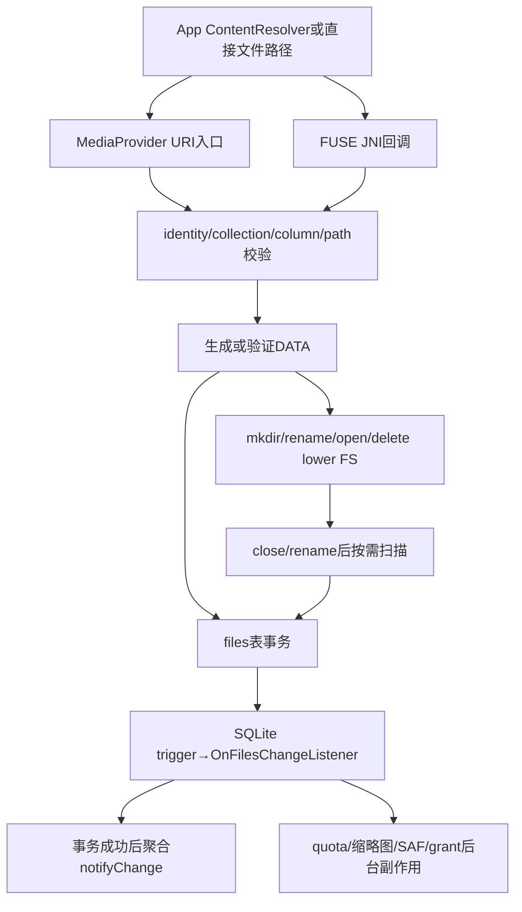
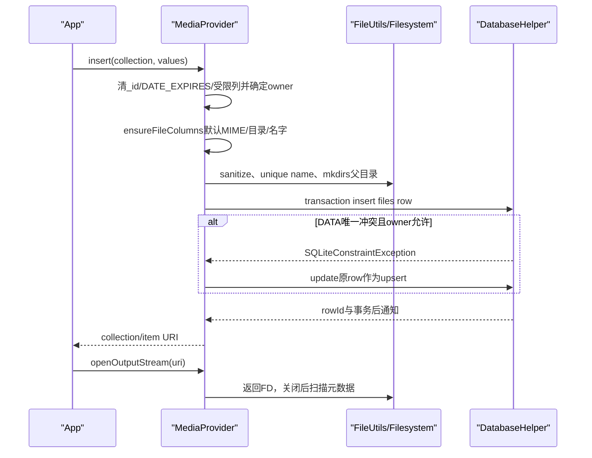
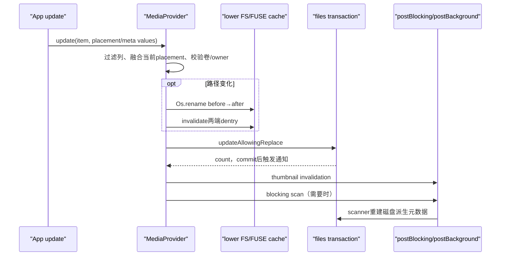

# 275 Android MediaProvider insert/update/delete、路径放置、rename事务、文件I/O与通知分发链

## 1. 本章目标

第274章从扫描器研究文件与row怎样最终收敛，本章转向一次主动写操作：insert怎样选目录与文件名，update为什么可能rename真实文件，delete如何协调实体与索引，openFile关闭后为何触发扫描，以及事务成功后通知、缩略图、quota与URI grant如何分阶段处理。

## 2. Android 11版本边界

本文基于本地`android-11.0.0_r48`。后续MediaProvider可能修复这里记录的非原子窗口、TODO和兼容分支；尤其不要把本章的raw DATA兼容、旧target replace和typed open TODO推断为新版本仍相同。

## 3. 写MediaStore不是只写SQLite

一次insert可能创建父目录但不创建目标文件；一次update可能先在lower filesystem执行rename；一次delete可能先尝试unlink再删row；一次写FD关闭后又扫描元数据。ContentProvider的返回值只描述当前API阶段，不代表磁盘与索引已经永久、原子地一致。

## 4. 两类入口必须分开

ContentResolver的insert/update/delete/openFile从URI和ContentValues进入；直接路径create/delete/rename从FUSE JNI回调进入。两者复用路径、owner、数据库和通知设施，但操作顺序不同，特别是rename事务不能混为一条流程。

## 5. 本章源码地图

```text
packages/providers/MediaProvider/src/com/android/providers/media/MediaProvider.java
packages/providers/MediaProvider/src/com/android/providers/media/DatabaseHelper.java
packages/providers/MediaProvider/src/com/android/providers/media/util/FileUtils.java
packages/providers/MediaProvider/src/com/android/providers/media/util/SQLiteQueryBuilder.java
packages/providers/MediaProvider/src/com/android/providers/media/scan/ModernMediaScanner.java
packages/providers/MediaProvider/apex/framework/java/android/provider/MediaStore.java
packages/providers/MediaProvider/jni/MediaProviderWrapper.cpp
```

## 6. 五类状态变化

本章把变化拆为row列值、真实路径、文件字节、调用者owner/URI授权缓存、观察者与系统副作用五类。源码的难点不是某一类怎么改，而是失败发生在五类变化之间时，哪些已经生效、哪些等待后台修复。

## 7. collection URI提供默认政策

Images、Video、Audio、Downloads和Files URI不只是SQL view名，它们还决定默认MIME、media_type、默认目录和允许的顶级目录。向Images插audio MIME会在`ensureFileColumns()`中失败，而generic Files允许的类型更宽。

## 8. raw DATA与现代列模型

现代调用推荐DISPLAY_NAME、MIME_TYPE、RELATIVE_PATH，让MediaProvider生成DATA；raw DATA是兼容与内部入口。insert、update对DATA的放行条件并不完全相同，所以不能只记“MANAGE可以写任意路径”一句口号。

## 9. 原子性的真实边界

SQLite事务只能回滚row，不能自动撤销`mkdirs()`、`Os.rename()`或`File.delete()`。MediaProvider通过先检查、恰当排序、FUSE cache invalidation、扫描器和idle maintenance降低裂缝，但并未创造跨VFS与SQLite的分布式事务。

## 10. 总体写链



## 11. insertInternal先处理控制URI

media_scanner URI用于开始扫描状态，volumes URI用于attach卷，playlist members会改真实playlist文件。只有普通媒体插入才进入helper、query builder和`insertFile()`；读代码时先看URI match，不能假定所有insert都插files表。

## 12. _id由Provider控制

传入ContentValues的`_id`首先移除，常规App不能自行挑row id。FUSE删除/重建为兼容路径替换时有专门的`_GET_ID`恢复机制，那是DatabaseHelper内部受控例外，不是公开insert能力。

## 13. DATE_EXPIRES同样由Provider控制

`computeDateExpires()`先删调用方传入的DATE_EXPIRES，再由IS_PENDING或IS_TRASHED计算7天/30天期限或置null。这里和第274章一致：状态可请求，到期秒不能由普通App任意指定。

## 14. insert时raw DATA的放行矩阵

self/scanner、legacy write和MANAGE_EXTERNAL_STORAGE调用者可保留传入DATA；其他调用者的raw path会被记录警告后移除，再按RELATIVE_PATH与DISPLAY_NAME生成。MANAGE在insert分支明确存在，不能套用update的不同条件。

## 15. IS_DOWNLOAD不能由普通App伪造

非self调用者传来的IS_DOWNLOAD被移除，随后`maybeMarkAsDownload()`根据最终DATA是否位于Download路径计算。Downloads collection是路径与数据库标志的组合，不能只靠写一个布尔列把任意文件变成下载项。

## 16. 经纬度列在R不再保存

insert/update看到LATITUDE、LONGITUDE便写null。对target Q及以下还移除已经在R废弃的primary_directory、secondary_directory兼容列；现代放置统一围绕RELATIVE_PATH。

## 17. insert的owner规则

self或shell可显式给owner，缺失时从Android/media等路径猜；delegator可代表另一App给owner，缺失时回退Binder package；普通远端调用者不能直接控制OWNER_PACKAGE_NAME，Provider强制为真实calling package。

## 18. owner不是文件inode uid

它是MediaStore对象级所有权，影响无需广泛collection权限的访问、pending发布与冲突upsert。文件系统上的Linux uid、FUSE calling uid和row owner相互关联，但不是同一字段的三个名字。

## 19. collection分派到insertFile

image/audio/video/downloads/files/playlist先补owner和download状态，再给`insertFile(qb, helper, match, uri, extras, values, mediaType)`。thumbnail与album art有专门权限和列投影逻辑，不完全沿普通媒体路径。

## 20. ensureFileColumns是放置核心

它为不同URI设置默认MIME、默认media type、默认primary目录与allowedPrimary集合；随后处理raw DATA、MIME、DISPLAY_NAME、RELATIVE_PATH、唯一文件名、路径合法性、父目录和派生列。

## 21. Audio的目录集合

Audio默认`audio/mpeg`与Music，可放Alarms、Audiobooks、Music、Notifications、Podcasts、Ringtones。这个集合表达媒体用途组织，不代表拥有音频权限的App自动获得这些目录里每个既有对象的写权。

## 22. Video与Images目录集合

Video默认`video/mp4`与Movies，可放DCIM、Movies、Pictures；Images默认`image/jpeg`与Pictures，可放DCIM、Pictures。collection类型与top-level目录必须匹配，否则现代insert抛IllegalArgumentException。

## 23. Downloads与Files默认

Downloads只允许Download作为常规primary；generic Files默认允许Download和Documents，并能根据MIME把playlist/subtitle扩展到Music/Movies。Files更通用，但不是“任意外部路径”免检入口。

## 24. internal不能由普通写入创建路径

当DATA为空且resolved volume为internal时直接抛UnsupportedOperationException。internal.db主要索引系统内置媒体资源，不是让App借MediaStore往只读系统媒体目录创建新文件的目标。

## 25. raw DATA先反推其他列

若调用者被允许提供DATA，`computeValuesFromData()`从路径重算volume_name、relative_path、display_name、bucket、pending/trashed与expires。Provider不会盲信同时给出的矛盾RELATIVE_PATH。

## 26. MIME缺失的target差异

target R及以上先尝试由DISPLAY_NAME扩展名推导，失败才用collection默认；旧target在具体媒体collection偏向保留历史默认行为。generic Files的默认media type为NONE，处理又有所不同。

## 27. 不支持的MIME

具体collection收到无可识别扩展的unsupported MIME时，若文件扩展名能推到同类media type则采用扩展名结果；仍无法合理推断时，target R+抛错，旧target退回默认MIME。

## 28. MIME必须匹配collection

最终解析出的media type若与Images/Video/Audio默认类型不同，Provider抛“expected image/*”等错误。这样调用者不能把MP3塞进Images URI，再依赖扫描器事后纠正collection。

## 29. DISPLAY_NAME缺失的默认

若仍为空，Provider用当前毫秒时间的字符串作为名字。它保证路径生成有叶子节点，但生成的名字是否带扩展名还由MIME与`splitFileName()`决定。

## 30. RELATIVE_PATH缺失的默认

普通媒体使用各自defaultPrimary并保证末尾`/`；thumbnail可能附加`.thumbnails/` secondary。路径段会经过FAT兼容字符清洗，非FUSE调用还会改写隐藏名字，降低App无意创建隐藏媒体的风险。

## 31. pending/trash改变真实文件名

非FUSE路径下，pending或trash会把DISPLAY_NAME编码为`.pending-到期-原名`或`.trashed-到期-原名`生成DATA；row仍保存用户可理解的DISPLAY_NAME。发布/恢复时重新计算路径并触发rename。

## 32. MIME决定默认扩展名

`buildUniqueFile()`先用MIME拆分文件名；已有扩展不匹配时可能把它视为basename的一部分并追加MIME默认扩展。比如名字看似有后缀，并不保证Provider原样保留。

## 33. 唯一名字的普通策略

若目标已存在，普通目录依次尝试原名、`name (1)`等，迭代上限32。返回的DATA与DISPLAY_NAME会再由最终路径重算，App应以insert结果查询为准，不应假定请求名就是落盘名。

## 34. DCIM命名有特殊序列

`ABCD0001`式DCF严格名可递增到9999，`IMG_日期_时间`式宽松名使用`~2`等最多99；其他名字才走括号编号。这是相机生态兼容，不是全目录统一算法。

## 35. update重算时先可非唯一probe

路径移动先用`buildNonUniqueFile()`计算probe，判断路径是否真的变化、卷和owner边界是否改变；确认要移动后再用unique版本求最终目的地。两阶段避免仅为比较就提前换成另一个唯一名。

## 36. 未改变父目录可以原地改名

`currentPath`存在时，生成结果父目录与旧父目录相同会先被视为valid。这允许修改DISPLAY_NAME而不要求重新通过顶级目录列表；跨目录时才依次检查allowed primary、related URI等扩展规则。

## 37. related URI放置例外

extras可带QUERY_ARG_RELATED_URI。若关联对象与新对象顶级MIME相同且RELATIVE_PATH完全相同，允许放在关联项目录；典型用途是让衍生内容贴近原对象，同时防止用不相关URI任意穿越目录政策。

## 38. 自己的Android/media目录

若目的路径能解析出package owner，位于external media directory且属于calling shared packages，也可作为validPath。这里特指Android/media共享媒体目录，不是Android/data或obb私有目录。

## 39. MANAGE的放置扩张

前述规则都未放行时，manager可在更广外部共享路径创建文件。但路径仍要在目标volume扫描根、名称可清洗且不能穿透其他App私有data/obb隔离；“更广”不是任意系统路径。

## 40. system gallery扩展

system gallery可在已有目录创建image/video，也可在已有顶级目录下建子目录，但不能凭此创建非默认顶级目录。检查还调用`canAccessMediaFile(..., allowLegacy=false)`，保持媒体类型范围。

## 41. 父目录可能在insert前创建

路径通过后调用`mkdirs()`并确认父目录存在，随后才写row。若后续数据库insert失败，刚创建的空目录不会被SQLite自动回滚，这是第一类VFS/DB非原子窗口。

## 42. raw DATA仍做卷边界检查

不走路径生成时，`assertFileColumnsSane()`canonicalize实际DATA并确认它位于目标volume的允许扫描路径。拥有raw path权限也不能拿external_primary URI指向另一个卷或内部任意路径。

## 43. insertFile补齐通用派生列

它再次计算bucket、DATE_ADDED、title、format、MIME和media_type；目录设FORMAT_ASSOCIATION并清MIME。若目标文件已经存在，还从磁盘读取DATE_MODIFIED和缺失的SIZE。

## 44. insert row不一定创建目标文件

普通媒体insert主要预留路径并插入row，文件字节通常由调用者随后`openOutputStream(uri)`写入。playlist是显式例外：远端新建playlist后Provider会touch空文件，便于之后rename与成员持久化。

## 45. parent row与目录缓存

事务中若PARENT未给出，`getParent(db,path)`查找或建立父目录row。FORMAT_ASSOCIATION插入后还缓存path→rowId，加快大批扫描；deleteRecursive会清这个缓存防止引用陈旧目录id。

## 46. double insert的受限upsert

先正常insert；若DATA唯一约束冲突，Provider仅在已有row owner属于calling shared packages，或delegator代表的owner时，改为定点update并返回原id。它解决“先直接路径创建、后ContentResolver insert”的双入口重复。

## 47. 冲突不是无条件覆盖

路径相同但owner不匹配时重新抛SQLiteConstraintException。否则恶意App可以选择受害者已存在路径，用insert把其row字段和owner覆盖。

## 48. insert完整流程



## 49. 返回URI保留原请求volume语义

数据库操作用resolved volume路由，但最终URI常在调用者原collection URI后追加rowId。`external`合成名写入时实际解析primary，返回形态仍兼容调用者使用方式。

## 50. update先safeUncanonicalize

canonical URI先还原为真实item URI，再match collection。某些旧Google Camera target Q兼容还会把image/video item URI转generic files URI；这类包名特判是历史兼容，不是通用设计模式。

## 51. update也移除_id并重算expires

row id不可改，DATE_EXPIRES由pending/trash状态派生。即使selection匹配多行，调用者也不能把它们迁移到另一个id空间。

## 52. update的raw DATA权限更窄

对sDataColumns，update只明确放行self与legacy write；与insert不同，这里没有manager分支。manager可以通过现代placement columns触发受控移动，但不能据此断言其任意raw DATA update总会保留。

## 53. owner转移规则

self与shell可改owner；delegator只有在当前row owner为空，或当前owner属于delegator shared package时才可转给proposed owner；其他调用者传OWNER_PACKAGE_NAME会被移除。转移权限不是普通对象写权限的附赠能力。

## 54. scanner元数据列默认只读

非self update遍历所有列，只有`sMutableColumns`可正常修改。扫描器控制的title、duration、宽高等列若对象已发布会被忽略并设置triggerScan，因为App改数据库却不改文件，下一次扫描也会覆盖。

## 55. mutable列清单

包括DATA、RELATIVE_PATH、DISPLAY_NAME、IS_PENDING、IS_TRASHED、IS_FAVORITE、OWNER_PACKAGE_NAME、部分bookmark/tags/category、playlist成员、download来源、MIME与MEDIA_TYPE。列在清单内仍需通过owner、权限和路径规则，不代表所有App可任意写。

## 56. pending期间放宽元数据

若单个item仍pending，非mutable列也可被生产者填写；发布前文件可能尚未具备可扫描的最终元数据。待IS_PENDING清零时Provider强制扫描，以磁盘内容成为发布后的可信索引。

## 57. 发布会破坏no-op快路

看到IS_PENDING列便设置triggerScan，并把DATE_MODIFIED、SIZE显式置null。这样ModernMediaScanner不会因mtime/size看似相同直接skip，能重新读取Retriever/EXIF/XMP并清理临时值。

## 58. location列继续置null

update传入LATITUDE/LONGITUDE会被清空，不再把位置元数据作为普通可写数据库列。原始图片位置的访问控制走ACCESS_MEDIA_LOCATION与内容redaction，而不是信任App改两列。

## 59. placement columns触发移动

DATA、RELATIVE_PATH、DISPLAY_NAME、MIME_TYPE、IS_PENDING、IS_TRASHED、DATE_EXPIRES属于placement。只要更新触及它们、未直接给DATA、不是thumbnail且allowMovement，就进入当前值融合与路径重算。

## 60. allowMovement的默认值

extras的QUERY_ARG_ALLOW_MOVEMENT默认是`!isCallingPackageSelf()`：外部App更新placement默认允许受控移动，scanner/self update默认不移动。内部扫描只应更新索引，不应因解析字段又rename用户文件。

## 61. movement只支持单item集合

Audio/playlist/video/image/download/files的ID URI允许；非明确定义collection或批量selection尝试移动会抛错。移动需要唯一旧路径，不能把一组不同对象融合成一个目标DATA。

## 62. 先读取并融合当前列

Provider以内置identity从generic Files item查询所有placement列，只用当前值补调用者未提供的键。这样只改DISPLAY_NAME时仍保留原RELATIVE_PATH、MIME、pending/trash状态，才能完整计算新路径。

## 63. 禁止跨volume移动

probe路径与beforePath的volume name必须相同，否则抛IllegalArgumentException。MediaStore update使用`Os.rename()`，它不是跨文件系统copy+delete API；跨卷迁移需要应用显式复制内容并删除原对象。

## 64. 禁止改变路径owner域

从路径提取的beforeOwner与probeOwner必须相等，避免通过改RELATIVE_PATH把公共文件塞入另一包Android/media，或把包域内容转出而绕过owner政策。

## 65. 最终目标再次唯一化

确认路径确实变化、卷与路径owner不变后，重新用unique模式生成afterPath。若同名已存在可能得到`(1)`等名字；数据库最终写的是实际afterPath派生的DISPLAY_NAME。

## 66. 普通update先rename再改row

movement分支先执行`Os.rename(beforePath, afterPath)`并invalidate两端FUSE dentry，之后才走`updateAllowingReplace()`写数据库。这里没有一个能同时覆盖VFS与SQLite的事务。

## 67. 旧文件ENOENT仍继续

rename返回ENOENT时只记录“Missing file; continuing anyway”，仍把DATA设为afterPath并继续数据库update。它偏向让row反映请求的新位置，后续扫描再处理实际缺失；其他errno则抛IllegalStateException。

## 68. 普通移动的失败裂缝

若rename成功但后续数据库constraint或进程崩溃，文件可能已在新路径而row仍在旧路径。ModernMediaScanner的旧路径clean与新路径insert是恢复手段，因此不要描述ContentProvider movement为完全原子rename。

## 69. update前快照affected ids

路径或metadata mutation可能使原query builder以后不再匹配，所以实际update之前查询并保存id。事务后用这些id逐项invalidate thumbnail并按需要查询新DATA扫描。

## 70. update conflict replace仅给旧target

DATA唯一冲突时，target R+直接抛异常；旧target只有在冲突路径真实文件存在且冲突row属于calling shared packages时，才删冲突row并重试update。兼容replace不会覆盖陌生owner。

## 71. update、rename与后处理



## 72. postBlocking的“blocking”含义

若当前有DatabaseHelper事务，任务收集到blockingTasks，在`db.endTransaction()`之后、发送notify之前由当前线程依次运行；无事务时立即运行。发布扫描因此能在外部update返回前完成，但不在SQLite事务内部。

## 73. postBackground更晚执行

backgroundTasks在事务成功后先由ForegroundThread安排，通知全部派发后再扔给BackgroundThread。缩略图、quota、URI revoke和SAF副作用不会拖慢关键数据库锁持有时间。

## 74. scanner调用不会自激

update后scan以self identity运行，scanner自己的update会把triggerScan强制清false，避免“扫描写row→又安排扫描”的循环。它仍可触发正常数据库通知和quota副作用。

## 75. delete先处理FUSE双删兼容

如果同UID刚通过直接路径删除，FUSE侧缓存了deleted row id；App随后按item URI delete时，Provider移除缓存并返回0，不再因row不存在进入权限异常。这是重复删除兼容，不是成功删除一行。

## 76. delete对item可请求用户升级

image/video/audio item先走`enforceCallingPermission(..., forWrite=true)`；无owner或collection写权时可通过第273章的RecoverableSecurityException/用户确认获得具体URI写授权。批量generic delete不自动等价于单项升级。

## 77. 普通files删除先查实体信息

Provider查询media_type、DATA、id、is_download、MIME，清calling identity的owned id缓存，然后对每一项调用`deleteIfAllowed()`尝试删文件，再按id删row并处理playlist与downloads副作用。

## 78. deleteIfAllowed吞掉异常

它内部checkAccess后调用`deleteAndInvalidate()`，任何异常只Log错误，不向外抛；外层随后仍执行qb.delete row。因此API删除count可能增加，即使实体删除因权限、I/O或路径问题失败。

## 79. File.delete返回值也未检查

`deleteAndInvalidate(File)`直接`file.delete()`后invalidate dentry，没有判断boolean。r48因此可能产生“文件仍在、row已删”的孤儿文件，之后扫描会重新插入或其他维护收敛。

## 80. delete不是安全擦除保证

返回1表达Provider删除了匹配数据库对象，不是已验证物理块清除，更不是不可恢复擦除。对安全/隐私需求，不能把ContentResolver.delete的count当作存储介质级证明。

## 81. PARAM_DELETE_DATA=false的例外

URI明确带该参数时跳过实体遍历，直接递归删row；ModernMediaScanner reconcile使用它清“磁盘未见的旧索引”。普通App不应随意使用内部语义制造有文件无row。

## 82. parent row最后删除

实体型files删除后给query builder追加`_id NOT IN (SELECT parent...)`，`deleteRecursive()`在一个事务内反复执行相同delete，叶子先删，父目录等不再被引用时才删，避免破坏parent关系。

## 83. 为什么要循环到0

第一次delete可能只删叶子，第二次原父目录才符合ID_NOT_PARENT。循环累计count直到稳定；每轮不是重试I/O，而是按数据库依赖层级逐层剥离。

## 84. thumbnail集合先删文件

image/video thumbnails走专门分支，查询DATA逐个`deleteIfAllowed()`后再`deleteRecursive()`。album art与普通媒体在match分派上有各自规则，不能一律套files表逻辑。

## 85. 删除audio会重算playlist

外部audio row删除时查询audio_playlists_map受影响的playlist id，并调用`resolvePlaylistMembers()`。playlist真实文件仍是持久来源，内部成员表按剩余可解析音频重新建立。

## 86. Downloads删除异步通知DownloadManager

删除过程中收集download id与MIME，事务后在BackgroundThread调用`onMediaStoreDownloadsDeleted()`。注释强调不要在FUSE调用关键路径中执行额外Binder通信。

## 87. deleteRecursive清目录缓存

进入事务先清`mDirectoryCache`，防止后续insert复用已删除的parent id。缓存只是性能层，任何批量层级删除都优先保证正确性。

## 88. openFile先由row解析canonical路径

除legacy thumbnail重定向外，Provider以self identity查询DATA、owner和pending，再将DATA转canonical File；恢复调用者identity后执行`checkAccess()`。内部查询不受调用者collection过滤干扰，真正授权仍针对原calling identity。

## 89. 写模式会升级为rw位

若parseMode含WRITE_ONLY，代码额外OR READ_WRITE，以便`shouldOpenWithFuse()`取得写锁语义。对App请求的高层mode而言仍是写操作，这个内部升级用于协调upper/lower cache，不表示授予了额外URI读权限。

## 90. pending owner检查有FUSE例外

普通隐藏文件名pending只允许owner交互；FUSE pending没有`.pending-*`文件名，open时跳过这项owner强制检查，依赖FUSE创建链的其他政策。两种pending物理表示再次影响授权路径。

## 91. open仍执行对象与路径授权

`checkAccess(uri, extras, file, forWrite)`结合URI grant、owner、媒体权限和路径限制。能query到row并不自动能open；反之具体URI用户授权可只开放这一对象。

## 92. redaction在open时决定

非owner且缺ACCESS_MEDIA_LOCATION时求EXIF redaction ranges；requireOriginal为true则直接拒绝。新FUSE通过upper FD在FUSE handler中脱敏，旧路径使用RedactingFileDescriptor。

## 93. 无redaction时先开lower FD

Provider先`openSafely(lower)`，再询问该卷FuseDaemon是否因已有upper VFS cache而应走FUSE。若需要便改开`/mnt/user/...` upper并关闭lower，避免upper/lower page cache不一致造成损坏。

## 94. lower写入前invalidate dentry

若最终使用lower FD且forWrite，先invalidate FUSE dentry，让后续upper stat/open不继续看到dirty dentry或陈旧page cache。来自FUSE线程本身则不应递归invalidate，否则会崩溃。

## 95. 非pending写FD关闭后扫描

Provider用`ParcelFileDescriptor.wrap()`挂OnCloseListener：无论远端writer是否声称异常，都invalidate thumbnails/dentry；普通媒体按需scanFile，thumbnail则直接更新宽高。close完成是元数据收敛触发点。

## 96. pending写入不挂close listener

条件是`!isPending && forWrite`才wrap。pending生产阶段可以多次写，不必每次关闭就公开扫描；当App把IS_PENDING改0发布时，update链会强制blocking scan。

## 97. 只读open没有写后扫描

listener虽创建，但最终只有forWrite才wrap。读操作不应改变mtime/metadata，也无需引发扫描风暴；redaction与upper/lower选择仍然执行。

## 98. typed open的r48 TODO

`openTypedAssetFileCommon()`源码留有“TODO: enforce that caller has access to this uri”，但缩略图和最坏情况下的underlying file最终又会进入ensureThumbnail/openFileCommon各自路径。应记录TODO边界，而非断言typed open完全无权限。

## 99. FUSE rename先做路径级拒绝

它先拒其他包private path，清洗newPath非法字符；database bypass UID可直接lower rename，具备双端restriction bypass者走unchecked但仍更新数据库。普通legacy请求到此若没有所需存储权会EACCES。

## 100. 默认目录与Android目录保护

不能rename顶级默认目录，不能把对象移到存储根，不能rename Android/media本身，也不能移动到Android下除media之外的目录。data/obb本就bind mount不经过这条FUSE rename。

## 101. 新路径必须支持MIME

单文件checked rename由newPath解析MIME，并根据Audio/Video/Images collection规则验证；把MP3移动到只支持图片的顶级目录会EPERM。目录rename则检查树内每个已索引非目录文件。

## 102. FUSE单文件rename的顺序

DatabaseHelper beginTransaction后先把旧path row更新为新DATA/MIME/media_type；发生目标DATA唯一冲突时，只有对目标有delete写权才删冲突row重试。然后执行lower `Os.rename()`，成功才`setTransactionSuccessful()`。

## 103. lower rename失败会回滚row

errno非0时不标成功，finally endTransaction使SQLite更新回滚。因此相比普通ContentProvider movement，它更好地保证“文件没动则row也不动”；但lower rename已经成功后若进程在标记/提交附近崩溃，VFS仍不能由SQLite反向回滚。

## 104. replace目标的owner保护

若目标路径已有row导致constraint，query builder delete必须允许calling identity删除目标；bypass restrictions路径若更新失败，还会尝试清目标owner，避免被替换文件的旧owner继续访问新内容。

## 105. r48用字符串null的实现细节

`maybeRemoveOwnerPackageForFuseRename()`把OWNER_PACKAGE_NAME写成字符串`"null"`，trigger也用`ifnull(...,'null')`序列化。阅读时要区分Java/SQL真实NULL与这个哨兵字符串；这是源码事实，不应美化为严格类型化owner状态。

## 106. 目录rename先验证整棵已索引文件

若调用者没有默认collection全权，源码先用普通query计数全部文件，再用TYPE_UPDATE权限query计数可写文件；数量不同即拒绝。随后逐个检查新路径是否支持原MIME，任何一项失败整个rename返回EPERM。

## 107. 目录row不在批量更新列表

源码注释明确只更新目录下mime_type非null文件，不更新目录row；lower目录rename成功、DB事务提交后，再扫描oldPath清陈旧目录row并扫描newPath补目录及hidden/media type变化。

## 108. .nomedia改名必须额外扫描

单文件rename若源或目标display name是`.nomedia`，扫描对应父目录。因为增加/移除标记会改变整目录内容是否hidden，单独更新这一个row不足以修正所有子文件media_type。

## 109. SQLite trigger把row变化变成事件

files表AFTER INSERT/UPDATE/DELETE trigger调用`_INSERT/_UPDATE/_DELETE`自定义函数，传volume、id、media type、download、owner和old path。DatabaseHelper的OnFilesChangeListener由此统一处理直接SQL builder、scanner与FUSE rename产生的变化。

## 110. 通知会扩展到多种URI

`acceptWithExpansion()`把具体media collection、generic Files、Downloads及具体volume到external合成视图展开。media type改变时update会通知旧collection，也通知新collection，观察者才知道对象“离开一处、进入另一处”。

## 111. 阅读完成检查

你应能说明insert为什么可能只建row不建文件、DATA与RELATIVE_PATH怎样变成唯一路径、普通update与FUSE rename的操作顺序差异、delete为何可能留下孤儿文件、open写关闭后何时扫描，以及事务成功后blocking/notify/background的先后。

## 112. macOS只读练习一：手算insert路径

```bash
cd /Users/ninebot/androidSource
sed -n '2380,2735p' packages/providers/MediaProvider/src/com/android/providers/media/MediaProvider.java
sed -n '2970,3165p' packages/providers/MediaProvider/src/com/android/providers/media/MediaProvider.java
sed -n '530,675p' packages/providers/MediaProvider/src/com/android/providers/media/util/FileUtils.java
```

分别推演Images插入`cat`+image/jpeg、同名冲突、IS_PENDING=1、错误audio MIME和提供raw DATA五种输入，写出最终目录、名字、owner、row与目标文件是否已经存在。

## 113. macOS只读练习二：比较两种rename

```bash
cd /Users/ninebot/androidSource
sed -n '5200,5335p' packages/providers/MediaProvider/src/com/android/providers/media/MediaProvider.java
sed -n '1580,1985p' packages/providers/MediaProvider/src/com/android/providers/media/MediaProvider.java
```

画出ContentProvider placement update与FUSE file/directory rename的“检查、改DB、改FS、提交、扫描”顺序；分别标出rename成功后数据库失败和lower rename失败时可能留下的状态。

## 114. macOS只读练习三：审计delete返回值

```bash
cd /Users/ninebot/androidSource
sed -n '4250,4480p' packages/providers/MediaProvider/src/com/android/providers/media/MediaProvider.java
sed -n '6165,6205p' packages/providers/MediaProvider/src/com/android/providers/media/MediaProvider.java
```

假设checkAccess抛异常、File.delete返回false、PARAM_DELETE_DATA=false、目录有child四种情况，逐项判断实体、row、delete count、parent cache与后续扫描会怎样变化。

## 115. macOS只读练习四：追事务后副作用

```bash
cd /Users/ninebot/androidSource
sed -n '585,675p' packages/providers/MediaProvider/src/com/android/providers/media/MediaProvider.java
sed -n '450,545p' packages/providers/MediaProvider/src/com/android/providers/media/DatabaseHelper.java
sed -n '600,700p' packages/providers/MediaProvider/src/com/android/providers/media/DatabaseHelper.java
```

从SQLite trigger进入OnFilesChangeListener，列出blockingTasks、notifyChanges、backgroundTasks在commit成功/回滚/无活动事务三种情况下的执行顺序，并找出quota、thumbnail、SAF和URI revoke分别在哪一层。

## 116. 易混点一：insert成功不等于文件已写好

普通MediaStore insert通常只是分配安全唯一路径、写row并返回URI；App还要打开URI写字节，再发布pending。只有目录mkdir、playlist touch等分支会在insert阶段改变具体实体。

## 117. 易混点二：delete count不证明物理删除

r48的deleteIfAllowed吞异常，File.delete boolean也未检查，row仍可被删除。count应理解为数据库对象变化，文件/row偏差由scan最终修复，不能作为安全擦除证明。

## 118. 易混点三：两种rename的“事务”不同

ContentProvider movement先rename文件再开数据库update事务；FUSE rename在DatabaseHelper事务内先尝试row更新、再rename lower、成功才提交。后者改善失败对齐，但任何一方都没有让VFS真正加入SQLite事务。

## 119. 复读纠偏记录

复读后修正十点：insert与update的raw DATA权限矩阵不同；MANAGE只在insert raw path分支明确放行；ensureFileColumns可能先mkdir后DB失败；普通insert不创建媒体字节；double insert upsert要求owner匹配；pending发布通过清mtime/size强制扫描；普通movement先FS后DB且ENOENT继续；delete可能吞I/O失败仍删row；FUSE rename以DB事务包围lower rename但非跨系统原子；`"null"`owner哨兵与SQL NULL不可混淆。

## 120. 本章小结与下一章

MediaProvider写链把URI collection、owner与现代placement列翻译为受控路径，借SQLite事务维护row和通知，却只能以顺序、缓存失效与扫描来协调真实文件系统。理解insert不等于写字节、update与FUSE rename顺序不同、delete可能只成功删row，才能正确分析崩溃恢复。下一章继续研究MediaProvider query、SQLiteQueryBuilder、projection、owner/permission过滤、pending/trashed匹配与canonical URI链。
