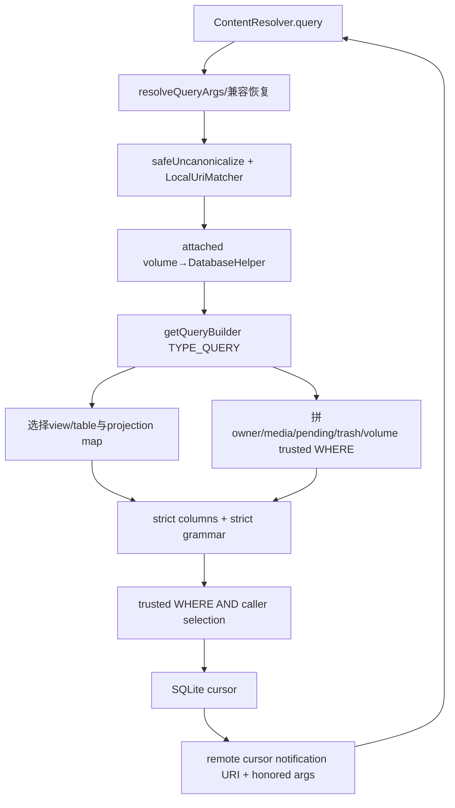
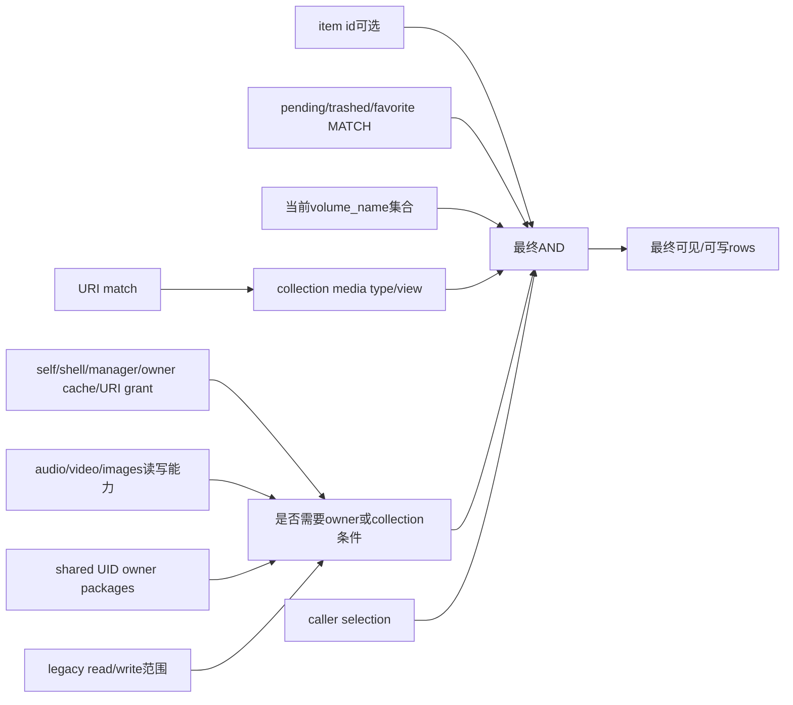
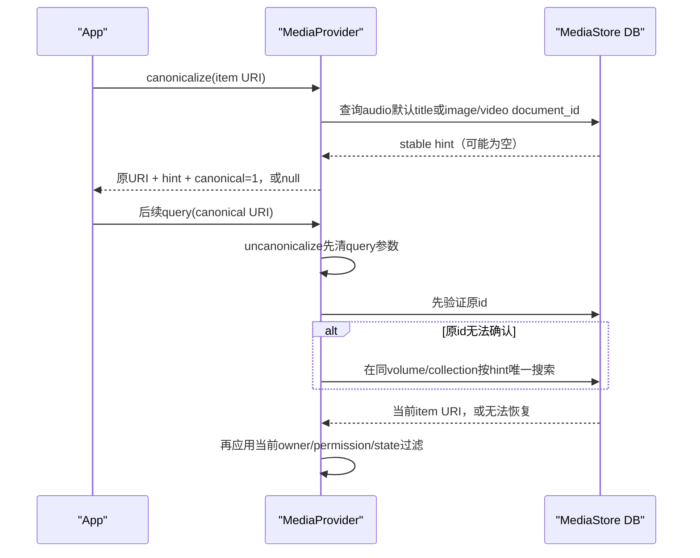

# 276 Android MediaProvider query、SQLiteQueryBuilder、projection、owner权限过滤、pending/trashed匹配与canonical URI链

## 1. 本章目标

第275章研究写入，本章回答读取端最常见的疑问：为什么同一条MediaStore query在不同App得到不同row，projection和selection怎样防SQL越权，pending/trashed/favorite的MATCH参数怎样变成WHERE，以及canonical URI在row id变化后如何尝试找回对象。

## 2. Android 11版本边界

本文只依据本地`android-11.0.0_r48`。Android 13后的READ_MEDIA_*公开权限名称、Photo Picker与新媒体政策不属于本章；r48源码内部已经按audio/video/images能力拆分，但对App公开的Android 11权限语境仍要结合READ/WRITE_EXTERNAL_STORAGE与AppOps理解。

## 3. query的核心不是“先查再检查”

MediaProvider主要把权限直接编码进SQLiteQueryBuilder的trusted WHERE：无全局或collection权限时，只让SQL返回owner行或有限兼容行。这样Cursor从源头不包含越权row，比先查全表再在Java逐行过滤更安全也更省内存。

## 4. 过滤结果与拒绝不同

查询collection时，权限不足常表现为空Cursor或只见自有内容，而不是SecurityException；open、update、delete具体对象时才可能强制授权并抛异常。调试“查不到”必须先看WHERE政策，不要只搜索throw语句。

## 5. 本章源码地图

```text
packages/providers/MediaProvider/src/com/android/providers/media/MediaProvider.java
packages/providers/MediaProvider/src/com/android/providers/media/DatabaseHelper.java
packages/providers/MediaProvider/src/com/android/providers/media/util/SQLiteQueryBuilder.java
packages/providers/MediaProvider/src/com/android/providers/media/util/SQLiteTokenizer.java
packages/providers/MediaProvider/src/com/android/providers/media/util/DatabaseUtils.java
packages/providers/MediaProvider/apex/framework/java/android/provider/MediaStore.java
```

## 6. 查询的六层约束

依次是authority/URI match、attached volume、table/view、projection白名单、trusted权限WHERE、caller selection的strict grammar。pending/trashed、volume、owner与media type都在trusted层，用户selection只能继续收窄，不能用OR跳出外层括号。

## 7. URI同时决定表和行

Images collection选择images view，Images item还追加`_id=?`；Files选择files，Downloads选择downloads view。path segment由LocalUriMatcher解析，调用者不直接提交FROM表名。

## 8. query与write使用同一builder工厂

`getQueryBuilder(type, match, uri, extras)`也服务insert/update/delete。TYPE_QUERY令forWrite=false，其他类型为true；同一collection因此会按读能力或写能力生成不同owner过滤。

## 9. 权限最终是SQL的AND项

MediaProvider内部用`appendWhereStandalone()`把每个可信条件包在括号中并用AND连接；SQLiteQueryBuilder最后再把这些internal clauses整体与caller selection用AND组合。

## 10. query总流程



## 11. 两个query重载先统一Bundle

旧式projection/selection/args/sortOrder由`DatabaseUtils.createSqlQueryBundle()`转换，最终都进入`queryInternal(uri, projection, queryArgs, signal)`。后续group、limit、sort和MATCH参数因此有统一解析路径。

## 12. null queryArgs变空Bundle

Provider不在每个分支处理null，而是一开始标准化为空Bundle；随后移除只允许内部使用的INCLUDED_DEFAULT_DIRECTORIES，防止外部App伪造FUSE目录rename使用的扩大范围。

## 13. 高级query args先降为SQL形式

`resolveQueryArgs()`优先处理QUERY_ARG_GROUP_COLUMNS、SORT_COLUMNS/DIRECTION/LOCALE、LIMIT/OFFSET等结构化参数，再写入统一的SQL group/sort/limit键。它同时记录真正honored的参数名供Cursor extras返回。

## 14. selection与selectionArgs总被标记honored

这两个基础参数无论是否为空都进入honored集合；group、sort、limit则根据调用者用了结构化还是raw SQL版本记录对应key。客户端可从EXTRA_HONORED_ARGS判断Provider实际理解了哪些请求。

## 15. custom collator受控创建

sort locale可以让Provider创建名字形如`custom_*`的ICU collation；SQLiteTokenizer只允许符合专门pattern的collator token。调用者不能通过COLLATE后任意拼SQL标识符。

## 16. query先safeUncanonicalize

带canonical标记的URI会先尝试恢复当前item id；失败时`safeUncanonicalize()`保留原URI继续查询。这样canonical只是尽力重定位，不会因辅助信息失效就让所有API立刻拒绝解析。

## 17. 三类控制query绕过普通数据库路由

MEDIA_SCANNER返回当前扫描volume的MatrixCursor，FS_ID返回旧音乐App需要的volume id，VERSION返回数据库schema版本。它们不是files/view查询，也不经过正常projection policy。

## 18. 普通URI必须通过attached门

控制URI之后调用`getDatabaseForUri()`，先确认resolved volume在mAttachedVolumeNames，再选internal/external helper。external.db里保留历史row不意味着能绕过卸载状态查询。

## 19. LocalUriMatcher决定allowHidden范围

`allowHidden`实际只有MediaProvider self才为true；普通App不能选择内部隐藏URI match。调用者自报selection无法改变URI match结果。

## 20. 每个builder默认strict parentheses

`qb.setStrict(true)`让SQLiteQueryBuilder同时编译unwrapped query并执行把不可信selection/having包入额外括号的wrapped query，检测通过语法逃出表达式边界的注入尝试。

## 21. 外部调用再启用strict columns

非self builder设置targetSdk、`setStrictColumns(true)`与`setStrictGrammar(true)`；scanner/self可以使用内部列与可信SQL。系统内部豁免依赖真实LocalCallingIdentity，不是URI参数。

## 22. projection map是强制安全条件

每个支持的URI match结束前都必须配置projection map，否则抛IllegalStateException。map把公开列名映射到真实列或安全表达式，并在join中消除歧义。

## 23. projection map来自@Column契约

DatabaseHelper反射MediaStore contract class的public fields，只收`_ID`或带`@Column`注解的字段并缓存。它把框架公开API声明转成Provider允许查询的列集合，减少手工清单漂移。

## 24. projection为null不是SELECT任意星号

有projection map时，`computeProjection(null)`返回map中的全部映射列并排除`_count`。因此“null projection”是全部公开列，而不是暴露底层表中新加的私有列。

## 25. 聚合函数也受白名单限制

builder只识别AVG、COUNT、MAX、MIN、SUM、TOTAL、GROUP_CONCAT、UNICODE这组aggregation pattern，括号内仍必须映射到允许列。`COUNT(secret_column)`不会因外层函数合法就穿透projection。

## 26. alias并非现代调用者任意开放

strict flags存在时，普通`column AS alias`只有projection map或允许aggregation能成功；旧target的projection greylist才为具体历史表达式开窄口。现代App应使用标准列和Bundle query args。

## 27. target Q前的projection灰名单

target<Q可放行特定列、聚合、case表达式、旧content字符串和文件名前字符等regex，并记录warning。它是按已知兼容bug枚举，不是关闭strict mode。

## 28. strict grammar拒绝跨clause token

selection/group/having/order/limit经SQLiteTokenizer检查，SELECT、FROM、WHERE、GROUP、HAVING、WINDOW、VALUES、ORDER、LIMIT等能创建子查询或跳转clause的token被明确禁止。

## 29. 合法token的范围

公开table/column、受控custom collator、SQLite函数、类型和大部分无害keyword可通过。target<R还有三条非常窄的历史token pattern，例如特定扩展名和GoPro package字符串。

## 30. selectionArgs仍是绑定值

Provider的可信条件通过`DatabaseUtils.bindSelection()`生成安全SQL文字，调用者selection的动态数据应放selectionArgs。strict grammar不是鼓励拼接字符串，而是绑定之外的第二道防线。

## 31. trusted WHERE不接受caller覆盖

`computeWhere()`形成`(internalPolicy) AND (callerSelection)`。即使selection写`1=1 OR ...`，它也只在自己的括号内为真，无法取消owner、volume和pending条件。

## 32. target R前恢复ORDER BY中的LIMIT

旧App把`LIMIT`塞进sortOrder，Provider识别后拆到QUERY_ARG_SQL_LIMIT；URI query parameter里的limit也可恢复。target R+不再迁就，应使用正式query args。

## 33. target Q前恢复更多滥用

旧App在WHERE尾拼GROUP BY，或在projection第一列写`DISTINCT `，Provider分别拆分并设置builder distinct。兼容发生在trusted builder已构造后，仍受projection与strict SQL验证。

## 34. 旧thumbnail query还有MatrixCursor补丁

target<Q按特定`_id=数字`selection查询旧thumbnail表时，Provider可能不查表，直接返回指向现代`.../thumbnail`编码文件的DATA。它服务忽略getThumbnail返回Bitmap的旧App。

## 35. distinct URI参数也能设置

builder读取`distinct=true` query parameter。它只影响SELECT DISTINCT，不扩大projection或WHERE；去重不是权限能力。

## 36. 真正执行由helper包装

`qb.query(helper, projection, queryArgs, signal)`使用DatabaseHelper的锁/连接策略执行。CancellationSignal一路传给SQLite验证与query，长查询可在客户端取消。

## 37. 只有远端Cursor配置notification URI

结果将离开MediaProvider进程且当前不是FUSE线程时，才`setNotificationUri(resolver, uri)`。内部scanner本地query不需要跨进程观察通知，省去无意义开销。

## 38. Cursor extras返回honored args

Provider把honoredArgs数组写入`ContentResolver.EXTRA_HONORED_ARGS`。这不是结果数据列，也不表示每个条件匹配了row，只说明参数语义被Provider处理。

## 39. external查询展开当前具体卷

URI volume为`external`时，includeVolumes取`getExternalVolumeNames()`当前集合；具体卷则只bind该名字。最终常追加`volume_name IN (...)`，把external合成view限制在当前挂载卷。

## 40. includeAllVolumes默认false

r48这段builder中变量初始化false，普通media/files/downloads都会追加volume过滤。即使external.db保存recent卷row，聚合query也不返回已弹出卷的历史项。

## 41. 源码保留unmounted TODO

builder附近有“TODO: throw when requesting a currently unmounted volume”，但外层`getDatabaseForUri()`已有attached检查。应理解为内部过滤/URI语义仍存在待完善点，不要据一句TODO否定attached门。

## 42. global access的四条来源

self、shell、MANAGE_EXTERNAL_STORAGE先全局放行；具体item若LocalCallingIdentity owner cache命中也放行；否则检查该URI的read/write grant。global是对当前builder免owner收窄，不等于跨用户或私有路径root。

## 43. URI grant按读写flag检查

TYPE_QUERY用READ_URI_PERMISSION，update/delete用WRITE_URI_PERMISSION。同一item只获read grant时可query/open read，却不会让TYPE_UPDATE builder看到可写row。

## 44. collection能力分读写

audio/video/images helper在forWrite时只认对应写能力；读取时读或写能力任一即可。写能力蕴含读取collection是r48内部政策，但owner/URI grant仍可给更小范围访问。

## 45. shared UID用package集合匹配owner

`OWNER_PACKAGE_NAME IN getSharedPackages()`不是只比较calling package字符串。shared UID任一成员拥有的row可被同UID成员视为自有，这是Linux身份共享在MediaStore层的延续。

## 46. Images无collection权限时只见owner

若既非global也没有images读能力，builder追加shared owner条件；有能力则不加owner收窄。随后仍应用pending、trashed、favorite与volume过滤。

## 47. Images query用view，write用files

TYPE_QUERY选`images` view和Images projection；insert/update/delete选`files`并追加`media_type=IMAGE`。同一个URI根据操作类型选择不同底层表，但projection contract保持一致。

## 48. item URI会包含pending和trash

Images/Audio/Video/Playlist/Files/Downloads的ID case先追加`_id=?`，并把matchPending、matchTrashed改为INCLUDE后fall-through。这样持有具体对象访问权时可操作隐藏状态项；owner/collection/global条件仍照常加入。

## 49. Audio有铃声类兼容例外

无audio permission时，Audio collection条件是shared owner，或者`is_ringtone=1 OR is_alarm=1 OR is_notification=1`。旧系统用途需要App读取这些声音，故比图片/视频多一组公共兼容row。

## 50. Audio派生元数据要求完整权限

genres、artists、albums、album art和playlist members难以逐row可靠映射owner；无global且无audio read时直接追加`0`，返回空结果，而不是尝试只展示own派生聚合。

## 51. Video权限公式与Images对称

Video query选video view，无global/collection能力则shared owner；thumbnail通过`video_id IN (SELECT _id FROM video WHERE owner...)`间接过滤。thumbnail自身表没有owner列。

## 52. thumbnail owner来自原媒体

Images thumbnail同样用image_id子查询；album art则缺乏良好owner过滤，要求audio read。衍生文件能否看见由源对象或collection权限决定，不应给thumbnail单独owner。

## 53. Downloads没有专门collection权限

源码注释“No app has special permissions for downloads”。无global、无legacy read时，Downloads主要只返回shared owner；legacy策略可对primary扩张，不能套audio/video/images permission。

## 54. Files是多媒体OR公式

generic Files必须把own rows、legacy范围、audio/video/image能力、playlist/subtitle和内部included default dirs组合成options，再用OR拼成一个trusted条件；外层仍与state、volume和caller selection做AND。

## 55. Files有权限可见对应media type

audio能力加入AUDIO、PLAYLIST、SUBTITLE，video能力加入VIDEO、SUBTITLE，images加入IMAGE。subtitle可同时依附音频或视频使用场景，因而出现在两组。

## 56. hidden media type NONE的补充

有某类能力时，Files还允许“shared owner AND media_type=0 AND MIME LIKE audio/video/image”。隐藏文件虽然不在强类型collection，owner App仍可按原MIME经generic Files处理。

## 57. legacy read与legacy write不要混同

读query中`allowLegacyRead=allowLegacy && !forWrite`可直接跳过Files/Downloads owner options；写builder的allowLegacy代表legacy write，只把primary volume等作为可写范围候选。公式随TYPE_QUERY/UPDATE变化。

## 58. row过滤组合图



## 59. MATCH有四个公开/内部值

MATCH_DEFAULT=0、INCLUDE=1、EXCLUDE=2、ONLY=3；MediaProvider另有内部MATCH_VISIBLE_FOR_FILEPATH=32供FUSE目录视图。INCLUDE表示不额外过滤该标志，不等于只返回标志为1。

## 60. Binder默认排除pending与trash

非FUSE调用的pending/trashed DEFAULT解析为EXCLUDE；favorite DEFAULT解析为INCLUDE。普通collection因此隐藏未发布与回收站内容，却同时返回favorite与非favorite。

## 61. MATCH_ONLY才是只看标志项

ONLY追加`column=1`；INCLUDE完全不加该column条件；EXCLUDE追加排除公式。把INCLUDE误读为ONLY会导致测试结果与源码相反。

## 62. 普通trash排除很直接

对IS_TRASHED，EXCLUDE就是`is_trashed=0`。pending更复杂，因为FUSE创建的pending可能需要owner经直接路径继续看见。

## 63. pending EXCLUDE保留owned FUSE项

公式允许`is_pending=0`，或`is_pending=1 AND DATA不匹配.pending-* AND owner属于shared packages`。所以默认“排除pending”对owner的FUSE pending存在精准例外。

## 64. 普通MediaStore pending仍被排除

文件名匹配`.pending-到期-原名`时不满足MATCH_PENDING_FROM_FUSE，即使owner相同，collection默认query也不会返回；App通常保存insert返回的具体URI来继续写和发布。

## 65. FUSE读目录使用VISIBLE_FOR_FILEPATH

FUSE非写query的默认state match是内部32：无legacy/global写能力时，标志为1的row仅在具备对应collection写权、shared owner，或pending来自FUSE等条件下可见。

## 66. FUSE写操作默认INCLUDE

源码注释认为写操作本身会检查file ownership，因此FUSE forWrite对pending/trash无需再附加state写权过滤，默认INCLUDE；实际builder的owner/collection条件仍负责row级范围。

## 67. Files的VISIBLE公式按媒体能力展开

audio/video/images写能力分别加入相应media type；shared owner总加入；pending还额外允许所有非`.pending-*`的FUSE pending。它服务readdir/open等路径视图，不是公开App query模式。

## 68. item ID重置state match的理由

具体URI代表调用者知道对象，权限仍由global、owner、collection和grant决定；若再默认排除pending/trash，会让owner拿着刚insert的URI也无法发布或恢复，所以item case显式INCLUDE。

## 69. 旧includePending URI参数

`MediaStore.setIncludePending()`留下deprecated query parameter，builder看到后把matchPending改INCLUDE。现代代码应使用QUERY_ARG_MATCH_PENDING，表达INCLUDE/EXCLUDE/ONLY更清楚。

## 70. honored match参数按collection返回

Images/Audio/Video/Playlist/Files/Downloads在实际应用state match后，把pending、trashed、favorite三个key加入honored；不适用这些列的genre/artist等派生表不会虚报。

## 71. filter参数是历史音频搜索

URI的`filter`按空白拆词，用`Audio.keyFor()`归一化，再要求artist_key||album_key||title_key逐词LIKE。它同样通过escapeForLike处理通配符，多个词以多个AND条件收窄。

## 72. 权限条件先于caller filter

filter、state与volume都是internal trusted WHERE的一部分；caller selection再AND上去。搜索不会因为关键词匹配就越过owner或collection权限。

## 73. projection安全不等于row安全

projection map防止读取不公开列，trusted WHERE防止读取不允许row，两者缺一不可。只限制列仍可能泄露他人对象数量与元数据，只限制row仍可能泄露内部敏感列。

## 74. group和aggregation也不能越权

聚合在已经拼好owner/volume/state WHERE的结果集上运行。COUNT只能统计当前调用者可见row，不能通过`COUNT(*)`得知全库总数；strict grammar又禁止selection子查询另一张表。

## 75. empty projection可做权限探针

`enforceCallingPermission()`用同一TYPE_UPDATE/TYPE_QUERY builder并传`new String[0]`，只看Cursor是否有row。权限检查和真实查询共享SQL政策，减少两份手写规则漂移。

## 76. global快路先于探针

self/shell/manager、cached owner或URI grant命中就直接允许；否则写请求先用TYPE_UPDATE探测，失败再用TYPE_QUERY探测。读可见但不可写的强类型item可进入用户确认恢复流。

## 77. 写权限探针使用forWrite能力

即使调用者有collection read，TYPE_UPDATE仍会追加owner条件，只有own row通过；拥有对应collection write能力才可让整个collection的row进入更新query builder。

## 78. 用户确认只允许强类型item

只有Images/Audio/Video的ID URI可在“读可见、写不可见”时生成RecoverableSecurityException。Files、Downloads或collection URI不会借单项确认扩成广泛写授权。

## 79. query本身不会弹确认UI

普通query只返回允许row；恢复授权发生在需要写具体对象的enforce路径。读取不到他人row不能通过catch RecoverableSecurityException请求扩大collection。

## 80. URI grant进入global而非改owner

具体read/write grant让当前URI跳过collection/owner收窄，但数据库OWNER_PACKAGE_NAME不变，shared UID关系不变，其他同collection对象也不受影响。

## 81. getType也复用query

item URI的MIME type通过clearLocalCallingIdentity后`queryForSingleItem()`获取，最后恢复identity；collection type则按URI常量返回。具体类型不是直接信任URI后缀。

## 82. queryForSingleItem严格要求一行

Cursor为null、0行、多于1行或move失败都转FileNotFoundException。canonical恢复、路径查询和权限内部逻辑依赖这一约束，避免“随便取第一行”的不确定对象绑定。

## 83. 本地内部查询为何clear identity

Provider为完成已授权操作读取DATA或placement时，会临时用self身份避免再次套外部过滤；读取结束立刻restore，再以原调用者执行checkAccess或mutation。clear不能覆盖最终安全检查。

## 84. Cursor通知不是权限更新机制

notification URI让ContentObserver在相关row变化后重新query；观察者收到“发生变化”不附带新数据，也不保证它仍有权限。重新查询会按当时owner、AppOps、grant和volume重新过滤。

## 85. canonical URI要解决什么

普通content URI含数据库row id；重建数据库、迁移或重新扫描可能改变id。canonicalize给URI附加相对稳定的辅助标识，uncanonicalize先试原id，再在同collection/volume搜索辅助标识。



## 86. canonical不会改authority与路径

它在原URI query parameters中加入辅助值和`canonical=1`，不是创建新的provider或文件URI。原collection与volume仍限定恢复搜索范围。

## 87. Audio用默认语言title作为键

Audio canonical读取`title_resource_uri`并尝试用Locale.US资源得到默认title，失败再用row title；只有非空才添加`title=<值>&canonical=1`。它试图跨当前系统locale保持铃声标题稳定。

## 88. 为什么不用当前本地化title

系统铃声title会随locale变化；默认US资源值更适合作为恢复键。普通用户音乐没有resource URI时仍退回扫描title，唯一性不如真正stable ID。

## 89. Video与Images用document_id

canonicalize读取MediaColumns.DOCUMENT_ID，非空时附加`document_id=<值>&canonical=1`。document id通常来自XMP，许多普通文件没有，因此canonicalize可返回null。

## 90. canonicalize只支持三类item

Audio/Video/Images ID有专门逻辑；其他URI即使query成功也最终返回null。Files、Downloads、collection或thumbnail不能假定ContentProvider默认canonical实现会替它们稳定化。

## 91. 已canonical URI原样返回

若query parameter已经是`canonical=1`，canonicalize不再追加或验证，直接返回原URI。调用者不应自行伪造标记，因为错误辅助参数会影响后续恢复。

## 92. uncanonicalize先清全部query

它先读取title/documentId，再`clearQuery()`避免递归query时继续触发canonical恢复。其他无关query参数也会被清掉，canonical URI不应混装业务过滤参数。

## 93. Audio精确id优先

先query原item id并比较当前默认title；相同就直接返回去掉query的原URI。id仍指向同一对象时不用collection搜索，避免同名歧义。

## 94. Audio fallback要求title唯一

原id丢失或title不符时，在removeId后的base URI用`title=?`调用queryForSingleItem；0行和多行都失败返回null。因此同名歌曲无法可靠canonical恢复。

## 95. Image/Video fallback按document_id唯一查

目标id无法确认后，base collection用DOCUMENT_ID查询并要求单行。XMP document id重复或缺失都会使恢复失败；canonical是best effort，不是数据库外键。

## 96. r48 Image/Video精确检查疑点

源码在video/image精确分支比较的是query参数`title`与`getDefaultTitleFromCursor(c)`，但canonicalize保存的是document_id，title通常为null。于是原id仍有效时也可能无法走快路，而落到document_id搜索；这是r48源码行为，应记录而非擅自修正。

## 97. safeUncanonicalize保留失败原URI

uncanonicalize返回null时，普通query/update/delete不会直接使用null，而回退传入URI。若原row id仍碰巧有效可能继续工作；若无row则按正常0行或异常路径处理。

## 98. canonical URI不会授予权限

辅助title/document id只用于定位；恢复后的URI仍经过当前owner、collection permission、URI grant、pending与volume过滤。持有canonical字符串不等于持有persistable read grant。

## 99. canonical也不跨volume搜索

removeId保留原volume segment，document/title search只在该collection和卷过滤中进行。文件被复制或移动到另一具体卷，不会由这个算法全库漫游找回。

## 100. 数据库version仍需单独比较

canonical帮助单对象重定位，MediaStore.getVersion()+generation帮助批量缓存同步。前者不能证明整个本地缓存仍有效，后者也不能替代具体对象URI授权。

## 101. FallbackException提供旧target兼容

queryInternal捕获FallbackException并按calling target翻译；新target可看到明确异常，旧target可能得到兼容结果。它只覆盖显式抛出的Provider兼容错误，不会把所有SQLite/权限错误都吞掉。

## 102. query安全是identity敏感的

LocalCallingIdentity按Binder uid/package与FUSE uid构造，shared packages、target SDK、manager/legacy/media abilities都来自它。相同SQL字符串换UID执行，builder生成的trusted WHERE可能完全不同。

## 103. owner cache只是快路

具体item在identity的owned id cache命中可global放行；files trigger在owner变化、delete/reuse时会失效或调整缓存。最终数据库owner仍是可重建依据，缓存不能独立创造永久权利。

## 104. media type能力并非“所有Files”

有images能力在Files只加入IMAGE和owned hidden-image MIME选项，不会顺便看到audio、documents或任意media_type NONE。generic URI宽，权限仍按类型拆开。

## 105. legacy范围仍有volume限制

legacy write在Files/Downloads选项中加入external_primary，而不是所有UUID卷；legacy read query有更宽的直接分支。阅读条件时必须同时看forWrite和volume，不能只看一个legacy boolean。

## 106. 派生聚合选择空结果而非owner近似

Audio artists/albums/genres缺少稳定owner投影时追加`0`。这体现安全优先：无法精确逐owner过滤就要求完整audio能力，而不是用可能泄露他人metadata的近似SQL。

## 107. projection map也服务join消歧义

playlist members把公开`_id`映射为`audio_playlists_map._id AS _id`并追加`audio._id=audio_id`；genre members也重映射AUDIO_ID。调用者只看到contract列，不需知道内部join字段。

## 108. query取消不等于回滚写入

CancellationSignal用于当前SQLite query/验证；query本身无文件写入事务可回滚。若它是更大业务链的一步，取消只终止这一Cursor工作，不自动撤销之前App已做的操作。

## 109. 性能优化不能改变安全语义

owner cache、projection cache、本地Cursor不设notification、view和SQL过滤都为性能服务；cache invalidation漏掉会成为安全bug，所以files trigger对owner/delete与media type变化有专门处理。

## 110. 五步读query源码

先定URI match与操作type；再看global/collection/owner；再算pending/trash/favorite；再加volume与media type；最后才看projection、caller selection、sort/group/limit。倒序阅读很容易把App SQL误当最终权限条件。

## 111. 阅读完成检查

你应能解释无权限为何常返回own rows而非抛异常、INCLUDE为何不等于ONLY、item URI为何包含pending/trash、Files OR公式如何组合类型能力、strict builder怎样保护列与语法，以及canonical为什么只能best effort恢复。

## 112. macOS只读练习一：手算四种调用者的WHERE

```bash
cd /Users/ninebot/androidSource
sed -n '3660,3785p' packages/providers/MediaProvider/src/com/android/providers/media/MediaProvider.java
sed -n '3790,3838p' packages/providers/MediaProvider/src/com/android/providers/media/MediaProvider.java
sed -n '4040,4200p' packages/providers/MediaProvider/src/com/android/providers/media/MediaProvider.java
```

对普通无权限App、只有images read、legacy read、manager分别写出Images与Files collection的owner/media/state/volume条件，再把同一URI换成item ID比较差异。

## 113. macOS只读练习二：验证strict query

```bash
cd /Users/ninebot/androidSource
sed -n '280,370p' packages/providers/MediaProvider/src/com/android/providers/media/util/SQLiteQueryBuilder.java
sed -n '480,545p' packages/providers/MediaProvider/src/com/android/providers/media/util/SQLiteQueryBuilder.java
sed -n '780,825p' packages/providers/MediaProvider/src/com/android/providers/media/util/SQLiteQueryBuilder.java
sed -n '990,1055p' packages/providers/MediaProvider/src/com/android/providers/media/util/SQLiteQueryBuilder.java
```

判断合法公开列、未知列、COUNT公开列、selection子查询、ORDER BY公开列+DESC、自定义collator六种输入在哪一层通过或失败，并画出internal WHERE与selection的括号。

## 114. macOS只读练习三：比较四种MATCH

```bash
cd /Users/ninebot/androidSource
sed -n '1325,1455p' packages/providers/MediaProvider/src/com/android/providers/media/MediaProvider.java
sed -n '3575,3615p' packages/providers/MediaProvider/src/com/android/providers/media/MediaProvider.java
sed -n '620,725p' packages/providers/MediaProvider/apex/framework/java/android/provider/MediaStore.java
```

为普通pending、owned FUSE pending、他人FUSE pending、trashed、favorite各建一行真值表，分别计算DEFAULT、INCLUDE、EXCLUDE、ONLY和FUSE VISIBLE_FOR_FILEPATH结果。

## 115. macOS只读练习四：追canonical恢复

```bash
cd /Users/ninebot/androidSource
sed -n '1220,1338p' packages/providers/MediaProvider/src/com/android/providers/media/MediaProvider.java
sed -n '2838,2865p' packages/providers/MediaProvider/src/com/android/providers/media/MediaProvider.java
```

推演audio原id有效/失效/同名重复，以及image的document_id存在/重复/原id有效四种情况；特别标出video/image精确分支读取title参数与canonical写document_id之间的r48疑点。

## 116. 易混点一：query权限常表现为row收窄

collection读取不足通常追加owner或`0`，返回部分/空Cursor；不应看到“没有SecurityException”就判断Provider没做权限检查。

## 117. 易混点二：具体URI grant不扩大collection

grant在该item builder成为global快路，其他id仍按owner/collection过滤。它也不改变AppOps、OWNER_PACKAGE_NAME或shared UID关系。

## 118. 易混点三：canonical不是永久稳定ID

audio title可能重复，image/video document id可能缺失或重复，恢复也不跨volume；canonicalize甚至可返回null。它是尽力重定位，不是承诺永不失效的主键。

## 119. 复读纠偏记录

复读后修正十点：query权限主要下推WHERE而非事后过滤；null projection只展开contract map；strict columns与strict grammar职责不同；外部selection永远与trusted policy做AND；INCLUDE并非ONLY；item ID只放宽pending/trash不移除owner门；audio无权限仍有铃声/闹钟/通知音兼容例外；派生audio聚合无法owner过滤时直接空；URI grant按读写flag且只作用具体URI；video/image canonical精确分支的title/document_id不一致是r48实现疑点。

## 120. 本章小结与下一章

MediaProvider query把URI contract、projection白名单、strict SQL语法与identity敏感的owner/media/state/volume条件组合成一条受控SQL；App只能在安全结果集上继续筛选。canonical URI则用默认audio title或XMP document id做best-effort重定位，既不授予权限也不保证唯一。下一章继续研究MediaProvider缩略图请求、Thumbnailer任务去重、EXIF/音视频帧生成、磁盘缓存与失效链。
