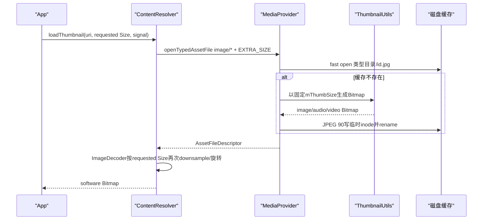
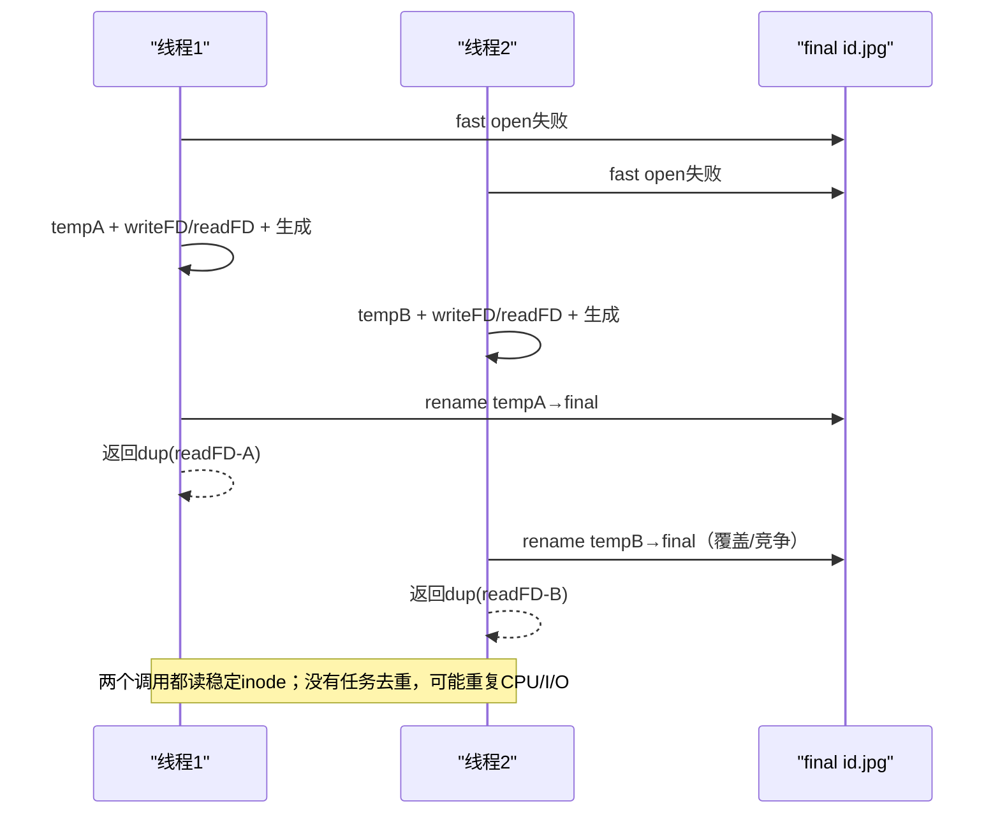
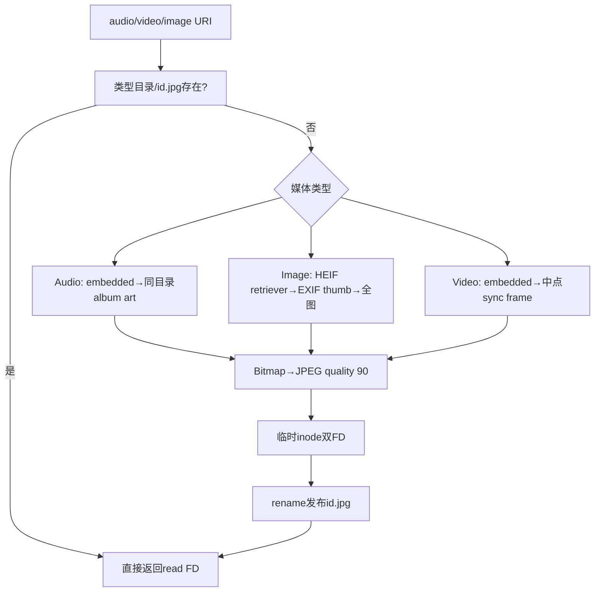

# 277 Android MediaProvider缩略图请求、Thumbnailer并发临时文件、EXIF/音视频帧、磁盘缓存与失效链

## 1. 本章目标

第276章说明query怎样找到对象，本章追`ContentResolver.loadThumbnail()`如何把Size和CancellationSignal送到Provider，MediaProvider怎样按row id缓存JPEG，音频封面、图片EXIF/HEIF、视频中间帧如何生成，以及源对象更新、删除、数据库重建和idle维护怎样让缓存失效。

## 2. Android 11版本边界

本文依据本地`android-11.0.0_r48`。这里的缓存目录、固定Provider尺寸、JPEG质量90、legacy thumbnail表和并发策略都属于r48实现；后续版本可能改成不同缓存或任务调度，不能当作公开API保证。

## 3. loadThumbnail返回Bitmap而Provider返回FD

客户端API看起来直接得到Bitmap，跨进程实际请求的是`openTypedAssetFile(uri,"image/*",opts,signal)`。Provider返回缓存JPEG的AssetFileDescriptor，ContentResolver再用ImageDecoder解码、缩放与旋转。

## 4. 缩略图是派生数据

源媒体row与文件是真实对象，缩略图可以删除并重新生成。它不应拥有独立永久身份；缓存丢失、解码失败或设备空间清理都不应影响原媒体字节。

## 5. 本章源码地图

```text
frameworks/base/core/java/android/content/ContentResolver.java
frameworks/base/media/java/android/media/ThumbnailUtils.java
packages/providers/MediaProvider/src/com/android/providers/media/MediaProvider.java
packages/providers/MediaProvider/src/com/android/providers/media/DatabaseHelper.java
packages/providers/MediaProvider/src/com/android/providers/media/util/FileUtils.java
packages/providers/MediaProvider/apex/framework/java/android/provider/MediaStore.java
```

## 6. 现代与legacy两套表象

现代入口是ContentResolver.loadThumbnail并直接解码Provider返回的图片流；旧Images/Video.Thumbnails.getThumbnail仍存在，但内部也转调loadThumbnail。旧`thumbnails`与`videothumbnails`数据库表主要承担兼容，不是现代固定JPEG缓存的唯一索引。

## 7. 三类现代缓存目录

音频缩略图位于`Music/.thumbnails/<id>.jpg`，视频位于`Movies/.thumbnails/<id>.jpg`，图片位于`Pictures/.thumbnails/<id>.jpg`。同一row id按媒体类型落入不同目录，invalidate时会保守删除三处。

## 8. 缓存键只有row id与类型目录

文件名不包含请求Size、源mtime或内容hash。正确性依赖row id稳定、所有源变化路径都及时invalidate，以及数据库UUID变化时清空整组缓存。

## 9. 请求尺寸与缓存尺寸不同

客户端可请求任意Size，但Provider只生成进程启动时计算的统一`mThumbSize`；客户端收到后再防御性downsample。请求值不是缓存文件名一部分，也不承诺Provider为每个尺寸生成一份。

## 10. 端到端流程



## 11. ContentResolver校验三个参数

content interface、URI、Size都`requireNonNull`；CancellationSignal可null。取消可能以OperationCanceledException/IOException路径结束，API文档把生成、读取与取消故障统一描述为IOException语境。

## 12. Size放入EXTRA_SIZE

Size先转换为Point，写入Bundle的ContentResolver.EXTRA_SIZE。Provider不从方法签名直接收到Size，而是通过typed asset opts识别“调用者想要缩略图”。

## 13. typed MIME必须是image类

MediaProvider只有opts含EXTRA_SIZE且mimeTypeFilter以`image/`开头才走thumbnail；否则回退openFileCommon读取原文件。loadThumbnail固定传`image/*`，满足条件。

## 14. Binder transport先做文件权限门

ContentProvider.Transport的openTypedAssetFile先validate URI、调用`enforceFilePermission(...,"r")`，再设置calling package并进入Provider。MediaProvider内部仍留有“TODO: enforce caller access to this uri”，说明组件级文件门与row级MediaStore策略并非完全同一层。

## 15. 不把TODO误读成完全无权限

跨Binder入口已有Provider read/URI权限检查，后续getType/query也有MediaProvider规则；但ensureThumbnail临时切self identity生成派生文件，r48源码明确承认typed入口的对象级强制仍需完善。应记录边界，不夸大成任意App可读所有缩略图。

## 16. safeUncanonicalize先恢复对象

typed open也接受canonical URI，先尝试恢复当前item id。缓存路径最终用恢复后的row id，避免把`canonical=1`参数误当缓存键。

## 17. ensureThumbnail按URI类型分派

Audio Media、Video Media、Images Media分别交给三类Thumbnailer；Files/Downloads先getType解析MIME media type再分派；其他match直接FileNotFoundException。

## 18. Audio album URI先挑一首

Audio Albums ID先查询该album_id下一个audio row，取第一个id作为目标，再用AudioThumbnailer。专辑缩略图不是以album id独立缓存，而是复用某首歌row id的封面缓存。

## 19. album“第一首”没有稳定排序保证

源码query未指定sort order，只调用moveToFirst。数据库计划或row变化可能让代表歌曲不同；只要同专辑封面通常一致即可，但它不是公开承诺的固定选择。

## 20. generic Files先解析真实MIME

FILES_ID/DOWNLOADS_ID调用getType并用MimeUtils解析media type；NONE、document等不支持缩略图时抛FileNotFoundException。URI是generic不妨碍按实际audio/video/image生成。

## 21. ensureThumbnail临时使用self identity

方法进入后clearLocalCallingIdentity，生成器查询DATA与读源文件时使用Provider身份，finally恢复。这个设计让Provider在外部请求已通过入口门后能读取lower filesystem，不要求调用者直接持有原始路径。

## 22. mThumbSize怎样计算

MediaProvider onCreate取屏幕宽高较小边的一半，构造正方形Size。它是设备显示相关的“合理缓存尺寸”，不是调用者本次Size，也不是MINI_KIND常量。

## 23. 每类Thumbnailer只有目录名不同

抽象内部类保存Music、Movies或Pictures目录名，公共ensure/invalidate逻辑复用；子类只负责从URI生成Bitmap。这让并发、临时文件和缓存命名三类完全一致。

## 24. getThumbnailFile解析具体卷

先把URI volume解析到具体名字，取得volume root，再拼`directoryName/.thumbnails/id.jpg`。external合成URI通常解析primary；UUID外置卷拥有自己的缓存目录。

## 25. fast path只尝试open

若最终JPEG存在，直接read-only `openSafely()`返回，不检查源mtime、size、generation或图片内容。性能很好，但所有源变化必须主动invalidate，否则会长期返回旧图。

## 26. 缓存目录按需mkdirs

fast open失败才取parent并`mkdirs()`。代码没有把mkdirs boolean单独当错误，后续createTempFile/open会以IOException暴露目录不可用。

## 27. r48没有同URI任务去重

源码注释明确不增加“heavy per-ID locking”。并发线程都可以生成同一缩略图，各写自己的临时文件，最后竞争rename；这不是future共享、锁合并或单飞缓存。

## 28. 为什么允许重复计算

缩略图竞争被认为少见，复杂锁表还要处理取消、异常与生命周期清理。临时文件+rename使正确性简单：额外CPU/I/O可接受，调用者不会打开半写成品。

## 29. 临时文件在目标目录创建

`File.createTempFile("thumb",null,thumbDir)`确保临时文件与最终缓存位于同一文件系统目录树，rename通常原子且无需跨卷copy。

## 30. 同一临时inode打开两个FD

thumbWrite用于Provider写JPEG，thumbRead用于稍后返回。两个FD都指向同一inode；即使文件名被rename、或另一个线程随后覆盖最终路径，已打开FD仍稳定读取自己生成的数据。

## 31. 先打开read FD再生成

生成过程中外部还拿不到thumbRead的dup，只有compress与rename成功后才返回。因此预先打开read FD不是暴露半成品，而是为rename竞争后的inode稳定性做准备。

## 32. Bitmap统一压成JPEG 90

无论源是PNG、HEIF、album art还是视频帧，Provider用JPEG quality 90写缓存。透明通道、原格式metadata和无损特性不保留；缩略图是显示派生物，不是原文件替代品。

## 33. rename发布缓存

写完后直接`Os.rename(temp,final)`，比Java File.renameTo提供更明确errno日志。目录观察者只在内容完整后看到final name，避免fast path打开正在写的目标文件。

## 34. 返回的是thumbRead.dup

dup后finally可统一关闭Provider持有的read/write FD，远端仍持有独立描述符。即使finally删除临时名字，dup引用的inode生命周期仍由FD保持。

## 35. finally总清临时文件

成功时temp名字已不存在，delete无害；失败/取消时删除残留并invalidate dentry，同时关闭两个本地FD。异常不应积累大量`thumb*`文件。

## 36. 并发最后rename者决定缓存路径

多个线程各自产出等价派生JPEG，后完成者可替换final path；每个线程返回自己的已打开inode。缓存最终内容可能来自任一线程，但都针对同一row和生成规则。

## 37. 并发策略图



## 38. CancellationSignal先到生成器

MediaProvider把同一signal传给ThumbnailUtils；queryForDataFile也接收它。取消可以打断数据库查询、ImageDecoder header和若干显式checkpoint。

## 39. 取消不是每条CPU指令都可抢占

ThumbnailUtils只在进入、深入解码前和Resizer header回调等位置`throwIfCanceled()`；MediaMetadataRetriever某些native工作、Bitmap.compress和rename之间没有逐步检查。取消响应是协作式，不是强制线程终止。

## 40. 取消后不会发布未完成缓存

若checkpoint或下层抛异常，流程不会执行成功rename，finally清临时文件。已经在取消前完成rename的缓存则可能保留，这是“请求取消”而不是事务回滚。

## 41. Audio先找embedded picture

createAudioThumbnail用MediaMetadataRetriever打开音频，`getEmbeddedPicture()`非null就通过ImageDecoder+Resizer解码。ID3/APIC等内嵌封面是最直接来源。

## 42. Audio native异常转IOException

Retriever setDataSource或读取封面的RuntimeException包装成`IOException("Failed to create thumbnail")`。调用者看到生成失败，不必了解native metadata parser的具体异常类型。

## 43. 无内嵌封面只在external继续找

若文件不属于可识别external storage，直接“No embedded album art found”。旁搜同目录图片是external媒体组织兼容，不是任意内部路径文件搜索器。

## 44. Downloads目录不旁搜封面

音频位于Download时拒绝从目录挑图片；顶级目录同样拒绝。避免一个杂乱大目录中的任意JPG被误当大量音频的共同封面。

## 45. Audio旁搜只看jpg/png

列出父目录文件，扩展名lowercase后筛`.jpg`或`.png`。没有递归子目录，也不读取数据库album关系。

## 46. Audio封面评分

精确`albumart.jpg`得4，`albumart*.jpg`得3，名字中含albumart的JPG得2，其他JPG得1，PNG得0但仍可能在没有更高分时被选。评分只看文件名，不验证尺寸或内容相似性。

## 47. 旁搜前后都有取消点

列目录与选best file后再次检查signal，再用ImageDecoder解码。大目录listFiles本身不是可取消数据库游标，中间仍可能有响应延迟。

## 48. Image先判断MIME与EXIF

由MediaFile按文件名得到MIME；Exif MIME建立ExifInterface并把orientation tag映射为90/180/270。其他镜像/翻转orientation分支未在这段映射中处理。

## 49. HEIF/HEIC优先Retriever缩略图

heif、heif-sequence、heic、heic-sequence调用MediaMetadataRetriever.getThumbnailImageAtIndex，给width和最大pixel数。RuntimeException转IOException。

## 50. EXIF embedded thumbnail是第二选择

非HEIF结果为空且有ExifInterface时取thumbnail bytes，用ImageDecoder和Resizer解码；DecodeException只warning并继续fallback全图，不让损坏的内嵌缩略图阻断原图解码。

## 51. 全图解码是最后选择

仍无bitmap时用ImageDecoder直接解码原文件并按Resizer采样。源码注释说ImageDecoder全图路径会处理orientation，因此立即return，不再手动旋转。

## 52. embedded thumbnail需要手动旋转

EXIF小图自身常不携带原图orientation，生成器用Matrix围绕中心旋转后创建新Bitmap。这样Provider写入的JPEG已经是视觉方向正确的图。

## 53. 镜像orientation是r48边界

代码switch只处理ROTATE_90/180/270，没有TRANSPOSE、FLIP_HORIZONTAL等EXIF镜像值。不要笼统写成“完整支持全部EXIF orientation”。

## 54. Video先尝试embedded picture

MediaMetadataRetriever打开视频后也先`getEmbeddedPicture()`；某些容器带poster时直接解码，避免提取帧。

## 55. Video fallback取时长中点

读取width、height、duration，duration单位毫秒，乘1000后除2得到微秒中点；用OPTION_CLOSEST_SYNC取接近的同步帧，不保证精确时间点。

## 56. 请求比原视频大时不放大

若目标宽高都大于原视频，调用getFrameAtTime返回native尺寸；否则getScaledFrameAtTime按目标width/height生成。缩略图逻辑避免无意义upscale。

## 57. 视频metadata缺失会失败

width/height/duration字符串直接parseInt/Long，null或非法值触发RuntimeException并包装IOException；没有再尝试第一帧的宽松回退。

## 58. Resizer使用整数sample

ImageDecoder header里计算`sourceWidth/targetWidth`与height比，取max；大于1才setTargetSampleSize。它是近似downsample，不承诺输出像素严格等于Size。

## 59. Resizer固定software allocator

无论Provider生成还是ContentResolver最终解码，都选择software Bitmap，注释理由是不了解客户端后续用途，需要更灵活。它不是默认hardware texture。

## 60. Provider与客户端可能两次缩放

Provider先按mThumbSize生成并JPEG编码；客户端ImageDecoder再按requested Size检查sample。小请求能高效缩小，大于Provider缓存尺寸的请求无法凭空恢复原图细节。

## 61. requested Size是rough request

ContentResolver源码明确说远端可能返回巨大图，因此客户端防御性缩小；反过来Provider也可能返回固定较小图。API保证“视觉thumbnail”，不是精准像素裁剪合同。

## 62. ContentResolver支持orientation side channel

它从AssetFileDescriptor extras读取DocumentsContract.EXTRA_ORIENTATION，解码后Matrix旋转。MediaProvider这里返回的AFD未填该extra，因为自己的Image ThumbnailUtils已处理主要旋转；通用其他Provider可使用旁路。

## 63. 客户端最后再检查取消

ImageDecoder header callback里signal.throwIfCanceled，防止远端FD已经返回后仍继续昂贵解码。远端生成取消与本地Bitmap解码取消是同一signal的两个阶段。

## 64. legacy kind只映射Size

旧MINI_KIND/MICRO_KIND由ThumbnailConstants/getKindSize转为Size，再调用现代loadThumbnail。旧kind不强制MediaProvider使用旧thumbnail表或返回特定文件格式。

## 65. legacy BitmapFactory.Options基本不参与

InternalThumbnails.getThumbnail接收opts，但实际只取kind size并调用loadThumbnail，opts没有传给ImageDecoder。旧App不应依赖inSampleSize等options在这条r48路径生效。

## 66. legacy sPending按URI保存signal

旧getThumbnail同步块中为URI创建或复用CancellationSignal，finally移除；cancelThumbnailRequest只能在同进程找到map并cancel。现代loadThumbnail由每个调用者直接提供signal，不用这张静态表。

## 67. legacy并发signal没有引用计数

同URI并发旧请求可能共享signal，其中一个finally就remove map；取消与生命周期语义较粗。这张map只服务旧客户端取消，不代表Provider端生成任务去重。

## 68. 旧thumbnail URI被重定向

openFileCommon识别album art、video/media/id/thumbnail、images/media/id/thumbnail，转到现代ensureThumbnail。target<Q的raw thumbnail table query还可能得到encodeToFile生成的兼容路径。

## 69. 现代磁盘缓存不依赖legacy row

`Music|Movies|Pictures/.thumbnails/<mediaId>.jpg`可直接fast open，未先查thumbnails表。legacy表仍用于旧接口、迁移与invalidate清理，二者需同时维护但不是一一生成绑定。

## 70. 缩略图来源与缓存图



## 71. insert本身通常不生成缩略图

Media row插入后OnFilesChangeListener更新quota与SAF，不主动为每项预生成JPEG。缩略图按请求懒生成，避免为从未展示的海量媒体浪费CPU和空间。

## 72. media type变化会invalidate

files update trigger发现old/new media type不同，通知两个collection并后台删除缩略图。对象从image变成generic或video后，旧类型目录缓存不能继续复用。

## 73. row删除会invalidate

OnFilesChangeListener delete后台撤URI grant、删除现代/legacy缩略图并通知MediaDocumentsProvider。源对象消失后缓存应作为派生数据一起回收。

## 74. 路径或元数据update会安排invalidate

第275章的update先快照affected IDs；placement变化或triggerScan后，为每个id postBackground invalidate，再按需要postBlocking扫描。路径改变可能影响album art、图片内容或视频帧，旧图不可信。

## 75. 非pending写FD关闭先invalidate

OnCloseListener无论远端writer是否报告异常，先invalidateThumbnails，再invalidate FUSE dentry并scan。内容可能已经部分写入，宁可丢缓存重新生成，也不继续展示旧图。

## 76. pending发布也会清缓存

IS_PENDING更新触发scan；update后处理对triggerScan的id同样安排invalidate。生产阶段多次写不每次生成，发布后以最终内容重建。

## 77. invalidate保守删三类现代缓存

同一个URI id会分别调用audio/video/image Thumbnailer.invalidate，无需先信任当前media type。三次路径删除中任一IOException被外层忽略，避免缓存清理阻断主要数据库操作。

## 78. invalidate还查legacy表的文件路径

external/internal helper事务查询`thumbnails.image_id`与`videothumbnails.video_id`的DATA union，逐项`deleteIfAllowed()`，再删两张表对应row。

## 79. legacy实体删除仍有第275章边界

deleteIfAllowed吞异常，File.delete boolean未检查；legacy row随后仍会删除。缩略图是可重建缓存，宁可留下待idle清理的孤儿文件，也不因清理失败回滚源媒体操作。

## 80. invalidate本身开启数据库事务

删除legacy rows包在helper.runWithTransaction中，generation可能推进并在commit后处理trigger通知；现代JPEG文件删除发生在事务外，仍不是VFS/SQLite原子操作。

## 81. 数据库UUID防row id重用

数据库重建可能从相同id重新编号；若仍复用旧`123.jpg`就会给新对象显示旧图。ensureThumbnailsValid比较数据库UUID与每个缓存目录`.database_uuid`，不同就清空目录。

## 82. 标记缺失时信任当前缓存

若磁盘没有UUID文件，代码认为是新插入卷或升级，保留当前缩略图并写入数据库UUID；只有标记存在且不相等才删除所有内容。

## 83. attach与idle都会校验UUID

外部卷attach准备阶段和每次idle全卷扫描后都调用ensureThumbnailsValid。拔出后换卡或数据库代际变化能在这些生命周期点失效缓存。

## 84. 三个目录各有UUID文件

Music、Movies、Pictures下`.thumbnails`分别保存`.database_uuid`。任何一个目录标记不符只清该目录并更新标记，不要求三个目录文件操作原子同步。

## 85. 清目录也invalidate FUSE dentry

遍历内容使用deleteAndInvalidate，避免upper FUSE仍缓存已删除JPEG目录项。MediaProvider自身可能从lower删除，必须主动协调upper视图。

## 86. idle prune先收集所有known ids

external.db查询files的全部`_id`，排序后遍历当前外部卷的三类cache目录。文件名去扩展后能解析成known id就保留，否则视为stale。

## 87. UUID标记永远跳过prune

`.database_uuid`不是媒体id，自然不能按数字解析；代码显式continue，防止idle把代际保护标记当垃圾删除。

## 88. 非数字和未知id都删除

临时残留、手工文件、旧row id JPEG都会被清理。NumberFormatException被忽略后继续走stale删除，不会让一个异常文件名终止整个目录维护。

## 89. prune还清legacy孤儿row

最后SQL删除image_id不在images view的thumbnails row，以及video_id不在video view的videothumbnails row。现代文件cache和legacy database cache各有一条回收路径。

## 90. 缓存失效全景

这条链可按触发粒度分成三组理解：

| 触发源 | 清理范围 | 目的 |
|---|---|---|
| 源文件写FD关闭、placement/元数据更新、media type变化、源row删除 | 对该id同时删除Music、Movies、Pictures三处modern JPEG，并清对应legacy文件与row | 立即阻止已知对象继续命中旧图 |
| 数据库UUID与目录`.database_uuid`不一致 | 清空该volume相应类型的整个缩略图目录 | 防止数据库重建后row id复用旧缓存 |
| idle maintenance | 以known files ids删除非法名/未知id JPEG，并删除已无源media的legacy row | 回收未被即时失效链覆盖的孤儿 |

三组机制互补而不等价：逐id失效负责新鲜度，UUID负责数据库代际，idle负责引用完整性；其中没有任何一组会仅凭known id源文件的mtime变化自动重建缩略图。

## 91. fast cache不校验mtime

请求命中`id.jpg`就立即返回，既不stat源文件也不比较DATE_MODIFIED。若某条绕过路径修改源文件却没触发invalidate，idle prune也因id仍known而保留旧图。

## 92. idle不能修复“known id的陈旧图”

prune只判断缓存文件名id是否存在于files，不验证内容hash；UUID也只处理数据库代际。因此源变更通知链是否完整是缓存新鲜度关键。

## 93. scanner为何也很重要

直接路径写入由FUSE通知/扫描更新row；scanner update包含DATA等字段时Provider安排invalidate。若完全绕过MediaProvider且扫描未发生，缩略图可能一直旧到下一次能触发相关update。

## 94. 缓存JPEG通常不带原EXIF

Bitmap经过decode再compress成JPEG，原文件EXIF/XMP不会原样复制。它减少位置metadata泄露面，但缩略图像素本身仍是原内容的视觉派生，仍必须受对象访问权限保护。

## 95. 图片orientation在Provider图中固化

embedded EXIF缩略图手动旋转，全图ImageDecoder自行处理；最终JPEG像素方向已调整。旧API文档从Q起也提示调用者不必再次旋转，否则会二次旋转。

## 96. 生成失败如何传播

Thumbnailer抛IOException，MediaProvider ensureThumbnail catch后Log并转FileNotFoundException(message)；部分原始cause细节不保留给客户端。loadThumbnail最终以IOException报告，无Bitmap结果。

## 97. 缓存压缩结果未检查boolean

`thumbnail.compress(...)`返回boolean，但r48代码没有检查；若底层没有抛异常却返回false，仍可能继续rename不完整/空temp。这是实现边界，后续ImageDecoder可能在客户端暴露失败。

## 98. getThumbnailBitmap要求非null

三类现代ThumbnailUtils签名@NonNull，视频frame用Objects.requireNonNull；异常会中断生成。代码没有“生成失败就返回默认图标”的Provider级fallback。

## 99. PermissionActivity还会自行fallback

用户确认UI调用resolver.loadThumbnail失败时，可尝试full图或MIME图标。这是UI消费者策略，不属于MediaProvider Thumbnailer保证；普通App也应准备placeholder。

## 100. Audio PNG评分为0仍可能入选

筛选允许PNG，但score函数只给JPG正分；当目录只有PNG时stream.max仍会选择其中一个。不能把评分代码误读为“PNG永远不使用”。

## 101. 不存在独立LRU任务缓存

r48这条链的持久缓存是磁盘JPEG，客户端Bitmap内存缓存由调用者负责；Provider没有展示按URI缓存Bitmap或Future的LRU。重复并发miss会重复解码。

## 102. 客户端应做自己的内存缓存

MediaStore旧API文档明确调用者负责缓存returned values。列表滚动若每次都跨Binder loadThumbnail，即使磁盘fast path存在也会重复FD、JPEG decode和Bitmap分配。

## 103. 缓存目录本身对scanner不可见

ModernMediaScanner把Music/Movies/Pictures下`.thumbnails`列为固定不可扫描目录并创建`.nomedia`，防止派生JPEG又被当用户图片插入MediaStore形成递归索引。

## 104. cache路径与legacy thumbnails表不同

现代图片缓存固定在Pictures/.thumbnails，而旧thumbnail row的DATA可指其他兼容路径。invalidate同时处理两者，读源码时看到`thumbnails`表不能推断现代fast path一定查询它。

## 105. 缩略图不是quota分类的源对象

OnFilesChangeListener为源media row更新external storage quota type；缓存目录文件是Provider内部派生物。删除缓存不应改变源row media type或owner。

## 106. row id全external.db唯一

多个外卷共用external.db的AUTOINCREMENT id空间，cache又按具体volume root分目录；即使数字相同风险主要来自数据库重建，UUID标记就是防护。不要把volume name从缓存定位过程省略。

## 107. generic URI仍按源row权限理解

Files/Downloads请求只是在分派前用getType确定生成器，缓存最终仍基于同一row id。它不会创建另一个“generic thumbnail owner”。

## 108. 错误恢复依赖可重建性

临时文件残留由finally/idle删，final JPEG损坏可在调用失败后通过源update/invalidate重建，数据库代际错配由UUID清空。设计选择“丢缓存重算”，而非维护复杂修复日志。

## 109. 性能与正确性的交换

无per-id锁降低协调复杂度，固定尺寸减少多规格缓存，fast path不stat源提高命中速度；代价是并发重复工作、较大请求清晰度受限，以及高度依赖invalidate链。

## 110. 五步排查缩略图问题

先确认URI与源row权限；再看类型分派和DATA；再看三类生成器是否有embedded/fallback；再看cache id.jpg与UUID；最后看源变化是否触发invalidate。只删App内存缓存通常解决不了Provider陈旧JPEG。

## 111. 阅读完成检查

你应能画出loadThumbnail→openTypedAssetFile→ensureThumbnail→ThumbnailUtils→temp/rename→ImageDecoder，解释为何并发不返回半文件、Audio/Image/Video各自fallback、requested Size为何不是缓存Size，以及mtime不校验带来的失效依赖。

## 112. macOS只读练习一：追客户端到Provider

```bash
cd /Users/ninebot/androidSource
sed -n '4015,4090p' frameworks/base/core/java/android/content/ContentResolver.java
sed -n '5730,5810p' packages/providers/MediaProvider/src/com/android/providers/media/MediaProvider.java
```

标出EXTRA_SIZE、image/*、CancellationSignal、typed transport、URI类型分派、Provider固定mThumbSize与客户端第二次downsample，写清哪一步返回FD、哪一步得到Bitmap。

## 113. macOS只读练习二：证明并发不是去重

```bash
cd /Users/ninebot/androidSource
sed -n '4800,4880p' packages/providers/MediaProvider/src/com/android/providers/media/MediaProvider.java
```

用两个线程同时cache miss推演tempA/tempB、writeFD/readFD、rename与dup顺序；说明为什么CPU重复、final文件最后写者不确定，但两个调用者都不会读半写内容。

## 114. macOS只读练习三：比较三类生成器

```bash
cd /Users/ninebot/androidSource
sed -n '140,210p' frameworks/base/media/java/android/media/ThumbnailUtils.java
sed -n '240,320p' frameworks/base/media/java/android/media/ThumbnailUtils.java
sed -n '345,405p' frameworks/base/media/java/android/media/ThumbnailUtils.java
```

分别列出Audio、Image、Video的首选、fallback、取消点、旋转、缩放与失败条件；特别检查PNG评分0、EXIF镜像值、视频duration单位和OPTION_CLOSEST_SYNC。

## 115. macOS只读练习四：审计缓存失效

```bash
cd /Users/ninebot/androidSource
sed -n '790,835p' packages/providers/MediaProvider/src/com/android/providers/media/MediaProvider.java
sed -n '4740,4800p' packages/providers/MediaProvider/src/com/android/providers/media/MediaProvider.java
sed -n '4900,4960p' packages/providers/MediaProvider/src/com/android/providers/media/MediaProvider.java
```

为源write、path update、type change、row delete、数据库重建、未知id JPEG、known id但源mtime变化七种事件填写“立即删/attach删/idle删/不会仅靠此逻辑删”的表格。

## 116. 易混点一：requested Size不是Provider缓存Size

Provider只维护按屏幕计算的一份正方形JPEG，客户端再按请求缩小。大尺寸请求不能保证得到相同尺寸或原图级细节。

## 117. 易混点二：并发策略不是任务去重

r48没有per-id锁或共享Future；每个miss线程独立生成，靠临时inode、原子rename和预开read FD保证完整性。旧客户端sPending也只是取消signal map。

## 118. 易混点三：缓存命中不校验源mtime

fast path只open id.jpg，idle也只查id是否known。新鲜度靠write/update/scan/delete触发invalidate，漏掉这些事件就可能持续陈旧。

## 119. 复读纠偏记录

复读后修正十点：loadThumbnail跨进程拿的是typed AFD而非Bitmap；Provider忽略请求Size生成固定mThumbSize；r48并发允许重复生成而非去重；双FD用于rename后inode稳定；JPEG compress quality 90且boolean未检查；Audio可在只有PNG时选0分项；Image只显式处理三种旋转而非全部EXIF镜像；Video取时长中点附近同步帧；modern id.jpg不依赖legacy table；UUID/prune都不能发现known id的源mtime陈旧。

## 120. 本章小结与下一章

Android 11缩略图链以typed asset FD连接客户端与MediaProvider，Provider按媒体row id懒生成固定尺寸JPEG，用临时文件和rename抵抗并发半写，再由客户端按请求Size解码。正确性依赖源变化失效、数据库UUID和idle孤儿清理，而不是每次命中重验源文件。下一章继续研究MediaDocumentsProvider的roots/documents、MediaStore与SAF URI互转、观察通知、权限与删除协作链。
