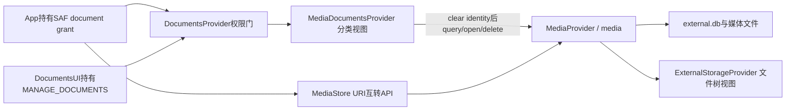
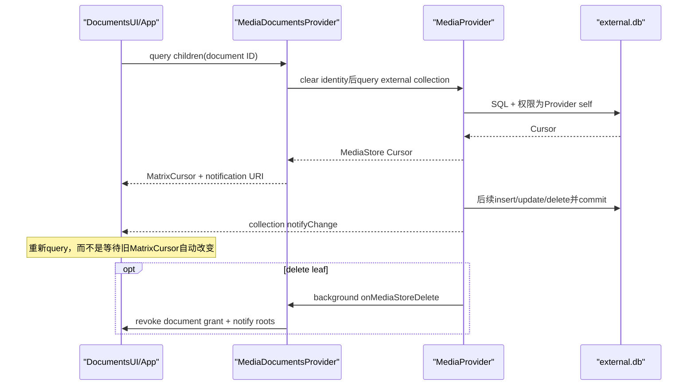
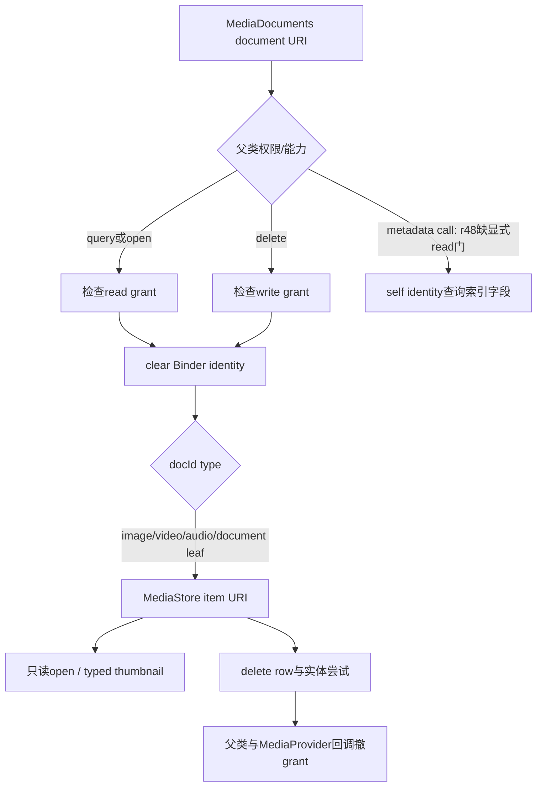

# 278 Android MediaDocumentsProvider roots/documents、MediaStore与SAF URI互转、观察通知、权限与删除协作链

## 1. 本章目标

第277章讲MediaStore对象怎样生成缩略图，本章换到Storage Access Framework（SAF）视角：`MediaDocumentsProvider`怎样把同一批external媒体组织成图片、视频、音频和文档四个root，怎样用虚拟目录与leaf document ID查询、打开、删除和取metadata，以及`MediaStore.getDocumentUri()/getMediaUri()`究竟在谁的URI之间转换。

## 2. Android 11版本边界

本文依据本地`android-11.0.0_r48`。root能力、搜索参数、只读策略、metadata实现和URI转换细节都是该tag实现；后续Mainline MediaProvider或framework版本可能已修补边界，不能把本章的内部行为当成永久API契约。

## 3. 两个Provider必须先分开

`MediaDocumentsProvider`的authority是`com.android.providers.media.documents`，提供按媒体类型分类的SAF视图；`ExternalStorageProvider`的authority是`com.android.externalstorage.documents`，提供按真实卷和目录组织的文件树视图。它们都继承DocumentsProvider，但不是同一棵树。

## 4. MediaProvider是底层数据源

MediaDocumentsProvider不拥有独立数据库。它构造MediaStore external URI查询`media` authority，把Cursor行翻译成DocumentsContract列；open、delete、thumbnail和metadata也最终委托MediaProvider。

## 5. 三种URI不要混为一谈

同一JPEG可能有三种地址：`content://media/external/images/media/123`是MediaStore行；`content://com.android.providers.media.documents/document/image:123`是分类文档；`content://com.android.externalstorage.documents/document/primary:DCIM%2Fa.jpg`是文件树文档。底层文件相同，不代表权限、document ID和导航父子关系相同。

## 6. 源码地图

```text
packages/providers/MediaProvider/src/com/android/providers/media/MediaDocumentsProvider.java
packages/providers/MediaProvider/src/com/android/providers/media/MediaProvider.java
packages/providers/MediaProvider/apex/framework/java/android/provider/MediaStore.java
packages/providers/MediaProvider/AndroidManifest.xml
frameworks/base/core/java/android/provider/DocumentsProvider.java
frameworks/base/core/java/android/provider/DocumentsContract.java
frameworks/base/core/java/android/content/ContentProvider.java
frameworks/base/packages/ExternalStorageProvider/src/com/android/externalstorage/ExternalStorageProvider.java
```

## 7. 进程与调用边界

MediaDocumentsProvider和MediaProvider声明在同一MediaProvider应用进程中，但仍经ContentResolver调用`media` authority。DocumentsUI通常持有`MANAGE_DOCUMENTS`浏览roots；普通App通过用户选择获得具体document URI grant，再访问相应URI。

## 8. Provider清身份不是取消权限

DocumentsProvider父类先在Binder入口检查组件权限或具体URI grant。通过后，MediaDocumentsProvider用`Binder.clearCallingIdentity()`以自身身份查询、打开或删除MediaStore对象。这是把已经验证过的SAF capability转成底层访问能力，而不是跳过入口授权。

## 9. 本章核心心智模型

先问调用者持有什么SAF URI grant，再问docId映射到哪条MediaStore URI，最后问Provider在clear identity后做了什么。反过来只盯MediaStore的READ权限，会误以为拿到ACTION_OPEN_DOCUMENT结果的App无法读文件。

## 10. 总体架构图



## 11. Manifest的四个硬条件

该provider exported、`grantUriPermissions=true`，组件权限为signature级`MANAGE_DOCUMENTS`，并发布`android.content.action.DOCUMENTS_PROVIDER` intent-filter。DocumentsProvider.attachInfo还会运行时验证exported、grantUriPermissions和读写权限都必须符合约定，否则直接SecurityException。

## 12. 为什么普通App仍能访问

ContentProvider权限检查先尝试组件权限，最后尝试URI grant。普通App通常没有MANAGE_DOCUMENTS，但系统文件选择器可授予一个具体document URI的read/write/persistable权限；这个grant是访问该对象的能力票据。

## 13. root查询与leaf查询的授权不同

列出所有roots通常由DocumentsUI等特权组件执行；普通App不能仅凭一个leaf grant枚举整套provider。它能query/open已获grant的document URI，树grant还可覆盖合法后代，但本provider没有实现可导航的ACTION_OPEN_DOCUMENT_TREE语义。

## 14. shell还有用户限制门

除`queryRoots()`外，多数文档操作开头调用`enforceShellRestrictions()`。若caller appId是SHELL且当前用户设置`DISALLOW_USB_FILE_TRANSFER`，即使shell具备调试特权也抛SecurityException；普通App不走这条特殊分支。

## 15. readiness避免启动ANR

静态volatile `sMediaStoreReady`初始false。`queryRoots()`在false时返回空MatrixCursor，不触碰底层数据库；external volume attach完成默认目录和缩略图UUID事务后，MediaProvider在ForegroundThread调用`onMediaStoreReady()`置true并通知roots刷新。

## 16. readiness是进程级总开关

回调参数`volumeName`在r48没有参与状态计算；任一external卷准备好后，四个root整体可查询。detach也不把开关恢复false，所以它表达“底层MediaStore曾准备好”，不是每个卷独立ready表。

## 17. 四个root

`images_root`、`videos_root`、`audio_root`、`documents_root`分别广告`image/*`、`video/*`、音频三类MIME，以及`*/*`。root ID同时也是其顶层document ID，解析时没有冒号便得到`id=-1`。

## 18. root capability不是文件能力

四个root都`FLAG_LOCAL_ONLY|FLAG_SUPPORTS_SEARCH`；图片、视频、文档另有`FLAG_SUPPORTS_RECENTS`，音频没有。它们没有`FLAG_SUPPORTS_CREATE`或`FLAG_SUPPORTS_IS_CHILD`，因此不要把分类root当成可写目录树。

## 19. FLAG_EMPTY怎样产生

include root先用self identity执行`COUNT(_id)`。零行就设置`Root.FLAG_EMPTY`并记对应静态`sReturned*Empty=true`；DocumentsUI可据此隐藏或弱化空入口。

## 20. first insert怎样清空标志

MediaProvider external insert的background任务调用`onMediaStoreInsert()`。只有先前确实返回过EMPTY且新row media type匹配，才清boolean并notify roots；internal volume直接忽略。

## 21. delete为何每次通知roots

external图片、视频、音频或文档row删除后，回调构造相应leaf document URI、撤销全部grant并无条件notify roots。这样删除最后一项时会重新COUNT并出现EMPTY；代价是删除任何一项都可能触发root刷新。

## 22. Documents root的EMPTY边界

`includeDocumentsRoot()`用`isEmpty(Files.EXTERNAL_CONTENT_URI)`统计全部files row，却在child/search时只选`MEDIA_TYPE_DOCUMENT`。因此只存在图片或音频、没有document类型时，Documents root仍可能不带EMPTY；这是r48实现不一致，不能把root flag当精确document计数。

## 23. document ID编码

有实体id的格式为`type:id`，例如`image:123`、`videos_bucket:456`、`artist:8`。`getIdentForDocId()`按第一个冒号拆分并用`Long.parseLong()`解析后半段；非法数字会抛NumberFormatException，而不是温和返回not found。

## 24. ID中的type决定语义

同一个数字在`image:123`和`video:123`下属于不同类型。root、bucket、artist、album是虚拟导航节点；image/video/audio/document是可映射到MediaStore row的leaf。不能只保存数字而丢掉type。

## 25. synthetic external视图

所有分类查询使用`*.EXTERNAL_CONTENT_URI`或`Files.EXTERNAL_CONTENT_URI`，也就是`external`合成卷，而非在docId中保存具体volume。第274章讲过external.db中的row id跨当前外卷共享唯一空间，所以leaf通常可仅凭type+row id恢复。

## 26. bucket ID不是目录主键

图片、视频和document虚拟目录使用MediaStore `BUCKET_ID`，本质是路径派生的分组值，不是数据库里的真实目录row id。docId不包含volume或完整路径，理论上hash碰撞或跨卷相同分组值会被同一bucket selection合并。

## 27. bucket列表怎样去重

查询按`BUCKET_ID, DATE_MODIFIED DESC`排序，Java循环只在bucket id变化时include一行。于是同bucket第一行提供最新mtime和显示名；正确性依赖相同bucket行在排序中连续。

## 28. bucket显示名的回退

优先`BUCKET_DISPLAY_NAME`；为空且不是primary卷时显示volume name；primary则显示本地化“未知”。这个名字只是UI标签，不参与docId，也不保证能反推真实目录路径。

## 29. 图片树

`images_root → images_bucket:<bucketId> → image:<rowId>`。bucket和image都偏好grid与last-modified排序，bucket和leaf都支持thumbnail；leaf再声明delete和metadata。

## 30. 视频树

`videos_root → videos_bucket:<bucketId> → video:<rowId>`，列、排序、flag与图片近似。bucket缩略图从该bucket最新修改视频产生，不是目录自有封面文件。

## 31. 音频树

`audio_root → artist:<artistId> → album:<albumId> → audio:<rowId>`。artist/album是MediaStore聚合view的虚拟目录，song leaf支持delete和metadata，但r48不广告thumbnail。

## 32. Documents树

`documents_root → documents_bucket:<bucketId> → document:<rowId>`。两级查询都会额外追加`media_type=MEDIA_TYPE_DOCUMENT`，所以图片、视频、音频和MEDIA_TYPE_NONE随机文件不会因使用Files表就自动出现在此树。

## 33. 一个document可以有多个父视图

DocumentsProvider契约允许同一document出现在多个目录。这里音频album节点从artist下枚举，但album docId只编码album id；分类结构是索引关系，不要求像真实文件系统那样只有一个稳定父目录。

## 34. queryDocument的分派

root直接合成一行；bucket、artist、album和leaf则按ident type选择对应MediaStore URI，以`_id=?`、`bucket_id=?`等查询并把第一行翻译进MatrixCursor。未知type抛UnsupportedOperationException。

## 35. missing document通常表现为空Cursor

底层query没有moveToFirst时不会include任何row，也不主动FileNotFoundException。因此一个格式合法但已消失的docId常返回零行MatrixCursor；调用者应以row count判断，不要假设必抛异常。

## 36. 默认projection

调用者projection为null时，document返回ID、MIME、display name、last modified、flags、size六列；root另返回root ID、flags、icon、title、document ID、MIME types和query args。自定义projection由MatrixCursor接受，相应include按列名写入。

## 37. 秒与毫秒的转换

MediaStore `DATE_MODIFIED`是Unix秒，DocumentsContract `COLUMN_LAST_MODIFIED`要求毫秒，所有include leaf/bucket都乘`DateUtils.SECOND_IN_MILLIS`。搜索参数`LAST_MODIFIED_AFTER`则从毫秒除1000后下推SQL。

## 38. queryChildDocuments忽略sortOrder

方法签名收到`sortOrder`，r48实现没有使用它；每类采用自己的SQL顺序或无order。图片/视频root按bucket id再mtime，其他leaf列表多未指定排序。DocumentsUI的请求排序不是这里的硬保证。

## 39. child Cursor怎样观察变化

每个MatrixCursor都把notification URI设成相应MediaStore collection：图片、视频、音频或Files。底层row事务发`notifyChange()`后，观察这个Cursor的客户端会知道需要重新query分类视图，而不是由Provider逐行推送新内容。

## 40. notification URI不是数据快照更新

MatrixCursor已经把底层Cursor复制成内存行，通知到来不会自动修改现有row。客户端必须关闭或重新查询；若只继续遍历旧MatrixCursor，就仍看到旧快照。

## 41. root通知与document通知分层

roots URI通知负责ready与EMPTY能力变化；document/children Cursor监听MediaStore collection负责内容变化；row删除还显式revoke leaf document grant。三条机制分别解决入口能力、UI刷新和安全能力回收。

## 42. update没有专门Docs回调

MediaProvider row update照常通知MediaStore collection，所以已打开的分类Cursor会失效；但`onMediaStoreUpdate`不存在。若media type改变，旧type document grant不会在这条路径显式revoke，旧URI通常因强类型view查不到row而失效，但grant记录可能滞留到删除或其他清理。

## 43. delete回调发生在后台

数据库delete提交并通知后，MediaProvider的background任务才撤MediaStore grants、清缩略图并调用MediaDocumentsProvider revoke。短窗口内row已经不存在而grant记录尚未回收；安全上底层query/open找不到对象，grant清理属于后续收尾。

## 44. 查询与通知时序图



## 45. recent只支持三类root

Images、Videos、Documents按`DATE_MODIFIED DESC`复制最近项；Audio root没有RECENTS flag且调用会UnsupportedOperationException。默认limit是64，显式`QUERY_ARG_LIMIT`才在Cursor extras报告为honored。

## 46. recent limit不是SQL LIMIT

底层resolver.query没有LIMIT，只在while循环中以`result.getCount()<limit`停止复制。数据库Cursor可能仍准备完整结果集；这限制返回行数，但不等同于把工作量完整下推SQLite。

## 47. recent CancellationSignal没有下传

方法收到signal，却调用不带signal的旧resolver.query重载。取消可能在DocumentsProvider transport外层影响有限，但r48这段不会主动用该signal中止底层MediaStore查询。

## 48. search广告四个参数

root `COLUMN_QUERY_ARGS`列出display name、file size over、last modified after、MIME types，以换行连接。搜索分别选择对应媒体collection，按DATE_MODIFIED DESC返回leaf，不返回bucket/artist/album。

## 49. display name是LIKE pattern

非空名称转为`DISPLAY_NAME LIKE ?`，参数为`%输入%`。输入中的`%`和`_`仍具有SQL LIKE通配语义，因为没有额外escape；它是模糊模式而不是严格字面包含。

## 50. 时间与大小条件

mtime使用严格大于`lastModifiedAfter/1000`，size使用严格大于`fileSizeOver`。恰好相等不会命中；毫秒除法还会丢掉小于一秒的精度。

## 51. MIME wildcard怎样构造

以`/*`结尾的值改写为`LIKE type/%`，具体MIME放入`IN (?,...)`，两组以OR括起，再与名称、时间、大小用AND连接。参数化MIME和display name避免把字符串直接拼成SQL代码。

## 52. 与root不相容可直接空结果

图片root收到只包含`video/*`的过滤时，`shouldFilterMimeType()`判定没有匹配类型，连底层query都不执行。收到null、`*/*`或本root大类时则不再额外MIME过滤。

## 53. Audio的application/ogg边界

Audio root广告`audio/*`、`application/ogg`、`application/x-flac`，但搜索预筛使用固定`audio/*`作为root filter。精确请求`application/ogg`可能被判为与root不匹配而跳过查询；这是r48广告与搜索实现的窄不一致。

## 54. Documents search仍限定MEDIA_TYPE_DOCUMENT

它先按通用四条件构造selection，再由`addDocumentSelection()`追加`media_type=?`。即使root MIME广告`*/*`，已经被Scanner分类为image/video/audio的对象仍不会作为document重复返回。

## 55. EXCLUDE_MEDIA被虚假报告honored

`getHandledQueryArguments()`看到`QUERY_ARG_EXCLUDE_MEDIA`键就加入EXTRA_HONORED_ARGS，但`querySearchDocuments()`从未读取或应用这个值，root广告列表也未包含它。r48代码因此可能声称已处理一个实际未生效的参数。

## 56. search没有limit和signal

旧override只接Bundle不接CancellationSignal，也没有QUERY_ARG_LIMIT处理，所有匹配行都会复制到MatrixCursor。大型媒体库搜索可能分配较大内存；调用者不能从本实现假设有64项上限。

## 57. open只接受r

`openDocument(docId, mode, signal)`先映射leaf MediaStore URI，mode不是精确字符串`"r"`就抛IllegalArgumentException“Media is read-only”。即使调用者持有write grant，也不能用`w`、`rw`或`rwt`改内容。

## 58. open只支持四种leaf

`image`映射Images external item，`video`映射Video，`audio`映射Audio，`document`映射Files；root、bucket、artist和album都UnsupportedOperationException。UI flags本来就不会把虚拟目录当普通文件打开。

## 59. SAF grant怎样变成MediaStore读取

DocumentsProvider transport先对document URI做read检查；随后实现clear Binder identity并以Provider self调用`openFileDescriptor(target,"r")`。所以普通App不需要另持整库READ_EXTERNAL_STORAGE，具体SAF read grant就是被委托的能力。

## 60. open中的CancellationSignal被丢弃

实现收到signal，却调用`openFileDescriptor(target, mode)`而不是带signal版本。底层打开/查询不会由这只signal取消；这与thumbnail路径完整转发signal形成鲜明对比。

## 61. thumbnail只支持图片与视频

Image/Video leaf直接转发各自row id；bucket先查询该bucket中`DATE_MODIFIED DESC`第一项作为代表。Audio与Documents没有thumbnail flag，强行调用会UnsupportedOperationException。

## 62. bucket thumbnail不是独立缓存键

bucket最终仍调用代表leaf的MediaStore typed asset URI，所以第277章的缓存键是`image:<rowId>`或`video:<rowId>`对应的row id.jpg，而不是bucket id。bucket内最新对象变化时，封面自然可能换成另一项。

## 63. sizeHint和signal在thumbnail链被保留

实现把Point写入`EXTRA_SIZE`，调用`openTypedAssetFile(uri,"image/*",opts,signal)`；这条链完整进入MediaProvider Thumbnailer。仍要记住第277章结论：Provider生成固定`mThumbSize`缓存，sizeHint主要影响客户端请求语义，不创建多规格缓存。

## 64. bucket选择SQL的小细节

bucket id来自已解析long，却以`BUCKET_ID=<数字>`直接拼selection而非`?`参数；没有字符串注入入口，但风格与其他查询不一致。图片bucket空时的异常文本还误写“No video found for bucket”，只是r48文案bug。

## 65. delete需要write能力

DocumentsProvider父类处理`METHOD_DELETE_DOCUMENT`时先对document URI执行write permission检查，随后才调用子类`deleteDocument()`。仅持read grant的App不能因为leaf声明`FLAG_SUPPORTS_DELETE`就绕过write门。

## 66. delete怎样映射到底层

四种leaf先转为对应MediaStore item URI，clear Binder identity后调用`ContentResolver.delete(target,null,null)`。它不接受selection，也不开放collection批量删除，删除目标由docId唯一决定。

## 67. delete不检查返回count

实现忽略resolver.delete返回值。row已消失时可能看起来正常返回；而第275章还说明MediaProvider delete count也不能证明实体字节一定擦除。DocumentsContract层的“调用成功”不等于存储介质上的强删除证明。

## 68. 父类与MediaStore回调双重revoke

通过DocumentsContract删除时，父类在deleteDocument返回后调用`revokeDocumentPermission()`，同时撤普通document URI和同docId tree URI；底层MediaStore delete的后台listener又调用`onMediaStoreDelete()`撤分类leaf grant。两条路径重叠是幂等安全收尾，也覆盖从非SAF入口删除媒体的场景。

## 69. create和rename为何不可用

MediaDocumentsProvider没有override createDocument、renameDocument、copyDocument、moveDocument或removeDocument，父类默认抛UnsupportedOperationException；document flags也不广告这些能力。它是分类选择/读取/删除视图，不是完整文件管理器。

## 70. 也不支持写FD

leaf虽然可被授予write URI权限以便执行delete，`openDocument()`仍严格只接受`r`。权限grant说明调用者最多可尝试某类操作，具体Document flags与Provider实现才决定操作集合。

## 71. metadata支持范围

Image、Video、Audio leaf声明`FLAG_SUPPORTS_METADATA`；Document leaf没有。类型分别返回`DocumentsContract.METADATA_EXIF`、私有`android.media.metadata.video`和`android.media.metadata.audio`子Bundle。

## 72. metadata来自索引而非重读源文件

本类按row id查询MediaStore列：图片width/height/date taken，视频duration/height/width/date taken，音频artist/composer/album/year/duration。这里没有重新打开JPEG完整解析EXIF，因此结果取决于scanner已写入的索引字段及其新鲜度。

## 73. metadata列怎样映射tag

静态Map的key构成projection，value是EXIF或MediaMetadata tag。Cursor每个非null值按类型放进Bundle，最后另写`METADATA_TYPES`数组告诉调用者可取哪一个子Bundle。

## 74. 图片时间是特殊格式化

映射到EXIF DATETIME的`DATE_TAKEN`不按整数直接放入，而以当前Locale的日期时间pattern格式成String。这是面向显示的本地化结果，不是原文件EXIF中未经修改的标准日期字符串。

## 75. INTEGER被getInt截窄

除图片DATETIME特例外，所有`Cursor.FIELD_TYPE_INTEGER`都用`cursor.getInt()`写Bundle。视频`DATE_TAKEN`等本可为64位的值可能发生32位截断；这是r48实现边界，不能假设metadata Bundle完整保留数据库long精度。

## 76. metadata缺行与不支持类型

query没有row就FileNotFoundException；document/root/bucket等类型在switch default直接FileNotFoundException。BLOB和NULL只写日志并跳过，不会为该tag放占位值。

## 77. metadata call的权限检查缺口

这是复读必须标出的r48问题：ContentProvider transport明确不会为通用`call()`推断读写权限；DocumentsProvider的`METHOD_GET_DOCUMENT_METADATA`分支直接调用实现，没有像delete/isChild那样执行`enforceReadPermissionInner()`。子类也只做shell限制后clear identity查询索引。

## 78. 如何准确描述这个缺口

不要扩大成“所有文档都能任意读取”：open/query/delete仍各有权限门，metadata只暴露索引映射的少量字段。但对可猜测`image:<id>`等docId，r48这条call路径存在绕过具体document read grant的潜在元数据泄露；应以源码边界记录，并在新版本重新核验。

## 79. 分类SAF操作图



## 80. MediaStore.getDocumentUri不是分类URI转换

现在进入最常见误区。`MediaStore.getDocumentUri(context, mediaUri)`调用`media` provider后，最终让ExternalStorageProvider按真实路径返回其document/tree URI；它不会返回`com.android.providers.media.documents/document/image:123`。

## 81. 为什么要借道MediaProvider

ExternalStorageProvider的内部`get_document_uri/get_media_uri` call要求`WRITE_MEDIA_STORAGE`，注释明确所有caller必须经过MediaProvider。普通App不能直接把任意文件路径交给ExternalStorageProvider探测docId。

## 82. getDocumentUri客户端准备了什么

API先读取调用者`getPersistedUriPermissions()`列表，把输入MediaStore URI和这份持久grant快照放入Bundle，再向`media` authority发`GET_DOCUMENT_URI_CALL`。只传persisted列表，不会枚举当前未持久化的临时grant。

## 83. MediaProvider先验证MediaStore访问

收到mediaUri后调用`enforceCallingPermission(mediaUri,extras,false)`：全局媒体权限、owner、manager或该MediaStore URI grant等任一允许才继续。随后clear local identity，用`queryForDataFile()`把唯一row还原成真实DATA路径。

## 84. 路径只是Provider间中间值

MediaProvider把路径包装成`file://`放回同一extras，并以自身权限调用ExternalStorageProvider。raw路径不会作为公开API结果返回App；ExternalStorageProvider还会校验文件能映射到其已知root。

## 85. ExternalStorageProvider怎样匹配已有grant

它由File计算docId，遍历客户端传来的persisted UriPermission：精确document id可匹配，tree URI则要求目标是tree后代。没有任何覆盖该路径的permission就SecurityException，而不是新授予一个URI。

## 86. 返回URI的优先级

优先读写都具备的tree grant，再是读写都具备的精确document grant，然后是任意部分tree grant，最后是部分精确grant。tree命中时用原tree URI构造目标后代URI，从而保留既有prefix授权语境。

## 87. getDocumentUri要求两边都说得通

调用者不仅要能读输入MediaStore row，还必须在传入的persisted SAF grants中已有覆盖同一路径的ExternalStorageProvider grant。API是“找到已授权对象的另一种标识”，不是从媒体权限凭空兑换SAF权限。

## 88. getMediaUri的第一道门

反向API把document URI和persisted列表发给MediaProvider；r48实际先`enforceCallingUriPermission(documentUri,READ)`，这项检查可由当前有效的临时或持久read grant通过。传入列表在ExternalStorageProvider反向分支没有使用。

## 89. ExternalStorageProvider先还原visible path

MediaProvider以内部权限调用ExternalStorageProvider；后者从document URI取document ID，`getFileForDocId(docId,true)`得到用户可见路径，再以内部`file://`URI返回。非法root、越界或不存在文件会失败。

## 90. visible path再映射MediaStore row

MediaProvider按文件所在具体volume构造`Files.getContentUri(volumeName)`，以`DATA=?`要求恰好一行，最终返回`content://media/<具体卷>/file/<id>`。结果通常是Files item URI，不保证恢复成Images/Video/Audio强类型URI。

## 91. 转换不复制URI grant

两个公开API文档都强调“不授予新权限”。得到MediaStore URI后，原ExternalStorageProvider grant不会自动变成对`media` URI的grant；反向得到的document URI也必须已经被persisted grant覆盖。转换结果是等价标识，不是权限桥接票据。

## 92. 转换也不是canonicalize

第276章MediaProvider canonical URI仍留在`media` authority，依赖title/document_id搜索恢复row；这里跨authority并以真实路径连接MediaStore与ExternalStorageProvider。用途、稳定性和权限检查完全不同。

## 93. 分类document URI为何没参与

MediaDocumentsProvider的`image:123`等docId没有真实树路径上下文，而MediaStore转换API的目标是让已持有ExternalStorageProvider SAF访问的App在文件树URI和MediaStore row之间识别同一实体。因此它选择外部存储树Provider，不走媒体分类Provider。

## 94. 互转失败的常见原因

Media row无DATA或已删除、路径不属于ExternalStorageProvider root、调用者无media row read、只有临时而非persisted doc grant却调用getDocumentUri、doc grant不覆盖目标、文件尚未被MediaStore索引、DATA匹配零行或多行，都会以null之外的Security/IllegalArgument/IllegalState异常路径暴露；只有公开API约定的“无等价项”场景才应按nullable处理。

## 95. 不要用转换API探测任意路径

入口要求一个合法MediaStore或DocumentsProvider URI，并在两侧执行权限/路径检查。App不能传`file://`直接调用公开MediaStore API，也不能靠猜document ID批量枚举文件系统。

## 96. root EMPTY状态机的实际含义

静态`sReturned*Empty`只表示“本进程曾向某次root query报告过EMPTY”。first insert依据它决定是否notify；若从未查询root，就无需为EMPTY→非EMPTY专门刷新，因为没有客户端见过空状态。

## 97. onCreate的首次roots通知

MediaDocumentsProvider.onCreate立即notify roots，即使`sMediaStoreReady`仍false；此时查询可能得到空roots。真正ready后再通知一次。两阶段设计以快速响应换取随后刷新，避免启动阶段阻塞数据库准备。

## 98. delete通知不判断是否最后一项

每次四类leaf删除都notify roots，下一次include root才重新COUNT。实现没有维护精确类型计数器，逻辑简单但批量删除会产生较多roots更新。

## 99. internal媒体不进入这套分类回调

onInsert/onDelete遇到`VOLUME_INTERNAL`直接return；四个root使用external合成collection。系统内置铃声等internal row不是此SAF媒体分类视图的主要内容。

## 100. unknown名字的本地化

artist/album名等于MediaStore.UNKNOWN_STRING时改成本地化“未知”；bucket display为空时也回退。UI看到的display name可能随Locale变化，document ID保持type+数字不变。

## 101. document flags是能力发现协议

客户端应依据flags显示按钮：图片/视频可缩略图、删、metadata；音频可删和metadata；普通document只可删；所有leaf都没有supports-write。直接试未广告方法只能得到异常，不应把异常当能力协商机制。

## 102. virtual directory没有真实可写父子关系

bucket、artist、album由SQL聚合动态形成，删除/重命名它们没有定义；Provider也未实现`isChildDocument()`，默认返回false，root不广告IS_CHILD。分类树适合浏览和选择，不适合持久目录操作。

## 103. docId稳定性依赖MediaStore数据库

leaf id直接使用external.db row id，bucket/artist/album使用索引派生id。删除并重建数据库可能让数字失效或复用；实现没有把数据库UUID编码进docId。删除回调积极revoke能覆盖正常路径，但灾难重建不是一种内容寻址保证。

## 104. SAF grant与MediaStore owner是两本账

SAF grant由ActivityManager/UriGrants记录，针对provider URI；MediaStore owner_package_name、媒体AppOp与collection权限由MediaProvider判断。MediaDocumentsProvider入口验证前者，clear identity委托后不把App伪装成row owner。

## 105. 为什么clear identity仍安全

若不clear，MediaProvider会以外部App身份再次要求媒体权限，合法SAF grant无法发挥作用；clear让受信Provider代读。安全前提是每个入口先做与操作匹配的read/write URI检查，这也解释metadata call缺口为何值得单独审计。

## 106. query结果权限不会自动扩张

能通过root query看到`image:123`的存在，不等于普通App随后天然拥有其leaf URI grant。DocumentsUI在用户选择后由系统授予具体URI；Provider返回Cursor本身不调用grantUriPermission批量授权所有结果。

## 107. delete后的可观察顺序

大致顺序是MediaStore事务删除row并发collection notify，DocumentsProvider调用路径撤自身document/tree grant，MediaProvider后台再撤MediaStore expanded URI grants、清缩略图、撤分类leaf grant并notify roots。多个系统之间没有单一跨进程原子事务。

## 108. 排查“文件选择器看不到媒体”

先看`sMediaStoreReady`与roots；再看row media_type和external attached volume；再看root EMPTY/MIME过滤；再看bucket/artist/album聚合；最后看Cursor notification是否触发重查。不要一开始就怀疑真实文件不存在。

## 109. 排查“URI能query却打不开”

核对是MediaDocuments还是ExternalStorage authority、grant是否read、docId是不是leaf、mode是否精确`r`、底层row是否仍存在、MediaStore DATA是否有效，以及shell restriction。虚拟bucket可query和取thumbnail，但不能open普通文件FD。

## 110. 排查“互转返回失败”

正向同时核对media row read与persisted ExternalStorageProvider grant；反向核对当前document read grant、docId到visible path、文件是否已被MediaStore以唯一DATA索引。尤其不要期待MediaDocumentsProvider的`image:id`参与公开互转。

## 111. 阅读完成检查

你应能画出DocumentsUI/App→DocumentsProvider权限门→MediaDocumentsProvider→MediaProvider，解释四root和虚拟目录、read-only与delete能力、三类通知、两本权限账，并准确说出MediaStore URI互转目标是ExternalStorageProvider而非媒体分类Provider。

## 112. macOS只读练习一：画四棵分类树

```bash
cd /Users/ninebot/androidSource
sed -n '80,285p' packages/providers/MediaProvider/src/com/android/providers/media/MediaDocumentsProvider.java
sed -n '1070,1430p' packages/providers/MediaProvider/src/com/android/providers/media/MediaDocumentsProvider.java
```

列出四个root的MIME、root flags、导航层级、leaf flags和docId格式；特别标注bucket/artist/album是虚拟节点，Documents root child只选MEDIA_TYPE_DOCUMENT。

## 113. macOS只读练习二：追query、open、delete权限

```bash
cd /Users/ninebot/androidSource
sed -n '150,210p' frameworks/base/core/java/android/provider/DocumentsProvider.java
sed -n '1080,1200p' frameworks/base/core/java/android/provider/DocumentsProvider.java
sed -n '560,810p' packages/providers/MediaProvider/src/com/android/providers/media/MediaDocumentsProvider.java
sed -n '1010,1060p' packages/providers/MediaProvider/src/com/android/providers/media/MediaDocumentsProvider.java
```

分别写出query/open的read门、delete的write门、clear identity位置和底层MediaStore动作；解释为何SAF grant能授权代读，但不能让`rw`模式生效。

## 114. macOS只读练习三：证明互转经过ExternalStorageProvider

```bash
cd /Users/ninebot/androidSource
sed -n '3870,3925p' packages/providers/MediaProvider/apex/framework/java/android/provider/MediaStore.java
sed -n '4575,4640p' packages/providers/MediaProvider/src/com/android/providers/media/MediaProvider.java
sed -n '540,590p' frameworks/base/packages/ExternalStorageProvider/src/com/android/externalstorage/ExternalStorageProvider.java
sed -n '675,715p' frameworks/base/packages/ExternalStorageProvider/src/com/android/externalstorage/ExternalStorageProvider.java
```

画出media URI→DATA→file URI→external-storage doc URI及反向链，标明persisted grant列表在哪个方向实际参与、每道权限门和最终返回的MediaStore Files URI。

## 115. macOS只读练习四：复核r48边界

```bash
cd /Users/ninebot/androidSource
sed -n '805,1015p' packages/providers/MediaProvider/src/com/android/providers/media/MediaDocumentsProvider.java
sed -n '430,560p' packages/providers/MediaProvider/src/com/android/providers/media/MediaDocumentsProvider.java
sed -n '500,525p' frameworks/base/core/java/android/content/ContentProvider.java
sed -n '1288,1302p' frameworks/base/core/java/android/provider/DocumentsProvider.java
```

逐项验证recent signal未下传、search无limit、EXCLUDE_MEDIA只报告未应用、Audio application/ogg过滤不一致、metadata INTEGER getInt，以及通用call与metadata分支缺少显式read permission检查。

## 116. 易混点一：分类文档不是文件树文档

MediaDocumentsProvider按媒体语义组织`image:id`；ExternalStorageProvider按卷/路径组织`primary:path`。公开MediaStore互转API选择后者，不能仅因二者都叫DocumentsProvider就替换authority。

## 117. 易混点二：read-only不等于不能删除

文件内容只能`r`打开，但leaf可声明SUPPORTS_DELETE。delete是需要write URI能力的独立操作，不需要Provider提供可写FD；两种能力正交。

## 118. 易混点三：通知、grant与row是三种状态

collection notify只要求客户端重查，roots notify只刷新入口能力，revoke才回收URI capability；SQLite row删除又是底层事实。它们先后协作但不是一条原子状态。

## 119. 复读纠偏记录

复读后修正十二点：互转目标是ExternalStorageProvider而非MediaDocumentsProvider；分类root只看external；Documents EMPTY错误统计全部Files；bucket id不含volume；child sortOrder被忽略；recent limit未下推且signal丢失；search无limit；EXCLUDE_MEDIA被虚假报告honored；Audio精确application/ogg搜索可能被预筛掉；open只接受r且丢signal；metadata整数可能截窄；r48 metadata call缺显式document read门。

## 120. 本章小结与下一章

Android 11的MediaDocumentsProvider是MediaStore之上的只读分类索引：四个root把external媒体row组织成虚拟目录和leaf，SAF grant经父类权限门后由Provider self身份完成读取、缩略图、metadata和删除，collection/root通知与grant revoke共同维护UI和能力状态。MediaStore与SAF公开互转则绕到ExternalStorageProvider真实文件树，并坚持“只转换标识、不增加授权”。下一章继续研究Android DocumentsUI的ACTION_OPEN_DOCUMENT/ACTION_CREATE_DOCUMENT/ACTION_OPEN_DOCUMENT_TREE、Root/Directory加载、选择结果与persistable URI grant链。
