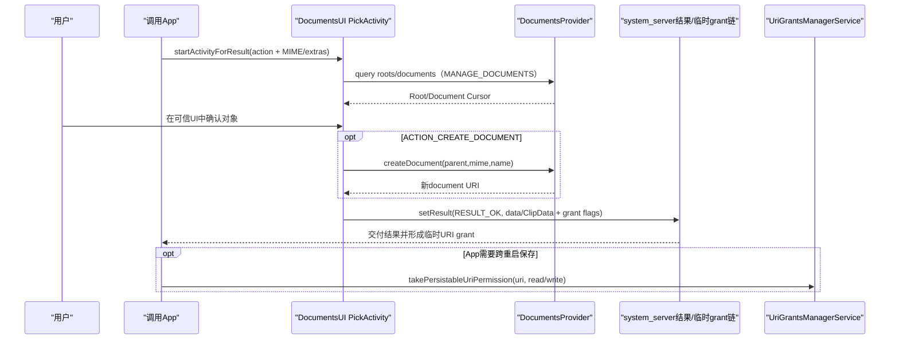
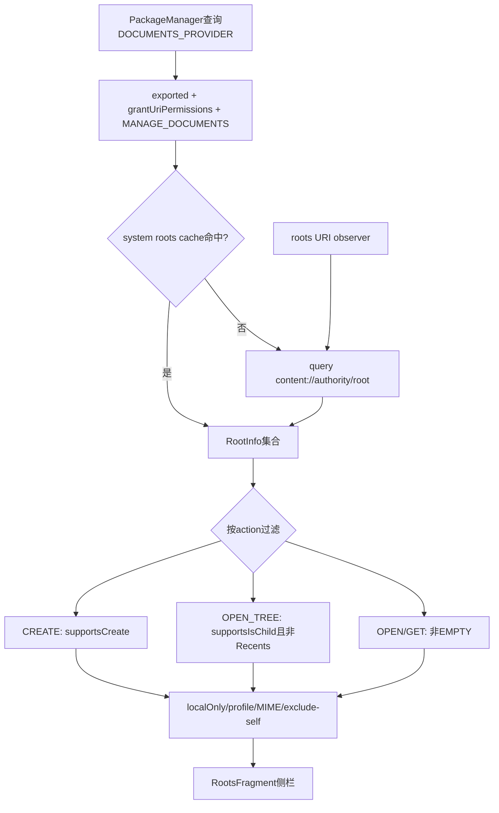
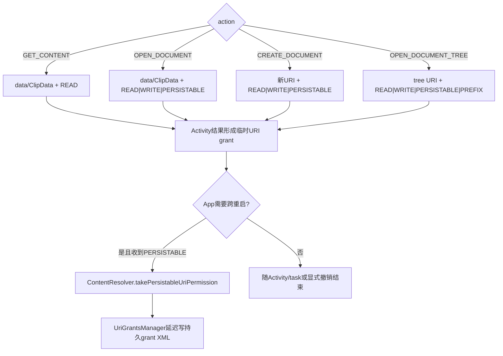

# 279 Android DocumentsUI文件选择、创建、目录树、Root/Directory加载、结果Intent与persistable URI grant链

## 1. 本章目标

第278章站在DocumentsProvider一侧看分类文档，本章站到系统文件选择器DocumentsUI：App发出`ACTION_OPEN_DOCUMENT`、`ACTION_CREATE_DOCUMENT`、`ACTION_GET_CONTENT`或`ACTION_OPEN_DOCUMENT_TREE`后，PickActivity如何形成State、筛root、加载目录、返回单个URI或ClipData，以及调用App如何把“可持久化授权”真正保存下来。

## 2. Android 11版本边界

本文依据本地`android-11.0.0_r48`的`packages/apps/DocumentsUI`与framework UriGrants源码。跨profile、scoped storage目录树限制、EXTRA_INITIAL_URI及内部cache行为都有版本差异；学习时应把公开Intent/flag契约与r48 UI实现边界分开。

## 3. DocumentsUI不是DocumentsProvider

DocumentsUI是受信任的系统选择器和文件管理UI；各DocumentsProvider提供roots/documents数据。它持有MANAGE_DOCUMENTS来浏览Provider，却不会把这项组件权限交给调用App，而是由系统只授予用户最终选中的URI。

## 4. 四种公开action先分清

OPEN_DOCUMENT选择已有文档并可提供persistable grant；CREATE_DOCUMENT让Provider先创建一个新row/文件入口再返回；GET_CONTENT偏一次性取得内容，还可转发到其他App；OPEN_DOCUMENT_TREE选择目录并返回带prefix语义的tree URI。

## 5. URI不是文件路径

结果通常是`content://authority/document/docId`或tree URI。调用App应继续通过ContentResolver读写，不应依赖DATA列或把docId当路径；远端、云盘、虚拟文档都可能没有普通文件系统路径。

## 6. 源码地图

```text
packages/apps/DocumentsUI/AndroidManifest.xml
packages/apps/DocumentsUI/src/com/android/documentsui/picker/PickActivity.java
packages/apps/DocumentsUI/src/com/android/documentsui/picker/ActionHandler.java
packages/apps/DocumentsUI/src/com/android/documentsui/picker/CreatePickedDocumentTask.java
packages/apps/DocumentsUI/src/com/android/documentsui/roots/ProvidersCache.java
packages/apps/DocumentsUI/src/com/android/documentsui/roots/ProvidersAccess.java
packages/apps/DocumentsUI/src/com/android/documentsui/DirectoryLoader.java
packages/apps/DocumentsUI/src/com/android/documentsui/MultiRootDocumentsLoader.java
frameworks/base/core/java/android/content/ContentResolver.java
frameworks/base/services/core/java/com/android/server/uri/UriGrantsManagerService.java
```

## 7. PickActivity的Manifest入口

exported且visibleToInstantApps的PickActivity为OPEN_DOCUMENT、CREATE_DOCUMENT、GET_CONTENT注册`*/*`与OPENABLE category，为OPEN_DOCUMENT_TREE注册独立filter，priority为100。Intent解析和用户交互发生在DocumentsUI进程，provider查询跨Binder执行。

## 8. RESULT_CANCELED是默认结果

BaseActivity启动时先设置取消结果；只有真正完成选择才覆盖为RESULT_OK。返回键、窗口关闭、Provider失败或用户取消都不会意外留下上次URI，调用App必须先判断resultCode。

## 9. 三方职责

调用App声明“想选什么”；DocumentsUI负责可信UI、导航和结果Intent；DocumentsProvider负责实际query/open/create。UriGrantsManagerService则保存临时与持久grant。把四方代码混在一个“文件选择器返回路径”概念里会丢掉安全边界。

## 10. 端到端总图



## 11. action归一成内部State

PickActivity.includeState把四个公开action分别映射为`ACTION_OPEN`、`ACTION_CREATE`、`ACTION_GET_CONTENT`、`ACTION_OPEN_TREE`。其余内部copy destination action也复用同一UI，但不属于普通App的SAF结果协议。

## 12. MIME默认值

Intent type为空时使用`*/*`；存在`EXTRA_MIME_TYPES`时用字符串数组覆盖单一type。后续root筛选、文档enable、搜索和结果ClipData description都读取`state.acceptMimes`。

## 13. EXTRA_MIME_TYPES不是附加条件

实现是“有数组就使用数组，否则使用type”，不是把两者做AND。调用方应提供合法具体MIME或通配类型，不要期待type和extra同时收窄。

## 14. multiple只对OPEN与GET生效

只有ACTION_OPEN/ACTION_GET_CONTENT读取`EXTRA_ALLOW_MULTIPLE`。CREATE必须返回一个新文档，OPEN_TREE只选一个目录；即使Intent错误携带multiple，内部State也不会把这两类变成多选。

## 15. CATEGORY_OPENABLE的作用

OPEN、GET、CREATE记录`state.openableOnly`。Config遇到`FLAG_VIRTUAL_DOCUMENT`且openableOnly为true会禁用该leaf；目录仍可进入。OPENABLE表达调用者需要普通openFile能力，不接受只能通过typed stream转换的虚拟文档。

## 16. localOnly怎样过滤root

`Intent.EXTRA_LOCAL_ONLY=true`时，ProvidersAccess排除没有`Root.FLAG_LOCAL_ONLY`的root。它限制数据源能力，不保证每个对象都在某个公开POSIX路径，也不等同于离线内容已经完整缓存。

## 17. EXTRA_EXCLUDE_SELF

若请求带`DocumentsContract.EXTRA_EXCLUDE_SELF`，DocumentsUI根据可信calling package读取该包声明的所有provider authority并加入excludedAuthorities，root匹配时排除。常用于Provider自己的“导入/选择”UI避免用户选回自身。

## 18. calling package怎样确定

默认取Activity.getCallingPackage；只有system/updated-system调用方可用`Intent.EXTRA_PACKAGE_NAME`覆盖。这防止普通App冒充另一个包污染last-accessed状态或绕过exclude-self策略。

## 19. scoped storage树限制开关

R上compat change `141600225`对target Q之后启用`restrictScopeStorage`。它不是全局禁止SAF，而是让UI尊重Provider在目录Document flags中标记的`FLAG_DIR_BLOCKS_OPEN_DOCUMENT_TREE`。

## 20. 哪些目录会被block

ExternalStorageProvider继承FileSystemProvider，在受限目录上设置BLOCKS_OPEN_DOCUMENT_TREE；典型意图是阻止App用tree grant拿整棵存储根或Android/data、Android/obb等敏感范围。UI仍可浏览某些位置，但确认按钮会禁用并覆盖提示层。

## 21. action决定底部控件

CREATE显示SaveFragment收集MIME、文件名和替换目标；OPEN_TREE与内部copy destination显示PickFragment确认当前目录；OPEN/GET直接点击leaf完成，不需要底部“保存到此处”。

## 22. GET_CONTENT为何可显示其他App

RootsFragment仅在GET_CONTENT时`includeApps=true`。ActionHandler转发到外部App前移除read/write/persistable/prefix flags，再添加FORWARD_RESULT，避免把DocumentsUI自己的能力错误扩大给被启动组件。

## 23. 跨profile State

R且feature开启时，除内部copy/move外picker支持profile tabs。每个RootInfo、DocumentInfo都带UserId；真正返回前`canShare()`再次确认能与目标profile交互，而不是只相信UI列表曾经过滤。

## 24. 初始位置优先级

恢复的saved State最高；内部copy destination固定Home；feature允许且Intent有`EXTRA_INITIAL_URI`时尝试root/document；否则读取该calling package上次访问stack，失败才按action选默认位置。

## 25. EXTRA_INITIAL_URI只是一条hint

root URI直接loadRoot；document URI用findDocumentPath重建DocumentStack。URI无效、Provider不支持路径、root已被当前State过滤或权限失败时会回退，不承诺一定停在指定目录。

## 26. tree URI先窄化成plain document

LoadDocStackTask遇到tree URI，取当前document id重建普通document URI，再调用findDocumentPath寻找从root到目标的路径。它这样做是为了恢复完整导航stack，而不是扩大原调用App的tree权限。

## 27. findDocumentPath是best effort

Provider可不支持或返回null，网络/权限也会失败。DocumentsUI记录日志并回退；初始URI功能不应成为选择流程的单点故障。

## 28. r48的null日志bug

`buildStack()`发现root为null时，异常消息却访问`root.userId`，会先触发NullPointerException。外层catch仍把整个初始URI恢复当失败处理，所以UI通常回退，但日志不再是设计的IllegalStateException。

## 29. last accessed按调用包隔离

LastAccessedProvider以calling package为key持久化DocumentStack。不同App打开选择器会恢复各自最近位置；成功create/pick前ActionHandler更新它，不能把它理解为全系统统一“最近目录”。

## 30. 默认位置按action不同

CREATE默认Home，OPEN_TREE默认device root，OPEN与GET默认Recents。默认只是无可恢复stack时的策略，root筛选仍可能让目标不可用。

## 31. ProvidersCache怎样发现Provider

后台UpdateTask按可交互UserId调用PackageManager.queryIntentContentProviders，查询action为`android.content.action.DOCUMENTS_PROVIDER`，并为每个authority加载roots。Recents是DocumentsUI自己合成的特殊root，不来自远端Provider。

## 32. root Provider必须通过结构验证

loadRootsForAuthority再次检查provider exported、grantUriPermissions，且read/write权限都必须是MANAGE_DOCUMENTS。不合规provider即使声明intent-filter也不会进入root列表。

## 33. stopped package延迟唤醒

常规全量更新先跳过FLAG_STOPPED的DocumentsProvider，记录到stoppedAuthorities；只有UI真正请求相关authority时再加载，避免启动选择器就唤醒所有长期未用应用。

## 34. roots查询使用unstable client

DocumentsUI取得对应用户ContentResolver，用unstable ContentProviderClient查询`content://authority/root`。一个Provider崩溃不会让DocumentsUI永久绑定稳定引用；异常只让该authority本轮roots缺失。

## 35. system roots cache

非强制刷新时先查ContentResolver的system cache，key是roots URI；新查询成功后把RootInfo ArrayList放回长寿命system进程缓存。包或URI变化由系统负责失效，减少DocumentsUI进程重启后的远端查询。

## 36. 空roots通常不缓存

除白名单authority外，Provider返回空roots会被视作可疑并不写system cache，下一次还能重试。这也与第278章MediaDocumentsProvider ready前先返回空、随后roots notify的设计呼应。

## 37. roots ContentObserver

第一次观察authority时注册roots URI且notifyForDescendants=true。Provider调用`notifyChange(buildRootsUri())`后，main looper observer触发该package/authority异步刷新，再由本地broadcast推动UI更新。

## 38. first load最多等15秒

同步取roots的方法调用`waitForFirstLoad()`，CountDownLatch等待15秒后即使失败也继续，以避免永久卡住UI。超时意味着本轮列表可能暂不完整，后续package/roots更新仍能补齐。

## 39. action级root筛选

CREATE和copy destination要求Root.FLAG_SUPPORTS_CREATE；OPEN_TREE要求FLAG_SUPPORTS_IS_CHILD且排除Recents；OPEN/GET排除EMPTY；另外统一应用localOnly、profile交互、MIME overlap和excluded authority。

## 40. MediaDocuments roots不能选tree

第278章四个媒体分类root没有FLAG_SUPPORTS_IS_CHILD，所以ProvidersAccess会在ACTION_OPEN_TREE直接排除。它们适合OPEN/GET分类选媒体，不是可持久遍历的真实目录树。

## 41. MIME overlap双向比较

root derived MIME与state accept MIME做两个方向的`mimeMatches`，兼容`image/*`与具体`image/jpeg`的宽窄组合。完全不重叠的root在侧栏消失，避免进入后才发现全是禁用项。

## 42. Recents是跨root聚合

OPEN/GET默认进入DocumentsUI合成Recents。RecentsLoader只查询LOCAL_ONLY且SUPPORTS_RECENTS、属于当前用户的root，再按authority并发请求各root recent URI，过滤旧项/MIME并合并排序。

## 43. root发现与筛选图



## 44. 当前目录由DocumentStack表示

State.stack保存RootInfo和从root到当前目录的DocumentInfo序列。导航进入目录push，返回pop；root、当前工作目录和用户身份都从stack获得，不能只靠一个裸document URI恢复完整面包屑。

## 45. DirectoryLoader按authority选择executor

普通目录加载使用`ProviderExecutor.forAuthority(root.authority)`，让同一Provider的工作在其专用执行器上有序进行，避免一个慢authority占住所有任务；不同authority仍可并行。

## 46. children与search共用loader

构造时有queryArgs即search mode，否则查询当前children URI。SortModel把结构化排序参数加入Bundle；search再合并名称、MIME等query args，交给DocumentsProvider新式Bundle query入口。

## 47. CancellationSignal真实下传

loadInBackground创建signal并传给ContentProviderClient.query；cancelLoadInBackground会cancel同一对象。Provider是否及时响应取决于自身实现，第278章已看到MediaDocumentsProvider部分查询没有继续下传。

## 48. 多profile搜索条件

只有State支持跨profile、root也支持cross-profile，且queryArgs含DISPLAY_NAME时才跨可交互user执行相同authority搜索；普通目录浏览仍绑定root.userId。

## 49. quiet mode与权限错误

当前profile不可交互时返回CrossProfileNoPermissionException，工作profilequiet时返回CrossProfileQuietModeException。它们进入DirectoryResult让UI显示可操作状态，而不是把空Cursor误当目录真的没有文件。

## 50. unstable client与archive特例

普通query通过每个用户的unstable client；若当前DocumentInfo位于DocumentsUI ArchivesProvider，还先acquire archive并把client留到DirectoryResult生命周期结束，保证压缩包虚拟目录可继续读取。

## 51. Cursor观察与重新加载

query结果注册LockingContentObserver；onChange标记loader content changed并重新query。Provider通知只是刷新信号，旧Cursor不会自动增加行，这与第278章MatrixCursor通知模型一致。

## 52. 隐藏文件过滤在客户端补一层

底层Cursor先包`FilteringCursorWrapper`，按用户设置决定是否展示隐藏项。Provider仍可能返回它们，DocumentsUI展示策略与Provider数据可见性是两层。

## 53. 搜索目录过滤

feature未开启“搜索结果显示文件夹”时，search mode拒绝directory MIME，因为旧Provider不一定支持findDocumentPath，点搜索目录后难以可靠重建导航路径。

## 54. 图片选择过滤

当OPEN/GET且所有acceptMimes都是图片时，`isPhotoPicking()`成立，DirectoryLoader只保留directory与image MIME。这是UI结果整形，不等于启用后来的系统Photo Picker API。

## 55. Provider排序与本地排序

若paging feature和Cursor extras表明排序已被honor，DocumentsUI可跳过；否则SortModel重新排序Cursor。r48注释承认检测方式仍是临时方案，因此Provider收到sort hint不代表最终UI一定保留它的顺序。

## 56. query异常不会崩Activity

RemoteException、Provider错误或Cursor处理异常被写入DirectoryResult.exception，并关闭client；UI据此显示错误/重试。选择器把不可信Provider当故障域隔离。

## 57. loader结果生命周期

新DirectoryResult替换旧结果时关闭旧Cursor，Activity停止会cancel，reset会注销observer并关闭资源。Cursor和Provider client不能泄漏到调用App；最终只返回选中URI。

## 58. stale检查的代价

复用缓存结果前，`checkIfCursorStale()`把Cursor从-1遍历到count验证可读；任一异常视为stale并重载。它能发现死亡远端Cursor，但大目录会产生一次O(n)探测。

## 59. MultiRoot第一阶段只等短窗口

Recents等聚合loader按authority启动QueryTask，用CountDownLatch只等待`MAX_FIRST_PASS_WAIT_MILLIS`；未完成任务通过EXTRA_LOADING=true告诉UI仍在加载，后续完成再发结果，避免一个云Provider拖住首屏。

## 60. authority级并发限流

MultiRootDocumentsLoader还用Semaphore限制同时查询数，低内存设备额度更小。它按authority聚合root并行，而不是为每个root无限开线程，降低启动时Binder和缩略图压力。

## 61. leaf是否可点击由Config决定

目录始终enabled以便导航；OPEN_TREE/copy destination不允许直接“选中列表里的目录”，必须进入目录后点底部确认；普通leaf再按action、flags、virtual/openable和MIME判断。

## 62. OPEN与GET的leaf规则

非目录、MIME匹配即可候选；若是`FLAG_VIRTUAL_DOCUMENT`且请求带CATEGORY_OPENABLE则禁用。没有OPENABLE时，调用方应准备使用`getStreamTypes/openTypedAssetFile`处理Provider可转换格式。

## 63. CREATE下已有文件为何要求write flag

在CREATE界面点击同名已有leaf表示替换目标，Config要求`Document.FLAG_SUPPORTS_WRITE`。只读文件会禁用，防止UI返回一个调用方随后无法写入的旧URI。

## 64. 点击目录与点击文件分流

PickActivity.onDocumentPicked遇目录就openContainerDocument并记录搜索历史；OPEN/GET的leaf先做跨profile最终检查，再finishPicking；CREATE点击leaf只交给SaveFragment设replaceTarget，不立即返回。

## 65. 多选怎样转URI数组

onDocumentsPicked仅服务OPEN/GET，逐个取`doc.getDocumentUri()`，同时检查是否含跨profile对象，然后调用finishPicking(Uri[])。任何一项不可share都会拒绝整组，不返回部分成功。

## 66. archive可以选但不内联打开

注释明确不要自动把archive当目录进入，否则用户永远无法选择zip本身；而在archive内部挑文件又不受支持。DocumentsUI需在“容器导航能力”和“这个对象就是选择结果”之间按场景取舍。

## 67. OPEN_TREE选择的是当前目录

列表中的目录只用于导航，PickFragment的pickTarget是stack.peek当前目录。用户点击“使用此文件夹”后先弹确认，再由ActionHandler把该document的URI转成结果tree语义。

## 68. root先要求supportsChildren

ACTION_OPEN_TREE在root筛选阶段要求`Root.FLAG_SUPPORTS_IS_CHILD`，因为后续tree URI访问必须验证目标是tree root后代。只有能回答isChildDocument的Provider才适合prefix授权。

## 69. 当前目录还可能被R策略阻止

即使root支持tree，DocumentInfo若含`FLAG_DIR_BLOCKS_OPEN_DOCUMENT_TREE`且compat restriction生效，PickFragment禁用确认。这个Document flag由Provider按具体目录设置，比root级过滤更细。

## 70. CREATE先验证cwd可创建

SaveFragment.prepareForDirectory只有当前DocumentInfo存在且`FLAG_DIR_SUPPORTS_CREATE`时启用保存按钮。Root supportsCreate只是入口粗筛，深入某个只读子目录后仍会禁用。

## 71. 新建任务运行在哪

CreatePickedDocumentTask通过`getExecutorForCurrentDirectory()`选择当前authority执行器，在后台调用DocumentsAccess.createDocument，UI prepare/finish阶段切换保存按钮进度状态，避免Binder或远端I/O阻塞主线程。

## 72. createDocument真正创建对象

DocumentsAccess取得parent所在user的ContentResolver和unstable client，调用`DocumentsContract.createDocument(parentUri,mime,displayName)`。Provider可清洗或修改名称，返回的新URI才是权威结果。

## 73. CREATE返回时内容可能仍为空

DocumentsUI只负责让Provider建立document并返回URI，不替调用App写业务字节。调用方收到RESULT_OK后仍需`openOutputStream/openFileDescriptor`写内容并处理异常。

## 74. cross-profile创建补user authority

跨用户ContentResolver返回的URI本身可能不带user info，DocumentsAccess用parent document URI的encoded authority补回用户标识，否则调用App会把它错误路由到当前用户Provider。

## 75. 创建失败不会返回假URI

任何Provider异常被DocumentsAccess记录并返回null；Task显示save_error Snackbar、恢复按钮，不调用结果callback。RESULT仍保持默认CANCELED，用户可修名、换目录或退出。

## 76. replace不是DocumentsUI主动截断

选择已有可写leaf并确认替换时，ActionHandler直接finishPicking(existingUri)，不调用delete、create或truncate。真正覆盖行为取决于调用App随后用何种mode打开URI。

## 77. last accessed写入时机

新建成功后Task立即记录stack；普通finishPicking则先运行SetLastAccessedStackTask，再组装结果。它保存导航体验，不参与URI授权，也不证明App已成功读取/写入结果。

## 78. 单选结果放data

`uris.length==1`时创建空Intent并`setData(uri)`；调用App从`resultIntent.getData()`取值。没有同时复制一份单项ClipData，因此接收端要正确处理两种形态。

## 79. 多选结果放ClipData

大于一项时，以acceptMimes创建ClipData并逐项addItem，data保持null。调用App必须遍历`getClipData().getItemCount()`，不要只读data后误判用户取消。

## 80. 零URI不应成为成功选择

onPickFinished理论上可构造无data/ClipData的Intent，但正常调用路径只在有效选择/create成功后进入。默认取消结果与UI检查共同防御空结果；接收端仍应验证URI非null。

## 81. GET_CONTENT只返回read flag

ACTION_GET_CONTENT在结果Intent只加`FLAG_GRANT_READ_URI_PERMISSION`，没有write、persistable或prefix。它偏向当前交互的一次性内容消费，不能在App端合法调用takePersistable保存。

## 82. OPEN_DOCUMENT的flags

ACTION_OPEN落入通用else，加入READ、WRITE、PERSISTABLE。Provider具体Document flags仍决定写FD等操作是否实现；write URI capability还可能用于delete等独立操作，不能由结果flag推断文件一定可编辑。

## 83. CREATE_DOCUMENT的flags

CREATE同样返回READ、WRITE、PERSISTABLE，让调用App写入刚创建对象并可跨重启保留。DocumentsUI不因create动作自动打开输出流，也不替App调用take持久授权。

## 84. 结果Intent与grant图



## 85. OPEN_TREE再多两个flag

tree结果除read/write/persistable外还带PREFIX，授权覆盖tree document及Provider判定为后代的document URI。prefix不是字符串路径前缀猜测，而是DocumentsContract tree结构与`isChildDocument()`安全验证。

## 86. DocumentsUI不直接调用grantUriPermission

它只在RESULT_OK Intent上附data/ClipData和access flags；Activity结果交付链由system_server核验URI provider允许grant、选择器有资格转授，再为目标调用App建立临时UriPermission。结果flags是授权请求描述，不是普通extras。

## 87. 为什么可信选择器能转授

DocumentsUI持有MANAGE_DOCUMENTS并从Provider读取对象，Provider又要求`grantUriPermissions=true`。UriGrantsManager检查content scheme、authority、provider policy及调用/目标UID，不能由任意App把自己无权访问的URI塞进结果Intent完成转授。

## 88. persistable只是“可被take”

结果含`FLAG_GRANT_PERSISTABLE_URI_PERMISSION`表示当前grant的read/write位允许目标App选择持久化。若App不调用`takePersistableUriPermission()`，跨进程重启/任务生命周期后的长期访问没有保证。

## 89. App应怎样取modeFlags

通常从resultIntent flags中只保留READ与WRITE，再传给take；不能把PERSISTABLE或PREFIX本身作为modeFlags，因为ContentResolver API只接受read/write两位。

## 90. take进入哪个服务

ContentResolver去掉URI内嵌user id、解析userId，然后Binder调用UriGrantsManagerService。普通重载以Binder calling UID为目标；隐藏的toPackage重载需要`FORCE_PERSISTABLE_URI_PERMISSIONS`。

## 91. isolated进程不能take

服务先`enforceNotIsolatedCaller()`，再用Preconditions限制flags。持久授权绑定正常应用UID/package身份，isolated UID生命周期短且不能拥有这类长期能力。

## 92. 必须已有可持久化grant

服务查目标UID对该URI的exact与prefix UriPermission，要求请求的read/write子集被`persistableModeFlags`覆盖；两者都不满足就SecurityException。App不能对任意content URI主动制造持久权限。

## 93. exact与prefix可以同时take

若同一URI同时命中exact和prefix grant，服务对两者都调用takePersistableModes。tree选择通常依赖prefix，普通OPEN/CREATE常见exact；查询权限时二者按各自GrantUri key保存。

## 94. take不扩大read/write

`persistedModeFlags |= persistableModeFlags & requested`，只固化已被offer且App请求的位。只收到read就不能take write；App也可有意只保存read，降低长期权限范围。

## 95. persisted time会被touch

只要持久mode非零，takePersistableModes就把`persistedCreateTime`更新为当前时间；文档也说明重复take会touch时间。该时间用于旧grant裁剪排序，不是文档内容修改时间。

## 96. r48重复take的写盘边界

方法返回值只比较persisted mode前后是否变化。重复take相同flags虽更新内存时间却返回false；若没有其他变更触发schedule，新的touch时间可能不会单独写盘，重启后仍是旧磁盘时间。

## 97. 每UID上限512

`MAX_PERSISTED_URI_GRANTS=512`。take后调用prune，按persistedCreateTime从旧到新排序，超过上限时释放最老项，防止App无限积累长期capability。

## 98. prune使用总permission map作前置判断

它先看该UID所有UriPermission map size是否小于512，再收集persisted项；包含临时项的总数只会让它更早进入统计，最终trimCount仍按persisted数量计算，不会误删纯临时grant。

## 99. prune真实变化会触发写盘

没有超限或无需裁剪时helper返回false；实际release并remove旧grant后返回true。调用者把它OR进`persistChanged`，所以即使本次take没有新增mode，只要发生裁剪仍会安排持久化。不要把前面的多处早退误读成函数最终固定返回false。

## 100. 写盘有10秒去抖

状态变化时`schedulePersistUriGrants()`若无同类消息，延迟10秒发送；handler在锁内snapshot所有persisted permission，再用AtomicFile语义写grant XML。take成功不等于调用返回瞬间磁盘文件已更新。

## 101. 持久文件保存什么

每项记录source/target user、source/target package、URI、prefix、persisted mode flags和created time。它保存授权关系而不是文件内容；Provider删除document或撤grant后该能力仍可失效。

## 102. release只撤持久部分

`releasePersistableUriPermission(uri,read/write)`清persistedModeFlags并安排写盘；API文档明确同URI的非持久临时grant可继续存在。release不是删除文档，也不通知Provider改row。

## 103. getPersisted只看incoming persisted

调用App的`getPersistedUriPermissions()`向服务查询本包incoming且persistedOnly列表；它不会列出尚未take的临时结果grant。第278章MediaStore.getDocumentUri正是把这份列表交给ExternalStorageProvider匹配。

## 104. 旋转与进程重建

PickActivity把State和PickResult写savedInstanceState；恢复时已初始化stack优先，不重新读initial/last accessed。进行中的Provider AsyncTask仍需按组件生命周期处理，结果未完成前默认CANCELED保持安全。

## 105. 当前目录通知如何回到UI

Provider Cursor notification触发DirectoryLoader observer，loader重新query、过滤和排序，再让DirectoryFragment更新Model。roots变更则走ProvidersCache observer和RootsMonitor，两条刷新链不要混用。

## 106. MIME正确不代表可打开

root MIME只做入口筛选，document MIME与virtual/openable决定leaf状态，最终open还可能因Provider权限、离线或格式转换失败。选择器尽量前置过滤，但调用App仍必须捕获FileNotFound/IOException。

## 107. CREATE成功也可能后续写失败

Provider create与App write是两个Binder操作，中间没有跨组件事务。空间耗尽、远端断线或grant被撤都会让写失败；App应关闭FD、展示错误，必要时通过Provider能力删除空document。

## 108. OPEN_TREE不是MANAGE_EXTERNAL_STORAGE

tree grant只覆盖用户明确选定树且受Provider后代检查与R目录block约束；MANAGE_EXTERNAL_STORAGE是AppOps/权限层面的广域共享存储能力。二者来源、范围和撤销模型完全不同。

## 109. 排查“root不显示”

依次检查Provider intent-filter和Manifest四条件、是否stopped、roots是否ready/EMPTY、action要求create/isChild、localOnly、profile、MIME overlap及exclude-self，再看roots observer和system cache，不要只查Provider queryDocument。

## 110. 排查“拿到URI重启后失效”

确认action不是GET_CONTENT，result flags含PERSISTABLE，App确实以READ/WRITE子集调用take且未捕获后忽略SecurityException，再用getPersisted验证；还要确认Provider没有删除document或主动revoke。

## 111. 阅读完成检查

你应能从Intent→State→Provider discovery/root filter→DirectoryLoader→用户选择→data/ClipData→临时grant→App take→UriGrants XML完整复述，并解释CREATE只建对象不写业务内容、OPEN_TREE prefix不等全盘权限。

## 112. macOS只读练习一：比较四种action

```bash
cd /Users/ninebot/androidSource
sed -n '35,90p' packages/apps/DocumentsUI/AndroidManifest.xml
sed -n '200,315p' packages/apps/DocumentsUI/src/com/android/documentsui/picker/PickActivity.java
sed -n '400,455p' packages/apps/DocumentsUI/src/com/android/documentsui/picker/ActionHandler.java
```

制作表格记录每种action的internal State、multiple/openable、默认位置、单/多结果载体和READ/WRITE/PERSISTABLE/PREFIX flags，特别解释GET_CONTENT为何不能take。

## 113. macOS只读练习二：追root与目录加载

```bash
cd /Users/ninebot/androidSource
sed -n '185,360p' packages/apps/DocumentsUI/src/com/android/documentsui/roots/ProvidersCache.java
sed -n '60,135p' packages/apps/DocumentsUI/src/com/android/documentsui/roots/ProvidersAccess.java
sed -n '80,280p' packages/apps/DocumentsUI/src/com/android/documentsui/DirectoryLoader.java
```

画出Provider发现、Manifest验证、system cache、roots observer、action过滤、authority executor、CancellationSignal、Cursor observer和客户端filter/sort，指出MediaDocuments root为何不能用于OPEN_TREE。

## 114. macOS只读练习三：追CREATE与tree限制

```bash
cd /Users/ninebot/androidSource
sed -n '145,210p' packages/apps/DocumentsUI/src/com/android/documentsui/picker/PickFragment.java
sed -n '35,110p' packages/apps/DocumentsUI/src/com/android/documentsui/picker/CreatePickedDocumentTask.java
sed -n '145,180p' packages/apps/DocumentsUI/src/com/android/documentsui/DocumentsAccess.java
sed -n '580,625p' frameworks/base/core/java/com/android/internal/content/FileSystemProvider.java
```

解释root supportsCreate、cwd DIR_SUPPORTS_CREATE、BLOCKS_OPEN_DOCUMENT_TREE各在哪一层生效，并推演新建空document、返回URI、App写字节三个独立阶段。

## 115. macOS只读练习四：验证persistable grant

```bash
cd /Users/ninebot/androidSource
sed -n '2835,2920p' frameworks/base/core/java/android/content/ContentResolver.java
sed -n '340,405p' frameworks/base/services/core/java/com/android/server/uri/UriGrantsManagerService.java
sed -n '545,580p' frameworks/base/services/core/java/com/android/server/uri/UriGrantsManagerService.java
sed -n '1075,1090p' frameworks/base/services/core/java/com/android/server/uri/UriGrantsManagerService.java
```

用“offer→temporary→take→persisted→release”五态画状态机，验证exact/prefix、read/write子集、512上限、10秒写盘，并标出重复take只touch时间却不改变mode、真实prune返回true的分支。

## 116. 易混点一：PERSISTABLE flag不等于已经持久化

DocumentsUI只offer；Activity结果先形成临时grant。调用App必须主动take，且只能take收到的read/write位。getPersisted能提供比“代码执行过take”更强的验证证据。

## 117. 易混点二：CREATE不是写文件全过程

Picker调用Provider createDocument得到新URI后立即返回；文件内容由调用App写入。创建成功、授权成功、写入成功是三个可分别失败的状态。

## 118. 易混点三：tree不是任意目录递归通行证

root要支持isChild，具体目录可能被R策略block，后代访问还要Provider验证。PREFIX描述授权形态，不绕过Provider的树结构和用户范围。

## 119. 复读纠偏记录

复读后修正十二点：GET_CONTENT仅临时read；OPEN/CREATE offer read/write/persistable；OPEN_TREE再加prefix；DocumentsUI不替App take；单选在data、多选在ClipData；CREATE只创建对象；replace不主动truncate；MediaDocuments roots因无supports-is-child不进tree；initial URI只是hint；DirectoryLoader下传signal但Provider可丢；persist写盘延迟10秒；重复take相同mode只touch内存时间而真实prune会返回true触发写盘。

## 120. 本章小结与下一章

DocumentsUI把不可信Provider集合包装成可信用户决策：Intent先变State，ProvidersCache发现并筛root，DirectoryLoader以取消、观察、过滤和排序加载目录，选择/创建后以data或ClipData加最小action语义的grant flags返回；临时授权由系统交付，长期授权必须调用App显式take并由UriGrantsManager持久化。下一章继续深入Android UriGrantsManagerService的GrantUri、UriPermissionOwner、Activity/ClipData递归授权、prefix匹配、跨用户检查、撤销与持久文件恢复链。
