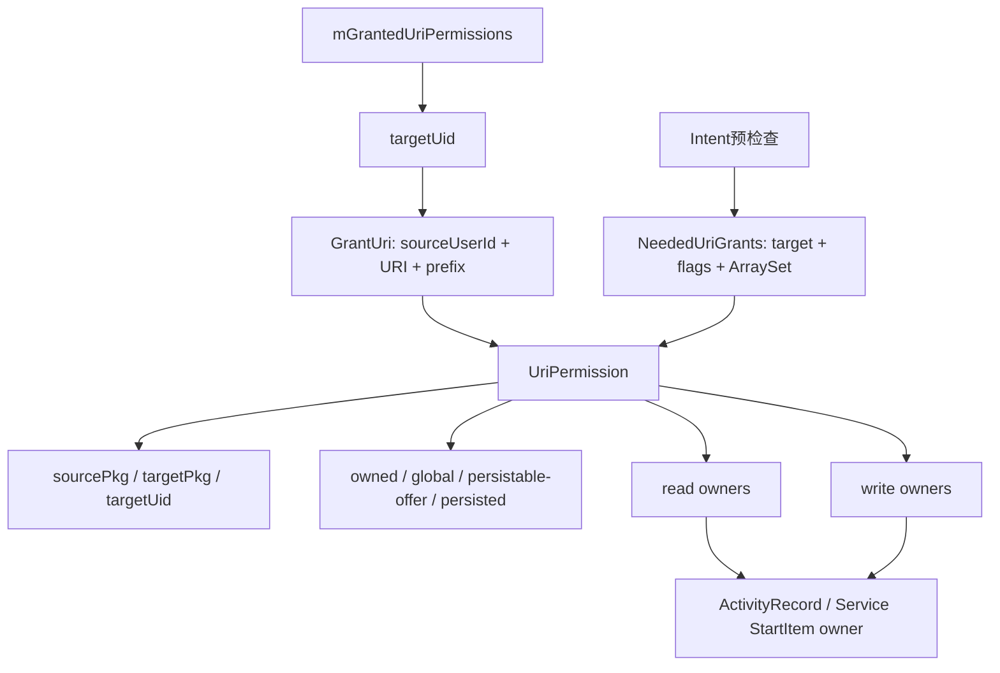
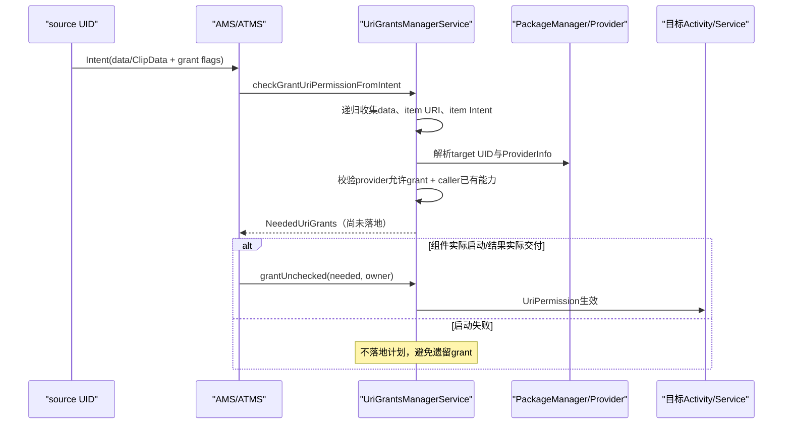
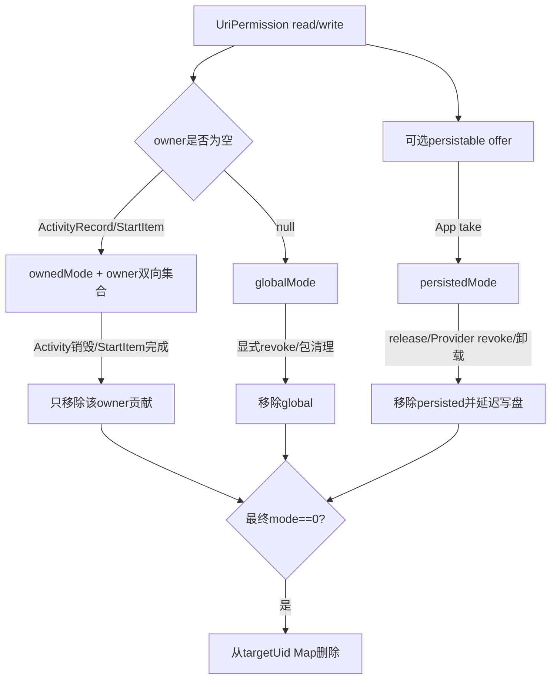

# 280 Android UriGrantsManagerService：GrantUri、UriPermissionOwner、Intent/ClipData递归授权、prefix、跨用户、撤销与持久恢复链

## 1. 本章目标

第279章追到DocumentsUI结果产生临时grant并由App选择take，本章进入system_server的`UriGrantsManagerService`：授权对象如何建模，Intent/ClipData中哪些URI会被收集，source能否转授怎样校验，Activity/Service owner怎样控制生命周期，exact/prefix怎样命中，以及撤销、包卸载和`urigrants.xml`恢复怎样收尾。

## 2. Android 11版本边界

本文依据本地`android-11.0.0_r48`。动态MediaProvider permission、512上限、10秒写盘、ActivityRecord/ServiceRecord owner绑定与撤销分支都是该tag实现；后续Android把部分包名和服务结构调整后，应重新对源码验证。

## 3. URI grant是什么

它是system_server记录的“目标UID可用read/write访问某个source user下content URI”的能力。它不改变Provider数据库owner、不复制文件、不赋予调用App组件权限，也不保证Provider之后永远保留该document。

## 4. 四个核心对象

`GrantUri`是URI键；`UriPermission`是source/target与mode状态；`UriPermissionOwner`绑定临时grant生命周期；`NeededUriGrants`是检查阶段形成、稍后批量落地的授权计划。Service用嵌套Map统一索引最终UriPermission。

## 5. 源码地图

```text
frameworks/base/services/core/java/com/android/server/uri/GrantUri.java
frameworks/base/services/core/java/com/android/server/uri/NeededUriGrants.java
frameworks/base/services/core/java/com/android/server/uri/UriPermission.java
frameworks/base/services/core/java/com/android/server/uri/UriPermissionOwner.java
frameworks/base/services/core/java/com/android/server/uri/UriGrantsManagerService.java
frameworks/base/services/core/java/com/android/server/wm/ActivityRecord.java
frameworks/base/services/core/java/com/android/server/wm/ActivityTaskManagerService.java
frameworks/base/services/core/java/com/android/server/am/ActiveServices.java
```

## 6. 服务启动

Lifecycle.onStart发布Binder名`uri_grants`并注册LocalService；SYSTEM_SERVICES_READY阶段取得ActivityManagerInternal与PackageManagerInternal。AMS/ATMS走本地接口减少Binder，App的take/release/get则走Binder接口。

## 7. 持久文件位置与锁

服务在system directory创建AtomicFile `urigrants.xml`，全局`mLock`保护嵌套授权Map和持久快照。Provider/PackageManager动态检查可能跨服务调用，因此源码明确要求某些校验函数绝不能持有mLock。

## 8. 全局索引结构

`SparseArray<ArrayMap<GrantUri,UriPermission>>`第一层key是targetUid，第二层是GrantUri。查询“某UID能否访问某URI”无需遍历所有App；outgoing查询或Provider撤销才会跨target UID扫描。

## 9. 为什么key必须含source user

相同authority/path在个人用户和工作资料可能代表不同Provider实例与数据。GrantUri把sourceUserId纳入hash/equals，防止跨用户URI因字符串相同被错误合并。

## 10. 数据模型图



## 11. GrantUri的三个字段

`sourceUserId`决定到哪个用户解析Provider，`uri`保存去掉嵌入user-id的标准URI，`prefix`来自GRANT_PREFIX flag。equals要求三者全相等，所以同URI的exact和prefix是两个独立Map key。

## 12. GrantUri.resolve处理嵌入用户

content URI若authority携带user id，resolve提取它覆盖default hint，并把URI标准化为无user-id形式；非content scheme保留default source user。后续真正授权只接受content scheme，但统一对象仍能承载检查输入。

## 13. prefix不是URI对象自身属性

同一个URI字符串可以同时存在exact key和prefix key。prefix来自授权时mode flag，不能看路径末尾斜杠猜；公开Uri对象本身也不告诉调用者当前grant是不是prefix。

## 14. NeededUriGrants是两阶段计划

它保存targetPkg、targetUid、原始access flags以及去重后的GrantUri集合。第一阶段只做解析与安全检查，第二阶段在Activity/Service真正交付前`grantUriPermissionUncheckedFromIntent()`落地，避免先授权后启动失败留下多余能力。

## 15. UriPermission的身份字段

每项固定sourcePkg、targetPkg、targetUid、targetUserId与GrantUri。sourcePkg来自当前authority解析出的Provider包，不信任Intent额外字符串；targetUid是缓存值，持久XML只保存package/user，重启后重新解析UID。

## 16. 四组mode要分开

ownedModeFlags由活跃owner支撑；globalModeFlags无显式owner；persistableModeFlags表示“允许take”的offer；persistedModeFlags表示已take且需跨重启恢复。最终访问`modeFlags=owned|global|persisted`，单有persistable offer不是独立访问来源。

## 17. persistable offer为何不进最终mode OR

正常grant同时把read/write放进owned或global，并额外标记可persist；将来临时/全局来源撤掉后，未take的offer不应让访问继续。只有persistedModeFlags才能独立跨生命周期保留。

## 18. owner read/write集合独立

UriPermission维护read owners和write owners，Owner反向也维护read/write permission集合。一个Activity owner消失只移除自己贡献的位；若还有其他owner，ownedMode相应bit继续存在。

## 19. grantModes怎样更新

先从modeFlags提取PERSISTABLE并把对应read/write OR进persistableModeFlags；owner为空则OR进global，非空则分别addReadOwner/addWriteOwner；最后重算有效mode。返回值固定false，因为普通grant不直接改变需写盘的persisted状态。

## 20. strength不是访问bit数量

`getStrength()`按请求位依次判断persistable offer、global、owned，返回PERSISTABLE/GLOBAL/OWNED/NONE。它用于判断caller是否有足够强的能力继续转授，PERSISTABLE强度描述可转持久性，不等于已take。

## 21. root UID特殊快路

`checkUriPermissionLocked()`对uid 0直接true。普通system UID却不走这个root快路；尤其系统直接签发URI grant还有额外防 confused-deputy 限制。

## 22. exact先于prefix

检查先按完整GrantUri key查exact；失败后遍历目标UID所有permission，要求候选key的prefix=true、请求URI对候选URI做`isPathPrefixMatch`，并满足最低strength。

## 23. prefix匹配还依赖同一Map语境

GrantUri Map属于同一targetUid，但prefix循环没有显式比较sourceUserId；`Uri.isPathPrefixMatch()`只看URI。r48代码因此看起来存在跨source user的prefix候选风险，必须结合调用处构造与Provider用户隔离继续审计，不能仅凭URI字符串宣称已比较user。

## 24. persistable请求提高最低strength

待转授mode带PERSISTABLE时，最低要求STRENGTH_PERSISTABLE；普通read/write只需OWNED。持有一次Activity owner grant的App可以基本转授，但不能把不可持久能力升级成可持久能力。

## 25. 服务先拒绝无access flag

`Intent.isAccessUriMode(modeFlags)`不成立直接返回-1，不建立任何记录。只有READ/WRITE相关请求才进入Provider解析；PERSISTABLE/PREFIX单独出现没有可授予内容。

## 26. 只处理content scheme

file/http等URI不会进入grant表。URI grant是ContentProvider访问控制机制；网络URL由网络权限管理，file URI跨App还受FileUriExposure等独立规则。

## 27. system/root不能随意代签

calling appId为SYSTEM_UID或ROOT_UID时，除两个Settings专用authority外直接返回-1并警告“use startActivityAsCaller”。原因是system_server自身权限过大，必须保留真实来源身份才能证明有权转授。

## 28. target UID怎样解析

有targetPkg时PackageManager按calling UID所在user取目标UID；Intent批量检查会先按明确targetUserId解析并复用lastTargetUid。包不存在返回null/-1，不生成悬空授权。

## 29. target本来有权限时的优化

先检查目标是否已持Provider顶层/路径/动态权限。若只是basic grant且目标已有完整访问，只授implicit package visibility后返回-1，不建立冗余UriPermission。

## 30. advanced flag仍需建账

请求PERSISTABLE或PREFIX时即使目标已有普通Provider权限，也继续检查Provider是否允许grant并建立记录，因为“可持久化/前缀”是基础组件权限无法表达的额外语义。

## 31. forceUriPermissions阻止快路

Provider声明`forceUriPermissions`时把targetHoldsPermission强制false，必须为具体item建grant。MediaProvider借此让动态row级owner/AppOps判断参与，而不是被粗粒度组件权限判成“不需要记录”。

## 32. Provider是否允许grant

默认读取`grantUriPermissions`；若声明uriPermissionPatterns，则至少一个pattern匹配路径才允许。Provider exported不等于允许任意App继续转授URI。

## 33. special cross-user grant

目标与source user不同，且source caller在不依赖UID权限时仍可访问公开URI，可形成特殊跨用户basic grant；若Provider不允许grant，advanced prefix/persistable仍被拒绝。它是窄兼容路径，不是跨用户权限替代品。

## 34. 最关键的source能力检查

通过Provider policy后，系统确认callingUid自己能访问URI：先查Provider owner/exported/top-level/path/dynamic权限；不够再查它已持有的UriPermission strength。没有能力就SecurityException，防止App转授自己也打不开的URI。

## 35. MANAGE_DOCUMENTS错误提示

若Provider readPermission是MANAGE_DOCUMENTS，异常会提示可通过ACTION_OPEN_DOCUMENT等API取得访问。它没有给权限，只说明正确的用户授权入口。

## 36. 顶层Provider权限检查

source UID等于Provider UID直接true；Provider不exported且不是self则false。read/write分别按本次请求判断，未请求的一侧初始即满足。

## 37. path-permission会收紧默认开放

即使provider顶层无permission，匹配path-permission却声明具体read/write权限时，未持有者会失去默认开放；持有对应UID permission才能满足该位。倒序扫描与ContentProvider入口语义保持接近。

## 38. 跨用户先要INTERACT_ACROSS_USERS

checkHoldingPermissions发现UID user与sourceUserId不同，先要求INTERACT_ACROSS_USERS；否则即便相同包名或Provider路径公开也返回false。user id是安全边界，不是URI装饰字段。

## 39. MediaProvider动态权限门

当forceUriPermissions、feature enabled且MediaProvider模块版本达到阈值，服务调用AM的`checkContentProviderUriPermission()`让Provider按具体URI/UID/mode判断。Provider与client跨用户时直接forceMet=false，因为Provider无法跟踪这类动态授权。

## 40. 模块版本只检查一次

首次从ModuleInfo/APEX包版本判断是否≥301400000并缓存；找不到模块时按非模块构建必须已包含配套改动处理为true。运行期模块替换不会在该进程重新计算。

## 41. Intent data先收集

`checkGrantUriPermissionFromIntentUnlocked()`读取intent.getData，使用contentUserHint解析GrantUri，逐项调用完整安全检查；只有返回targetUid>0才加入Needed集合。

## 42. ClipData URI逐项收集

遍历所有ClipData.Item；item.getUri非null就与data相同检查。ArraySet去重相同GrantUri，多选结果不会因重复项建立多份permission。

## 43. ClipData内嵌Intent递归

若item没有URI但有Intent，函数递归解析它的data和clip，复用同一个NeededUriGrants。嵌套Intent可携带URI能力，因此安全检查不能只看最外层data。

## 44. Intent授权两阶段图



## 45. 同一mode应用于整份Intent

递归解析传入的是最外层Intent flags，不读取每个嵌套Intent自己的grant flags重新扩大范围。嵌套对象只是URI载体，授权位由外层交付动作控制。

## 46. contentUserHint默认calling user

hint为USER_CURRENT时改成callingUid所属user；URI若自身带user id又由GrantUri.resolve覆盖。跨profile转发前prepareToLeaveUser等路径需正确设置/编码用户信息。

## 47. target UID只解析一次

第一项解析目标包UID，后续data/clip递归复用needed.targetUid，减少PackageManager查询，也保证同一Intent所有URI授给同一目标UID。

## 48. 为什么返回null不一定是失败

Intent无data/clip、没有access flags、目标已持basic权限、非content URI等都可能无需新grant并返回null。调用方仍可启动组件；null只表示“不需要落地UriPermission计划”。

## 49. Activity启动前检查

ActivityStarter在解析目标后调用LocalService.checkGrantUriPermissionFromIntent，把NeededUriGrants保存在启动请求；真正把ActivityRecord加入/交付时才用其UriPermissionOwner落地。

## 50. Activity结果也重新collect

ActivityTaskManagerService.setActivityResult先以返回Intent和resultTo目标重新check，得到resultGrants；ActivityRecord.finishActivityResults或sendResult在实际投递前落到接收Activity的owner。第279章DocumentsUI结果正走这条链。

## 51. 结果grant归接收Activity所有

不是归返回方DocumentsUI owner，也不是无生命周期global grant；`resultTo.getUriPermissionsLocked()`作为owner。接收Activity销毁时可自动清临时grant，但已take的persisted位继续存在。

## 52. new Intent复用同一Activity owner

deliverNewIntentLocked也先把Needed落到当前ActivityRecord owner，再调客户端onNewIntent。一个Activity收到多批URI时owner集合累积，最终统一随record清理。

## 53. startService也先计划后落地

ActiveServices在接受启动请求时检查Intent得到Needed，保存在ServiceRecord.StartItem；真正deliver start args前创建该StartItem的UriPermissionOwner并grant。

## 54. Service grant绑定StartItem而非整个进程

每个StartItem有自己的owner，完成、stop或清理delivered starts时撤销。Service进程继续活着不意味着所有历史start Intent URI仍有效。

## 55. owner为空代表global

显式Context.grantUriPermission等某些路径可用owner=null，read/write进globalModeFlags，直到Provider/调用方撤销、包清理或进程政策移除；它不随某个ActivityRecord自动结束。

## 56. external owner token

服务可创建UriPermissionOwner并返回内部Binder子类ExternalToken；fromExternalToken只接受本进程真实token实例，伪造普通Binder会得到null并IllegalArgumentException。

## 57. 代他人授权只有system可做

grantUriPermissionFromOwner要求fromUid等于Binder caller；不等时只有system_server自身UID可代表其他来源。否则抛“nice try”，防止App声称一个权限更高的source UID。

## 58. target user先过handleIncomingUser

owner Binder入口用ALLOW_FULL_ONLY处理targetUserId，跨用户调用仍需相应FULL权限；URI source user与目标App user分别保存，不能用一个user参数含糊带过。

## 59. findOrCreate的唯一性

同targetUid、同GrantUri复用一个UriPermission，新来的sourcePkg不会替换已有对象。正常情况下authority唯一归属同一包；开机恢复还会校验sourcePkg仍拥有Provider以防包替换。

## 60. implicit package visibility副作用

成功grant后PackageManagerInternal.grantImplicitAccess让目标user/appId能发现Provider app，避免Android包可见性规则让“已有URI能力却找不到authority”自相矛盾。它是可见性补充，不等于URI read/write本身。

## 61. Activity owner按需创建

ActivityRecord第一次接收URI时才new UriPermissionOwner，owner对象以ActivityRecord自身作可读名称。没有URI grant的Activity不额外占集合；后续result/new intent复用同一owner。

## 62. Activity销毁怎样撤销

ActivityRecord清理时调用removeUriPermissionsLocked，owner分别遍历read/write集合，从每个UriPermission移除自己并让Service删除零mode对象。进程尚存或同Task其他Activity仍在，不会替这个record延寿。

## 63. 多owner避免误撤

同一个target UID和GrantUri只有一个UriPermission，但mReadOwners/mWriteOwners可含多个Activity/StartItem。移除一个owner后集合非空，owned bit继续有效；只有最后一个对应owner消失才清该bit。

## 64. owner反向索引的意义

若只从全局Map找“属于某Activity的grant”，结束Activity就要扫描所有UID/URI。Owner保存反向集合，让生命周期结束按自己实际持有项清理，复杂度与该组件grant数量相关。

## 65. UriPermissionOwner可按条件撤

removeUriPermission可限定GrantUri、read/write mode、targetPkg与targetUserId；传null URI表示清该owner全部匹配项。LocalService把外部token还原后调用它，owner本身不做Provider权限判断。

## 66. exact owner撤销要求GrantUri完全相等

owner方法用`GrantUri.equals`，source user、URI和prefix都要一致。用exact token撤prefix key或source user写错都不会命中；这和Provider级“按路径前缀批量撤销”是两种语义。

## 67. owner清理不主动撤persisted位

移除read/write owner只影响ownedModeFlags。若App已take，persistedModeFlags仍使mode有效；这正是“Activity临时授权可升级成App长期授权”的设计。

## 68. global grant没有owner回调

owner=null时只写globalModeFlags，不会出现在任何Owner反向集合。它需要显式revokeUriPermission、包/用户清理或Provider撤销，不能期待Activity销毁自动回收。

## 69. removeIfNeeded的唯一条件

只有最终`perm.modeFlags==0`才从targetUid的ArrayMap删除；Map空再删第一层UID。残留persistable offer不进modeFlags，所以临时/global消失且未take时对象可立即移除，offer也随对象消失。

## 70. Provider主动revoke入口

Context.revokeUriPermission最终由AMS构造GrantUri并调用本服务。先解析authority/ProviderInfo，再判断callingUid是否对该URI持有直接Provider权限，随后选择“只能撤自己收到的grant”或“可跨目标撤Provider发出的grant”分支。

## 71. 无直接权限者只能撤自己的ownerless项

caller若不再持Provider基础权限，服务只看`mGrantedUriPermissions[callingUid]`，且`revokeModes(...,includingOwners=false)`不碰owner grant。这样一个被授权者能放弃自己的global/persisted访问，却不能撤其他App或Activity owner的能力。

## 72. Provider权限持有者可全局撤

caller对源URI有直接权限时扫描所有target UID；targetPackage可进一步收窄。常见Provider删除document时传null target，撤所有目标并包含owner，防止已删除对象仍留可用capability。

## 73. revoke URI是子树前缀

匹配条件为“已授perm URI对传入grant URI做path-prefix match”，因此撤`content://a/root`会覆盖`/root`与其path segment后代，且会撤exact后代grant；scheme、authority与原子path segment都必须相同，不是字符串startsWith。

## 74. source user在revoke中显式比较

两条revoke分支都要求`perm.uri.sourceUserId==grantUri.sourceUserId`，避免用户0删除路径时撤工作资料相同authority/path。它比`checkUriPermissionLocked`的prefix循环更明确。

## 75. revoke默认连persisted一起撤

调用`perm.revokeModes(modeFlags|PERSISTABLE,...)`，PERSISTABLE位让对应persistable offer和persisted位也清除；持久状态变化会schedule写盘。Provider删除对象因此可以让App已take的grant失效。

## 76. targetPackage影响owner清理

全局撤销分支把`includingOwners=targetPackage==null`。指定某目标包时不撤owner贡献，null表示Provider级广域撤销才包含owner。这一细节防止某些定向撤销意外破坏组件生命周期账，但也意味着模式语义不能只看URI。

## 77. 包清理分source与target

`removeUriPermissionsForPackageLocked(package,user,persistable,targetOnly)`可清授给包的项，也可在targetOnly=false时清由该Provider包发出的项。package和user不能同时无限定，防止误清整张全局表。

## 78. persistable参数决定保留长期项

persistable=false时传`~PERSISTABLE`撤临时/global/owner但保留persisted；true时传`~0`连长期项一起撤。包停止与包卸载需要不同策略，不能统一“进程死就清全部”。

## 79. DownloadManager兼容例外

authority为Downloads且persistable=false时直接跳过，源码称这是修复安全问题时的hack，避免立即唤醒DownloadManager重新grant。它是特定生命周期兼容，不代表下载URI永不撤销。

## 80. 用户/包删除后的写盘

若清理改变persistedModeFlags，统一10秒去抖写`urigrants.xml`。内存权限先即时失效，磁盘收尾稍后完成；崩溃窗口由AtomicFile和下次启动校验共同降低风险。

## 81. 生命周期与撤销图



## 82. take只接受read/write位

Binder API用Preconditions限制modeFlags，exact和prefix各自查`persistableModeFlags`是否覆盖请求子集。没有可take offer就SecurityException，isolated UID也被拒绝。

## 83. repeated take更新时间但未必写盘

takePersistableModes只以persisted位是否变化作为返回值；相同mode再次take会更新内存`persistedCreateTime`却返回false。若同时没有实际prune，persistChanged为false，不单独schedule，新的touch时间可能在重启前未落盘。

## 84. prune实际变化返回true

每UID持久项超过512时按persistedCreateTime裁最老；真实release/remove后helper返回true并OR进persistChanged，从而安排写盘。第279章已据当前权威源码纠正，不能把多个早退false误读成最终固定false。

## 85. release可同时命中exact和prefix

releasePersistableUriPermission按同URI构造exact/prefix两个GrantUri，存在就分别清请求位并removeIfNeeded；两者都不存在且是普通caller时SecurityException。release不清尚存global/owner临时位。

## 86. getPersisted验证长期状态

ContentResolver.getPersistedUriPermissions查询incoming、persistedOnly；服务验证package确属callingUid，避免App查询别包授权。结果对象只暴露URI、persisted read/write和时间，不泄露source/target内部owner集合。

## 87. outgoing persisted的用途

Provider包可查询自己发出的持久grant，服务扫描所有target UID并按sourcePkg过滤。它仍要求调用package与UID匹配，不能借参数枚举其他Provider授权。

## 88. 特权查询GrantedUriPermission

`getGrantedUriPermissions(package,user)`要求GET_APP_GRANTED_URI_PERMISSIONS，返回指定目标的persisted URI与target package，供系统管理界面使用；普通App走的是自身incoming/outgoing API。

## 89. 10秒写盘去抖

schedule发现handler已有PERSIST消息就不重复排，IoThread在10秒后持mLock调用write。连续take/release/撤销合并成一次磁盘写，降低频繁SAF操作的I/O。

## 90. snapshot只保存persisted项

遍历全Map时仅`persistedModeFlags!=0`生成Snapshot；owned/global/persistable-offer都不写XML，重启即丢。Snapshot冻结target user、source/target package、GrantUri、persisted flags与创建时间。

## 91. XML字段

每个`uri-grant`保存sourceUserId、targetUserId、sourcePkg、targetPkg、标准URI、prefix boolean、persisted mode和createdTime。targetUid不落盘，因为卸载重装/用户状态可改变UID映射。

## 92. AtomicFile失败恢复

startWrite后序列化完整`uri-grants`根；成功finishWrite，IOException则failWrite回滚备份。它保护文件级完整性，但不会让此前Provider数据库变化与grant XML成为跨服务事务。

## 93. system ready才读取

Lifecycle先发布服务，LocalService.onSystemReady在AMS/PM可用后持mLock调用read。缺文件视为正常首次启动；XML/IO错误wtf记录，服务继续以能解析出的状态运行。

## 94. 旧userHandle兼容

老XML只有`userHandle`时同时作为source和target user；新格式分别读取两个字段。createdTime缺失则用开机读取时的now，避免没有时间的旧grant在裁剪排序中使用非法值。

## 95. Provider归属必须重新验证

按source user解析authority，只有Provider仍存在且`sourcePkg.equals(pi.packageName)`才恢复。相同authority被另一包接管时旧grant被跳过，防止包替换继承前任内容能力。

## 96. target package也必须能解析

PackageManager以MATCH_UNINSTALLED_PACKAGES和target user求UID，找不到就不恢复。XML里的旧条目不会凭包名创建悬空permission。

## 97. 恢复只初始化persisted层

`initPersistedModes()`把persistableModeFlags和persistedModeFlags都设为文件mode，时间恢复，然后重算有效mode；不创建owner或global来源。恢复后的App既能继续访问，也能对已持久位执行release/take。

## 98. 恢复同样补implicit visibility

成功恢复后PackageManagerInternal.grantImplicitAccess，让目标appId在目标user看到Provider包。授权文件恢复与包可见性恢复同步进行。

## 99. 无效XML项只跳过

source归属不匹配会warning，target消失则不建对象；本次read不会立即重写XML清垃圾。下一次发生有效持久状态写盘时Snapshot只含内存有效项，旧条目才自然消失。

## 100. 动态权限与最终Provider检查

Service注释强调这里判断“能否建立/使用grant”，最终每次query/open仍由ContentProvider.enforceRead/WritePermissionInner检查UID、用户、URI grant与AppOps。grant表不是绕过Provider transport的旁门。

## 101. prefix检查的sourceUser疑点

r48 exact查找用含sourceUserId的GrantUri key，但fallback prefix循环只检查candidate.prefix、URI path-prefix和strength，没有显式比较candidate sourceUserId与请求sourceUserId。由于URI已去嵌入user id，这是一处值得安全审计的代码级疑点；本文不据此断言可利用。

## 102. dump的writeOwners循环bug

UriPermission.dump在`mWriteOwners!=null`分支却遍历`mReadOwners`。若只有write owner可能NPE，若两者都有则打印错集合；它影响dumpsys诊断，不改变真实授权集合与enforcement。

## 103. 权限强度与有效访问不要混淆

getStrength优先看persistableModeFlags，即“可以继续offer persist”；最终modeFlags却不含这个offer。诊断时应同时看mode、owned、global、persistable、persisted五个字段，不能只看strength说当前一定可访问。

## 104. source/target package与UID的关系

共享UID下不同包可能对应同一第一层targetUid，但UriPermission仍保存targetPkg并在查询/定向撤销时过滤。Map key没有targetPkg，若同UID同GrantUri被不同包先后使用会复用对象，package字段保持首次创建值，这是共享UID语义中的r48边界。

## 105. persistable grant不是数据备份

XML只恢复访问关系；Provider清数据、document ID复用、文件离线或用户锁定时URI仍可能不可用。公开API也提示部分persisted URI要用户解锁后才能访问。

## 106. grant与AppOps/包可见性三层

UriPermission回答对象能力，ContentProvider可能继续note AppOps，PackageManager implicit access只解决发现Provider。排查失败要分别检查，不应看到grant存在就断言Binder open必成功。

## 107. 排查“Intent URI没授权”

先看外层Intent是否有READ/WRITE、URI是否在data或ClipData item/内嵌Intent、scheme是否content、目标包/user是否解析；再查Provider grantUriPermissions/pattern、source caller自身权限与forceUriPermissions动态门，最后看组件是否真正交付而非启动中止。

## 108. 排查“Activity结束后仍可访问”

查看同URI是否还有其他owner、globalMode，或App是否take形成persistedMode；owner结束只清owned贡献。也可能目标本就持Provider组件权限，根本没建立basic UriPermission记录。

## 109. 排查“Provider删除后App仍读到”

确认Provider是否调用revoke且source user/authority/path正确、是否传足read/write位、实体是否真删除；再查target是否有独立Provider权限或别的URI映射。grant撤销和缓存/FD已打开生命周期也要分开。

## 110. 排查“重启后持久grant丢失”

确认take曾改变persisted位并最终写盘、source authority仍归原包、target包在对应user可解析、XML无损坏、user已解锁。重复take相同mode本身不保证刷新后的时间单独落盘。

## 111. 阅读完成检查

你应能解释GrantUri为何含source user和prefix、UriPermission四组mode、owner双向集合、Needed两阶段、Intent/ClipData递归、Provider/source/target三重校验、Activity/Service生命周期、前缀撤销与XML恢复，并指出两处r48审计点。

## 112. macOS只读练习一：画数据模型

```bash
cd /Users/ninebot/androidSource
sed -n '20,105p' frameworks/base/services/core/java/com/android/server/uri/GrantUri.java
sed -n '35,330p' frameworks/base/services/core/java/com/android/server/uri/UriPermission.java
sed -n '30,180p' frameworks/base/services/core/java/com/android/server/uri/UriPermissionOwner.java
```

为exact/prefix、owned/global/persistable/persisted各举一例，推演两个Activity共享同一read grant、其中一个销毁后mode怎样变化，并检查dump writeOwners循环。

## 113. macOS只读练习二：追Intent递归授权

```bash
cd /Users/ninebot/androidSource
sed -n '585,660p' frameworks/base/services/core/java/com/android/server/uri/UriGrantsManagerService.java
sed -n '1095,1315p' frameworks/base/services/core/java/com/android/server/uri/UriGrantsManagerService.java
sed -n '2435,2450p' frameworks/base/services/core/java/com/android/server/wm/ActivityTaskManagerService.java
```

构造外层data、两个ClipData URI和一个内嵌Intent，标出contentUserHint、targetUid复用、Provider grant policy、source已有能力、Needed去重及启动失败不落地。

## 114. macOS只读练习三：比较三种生命周期

```bash
cd /Users/ninebot/androidSource
sed -n '3675,3730p' frameworks/base/services/core/java/com/android/server/wm/ActivityRecord.java
sed -n '175,205p' frameworks/base/services/core/java/com/android/server/am/ServiceRecord.java
sed -n '800,910p' frameworks/base/services/core/java/com/android/server/uri/UriGrantsManagerService.java
```

分别推演Activity owner、Service StartItem owner和ownerless global grant的建立/撤销；再加入take后的persisted位，说明组件结束为什么不一定让访问消失。

## 115. macOS只读练习四：审计持久恢复

```bash
cd /Users/ninebot/androidSource
sed -n '340,585p' frameworks/base/services/core/java/com/android/server/uri/UriGrantsManagerService.java
sed -n '660,735p' frameworks/base/services/core/java/com/android/server/uri/UriGrantsManagerService.java
sed -n '1310,1405p' frameworks/base/services/core/java/com/android/server/uri/UriGrantsManagerService.java
```

画出take→512 prune→10秒message→AtomicFile→systemReady read，列出source归属、target解析、old userHandle、prefix与createdTime校验，并验证真实prune返回true。

## 116. 易混点一：persistable不等于persisted

offer只允许App take，最终访问还由owned/global支撑；take后persisted才是独立长期来源。XML只保存persisted位，不保存“曾经offer但没take”。

## 117. 易混点二：prefix不是字符串前缀

匹配比较scheme、authority和原子path segment，`/foo`不会误匹配`/foobar`。同时仍要单独审计source user，因为r48 fallback循环没有显式比较该字段。

## 118. 易混点三：grant检查与落地分两阶段

NeededUriGrants通过检查不代表权限已经生效；Activity/Service真正交付才grantUnchecked。这样失败的启动不会泄漏能力，也让owner绑定到真实接收组件。

## 119. 复读纠偏记录

复读后修正十二点：GrantUri含source user；exact/prefix为不同key；persistable offer不进最终mode；result grant归接收Activity owner；Service归StartItem；ClipData内嵌Intent递归但沿用外层flags；target已有basic权限可不建账；advanced仍建账；forceUriPermissions禁快路；revoke路径是segment前缀且比较source user；真实prune返回true；prefix fallback缺source-user比较和dump写owner错循环是r48审计点。

## 120. 本章小结与下一章

Android 11 URI授权以target UID→GrantUri为索引，用UriPermission把临时owner、ownerless global、可take offer和已持久状态合并；AMS/ATMS先递归检查Intent/ClipData形成Needed计划，组件真正交付时才绑定Activity/Service owner，之后由生命周期、显式revoke、包清理和AtomicFile恢复共同维护。下一章继续研究Android ContentProvider发布、ProviderMap、ContentProviderRecord/Connection引用计数、stable/unstable client、死亡清理与ANR协作链。
