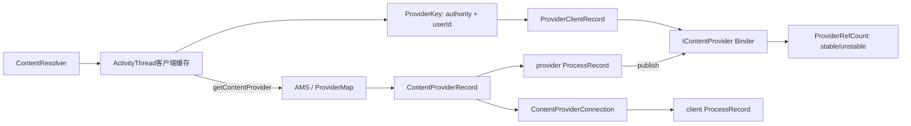
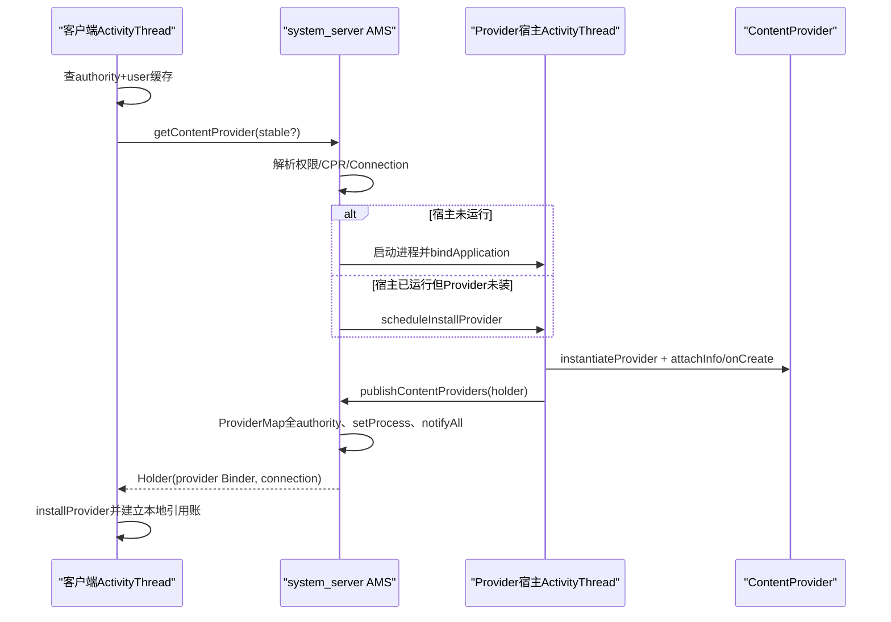
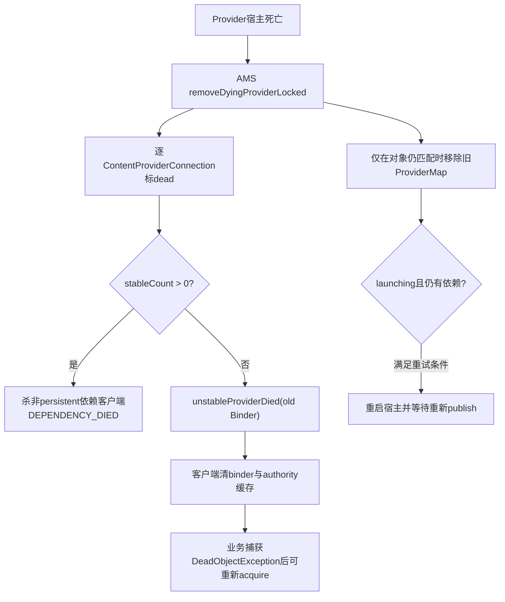

# 281 Android ContentProvider发布：ProviderMap、ContentProviderRecord/Connection引用计数、stable/unstable client、死亡清理与ANR协作链

## 1. 本章目标

第280章解释了URI能力怎样授权，本章转向Provider本身的运行时生命周期：客户端怎样按authority取得`IContentProvider`，system_server怎样启动宿主并等待发布，两端怎样记stable/unstable引用，Provider或client死亡时为什么有不同后果，以及ContentProviderClient怎样把长时间无响应上报到ANR链。

## 2. Android 11版本边界

本文依据本地`android-11.0.0_r48`。10秒publish timeout、20秒ready timeout、客户端1秒retain、`ContentProviderConnection`双计数和stable依赖死亡策略均为该tag实现；新版Android的AMS拆分类、attribution和Provider超时策略可能不同。

## 3. 先分清三个进程

调用方App进程持有`ContentResolver`、`ActivityThread`本地缓存和Provider Binder代理；system_server中的AMS保存全局Provider/连接账并负责拉起与OOM调整；Provider宿主App进程实例化`ContentProvider`并发布Transport Binder。Provider与调用方也可能同进程，此时不经过远端Binder数据路径。

## 4. 四类核心对象

服务端`ContentProviderRecord`代表一个Provider组件及宿主状态，`ContentProviderConnection`代表一个Framework客户端进程对它的依赖，`ProviderMap`按authority和组件索引；客户端`ProviderClientRecord`缓存Binder与authority，`ProviderRefCount`聚合本进程stable/unstable使用次数。

## 5. 源码地图

```text
frameworks/base/core/java/android/content/ContentResolver.java
frameworks/base/core/java/android/content/ContentProviderClient.java
frameworks/base/core/java/android/content/ContentProvider.java
frameworks/base/core/java/android/app/ActivityThread.java
frameworks/base/services/core/java/com/android/server/am/ProviderMap.java
frameworks/base/services/core/java/com/android/server/am/ContentProviderRecord.java
frameworks/base/services/core/java/com/android/server/am/ContentProviderConnection.java
frameworks/base/services/core/java/com/android/server/am/ActivityManagerService.java
frameworks/base/services/core/java/com/android/server/am/OomAdjuster.java
```

## 6. App入口不直接解析组件

`ContentResolver`从content URI取得authority，交给`ContextImpl.ApplicationContentResolver`，后者调用`ActivityThread.acquireProvider(context, auth, userId, stable)`。客户端先查进程内缓存，miss才通过AMS按authority解析ProviderInfo并可能启动进程。

## 7. authority还带用户语义

客户端先从可能嵌入user-id的authority解析userId，再去掉user-id字符串；本地`ProviderKey`由标准authority与userId组成。同一`media` authority在用户0和工作资料不是同一个缓存项。

## 8. stable与unstable先给直觉

stable表示调用方把自身命运与Provider宿主绑定：宿主异常死亡时AMS可杀依赖它的非persistent客户端，维护“已取得稳定服务就不应无声消失”的合同。unstable允许Provider死而客户端继续活，但客户端必须处理`DeadObjectException`并重新获取。

## 9. stable不是更可靠的Binder协议

两者最终调用同一个`IContentProvider` Binder；没有stable专用transaction，也不会让Provider代码不崩。区别在AMS连接计数、宿主OOM保护和死亡清理策略，属于生命周期合同而非传输层重试开关。

## 10. ContentProviderRecord保存什么

它固定保存ProviderInfo、ApplicationInfo、组件名、UID、singleton与noReleaseNeeded；运行态保存provider Binder、宿主`proc`、正在拉起的`launchingApp`、客户端connections、external handles与重启次数。一个对象连接“包管理声明”和“当前进程实例”。

## 11. ProviderMap为何有四张表

singleton Provider按authority和ComponentName各一张全局表；普通Provider按userId再各有authority表和组件表。authority用于客户端查找，组件用于同一个Provider类多authority去重、进程发布和包级清理。

## 12. 全局与客户端双层账图



## 13. 服务端authority查找先看singleton

`ProviderMap.getProviderByName(name,user)`先查`mSingletonByName`，再查指定user表；组件查询同理。singleton真正运行在system user，但只有满足`isSingleton`与`isValidSingletonCall`的调用才可复用，不能把“全局表”理解成任何UID都能访问。

## 14. 读操作也可能创建空user map

`getProviderByName`内部调用`getProvidersByName(userId)`，不存在时会创建空HashMap放进SparseArray。它不产生Provider记录，但大量无效user查询理论上可留下空容器，属于r48实现细节，不是“查询纯只读”的严格数据结构语义。

## 15. 客户端先走existing快路

`acquireExistingProvider`在`mProviderMap`锁内找ProviderKey；找到后先用`isBinderAlive()`排除明显死亡Binder，再在存在`ProviderRefCount`时增加对应引用。命中可省去AMS、PackageManager解析和进程启动。

## 16. 同authority获取锁避免本进程惊群

cache miss后`getGetProviderLock(auth,userId)`为同一键提供长期复用锁，本进程多个线程只让一个进入AMS慢路径。它不覆盖不同进程，也不能替代安装阶段对Binder身份的最终去重。

```java
synchronized (getGetProviderLock(auth, userId)) {
    holder = ActivityManager.getService().getContentProvider(
            getApplicationThread(), c.getOpPackageName(), auth, userId, stable);
}
```

## 17. AMS入口先绑定真实调用进程

普通App必须传非空`IApplicationThread`，AMS用它查`ProcessRecord`；找不到就SecurityException。callingPackage还要经AppOps `checkPackage(uid, package)`核对，isolated caller被拒绝，防止伪造包名或脱离已登记进程取得Provider。

## 18. 先查已发布记录

`getContentProviderImpl`先按authority/user查ProviderMap；若普通user未找到，再尝试system user singleton并重新验证调用合法性。记录存在且`cpr.proc`未killed才视为running，记录存在不等于Binder当前可用。

## 19. killedByAm但尚未完成死亡清理

若宿主已被AMS标记killed/killedByAm而`appDiedLocked`尚未到达，源码保存`dyingProc`并等待旧实例清理，避免立刻把旧ContentProviderRecord错误复用于新客户端。必要时复制一份只含静态声明的新record隔离两代实例。

## 20. canRunHere触发本地实例

Provider声明multiprocess，或其processName与调用进程相同，并且UID相同，`canRunHere`才成立。AMS返回只含ProviderInfo、`provider=null`且无Connection的Holder，让调用方本进程自行实例化；这不是把远端Binder搬进来。

## 21. 本地Provider不建跨进程Connection

同进程调用最终可得到`ContentProvider.Transport`的本地Binder优化，AMS不需要通过connection保护另一个宿主进程。ActivityThread把本地Provider永久放入`mLocalProviders`与`mLocalProvidersByName`，不走普通远端引用归零移除。

## 22. instant app隔离再检查一次

即使已有运行记录，AMS仍用PackageManager对当前user解析authority；解析结果对调用方不可见时返回null，避免普通App与instant App之间仅因全局运行记录存在而泄露Provider。

## 23. package association策略先于权限

`checkContentProviderAssociation`通过AMS包关联策略验证调用进程所含包能否关联Provider包。它与read/write permission不同，先回答“这两个包是否允许建立运行依赖”，拒绝时直接SecurityException。

## 24. get阶段权限只是“可能访问”

AMS检查顶层read或write permission、任一PathPermission，或该authority上的URI grant；只要存在一种可能就允许拿到Binder。它没有本次具体URI和操作类型，不能完成最终row/path级授权。

## 25. Transport仍做最终精确检查

真正query/open/update时，Provider Transport根据具体URI、read/write方向、calling UID/package、URI grant与AppOps重新裁决。取得`IContentProvider`只代表获得调用入口，不代表对authority下所有数据都有读写权。

## 26. ContentProviderConnection双向挂账

首次跨进程取得时，AMS创建Connection，同时加入`cpr.connections`和`client.conProviders`；之后同一client ProcessRecord访问同一CPR复用连接，只增加stable或unstable计数。双向索引让宿主死亡和客户端死亡都能按本进程关联清理。

## 27. 服务端计数不是每个Java对象一条连接

同一客户端进程对同一Provider只有一个Connection，其`stableCount/unstableCount`累计多个ContentResolver、Cursor、FD或ContentProviderClient的使用。`numStableIncs/numUnstableIncs`是调试累计值，不会随release减回去。

## 28. 客户端又做一次聚合

ActivityThread按Provider Binder维护一个`ProviderRefCount`，记录本进程Java层实际stable/unstable次数；只有某类引用从0变1或1变0时才通知AMS变更Connection，减少每次短操作的Binder记账调用。

## 29. 为什么两边看到的数字不同

客户端可能有5个stable使用，但服务端Connection的stableCount只看到1，因为服务端只需知道该进程是否存在stable依赖。首次AMS获取本身先创建1；后续客户端同类型0↔1转换再用`refContentProvider`校正。

## 30. 新连接立即影响OOM关系

Connection建立后AMS调用`updateOomAdjLocked`。OomAdjuster沿Provider connections读取客户端adj/procState，把宿主至少提升到不低于重要客户端的受限级别；因此“持有Provider”不仅是一条Binder引用，也会改变宿主被回收概率。

## 31. 可感知客户端还会抬高LRU位置

当这是该client到Provider的第一份引用且client足够重要，AMS把Provider宿主在LRU中向活跃端移动。ContentProvider启动通常昂贵，这个策略减少刚被前台使用就迅速回收的抖动。

## 32. OOM调整后还验证进程确实活着

源码比较verifiedAdj、setAdj并读`/proc/<pid>/stat`与真实UID，降低宿主在获取窗口被LMK杀掉却仍返回旧Binder的竞态。仍承认信号pending的小窗口无法完全消除，因此调用方永远要能面对DeadObjectException。

## 33. 不存在时重新走PackageManager

AMS按authority/user以`GET_URI_PERMISSION_PATTERNS`解析ProviderInfo，处理singleton后将ApplicationInfo改写到目标user。找不到Provider返回null；系统未允许启动第三方进程、system Provider尚未安装或目标user未running则明确拒绝/返回。

## 34. 组件record先按class去重

用`ComponentName(package,class)`查ProviderMap；没有才创建ContentProviderRecord并先放组件表。这样一个Provider声明多个以分号分隔的authority时共享同一组件、宿主和Binder，而不是每个authority实例化一次。

## 35. permissions review可能暂停获取

旧兼容模式下若目标包需要权限复审，只有前台调用方可触发review Activity，本次Provider获取仍返回null；后台调用不弹UI直接失败。这里的“启动Provider”也受用户交互门约束。

## 36. 正在拉起只登记一次

AMS在`mLaunchingProviders`按对象身份检查；首次才unstop包并选择现有进程或启动新进程，后续请求只新增connection并一起等待同一CPR发布，避免多个进程实例竞争同一Provider。

## 37. 已有宿主进程走scheduleInstallProvider

如果目标ProcessRecord已有thread且未killed，但尚未发布该Provider，AMS先把CPR放进`proc.pubProviders`，再通过`IApplicationThread.scheduleInstallProvider`发消息。ActivityThread主线程执行`handleInstallProvider`完成类加载、attach与发布。

## 38. 没有宿主则以Provider为HostingRecord启动

`startProcessLocked`的原因记录为content provider并带组件名，随后`cpr.launchingApp=proc`、加入mLaunchingProviders。进程attach时AMS生成该进程应安装的全部ProviderInfo，不只触发获取的一个。

## 39. 等待前已经放入authority表

首次请求会把组件表和当前请求authority映射到尚未发布的CPR，再增加Connection并标记waiting。其他线程可发现“正在启动”的同一record并加入等待，而不会重复解析成第二个对象。

## 40. 隐式包可见性也在获取链补齐

完成服务端结构更新后，AMS为calling UID授予对Provider包的implicit access，解决包可见性与已取得内容入口冲突。它不替代Provider read/write权限，也不改变stable计数。

## 41. 等待发生在CPR对象锁上

AMS退出自身全局锁后`synchronized(cpr)`等待`cpr.provider`非null，避免阻塞整个AMS。发布方设置Binder、宿主proc后`notifyAll()`；失败清理把launchingApp置null并notify，等待者据此返回null。

## 42. 两个超时不要混为一个

进程attach后若含launching Provider，AMS安排10秒`CONTENT_PROVIDER_PUBLISH_TIMEOUT`；单个get调用等待`CONTENT_PROVIDER_READY_TIMEOUT`为20秒。前者判宿主初始化失败并移除进程，后者保护具体调用方不无限等。

## 43. Provider发布超时不等普通query超时

10秒只覆盖进程已attach但Provider尚未publish的启动阶段；正常Provider方法执行默认没有统一10秒强杀。`ContentProviderClient.setDetectNotResponding()`是另一个显式、特权且可配置的运行期监控机制。

## 44. 启动失败会唤醒所有等待者

publish超时调用`cleanupAppInLaunchingProvidersLocked(..., true)`，removeDyingProvider清launchingApp、ProviderMap和连接策略并notify；随后以初始化失败原因移除进程。等待者不是各自启动一份替代实例。

## 45. 获取与发布时序图



## 46. 进程attach时生成Provider清单

`generateApplicationProvidersLocked`按processName与UID向PMS查询Provider，过滤不应在非system user进程初始化的singleton，按组件复用/创建CPR，加入`app.pubProviders`并通知PackageManager本包因ContentProvider被使用。

## 47. manifest initOrder由PMS排序体现

ProviderInfo清单的安装顺序来自包管理查询结果与`initOrder`规则，ActivityThread逐项实例化。不要从HashMap中的pubProviders顺序推导初始化顺序；真正客户端安装使用的是传入List。

## 48. Provider早于Application.onCreate

`handleBindApplication`先创建Application对象，再在非restricted backup模式安装providers，之后才调用Instrumentation和`Application.onCreate()`。因此Provider.onCreate不能假设自定义Application.onCreate已完成，但`Application`对象和基础Context已经存在。

## 49. attachInfo才真正调用Provider.onCreate

ActivityThread用AppComponentFactory实例化类，取Transport Binder，再调用`localProvider.attachInfo(context, info)`；attachInfo设置read/write/path permission、exported、singleUser、authorities与AppOps后调用onCreate，保证业务初始化看到声明信息。

## 50. onCreate布尔返回值在这里未参与发布决策

`ContentProvider.onCreate()`声明返回boolean，但r48 `attachInfo`直接调用而不检查结果；只要没有抛异常且Transport存在，Provider仍继续加入发布列表。阅读旧文档时不要把false自动解释为AMS拒绝publish。

## 51. onCreate异常会中断启动链

实例化或attach异常先交Instrumentation.onException；未处理则RuntimeException使Provider安装失败，通常进一步导致进程崩溃/发布超时。publish函数自己不会收到一个“失败Holder”来逐项报告错误。

## 52. 一个Provider可发布多个authority

客户端和AMS都以`info.authority.split(";")`展开；多个ProviderKey/ProviderMap name条目指向同一个ClientRecord/CPR和同一Binder。release按Binder聚合，所以从不同authority取得也可能共享一份底层引用账。

## 53. 宿主批量publish

`installContentProviders`为每个成功安装项构造Holder并置`noReleaseNeeded=true`，最后一次Binder调用`publishContentProviders(applicationThread, results)`。宿主发布的是已经执行完onCreate的Transport Binder，不是Provider类名占位符。

## 54. AMS只接受该ProcessRecord预登记组件

publish时AMS从caller找真实ProcessRecord，再以`src.info.name`从`r.pubProviders`取目标CPR；不存在的组件不会凭客户端上传Info新建全局记录。这阻止App任意伪造authority向AMS注册Binder。

## 55. publish补全组件和所有authority映射

找到CPR后，AMS把ComponentName放入class表，并把声明中的每个authority放入name表。此前可能只有触发启动的authority，发布后同组件其他authority可直接命中运行记录。

## 56. 发布原子点是设置Binder并notify

在CPR对象锁内依次设置`dst.provider=src.provider`、`dst.setProcess(r)`并notifyAll。等待线程醒来后读取同一对象的provider；setProcess还会为已有connections/external handles启动procstats association。

## 57. 成功发布取消进程级timeout

只要该CPR曾在mLaunchingProviders，publish会移除它；若本进程至少发布一个launching Provider，则删除以ProcessRecord为obj的publish timeout消息。这里消息按进程而非单Provider组织，因为启动清单是批量安装。

## 58. 成功后重启计数归零

`dst.mRestartCount=0`，再更新宿主OOM adj与Provider使用统计。启动过程曾失败但后来成功，不应让历史重试次数继续把下一次正常重启误判为超过三次。

## 59. publish对空项选择跳过

src、ProviderInfo或provider Binder为null时直接continue；没有逐项错误回传。若整批都没成功，仍可能由publish timeout或进程死亡清理结束等待；若同批另一个CPR成功并取消共享的进程级timeout，被跳过项会落入第105节的窄边界。

## 60. Holder把两端账连接起来

返回客户端的`ContentProviderHolder`含ProviderInfo、IContentProvider、noReleaseNeeded及服务端ContentProviderConnection Binder。业务调用走provider Binder；后续ref/remove/ANR上报走connection Binder，两者身份和用途不能互换。

## 61. 客户端installProvider负责竞态收口

AMS返回后ActivityThread在自身进程实例化本地Provider或接收远端Binder，最后在`mProviderMap`锁内检查Binder/组件是否已安装。慢路径不能全程持锁，因为类加载、onCreate和AMS Binder都可能耗时或重入，所以最终必须再做一次“谁先发布”的裁决。

## 62. 本地Provider有两张额外表

`mLocalProviders`以Transport Binder为键，`mLocalProvidersByName`以ComponentName为键；authority仍放公共客户端mProviderMap。按组件表去重能处理同一实现的多个authority，按Binder表支持从接口反查本地Provider实例。

## 63. 本地竞争失败前可能已经执行onCreate

实例化和attachInfo发生在进入mProviderMap锁之前；若另一条安装路径抢先登记相同ComponentName，当前路径改用既有Provider。也就是说竞争落败的临时实例可能已执行onCreate却不会发布，源码未对它调用显式shutdown，这是编写Provider初始化副作用时要留意的r48窗口。

## 64. 远端按Binder维护ProviderRefCount

`mProviderRefCountMap`的key是provider.asBinder，不是authority；首次普通远端获取按stable创建`(1,0)`或`(0,1)`。ProviderClientRecord再被多个authority键引用，因此计数保护的是实际远端宿主接口。

```java
prc = stable
        ? new ProviderRefCount(holder, client, 1, 0)
        : new ProviderRefCount(holder, client, 0, 1);
mProviderRefCountMap.put(jBinder, prc);
```

## 65. noReleaseNeeded的实际哨兵实现

本地Provider不进ref-count map；来自system_server且不可释放的远端Provider却创建`stable=1000, unstable=1000`哨兵，使正常增减永远难以归零。源码注释概括为“不引用计数”，实现并非所有情形都真的没有ProviderRefCount。

## 66. ContentProviderRecord也计算noReleaseNeeded

uid为root/system通常标记true，但Settings包被特意排除；Holder把它传给客户端。宿主启动时发布的Holder先设true，是因为“自己进程安装自己的Provider”本来就不应通过远端release拆掉。

## 67. stable从0到1才通知服务端

客户端stableCount每次加一，但仅旧值为0时调用`refContentProvider(connection,+1,delta)`；已有stable时服务端无需知道具体对象数。服务端检查结果不能降到负数，也禁止在ref接口中让stable+unstable总数直接归零。

## 68. unstable从0到1同理

若没有pending remove，首个unstable把服务端unstable加一；已有unstable只加本地数。业务必须成对release，否则客户端本地数一直非零，服务端连接与OOM依赖也不会消失。

## 69. 最后stable释放会临时转换成unstable

当stable降到0且本地也没有unstable，ActivityThread向AMS发送`stable -1, unstable +1`，在1秒延迟移除期间保留一份服务端unstable引用。这样Provider仍可快速被重新获取，同时它若死亡不会因这份纯保留引用杀客户端。

## 70. pending remove期间重新stable获取

新stable把本地stable从0变1，取消removePending并向AMS发送`stable +1, unstable -1`，把临时保留引用转换回真实stable。即使Handler消息因竞态未移除，completeRemove会看到removePending=false并安全退出。

## 71. pending remove期间重新unstable获取

新unstable只需取消removePending；服务端原本就持有那一份临时unstable，所以无需再发+1。这个不对称是引用转换协议的一部分，不能只看本地`unstableCount`推断服务端瞬时值。

## 72. 最后unstable释放也延迟1秒

本地无stable时，最后unstable不立刻向AMS发-1，而是置removePending并安排`H.REMOVE_PROVIDER`延迟`CONTENT_PROVIDER_RETAIN_TIME=1000ms`。短时间重复query可复用Binder和宿主，降低抖动。

## 73. completeRemove处理两种竞态

若removePending已被新获取取消，旧消息直接退出；若经历“重新获取后又释放”，removePending又为true，旧消息继续执行并让后一个消息将来因false退出。最终先移除本地binder/authority缓存，再通知AMS删除最后那份unstable连接。

## 74. 服务端remove最终拆双向连接

AMS把connection Binder强转为ContentProviderConnection，根据stable参数减计数；两类都归零时停止procstats association，从`cpr.connections`和`client.conProviders`同时移除，并触发全局OOM重算。

## 75. 最近Provider保留时间是另一层策略

若释放连接时客户端重要性高于LAST_ACTIVITY，AMS记录宿主`lastProviderTime`；OomAdjuster在配置的CONTENT_PROVIDER_RETAIN_TIME内把宿主至少保到PREVIOUS_APP_ADJ/LAST_ACTIVITY。它与客户端固定1秒Handler延迟不是同一个常量或同一目的。

## 76. 非Framework外部调用用handle而非Connection

`getContentProviderExternal`要求`ACCESS_CONTENT_PROVIDERS_EXTERNALLY`，caller没有IApplicationThread/ProcessRecord，CPR改用token→ExternalProcessHandle和acquisitionCount；token可linkToDeath，null token只能用匿名计数并要求显式remove。

## 77. external handle同样提升宿主

OomAdjuster发现CPR有external handles时至少提升到FOREGROUND_APP_ADJ与IMPORTANT_FOREGROUND。显式remove若真正减少handle会触发OOM重算；Binder死亡回调只从CPR移除handle，r48代码没有在该回调中直接调用updateOomAdj，因此降级可能等后续全局调整。

## 78. external错误token有计数下溢疑点

`removeExternalProcessHandleLocked`在“存在某个token handle但传入token未命中”时会走匿名计数减一，即使`externalProcessNoHandleCount`原为0。r48缺少针对该分支的正数断言，错误配对可能产生-1；这是特权API健壮性审计点，不是普通App可直接利用结论。

## 79. Provider连接怎样传播进程重要性

OomAdjuster遍历宿主发布的每个CPR及connections，递归计算client状态；宿主adj通常不差于client且最低受FOREGROUND_APP_ADJ上界约束，TOP client映射为BOUND_TOP procState。连接还参与进程可达图与LRU联动，防止依赖链计算漏掉Provider。

## 80. stable死亡合同的真正后果

宿主进程死亡时，`removeDyingProviderLocked`逐连接标dead；只要connection stableCount>0，AMS会kill非persistent、仍有thread且不是system_server自身的客户端，退出原因是DEPENDENCY_DIED。它不会尝试给该客户端透明换一个新Binder。

## 81. unstable连接让客户端收到通知

stableCount为0且客户端thread仍在时，AMS调用`IApplicationThread.unstableProviderDied(oldBinder)`；随后服务端主动从CPR和client移除此connection，因为协议不期待客户端再正确release这个死亡连接。

## 82. waiting连接有重启例外

Provider仍在launching且未超过重试限制时，waiting connection可暂不触发客户端死亡/通知，让AMS重启宿主继续满足原等待；always remove、已不在launching或超过最多三次重试时才彻底清理。

## 83. ProviderMap删除先做对象身份校验

死亡清理仅当class/name当前值仍等于旧CPR时才remove，避免旧宿主迟到的death把已经启动的新一代Provider映射删掉。这与第19节复制新record共同处理代际竞态。

## 84. Provider死亡状态清理顺序

宿主ProcessRecord的pubProviders逐项removeDyingProvider，随后`cpr.provider=null`、setProcess(null)，清空宿主pubProviders；再检查其他launching记录是否需重启。清provider Binder与Map/connection处理是同一AMS死亡清理的一部分。

## 85. 客户端接到unstableProviderDied

ApplicationThread Binder线程只向主Handler发送`UNSTABLE_PROVIDER_DIED`，ActivityThread再在mProviderMap锁内按旧Binder移除ProviderRefCount与所有指向它的authority缓存。下一次获取不会继续命中死亡代理。

## 86. 主动发现死亡还要向AMS举证

若业务在unstable调用中捕获DeadObjectException，ActivityThread清本地缓存并调用AMS.unstableProviderDied(connection)。AMS读取当前provider Binder并先`pingBinder()`；仍活着就拒绝调用方的死亡声明，防止不诚实或竞态上报误杀宿主。

## 87. ping确认后等价于提前death回调

若Binder确实不活且CPR仍指向同一provider，AMS调用`appDiedLocked(proc,"unstable content provider")`，立即走完整进程死亡清理，缩小下一次获取与系统正式Binder death通知之间的竞态。

## 88. stable/unstable死亡分叉图



## 89. 普通query为何先用unstable

ContentResolver.query先取得unstable provider执行远程query；若调用瞬间死亡，通知AMS后改取stable provider重试一次。这样一次短暂宿主崩溃不必先把调用App也绑死，同时保留显式恢复机会。

## 90. Cursor返回前再持stable引用

query成功并强制`getCount()`后，ContentResolver取得stable provider，把Cursor包装为CursorWrapperInner；wrapper关闭时释放stable。远程Cursor后续可能继续向Provider取窗口数据，所以不能在query方法返回时立刻完全释放宿主。

## 91. 打开FD也把stable生命周期交给包装器

openAsset/openTyped等先用unstable尝试，成功后取得stable，再把它交给`ParcelFileDescriptorInner`；FD关闭时才release。这里stable保护长生命周期资源的宿主合同，但已传出的内核FD是否仍可读还取决于具体文件/pipe实现。

## 92. ContentProviderClient必须close

稳定或不稳定Client都由构造时的一份引用支撑；`closeInternal`用AtomicBoolean保证只释放一次，并关闭CloseGuard。依靠finalize只是泄漏告警和最后补救，不能替代try-with-resources。

## 93. 不稳定Client不会自动替换Binder

其每个API捕获DeadObjectException时通知`unstableProviderDied`后原样抛出；对象已失效，调用者应close并重新acquire。ContentResolver某些便捷方法的一次重试策略，不能泛化成ContentProviderClient自身自动重连。

## 94. setDetectNotResponding是显式监控

ContentProviderClient可配置每次remote call前在主Looper异步Handler排延迟Runnable，调用结束移除；到期就通过ContentResolver→ActivityThread→AMS上报。设置0关闭，并恢复Binder默认blocking策略。

## 95. ANR检测API有特权门

该System/Test API要求REMOVE_TASKS；AMS入口也再次enforce同一权限。普通App不能用它把任意Provider宿主标成ANR，更不能把它当通用网络/数据库timeout API。

## 96. 到期不是客户端直接kill

Runnable只携Provider Binder查本地ProviderRefCount，取Holder.connection上报；AMS由connection定位`conn.provider.proc`，再交`mAnrHelper.appNotResponding(host,"ContentProvider not responding")`进入统一ANR证据与处置链。

## 97. 关闭Client与未决ANR Runnable的并发边界

close先`setDetectNotResponding(0)`，使字段置null并恢复blocking行为，然后释放引用；该方法本身没有对旧Runnable调用removeCallbacks。正常远程调用结束由afterRemote移除，但若违反类文档约束，在调用尚阻塞时从另一线程close，afterRemote可能因字段已null无法找到旧对象，已排队Runnable仍可能触发上报。

## 98. 默认Provider调用并无统一强制3秒ANR

ContentResolver中的3秒常量用于特定异步类型查询等等待协议，不能概括所有CRUD Binder调用；普通同步query是否阻塞由Provider执行、Binder与CancellationSignal决定。只有显式ContentProviderClient监控才按配置主动上报宿主ANR。

## 99. stable也不保证业务结果成功

Provider可以抛SecurityException、SQLiteException、OperationCanceledException，宿主也可能被force-stop或崩溃；stable只影响AMS对依赖死亡的一致性处理。应用设计仍要区分可重试错误、数据事务失败与宿主死亡。

## 100. Cursor、FD与Binder是不同资源

IContentProvider负责控制调用，Cursor可能持跨进程BulkCursor，FD是内核对象；wrapper用stable引用把Java资源关闭与AMS连接释放联系起来。只关闭Cursor/FD而泄漏ContentProviderClient，或反过来提前close Client，都可能破坏预期生命周期。

## 101. 客户端进程死亡怎样清连接

AMS清理死亡ProcessRecord时遍历`app.conProviders`，从每个CPR.connections移除并停止association，最后清空列表。无需等待客户端逐个release；ProcessRecord death本身就是所有本地Java引用一起消失的权威事件。

## 102. 宿主是否重启取决于仍有需求

死亡Provider若仍在launching、未bad、允许restart且有connection或external handle，AMS把宿主纳入重启；普通已发布Provider失去所有需求后不会只因Manifest声明常驻。persistent进程另有全局重启规则。

## 103. 最大重试次数的边界

ContentProviderRecord.MAX_RETRY_COUNT为3，代码用前置递增后`>3`判定强制移除，意味着进入坏状态前可经历多次拉起失败。不要把常量名称直接等同于“总共最多启动三次”，应按具体递增位置推演。

## 104. force-stop和禁用组件直接always remove

包/组件禁用、force-stop会收集对应CPR并调用`removeDyingProviderLocked(..., true)`，移除Map、唤醒等待者并执行stable/unstable死亡策略；不会把这种管理动作当作普通可重启launching失败。

## 105. publish timeout按进程消息有窄边界

成功publish任一在launching列表中的CPR就移除以该ProcessRecord为obj的timeout消息；通常宿主一次批量发布全部Provider。若结果列表异常地部分为空而另一些成功，被跳过CPR可能仍launching却失去原消息，这是r48健壮性审计点，正常安装路径不应制造该组合。

## 106. publish清CallingIdentity缺finally边界

r48在publish函数中clearCallingIdentity后循环，末尾直接restore而非try/finally；正常路径会恢复，若中间出现未捕获RuntimeException则本次调用栈的恢复不够结构化。Binder事务结束还有框架边界，但源码审计仍应标记本方法的异常安全性。

## 107. dumpsys数字怎样读

CPR列出宿主、authority、connections与external handles；Connection字符串`s当前/累计 u当前/累计 WAITING DEAD`。当前计数回答仍有何种依赖，累计incs只辅助发现频繁获取，WAITING表示等publish，DEAD表示宿主死亡清理已处理。

## 108. 排查“获取Provider一直卡住”

先分进程尚未attach、已attach未执行Provider.onCreate、onCreate阻塞/崩溃、publish被跳过四类；对照10秒publish和20秒ready，检查mLaunchingProviders、launchingApp、WAITING connection、process start/attach日志及宿主主线程堆栈。

## 109. 排查“Provider死后调用App也死了”

检查调用是否持stable ContentProviderClient、未关闭Cursor/FD或便捷API已转换为stable；再看Connection stableCount。若stable>0，DEPENDENCY_DIED是设计合同，不应先归因于客户端自身Java崩溃。

## 110. 排查“Provider一直不被回收”

检查客户端ProviderRefCount是否因Client/Cursor/FD泄漏未归零、服务端connections/external handles、noReleaseNeeded哨兵、recent-provider保留窗口以及宿主是否还承载Activity/Service。Binder对象存在本身不等于还有AMS连接。

## 111. 阅读完成检查

你应能画出client cache→AMS ProviderMap→宿主publish，解释两端引用聚合、stable/unstable死亡分叉、1秒pending remove、10/20秒启动超时、Provider早于Application.onCreate、OOM传播和特权ANR上报。

## 112. macOS只读练习一：画服务端数据模型

```bash
cd /Users/ninebot/androidSource
sed -n '35,180p' frameworks/base/services/core/java/com/android/server/am/ProviderMap.java
sed -n '35,170p' frameworks/base/services/core/java/com/android/server/am/ContentProviderRecord.java
sed -n '25,155p' frameworks/base/services/core/java/com/android/server/am/ContentProviderConnection.java
```

画出singleton/per-user、authority/class四张索引，以及CPR与client ProcessRecord之间的双向Connection；为多authority、两个user和两个client各举一个key。

## 113. macOS只读练习二：追获取与发布

```bash
cd /Users/ninebot/androidSource
sed -n '7037,7455p' frameworks/base/services/core/java/com/android/server/am/ActivityManagerService.java
sed -n '7683,7760p' frameworks/base/services/core/java/com/android/server/am/ActivityManagerService.java
sed -n '6770,6845p' frameworks/base/core/java/android/app/ActivityThread.java
```

按cache miss、PMS解析、CPR/Connection、start或schedule、onCreate、publish、notify、Holder返回标线程与锁，并分别标出10秒和20秒timeout。

## 114. macOS只读练习三：手算引用转换

```bash
cd /Users/ninebot/androidSource
sed -n '4750,4785p' frameworks/base/core/java/android/app/ActivityThread.java
sed -n '6850,7065p' frameworks/base/core/java/android/app/ActivityThread.java
sed -n '6895,6980p' frameworks/base/services/core/java/com/android/server/am/ActivityManagerService.java
```

依次执行unstable acquire、stable acquire、release unstable、release stable、500ms内重新stable、再release；分别记录客户端(s,u,pending)和服务端(s,u)，解释临时unstable为何不会杀client。

## 115. macOS只读练习四：审计死亡与ANR

```bash
cd /Users/ninebot/androidSource
sed -n '14655,14735p' frameworks/base/services/core/java/com/android/server/am/ActivityManagerService.java
sed -n '7790,7880p' frameworks/base/services/core/java/com/android/server/am/ActivityManagerService.java
sed -n '80,155p' frameworks/base/core/java/android/content/ContentProviderClient.java
sed -n '620,705p' frameworks/base/core/java/android/content/ContentProviderClient.java
```

比较stable client、unstable client、waiting client和external handle在宿主死亡时的结果；再画setDetectNotResponding从Handler Runnable到mAnrHelper的权限与对象定位链。

## 116. 易混点一：发布记录不等于当前Binder活着

ProviderMap可先放正在launching的CPR，也可能短暂保留尚未完成死亡清理的旧record；必须结合provider、proc、killed、launchingApp和对象代际判断，不能只看authority有条目。

## 117. 易混点二：stable是依赖合同而非永久驻留

它会提升宿主重要性并在异常死亡时连带处理客户端，但不会阻止显式force-stop、崩溃、权限失败或业务异常；release归零后宿主仍可按内存策略回收。

## 118. r48实现边界汇总

ProviderMap miss可建空user map；本地安装竞态的落败实例可能已onCreate；noReleaseNeeded远端用1000/1000哨兵；external错误token可能下溢且death未立刻重算OOM；部分publish可取消进程级timeout；publish identity恢复缺finally。它们应作为源码审计线索，不夸大为已验证漏洞。

## 119. 复读纠偏记录

复读后修正十点：get阶段只做可能访问检查；Provider早于Application.onCreate；onCreate返回值未决定publish；同组件多authority共用Binder；客户端计数与服务端计数粒度不同；最后stable先转临时unstable；1秒retain不同于OOM recent-provider；stable宿主死会杀依赖client；unstable需业务重取；ANR检测是特权显式能力而非所有CRUD默认超时。

## 120. 本章小结与下一章

Android 11把Provider运行依赖分成三层：ActivityThread缓存与本地聚合、AMS ProviderMap/Connection全局账、宿主ActivityThread实例化与发布；stable/unstable、延迟释放、OOM传播和死亡清理共同平衡一致性、性能与可恢复性。下一章继续深入ContentProvider Transport的read/write权限、PathPermission、URI grant、calling package/attribution、AppOps、跨用户与CRUD/Bulk接口执行链。
