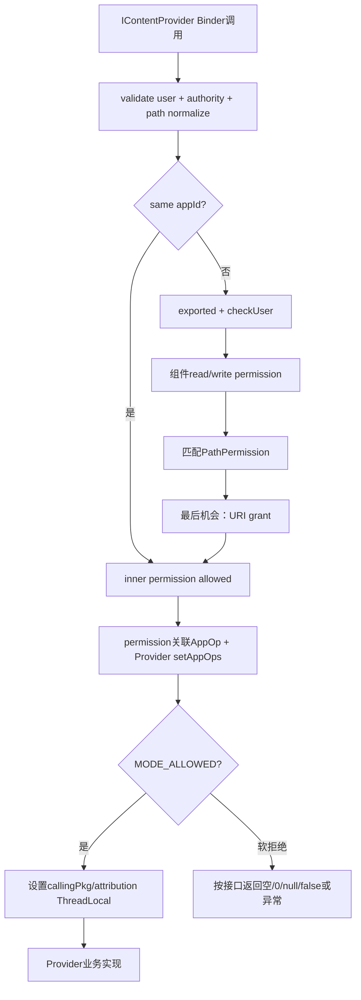
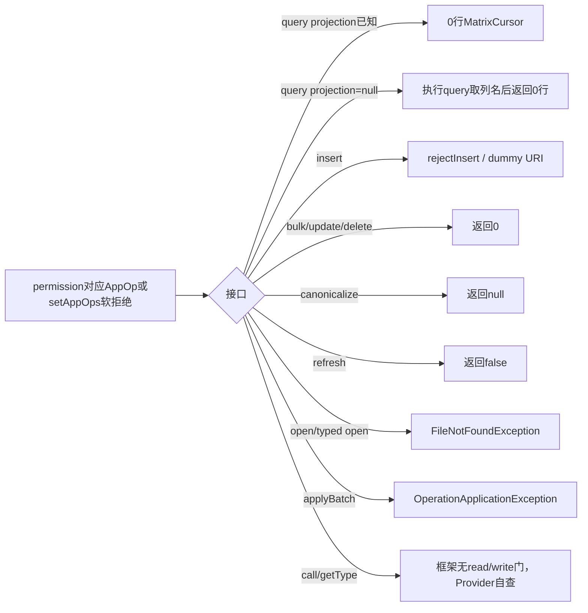
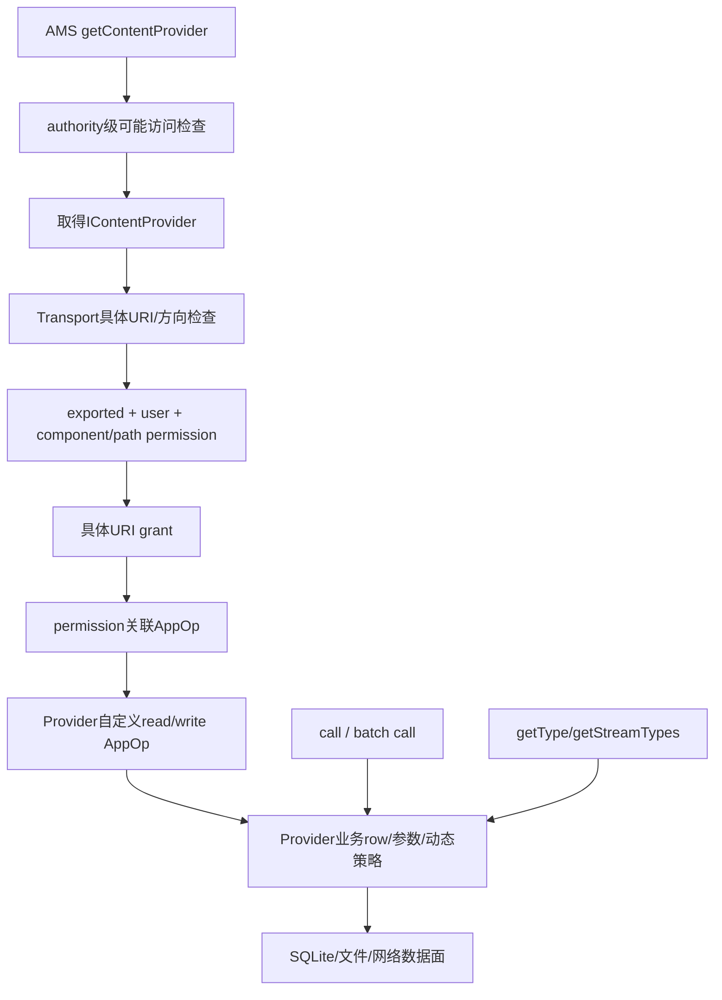

# 282 Android ContentProvider Transport：读写权限、PathPermission、URI grant、calling package/attribution、AppOps、跨用户与CRUD/Bulk执行链

## 1. 本章目标

第281章解释“怎样取得Provider Binder”，本章进入`ContentProvider.Transport`，研究每次具体query/insert/open怎样验证authority与user、组合Manifest permission、PathPermission、URI grant和AppOps，怎样传递calling package/attribution，以及CRUD、batch、call、Cursor、FD被拒绝时为何表现不同。

## 2. Android 11版本边界

本文依据本地`android-11.0.0_r48`。接口仍传`callingPkg + attributionTag`而不是后续完整AttributionSource；Transport、ContentProviderNative手写Binder协议、PathPermission顺序和AppOps软拒绝形态均以此tag源码为准。

## 3. 运行线程先说清

远端请求由Provider宿主的Binder线程池进入Transport，业务`query/insert/call`通常不在主线程，因此Provider实现必须并发安全；本地Provider可能通过local Binder interface在调用线程直接执行。只有实例化、attachInfo和onCreate固定在应用主线程。

## 4. Transport是安全边界包装层

ContentProvider子类实现业务`ContentInterface`，内嵌Transport继承`ContentProviderNative`并作为`IContentProvider`发布。Transport在调用业务前做URI、权限、AppOps和caller上下文处理，业务返回后再补user-id、Trace及身份恢复。

## 5. 源码地图

```text
frameworks/base/core/java/android/content/IContentProvider.java
frameworks/base/core/java/android/content/ContentProviderNative.java
frameworks/base/core/java/android/content/ContentProvider.java
frameworks/base/core/java/android/content/ContentProviderOperation.java
frameworks/base/core/java/android/content/ContentResolver.java
frameworks/base/core/java/android/content/ContentProviderClient.java
frameworks/base/core/java/android/app/ContextImpl.java
frameworks/base/services/core/java/com/android/server/am/ActivityManagerService.java
frameworks/base/services/core/java/com/android/server/uri/UriGrantsManagerService.java
```

## 6. 一次调用有四层

ContentResolver负责获取/释放provider和便捷重试；ContentProviderProxy把参数写Parcel；ContentProviderNative.onTransact解包和传回异常/结果；Transport做安全门后调用Provider业务实现。只读Transport而忽略两侧资源包装，会漏掉Cursor/FD生命周期。

## 7. r48不是AIDL自动Stub

IContentProvider由手写ContentProviderNative/Proxy实现，transaction code分别解析calling package、旧名featureId但实际语义已是attribution tag、URI、Bundle和CancellationSignal。onTransact先`enforceInterface`，防止错误Binder接口token调用。

## 8. 异常怎样跨Binder返回

onTransact外层捕获Exception并用`DatabaseUtils.writeExceptionToParcel`编码；Proxy再用对应readException恢复为SecurityException、SQLiteException等。Provider业务异常不是都被转换成null，具体要看ContentResolver外层是否另行吞掉RemoteException。

## 9. authority必须属于当前Provider

`validateIncomingAuthority`先移除authority中嵌入的user-id，再与attachInfo保存的一项或分号分隔多项authority比较；不匹配直接SecurityException。客户端拿到一个Provider Binder后不能用它调用另一个authority。

## 10. validateIncomingUri先检查用户

非singleUser Provider若URI显式user-id既不是USER_CURRENT也不是宿主Context user，直接拒绝；随后检查authority。目标user由哪一个Provider实例服务，在进入业务代码前已经固定。

## 11. 连续空path segment会归一化

encoded path含`//`时Transport用正则`//+`压成`/`并记录warning，再交权限匹配和业务。这样PathPermission与Provider UriMatcher不会对同一路径的多种空segment写法产生安全分歧。

## 12. Transport安全门总图



## 13. user-id通常在业务前剥离

query/insert/update等先记录需要的userId，再用`maybeGetUriWithoutUserId`移除非singleUser URI上的嵌入前缀。Provider业务通常只看标准authority；返回URI时insert/canonicalize/applyBatch再把原user维度补回。

## 14. singleUser保留URI中的user-id

`maybeGetUriWithoutUserId`对singleUser直接返回原URI，让运行在system user的单实例Provider知道请求来自哪个用户；checkUser也对singleUser直接true。Provider实现必须正确处理这种多用户数据路由，不能只依赖Context user。

## 15. 同appId先绕过Manifest permission

read/write inner第一步用`UserHandle.isSameApp(callingUid,mMyUid)`允许相同appId。它比较的是UID中的appId，不要求同一完整user UID；这支持同包跨用户访问singleUser实例，但后面的Provider自定义read/write AppOp仍可能执行。

## 16. exported与跨用户是组件权限前置门

非self只有Provider exported且`checkUser`通过才进入组件/PathPermission分支。普通Provider要求caller与Context同user或持INTERACT_ACROSS_USERS/FULL；singleUser由其特殊合同放行。

## 17. 顶层read/write permission可直接放行

组件readPermission或writePermission非null时，调用方同时持权限且其关联AppOp允许，就立刻返回MODE_ALLOWED，不再检查PathPermission。PathPermission不是无条件叠加在顶层permission之上的AND门。

## 18. 无顶层permission默认开放

对应组件permission为null时先令`allowDefaultRead/Write=true`；若没有任何匹配且被拒的PathPermission，最终允许。也就是说exported且无保护的Provider路径默认开放，PathPermission只在匹配时改变局部规则。

## 19. 匹配PathPermission可提供另一条允许路径

顶层permission未持有或其AppOp不允许时，匹配path permission只要有一项检查成功就立即放行。它既能收紧默认开放路径，也能给持有更专用权限者提供替代入口。

## 20. 匹配但拒绝会关闭默认开放

若默认组件permission为空，但某条匹配PathPermission声明了权限且caller不满足，`allowDefault=false`；遍历结束后不能再走无保护默认放行。多个匹配项中仍是“任一允许即成功”，不是所有声明都必须持有。

## 21. PathPermission只匹配URI path

`pp.match(uri.getPath())`依据Manifest解析出的PatternMatcher类型比较路径，不看query parameter、fragment、selection或row内容。敏感条件若藏在查询参数/Bundle中，Provider业务必须另做检查。

## 22. permission检查同时note关联AppOp

`checkPermissionAndAppOp`先用真实pid/uid及可选callerToken查runtime permission，再把permission映射成AppOp并`noteProxyOp`。因此Manifest permission显示GRANTED仍可能因AppOps策略得到软拒绝。

## 23. URI grant是最后机会

exported=false、跨用户门失败、组件/路径权限不足后，Transport仍调用Context.checkUriPermission检查具体URI的read或write grant。SAF、FileProvider式分享正依赖这条路径；grant能开放对象，不会把整个Provider变exported。

## 24. read对singleUser有caller-user补偿

singleUser Provider且caller与宿主不在同user时，read检查若URI没编码用户，会把callingUserId加回再查UriGrant，确保授权表按源user区分。业务URI与授权检查URI可能因此不是同一个字符串形态。

## 25. write的singleUser处理存在不对称

r48 write inner直接用传入URI查grant，没有read分支的`maybeAddUserId(uri,callingUserId)`补偿。由于singleUser Transport又保留嵌入user-id，显式带user的URI可工作；无user-id跨用户write grant值得单独验证，本文把它标作实现审计点而非漏洞结论。

## 26. URI grant仍区分read和write

query/canonicalize/refresh只查READ，insert/bulk/update/delete只查WRITE；open按mode选择。只持read grant不能写，持write grant也不会自动让query通过，除非Provider自身权限/AppOps另有允许路径。

## 27. Provider还能配置第二层AppOps

系统Provider可调用`setAppOps(readOp,writeOp)`，inner permission允许后Transport再note该自定义op。它与permission自身映射出的AppOp是两次可能独立发生的裁决，用于把粗权限进一步接入隐私/模式控制。

## 28. MODE_DEFAULT被转换为MODE_IGNORED

Transport.noteProxyOp把自定义或permission关联op的MODE_DEFAULT转换成MODE_IGNORED，而不是当作允许。之后多数接口走软拒绝形态；MODE_ERRORED等最终通常形成SecurityException。

## 29. calling package并非盲目信任

AppOps noteProxyOp会把callingPkg与Binder calling UID一起交给AppOps；Provider调用`getCallingPackage()`时还显式`checkPackage(uid,pkg)`。正常ContentResolver传自己的op package，恶意直接调用Binder伪造包名不能通过已验证API冒充。

## 30. getCallingPackageUnchecked真的不验证

这个方法只返回ThreadLocal字符串，文档明确说未校验。Provider若用它做授权决定就把caller可控参数当身份；安全判断必须用getCallingPackage、Binder UID或Context permission/AppOps。

## 31. attribution tag不是新的权限主体

r48把package和attributionTag成对传给AppOps并存入ThreadLocal，tag用于同包内归因，不替代UID/package校验。Provider可通过getCallingAttributionTag读取；null代表默认归因或当前没有请求。

## 32. ThreadLocal为何必要

Binder线程池会并发处理多个caller，成员变量会串身份；Transport在进入业务前保存旧Pair、设置当前Pair，finally恢复。每个Binder线程拥有自己的调用上下文，嵌套回调也能按栈恢复。

## 33. getType和getStreamTypes没有calling package

这两个旧接口的Binder参数不带callingPkg/tag，Transport只校验URI并调用业务，getCallingPackage/AttributionTag按文档总是null。MIME元数据查询不能依赖calling package做个性化授权。

## 34. clearCallingIdentity必须连ThreadLocal一起清

Provider公开`clearCallingIdentity()`同时调用Binder.clearCallingIdentity和`setCallingPackage(null)`，返回包含两者的CallingIdentity；只调用Binder静态方法会让getCallingPackage仍显示旧caller，形成身份语义分裂。

## 35. restore实现的回调不对称

`restoreCallingIdentity`恢复Binder token后直接`mCallingPackage.set(oldPair)`，没有像setCallingPackage那样调用`onCallingPackageChanged()`。依赖该回调失效安全缓存的Provider应注意r48清除时回调、恢复时不回调这一实现边界。

## 36. 清身份后的下游调用代表Provider自己

clear后Provider访问数据库、文件或另一个Provider时，权限/AppOps按宿主UID/package裁决；finally必须restore，否则同一Binder线程后续逻辑可能继续带system/provider身份。清身份不是“临时拿更多权限”后可以省略恢复的工具。

## 37. query完整流程

Transport依次validate/去user-id、enforceRead+AppOps、设置caller Pair，最后调用`mInterface.query(uri,projection,queryArgs,CancellationSignal)`；允许时返回Cursor，由ContentProviderNative转换成BulkCursor Binder接口交给client。

## 38. query软拒绝且projection已知

AppOps返回非allowed时，projection非null就直接构造0行MatrixCursor，列顺序等于请求projection，完全不进入Provider业务。调用方看到“查询成功但无数据”，而不是SecurityException。

## 39. query软拒绝且projection为null

框架不知道“全部列”的名字，会仍调用Provider.query，只读取cursor.getColumnNames后返回0行MatrixCursor。r48该分支没有显式close原cursor，既让被拒请求执行了业务查询，也可能泄漏其Cursor资源；这是明确代码级审计点。

## 40. insert软拒绝调用rejectInsert

Transport设置calling Pair后调用Provider.rejectInsert，默认返回原URI追加`0`的dummy URI，再补原user-id。Provider可override该方法；它不应在拒绝路径产生真实写副作用。

## 41. bulkInsert软拒绝最简单

直接返回0且不进入Provider业务，也不设置calling Pair。允许时业务默认实现逐项调用insert，但默认返回values.length，不会自动验证每次insert非null，也不自动包数据库事务。

## 42. update与delete软拒绝都返回0

这与“没有匹配行”在公开结果上相同。需要区分数据为空还是AppOps拒绝时，应结合AppOps状态、Provider日志和调用权限，而不是只看affected rows。

## 43. applyBatch先全量预检

Transport先验证outer authority，再逐operation验证/标准化URI，并按`isReadOperation/isWriteOperation`执行read/write门；任何拒绝在业务batch开始前抛OperationApplicationException，避免一半操作已经执行才发现后续权限不足。

## 44. batch中的call操作不属read或write

ContentProviderOperation.TYPE_CALL两者都返回false，因此Transport预检不做read/write permission/AppOps；之后默认apply会调用Provider.call。Provider若允许batch call，仍必须在call实现中自行鉴权。

## 45. 各接口软拒绝矩阵



## 46. applyBatch默认实现不保证原子

ContentProvider默认按顺序调用每个operation，失败前的写入不会自动回滚；SQLiteProvider通常override并显式beginTransaction/setSuccessful/endTransaction。API名batch表示批量协议，不天然等于数据库事务。

## 47. BackReference依赖前序结果

ContentProviderOperation可把之前insert URI或affected count解析进后续values、selectionArgs、extras；expectedCount不符抛异常，exceptionAllowed还可把单项异常包装进ContentProviderResult继续。事务与错误策略最终仍由Provider override决定。

## 48. Transport会原地替换operation URI

每项记录原userId，validate后若去user-id改变URI，就用复制构造器重建operation并写回传入ArrayList。业务applyBatch看到标准URI；调用端列表已跨Binder复制，不会修改客户端原Java对象。

## 49. batch结果逐项补回user-id

业务返回后Transport按同索引把各自userId加到ContentProviderResult URI。Provider必须遵守结果数量/顺序与operations对应的合同，否则用户维度可能错配，返回比operations更多甚至会数组越界。

## 50. openFile按mode字符串选择权限

mode只要包含字符`w`就检查write，否则检查read；`rw`不会同时要求read+write两套权限。获得可读写FD后的真实能力由Provider如何打开底层文件决定，这一Framework合同需要Provider设计时明确接受。

## 51. AppOps拒绝open表现为文件不存在

enforceFilePermission在权限硬拒绝时传播SecurityException，AppOps软拒绝则抛`FileNotFoundException("App op not allowed")`。调用者仅看FileNotFound可能误以为路径不存在。

## 52. openFile独有callerToken

token用于AMS `openContentUri`等间接Binder调用：表面caller是system_server，但权限检查通过线程局部Identity把pid/uid改回最初App。它不是客户端自造的通用授权token，只有与AMS当前线程记录对象相同时生效。

## 53. openContentUri的身份代理链

AMS用external provider handle取得Binder，创建token并记录原Binder pid/uid，随后以system_server调用Provider.openFile；Transport把token传给Context.checkPermission/checkUriPermission，AMS匹配后按原caller检查，finally清ThreadLocal并释放external handle。

## 54. openAssetFile没有callerToken

普通ContentResolver直接Binder调用，Binder calling UID已经是真实客户端，无需代理；openTyped也按read检查。Provider若自己转发调用，需用公开CallingIdentity机制而不是假设所有open入口都有token。

## 55. typed open固定按read门

`openTypedAssetFile`无mode参数，Transport以`"r"`检查并将opts设为defusable，再交Provider协商MIME与返回AssetFileDescriptor。它不因为Provider内部临时生成缓存文件就要求调用方write权限。

## 56. CancellationSignal是协作式

客户端先请求ICancellationSignal transport，Provider端用`CancellationSignal.fromTransport`包装；取消只设置/回调信号，业务必须检查或把它传到SQLite/IO才能及时终止。权限检查和已完成副作用不会被取消回滚。

## 57. getType刻意不做read permission

Transport只验证URI/authority后调用getType，方便系统和解析器获得公开MIME元数据；这也意味着实现不得在getType中顺便返回敏感行内容。跨用户Provider获取仍受AMS外层用户/可见性规则约束。

## 58. call完全由Provider定义权限

Transport只验证authority、把extras设defusable、设置caller Pair并调用业务，没有read/write/PathPermission/URI grant/AppOps门。源码Javadoc用醒目WARNING要求每个method分支自行鉴权；第278章metadata缺显式read门正属于此类风险。

## 59. defusable只降低反序列化破坏面

call extras与typed opts被标defusable，使未知/坏Parcelable更倾向于丢弃而非炸进程；它不验证键、类型、大小或业务权限。Provider仍需白名单读取参数并避免把Bundle当可信命令。

## 60. canonicalize/uncanonicalize按read检查

两者记录原userId、去掉嵌入user后执行业务，再把user加回返回URI；AppOps软拒绝返回null。canonical URI只是标识转换，read门保证未授权caller不能借稳定ID探测对象存在性。

## 61. refresh同样按read门

refresh用于让Provider刷新给定URI的内容，不代表客户端写Provider数据；Transport执行read权限/AppOps，软拒绝返回false。r48这里无条件`getUriWithoutUserId`，与singleUser下部分CRUD保留user-id的路径不同，Provider需核对自己的多用户合同。

## 62. checkUriPermission是Provider动态裁决钩子

Transport只validate URI并调用业务`checkUriPermission(uri,uid,modeFlags)`，默认DENIED；系统内置且forceUriPermissions的Provider可实现row级动态判断，UriGrantsManager在建立grant前以external handle调用它。这里的uid是“待检查对象”，不是Binder caller本身。

## 63. 普通App不应把动态钩子当公开查询API

Javadoc把能力限定给built-in system Provider，正常调用者是system_server的grant安全流程；但Transport没有强制校验Binder caller一定是system_server，也不校验传入uid属于caller。持有该Provider Binder的客户端理论上可直接询问，因此实现只能返回最小权限结论，不能借此暴露敏感元数据。

## 64. Provider业务需要线程安全

Transport没有把CRUD串行到main Handler；多个Binder线程能同时进入query/update/applyBatch，且本地调用可能来自任意线程。SQLite连接池可管理并发，Provider自己的缓存、懒初始化和calling-package派生状态必须正确同步。

## 65. calling Pair只在业务调用动态范围内有效

Transport在try前set、finally恢复；Provider把工作异步post到别的线程后，`getCallingPackage()`在那里通常为null，Binder calling UID也变为该进程自己。需要异步使用身份时应在入口先提取并验证，再以不可伪造字段显式传递。

## 66. 嵌套调用会暂存旧Pair

Provider处理caller A时若同步调用自己Transport或另一个本地入口，setCallingPackage返回A Pair，嵌套设置B，finally再恢复A；`onCallingPackageChanged`在每次set触发。把caller缓存成全局单值会破坏这种嵌套语义。

## 67. Transport总在权限后设置calling Pair

permission和AppOps检查接收callingPkg/tag参数直接完成，不依赖Provider ThreadLocal；只有即将执行业务或rejectInsert/query取列名时才设置。被直接返回0的bulk/update/delete不会触发onCallingPackageChanged。

## 68. 软拒绝是一种隐私降级而非授权

MODE_IGNORED常把“无权限”伪装成空数据/无影响，减少App因隐私模式崩溃；Provider业务通常没有执行。调用方绝不能把0或空Cursor当成“权限已通过，只是数据库真空”。

## 69. projection-null拒绝分支是例外

为了获知列名它会执行Provider.query，所以业务日志、懒开库、统计甚至实现不当的副作用仍发生；只把结果行隐藏。实现query应保持只读、快速且不把“能被调用”误当成“caller被允许看到数据”。

## 70. rejectInsert也是可执行拒绝钩子

默认纯构造dummy URI，但override代码仍运行在caller Pair上下文。安全Provider应让它无副作用且不泄露真实新ID；若要硬拒绝可自行抛合适异常，但要理解这改变API兼容表现。

## 71. applyBatch软拒绝不会部分进入业务

Transport在循环中先检查全部operation，任何read/write AppOps非allowed就抛OAE；因此由Framework门造成的拒绝是执行前失败。进入Provider后发生的expectedCount、约束或业务异常是否回滚则取决于Provider事务实现。

## 72. file软拒绝与硬拒绝要分开诊断

Manifest/Path/URI grant全不满足通常SecurityException；基础权限满足但AppOps ignored则FileNotFoundException。相同URI在设置页切换隐私模式后异常类型改变，正是两层裁决结果不同。

## 73. getType的3秒与远端23秒等待

ContentResolver已有provider时调用异步getType并等待3秒；cache miss走AMS异步external获取，等待常量为20秒ready加3秒方法时间。它们是客户端等待保护，不是Transport对所有Provider API的统一超时。

## 74. canonicalize也用3秒异步包装

ContentResolver取得stable provider后发canonicalizeAsync并等3秒，超时/异常返回路径由ResultListener处理；Transport内部仍同步执行canonicalize再回RemoteCallback。异步transaction避免调用线程被Binder同步卡死不等于业务在后台线程串行。

## 75. Cursor跨进程会变BulkCursor

ContentProviderNative把业务Cursor交给CursorToBulkCursorAdaptor，写BulkCursorDescriptor；客户端构造BulkCursorToCursorAdaptor，按窗口取数据。query方法返回并不代表所有行已复制，Provider宿主与stable引用要维持到Cursor.close。

## 76. 构造BulkCursor失败会关原Cursor

onTransact用finally在adaptor/descriptor建立异常时关闭游标；正常成功后由adaptor接管。这个资源保护不覆盖第39节AppOps拒绝的projection-null早退分支，因为那里返回的是新MatrixCursor，原业务Cursor已丢引用。

## 77. FD跨进程靠内核对象而非BulkCursor

Transport把ParcelFileDescriptor/AssetFileDescriptor写入reply并使用PARCELABLE_WRITE_RETURN_VALUE转移；客户端包装器持stable Provider直到关闭。Provider返回pipe时还可能有后台writer，Cancellation与close语义需由实现协调。

## 78. 多authority仍进入同一个Transport

attachInfo用分号拆authority数组，validate允许其中任意一个；业务收到标准URI/authority后自行UriMatcher分流。同一Binder上authority A的权限声明与ProviderInfo是组件级共享，细分必须靠PathPermission或业务检查。

## 79. validateIncomingUri没有显式检查scheme

它取authority/user并匹配、归一path，但r48方法本身没有`content` scheme判断；正常ContentResolver只为content URI获取Provider，恶意持Binder直接传带相同authority的其他hierarchical scheme理论上可到业务。Provider路由不应只假设scheme永远正确。

## 80. path归一化使用encodedPath整体替换

只折叠连续斜杠，不解析`.`/`..`、percent encoding或Unicode等价形式。Uri本身不是文件规范化器；映射到真实文件路径的Provider仍必须做canonical path和目录越界检查。

## 81. query parameter不参与Manifest权限

例如`content://a/items?include_private=1`和无参数版本匹配同一PathPermission。任何能扩大列、范围、用户或状态的参数都需业务层验证calling UID/package与专用权限。

## 82. 顶层permission成功会短路PathPermission

如果caller持组件read permission，代码立即allow，即便匹配路径还声明另一条更高权限。要真正让某子路径只接受专用权限，不能同时让同一caller凭顶层权限提前通过；Manifest权限设计应按源码OR语义推演。

## 83. 多条匹配PathPermission也是OR语义

遍历中任一pathPerm allowed即return；某条denied只撤销“无顶层permission时的默认开放”，不会否定另一条allowed。规则重叠时更宽的权限可能覆盖更窄规则，审计要列出所有匹配而非只看最具体项。

## 84. non-exported仍可被具体grant打开

exported门只控制组件权限分支，URI grant检查放在其后且不要求exported。正确做法常是Provider整体不exported，再由受信任用户流程签发窄URI；反过来exported无permission会默认开放大范围。

## 85. sameApp绕过也要防共享UID误解

isSameApp按appId判断，shared UID下不同包也属于同App身份边界，可绕Manifest permission进入inner allowed；Provider若要区分共享UID中的包，必须谨慎使用已验证calling package，但共享UID本身就允许包共享许多权限与进程资源。

## 86. SecurityException文案不是完整策略证明

错误会提示missingPerm或grantUriPermission；多个PathPermission时变量通常保存最后一次拒绝项，不一定展示全部可选权限。诊断不能只按异常字符串改Manifest，应复算组件、所有匹配path、AppOps和URI grant。

## 87. MANAGE_DOCUMENTS有专用提示

readPermission为MANAGE_DOCUMENTS时拒绝信息引导使用ACTION_OPEN_DOCUMENT相关API，说明普通App应通过用户选择获得URI grant；它没有在抛异常时自动启动DocumentsUI或授予任何能力。

## 88. 权限层次与执行边界图



## 89. AMS检查和Transport检查目的不同

AMS没有具体URI/操作，只确认caller对authority有某种可能访问，避免无意义启动；Transport在真实调用时按read/write和URI精确裁决。两次检查不是重复，也不能删掉其中任何一层。

## 90. permission关联op与setAppOps可能双note

caller持READ_CONTACTS等权限时checkPermissionAndAppOp先note其permission op；inner成功后outer还noteProvider显式mReadOp。两者都allowed才执行业务，审计AppOps日志时可能看到一次调用对应两个不同op。

## 91. MODE_IGNORED优先返回软拒绝

inner记录遇到的拒绝mode；若最重要结果为IGNORED且URI grant也失败，就把IGNORED传给接口适配，而不是抛SecurityException。硬permission缺失/errored则走异常，形成同一权限配置下随AppOps状态变化的两类表现。

## 92. URI grant可绕过组件AppOp拒绝

组件permission的AppOp ignored后代码不会立即结束，仍检查PathPermission与最后的具体URI grant；grant成功直接MODE_ALLOWED。URI能力是独立允许来源，但outer自定义mReadOp/mWriteOp仍会再note并可能软拒绝。

## 93. self UID也不是完全跳过AppOps

sameApp只让inner立即allowed；outer随后照样noteProvider通过setAppOps配置的read/write op。Provider自己调用自身时若带对应AppOp策略，仍可能收到空/0等结果。

## 94. mNoPerms只用于测试构造语境

attachInfoForTesting设置mNoPerms，`setAppOps`因此不改Transport op；它不是生产可打开的Manifest后门。测试若要覆盖真实AppOps，需要用更接近系统attach的fixture或显式mock Transport行为。

## 95. applyBatch的outer authority与每项URI都检查

outer authority先验证属于本Provider，每项URI再validate，避免批处理借合法outer名称混入其他Provider URI。TYPE_CALL同样有URI/authority归属检查，只是没有read/write门。

## 96. batch预检发生在设置calling Pair之前

权限/AppOps循环直接使用传入package/tag；全部通过后才一次性设置ThreadLocal并进入业务applyBatch。Provider不会在每个operation之间自动切换caller，整批共享同一Binder身份。

## 97. 默认batch的call必须自行检查

`ContentProviderOperation.applyInternal`遇TYPE_CALL调用`provider.call(authority,method,arg,extras)`；Transport此前没有分类权限。若call method既能读又能写，应按method/参数明确enforceCallingPermission、AppOps或checkUriPermission，不能依赖batch外层。

## 98. 默认batch失败可能已有部分写入

操作0 insert成功、操作1 expectedCount失败时，默认实现直接抛出，操作0不会被Framework撤回。需要原子语义的SQLite Provider应override applyBatch包事务，并处理exceptionAllowed是否允许继续的产品合同。

## 99. bulkInsert同样不天然是事务

默认循环insert且最后返回输入长度；中途RuntimeException会终止，已成功项仍可能存在。高性能/原子批量应override，显式校验每项、事务、notifyChange和Cancellation需求。

## 100. 返回URI的user维度由Transport修复

insert、canonical与batch结果会补回输入userId，使跨用户调用方继续拿到指向原用户的URI；Provider业务自己返回已带错误user-id时，`maybeAddUserId`行为要核对，避免重复或跨user混淆。

## 101. getCallingPackage验证是惰性的

Transport并非每个无AppOp调用都先checkPackage；Provider真正调用getCallingPackage时才显式校验。只用Binder UID做权限的实现不需包名；需要包级决策时必须调用已验证版本。

## 102. 直接Binder调用仍受UID约束

攻击者即使通过旧缓存或泄漏拿到IContentProvider，也无法改变Binder.getCallingUid；伪造callingPkg会在AppOps或getCallingPackage校验失败。真正危险的是Provider主动采用unchecked字符串或call缺少业务检查。

## 103. attribution tag应视为归因标签

r48 Transport把tag交给AppOps并允许Provider读取，但本文不假定它像package一样在所有无AppOps路径都被独立验证。涉及计费/审计可记录tag，授权主体仍应以UID、已验证package、permission和URI capability为准。

## 104. 本地Provider调用也经过Transport取决于入口

ContentResolver缓存的是local Transport interface，正常调用仍执行Transport门，此时Binder calling UID通常等于宿主self而走sameApp；直接通过`getLocalContentProvider()`调用业务方法则绕开Transport，属于同进程受信任代码责任。

## 105. Provider不得把ThreadLocal身份跨任务保存

Binder线程会复用，Transport finally会恢复旧值；把getCallingPackage结果放静态变量、Future回调或数据库全局会串caller。需要延迟审计时在入口复制经过验证的UID/package/tag，并限定生命周期。

## 106. 排查SecurityException

先验证URI user/authority/path normalization，再看sameApp、exported/checkUser、顶层permission、所有匹配PathPermission、permission AppOp和URI grant；最后看Provider自定义setAppOps。不要一看到grant存在就忽略它的read/write方向与source user。

## 107. 排查“query成功却永远0行”

确认projection是否非null、相关permission AppOp或mReadOp是否MODE_IGNORED，再区分Provider真实筛选。projection=null时还要检查Provider是否实际执行但结果被Transport替换，以及是否出现Cursor资源/慢查询问题。

## 108. 排查“写返回0或dummy URI”

bulk/update/delete的0与insert的尾部0 URI是典型AppOps软拒绝形态；同时也可能是真实无匹配或Provider业务约定。结合AppOps、Transport Trace、Provider业务日志与数据库变化判断。

## 109. 排查跨用户不一致

列出Provider context user、mSingleUser、URI嵌入user-id、caller user和UriGrant source user；比较read补caller user与write未补的r48分支，以及canonical/refresh是否无条件剥user-id，避免把所有API假设成同一转换。

## 110. 编写安全Provider的检查单

默认non-exported；最小组件/PathPermission且避免重叠放宽；call逐method鉴权；query参数和文件路径业务校验；只用verified package；clear identity成对finally；CRUD线程安全；batch显式事务；Cursor/FD/Cancellation正确关闭；多用户URI往返测试。

## 111. 阅读完成检查

你应能手算read/write inner的每个分支，解释AppOps软拒绝矩阵、call/getType例外、calling Pair动态范围、open callerToken、batch预检与非原子默认实现，并指出singleUser write、projection-null Cursor和restore callback三处r48审计点。

## 112. macOS只读练习一：推演read/write权限

```bash
cd /Users/ninebot/androidSource
sed -n '730,900p' frameworks/base/core/java/android/content/ContentProvider.java
sed -n '2475,2545p' frameworks/base/core/java/android/content/ContentProvider.java
```

为顶层permission有/无、两条重叠PathPermission、URI grant、AppOps ignored、non-exported和singleUser各造一例，分别算read/write结果并标出短路位置。

## 113. macOS只读练习二：制作接口拒绝表

```bash
cd /Users/ninebot/androidSource
sed -n '218,720p' frameworks/base/core/java/android/content/ContentProvider.java
```

逐项记录query、insert、bulk、update、delete、open、typed、canonical、refresh、applyBatch、call和getType在硬拒绝/软拒绝时是否执行业务、返回值或异常；验证projection-null query是否close原Cursor。

## 114. macOS只读练习三：追Binder与资源

```bash
cd /Users/ninebot/androidSource
sed -n '45,430p' frameworks/base/core/java/android/content/ContentProviderNative.java
sed -n '1135,1240p' frameworks/base/core/java/android/content/ContentResolver.java
sed -n '1780,1875p' frameworks/base/core/java/android/content/ContentResolver.java
```

从Parcel解包画到Transport、业务Cursor、BulkCursorDescriptor和客户端wrapper；再比较query与open FD怎样把stable Provider引用交给返回资源并在close释放。

## 115. macOS只读练习四：审计batch、call与身份

```bash
cd /Users/ninebot/androidSource
sed -n '360,425p' frameworks/base/core/java/android/content/ContentProvider.java
sed -n '920,1070p' frameworks/base/core/java/android/content/ContentProvider.java
sed -n '300,420p' frameworks/base/core/java/android/content/ContentProviderOperation.java
sed -n '8280,8320p' frameworks/base/services/core/java/com/android/server/am/ActivityManagerService.java
```

构造assert→insert→call→update批次，标每项Framework权限门、back reference与可能部分提交；再追openContentUri callerToken及clear/restore CallingIdentity。

## 116. 易混点一：拿到Binder不等于能操作URI

AMS只做authority级可能访问，Transport才按本次URI和方向检查，Provider业务还可做row/参数动态策略。三层任一拒绝都可能造成不同异常或空结果。

## 117. 易混点二：AppOps拒绝不总抛异常

空Cursor、0、dummy URI、null、false和FileNotFound都可能代表隐私策略，而call/getType又没有通用read/write门。调试必须按具体接口读Transport分支。

## 118. r48实现边界汇总

read/write singleUser grant补user不对称；projection-null软拒绝执行query且未关原Cursor；validate未显式检查scheme；restoreCallingIdentity不触发package-changed回调；PathPermission重叠为OR；batch call绕通用权限；默认bulk/batch不原子。它们是源码事实或审计线索，不统一宣称安全漏洞。

## 119. 复读纠偏记录

复读后修正十二点：PathPermission非顶层permission的AND；URI grant可开non-exported对象；sameApp只绕inner；自定义AppOp仍执行；MODE_IGNORED按接口降级；query null projection仍跑业务；rw只查write；call与batch call自查权限；getType无calling package；calling Pair是ThreadLocal动态范围；batch预检不等事务；用户ID在业务前后会转换。

## 120. 本章小结与下一章

Android 11 ContentProvider Transport把URI规范化、组件/路径权限、跨用户、URI capability与两层AppOps组合成具体操作门，再用ThreadLocal caller上下文、BulkCursor/FD包装和用户ID修复完成调用；但call、MIME查询及业务参数仍需Provider自己守住。下一章继续研究ContentResolver.notifyChange、ContentObserver、ContentService观察者树、自通知、descendant匹配、跨用户分发、延迟通知与同步调度链。
