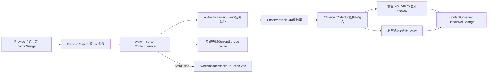
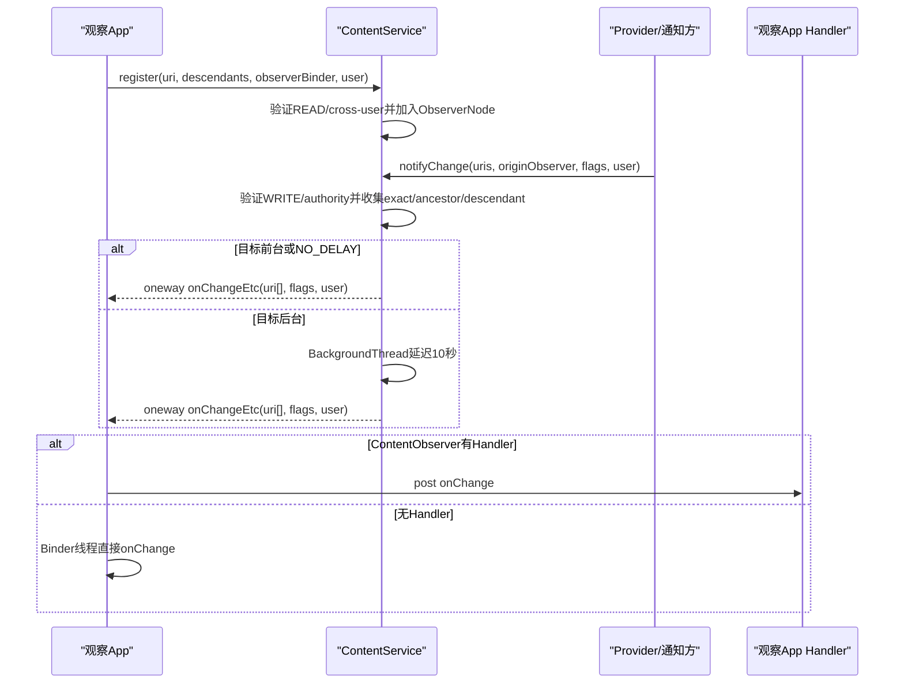
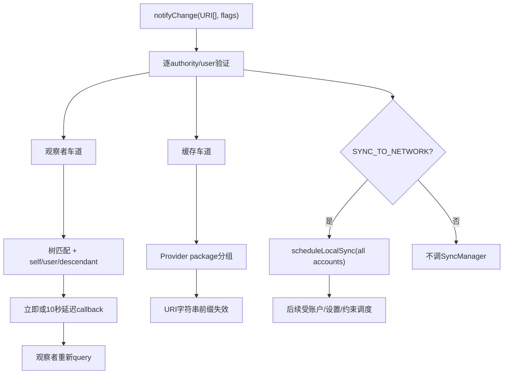

# 283 Android ContentResolver.notifyChange：ContentObserver、ContentService观察者树、自通知、descendant、跨用户、延迟通知与同步调度链

## 1. 本章目标

第282章追完Provider数据操作，本章研究“数据变了以后谁知道”：ContentResolver如何注册/注销观察者，ContentService怎样用URI树匹配exact、ancestor和descendant，selfChange怎样计算，后台通知为何延迟10秒，以及同一次notify怎样独立触发缓存失效与SyncManager local sync。

## 2. Android 11版本边界

本文依据本地`android-11.0.0_r48`。批量`onChangeEtc`、R版flags兼容开关、10秒后台延迟、NOTIFY_NO_DELAY、BinderDeathDispatcher和ContentService cache均为该tag实现；新版通知API与进程状态策略需重新核源。

## 3. 涉及三个线程/进程层次

调用App/Provider进程通过ContentResolver调用system_server的ContentService；ContentService在Binder线程收集匹配项，前台目标立即发oneway callback，后台目标由system_server BackgroundThread延迟；目标App的IContentObserver Binder线程再直接执行或post到构造ContentObserver时指定的Handler。

## 4. 先分开三条副作用

观察者callback只是“提示重新查询”；`NOTIFY_SYNC_TO_NETWORK`是向SyncManager提交local sync线索；ContentService内置cache invalidation清的是特权`CACHE_CONTENT`缓存。三条共享一次notify输入，却没有共同事务，也不保证同时完成。

## 5. 源码地图

```text
frameworks/base/core/java/android/content/ContentResolver.java
frameworks/base/core/java/android/database/ContentObserver.java
frameworks/base/core/java/android/database/IContentObserver.aidl
frameworks/base/services/core/java/com/android/server/content/ContentService.java
frameworks/base/core/java/com/android/internal/os/BinderDeathDispatcher.java
frameworks/base/services/core/java/com/android/server/content/SyncManager.java
frameworks/base/core/java/android/database/AbstractCursor.java
```

## 6. 注册API的三个要素

`registerContentObserver(uri,notifyForDescendants,observer)`指定树节点、是否监听更深后代和回调对象。ContentResolver从URI提取userId、移除authority中的user前缀，再把observer的Binder transport与targetSdk交给ContentService。

## 7. notify API既支持单URI也支持集合

单URI最终转为Uri数组；Collection版本先按嵌入userId聚类，每组剥user前缀分别Binder调用。不同user不会混在同一个ContentService.notifyChange参数组里。

## 8. 五类公开通知flags

SYNC_TO_NETWORK尝试调度同步；SKIP_NOTIFY_FOR_DESCENDANTS调整树匹配；INSERT/UPDATE/DELETE只是变化类型提示。隐藏NO_DELAY要求跳过后台延迟，代价是可能造成通知风暴。

## 9. 老的双参数notify默认请求同步

`notifyChange(uri,observer)`转到`syncToNetwork=true`，会带SYNC_TO_NETWORK；想只通知本地观察者应显式用flags为0的重载。很多“为什么改一次本地数据却触发SyncAdapter”的问题来自这个历史默认值。

## 10. notify不是由SQLite自动产生

Provider完成insert/update/delete后应主动调用notifyChange，通常在事务成功提交后；SQLite表变化、文件写入或Cursor移动本身不会让ContentService知道。

## 11. ContentService是统一Binder服务

ContentResolver静态缓存名为`content`的IContentService；它同时承载observer、sync设置/调度和content cache。ObserverNode只负责通知索引，不保存Provider行数据。

## 12. 三条主链总图



## 13. 注册先验证目标user

`handleIncomingUser`解析USER_CURRENT；同user直接通过，跨user可凭具体URI READ grant，或INTERACT_ACROSS_USERS/FULL。USER_ALL必须FULL，其他负伪user非法。

## 14. notify跨user改用WRITE grant

发布变化会影响目标user观察者和缓存，跨user时检查具体URI WRITE grant，或跨用户权限；仅有read grant足以跨user注册观察，却不足以跨user宣告数据被改写。

## 15. authority访问仍经AMS预检

注册和notify都调用ActivityManagerInternal.checkContentProviderAccess，确认caller对该user的authority至少有可能访问；它复用第281章的Provider获取级检查，并不替观察者读取数据授予新权限。

## 16. Android O起不存在/不可访问更严格

targetSdk≥O时访问检查返回错误就SecurityException。旧target对“Provider不存在”仍兼容继续；其他拒绝通常warning并忽略注册或本条notify，避免老应用升级系统后直接崩溃。

## 17. 旧App可在不存在authority上建节点

pre-O遇`Failed to find provider`不会return，ObserverNode仍可保存该authority路径；notify也可能继续匹配。它是兼容遗留行为，不证明系统存在对应Provider或caller能查询数据。

## 18. ContentObserver按需创建Transport

`getContentObserver()`在锁内惰性创建IContentObserver.Stub，同一个ContentObserver实例多次注册通常复用同一Binder；服务端正是用Binder身份判断selfChange与注销。

## 19. unregister先切断本地对象

`releaseContentObserver`先让Transport.mContentObserver=null并清字段，再把旧Binder交给ContentService.unregister。即使注销过程中有迟到callback，Transport看到null也不会再调用业务observer。

## 20. 注销后可重新注册

下一次getContentObserver会创建新Transport Binder；它与旧Binder身份不同。服务端若因重复注册bug残留旧entry，迟到回调也只到已release的空Transport，不会执行新observer实例逻辑。

## 21. ObserverNode是一棵URI前缀树

根节点名为空，第0段是authority，之后逐个URI path segment；每个节点有children与ObserverEntry列表。注册`content://a/x/7`形成`root→a→x→7`，query和fragment不入树键。

## 22. URI scheme不参与ObserverNode路径

`getUriSegment(0)`只取authority，后续只取pathSegments；正常ContentResolver要求有Provider支持，但树算法本身不把scheme、query、fragment作为匹配维度。同authority/path的不同query会命中同一观察节点。

## 23. addObserver递归创建缺失节点

到`index==authority+path段数`时把ObserverEntry挂叶节点，记录observer、uid、pid、notifyForDescendants和user。相同Binder/URI重复注册不会去重，会追加多项。

## 24. 每项注册都接入死亡分发器

ObserverEntry是DeathRecipient，但共享BinderDeathDispatcher让同一observer Binder只需底层linkToDeath一次，再分发给多条entry；进程死亡时各recipient回调树删除，避免永久保留App Binder。

## 25. 1000阈值只告警不拒绝

同一observer Binder关联entry数正好到1000时按UID只记录一次wtf，打印pid/package/URI；注册仍继续。它是泄漏诊断阈值，不是配额或安全上限。

## 26. 树匹配要区分三个方向

通知URI与注册URI可以exact相等；通知更深时，注册点是ancestor，只有notifyForDescendants=true才收；通知更浅时，注册点是descendant，无论该flag真假都会收，因为“祖先整体发生变化”可能影响它。

## 27. notifyForDescendants只控制向下监听

注册`a/x`且false：notify `a/x/7`不收，notify `a/x`收，notify `a`也收。API文档的“还会收到URI ancestors变化”常被忽略，导致开发者误以为false只收exact。

## 28. collect从root沿匹配child走

在未到通知叶节点时，先收当前节点中愿意监听descendants的entry，再只进入名称相同child；到通知叶后segment=null，递归遍历该节点全部后代，把更深注册点也视为受祖先变化影响。

## 29. exact叶节点总会通知

到注册点与通知点相同，通常不看notifyForDescendants，所有entry都收；该flag描述额外后代，不会关闭exact通知。

## 30. SKIP flag修改叶节点规则

NOTIFY_SKIP_NOTIFY_FOR_DESCENDANTS使“被当作leaf收集”的entry若自身notifyForDescendants=true则跳过。Provider可先发宽泛`a/x`并带skip，再发具体`a/x/7`，让宽监听者只处理更具体事件。

## 31. SKIP也可能影响更深注册节点

算法到通知leaf后继续递归后代时仍以leaf=true收集，因此后代节点中notifyForDescendants=true的entry也会被skip；不能把flag名字简化成“只跳通知URI exact节点上的根观察者”。

## 32. selfChange按Binder身份计算

notifyChange传入发起变化的ContentObserver transport；服务端比较entry.observer.asBinder与它是否相同。相同即selfChange=true，和URI、进程、Java对象equals无关。

## 33. 默认不投递self通知

ContentObserver.deliverSelfNotifications默认false；发起者相同且false时collector直接跳过。override返回true则该entry收到selfChange=true，其他observer仍收到false。

## 34. 传null observer表示没有发起者

所有匹配entry都不是self，不会被self过滤。Provider通常传null；Cursor或组件若希望抑制自己造成的循环刷新，可传对应注册observer。

## 35. user匹配有三种成功方式

targetUser为USER_ALL、entry注册USER_ALL，或两者硬user相等。USER_ALL注册本身需要跨用户FULL权限；callback携带的userId使用本次targetUser，可能是USER_ALL而非某个逐用户展开值。

## 36. ObserverCollector按五元组聚合

key包含observer Binder、注册uid、selfChange、flags和userId；同key的多个URI放一List，最后一次`onChangeEtc(Uri[])`发送，减少Binder transaction数量。

## 37. URI列表不会自动去重

同一URI在输入重复、同一observer多次注册或经多个匹配entry收集时，会被重复add到同key List。回调实现应把Collection视为事件提示，可按需去重后重新查询。

## 38. 不同flags/self/user不能合批

即便observer相同，key任一字段不同就产生独立callback任务。一次notify调用所有URI共享flags，但多次调用不会跨collector合并。

## 39. IContentObserver回调是oneway

ContentService发送`onChangeEtc`不等待App业务onChange完成；前台“立即”指立即提交Binder调用，不是同步等待观察者处理。异常只可能在发送阶段体现，业务异常留在目标进程。

## 40. 前台目标按UID procState判断

目标UID状态≤IMPORTANT_FOREGROUND时task直接run；否则默认post到system_server BackgroundThread延迟10秒。判断用注册entry保存的uid，不是通知发起者状态。

## 41. NOTIFY_NO_DELAY强制立即发送

隐藏flag绕过后台10秒，适合极少数强时效系统场景；它不提高目标进程优先级、不保证目标Handler立刻调度，也不改变oneway语义。

## 42. 10秒延迟不是debounce

每个notifyChange各建Collector和Runnable，后台连续100次会排100批延迟任务，并不会按observer取消旧任务或合并十秒窗口。批量Collection API和Provider层合并变化仍很重要。

## 43. 有Handler就在目标Looper执行

App Binder线程收到Transport.onChangeEtc后，ContentObserver.dispatchChange把lambda post到构造时Handler；典型UI observer传main Handler。系统10秒延迟与App Handler排队是两段独立等待。

## 44. Handler为null就在Binder线程执行

回调直接调用onChange，不能更新仅限主线程的UI，也不应阻塞Binder线程池。它没有自动转到Provider线程、注册线程或主线程。

## 45. 注册到回调时序图



## 46. R版三参数int有兼容歧义

新公开`onChange(boolean,Collection<Uri>,int)`把int定义为flags，但旧隐藏API曾把相同签名的int当userId。Java签名无法同时存在两套语义，r48用compat change按targetSdk分流。

## 47. target R及以后通常收到flags

ADD_CONTENT_OBSERVER_FLAGS对target>Q启用，四参数内部入口调用三参数新API并传flags；默认实现再逐URI调用`onChange(self,uri,flags)`。

## 48. 旧target和system UID保留userId语义

compat未启用或进程UID为SYSTEM_UID时，代码把userId塞进同一个三参数int位置，保护大量隐藏API使用者。若旧代码把它误当新flags解析，会得到看似随机的bit组合。

## 49. INSERT/UPDATE/DELETE只是提示

ContentService不根据它们改变树匹配、权限或缓存规则，原样传给observer。一个notify可不带类型，也可能错误带多bit；观察者必须以重新查询后的事实为准。

## 50. Collection API先按user聚类

每个URI可嵌不同user，ContentResolver建SparseArray<user,List<standard URI>>并逐user调用服务。它没有按authority预聚类；ContentService内部再以authority+resolvedUser缓存访问验证。

## 51. 同批不同authority可以一起传

服务端逐URI匹配观察树，并为每个唯一authority/user做一次Provider访问验证、同步调度和缓存失效。某一条target≥O验证抛SecurityException会中断整个Binder调用，已收集但尚未dispatch的事件不会发送。

## 52. 通知URI不会自动重新加user-id

ContentResolver送的是去user-id URI，callback另带userId参数；新公开回调常只看到flags而看不到userId。多用户系统代码需使用隐藏四参数入口或为每user维护独立observer上下文。

## 53. notify先收集后clear identity

访问验证与树匹配使用原caller身份；完成collector后ContentService清Binder identity，以system_server身份发送callbacks、调SyncManager和操作内部cache，finally恢复。

## 54. RemoteException不会中断其他observer

每个task独立try/catch并忽略RemoteException；一个目标进程死亡不影响collector后续key。真正树清理由Binder death recipient异步完成。

## 55. 同一notify的回调顺序不是业务事务顺序

Collector按ArrayMap键顺序派发，后台项又延迟；不同observer、不同key和Handler之间无全局时序保证。需要顺序/版本时应在数据中存generation或时间戳，callback只触发读取。

## 56. SYNC flag按唯一authority调一次

完成callback任务提交后，ContentService遍历validatedProviders；带SYNC_TO_NETWORK时调用`SyncManager.scheduleLocalSync(null,...)`，account为null表示让同步框架考虑该authority的所有匹配账户。

## 57. scheduleLocalSync不等于立即联网

它生成本地变更同步请求，仍受SyncAdapter存在、账户、master/authority sync设置、用户状态、JobScheduler约束、网络/电量与退避控制。flag是调度意图，不是网络事务完成确认。

## 58. sync使用通知发起者身份做归因

调用参数保留callingUid/pid/package，并计算sync exemption；前台/top发起者可获得bucket提升。ContentService清identity后仍显式传原始字段，避免所有请求看起来都来自system_server。

## 59. 跨用户notify的sync user边界

r48 scheduleLocalSync传的是`callingUserId`，而不是每个provider key的`resolvedUserId`。跨user凭grant/权限通知目标user时，observer和cache按resolved user处理，但local sync仍以caller user调度；这是值得核对产品预期的实现边界。

## 60. 不带SYNC仍会通知和清cache

flags=0只跳过SyncManager分支，ObserverCollector照常发送，ContentService cache也照常失效。不要为避免网络同步而完全省略notify，否则UI/查询缓存会陈旧。

## 61. ContentService还有独立content cache

`mCache`结构为userId→Provider package→(client package, URI)→Bundle，供持CACHE_CONTENT特权的调用者缓存昂贵Provider结果。它不是Cursor缓存，也不自动缓存普通ContentResolver.query。

## 62. put/get cache有权限与包名验证

调用者需CACHE_CONTENT、满足跨用户权限，packageName还由AppOps.checkPackage与calling UID绑定；value设defusable。普通App不能借它读写其他包缓存。

## 63. Provider包与client包分别入键

外层Provider package用于一旦Provider包变化快速整组失效；内层Pair中的client package让不同消费者对同一URI存各自Bundle。authority解析失败时Provider package可能为null，ArrayMap仍可形成兼容项。

## 64. notify按URI前缀失效cache

每个已验证authority/user找到Provider package，再扫描本批相同authority URI；`invalidateCacheLocked`移除所有cache key URI字符串以通知URI字符串开头的项。因此通知collection根URI会清其下缓存。

## 65. cache前缀是字符串而非path segment

实现用`keyUri.toString().startsWith(notifyUri.toString())`，`content://a/foo`也会命中`/foobar`，query字符串前缀也可能产生意外范围。它偏向保守多清，不可拿该算法做安全授权或精确层级判断。

## 66. 包与locale事件也会失效

Provider包added/changed/removed/data-cleared时按user/package清整组；locale变化清全部user cache，因为许多结果含本地化文本；用户cleanup直接移除该user缓存。

## 67. 后台callback延迟不延迟cache/sync

collector.dispatch只是把后台task排到10秒后便返回，随后同一次ContentService调用立即scheduleLocalSync和invalidateCache。观察App尚未收到onChange时，特权cache可能已经miss，同步任务也已入队。

## 68. notify没有持ObserverNode锁做Binder调用

每条URI只在锁内遍历并复制到collector，真正dispatch在锁外；慢/死亡observer不会阻塞注册树的register/unregister，降低全局锁反向调用风险。

## 69. Binder死亡最终清理整棵树

ObserverEntry.binderDied在root observersLock下调用removeObserverLocked，递归删除匹配Binder并剪掉空child。死亡期间已经收进collector的task仍可能发送失败，RemoteException被忽略。

## 70. 显式unregister按Binder跨路径删除

remove从root递归所有children，在每个节点比较observer.asBinder；因此同一个ContentObserver注册多个不同URI，一次unregister会在各节点各删除一项，并剪掉空路径。

## 71. 同节点重复注册只删第一项

节点mObservers循环命中后remove并立即break；同Binder在相同URI重复注册多次时，一次unregister只去掉该节点第一项，剩余entry继续收到callback并保留death recipient。这是r48明确的重复注册/泄漏边界。

## 72. 重复项还会造成重复URI回调

同一notify匹配多个相同entry，Collector key相同但每次都add URI，因此一次onChangeEtc的URI数组可能含重复值；它不会因为同一Binder自动set去重。

## 73. 树节点名称没有编码user

所有用户共享authority/path树，userHandle存在ObserverEntry中并在collect过滤。这样结构复用路径，但dump/诊断必须同时看entry user，不能只看节点路径。

## 74. ancestor通知的设计意义

注册具体`items/7`即使descendants=false，Provider通知`items`仍应触发，因为整集合变化可能删除/替换7；反过来通知`items/8`不会影响7。false不是exact-only，而是“不关心注册点之下更细的变化”。

## 75. 根authority观察示例

注册`content://a`且descendants=true会收a下所有路径；false只收`a`本身和比它更浅的祖先——实际authority已经是第一段，没有更浅有效业务节点，所以近似exact authority通知。

## 76. SKIP双通知示例

Provider更新row 7，可先notify `items`+SKIP表示集合变化，再notify `items/7`不带skip；监听整个items且descendants=true者跳过宽事件、接收具体事件，exact监听items但descendants=false者仍可接收宽事件。

## 77. self通知不能防所有反馈循环

它只识别同一observer Binder；同一组件注册两个ContentObserver对象，A写入时传A，B仍收到false并可能再次写。业务循环还需版本、来源字段或幂等逻辑。

## 78. USER_ALL回调需要谨慎解释

若notify目标就是USER_ALL，entry user匹配后collector key/userId也可能是USER_ALL；它不是把事件自动复制成每个具体user的多次callback。观察者要按API权限和数据模型自行刷新各用户视图。

## 79. pre-O兼容可能制造“幽灵通知”

不存在Provider的authority仍可注册/notify，ObserverNode仅按字符串匹配，因而老App之间可能互相收到无法query的URI事件。target O+的存在性/访问检查会阻止新App依赖这种行为。

## 80. callingPackage主要用于sync归因

ContentResolver传`mContext.getPackageName()`；notify的authority访问按Binder UID/ProcessRecord判断，callingPackage在此入口没有独立AppOps.checkPackage，随后被传给scheduleLocalSync记录发起者。可信安全主体仍是Binder UID。

## 81. validatedProviders避免重复解析

key为authority+resolvedUserId，同批相同Provider多个URI只做一次AMS access check和PackageManager provider包解析，也只调一次local sync；ObserverNode仍逐URI收集，以保留具体变化集合。

## 82. 某URI失败可能中断整批

target O+在循环中抛SecurityException时，collector尚未dispatch，之前合法URI也不会回调/cache失效/sync；Provider应在调用前确保批量URI都属于有权限的有效authority，或按安全边界拆批。

## 83. 通知事件不持久化

ContentService不写磁盘保存observer事件，进程没注册、死亡或设备重启期间的变化不会补发。正确观察者在注册/启动时先query当前状态，onChange只作为再次查询提示。

## 84. onChange不携数据快照

URI和flags描述“哪里/何种变化”，不保证回调时该row仍存在，也不保证一次事件对应一次事务。并发写入可在通知与query之间继续发生，数据源当前结果才是权威。

## 85. generation比事件计数更可靠

需要增量同步时Provider应提供generation/version列或变更日志；观察者记录上次水位并查询大于水位的数据。直接数onChange次数会被批量、重复、延迟和丢失语义破坏。

## 86. Cursor notification URI会间接注册observer

Cursor设置notification URI后，客户端观察Cursor变化的机制最终仍依赖ContentResolver/ContentObserver；关闭Cursor需注销内部observer。返回Cursor不调用setNotificationUri，数据更新后客户端Cursor不会自动获知。

## 87. Cursor自观察也遵循Binder身份

Provider通知时传哪个observer决定self过滤，普通Provider常传null，所以Cursor observer正常收到；“更新该Cursor自身”不是靠Cursor对象引用自动识别，仍是origin observer Binder协议。

## 88. 通知、缓存、同步三车道图



## 89. 一次通知的锁与线程边界

Binder线程用原caller做user/authority验证，短持mRootNode锁收集；清identity后在锁外发送/排队，再持mCache锁失效；App端Binder线程接收后可post Handler。任何业务重查都不在ContentService锁内。

## 90. 大量细粒度通知会形成风暴

树遍历、Collector List、oneway transaction、App Handler和重新query都有成本；循环插入1000行应优先一次batch与一个collection/URI集合通知，而不是每行一次NO_DELAY。

## 91. Collection notify能减少Binder次数

同user多个URI一次进入ContentService，Collector又按observer key合批；不同user仍分Binder调用。它不自动合并路径语义，Provider仍应选择最能表达变化范围的URI集合。

## 92. 延迟期间数据可以继续变化

后台callback里的URI List是通知时收集的对象引用列表，但业务数据早已可能跨多个版本；收到后应query最新状态，不要尝试按10秒前事件重放数据库写入。

## 93. 不同notify调用之间没有顺序合同

前台目标可能即时收到，后台目标按各自post时间排队；目标UID状态、Binder调度、不同Handler还会改变可见顺序。INSERT后DELETE可能只查询到最终不存在，这是正常观察模型。

## 94. oneway不等于无限无成本

发送方不等业务返回，但Binder异步缓冲有限，巨量通知仍占内存/调度并可能遇到死亡RemoteException。NOTIFY_NO_DELAY也只是跳system延迟，不提供可靠消息队列。

## 95. onChange里同步写回容易递归

观察者收到后若立即更新同一URI并notify，origin observer未正确传递或有其他observer就可能循环。优先比较新旧状态、使用幂等更新，并在合适场景传origin observer抑制自身回声。

## 96. local sync不是远端push确认

scheduleLocalSync只是告诉SyncAdapter“本地发生变化”，没有变更payload，也不保证server收到。Adapter要自行读取本地脏标志/变更表、执行网络协议并处理冲突。

## 97. cache invalidation不调用Provider

ContentService只删除内部Bundle缓存项，不触发Provider query或业务刷新；下次特权client getCache miss后是否重新计算由调用方协议决定。

## 98. flags不授予任何权限

INSERT/NO_DELAY/SYNC等均是caller输入，不能作为Provider或observer信任“这是系统写入”的证据。访问验证仍按authority/UID/user/grant，observer处理敏感动作还需自己的权限模型。

## 99. notify不会验证数据库真的变化

只要caller通过Provider访问检查与跨user门，就能发事件；ContentService不读取row确认。虚假/重复通知应被观察者的重新query和幂等逻辑吸收。

## 100. Provider应在提交后通知

事务内过早notify可能让前台observer立刻query到旧状态，之后又没有第二次事件；正确做法通常是数据库commit成功后，在锁外发送尽量准确的URI/flags。

## 101. 回滚事务不应发送成功通知

若batch失败回滚却已逐operation notify，观察者会无谓刷新甚至看到中间态；Provider override applyBatch时可收集受影响URI，事务成功后统一notify。

## 102. observer不是Lifecycle自动管理对象

Activity/Fragment注册后必须在匹配生命周期注销；否则服务端保留Binder entry直到进程死亡，Handler/observer又可能间接持UI引用。1000阈值日志通常意味着重复注册而非系统随机故障。

## 103. 同一实例不要重复注册同一URI

r48 explicit unregister在每个节点只删一个entry，重复项会残留并重复回调；应用应在状态机中保证register/unregister一一对应，不能依赖多次注册“自动去重”。

## 104. Handler选择决定UI安全与时延

UI层传main Handler；后台索引可传专用HandlerThread；null只适合极短、线程安全处理。无论哪种，onChange应快速安排查询，避免在Binder/主线程做重I/O。

## 105. 进程死亡是最终兜底而非正常释放

BinderDeathDispatcher会清服务端entry，但App自己的资源、线程和业务状态已经随进程消失。正常生命周期仍要unregister，便于进程存活时立即停止无用回调。

## 106. 排查“完全收不到通知”

检查注册/通知user、authority有效性、target O访问检查、URI树方向、notifyForDescendants、self过滤、observer是否已release；再看目标是否后台正等10秒、Handler Looper是否运行和进程是否被杀。

## 107. 排查“收到多次相同URI”

检查Provider是否逐行+批量重复notify、同observer是否重复注册、同一次URI Collection是否含重复、一个Binder是否在多个匹配节点注册；Collector只合批不去重。

## 108. 排查“后台总慢约10秒”

查看目标UID procState是否高于IMPORTANT_FOREGROUND，flag是否NO_DELAY；这通常是系统防stampede策略。不要随意加隐藏NO_DELAY，先判断UI是否真的需要实时和能否在前台订阅。

## 109. 排查“notify触发了同步”

确认是否调用默认双参数重载或显式SYNC flag，authority是否有SyncAdapter；再看SyncManager账户、syncable/master设置和exemption。观察callback本身不会自动联网。

## 110. 安全高效通知检查单

事务提交后notify；选择最小但足够的URI集合；正确变化flags；默认flags=0除非确需sync；避免NO_DELAY；跨user分组；observer生命周期成对；onChange只重新查询；数据带generation；batch后一次通知。

## 111. 阅读完成检查

你应能画出URI树，解释false仍收ancestor、SKIP叶规则、self Binder身份、user过滤、Collector合批但不去重、前台/后台双阶段、R flags兼容、cache立即失效与local sync独立调度。

## 112. macOS只读练习一：手算URI树

```bash
cd /Users/ninebot/androidSource
sed -n '1449,1745p' frameworks/base/services/core/java/com/android/server/content/ContentService.java
```

注册`a`、`a/x`、`a/x/7`三层且混合descendants true/false，分别通知三层URI并加入SKIP；列出每个entry是否收到及原因。

## 113. macOS只读练习二：追注册、自通知与线程

```bash
cd /Users/ninebot/androidSource
sed -n '35,320p' frameworks/base/core/java/android/database/ContentObserver.java
sed -n '2600,2840p' frameworks/base/core/java/android/content/ContentResolver.java
```

画出ContentObserver→Transport Binder→ContentService entry→onChangeEtc→Handler，比较origin null、同Binder且deliver false/true、不同observer四种selfChange结果。

## 114. macOS只读练习三：审计批量与后台延迟

```bash
cd /Users/ninebot/androidSource
sed -n '395,590p' frameworks/base/services/core/java/com/android/server/content/ContentService.java
```

构造同user两authority、重复URI和同observer重复注册，写出validatedProviders、Collector keys与URI数组；再比较前台、后台、NO_DELAY时callback/cache/sync的时间线。

## 115. macOS只读练习四：核对跨用户与cache

```bash
cd /Users/ninebot/androidSource
sed -n '1200,1365p' frameworks/base/services/core/java/com/android/server/content/ContentService.java
sed -n '330,490p' frameworks/base/services/core/java/com/android/server/content/ContentService.java
```

分别用READ grant注册目标user、WRITE grant通知目标user，验证observer/cache的resolved user与scheduleLocalSync的callingUserId；再测试`/foo`通知为何会清`/foobar`缓存。

## 116. 易混点一：descendants=false不是exact-only

它拒绝注册点更深的通知，但注册点本身及其祖先通知仍会到达。用集合根通知表达“下面某处变化”正依赖后者。

## 117. 易混点二：selfChange不是同进程判断

只有origin observer Binder与entry Binder相同才为self；同进程不同对象不是self，同对象跨多URI注册都是self。deliverSelfNotifications只决定是否保留这类回调。

## 118. r48实现边界汇总

同节点重复注册单次unregister只删第一项；Collector不去重URI；10秒延迟不跨notify合并；cache用字符串startsWith；跨user sync仍取callingUserId；旧target可在不存在Provider上观察；R三参数int按compat在flags/userId间切换。均应按调用条件理解。

## 119. 复读纠偏记录

复读后修正十二点：观察/sync/cache三链独立；默认双参数会sync；注册跨user用read、notify用write；false仍收ancestor；SKIP在leaf/后代递归均生效；self按Binder；批量按user；collector合批不去重；后台只延callback；cache/sync立即；flags非权限；通知不持久且必须重新query。

## 120. 本章小结与下一章

Android 11以ContentService ObserverNode树统一索引authority/path，用Binder身份、user与descendant规则收集事件，再按目标UID状态立即或延迟oneway投递；同一次notify还独立失效特权cache并可调度local sync。下一章转入Android SQLiteDatabase、SQLiteOpenHelper、SQLiteConnectionPool/Session、事务、WAL、并发连接与损坏恢复链。
