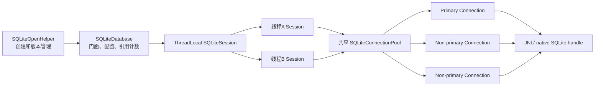
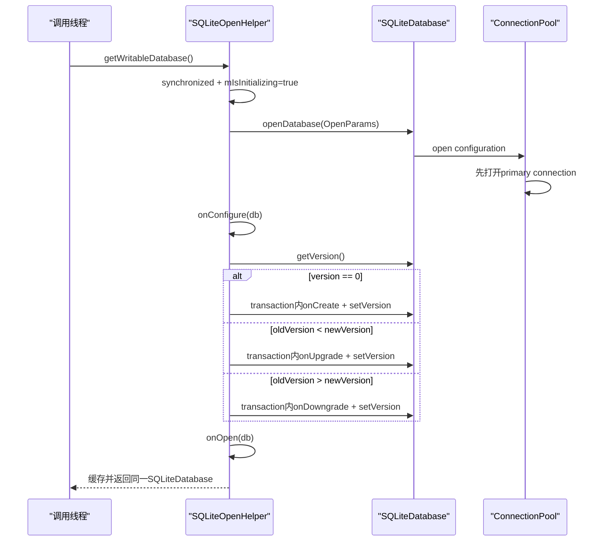
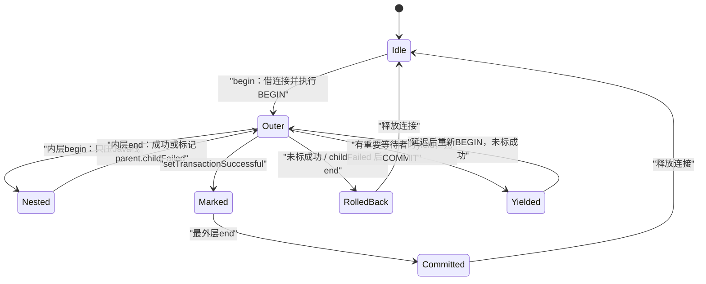

# 284 Android SQLiteDatabase、SQLiteOpenHelper、SQLiteConnectionPool/Session、事务、WAL、并发连接与损坏恢复链

## 1. 本章目标

前一章讲的是“数据变化后怎样通知”，本章退回数据真正落盘的底座：从`SQLiteOpenHelper`首次打开开始，追到`SQLiteDatabase`、每线程`SQLiteSession`、全库`SQLiteConnectionPool`和单条`SQLiteConnection`，并解释事务、WAL、等待、公平性、取消、关闭与损坏删除。

## 2. Android 11版本边界

本文依据本地`android-11.0.0_r48`。资源默认值、compatibility WAL、连接池调度和错误恢复均以该tag为准；SQLite库版本、后续Android的连接池实现和Room行为不能直接套用。

## 3. 先建立正确心智模型

一个`SQLiteDatabase`不是“一条数据库连接”。它更像数据库门面和共享配置持有者；每个线程通过自己的`SQLiteSession`管理事务，再按需从同一个`SQLiteConnectionPool`借一条真实连接。

## 4. 五层对象各管什么

`SQLiteOpenHelper`管创建与版本；`SQLiteDatabase`管公开API、配置和引用；`SQLiteSession`管当前线程事务；`SQLiteConnectionPool`管全库连接资源；`SQLiteConnection`持native handle、执行prepared statement。

## 5. 源码地图

```text
frameworks/base/core/java/android/database/sqlite/SQLiteOpenHelper.java
frameworks/base/core/java/android/database/sqlite/SQLiteDatabase.java
frameworks/base/core/java/android/database/sqlite/SQLiteSession.java
frameworks/base/core/java/android/database/sqlite/SQLiteConnectionPool.java
frameworks/base/core/java/android/database/sqlite/SQLiteConnection.java
frameworks/base/core/java/android/database/sqlite/SQLiteDatabaseConfiguration.java
frameworks/base/core/java/android/database/DefaultDatabaseErrorHandler.java
frameworks/base/core/jni/android_database_SQLiteConnection.cpp
frameworks/base/core/res/res/values/config.xml
```

## 6. 本章不讨论什么

`SQLiteCursor`、`SQLiteQuery`和`CursorWindow`的大结果集填充留到第285章。本章只在需要解释连接占用和取消时提到查询出口，避免把“连接调度”和“结果窗口”揉成一团。

## 7. 总体对象关系图



## 8. OpenHelper构造时没有开库

`SQLiteOpenHelper`构造器只保存context、文件名、目标版本与OpenParams builder。真正的文件创建、打开和升级发生在第一次`getWritableDatabase()`或`getReadableDatabase()`，这叫惰性打开。

## 9. 惰性打开不等于廉价调用

第一次get可能建文件、检查版本、执行DDL和搬迁数据，所以源码明确提醒不要在主线程，尤其不要在`ContentProvider.onCreate()`里做耗时升级。构造helper很快，首次get未必快。

## 10. writable与readable入口都加helper锁

两个公开方法都`synchronized(this)`进入`getDatabaseLocked`。同一个helper实例的首次打开和升级被串行化；但多个独立helper实例指向同一路径时，不共享这把Java锁。

## 11. 已缓存数据库的快路

若`mDatabase`仍open，readable请求或已经可写的writable请求直接返回同一对象。它不是每次get都新建连接池，也不是调用者每次获得独占数据库对象。

## 12. 调用者不应擅自关闭helper返回的db

源码发现缓存对象被用户直接`mDatabase.close()`后会把缓存清空并重开，但这会破坏共享使用者的生命周期。常规做法是由拥有helper的组件统一调用`helper.close()`。

## 13. 递归初始化被显式拒绝

`mIsInitializing`为true时再次get会抛`getDatabase called recursively`。因此不能在`onCreate/onUpgrade/onConfigure/onOpen`里再次调用同一helper的get方法；回调已经拿到了应使用的db。

## 14. null数据库名表示内存库

`mName == null`走`SQLiteDatabase.createInMemory`。每个`:memory:` native连接都是独立数据库，所以连接池对内存库强制大小1，也拒绝开启WAL。

## 15. 普通文件如何定位

helper用`Context.getDatabasePath(mName)`定位应用数据库，再用OpenParams打开，并为了兼容旧行为把文件权限设置为0660。这里的“数据库名”不是任意工作目录相对路径。

## 16. readable不是永远只读

`getReadableDatabase()`首先照常尝试可写打开；只有打开抛`SQLException`时才加`OPEN_READONLY`重试。它的含义是“必要时允许只读退路”，不是“强制只读”。

## 17. writable不会静默降级

如果调用的是`getWritableDatabase()`，首次可写打开失败就把异常抛出，不尝试read-only。这样调用者不会误以为后续insert/update可成功。

## 18. 只读缓存可以日后升级为可写

此前readable因磁盘问题得到read-only对象，后续writable请求会调用`reopenReadWrite()`；成功后复用对象，失败则保持只读并抛异常。

## 19. OpenHelper生命周期总顺序

成功打开后先`onConfigure`，再读`PRAGMA user_version`；版本不同则在事务里create/upgrade/downgrade并写新版本；最后`onOpen`。顺序是配置→模式迁移→已打开通知。

## 20. onConfigure应该放连接级配置

外键、locale、WAL等必须在建表或升级前确定，所以放`onConfigure`。注释要求不要把普通业务数据修改塞进这里；否则每次打开都可能产生隐藏副作用。

## 21. onCreate只由version 0触发

新数据库初始`user_version`为0，于是调用`onCreate(db)`。它表达“首次模式建立”，不是Java helper对象第一次被构造。

## 22. onUpgrade由旧小新大触发

当`0 < oldVersion < newVersion`时调用`onUpgrade`。应用需要写逐版本、可跨级迁移的逻辑，例如从3直接升级5时不能只假设必经4的单独进程启动。

## 23. onDowngrade默认拒绝

数据库版本大于目标版本就调`onDowngrade`，默认实现直接抛`SQLiteException`。若应用要支持降级，必须自己定义不会丢失关键数据的方案。

## 24. 版本迁移由外层事务保护

helper调用`db.beginTransaction()`，执行回调、`setVersion(newVersion)`、`setTransactionSuccessful()`，finally中end。回调抛错时新版本号和同一事务中的DDL/DML一起回滚。

## 25. 并非所有DDL都天然独立提交

在Android所用SQLite里，helper明确把迁移DDL包入事务。不要沿用某些其他数据库“DDL必自动提交”的经验；应以这里的真实事务链和SQLite行为为准。

## 26. minimumSupportedVersion是删除重建策略

隐藏构造能力允许指定最低支持版本。若`0 < current < minimum`，先`onBeforeDelete`、close、删除整个数据库，再递归重开并走onCreate，而不是执行onUpgrade。

## 27. 删除重建会丢数据

该策略只适合确认旧数据可丢、可从服务器恢复或迁移成本不可接受的场景。`onBeforeDelete`是最后的应用钩子，但默认什么都不做。

## 28. 初始化失败会清理临时对象

finally会清`mIsInitializing`；若局部db尚未成为`mDatabase`，就close它。这样onConfigure、迁移或onOpen异常不会把半初始化对象缓存给以后调用。

## 29. helper.close也受初始化门约束

初始化过程中close会抛`Closed during initialization`；平时则关闭缓存db并置null。下一次get可以重新打开，不代表文件被删除。

## 30. OpenHelper时序图



## 31. SQLiteDatabase保存共享配置

`mConfigurationLocked`包含path、label、openFlags、locale、foreign key、cache size、journal/sync mode等；`mLock`保护配置和pool引用，但不能在持锁时等待连接或执行SQL，以免死锁。

## 32. open先建立ConnectionPool

`openInner()`在锁内调用`SQLiteConnectionPool.open(configuration)`，再登记CloseGuard与进程内弱引用表。pool初始只打开primary connection，不会启动时一次性创建最大数量。

## 33. 打开时损坏可恢复重试一次

`SQLiteDatabase.open()`捕获被判定为corrupt的RuntimeException，调用error handler后再`openInner()`一次。默认handler通常删掉损坏文件，因此第二次打开可能创建新库。

## 34. 非损坏打开失败不删除数据库

普通`SQLiteException`只记录失败、close并重新抛出。磁盘满、权限错误、SQL配置错误不应被误当作corruption自动删库。

## 35. SQLiteDatabase使用引用计数

公开操作常先`acquireReference()`，finally中`releaseReference()`；所有引用释放才触发`onAllReferencesReleased()`并dispose。它保护一次API调用期间db门面不被直接销毁。

## 36. close不一定瞬间杀死在用连接

pool关闭时立即关可用连接；已借出的连接记录为仍在使用，归还时再关闭。已有session可能完成手头释放流程，但新的借连接请求会因pool closed失败。

## 37. 每线程一个Session

`mThreadSession = ThreadLocal.withInitial(this::createSession)`。同一个db在两个线程上得到两个session；同一线程反复调用则得到同一session和同一份事务栈。

## 38. Session不是线程安全对象

它就是按线程绑定设计的，不应跨线程传递。`SQLiteDatabase`可以多线程共享，不代表它背后的某个`SQLiteSession`或某次事务可以跨线程接续。

## 39. 事务属于线程而非db对象全局

线程A调用begin后，线程B在同一个`SQLiteDatabase`对象上调用`inTransaction()`会查看B自己的session，通常返回false。把事务开始和结束分派到不同线程会直接破坏协议。

## 40. 每线程每库至多占一连接

Session的`mConnection`只有一个，并用`mConnectionUseCount`处理嵌套调用。该限制避免同一线程为同一库同时等自己占住的另一连接而死锁。

## 41. 无显式事务时连接按操作借还

query/execute等进入Session，若当前没有连接就从pool借；操作结束useCount归零便归还。这对应短暂的隐式事务/单语句执行范围。

## 42. 显式事务会长期持有连接

最外层begin先借连接并执行BEGIN，直到最外层end的COMMIT/ROLLBACK后才释放。事务里每条SQL继续复用这条连接，所以长事务会持续占用稀缺池资源。

## 43. 同一事务内查询不会漂到另一连接

这是快照与事务一致性的基础。即使WAL池里还有空闲non-primary，当前session也不会把事务中后续查询随机派往别的handle。

## 44. 连接flags来自操作意图

只读操作请求`CONNECTION_FLAG_READ_ONLY`；写操作和事务通常请求`PRIMARY_CONNECTION_AFFINITY`；主线程再附加`INTERACTIVE`，用于等待队列优先级。

## 45. READ_ONLY flag是运行时约束

pool分配后调用`connection.setOnlyAllowReadOnlyOperations(true)`；prepared statement若被native识别为写语句会被拒绝。它不是说这条物理连接永远以只读文件模式打开。

## 46. PRIMARY affinity保留旧式串行预期

写请求倾向primary，使数据修改围绕主连接串行。只读请求先尝试non-primary，也可在可用时退到primary。

## 47. INTERACTIVE只提高等待优先级

pool的`getPriority`只有interactive=1、普通=0。它不会创造额外连接，也不保证UI线程永不阻塞；所有可用连接被长事务占住时，主线程一样要等。

## 48. beginTransaction是EXCLUSIVE模式

公开`beginTransaction()`把exclusive=true映射为`TRANSACTION_MODE_EXCLUSIVE`，Session最外层执行`BEGIN EXCLUSIVE;`。

## 49. beginTransactionNonExclusive是IMMEDIATE模式

它映射`BEGIN IMMEDIATE;`，不是DEFERRED。Android公开Database API没有直接把普通begin映射成Session的DEFERRED常量。

## 50. WAL改变并发结果而非Java方法名

非WAL下写会阻塞其他读写；WAL允许读与一名writer同时进行，读者看见写开始前的快照，但仍最多一个写事务。不能把“nonExclusive”理解成多个writer并发。

## 51. 为什么WAL建议NonExclusive

`SQLiteDatabase`文档明确建议WAL写者使用`beginTransactionNonExclusive()`，使其他连接上的查询继续读取。EXCLUSIVE接口保留更强/兼容语义，不是获得WAL并发的推荐入口。

## 52. 嵌套事务不执行嵌套BEGIN

只有`mTransactionStack == null`时才借连接并执行BEGIN。内层begin只是创建一个Java `Transaction`节点压栈，不向SQLite发送SAVEPOINT或第二个BEGIN。

## 53. 嵌套事务不是savepoint

内层失败不能只回滚内层后让外层提交；源码把父层`mChildFailed=true`，最外层最终ROLLBACK全部工作。需要部分回滚语义时，应显式设计SQL savepoint，而不是依赖Android嵌套API。

## 54. 每层都必须成功

某层end时成功条件是`mMarkedSuccessful && !mChildFailed`；任一层未调用setSuccessful，就把失败传播给父层。外层即便标记成功，也会因childFailed回滚。

## 55. setSuccessful之后只能end

源码会禁止再次setSuccessful、再次begin和安全yield，但普通SQL执行入口并没有统一调用这项状态检查。API仍要求把setSuccessful放在最后：若标记后又执行SQL且该SQL抛错，finally里的end仍可能按“已成功”提交此前变化。

## 56. Listener异常也会改变结果

onBegin抛错时，最外层会ROLLBACK；onCommit/onRollback抛错会记录异常并令本层不成功，完成栈和底层回滚后再向调用者抛出。

## 57. raw BEGIN也被Session识别

`executeSpecial`识别BEGIN/COMMIT/ABORT，并映射到Session事务方法；其中raw BEGIN固定映射EXCLUSIVE。源码警告不应混用手写事务SQL与公开API，否则状态更难推理。

## 58. yield不是暂停同一个原子事务

满足竞争条件时，yield把当前事务当作截至目前成功，真正COMMIT并释放连接；稍后再BEGIN新事务。此前变化无法被后半段失败回滚，因此原子性已经被切成两段。

## 59. 安全yield拒绝嵌套和已成功状态

`yieldIfContendedSafely`要求存在事务、尚未setSuccessful且没有嵌套；当前已有childFailed也直接false。它不是任何位置都可插入的性能魔法。

## 60. 没有重要等待者就不yield

Session先问pool的`shouldYieldConnection`。pool只在当前连接确实阻挡同等或更高优先级等待者时返回true，避免无竞争也白白提交重开。

## 61. 事务状态图



## 62. Pool始终先有primary

`SQLiteConnectionPool.open()`同步打开一条primary，成功后才把`mIsOpen=true`。non-primary是请求到来且需要扩容时惰性创建的。

## 63. 非WAL池大小固定1

`setMaxConnectionPoolSizeLocked()`在非WAL时设1。虽然注释承认其他journal mode理论上也可池化，但Android 11公开实现把“并行连接”和WAL绑定。

## 64. 内存库即便有WAL flag也保持1

判断首先排除in-memory，因为不同`:memory:`连接看见的是不同数据库。多开连接不仅不能提速，反而会让数据彼此隔离。

## 65. Android 11默认WAL池资源值是4

`config.xml`的`db_connection_pool_size`为4，`SQLiteGlobal.getWALConnectionPoolSize()`还允许`debug.sqlite.wal.poolsize`覆盖并保证至少2。厂商资源和系统属性可能改变具体数值。

## 66. 4是总连接数而非4个读加1个写

`mMaxConnectionPoolSize`计算primary与所有non-primary总数。默认最多一条primary加三条non-primary，不应口头说成“WAL固定有四条读连接”。

## 67. 最大数不等于常驻数

初始只打开primary；有并发只读请求时才扩non-primary。空闲超时或重配置还可能关闭连接，所以观察到的当前数会低于最大值。

## 68. 只读请求优先寻找SQL缓存命中

存在多个可用non-primary且传入SQL时，pool遍历连接，优先选择prepared statement cache已有该SQL的一条，以减少重新prepare成本。

## 69. 找不到non-primary可以用primary

不要求primary的请求先尝试non-primary，失败后再拿primary。要求primary affinity的请求则跳过non-primary，确保落到主连接。

## 70. 扩容时把已借和可用都计入

pool根据`mAcquiredConnections.size()`加可用primary等计算openConnections；达到最大值就返回null并排队，不会因“连接都借出所以列表为空”而无限新建。

## 71. 等待队列按两级优先级插入

interactive请求排在普通请求前；同优先级按到达顺序向后插入，近似FIFO。它是资源分配优先级，不是SQL执行器线程优先级。

## 72. 等待通过park/unpark完成

无连接时当前调用线程创建`ConnectionWaiter`后`LockSupport.parkNanos`；连接归还、取消或pool关闭时由pool分配结果并unpark。pool本身不会替App异步执行SQL。

## 73. 30秒只是忙日志周期

`CONNECTION_POOL_BUSY_MILLIS=30s`到期会打印连接池忙、active/idle/available与正在执行的请求，然后继续等待；它不是30秒数据库超时，也不会自动中止事务。

## 74. CancellationSignal可取消排队

等待连接期间注册cancel listener；取消会把waiter移出队列、设置`OperationCanceledException`并唤醒线程。它解决的是“还没拿到连接”的等待取消。

## 75. 拿到连接后的取消进入native

`SQLiteConnection.attachCancellationSignal`第一次attach时reset cancel并注册自身listener；另线程cancel会调用`nativeCancel(mConnectionPtr)`，最终依靠SQLite interrupt中断正在执行的语句。

## 76. 取消是协作式的

信号只能在API确实传入并由执行路径attach时生效；它不等于杀线程，也不保证已经提交的写入撤销。事务层仍需finally正确end。

## 77. 归还连接先清借用状态

release从`mAcquiredConnections`移除；重复归还或外来连接会抛IllegalStateException。随后依据pool是否关闭、primary身份及RECONFIGURE/DISCARD状态决定复用还是关闭。

## 78. pool关闭后归还即关闭

已经借出的连接不会强抢，但一归还便被close，不再加入available列表。这解释了为什么close与并发操作可能在时间上交错，却不会让新请求继续正常借用。

## 79. 重配置对在用连接是延迟生效

可用连接可立即reconfigure；已借连接被标记RECONFIGURE，归还时再配置。若必须切换WAL/openFlags，则可能把已借连接标成DISCARD，归还后重建。

## 80. 改外键要求没有active连接

foreign key mode变化时若`mAcquiredConnections`非空，pool直接抛异常。错误信息说事务，但实际检查范围是所有已借连接，短查询正在使用也可能命中。

## 81. DDL后会清可用non-primary

`SQLiteDatabase.executeSql`发现DDL后关闭所有当前可用non-primary，防止它们保留过时schema信息；正在使用的连接不在该立即关闭列表中。

## 82. 每条Connection有自己的statement cache

`SQLiteConnection`按SQL字符串缓存prepared statement，默认配置大小25，公开旧API最大允许100。连接池不是共享一个跨连接native statement，因为statement属于具体SQLite handle。

## 83. 缓存命中仍要reset和清绑定

语句用完若在cache中，调用native reset并clear bindings；若reset失败就从cache移除并finalize，防止坏状态污染下次执行。

## 84. 递归使用同SQL不会复用正在用的statement

缓存项`mInUse=true`时会另prepare一份且不缓存，避免同一native statement被重入并发绑定。这是连接内保护，不代表鼓励业务递归SQL。

## 85. SQL参数必须匹配占位符数量

prepare后native返回参数数量；bind数组长度不同会抛`SQLiteBindOrColumnIndexOutOfRangeException`。参数绑定用于值，不应用来绑定表名、列名或SQL关键字。

## 86. enableWAL先检查四个门

已启用直接true；只读false；内存库false；曾有attached db则false。通过后加flag并让pool reconfigure，失败会恢复旧flag再抛异常。

## 87. Open时带WAL flag更直接

源码文档认为在OpenParams/flags里启用比打开后再切换更高效，因为pool可按最终模式直接建立；helper的`setWriteAheadLoggingEnabled`也会更新builder供下次打开。

## 88. Helper可动态切WAL

数据库已打开且可写时，helper立即调用db enable/disable；同时更新builder。显式开或关都会移除legacy compatibility WAL flag，让应用选择优先。

## 89. WAL的核心是读写并行而非写写并行

writer追加WAL，已有reader继续读旧快照；commit后新reader看到新状态。但SQLite仍只有一个writer，所以两个长写事务依然互斥等待。

## 90. WAL会增加内存与文件成本

多连接意味着多page cache和多份prepared cache，并产生`-wal`、`-shm`辅助文件。并发收益要和内存、checkpoint及生命周期成本一起评估。

## 91. checkpoint把WAL内容推进主库

Android资源默认`db_wal_autocheckpoint=100`页，SQLiteConnection配置WAL时使用该阈值。commit完成不意味着每次都立即把所有页写回主db文件。

## 92. 只复制db主文件可能得到错误备份

WAL开启时最近提交可能仍在`-wal`。运行中直接复制单个`.db`既可能漏数据也可能得到不一致快照；应使用SQLite支持的备份/一致性方案，而不是文件管理器式复制。

## 93. ATTACH会先禁用WAL

`executeSql`识别ATTACH，首次设置`mHasAttachedDbsLocked`、关闭idle handler并调用`disableWriteAheadLogging()`，随后才执行statement。并行连接因此收缩到非WAL策略。

## 94. attached标志不会因DETACH自动清回

一旦观察到ATTACH，字段表示该SQLiteDatabase生命周期内曾进入attached语境；enableWAL后续仍会因它拒绝。要恢复通常需关闭并重新打开。

## 95. attached列表存在竞态说明

若标志false，`getAttachedDbs()`直接返回main；注释承认与另一线程正在ATTACH间有小窗口。它主要用于诊断/损坏处理，不是并发事务一致性API。

## 96. 普通journal默认值可由资源和属性覆盖

本tag AOSP资源`db_default_journal_mode=TRUNCATE`、`db_default_sync_mode=FULL`；系统属性和厂商overlay可变更，应用诊断时应查看实际PRAGMA而非死记默认。

## 97. compatibility WAL不是普通显式WAL的同义词

Android 11还存在legacy compatibility WAL flag及独立sync/journal处理。应用调用helper显式开关会移除此兼容flag，因此分析日志时要区分“应用显式WAL”和平台兼容策略。

## 98. WAL切换要求没有进行中的连接工作

注释写“没有事务”，pool reconfigure还会处理available/acquired连接和openFlags切换。安全实践是在数据库空闲、无长查询和无事务时切，不要把它当成高并发热开关。

## 99. 主线程优先不替代后台执行

主线程请求带interactive只会插队普通waiter；如果它执行慢SQL或占住写事务，照样卡UI并反过来阻塞别人。正确方案仍是把数据库I/O放在合适后台线程。

## 100. 连接池忙先找谁占连接

30秒警告会列请求和连接状态。排障先找未end的事务、未close的Cursor/statement、慢SQL和线程栈，而不是盲目把pool size调大。

## 101. 连接泄漏依靠GC只能迟到发现

`onConnectionLeaked`来自finalizer，只设AtomicBoolean并记录警告；waiter周期醒来才尝试恢复。源码直言GC无及时保证，因此它不是正常资源管理机制。

## 102. DefaultErrorHandler是破坏性恢复

检测corruption后先记录并调用wipeDetected；若db未open，直接删除主文件。若已open，则尽力取attached列表、close，再删除列表中的每个数据库。

## 103. 无法读取attached列表时只删main

`PRAGMA database_list`也可能因严重损坏失败，此时fallback只有`dbObj.getPath()`。注释建议使用ATTACH且有特殊恢复要求的应用提供自定义`DatabaseErrorHandler`。

## 104. deleteDatabase不只删.db

实现依次删除主文件、`-journal`、`-shm`、`-wal`、wipe check file以及同名前缀`-mj` master journal。只手动删主文件会留下辅助文件和诊断混乱。

## 105. 内存路径与空路径不会删除

默认handler对`:memory:`或trim后空字符串直接返回，避免把特殊标识当文件路径处理。

## 106. handler吞删除异常

每个delete包装在catch里，只记warning；所以`onCorruption`返回不等于所有文件一定删除成功。权限、文件占用与路径异常仍需日志和文件系统证据验证。

## 107. 自动删库不是数据修复

默认策略优先让应用重新可用，代价是数据丢失。关键数据应有服务端、备份或可重建来源；不能把corruption callback描述成“修复损坏页并保留记录”。

## 108. integrity_check与异常触发不是一回事

`isDatabaseIntegrityOk()`可主动跑`PRAGMA integrity_check`诊断；默认error handler通常由SQLite报告corrupt异常触发。主动检查返回false不会凭空等价于所有路径自动删除。

## 109. 关闭、删除、损坏处理三者要分开

close释放Java/native资源但保留文件；`deleteDatabase`删除文件族；error handler在特定corruption路径中先尝试收集attached并close，再调用删除。三个动作的目的和风险完全不同。

## 110. 最容易犯的对象层级错误

“db被锁”常实际是session持连接、pool无资源或SQLite writer锁竞争；“一库一连接”只在非WAL当前策略近似成立；“一个helper一个事务”也错，事务属于调用线程的session。

## 111. 一条完整写事务链

后台线程调用helper得到共享db，db查ThreadLocal session；最外层begin以primary affinity从pool借connection并BEGIN；多条statement在同handle执行；最外层end COMMIT/ROLLBACK后connection归还并唤醒waiter。

## 112. macOS只读练习一：追首次打开

在源码根目录执行`rg -n "getDatabaseLocked|onConfigure\(db\)|onCreate\(db\)|onUpgrade\(db|onOpen\(db\)" frameworks/base/core/java/android/database/sqlite/SQLiteOpenHelper.java`，按行号手画“打开→配置→迁移事务→onOpen”，不要编译或改源码。

## 113. macOS只读练习二：证明Session按线程绑定

执行`rg -n "ThreadLocal<SQLiteSession>|getThreadSession|createSession|mTransactionStack" frameworks/base/core/java/android/database/sqlite/{SQLiteDatabase.java,SQLiteSession.java}`，回答：同一db两线程的`inTransaction()`为何可能不同？

## 114. macOS只读练习三：手算连接池

执行`rg -n "setMaxConnectionPoolSizeLocked|getWALConnectionPoolSize|db_connection_pool_size|tryAcquireNonPrimary" frameworks/base/core/java/android/database/sqlite/{SQLiteConnectionPool.java,SQLiteGlobal.java} frameworks/base/core/res/res/values/config.xml`，分别推演非WAL与默认WAL下三个并发reader、一个writer的可能分配。

## 115. macOS只读练习四：核对损坏删除范围

执行`rg -n "onCorruption|deleteDatabaseFile|\\-journal|\\-shm|\\-wal|\\-mj" frameworks/base/core/java/android/database/{DefaultDatabaseErrorHandler.java,sqlite/SQLiteDatabase.java}`，列出“已打开且能读attached列表”和“尚未打开”两条删除分支。

## 116. 自测：嵌套事务题

外层begin并成功，内层begin执行一条insert但未setSuccessful就end，外层再setSuccessful并end，结果是什么？答案：内层失败设置父层childFailed，最外层ROLLBACK全部，不是只撤销内层insert。

## 117. 自测：WAL并发题

开启WAL后是否能同时执行两个写事务？不能；它主要允许多个reader与至多一个writer并行。默认池最大4也只是资源上限，不改变SQLite单writer约束。

## 118. 自测：readable题

`getReadableDatabase()`返回的一定是只读对象吗？不一定。它先尝试正常可写打开，失败才只读退路；若版本需要升级，read-only对象还会因无法迁移而抛异常。

## 119. 复读纠偏记录

复读后重点修正六处口语陷阱：Database不是固定连接；嵌套事务不是savepoint；30秒是busy日志而非超时；WAL池默认4是总数且可覆盖；yield会真实提交；默认corruption处理是删除重建而非修复。另标明foreign-key重配置检查的是所有acquired connection，范围比异常文案中的“事务”更宽。

## 120. 本章结论与下一章入口

Android SQLite Java层的核心不是一把全局db锁，而是“ThreadLocal Session保持线程事务状态，Pool分配有限Connection，SQLite完成真正锁与日志协议”。第285章继续沿查询支路追`SQLiteQuery→SQLiteCursor→CursorWindow→BulkCursor`，解释窗口为何只装部分行、何时重填以及跨进程Cursor怎样传输。
