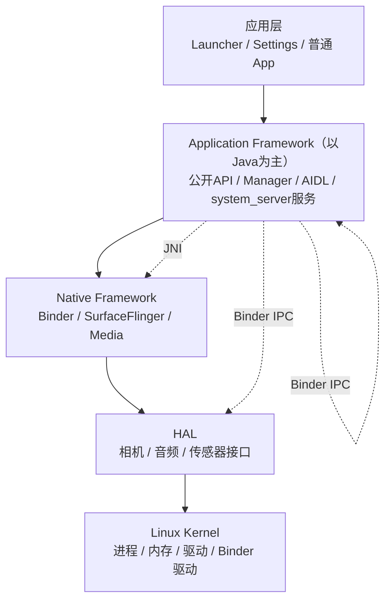
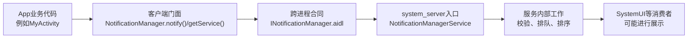
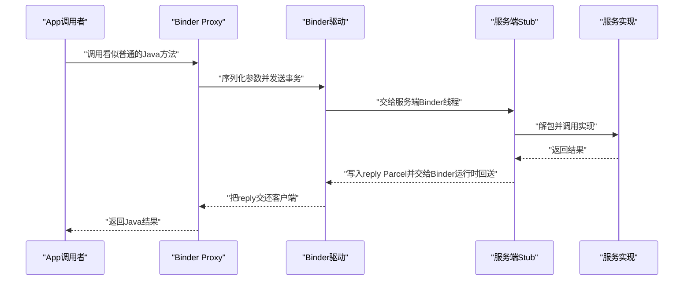
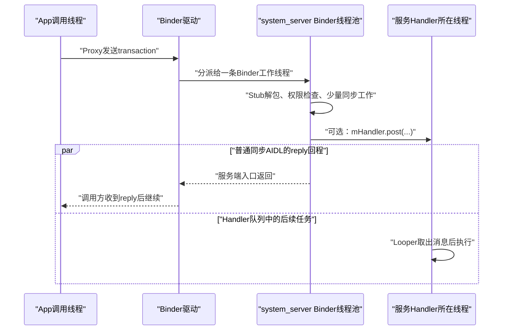
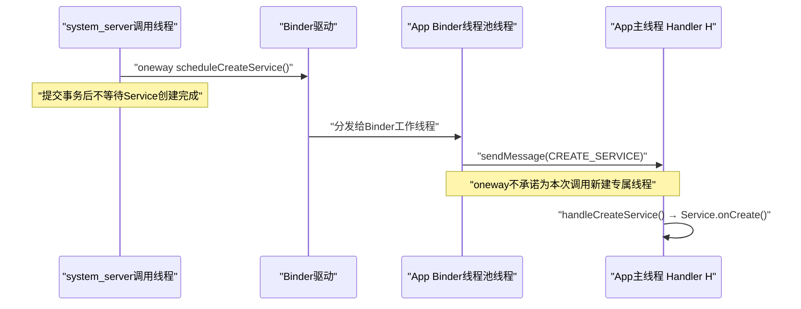
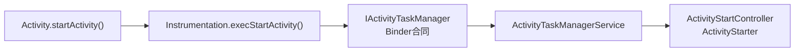
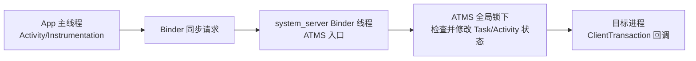

# 01 基础概念介绍

## 本章目标

读完后，你应该能看懂源码讨论中最常见的词，并建立一个重要认识：Android 不是一个“大程序”，而是许多进程通过 Binder 协作形成的系统。

具体来说，你应该能用自己的话回答：

- 为什么 Framework API 只是整个 Application Framework 的入口层；
- Binder 跨进程后，服务端入口、Binder线程和Handler线程是什么关系；
- 同步 AIDL 与 `oneway` 的差别为什么不等于“是否创建新线程”；
- Public API、运行时权限、内部实现和 Android 版本为什么必须分开记录。

> 本系列的源码基线：`android-11.0.0_r48`（Android 11 / API 30）。后文说“源码中”时，默认都指这棵本地源码树，而不是最新 Android 版本。

## 1. AOSP 到底是什么

AOSP（Android Open Source Project）是 Android 开源系统工程。普通 App 工程只编译一个 APK；AOSP 会产出完整系统所需的镜像、程序和库，例如：

- `boot.img`：内核和早期启动环境。
- `system.img`：主要承载平台 Framework、系统库和一部分系统应用；真机还可能有 `system_ext`、`product` 等分区。
- `vendor.img`：主要承载设备厂商实现，包括许多 HAL 服务与配置；不能把“所有 HAL”和“`vendor.img`”简单画等号。
- APK：Settings、SystemUI、Launcher 等系统应用。
- Native 可执行文件：`init`、`servicemanager` 等。

因此读 AOSP 时会同时遇到 Java、Kotlin、C++、C、AIDL、Make、Blueprint（`Android.bp`）和 rc 配置。

## 2. Android 的分层



这张图是“职责地图”，不是每次调用都必须逐层穿过的栈。例如 App 经 Binder 请求 `system_server` 中的 Java 系统服务；Java 系统服务也可能经 Binder 访问独立的 Native/HAL 服务。读源码时要问的是“这一步跨了什么边界”，而不是强行把所有文件塞进五层。

### 应用层

包括普通 App 和 Launcher、Settings、SystemUI 等系统 App。系统 App 仍然是 App，只是可能拥有特殊签名、权限或运行身份。

### Application Framework（以Java为主）

先把最容易混淆的两个词拆开：

- **Java 层的 Framework API 是“入口”**：例如 App 能直接写下 `notificationManager.notify(...)`，它规定方法名、参数、返回值和可见性。
- **Application Framework 是“完成这类系统能力的一整套协作代码”**：除了入口，还包括客户端 Manager、AIDL/Binder 合同、`system_server` 服务、权限校验、状态管理、线程切换和内部策略类。

也就是说，Java API 负责让 App “会提出请求”，但仅靠这个方法声明，系统还不知道调用者能不能发通知、通知放进哪个队列、怎样排序，以及最后通知谁来显示。这些都属于后面的 Framework 实现。因此：

```text
Framework API ⊂ Application Framework
（API 是其中一部分，不是整套实现）
```

“Framework”这个词会随语境变宽或变窄：

- **本系列分层图中的 Application Framework**：专指 App 侧 API/Manager、Binder 合同和以 Java 为主的系统服务；Native Framework 会单独画一层。
- **其他资料单独说 Android Framework**：范围可能更宽，有时还会包含一部分 Native 基础设施，必须结合上下文判断。
- **Framework API**：指 Framework 向某类调用者暴露的接口表面；还要继续区分 Public SDK、`@SystemApi` 与隐藏/内部接口。

所以“Framework API”只是“Framework”的一部分，不能把两个词完全画等号。

再补一个很容易踩的命名坑：源码顶层 `frameworks/` 是目录名，它还包含 `frameworks/native`、`frameworks/av` 等 C/C++ 子系统；目录叫 frameworks，也不代表里面全是 Java API。

可以先把 Framework 想成一座医院：

| 医院类比 | Android 中的角色 | 作用 |
|---|---|---|
| 挂号窗口 | Framework API | 给特定调用者提供入口；可见性和稳定性取决于 API 类别 |
| 导诊单 | Manager 客户端 | 整理参数、找到远端服务、处理异常 |
| 院内工单格式 | AIDL / Parcelable | 规定跨进程请求怎样编码 |
| 科室值班入口 | Binder Stub | 接住并解析请求 |
| 医生与医院规则 | 系统服务及内部类 | 校验权限、读取状态并真正做决策 |

只看到挂号窗口，并不能看到医生怎样诊断；同理，只读 `NotificationManager`，通常看不到通知排序、渠道校验和 SystemUI 分发的完整实现。

#### 用一次真实通知调用理解 Framework

Android 11 中，App 调用 `NotificationManager.notify()` 时，大致会经过：



各角色的源码位置也不同：

| 角色 | Android 11 示例文件 | 此时最该问的问题 |
|---|---|---|
| App 可调用 API | `frameworks/base/core/java/android/app/NotificationManager.java` | 调用者传什么，异常怎样暴露 |
| Binder 合同 | `frameworks/base/core/java/android/app/INotificationManager.aidl` | 参数怎样跨进程，方法是否 `oneway` |
| 服务端入口与实现 | `frameworks/base/services/core/java/com/android/server/notification/NotificationManagerService.java` | 谁校验权限，状态在哪改，是否切线程 |

这里的 `NotificationManager`、`INotificationManager` 和 `NotificationManagerService` 都属于通知 Framework 链路。普通 App 应使用 `NotificationManager` 中被纳入 Public SDK 的接口；这个文件本身也同时包含隐藏或系统接口。

还要注意：并非每个 Framework API 都会跨进程。例如 `View.setAlpha()` 通常只是改变 App 进程中的 View 状态；是否跨 Binder，要继续看方法实现，不能仅凭包名 `android.*` 判断。

#### 再用一句话区分 API 与 Framework

> API 回答“外部可以怎样提出请求”；Framework 实现还要回答“请求送给谁、是否允许、状态怎样改变、失败怎样处理、结果怎样返回”。

因此在 `ActivityManager` 里找不到进程调度算法并不奇怪：它主要是 API/客户端门面，实际决策可能在 `ActivityManagerService`、`ProcessList` 或 `OomAdjuster` 中。

以后看到一个 Manager，可以先连续问三次：

1. 这是对外入口，还是最终实现？
2. 它是否通过 `getService()`、`asInterface()` 或某个 `IxxxService` 继续调用？
3. 服务端拿到请求后，又委托了哪些内部类？

### Native Framework

由 C/C++ 实现，承担 Binder Native 层、图形、音视频等工作。Java 常通过 JNI 或 Binder 与它交互。

### HAL

HAL（Hardware Abstraction Layer）把上层统一接口和不同厂商硬件实现隔开。Framework 不需要知道每种摄像头芯片的寄存器细节。

### Linux Kernel

负责进程调度、虚拟内存、文件系统、网络、电源和设备驱动。Android 使用 Linux 内核，但用户空间的软件栈与普通桌面 Linux 不同。

## 3. Binder 是什么

Binder 是 Android 最重要的跨进程通信机制。先用“打电话”理解：

- Client：打电话的人。
- Proxy：客户端手里的号码和拨号器。
- Binder Driver：负责传递通话数据的网络。
- Stub：服务端接听、拆包并分派请求的人。
- Service：真正处理事情的对象。

普通同步远程调用的去程和回程是：



`oneway` 远程调用没有这条同步 reply 回程；调用者不等服务方法完成。第4节会用真实源码继续解释它与线程的关系。

现阶段先记住：遇到 `IxxxService`、`.aidl`、`Stub`、`Proxy`、`asInterface()` 或 `transact` 时，很可能来到 Binder 边界。

但“很可能”不是“一定”。`Stub.asInterface(binder)` 会先尝试获取同进程本地接口：

- 若实现位于另一个进程，返回远程 Proxy，transaction 才经 Binder 驱动；
- 若实现恰好位于同一进程，可能直接返回本地实现，退化成普通 Java 调用。

同进程直接调用时不会自动切到 Binder 线程池，`oneway` 也不会神奇地把本地直接调用变异步。判断一次调用是否真的跨进程，要确认运行时两端部署在哪些进程，不能只看 AIDL 类型。

### Binder 不负责所有事

Binder 主要解决 IPC 的寻址、传输、调用身份与生命期通知等问题。它不替业务服务决定：

- 调用者是否有某项 Android 权限；
- 工作是否要切到 Handler 线程；
- 一个 Activity 能否启动；
- 共享状态用什么锁保护；
- 业务何时才算真正完成。

这些由服务自身的策略决定。所以读 Binder 链路时要把“传输机制”与“业务规则”分开。

## 4. 必须分清的几个“边界”

### 进程边界

常见进程包括：

| 进程 | 作用 |
|---|---|
| `init` | 用户空间启动和服务管理 |
| `zygote` / `zygote64` | 孵化 Java 应用进程 |
| `system_server` | 承载大部分 Java 系统服务 |
| `surfaceflinger` | 合成屏幕上的图层 |
| App 进程 | 运行应用代码和组件 |

两个 Java 对象如果位于不同进程，就不能共享普通对象引用。看起来像普通方法调用的代码，背后可能已经通过 Binder 跨进程；参数会按 AIDL/Parcel 规则复制或转换，不是把客户端内存地址交给服务端。

还要分清“进程”和“线程”：

#### Binder 请求到达服务端后，到底在哪个线程

假设 App 主线程调用一个远端系统服务，正常远程 Binder 路径可以拆成四步：



可以把它记成两次彼此独立的“换地方”：

```text
Binder：主要解决从进程A到进程B
Handler：主要解决在进程B里从当前线程到目标Looper线程
```

逐步理解：

1. **客户端从哪条线程调用，哪条线程就是调用线程。** 如果 App 在主线程调用同步 Binder，那么等待期间被阻塞的也是 App 主线程。
2. **服务端入口通常先运行在 Binder 线程池。** Binder 驱动把事务分派给接收进程中的 Binder 工作线程；它不是 App 主线程，也通常不是 `system_server` 主线程。Binder 工作线程会被复用，线程池也可能按运行时策略扩展，但这与某个方法是否声明为 `oneway` 是两回事。
3. **服务可以就在 Binder 线程完成工作。** 这时必须自己处理并发和锁，因为多个客户端请求可能同时落到多条 Binder 线程。
4. **服务也可以主动切线程。** 常见写法是 `mHandler.post(...)`、Executor 或专用线程，但这是服务代码的选择，不是 Binder 自动完成的。

`Handler` 也不天然等于主线程。一个 Handler 永远属于创建它时指定的 `Looper`：

- 用主 Looper 创建，它的消息就在主线程执行；
- 用 `HandlerThread.getLooper()` 创建，它就在专用线程执行；
- 只看到变量名 `mHandler`，还不能判断是哪条线程，必须继续找构造位置。

图中把 reply 回程与 Handler 任务画成并行分支，是为了强调：`post()` 以后，两者不是同一项工作。Handler 任务何时真正开始，要看目标 Looper 的队列与调度；不能仅凭 `post()` 推断它一定早于或晚于调用方收到 reply。

还要查看服务端在 `post()` 后是否立即返回。多数“投递后异步处理”的写法会直接返回，但服务也可能借助 latch、Future 等机制等待 Handler 任务给出结果；若 Binder 工作线程仍在等待，普通同步 Binder 的调用方也会继续阻塞。所以“看见 post”只能证明发生了任务投递，不能单独证明服务方法已经返回。

#### NotificationManager 给出的真实线程例子

Android 11 的 `INotificationManager.aidl` 没有把 `enqueueNotificationWithTag()` 标成 `oneway`。在普通 App 与 `system_server` 分处不同进程的实际部署中，这次远程调用使用同步 Binder 语义。服务端入口先在 `system_server` 的 Binder 工作线程执行，`NotificationManagerService` 会在这条线程上做调用者身份、包名、Channel 等前置检查，随后执行：

```java
mHandler.post(new EnqueueNotificationRunnable(userId, r, isAppForeground));
```

生产环境中这个 `mHandler` 在服务 `onStart()` 时用 `Looper.myLooper()` 创建；该启动路径位于 `system_server` 主 Looper。因此这条链是：

```text
App调用线程
    → 同步Binder
    → system_server Binder线程：校验并构造记录
    → mHandler.post
    → system_server主线程：稍后继续入队处理
```

这同时说明两件容易误解的事：

- “请求已经跨进程”只说明它到达另一个地址空间，不说明它已在对方主线程。
- `notify()` 成功同步返回，只能证明服务端入口已经执行到返回点；因为后续工作已经 post，它不证明通知已排序完成，更不证明屏幕已经画出来。

#### 同步 AIDL 与 oneway AIDL 究竟差在哪

| 类型（远程调用） | 调用方是否等服务方法返回 | 能否直接拿普通返回值 | 服务端用什么线程 |
|---|---|---|---|
| 普通同步 AIDL | 是；收到 reply 或异常后才继续 | 可以 | 通常先由 Binder 工作线程处理；服务可再切线程 |
| `oneway` AIDL | 不等待服务方法完成和 reply；发送操作返回后即可继续 | 不能用普通同步返回值表达结果 | 同样由 Binder 工作线程处理；`oneway` 不承诺专属新线程 |

可以把同步调用理解成“打电话并等对方说完这次答复”，把 `oneway` 理解成“把语音留言交给通信系统后先做自己的事”。留言仍由可复用的工作人员处理。接收进程的 Binder 线程池可能按自己的策略调整线程数量，但 `oneway` 的含义绝不是“每次留言都配一名新员工”。

如果 `oneway` 业务最终需要把结果交回调用者，通常要另传一个回调 Binder、发送事件，或让调用者稍后主动查询；不能把服务端普通返回值或异常当作同步答复送回来。

Android 11 的 `IActivityManager.aidl` 中就有：

```aidl
oneway void finishReceiver(in IBinder who, int resultCode,
        in String resultData, in Bundle map,
        boolean abortBroadcast, int flags);
```

调用方不等待 `ActivityManagerService.finishReceiver()` 的执行结果，但服务端仍会在某条 Binder 线程上执行该方法。`oneway` 解决的是“调用方要不要同步等回复”，不是“服务端采用什么并发模型”。

#### 一个完整的“oneway 再切 Handler”真实例子

Android 11 的 `IApplicationThread.aidl` 整个接口都声明为 `oneway`。`system_server` 用它通知 App 进程创建 Service：

```aidl
oneway interface IApplicationThread {
    void scheduleCreateService(IBinder token, in ServiceInfo info,
            in CompatibilityInfo compatInfo, int processState);
}
```

App 进程的 `ActivityThread.ApplicationThread` 收到请求时没有直接创建 Service，而是：

```java
public final void scheduleCreateService(IBinder token,
        ServiceInfo info, CompatibilityInfo compatInfo, int processState) {
    updateProcessState(processState, false);
    CreateServiceData s = new CreateServiceData();
    s.token = token;
    s.info = info;
    s.compatInfo = compatInfo;
    sendMessage(H.CREATE_SERVICE, s);
}
```

随后 `ActivityThread` 主线程的 Handler `H` 处理 `CREATE_SERVICE`，进入 `handleCreateService()`，最后才执行 `service.onCreate()`。



这条链把三件事清楚地分开了：

- `oneway`：决定 `system_server` 不同步等 App 创建完 Service；
- Binder 线程池：负责 App 进程接收远端调用；
- Handler `H`：把真正的组件生命周期切到 App 主线程。

还要补两条边界：

- 发往同一个远端 Binder 节点的异步事务会按顺序逐个分派；前后两次可以由不同的 Binder 工作线程处理，但不会同时执行。不要把 `oneway` 当成无限并行执行器。不同 Binder 节点之间仍可能并发；如果入口又把工作投递到不同队列或执行器，业务真正完成的顺序还要继续分析。
- 如果 `Stub.asInterface()` 最终返回同进程本地对象，就会退化成普通 Java 直接调用；此时既没有驱动传输，也不会自动切到 Binder 线程池。

### Java 与 Native 边界

Java 代码通过 JNI 调用 C/C++。看到 `native` 方法时，应继续搜索对应的 JNI 注册和 Native 实现。

```java
private static native void nativeSomething(long ptr);
```

不要从方法名猜实现位置，可使用：

```bash
rg "nativeSomething" frameworks system
```

### 用户空间与内核边界

普通代码通过系统调用或设备节点进入内核。Binder 的 Java/C++ 封装最终会和 Binder 内核驱动交互。

### API 可见性、运行时权限、实现与版本边界

这句话难懂，通常是因为把四个不同问题合成了一个问题。以后把它拆开问：

1. **API 可见性：普通 App 能否在公开 SDK 中依赖它？**
2. **运行时权限：这个 UID 的这一次调用是否获准？**
3. **实现边界：真正做事的代码在哪里？**
4. **版本边界：你现在讨论的是哪一版代码和哪套兼容规则？**

它们不是一条问题的四种叫法，而是同一次调用要分别核对的四道检查：

```text
公开SDK里能引用
    ≠ 当前调用一定获准
    ≠ API文件就是最终实现位置
    ≠ 不同Android版本的内部做法相同
```

例如 `Activity.startActivity()` 是公开入口，但某次启动仍可能因权限、用户状态或 Intent 解析结果而失败；Android 11 的主要系统侧实现位于 ATMS 一带，而旧版本文章可能画成 AMS。这四句话分别在回答 API 可见性、运行时规则、实现位置和版本差异，不能相互替代。

#### 1）API 可见性：源码里 public，不等于普通 App 可调用

| 类型 | 大致含义 | 普通三方App能否直接按SDK使用 |
|---|---|---|
| Public SDK API | 被纳入公开 SDK 合同 | 通常可以，还要满足权限和版本要求 |
| `@SystemApi` | 提供给特定系统组件或受控调用者 | 通常不可以 |
| `@hide` / 内部 AIDL | 平台内部实现接口，不进入普通公开 SDK | 不可以按公开SDK直接使用 |
| Java `public` 方法 | 只表示 Java 语言访问级别 | 不能据此判断 |

一个很直观的例子在 `NotificationManager.java`：

- `notify(...)` 是普通 App 使用的公开 API；
- `notifyAsUser(...)` 虽然源码声明为 `public`，但带有 `@hide`，不是普通 App 的公开 SDK 合同；
- `INotificationManager.aidl` 是 Framework 内部跨进程合同，普通 App 应通过 `NotificationManager`，而不是自己取得并直接调用这个内部 Binder 接口。

所以“本地源码能搜到”“方法写着 public”“IDE 通过反射能找到”都不等于“官方允许普通 App 调用”。非 SDK 接口还可能受到隐藏 API 限制，并且跨版本很容易变化。

#### 2）运行时权限：能调用，不等于这次会成功

公开 API 解决的是“SDK 是否允许代码依赖这个入口”，不保证任何 App 调用都成功。服务端还可能检查：

- Manifest/runtime permission；
- 调用者 UID、PID、userId 和包名是否匹配；
- 签名权限、AppOps、设备策略或前后台状态；
- 参数、资源归属和 targetSdk 兼容条件。

因此要分两道门：

```text
编译时：这个符号是不是我能依赖的API？
运行时：当前调用者是否满足这一次操作的规则？
```

#### 3）实现边界：API 是入口，不保证自己完成工作

继续用医院类比：API 像挂号窗口，真正的诊断可能在另一个科室。读源码要沿调用链回答：

```text
公开API
    → 客户端Manager或辅助类
    → AIDL Proxy / Binder
    → 服务端Stub入口
    → 服务内部策略类、锁、Handler或Native代码
```

以“启动 Activity”为例，App 仍然调用稳定的 `Activity.startActivity()`，但 Android 11 的关键内部链已经是：



因此旧文章写“AMS 启动 Activity”可能是旧版本的真实结构，也可能只是把系统侧统称为 AMS。阅读 Android 11 `r48` 时，应把这个简写还原成 ATMS、ActivityStartController、ActivityStarter 等实际分工；AMS 仍更偏进程、Service、Broadcast 等管理。

这就是“API相对稳定，但实现可以移动、拆分和重构”。App 入口名称相同，不代表十年前和 Android 11 的内部类、锁和线程完全相同。

#### 4）版本边界：Android 版本不是只有一个数字

| 名称 | 本系列中的例子 | 它回答什么 |
|---|---|---|
| AOSP 源码标签 | `android-11.0.0_r48` | 当前阅读的是哪份平台源码快照 |
| API Level / 设备SDK | Android 11 是 API 30 | 设备提供哪一级公开平台 API |
| `compileSdk` | App 构建配置中的数字 | 编译时能引用哪一级公开 API |
| `targetSdk` | App 主动声明的适配目标 | 系统对该 App 启用哪些新行为或兼容分支 |
| `minSdk` | App 最低支持版本 | 哪些旧设备允许安装 |

例如同一台 Android 11 设备上，两个 App 的 `targetSdk` 不同，Framework 可能走不同兼容分支。因此“我读的是 Android 11 源码”还不够，有时还要问调用 App 的 targetSdk、用户、权限、设备配置和 Feature Flag。

另外，AOSP `r48` 是本系列统一基线，不保证与某台厂商手机逐行相同。厂商补丁、RRO/资源配置、HAL 实现和后续安全补丁都可能改变实际行为。

#### 一套不容易迷路的阅读顺序

以后看到一篇文章或一段调用链，可以按下面顺序核对：

1. 写明源码标签：本系列固定为 `android-11.0.0_r48`。
2. 找公开入口，并确认它究竟是 Public API、`@SystemApi` 还是 `@hide`。
3. 记录权限、UID、AppOps、userId 和 targetSdk 等运行条件。
4. 查看入口是本地完成，还是通过 `IxxxService` 继续走 Binder。
5. 找到 AIDL、Stub 实现和服务所在进程。
6. 继续追服务内部委托类、锁、Handler/Executor 和关键状态。
7. 记录旧文章所用 Android 版本；类已拆分时，以当前源码实际职责为准。

可以把这一节压缩成一句判断口诀：

> API 决定“外面怎样叫我”，权限决定“这次能不能做”，实现决定“里面怎样做事”，版本决定“你说的是哪一套做法”。

## 5. 再分清几类“名字”

Android 源码中同一功能常有多个名字，它们所属维度不同：

| 维度 | 例子 | 用来回答什么 |
|---|---|---|
| Java/C++ 类名 | `ActivityTaskManagerService` | 谁实现逻辑 |
| Binder 服务名 | `activity_task` | 客户端向 ServiceManager 查什么 |
| Linux 进程名 | `system_server` | 代码在哪个地址空间运行 |
| Soong 模块名 | `services` | 构建系统把哪些源码编在一起 |
| Android 包名 | `com.android.systemui` | APK/应用的身份 |

例如 `SystemServer` 是 Java 入口类，`system_server` 是 Linux 进程名，它又承载很多不同 Binder 服务。一个进程不等于一个服务，一个类也不等于一个进程。

## 6. Zygote 和 SystemServer

### Zygote

Zygote 的意思是“受精卵”。它先启动 ART 并预加载常用类和资源，随后作为应用进程的 fork 源头。fork 后的父子进程先通过写时复制（COW）共享页；某个进程写入页时才会获得自己的副本。因此更准确的说法是“能共享未被私有写入的页”，不是所有预加载内存永远共享。

### SystemServer

`system_server` 是由 Zygote fork 出来的特殊进程。AMS、ATMS、PMS、WMS 等大量 Java 系统服务运行在这里。

注意：SystemServer 是启动入口类；`system_server` 是进程名称。日常交流经常混用，但读源码时要分清。

## 7. 一条调用链应记哪些信息

只抄方法名很容易得到一条“看起来对，实际没读懂”的箭头。建议每次至少标五件事：

```text
调用者进程/线程
    → 边界（直接调用 / Binder / JNI / socket / syscall）
    → 接收者进程/线程
    → 关键状态改变
    → 结果如何回到调用者
```

以“App 请求启动 Activity”为例，不要只记 `startActivity()`：



这张图只是导航，08—10 章会根据 Android 11 的实际类继续展开。

## 8. 高频缩写

| 缩写 | 全称 | 主要职责 |
|---|---|---|
| AMS | ActivityManagerService | 进程、Service、Broadcast、ContentProvider 及部分系统状态管理 |
| ATMS | ActivityTaskManagerService | Activity、Task 和栈管理 |
| WMS | WindowManagerService | 窗口管理 |
| PMS | PackageManagerService | 包扫描、安装和信息查询 |
| IMS | InputManagerService | 输入设备和事件管理 |
| SF | SurfaceFlinger | 图层合成 |
| ART | Android Runtime | 执行 DEX、GC、编译等 |
| JNI | Java Native Interface | Java 与 Native 的调用桥梁 |
| HAL | Hardware Abstraction Layer | 硬件抽象层 |

Android 11 已把过去 AMS 中相当一部分 Activity/Task 职责拆到 ATMS。阅读旧文章时要留意版本差异。

## 9. 构建文件的基本认识

AOSP Android 11 主要使用 Soong，模块通常写在 `Android.bp`：

```bp
java_library {
    name: "example-lib",
    srcs: ["src/**/*.java"],
}
```

- `name` 是模块名，不一定等于目录名。
- `srcs` 指定源码。
- 模块还可能声明依赖、安装位置、编译条件。

遇到一个目录时，先看它附近的 `Android.bp`，可以快速知道这里会产出什么模块。

`Android.bp` 回答的是“源码怎样被组织”，不保证模块一定安装到设备；是否进入某个产品还取决于产品配置、依赖和安装属性。本系列在 macOS 上只做静态阅读，不会把“搜到模块”当成“已编译验证”。

## 10. 初学者的三次阅读法

### 第一次：只定边界

在纸上写下参与进程，圈出 Binder、JNI、socket 或 syscall。此时允许跳过细节分支。

### 第二次：只追状态

找关键字段在哪里读、在哪里写、由什么锁保护。系统为什么做决策，通常藏在这些状态而不是入口方法名中。

### 第三次：只查失败和回程

正常路径往往只是一个分支。要看权限被拒、远端死亡、超时、取消和资源回收怎样收口。

## 11. macOS 只读练习

下面命令只搜索源码，不会编译或修改文件：

```bash
cd /Users/ninebot/androidSource

# 客户端 API、AIDL 边界和服务实现分别在哪里？
rg --files frameworks/base | rg '/ActivityManager\.java$|IActivityManager\.aidl$|ActivityManagerService\.java$'

# SystemServer 是入口类，system_server 是进程：先找 Java 入口
rg -n 'public static void main\(String\[\] args\)' \
  frameworks/base/services/java/com/android/server/SystemServer.java

# 一个 native 声明如何向 C/C++ 延伸：先选一个实例
rg -n 'nativePollOnce' frameworks/base/core/java frameworks/base/core/jni
```

建议将结果整理成一张表：

| 节点 | 文件 | 进程 | 边界 | 下一步 |
|---|---|---|---|---|
| Manager/API |  | App | 直接调用 |  |
| AIDL Proxy/Stub |  | App → system_server | Binder |  |
| Service |  | system_server | 服务内调用 |  |

### macOS 练习参考结果

先自己搜索，再用下表核对；重点不是背路径，而是学会把“入口、边界、实现”分开。

| 节点 | 文件 | 典型进程/线程 | 边界 | 下一步 |
|---|---|---|---|---|
| Manager/API | `frameworks/base/core/java/android/app/ActivityManager.java` | App 调用线程 | 先是进程内 Java 调用 | 搜它如何取得 `IActivityManager` |
| AIDL 合同（构建时生成 Proxy/Stub） | `frameworks/base/core/java/android/app/IActivityManager.aidl` | App → `system_server` | 远程时经 Binder | 找 AMS 对接口方法的实现 |
| Service | `frameworks/base/services/core/java/com/android/server/am/ActivityManagerService.java` | 入口常在 `system_server` Binder线程 | Stub 后进入服务实现 | 查权限、锁、Handler和内部协作者 |

SystemServer 的 Java 入口位于：

```text
frameworks/base/services/java/com/android/server/SystemServer.java
```

这里的类名是 `SystemServer`，运行后所在的 Linux 进程名通常写成 `system_server`；一个是 Java 类，一个是进程身份。

`nativePollOnce` 的核对结果是：

```text
Java声明：
frameworks/base/core/java/android/os/MessageQueue.java

JNI实现与注册：
frameworks/base/core/jni/android_os_MessageQueue.cpp
```

Java 侧声明：

```java
private native void nativePollOnce(long ptr, int timeoutMillis);
```

C++ 侧函数名是 `android_os_MessageQueue_nativePollOnce`，二者通过 JNI 注册表中的方法名和签名 `"nativePollOnce", "(JI)V"` 建立对应关系。由此也能看出：Java 方法名和 C++ 函数名不必完全一样，注册表才是可靠证据。

## 12. 易混点复读

1. **“Java 代码”不等于“App 进程”**：`system_server` 中也运行大量 Java 代码。
2. **“Native 代码”不等于“内核”**：C/C++ 的 SurfaceFlinger 仍是用户空间进程。
3. **“调用 AIDL 接口”不必然跨进程**：同进程时可能返回本地对象。
4. **fork 不是拷贝一份永不相关的内存**：初始依赖 COW，后续私有写入才分离。
5. **分层图不是调用栈**：真实链路可以通过 Binder/JNI 跨过多个职责层。

## 本章检查题

1. 为什么不能把 AOSP 当成一个巨大的 App 工程？
2. Zygote 与 system_server 是什么关系？
3. 为什么跨进程调用看起来也能写成 Java 方法调用？
4. JNI 和 Binder 分别跨越什么边界？
5. AMS 与 ATMS 在 Android 11 中大致如何分工？
6. Binder 方法为什么不一定真的经过 Binder 驱动？
7. 为什么“在 Native 层”不等于“在内核中”？
8. 为什么说 Framework API 只是 Framework 的一部分？
9. `oneway` 改变的是哪一端的什么行为？为什么它不等于新建线程？
10. “API可见性、运行时权限、实现与版本边界”分别要防止什么误解？

建议先用自己的话回答，再看下面的参考答案。答案不是要求背诵的标准句式，重点是能说出边界和因果关系。

## 本章检查题参考答案

### 1. 为什么不能把 AOSP 当成一个巨大的 App 工程

AOSP 不只产出一个 APK。它会构建启动程序、系统服务、Native 可执行文件、共享库、HAL 接口与实现、系统 App，以及 boot/system/vendor 等镜像中的内容。

这些产物运行在多个不同进程，通过 Binder、JNI、socket、系统调用和设备节点协作。普通 App 工程主要围绕单个应用及其 APK/AAB，工程目标和运行模型都不同。

### 2. Zygote 与 system_server 是什么关系

Zygote 先初始化 ART，并预加载一批常用类和资源。启动过程中，它 fork 出一个特殊子进程，在子进程中运行 `SystemServer`，这个进程就是 `system_server`。

Zygote 后续还会孵化普通 App 进程。fork 后父子进程最初利用写时复制共享未被私有修改的内存页；某一进程写页后才获得自己的副本。

### 3. 为什么跨进程调用看起来也能写成 Java 方法调用

AIDL 会生成 Proxy/Stub 结构。客户端拿到的远程接口实际是 Proxy，调用 Proxy 的 Java 方法时，它把参数写入 Parcel 并向 Binder 驱动发送 transaction；服务端 Stub 解包后再调用真实实现。

所以表面语法仍是：

```java
service.someMethod(arg);
```

底层却可能已经发生参数序列化、驱动传输，并由服务端 Binder 工作线程执行。普通方法语法只是 AIDL 帮我们隐藏了传输细节。

### 4. JNI 和 Binder 分别跨越什么边界

JNI 主要跨越 Java/ART 与 C/C++ Native 代码的语言和运行时边界，通常仍在同一个 Linux 进程、同一地址空间中。

Binder 主要跨越进程地址空间边界。两端可以都是 Java，也可以都是 Native，或者一端 Java、一端 Native。因此：

```text
JNI：重点问“是否从Java进入C/C++”
Binder：重点问“是否从一个进程进入另一个进程”
```

### 5. AMS 与 ATMS 在 Android 11 中大致如何分工

AMS 更侧重进程、Service、Broadcast、ContentProvider、OOM 调整和大量系统运行状态；ATMS 更侧重 Activity、Task、Activity 栈/显示容器，以及 Activity 启动和切换。

二者都主要运行在 `system_server`，并且会紧密协作。这个分工是帮助定位源码的导航，不代表它们之间不存在共享状态和调用关系。

### 6. Binder 方法为什么不一定真的经过 Binder 驱动

`Stub.asInterface(binder)` 会先查询 Binder 对象是否提供同进程本地接口。如果调用者与实现恰好位于同一进程，它可以直接返回本地实现对象，随后就是普通 Java 方法调用。

只有拿到远程 Proxy 时，transaction 才需要经 Binder 驱动传给另一个进程。因此看到 AIDL 类型只能说明“它具备跨进程能力”，不能单凭类型证明这一次运行时调用真的跨进程。

### 7. 为什么“在Native层”不等于“在内核中”

Native 通常只说明代码由 C/C++ 编写并编译成本机机器码。SurfaceFlinger、audioserver 等 Native 程序仍是用户空间进程，仍受各自虚拟地址空间和权限约束。

只有它们通过系统调用、`ioctl`、设备节点等进入驱动或内核子系统时，才跨越用户空间/内核边界。编程语言和 CPU 当前权限级别不是同一个维度。

### 8. 为什么 Framework API 只是 Framework 的一部分

Framework API 只规定外部调用者“能提出什么请求、参数和返回值是什么”。完整 Application Framework 链路还可能包含 Manager 客户端、AIDL/Parcelable、Binder Stub、`system_server` 服务、权限和 AppOps 检查、内部策略类及 Handler 线程；链路还可能继续跨 JNI 或 Binder 进入单独分层的 Native 子系统。

例如 `NotificationManager.notify()` 是 API 入口，但通知真正的校验、排队和状态管理在 `NotificationManagerService` 等实现中。API 像挂号窗口，不是整家医院。

### 9. oneway 改变的是什么，为什么不等于新建线程

`oneway` 改变的是远程调用方的等待方式：调用方把事务交给 Binder 后，不同步等待服务端方法完成，也不能靠普通返回值同步取得结果。

服务端仍由 Binder 工作线程接收事务，并且还可能再 post 到某个 Handler。接收进程的 Binder 线程池可能按运行时策略扩展，但 `oneway` 不承诺、也不要求为每次调用创建专属线程；“是否等待回复”和“服务端如何安排线程”是两套独立决策。

### 10. API 可见性、运行时权限、实现与版本边界分别防止什么误解

- **API可见性**防止把“源码里能搜到或写着 public”误当成“普通 App 可以稳定依赖”。要继续区分 Public SDK、`@SystemApi` 与 `@hide`。
- **运行时权限**防止把“能编译调用”误当成“这次操作一定获准”。还要检查 permission、UID、AppOps、userId、设备策略和调用状态。
- **实现边界**防止把 Manager/API 门面误当成最终决策位置。要继续追 AIDL、服务端 Stub、内部类、锁和线程。
- **版本边界**防止把旧文章、新版源码和当前 `android-11.0.0_r48` 混在一起。公开入口可能没变，但内部职责已经迁移或拆分；targetSdk 等兼容条件也可能让同一系统走不同分支。

如果这10题能用自己的话解释清楚，就可以进入下一章；不需要逐字背答案。
