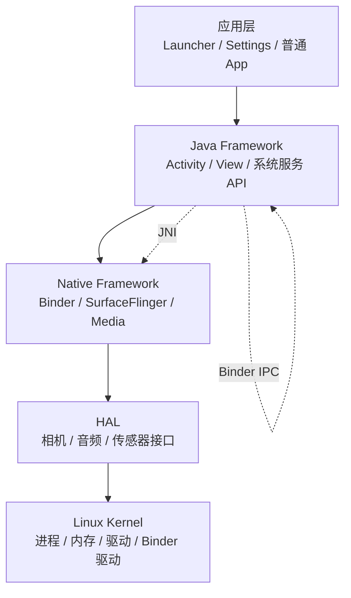
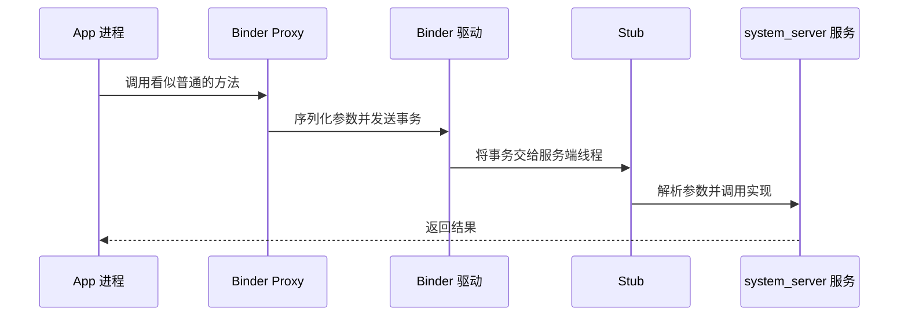

# 01 基础概念介绍

## 本章目标

读完后，你应该能看懂源码讨论中最常见的词，并建立一个重要认识：Android 不是一个“大程序”，而是许多进程通过 Binder 协作形成的系统。

## 1. AOSP 到底是什么

AOSP（Android Open Source Project）是 Android 开源系统工程。普通 App 工程只编译一个 APK；AOSP 会产出完整系统所需的镜像、程序和库，例如：

- `boot.img`：内核和早期启动环境。
- `system.img`：Framework、系统库和系统应用。
- `vendor.img`：设备厂商实现，尤其是 HAL。
- APK：Settings、SystemUI、Launcher 等系统应用。
- Native 可执行文件：`init`、`servicemanager` 等。

因此读 AOSP 时会同时遇到 Java、Kotlin、C++、C、AIDL、Make、Blueprint（`Android.bp`）和 rc 配置。

## 2. Android 的分层



这张图是理解模块责任的地图，但真实调用不一定严格逐层向下。例如 App 经 Binder 直接请求 `system_server` 中的 Java 系统服务。

### 应用层

包括普通 App 和 Launcher、Settings、SystemUI 等系统 App。系统 App 仍然是 App，只是可能拥有特殊签名、权限或运行身份。

### Java Framework

一部分是提供给 App 使用的 API，例如 `Activity`、`NotificationManager`；另一部分是运行在 `system_server` 中的实现，例如 ActivityTaskManagerService（ATMS）。

常见模式是：

```text
App 中的 Manager/API
    → Binder 代理
    → system_server 中的 Service
```

### Native Framework

由 C/C++ 实现，承担 Binder Native 层、图形、音视频等工作。Java 常通过 JNI 或 Binder 与它交互。

### HAL

HAL（Hardware Abstraction Layer）把上层统一接口和不同厂商硬件实现隔开。Framework 不需要知道每种摄像头芯片的寄存器细节。

### Linux Kernel

负责进程调度、虚拟内存、文件系统、网络、电源和设备驱动。Android 使用 Linux 内核，但用户空间的软件栈与普通桌面 Linux 不同。

## 3. 必须分清的几个“边界”

### 进程边界

常见进程包括：

| 进程 | 作用 |
|---|---|
| `init` | 用户空间启动和服务管理 |
| `zygote` / `zygote64` | 孵化 Java 应用进程 |
| `system_server` | 承载大部分 Java 系统服务 |
| `surfaceflinger` | 合成屏幕上的图层 |
| App 进程 | 运行应用代码和组件 |

两个 Java 对象如果位于不同进程，就不能直接调用。看起来像普通方法调用的代码，背后可能已经通过 Binder 跨进程。

### Java 与 Native 边界

Java 代码通过 JNI 调用 C/C++。看到 `native` 方法时，应继续搜索对应的 JNI 注册和 Native 实现。

```java
private static native void nativeSomething(long ptr);
```

不要从方法名猜实现位置，可使用：

```bash
rg "nativeSomething" frameworks system
```

### 用户空间与内核边界

普通代码通过系统调用或设备节点进入内核。Binder 的 Java/C++ 封装最终会和 Binder 内核驱动交互。

## 4. Binder 是什么

Binder 是 Android 最重要的跨进程通信机制。先用“打电话”理解：

- Client：打电话的人。
- Proxy：客户端手里的号码和拨号器。
- Binder Driver：负责传递通话数据的网络。
- Stub：服务端接听并拆解请求的人。
- Service：真正处理事情的对象。



现阶段只需记住：遇到 `IxxxService`、`.aidl`、`Stub`、`asInterface()` 时，很可能来到了跨进程边界。

## 5. Zygote 和 SystemServer

### Zygote

Zygote 的意思是“受精卵”。它先启动虚拟机并预加载常用类和资源，随后通过 `fork()` 创建应用进程。子进程可以共享大量只读内存，启动也更快。

### SystemServer

`system_server` 是由 Zygote fork 出来的特殊进程。AMS、ATMS、PMS、WMS 等大量 Java 系统服务运行在这里。

注意：SystemServer 是启动入口类；`system_server` 是进程名称。日常交流经常混用，但读源码时要分清。

## 6. 高频缩写

| 缩写 | 全称 | 主要职责 |
|---|---|---|
| AMS | ActivityManagerService | 进程、组件和系统状态管理 |
| ATMS | ActivityTaskManagerService | Activity、Task 和栈管理 |
| WMS | WindowManagerService | 窗口管理 |
| PMS | PackageManagerService | 包扫描、安装和信息查询 |
| IMS | InputManagerService | 输入设备和事件管理 |
| SF | SurfaceFlinger | 图层合成 |
| ART | Android Runtime | 执行 DEX、GC、编译等 |
| JNI | Java Native Interface | Java 与 Native 的调用桥梁 |
| HAL | Hardware Abstraction Layer | 硬件抽象层 |

Android 11 已把过去 AMS 中相当一部分 Activity/Task 职责拆到 ATMS。阅读旧文章时要留意版本差异。

## 7. 构建文件的基本认识

AOSP Android 11 主要使用 Soong，模块通常写在 `Android.bp`：

```bp
java_library {
    name: "example-lib",
    srcs: ["src/**/*.java"],
}
```

- `name` 是模块名，不一定等于目录名。
- `srcs` 指定源码。
- 模块还可能声明依赖、安装位置、编译条件。

遇到一个目录时，先看它附近的 `Android.bp`，可以快速知道这里会产出什么模块。

## 本章检查题

1. 为什么不能把 AOSP 当成一个巨大的 App 工程？
2. Zygote 与 system_server 是什么关系？
3. 为什么跨进程调用看起来也能写成 Java 方法调用？
4. JNI 和 Binder 分别跨越什么边界？
5. AMS 与 ATMS 在 Android 11 中大致如何分工？

如果能用自己的话回答，不要求背标准表述，就可以进入下一章。

