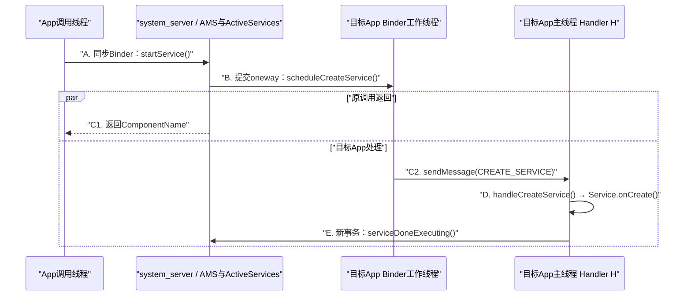
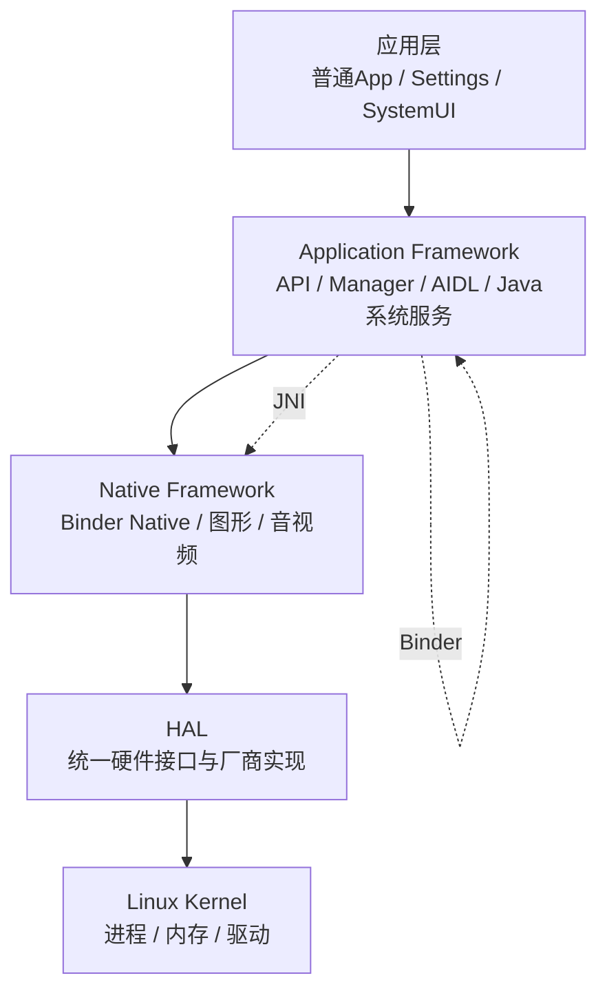

# 01 基础概念介绍：用一次 Service 启动看懂 Android

> 源码基线：Android 11 / API 30 / `android-11.0.0_r48`。本章只在 macOS 上阅读源码，不编译、不刷机。

## 先给结论

这一章只解决一个核心问题：**当 App 调用 `startService()` 时，这个看似普通的 Java 方法，为什么会跨进程、换线程，而且方法返回时 `Service.onCreate()` 可能还没执行完？**

先记住六句话：

1. Framework API 是入口，不是完整 Framework；真正工作还可能在 Binder 服务、内部状态机和 App 运行时中完成。
2. Binder 主要解决跨进程传递请求；请求进入服务端后，通常先由 Binder 工作线程接住，不会自动进入主线程。
3. 服务主动切线程，是为了把工作交给真正拥有这项工作的线程，而不是“让 Binder 自动异步”。
4. `oneway` 只取消调用方对同步 reply 的等待；它不会创建新线程，也不会让服务端工作消失。
5. `oneway` 原事务没有返回值。若需要结果，只能通过另一笔回调、完成通知或后续查询得到。
6. 所谓“边界”，就是跨过去以后某条规则发生了变化。读源码时要分别标记版本、角色、进程、线程、语言和用户/内核空间。

如果这六句话现在还有些抽象，不必背。下面只沿一条 Service 启动链，把它们逐个落到真实源码。

## 这章学了有什么用

以后遇到下面这些问题，你会知道应该继续追哪一层，而不是停在 API 名字上猜：

- `startService()` 已返回，为什么 `Service.onCreate()` 还没打印日志？
- Binder 已跨进程，代码现在是在 `system_server` 主线程吗？
- 为什么 Binder 入口还要 `sendMessage()`？
- `oneway` 不等待返回，那系统如何知道 Service 已创建完？
- 一篇旧文章说逻辑在 AMS，本地 Android 11 源码却出现 ActiveServices，谁才对？

本章的最终产物不是背出一串类名，而是会给调用链的每个节点贴上“它在哪个版本、进程和线程”的标签。

## 1. 从一个真实困惑开始

假设 App 中执行：

```java
ComponentName component = context.startService(intent);
Log.d(TAG, "startService returned: " + component);
```

很多人的第一反应是：第二行日志出现时，目标 Service 应该已经执行完 `onCreate()`。这个推断并不成立。

为突出关键路径，先假设目标 App 进程已经存在，而且这个 Service 实例尚未创建。若进程不存在，中间还会增加 Zygote fork、进程 attach 和 `bindApplication`；若 Service 已经在运行，再次启动主要会走 `scheduleServiceArgs()` 和 `onStartCommand()`，不会重复执行 `onCreate()`。这些分支都不改变“`startService()` 返回只代表当前系统端请求阶段完成”的结论。

Android 11 中的核心链路是：



图中的两个并行分支没有固定完成顺序：`onCreate()` 可能早于，也可能晚于原 `startService()` 返回。能确定的是 AMS 不会为了等 `onCreate()` 完成而扣住原调用。

这条链里同时存在：

- App → `system_server` 的同步 Binder 调用；
- `system_server` → App 的 oneway Binder 调用；
- App Binder 工作线程 → App 主线程的 Handler 消息；
- App → `system_server` 的另一笔完成通知。

所以，不能给整条链笼统贴上“同步”或“异步”的标签。必须逐段判断。

## 2. Framework 为什么不只等于 Java API

### 先说它解决什么问题

如果把 Framework 当成 `Context.startService()` 这个 Java 方法，调试时很快就会走到死胡同：这个方法只负责接收参数并把请求继续交出去，它既不选择目标进程，也不直接创建 Service。

可以把整套 Framework 想成一个跨楼办事系统：

| 办事系统中的角色 | Android Service 启动链 | 负责什么 |
|---|---|---|
| 对外窗口 | `Context.startService()` | 给 App 一个受支持的入口 |
| 窗口工作人员 | `ContextImpl.startServiceCommon()` | 检查并整理参数，取得远端服务 |
| 跨楼申请单格式 | `IActivityManager.aidl` | 规定请求怎样跨进程传输 |
| 审批部门 | AMS / `ActiveServices` | 检查规则、记录状态、选择或启动进程 |
| 目标楼的派工单 | `IApplicationThread.aidl` | 通知目标 App 创建组件 |
| 真正执行者 | `ActivityThread` | 在 App 主线程创建 Service 并调用生命周期 |

因此：

```text
Framework API = 外部怎样提出请求
Framework实现 = 请求交给谁、能不能做、状态怎样变、何时完成、失败怎样收尾
```

`Context.startService()` 是 Java 层的 Framework API；ContextImpl、AIDL、AMS、ActiveServices 和 ActivityThread 共同构成这项系统能力的实现链。API 是 Framework 的一部分，不是全部。

### 为什么 API 要和实现分开

对 App 来说，稳定入口长期仍可叫 `startService()`；平台内部却可以把职责从一个大类拆到 ActiveServices、Controller 或其他 helper。这样系统可以演进，而普通 App 不必跟着每次内部重构一起改代码。

这也告诉我们一种阅读方法：在 Manager 或 Context API 中找不到最终逻辑时，不要认为“源码缺了”，而要继续找它调用的 `IxxxService` 和服务端实现。

## 3. Binder：先解决进程之间不能直接调用的问题

### 为什么需要 Binder

App 与 `system_server` 是两个 Linux 进程。它们有各自的虚拟地址空间，App 不能把一个普通 Java 对象引用直接交给 AMS 使用。

Binder 做的核心工作是：

1. 客户端 Proxy 把参数写入 Parcel；
2. Binder 驱动把事务送到目标进程；
3. 服务端 Stub 解包并调用真实实现；
4. 同步方法再把 reply 送回客户端。

`IActivityManager.aidl` 中的 `startService()` 没有 `oneway`：

```aidl
ComponentName startService(
        in IApplicationThread caller, in Intent service,
        in String resolvedType, boolean requireForeground,
        in String callingPackage, in String callingFeatureId, int userId);
```

因此 App → AMS 这一段是同步远程调用。调用线程会等 AMS 的这次入口处理结束并收到 `ComponentName` 或异常。

但这个返回值只描述当前阶段。正常返回表示系统已经处理了启动请求，不表示目标进程主线程已经完成 `Service.onCreate()`，更不表示 Service 后续业务已经完成。

### AIDL 不一定真的跨进程

`Stub.asInterface()` 会先检查实现是否就在当前进程：

- 远程对象：返回 Proxy，经 Binder 驱动传输；
- 同进程对象：可能直接返回本地实现，退化成普通 Java 调用。

所以看到 `.aidl`、Stub 或 Proxy，只能说明这套接口支持 IPC。是否真的跨进程，还要确认运行时两端分别在哪个进程。

## 4. 服务为什么还要主动切线程

### 先给结论

Binder 工作线程的职责是**接住远端请求**，但它不一定是**真正应该执行这项业务的线程**。切线程的本质，是把任务交给拥有这项状态或满足这项线程约束的执行者。

这里最容易被“Service”这个词绕晕。在 `scheduleCreateService()` 这笔 Binder 事务里：

- `system_server` 是发起事务的 Binder 客户端；
- App 里的 `ApplicationThread` 是接收事务的 Binder 服务端；
- `android.app.Service` 是稍后才在主线程创建的组件对象。

所以“Binder 服务端主动切线程”指的是 `ApplicationThread` 收到事务后发 Handler 消息，不是已经创建好的 `Service` 对象在给自己换线程。

在 Service 创建链中，App 进程的 Binder 入口是 `ActivityThread.ApplicationThread.scheduleCreateService()`。关键代码只有参数整理和发消息：

```java
public final void scheduleCreateService(...) {
    CreateServiceData s = new CreateServiceData();
    s.token = token;
    s.info = info;
    s.compatInfo = compatInfo;
    sendMessage(H.CREATE_SERVICE, s);
}
```

主线程 Handler `H` 收到消息后才继续：

```java
case CREATE_SERVICE:
    handleCreateService((CreateServiceData) msg.obj);
    break;
```

`handleCreateService()` 中最终执行：

```java
service.onCreate();
```

怎么知道 `H` 确实属于主线程？`ActivityThread.main()` 先准备主 Looper，再在同一线程创建 `ActivityThread`；实例字段 `mH` 也在这次构造过程中创建：

```java
// ActivityThread.main()
Looper.prepareMainLooper();
ActivityThread thread = new ActivityThread();

// ActivityThread实例字段
final H mH = new H();
```

`H` 继承 Handler，创建时绑定当前线程的 Looper，因此这里的 `mH` 绑定主 Looper。Android 组件生命周期由它在 App 主线程分发；Binder 线程只负责接收调度命令，不能直接代替主线程执行 `Service.onCreate()`。

### 常见的四种切线程目的

| 目的 | 为什么需要 | 常见目标 |
|---|---|---|
| 满足线程归属 | 生命周期或某些对象只能由指定线程操作 | App 主线程 Handler |
| 释放共享 Binder 线程 | 慢任务长期占用 Binder 线程会让其他 IPC 排队 | Handler、Executor、工作线程 |
| 串行维护状态 | 多条 Binder 线程可能并发进入，单队列更容易维护先后顺序 | 服务自己的单线程 Handler |
| 隔离耗时工作 | 文件、网络、硬件等待和重计算不适合 Binder 线程，也不适合主线程 | HandlerThread 或线程池 |

切线程不是越多越好：很短、线程安全、需要立即返回的查询，直接在 Binder 工作线程完成可能更简单；重活若被错误地投到主线程，反而会造成卡顿甚至 Watchdog。

### Handler 不等于主线程

Handler 在哪条线程执行，只取决于它绑定的 Looper：

- `Looper.getMainLooper()`：主线程；
- `HandlerThread.getLooper()`：专用工作线程；
- 只看变量名 `mHandler`：无法判断，必须找创建位置。

还要区分两个时刻：

```text
post/sendMessage成功 = 消息进入队列
目标代码执行完成   = Looper取出并执行了消息
```

二者不是一回事。如果接收方在投递消息后立即返回，同步 Binder 调用方只知道“任务已入队”；如果接收方又主动等目标线程执行完，Binder 工作线程和客户端调用线程仍可能一起等待。

## 5. oneway 没有 reply，结果从哪里回来

### 先纠正一句话

“oneway 不阻塞客户端”说得不够精确。准确说法是：

> 正常的远程 oneway 事务不等待接收方方法完成，也没有随原请求返回的同步结果包。

这里的“事务”就是一次 Binder 请求；“同步结果包”在源码中常叫 reply。oneway 省掉的是等待接收方执行和 reply 的阶段，但参数整理、写入 Parcel 和提交请求仍要花时间，所以它不是“零耗时”。上层代码也可以在发出 oneway 后主动等待另一条回调，因此不能只看一个 AIDL 关键字就断言整段业务永远不等待。

### 原事务真的没有返回值

`IApplicationThread.aidl` 整个接口都声明为 `oneway`：

```aidl
oneway interface IApplicationThread {
    void scheduleCreateService(
            IBinder token, in ServiceInfo info,
            in CompatibilityInfo compatInfo, int processState);
}
```

AIDL 的 oneway 方法必须返回 `void`，也不能通过 `out`/`inout` 参数同步带回结果。服务端抛出的业务异常也不会沿原事务同步交给调用方。

把它继续类比成办事窗口：同步调用是站在窗口等结果单；oneway 是提交申请后离开。若以后需要结果，办事方必须根据你留下的联系方式另发通知，或者你拿申请编号再次查询。**结果不会从已经结束的那次提交动作中突然 return。**

### Service 创建完成是另一笔事务

App 主线程中的 `Service.onCreate()` 正常返回后，会主动调用：

```java
ActivityManager.getService().serviceDoneExecuting(
        data.token, SERVICE_DONE_EXECUTING_ANON, 0, 0);
```

`IActivityManager.aidl` 中它也是 oneway：

```aidl
oneway void serviceDoneExecuting(
        in IBinder token, int type, int startId, int res);
```

这不是 `scheduleCreateService()` 的“迟到返回值”，而是 App → `system_server` 的一笔新事务。`token` 帮助 AMS 找到对应的 ServiceRecord；AMS 随后更新执行计数和状态，并且只在该进程已经没有执行中的 Service 时移除 `SERVICE_TIMEOUT_MSG`。

第二笔事务也可以携带完成阶段需要的数据。App 主线程执行 `onStartCommand()` 得到 `int res` 后，把它放进 `serviceDoneExecuting()`：

```java
int res = s.onStartCommand(data.args, data.flags, data.startId);
ActivityManager.getService().serviceDoneExecuting(
        data.token, SERVICE_DONE_EXECUTING_START, data.startId, res);
```

这里的 `res` 是 `START_STICKY`、`START_NOT_STICKY` 等 Service 重启策略回执，不是返回给最初 `startService()` 调用者的业务数据。因此这里的答案是：

```text
第一次事务：system_server发命令，不等reply
第二次事务：App报告完成，并在需要时携带res
```

其他异步协议也会使用 callback Binder、listener、广播/事件或“提交 requestId 后再查询”。这些都是新通信路径，不是原 oneway 方法的普通返回值。

### oneway 的作用与局限

适合使用 oneway 的场景：发送方只需投递命令或通知，不应该占着原调用栈等待接收方完成；或者协议已经明确设计了另一条完成/结果通道。

不适合把 oneway 当成：

- 自动创建后台线程；
- 让服务端代码自动变快；
- 无限容量任务队列；
- 同步取得返回值或业务异常的办法。

进阶时还要注意：同一远端 Binder 对象收到的 oneway 事务会按顺序分派；不同 Binder 对象和接收方内部再次投递的任务仍可能并发。若接口退化为同进程本地调用，oneway 也不会自动产生远程异步效果。

## 6. “边界”到底应该怎样理解

### 边界就是“过线后规则变了”

边界不是看到一个新类名就画一条线。可以把它理解成**承诺发生变化的位置**：线这边成立的规则，过线后不能直接继续假设成立。

仍以 `startService()` 为例：

- 跨进程前，App 手里是本进程 Java 对象，异常和返回值沿当前调用栈传播；跨进程后，参数要经 Parcel 表达，接收方换成 `system_server` 的线程，还必须考虑目标进程死亡。
- 从 API 走入内部实现前，普通 App 可以依赖公开的参数、返回值和异常合同；走入 AMS/ActiveServices 后，具体类名和拆分方式只是 Android 11 r48 的实现细节，不能当作长期 SDK 承诺。

这两条线都叫边界，却不是同一种边界：前者改变运行环境，后者改变“什么可以被外部长期依赖”。

读一个调用点，可以记录六个坐标：

```text
源码版本 + 角色 + 进程 + 线程 + 语言/运行时 + 用户/内核空间
```

其中前四种常见运行边界是：

| 运行边界 | 跨过后什么变了 | 什么没有必然改变 |
|---|---|---|
| 进程边界 | 地址空间、对象传递、接收线程和失败模型 | 不一定改变语言 |
| 线程边界 | 执行线程、排队顺序、并发与线程约束 | 仍可共享同一进程内存 |
| Java/Native 边界 | 调用约定、对象表示、内存与异常处理 | JNI 通常不自动跨进程或换线程 |
| 用户空间/内核边界 | CPU 权限级别和允许执行的操作 | C/C++ 本身不等于内核 |

API/实现和版本则更像读源码时的两张标签：

- **API/实现标签**：外部可以依赖什么合同，内部代码可以怎样重构；它不一定对应一次运行时跳转。
- **版本标签**：当前结论属于哪一份源码地图；换版本后，同名 API 的内部路线可能已经变化。

### 把六个坐标贴回 Service 链

整张表默认版本都是 `android-11.0.0_r48`：

| 调用点 | 角色 | 进程 | 线程 | 语言 | 空间 |
|---|---|---|---|---|---|
| `Context.startService()` | Public API | App | App 当前调用线程 | Java | 用户空间 |
| `IActivityManager.Proxy` | Binder 客户端代理 | App | 仍是原调用线程 | Java | 用户空间 |
| Binder 驱动传输 | IPC 运输 | App → `system_server` | 驱动唤醒接收线程 | 内核代码 | 内核空间 |
| AMS / ActiveServices 入口 | 系统服务实现 | `system_server` | 接收 `startService()` 的 Binder 工作线程 | Java | 用户空间 |
| `ApplicationThread.scheduleCreateService()` | App 侧 Binder 入口 | 目标 App | Binder 工作线程 | Java | 用户空间 |
| `H.CREATE_SERVICE` | 组件生命周期执行 | 目标 App | App 主线程 | Java | 用户空间 |

从表中能直接得到三个结论：

1. App Proxy → AMS：跨了进程，也改变了接收线程。
2. App Binder 入口 → Handler `H`：只在同一 App 进程内换线程，没有再次跨进程。
3. API → ActiveServices：描述的是源码角色从入口走向实现，不等于每一步都跨物理空间。

以后看到一条箭头，问四件事即可：两边是谁、用什么机制过线、哪条规则变了、结果或失败怎样回来。

### API、权限、实现和版本为什么必须分开

这四项不是同一个问题：

| 问题 | 在 Service 启动例子中问什么 | 它不能证明什么 |
|---|---|---|
| API 可见性 | 普通 App 能否在公开 SDK 中使用 `startService()` | 不能证明这次调用会成功 |
| 运行时规则 | 调用 UID、组件 exported/permission、后台状态、user 是否满足要求 | 不能证明实现就在 Context.java |
| 实现位置 | ContextImpl 后面进入 AMS、ActiveServices、ActivityThread 哪些代码 | 不能证明其他 Android 版本完全相同 |
| 版本范围 | 当前结论是否属于 Android 11 r48、哪个 targetSdk/配置分支 | 不能代表所有厂商系统和新版本 |

### 源码中写着 public，也未必是 Public SDK

还要区分：

| 类型 | 普通三方 App 的含义 |
|---|---|
| Public SDK API | 可以按公开 SDK 合同依赖，仍需满足权限和运行条件 |
| `@SystemApi` | 只面向特定系统组件或受控调用者 |
| `@hide` / 内部 AIDL | 平台内部接口，不是普通 App 的公开合同 |
| Java `public` 方法 | 只表示 Java 访问级别，不能单独证明 SDK 可见性 |

因此，“能编译引用”“这次运行获准”“真正实现在哪”“别的版本也这样”是四个必须分别验证的结论。

## 7. 这条链在整个 AOSP 中处于什么位置

AOSP 不是一个巨大的 App 工程。它会构建系统镜像、Native 程序、共享库、系统服务、HAL 接口和系统 App。读源码时会同时遇到 Java、C++、C、AIDL、`Android.bp` 和 rc 配置。

可以先用下面这张职责图定位：



这是一张职责地图，不是每次调用都必须逐层通过的固定调用栈。本章的 Service 启动主链大部分发生在应用层与 Java Framework，并通过 Binder 在 App 和 `system_server` 之间往返。

与本章调用链直接相关的三个名词先记住用途即可：

| 名词 | 现在先记什么 |
|---|---|
| Zygote | 初始化 ART、预加载常用内容，并 fork App 与 `system_server` 等进程 |
| SystemServer | `system_server` 进程中的 Java 启动入口类 |
| `system_server` | 承载 AMS、ATMS、PMS、WMS 等大量 Java 系统服务的进程 |

Native Framework、HAL 和内核会在目录与专项章节展开。本章只需注意：一个进程可以承载许多 Binder 服务；一个类名也不等于一个进程名。

## 8. 用本地源码验证，而不是相信本文

下面命令只读取源码：

```bash
cd /Users/ninebot/androidSource

# 一次搜索串起API、AIDL、系统端调度、App生命周期与完成通知
rg -n 'ComponentName startService|startServiceCommon|oneway interface IApplicationThread|scheduleCreateService|case CREATE_SERVICE|service\.onCreate|serviceDoneExecuting' \
  frameworks/base/core/java/android/content/Context.java \
  frameworks/base/core/java/android/app/ContextImpl.java \
  frameworks/base/core/java/android/app/IActivityManager.aidl \
  frameworks/base/core/java/android/app/IApplicationThread.aidl \
  frameworks/base/services/core/java/com/android/server/am/ActiveServices.java \
  frameworks/base/core/java/android/app/ActivityThread.java
```

### 验证时不要只抄行号

请自己画一张六列小表，记录每一步的：

```text
角色 | 进程 | 线程 | 跨界方式 | 当前完成点 | 下一步
```

至少回答：

1. 哪个 AIDL 方法是同步的，哪个接口整体是 oneway？
2. `scheduleCreateService()` 为什么没有直接调用 `service.onCreate()`？
3. `serviceDoneExecuting()` 是哪一方发起的新事务？
4. `startService()` 返回、消息入队、`onCreate()` 执行、完成通知到达，是不是同一个完成点？

能用源码回答这四问，才算真正读懂本章。

## 9. 最容易翻车的理解

1. **“Framework 就是 Java API。”** API 只是入口，系统服务和内部状态机才负责大量决策。
2. **“跨 Binder 就到了服务端主线程。”** 远程入口通常先由 Binder 工作线程处理。
3. **“Handler 就是主线程。”** Handler 属于哪个 Looper，任务就在哪条线程执行。
4. **“post 成功就是业务完成。”** post 只表示入队。
5. **“oneway 会创建新线程。”** 它只改变是否等待原事务 reply。
6. **“oneway 的结果稍后从原方法 return。”** 原事务没有 reply，结果必须走新通道。
7. **“AIDL 一定跨进程。”** 同进程本地接口可能退化为普通调用。
8. **“startService 返回说明 onCreate 已完成。”** 返回只对应 App → AMS 的当前阶段。

## 10. 读完马上能做的事

不要继续背新缩写。现在打开 `ContextImpl.startServiceCommon()`，沿着上面的搜索命令追到 `serviceDoneExecuting()`，只画一条包含六个节点的调用链，并在每条箭头旁标出：

```text
直接调用 / 同步Binder / oneway Binder / Handler消息
```

如果你能解释“为什么原 `startService()` 已返回，`Service.onCreate()` 却还可能没执行”，第一章的核心目标就完成了。

## 本章检查题

1. Framework API 与 Framework 实现分别回答什么问题？
2. 为什么 App 不能把普通 Java 对象引用直接交给 `system_server`？
3. Binder 请求到达服务端后，为什么不等于已经在主线程？
4. 服务主动切线程通常解决哪四类问题？
5. `oneway` 去掉了哪条等待关系？为什么它不等于新建线程？
6. oneway 原事务没有 reply，需要结果时有哪些办法？
7. `scheduleCreateService()` 与 `serviceDoneExecuting()` 是一笔事务的去程和回程吗？
8. “边界”最实用的判断方法是什么？
9. API 可见性、运行时规则、实现位置和版本范围为什么不能互相替代？

## 参考答案

### 1. API 与实现

API 规定外部怎样提出请求；实现负责校验、调度、状态变化、完成和失败处理。`Context.startService()` 是入口，AMS、ActiveServices、IApplicationThread 和 ActivityThread 等共同完成系统能力。

### 2. 为什么需要 IPC

App 与 `system_server` 拥有不同虚拟地址空间，普通对象引用只在本进程有意义。Binder 通过 Proxy、Parcel、驱动和 Stub 传输可序列化数据与 Binder 对象句柄。

### 3. 进程不等于线程

跨进程只表示地址空间改变。远程事务通常先落到接收进程的 Binder 工作线程；是否再到主线程，要看服务是否显式 post/sendMessage，以及 Handler 绑定哪个 Looper。

### 4. 为什么切线程

常见目的包括满足线程归属、释放共享 Binder 工作线程、把并发状态修改串行化、把耗时任务隔离到专用线程。具体选择必须看任务性质，不能一律切主线程。

### 5. oneway 改变什么

正常远程调用中，oneway 让调用者不等待服务方法完成和同步 reply。服务端仍由 Binder 工作线程接收事务，并不会因此为每次调用创建专属线程。

### 6. 结果怎样回来

原 oneway transaction 没有普通返回值。若需要结果，可以设计 callback Binder、listener/事件、反向完成通知，或保存 requestId 后查询；上层也可以主动等待这些新通道，但那是额外等待，不是原事务 reply。

### 7. 两笔独立事务

不是。`scheduleCreateService()` 是 system_server → App 的调度命令；`serviceDoneExecuting()` 是 App 完成生命周期后新发起的 App → system_server 通知。后者不是前者的延迟 return。

### 8. 怎样判断边界

每前进一步，比较版本、角色、进程、线程、语言/运行时、用户/内核空间六个坐标。某项坐标或可依赖规则改变，才说明跨过了相应边界。

### 9. 四个阅读问题

API 可见只说明能否按 SDK 依赖；运行时规则决定这次调用是否获准；实现位置说明真正做事的代码在哪里；版本范围限定结论适用于哪份源码和兼容分支。任一项成立都不能自动证明其余三项。

## 第一、二章延伸答疑

如果你读完本章后继续追问下面三个问题：

1. Android 启动后究竟有多少个进程，这些进程分别做什么？
2. ATMS 管理 Activity，是否持有 App 中真实 Activity 对象的引用？
3. App 进程被强杀时能否收到通知，Android 11 能否事后查询原因？

请继续阅读：[02A-第一二章疑问答疑-系统进程Activity管理与强杀.md](./02A-第一二章疑问答疑-系统进程Activity管理与强杀.md)。这篇答疑会把“进程、系统服务对象、Binder token 和真实 Activity 对象”放进同一张图里对照。
