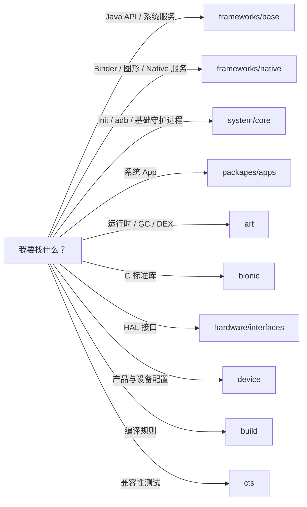

# 02 AOSP 工程目录介绍

## 本章目标

看到一个问题时，能判断第一步应去哪一个顶层目录找代码。这里不追求记住所有目录，只建立导航能力。

## 1. 当前工程信息

本地源码是 Android 11、API 30、`android-11.0.0_r48`。版本定义可在：

```text
/Users/ninebot/androidSource/build/core/version_defaults.mk
```

看到的关键值包括：

```make
PLATFORM_VERSION_LAST_STABLE := 11
PLATFORM_SDK_VERSION := 30
```

## 2. 顶层目录地图



## 3. 最重要的目录

### `frameworks/base`

这是 Framework 学习的主战场，但内部仍然很大：

| 子目录 | 内容 | 例子 |
|---|---|---|
| `core/java/android` | App 可见或内部核心 Java API | `Activity`、`View`、`Binder` |
| `core/java/com/android/internal` | Framework 内部实现 | `ZygoteInit` |
| `services/core/java/com/android/server` | system_server 服务实现 | AMS、ATMS、WMS |
| `services/java/com/android/server` | SystemServer 入口 | `SystemServer.java` |
| `cmds` | Framework 相关命令和 Native 程序 | `app_process` |
| `packages` | Framework 自带包和资源 | SystemUI 等 |

一个常见误区是只在 `core/java/android` 搜索。这里经常只有给客户端用的 API，真正实现可能位于 `services/core`。

### `frameworks/native`

重点包含：

- `libs/binder`：Native Binder 实现。
- `services/surfaceflinger`：SurfaceFlinger。
- `libs/gui`：Surface、BufferQueue 等图形基础设施。
- `services/inputflinger`：Native 输入系统。

### `system/core`

系统早期启动和底层工具的重要目录：

- `init`：init 进程实现。
- `rootdir`：基础 rc 文件。
- `adb`：ADB。
- `libutils`：Native 基础工具库。
- `fs_mgr`：文件系统挂载和分区管理。

### `packages/apps`

存放许多系统应用，例如 Settings、Launcher、Dialer。研究“设置页面如何调用 Framework”时，可以从这里找到业务入口，再向下追系统服务。

### `art` 与 `libcore`

- `art`：Android Runtime、解释执行、JIT/AOT、GC、DEX/OAT。
- `libcore`：Java 核心库在 Android 中的实现。

初学 Framework 时先不要深入 ART；它本身足够成为一条独立学习路线。

### `hardware/interfaces` 与 `hardware/libhardware`

前者主要放 HAL 接口定义，后者包含传统 HAL 相关头文件和实现框架。研究相机、音频、传感器时会进入这里，然后继续追踪厂商实现。

### `device`

每种产品的 BoardConfig、产品包、属性和资源配置。当前源码包含 Google Pixel、Cuttlefish、通用 x86/x86_64 等设备配置。

### `build`

包含构建系统、产品组合、版本定义等。常用入口是：

```bash
source build/envsetup.sh
lunch <product>-<variant>
m <module>
```

当前是 Apple Silicon macOS，源码阅读没有问题；Android 11 完整构建更适合 x86_64 Linux，并需要较多磁盘空间。

## 4. 其他常见目录

| 目录 | 用途 |
|---|---|
| `bootable` | recovery、bootloader 相关代码 |
| `external` | 第三方开源库 |
| `prebuilts` | 预编译工具链和依赖 |
| `development` / `developers` | 开发工具、示例和模板 |
| `cts` | Android 兼容性测试套件 |
| `test` / `platform_testing` | 平台测试基础设施 |
| `sdk` | SDK 相关内容 |
| `kernel` | 内核配置或部分内核相关项目；不代表含完整设备内核树 |

## 5. 如何定位一段源码

### 按类名搜索

```bash
cd /Users/ninebot/androidSource
rg "class ActivityTaskManagerService" frameworks/base
```

### 按方法定义或调用搜索

```bash
rg "startBootstrapServices\(" frameworks/base
rg "startActivityAsUser\(" frameworks/base
```

### 找 AIDL，也就是进程边界

```bash
rg --files frameworks/base | rg "IActivityTaskManager\.aidl$"
```

### 找模块定义

```bash
find frameworks/base -name Android.bp
rg 'name: "framework"' frameworks/base -g Android.bp
```

### 跨 repo 搜索

AOSP 是许多 Git 仓库组成的 repo 工程，顶层本身不一定是一个 Git 仓库。因此顶层执行 `git status` 可能失败；可以使用：

```bash
./.tools/repo status
./.tools/repo grep "目标文本"
```

## 6. 从问题反推目录

| 问题 | 第一站 | 之后可能去 |
|---|---|---|
| Activity 为什么启动失败？ | `frameworks/base/services/.../wm` | Binder、PMS、应用端 ActivityThread |
| APK 怎么安装？ | PMS 所在的 `frameworks/base/services` | installer、system、ART |
| 点击事件怎么到 View？ | `frameworks/base/core` | inputflinger、内核驱动 |
| 画面怎样显示？ | `frameworks/base/core` | `frameworks/native`、HAL |
| 系统服务谁启动的？ | `SystemServer.java` | 具体 Service 实现 |
| 开机服务谁启动的？ | `system/core/init` | `init.rc`、设备 rc |
| 相机怎样访问硬件？ | Framework Camera API | CameraService、Camera HAL |

## 7. 不建议直接导入整个工程

完整 AOSP 规模很大，IDE 全量索引成本很高。初期更推荐：

1. 用 `rg` 找入口和调用关系。
2. 只在编辑器中打开当前链路涉及的目录。
3. 每读到跨进程或 Java/Native 边界就在笔记中标记。
4. 等明确研究专题后，再为局部源码建立 IDE 工程。

## 本章练习

不要求读实现，只找到文件：

1. `SystemServer` 在哪里？
2. `ActivityManagerService` 在哪里？
3. `SurfaceFlinger` 的主目录在哪里？
4. `init.rc` 在哪里？
5. Settings 应用在哪里？

能在两分钟内找到它们，就足以进入源码启动流程。

