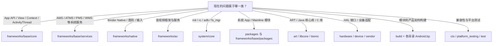
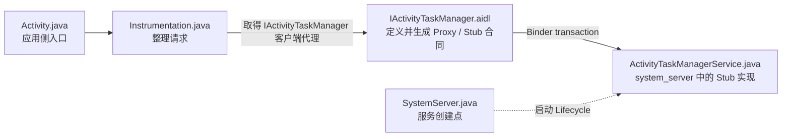

# 02 AOSP 工程目录介绍：不要背目录，要学会从问题找到实现

> 源码基线：Android 11 / API 30 / `android-11.0.0_r48`。本章只在 macOS 上静态阅读本地源码，不要求编译。

## 先给结论：这篇到底解决什么问题

AOSP 顶层有几十个目录；当前工作树用 `rg --files` 可枚举出约 82 万个文件。逐个背目录名既枯燥，也解决不了真正的问题：

> 当你看到“Activity 为什么启动失败”“开机服务是谁拉起的”“画面为什么没有显示”时，第一站应该去哪，找到第一个类后又该往哪里追？

这篇文章给出的答案不是一张死目录表，而是一套导航方法：

1. 先按问题类型选择第一站。
2. 找到代码后，同时记录四个坐标：**源码路径、构建模块、产物/安装位置、运行进程**。
3. 再判断它属于公开 API、IPC 合同，还是服务端实现。
4. 用源码搜索验证路径，不把其他 Android 版本文章里的目录硬套到本地 Android 11。

读完后，你应该能：

- 在两分钟内为一个问题选出合理的首个目录。
- 解释为什么“代码在 `frameworks/base`”不等于“代码运行在 system_server”。
- 从 App 侧 `startActivity()` 一路找到 AIDL 和 system_server 中的 ATMS 实现。
- 在路径发生版本漂移时，用类名、方法名和模块名重新找到代码。

---

## 一个真实痛点：搜到 `Activity.java`，为什么问题还没解决

假设 App 调用了 `startActivity()`，但页面没有成功打开。

如果只知道“Java Framework 在 `frameworks/base`”，你可能搜索到：

```text
frameworks/base/core/java/android/app/Activity.java
```

然后开始阅读一个很长的类。但真正拒绝这次启动的原因，可能发生在 system_server 中的 `ActivityTaskManagerService`：权限不允许、目标 Activity 没解析出来、后台启动受限，或者当前状态不允许启动。

这个例子说明目录学习的意义：

- `Activity.java` 是应用侧入口。
- `IActivityTaskManager.aidl` 是跨进程合同。
- `ActivityTaskManagerService.java` 是 system_server 侧实现。
- `SystemServer.java` 能证明这个服务由谁创建。

只找到一个文件叫“定位”；把这几个角色连起来，才叫“读懂”。本章后半部分会只用这一个例子走完整条链。

---

## 先建立正确心智：AOSP 更像一座城市

可以把 AOSP 想成一座城市，而不是一个普通 App 工程：

- 顶层目录像城区，按历史和职责大致分区。
- 每个 Git 项目像独立地块，由 repo manifest 统一组合。
- `Android.bp` 像施工清单，决定哪些源码组成一个模块。
- JAR、APK、APEX、Native 可执行文件和动态库是建成的设施。
- init、system_server、应用进程等是设施真正投入运行的位置。

类比的重点是：**城区位置只能帮助你找第一站，不能直接推出模块、产物和进程。**

---

## 图一：面对问题时，第一站去哪里

这张图只回答“优先从哪个源码区域开始搜索”，不表示运行时调用顺序。



### 这张图不能告诉你什么

它不能直接告诉你：

- 代码最终编进哪个 JAR 或 APK。
- 代码安装到 system、system_ext、product 还是 vendor。
- 代码运行在 system_server、独立 Native 服务还是应用进程。
- 一个 Java 类是否属于普通 App 可调用的公开 SDK API。

这些问题需要第二张图的四坐标方法。

---

## 图二：找到源码后，还要补齐四个坐标


这四个坐标经常不一一对应：

| 源码例子 | 模块/产物方向 | 运行位置 | 容易产生的误解 |
|---|---|---|---|
| `frameworks/base/services/...` | `services` 等 JAR 模块 | 主要由 system_server 加载 | 看到 Java 文件就以为在 App 进程运行 |
| `frameworks/base/packages/SystemUI` | `SystemUI` APK | 独立的 SystemUI 应用进程 | 位于 `frameworks/base` 就以为是 system_server 内部类 |
| `frameworks/native/services/surfaceflinger` | `surfaceflinger` Native 可执行模块 | 独立 Native 进程 | 名字里有 services 就以为属于 SystemServer |

还要再叠加一个“API 可见性坐标”：同一个目录里可能同时出现公开 API、`@SystemApi`、`@hide` 和纯内部实现，不能只靠路径判断谁能调用。

---

## 当前源码版本先核实，不靠文件夹名字猜

本地版本定义可以从以下文件验证：

```text
build/core/version_defaults.mk
```

当前工作树中 `build/core` 是指向 `build/make/core` 的符号链接。关键值是：

```make
PLATFORM_VERSION_LAST_STABLE := 11
PLATFORM_SDK_VERSION := 30
```

它们证明这是 Android 11 / API 30 平台代码，但不能单独证明每个 Git 项目都处于 `android-11.0.0_r48`。

AOSP 是由 repo 工具管理的多 Git 项目工作区。本地存在 `.repo` 和 repo launcher，可以只读查看 manifest 固定到的修订：

```bash
cd /Users/ninebot/androidSource
./.tools/repo manifest -r
```

为什么要强调这件事？因为同名类在不同 Android 版本中可能搬家、拆分或被模块化。先确认版本，后面的路径判断才有边界。

---

## 第一核心区：`frameworks/base` 不只等于 Java API

`frameworks/base` 同时容纳应用侧 Framework 代码、system_server 服务、资源、系统组件和部分 Native/命令入口。把它简单翻译成“Java API 目录”会漏掉一半以上的关键角色。

### `frameworks/base/core`

什么时候先来这里：

- 找 `Activity`、`Context`、`View`、`Handler`、`ActivityThread` 等应用侧或 Framework 核心类。
- 找 `android.*` API 的源码行为。
- 找大量 Framework Binder 接口的 AIDL 定义。

常用位置：

```text
frameworks/base/core/java/android/
frameworks/base/core/java/com/android/internal/
frameworks/base/core/jni/
frameworks/base/api/
```

最容易踩的坑是把 `core/java/android` 当成“全部公开 API”。例如 `ActivityManager.java` 中既有公开成员，也有大量 `@hide` 成员；`IActivityTaskManager.aidl` 本身还是系统私有接口。

判断 API 边界时，要结合注解、`@hide`、对应 API signature 文件和当前 SDK 级别，例如：

```text
frameworks/base/api/current.txt
frameworks/base/api/system-current.txt
frameworks/base/api/module-lib-current.txt
```

结论：**包名是 `android.*`、源码在 `core/java/android`，仍不自动等于普通 App 可用的公开 API。**

### `frameworks/base/services`

什么时候先来这里：

- 找 system_server 中的系统服务实现。
- 研究进程、Activity/Task、窗口、包管理、电源、通知等系统决策。
- 找系统服务由谁创建、在哪个 boot phase 初始化。

Android 11 最常用的三个入口：

```text
frameworks/base/services/java/com/android/server/SystemServer.java
frameworks/base/services/core/java/com/android/server/am/
frameworks/base/services/core/java/com/android/server/wm/
```

其中：

- `am` 包主要包含 AMS、进程、Service、Broadcast 等职责。
- `wm` 包不仅有 WMS，也包含 ATMS、Activity/Task 和窗口容器相关实现。

这解释了一个常见搜索失败：只因为类名叫 `ActivityTaskManagerService`，就认定它一定在 `am` 目录。Android 11 中它实际位于：

```text
frameworks/base/services/core/java/com/android/server/wm/ActivityTaskManagerService.java
```

### `frameworks/base/packages` 与 `frameworks/base/cmds`

这两个位置能直接证明“Framework 不只是 Java API”：

```text
frameworks/base/packages/SystemUI/
frameworks/base/cmds/app_process/
```

- SystemUI 是系统 APK，拥有自己的组件与进程，不在 system_server 里运行。
- `app_process` 是 Native 入口，可建立 Android Runtime 并进入 Zygote 等 Java 入口。

所以遇到代码时，不要先问“它是不是 Framework”，而要问得更具体：它是应用 API、系统服务、系统 APK，还是 Native 启动入口？

---

## 第二核心区：`frameworks/native` 与 `frameworks/av`

### `frameworks/native`

什么时候先来这里：

- Java 层已经走到 JNI/Native 边界。
- 问题涉及 Native Binder、Surface、BufferQueue、SurfaceFlinger 或输入分发。

常见位置：

| 目录 | 重点 |
|---|---|
| `frameworks/native/libs/binder` | Native Binder 客户端、服务端和进程状态等基础实现 |
| `frameworks/native/libs/gui` | Surface、BufferQueue 等图形基础设施 |
| `frameworks/native/services/surfaceflinger` | SurfaceFlinger 实现与可执行模块 |
| `frameworks/native/services/inputflinger` | Native 输入读取与分发核心 |

不要把 `frameworks/native/services` 与 `frameworks/base/services` 混为一谈。前者大量是 C++ Native 服务；后者主要是 system_server 的 Java 服务实现。

### `frameworks/av`

什么时候先来这里：

- 音频播放、录音、媒体编解码、Camera/Media 服务等问题已经进入 Native 媒体栈。

图形问题优先看 `frameworks/native`，音视频问题往往还要进入 `frameworks/av`。两者都会与 HAL、Binder 和应用 Framework 层连接，目录并不代表它们互相独立。

---

## 启动与底层基础：`system/core`

什么时候先来这里：

- 研究 Android 开机早期、init、rc、属性服务、ADB、文件系统挂载等。
- 日志发生在 Java Runtime 建立之前。

Android 11 中的关键位置：

| 目录 | 作用 | 第一入口示例 |
|---|---|---|
| `system/core/init` | init 进程、rc 解析、action/service 管理 | `main.cpp`、`init.cpp` |
| `system/core/rootdir` | AOSP 基础 rc 文件 | `init.rc`、`init.zygote*.rc` |
| `system/core/fs_mgr` | 挂载、fstab、分区相关基础设施 | 先按具体问题搜索入口 |
| `system/core/adb` | Android 11 本地源码中的 ADB 工程 | `Android.bp` 与各端实现 |
| `system/core/libutils` | Native 基础工具库 | 被许多模块依赖 |

这里也要区分源码路径和设备路径。例如源码树中的：

```text
system/core/rootdir/init.rc
```

在设备构建产物中对应主 rc 入口时，常见路径是：

```text
/system/etc/init/hw/init.rc
```

不要拿设备 shell 中的绝对路径直接在源码树根目录搜索。

---

## 系统应用与模块：不只在 `packages/apps`

### `packages/apps`

这里包含很多系统应用，例如当前源码中的：

```text
packages/apps/Settings/
packages/apps/Launcher3/
```

什么时候先来这里：页面、设置项或 Launcher 行为明显属于系统 App 业务逻辑。常见阅读方式是先找 UI/业务入口，再沿 Binder 或公开 Framework API 向系统服务追。

### `frameworks/base/packages`

SystemUI 等组件位于这里，而不是 `packages/apps`。所以“系统 App 都在 packages/apps”并不成立。

### `packages/modules`

Android 11 已包含一批模块化系统组件，例如 NetworkStack、DnsResolver、IPsec 等。某项职责在新版本里可能从 `frameworks/base` 或 `system` 拆到模块目录，甚至以 APEX/APK 形式交付。

路径漂移时，需要考虑“职责被模块化”这个原因，而不是立刻判断源码缺失。

---

## 运行时与基础库：`art`、`libcore`、`bionic`

| 目录 | 回答的问题 | 初学时的边界 |
|---|---|---|
| `art` | DEX 如何执行、JIT/AOT、GC、类加载和 Runtime 内部怎样工作 | Framework 入门阶段先追到运行时边界即可，不必立刻深入 GC 实现 |
| `libcore` | Java 核心库在 Android 中的实现 | 区分 Java 标准语义与 Android 实现 |
| `bionic` | Android 的 C 标准库、动态链接器等 | Native 崩溃、链接、系统调用封装等问题再深入 |

这三个目录解释的是“代码怎样运行”和“基础库怎样实现”，不是 AMS、WMS 之类的系统策略层。

---

## HAL、设备与产品差异：`hardware`、`device`、`vendor`

### `hardware/interfaces`

Android 11 中可以看到大量 HIDL 接口，也能看到部分 AIDL HAL 演进内容。适合从接口合同、版本目录和默认实现开始理解 Framework/Native 服务怎样访问硬件能力。

不要从“HAL 接口在这里”推导出“厂商硬件实现也一定在这里”。真实设备实现可能位于 vendor 专有仓库，当前纯 AOSP 工作树甚至可能没有对应厂商源码。

### `device`

主要放产品与板级配置，例如 BoardConfig、产品包选择、属性、overlay、fstab 和设备 rc。它回答的是“某个产品怎样把公共平台代码组装起来”。

### `vendor`

这是常见但不保证存在的顶层区域。是否有内容取决于厂商仓库和当前 manifest。目录不存在不能证明 Android 不需要 vendor 层，只能说明当前工作树没有检出相应项目。

---

## 构建与测试：`build`、`Android.bp`、`cts`

### `build`

Android 11 同时能看到 Make 产品配置体系和 Soong/Blueprint 模块体系：

```text
build/make/
build/soong/
```

但模块定义不集中在 `build` 目录。大多数源码目录旁边都有自己的 `Android.bp`。

例如 SurfaceFlinger 的模块定义明确告诉你它是 Native 可执行模块，并关联 rc：

```bp
// frameworks/native/services/surfaceflinger/Android.bp
cc_binary {
    name: "surfaceflinger",
    init_rc: ["surfaceflinger.rc"],
    srcs: [":surfaceflinger_binary_sources"],
}
```

这几行同时提供了三个线索：模块名、入口源码集合和启动 rc。比只知道 C++ 文件路径更接近完整答案。

当前在 Apple Silicon macOS 上不做 Android 11 全量编译。下面的命令只用于识别术语，不作为本系列练习要求：

```bash
source build/envsetup.sh
lunch <product>-<variant>
m <module>
```

### 测试目录

| 目录 | 主要用途 |
|---|---|
| `cts` | Android 兼容性测试套件 |
| `platform_testing` | 平台测试基础设施与测试内容 |
| `test` | 其他平台测试相关项目 |

测试代码常常是理解契约和边界条件的好入口，但不能只凭某个测试用例推断所有产品行为。

---

## 其他顶层目录只需先认识

| 目录 | 先记住什么 |
|---|---|
| `bootable` | recovery 等启动相关项目；Bootloader 实现通常仍与 SoC/设备有关 |
| `external` | AOSP 引入的第三方开源项目，不代表它们都由 Android 自己设计 |
| `prebuilts` | 预编译工具链、SDK 和依赖，适合查“构建使用了哪个现成工具” |
| `development` / `developers` | 开发工具、示例、模板等 |
| `sdk` | SDK 生成与相关内容 |
| `kernel` | 当前 manifest 中的部分内核相关项目/配置；不保证包含某台真机的完整内核源码 |

第一次阅读不用逐个展开。只有问题指向这些职责时，再进入对应目录。

---

## 用一个例子走通目录：`startActivity()` 去了哪里

现在回到开头唯一的例子。

### 问题

App 调用 `Activity.startActivity()` 后，谁在系统侧决定目标 Activity 能不能启动？

### 方案：按“门面 → IPC 合同 → 服务实现 → 创建点”追踪



这张图表达的是调用/创建关系。`SystemServer → ATMS` 是启动关系，不是每次 `startActivity()` 都先重新创建 ATMS，所以使用虚线单独标出。

### 第一步：应用侧公开入口

```java
// frameworks/base/core/java/android/app/Activity.java
public void startActivity(Intent intent, @Nullable Bundle options) {
    // 省略前面的 Autofill 兼容处理
    if (options != null) {
        startActivityForResult(intent, -1, options);
    } else {
        startActivityForResult(intent, -1);
    }
}
```

这里说明 `startActivity()` 会继续进入 `startActivityForResult()` 路径，但还没有看到真正的系统决策。

### 第二步：发现跨进程边界

`Instrumentation` 中出现：

```java
// frameworks/base/core/java/android/app/Instrumentation.java
int result = ActivityTaskManager.getService().startActivity(
        whoThread, who.getBasePackageName(), who.getAttributionTag(), intent,
        intent.resolveTypeIfNeeded(who.getContentResolver()), token,
        target != null ? target.mEmbeddedID : null, requestCode,
        0, null, options);
```

`getService()` 返回的是 `IActivityTaskManager` 接口；在 App 到 system_server 的场景中，实际拿到的是 Binder 客户端代理。继续看定义它的 AIDL：

```text
frameworks/base/core/java/android/app/IActivityTaskManager.aidl
```

这就是重要路标：调用将通过 Binder 离开应用进程。

### 第三步：找服务端实现

不要只搜索同名 Java 类，可以搜索谁继承生成的 `Stub`：

```java
// frameworks/base/services/core/java/com/android/server/wm/
// ActivityTaskManagerService.java
public class ActivityTaskManagerService extends IActivityTaskManager.Stub {
    // 省略具体实现
}
```

这一步把目录从 `frameworks/base/core` 带到了 `frameworks/base/services/core/.../wm`，进程也从 App 侧跨到了 system_server 侧。

### 第四步：证明谁创建 ATMS

在 `SystemServer.java` 中可以找到：

```java
ActivityTaskManagerService atm = mSystemServiceManager.startService(
        ActivityTaskManagerService.Lifecycle.class).getService();
```

现在四个角色完整了：入口、IPC 合同、服务实现、服务创建点。

### 验证：用本地搜索重新走一次

```bash
cd /Users/ninebot/androidSource

rg -n 'void startActivity\(|execStartActivity\(' \
  frameworks/base/core/java/android/app

rg --files frameworks/base | rg '/IActivityTaskManager\.aidl$'

rg -n 'extends IActivityTaskManager\.Stub' \
  frameworks/base/services

rg -n 'ActivityTaskManagerService\.Lifecycle' \
  frameworks/base/services
```

这个例子真正训练的是方法：以后换成通知、窗口、包安装或电源服务，也先找客户端门面，再找 IPC 合同、服务实现和创建/注册点。

---

## 一套可恢复的源码定位流程

### 第一步：把问题写成一句可搜索的话

不要写“研究 Activity”。改成：

```text
谁在 system_server 侧接收 startActivity Binder 请求？
```

问题越具体，搜索范围越容易收紧。

### 第二步：先按文件名和类声明找候选

```bash
rg --files | rg '/ActivityTaskManagerService\.java$'
rg -n 'class ActivityTaskManagerService\b' frameworks packages system
```

### 第三步：找 IPC 或 Java/Native 边界

常见路标：

- `.aidl`、`Stub`、`Proxy`：Binder 边界。
- `native` 方法、JNI 注册：Java/Native 边界。
- socket 读写：进程间协议边界。
- `startService()`、`ServiceManager.addService()`：服务创建或注册线索。

### 第四步：找创建点，而不只找类定义

“知道类在哪里”不等于“知道系统什么时候使用它”。继续搜索：

```bash
rg -n 'ActivityTaskManagerService\.Lifecycle' frameworks/base/services
```

### 第五步：需要判断产物或进程时，再看 `Android.bp` 和 rc

```bash
rg -n 'name: "surfaceflinger"' \
  frameworks/native/services/surfaceflinger -g Android.bp

rg -n 'service surfaceflinger' \
  frameworks/native system device -g '*.rc'
```

### 第六步：在笔记里固定四个坐标

推荐每次记录一行：

```text
ActivityTaskManagerService.java
→ services 模块体系
→ services 相关 JAR
→ system_server 进程
→ IActivityTaskManager 是系统私有 Binder 合同
```

这样下次恢复阅读时，不需要重新猜它属于哪一层。

---

## `rg`、`repo` 和 Git 分别什么时候用

AOSP 顶层不是一个普通的单 Git 仓库，而是 repo 管理的多个 Git 项目集合。

| 工具 | 最适合回答的问题 |
|---|---|
| `rg` | 当前工作树里哪个文件包含某个类名、方法名或字符串？ |
| `rg --files` | 某个文件名现在位于哪里？ |
| `repo list/status/manifest` | 当前有哪些 Git 项目、哪些项目有修改、manifest 固定了哪些修订？ |
| 在具体子项目中使用 `git` | 这个项目的提交、分支、diff 是什么？ |

本系列优先用 `rg` 做源码导航，因为速度快，也能看到未被 Git 跟踪的本地文件。

只读示例：

```bash
./.tools/repo list
./.tools/repo status
./.tools/repo manifest -r
```

直接在 AOSP 顶层运行 `git status` 失败，并不表示源码损坏；先确认你要查看的是哪个子项目。

---

## 其他版本路径不一致时怎么办

假设文章说 `ConnectivityService.java` 在某路径，但本地找不到，不要立即判断源码缺失。

按下面顺序验证：

```bash
# 1. 忽略旧路径，按文件名找
rg --files | rg '/ConnectivityService\.java$'

# 2. 文件可能重命名，按类声明找
rg -n 'class ConnectivityService\b' frameworks packages system

# 3. 职责可能被拆分，按稳定方法或关键字段找
rg -n 'registerNetworkAgent\(' frameworks packages system

# 4. 找到候选模块后检查构建定义
rg -n 'name: ".*connectivity.*"' frameworks packages system -g Android.bp
```

常见原因包括：

- 类改名或职责拆到 helper/controller。
- 代码从 `frameworks/base` 移入 `packages/modules`。
- 设备/厂商实现位于当前 manifest 没有检出的仓库。
- 参考文章基于不同 Android 版本。

正确做法是“先搜本地证据，再修改自己的路径地图”。

---

## 常见翻车点

### 误区一：`frameworks/base/core/java/android` 里的类都是公开 API

不是。这里同时存在公开、系统、隐藏和内部成员；必须结合 API signature、注解、`@hide` 和 SDK 版本判断。

### 误区二：文件在 `frameworks/base`，就运行在 system_server

不是。SystemUI 是独立 APK，应用侧 Framework 类运行在 App 进程，system_server 服务主要在 `frameworks/base/services`。

### 误区三：找到服务实现类，就完成了调用链

还缺 IPC 合同、服务创建/注册点、调用方，以及必要时的模块和运行进程。

### 误区四：同一个顶层目录里的代码一定编进同一个产物

不成立。一个目录树下可以定义多个 Java 库、APK、Native 库和可执行模块，`Android.bp` 才是重要证据。

### 误区五：系统 App 全在 `packages/apps`

不成立。SystemUI 在 `frameworks/base/packages`，模块化组件还可能在 `packages/modules`。

### 误区六：旧版本路径不存在，说明本地源码不完整

先排查重命名、职责拆分、Mainline 模块化和 manifest 差异，再下结论。

---

## API、实现与版本边界

| 看到的内容 | 应该怎样理解 |
|---|---|
| SDK 文档可用的 `android.*` API | 应用开发者可依赖，但仍要检查 API level |
| `@SystemApi`、`@hide`、`com.android.internal.*` | 受限或内部接口，普通 App 不能当作稳定公开 API 使用 |
| `IActivityTaskManager.aidl`、ATMS、SystemServer | 平台内部 IPC 与实现，适合源码分析，不是 App 直接依赖的 API |
| 顶层目录位置 | 历史与职责导航线索，不是稳定 API 合同 |
| Android 11 本地路径 | 只对当前基线直接成立；新版本可能模块化、重命名或迁移 |
| device/vendor 内容 | 产品相关，AOSP 通用结论不能覆盖每台商业设备 |

目录学习的正确目标不是背出“Android 永远放在哪里”，而是掌握在当前版本中找到证据的方法。

---

## 读完马上能用的 takeaway

以后每定位一个类，至少回答下面六个问题：

1. 我想解决的具体问题是什么？
2. 这个目录为什么是第一站？
3. 当前文件是客户端门面、IPC 合同，还是服务端实现？
4. 哪个 `Android.bp` 模块收集它？
5. 它最终运行在哪个进程？
6. 这个结论是否只适用于当前 Android 11 基线？

如果只能回答“文件在 frameworks/base”，说明还没有真正定位完成。

---

## 检查题与答案

### 1. `SystemServer` 的入口在哪里，运行在哪个进程？

**答案：**入口是 `frameworks/base/services/java/com/android/server/SystemServer.java`，运行在 Zygote fork 出的 `system_server` 进程中。

### 2. Android 11 中 AMS 和 ATMS 为什么要去两个包找？

**答案：**AMS 位于 `frameworks/base/services/core/java/com/android/server/am/`；ATMS 位于 `.../com/android/server/wm/`。Activity/Task 与窗口容器职责在 Android 11 中紧密结合，不能只根据历史名称猜目录。

### 3. SurfaceFlinger 的源码第一站、模块类型和运行形态是什么？

**答案：**第一站是 `frameworks/native/services/surfaceflinger/`；`Android.bp` 定义名为 `surfaceflinger` 的 `cc_binary`；它作为独立 Native 进程运行，而不是 SystemServer 中的 Java 服务。

### 4. `system/core/rootdir/init.rc` 与设备上的 `/system/etc/init/hw/init.rc` 是什么关系？

**答案：**前者是 AOSP 源码树中的基础 rc 源文件位置，后者是构建安装后的主 rc 入口路径。源码路径和设备运行时路径不是同一坐标。

### 5. Settings、Launcher3 和 SystemUI 是否都在 `packages/apps`？

**答案：**不是。当前源码中 Settings 和 Launcher3 位于 `packages/apps/`；SystemUI 位于 `frameworks/base/packages/SystemUI/`。

### 6. 为什么找到 `Activity.java` 还不能解释一次启动失败？

**答案：**它主要是应用侧入口。请求还会经过 Instrumentation、`IActivityTaskManager` Binder 合同，到 system_server 中的 ATMS 执行系统决策；失败原因可能在服务端。

### 7. `core/java/android` 能否作为公开 API 的唯一判断依据？

**答案：不能。**还要检查注解、`@hide`、API signature 文件和 API level；目录里也包含系统私有内容。

### 8. 顶层执行 `git status` 失败，是否说明 AOSP 损坏？

**答案：不一定。**AOSP 是 repo 管理的多 Git 项目工作区；应使用 repo 查看全局状态，或进入具体 Git 子项目再运行 Git 命令。

---

## 本章完成标准与下一步

关闭本文后，任选一个主题，例如“通知”“窗口”或“包安装”，写出下面这张空表：

| 问题 | 第一站 | 客户端/API | IPC 边界 | 服务实现 | 创建点 | 运行进程 |
|---|---|---|---|---|---|---|
| 你的主题 |  |  |  |  |  |  |

不要求第一次全部填对。先用 `rg` 找证据，再逐列补齐。能说明每一列为什么这样填，就达到了本章目的。

下一章进入 Android 系统启动总览时，要继续带着四坐标思维：`init.rc` 是配置源码，Zygote 是进程，SystemServer 是 Java 入口类，system_server 是运行时进程——名字相似的东西不一定处在同一层。

## 第一、二章延伸答疑

目录地图建立以后，最容易出现的下一组问题是：“system_server 里这么多服务是不是这么多进程”“ATMS 是否拿着 Activity 对象”“App 被强杀后谁能知道”。这些问题集中放在：[02A-第一二章疑问答疑-系统进程Activity管理与强杀.md](./02A-第一二章疑问答疑-系统进程Activity管理与强杀.md)。
