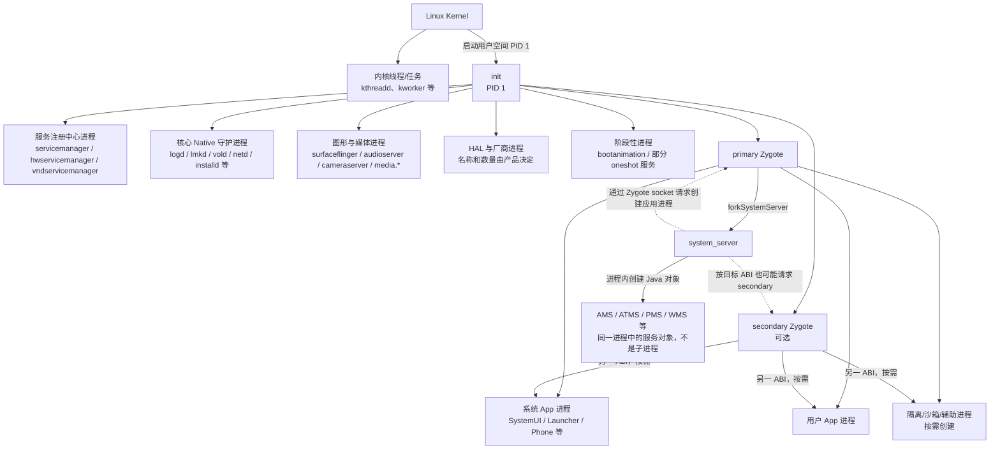
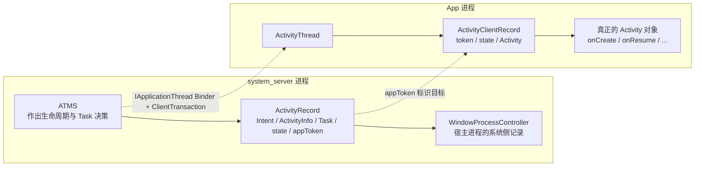
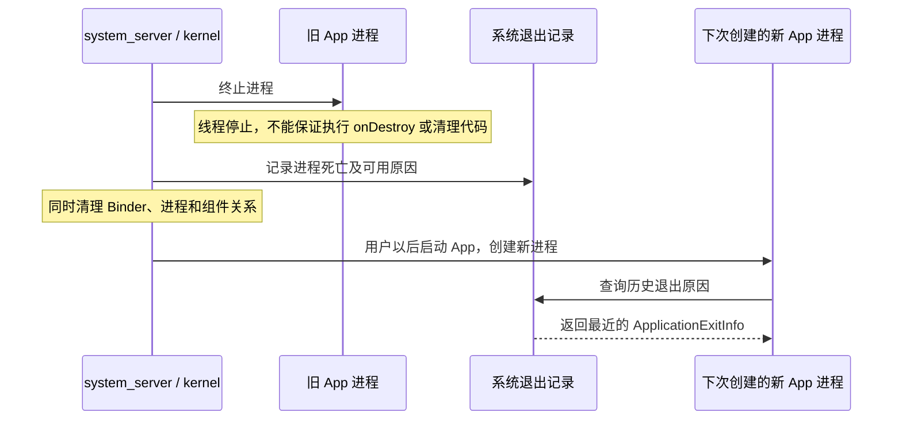

# 02A 第一、二章疑问答疑：系统进程、Activity 管理与进程强杀

> 源码基线：Android 11 / API 30 / `android-11.0.0_r48`。本章是第 01、02 章的补充答疑；只在 macOS 上阅读本地源码，不要求编译。查看真实进程数量的命令需要以后连接一台 Android 设备或模拟器，当前不执行。

## 先给结论：这篇解决三个容易混在一起的问题

### 问题一：Android 启动完成后到底有多少个进程

没有一个适用于所有设备的固定数字。准确数量只能描述成“某台设备在某个时刻的进程快照”。产品配置、32/64 位 Zygote、HAL、厂商服务、当前用户、已启动 App、WebView/隔离进程都会改变数量。

最重要的判断是：

> AMS、ATMS、PMS、WMS 通常是 `system_server` 进程里的多个服务对象，不是四个独立进程。Binder service 的数量也不等于 Linux 进程数量。

### 问题二：ATMS 管理 Activity，是否持有 Activity 对象

对于普通 App，不持有 App 进程中真实 `Activity` 对象的 Java 引用。system_server 保存的是 `ActivityRecord`、Binder token、宿主进程记录等；真正的 `Activity` 对象保存在 App 进程的 `ActivityThread` 中。

### 问题三：App 进程被强杀，App 能否检测

死亡当下不能可靠检测，也不保证调用 `onDestroy()`。Android 11 可以在下一次进程启动后，通过 `ApplicationExitInfo` 查询历史退出原因，但这是事后记录，不是临终回调。

读完后，你应该能：

- 看懂 `ps -A`、`service list` 和“系统服务数量”为什么是三种不同统计。
- 根据进程名判断应该先去 init rc、SystemServer、系统 App 还是 HAL 源码。
- 解释 `ActivityRecord` 与真实 `Activity` 为什么必须分开。
- 正确处理进程死亡，不依赖不保证执行的回调。

---

## 答疑一：系统启动后有多少个进程

### 为什么不能给一个标准数字

进程数量可以写成一张动态账单：

```text
当前进程数
= 内核任务
+ init 拉起的 Native 守护进程
+ HAL / 厂商进程
+ Zygote 与 system_server
+ 系统 App 进程
+ 当前用户 App 进程
+ WebView、isolated、sandbox 等临时进程
- 已退出或被回收的进程
```

其中很多项都会变化：

- 只支持 64 位的产品可能只有 primary Zygote；兼容 32 位 App 的产品可能还有 secondary Zygote。
- 摄像头、指纹、定位、音频等 HAL 的进程拆分取决于设备实现。
- Settings 没有打开时可能没有对应进程；打开后才创建。
- 后台 App 进程会因内存压力被 lmkd/系统回收。
- 一个 APK 可以通过 `android:process` 声明多个进程。
- BootAnimation、部分 APEX 初始化程序等只在特定启动阶段存在。
- 多用户、工作资料、WebView 和隔离服务会继续增加进程。

所以“boot completed 已经发出”也不会把进程表冻结。系统启动完成后，进程仍会持续创建和退出。

### 先分清四个容易混淆的数量

| 你统计的东西 | 典型命令/来源 | 它代表什么 |
|---|---|---|
| Linux 进程快照 | `adb shell ps -A` | 当前 `/proc` 中可见的进程；可能也看到内核线程样式的条目 |
| 线程数量 | `ps -T`、`/proc/<pid>/task` | 每个进程内部的执行线程，远多于进程数 |
| Binder 服务数量 | `adb shell service list` | servicemanager 中注册的 Binder 服务，不等于进程数 |
| system_server 服务对象 | `SystemServer.java` 启动逻辑 | 同一个 system_server 中的许多 Java 服务对象 |

例如 `service list` 里可以同时看到 activity、package、window 等服务，但它们主要对应同一个 `system_server` 进程：

```text
system_server 进程
├── ActivityManagerService
├── ActivityTaskManagerService
├── PackageManagerService
├── WindowManagerService
├── PowerManagerService
└── 许多其他系统服务对象
```

因此不能这样计算：

```text
1 个 Binder service = 1 个 Linux 进程   // 错误
```

---

## 图一：Android 启动后的典型进程家族

这张图表达**主要创建关系与承载关系**，不是完整时序，也不是某台商业设备的全量 `ps` 输出。



### 图中箭头必须这样理解

- `init → surfaceflinger` 表示 init 根据 rc 服务定义启动独立 Native 进程。
- `Zygote → system_server` 表示 Zygote fork 出 system_server。
- `system_server → AMS/ATMS/...` 表示在同一个进程内创建服务对象，不是 fork。
- `system_server ⇢ Zygote` 表示发送创建 App 进程的请求；真正执行 fork/specialize 的是 Zygote/USAP 体系。
- secondary Zygote、HAL 和 isolated 进程不是每台设备都完全相同。

---

## 表一：启动骨架和服务注册相关进程

| 常见进程名 | 谁启动/创建 | 主要职责 | 源码第一站与边界 |
|---|---|---|---|
| `init` | Linux kernel | PID 1；解析 rc、处理 trigger、启动并看护大量 Native 服务 | `system/core/init`；设备 rc 会扩展行为 |
| `ueventd` | init 的相应入口/rc 流程 | 处理内核 uevent，创建设备节点并设置权限等 | `system/core/init/ueventd*`、`system/core/rootdir` |
| `servicemanager` | init rc | `/dev/binder` 世界的 Binder 服务注册与查询中心 | `frameworks/native/cmds/servicemanager` |
| `hwservicemanager` | init rc | Android 11 中 HIDL HAL 服务注册与查询中心 | `system/hwservicemanager`；HIDL 相关 |
| `vndservicemanager` | init rc | vendor Binder 域的服务注册中心 | `frameworks/native/cmds/servicemanager`；是否使用依产品而定 |

`servicemanager` 不负责实现 AMS、PMS 等业务。它更像“号码簿”：服务把 Binder 名称登记进去，客户端按名称取得 Binder 句柄。

---

## 表二：常见核心 Native 守护进程

| 常见进程名 | 主要职责 | 源码第一站 | 是否一定常驻 |
|---|---|---|---|
| `logd` | 收集和管理 Android 日志缓冲区 | `system/core/logd` | 通常是核心常驻服务 |
| `lmkd` | 根据内存压力和进程优先级协助回收/杀死进程 | `system/memory/lmkd` | 通常常驻；策略受设备配置影响 |
| `vold` | 存储卷、挂载、加密相关管理 | `system/vold` | 通常常驻 |
| `netd` | 网络接口、路由、防火墙等系统网络操作 | `system/netd` | 通常常驻 |
| `installd` | 为包管理执行目录、数据、dexopt 相关底层文件操作 | `frameworks/native/cmds/installd` | 通常常驻 |
| `tombstoned` | 接收并管理 Native 崩溃 tombstone | `system/core/debuggerd/tombstoned` | 通常常驻 |
| `statsd` | 收集系统统计事件和指标 | `frameworks/base/apex/statsd` | 产品/模块配置相关 |
| `keystore` | Android 11 的密钥存储服务进程 | `system/security/keystore` | 本章基线为 Android 11；新版本架构已有演进 |
| `gatekeeperd` | 锁屏凭据校验相关系统守护进程 | `system/core/gatekeeperd` | 与安全硬件/HAL 配合 |
| `apexd*` | 激活、验证和管理 APEX | `system/apex/apexd` | 多个定义带 `oneshot`，不应假设全部一直存活 |
| `adbd` | 设备端 ADB 守护进程 | `system/core/adb` | 取决于 USB/调试状态和产品配置 |

这里的“常驻”也不是永不重启。init 可以根据 `critical`、`oneshot`、`disabled`、`onrestart` 等 rc 选项决定启动和重启行为。

---

## 表三：图形、动画与媒体进程

| 常见进程名 | 主要职责 | 源码第一站 | 容易误解的地方 |
|---|---|---|---|
| `surfaceflinger` | 合成各应用/系统 Surface，交给显示设备 | `frameworks/native/services/surfaceflinger` | 它是独立 Native 进程，不是 system_server 中的 WMS |
| `bootanimation` | 在 Framework 尚未完全就绪时显示开机动画 | `frameworks/base/cmds/bootanimation` | `oneshot` 阶段性进程；动画正在显示不等于系统已启动完成 |
| `audioserver` | 承载核心音频服务，与 Audio HAL 配合 | `frameworks/av/media/audioserver` | App 的 Audio API 只是客户端入口 |
| `cameraserver` | 承载 CameraService，与 Camera provider/HAL 配合 | `frameworks/av/camera/cameraserver` | Camera HAL 往往还是其他进程 |
| `media` | Android 11 中部分媒体服务的承载进程 | `frameworks/av/media/mediaserver` | 媒体服务已经拆分，不能把所有媒体能力都算在一个 mediaserver 中 |
| `mediaextractor` | 隔离媒体容器解析工作 | `frameworks/av/services/mediaextractor` | 独立进程有助于隔离复杂解析代码 |
| `media.swcodec` | 软件编解码相关服务 | `frameworks/av/apex`、`frameworks/av/services/mediacodec` | 产物位置和是否启用受模块/产品配置影响 |
| `mediametrics` | 媒体指标收集 | `frameworks/av/services/mediametrics` | 不负责实际播放和合成 |

WMS 与 SurfaceFlinger 的区别可以先这样记：

```text
WMS（system_server 内）负责窗口规则、层级和状态
SurfaceFlinger（独立进程）负责把 Surface 图层真正合成显示
```

---

## 表四：Java Runtime 与 Framework 主干进程

| 常见进程名 | 谁创建 | 主要职责 | 源码第一站 |
|---|---|---|---|
| `zygote` / `zygote64` | init | 初始化 ART、预加载公共内容、接受创建 Java 进程请求 | `frameworks/base/cmds/app_process`、`ZygoteInit.java` |
| `zygote_secondary` | init；可选 | 支持另一 ABI 的应用进程创建 | `system/core/rootdir/init.zygote*.rc` |
| `system_server` | primary Zygote | 承载绝大多数 Java Framework 系统服务 | `frameworks/base/services/java/com/android/server/SystemServer.java` |

`system_server` 内典型服务对象：

| 服务对象 | 主要职责 | Android 11 源码第一站 |
|---|---|---|
| AMS | 进程、Service、Broadcast、OOM 等管理，并与 ATMS 协作 | `frameworks/base/services/core/java/com/android/server/am` |
| ATMS | Activity、Task、Activity 生命周期与窗口容器相关调度 | `frameworks/base/services/core/java/com/android/server/wm` |
| PMS | 包扫描、解析、安装状态、组件与权限信息 | `frameworks/base/services/core/java/com/android/server/pm` |
| WMS | 窗口层级、布局、焦点和显示相关管理 | `frameworks/base/services/core/java/com/android/server/wm` |
| PowerManagerService | 电源状态、WakeLock 等管理 | `frameworks/base/services/core/java/com/android/server/power` |

再次强调：上表是一个进程里的多个服务对象，不应在 `ps -A` 中期待分别看到 `ams`、`pms`、`wms` 进程。

---

## 表五：系统 App、用户 App 与隔离进程

| 常见进程形态 | 主要职责/例子 | 源码第一站 | 是否固定存在 |
|---|---|---|---|
| `com.android.systemui` | 状态栏、导航栏、通知界面、锁屏等系统 UI | `frameworks/base/packages/SystemUI` | 主进程通常长期存在；清单还可能声明子进程 |
| Launcher/Home 进程 | 桌面、应用列表、最近任务界面的一部分 | AOSP 示例在 `packages/apps/Launcher3` | 具体包名由产品选择，不一定叫 Launcher3 |
| `com.android.phone` | 电话与 Telephony 相关系统组件 | `packages/services/Telephony` | 依设备是否支持电话能力而不同 |
| `com.android.bluetooth` | 蓝牙协议栈和相关组件 | `packages/apps/Bluetooth` | 依产品能力与启用状态而不同 |
| Provider 进程 | Contacts、Media、Downloads 等数据提供者 | `packages/providers` | 可能按需拉起，也可能与其他组件同进程 |
| Settings 进程 | 设置界面与相应业务 | `packages/apps/Settings` | 通常按需启动，不应假设开机后一直存在 |
| 普通 App 进程 | 执行应用组件和业务代码 | 对应 APK 源码 | 动态创建和回收 |
| `:remote` 等私有进程 | APK 通过 `android:process=":xxx"` 声明 | 对应 App manifest | 只有组件需要时才创建 |
| isolated/sandbox 进程 | WebView 渲染、不受信任或需要隔离的工作 | 对应 Framework/模块/App | 数量变化很大，权限身份与普通 App 进程不同 |

一个包名不保证只对应一个进程，一个进程名也不能单独说明里面当前运行了哪些组件。需要结合 manifest、`dumpsys activity processes` 和具体 PID 继续判断。

---

## 表六：HAL 与厂商进程为什么无法统一列完

真实设备上常见类似：

```text
android.hardware.camera.provider@...-service
android.hardware.graphics.composer@...-service
android.hardware.audio@...-service
vendor.<厂商>.<功能>-service
```

它们可能：

- 一个 HAL 接口对应一个进程。
- 多个接口合并到一个进程。
- 使用 HIDL、Stable AIDL 或其他版本接口。
- 运行在 system/vendor 不同 Binder 域和 SELinux 域。
- 由厂商专有源码实现，本地纯 AOSP 树只有接口或默认实现。

因此本文只能给出分类，不能声称列出了“每台 Android 11 设备的每一个进程”。精确清单必须来自目标设备。

---

## 如何在真实设备上得到准确数量和清单

以后连接设备后，先取得原始快照：

```bash
adb shell ps -A
adb shell 'ps -A | sed 1d | wc -l'
adb shell 'ps -A -o USER,PID,PPID,NAME,ARGS'
```

三个注意点：

1. 数量只对执行命令的那一刻有效。
2. `ps -A` 可能包含内核线程样式的条目；不要把它直接称为“Android 用户空间服务数”。
3. 不要添加 `-T` 后再称为进程数，因为 `-T` 会展开线程。

再用不同视角核对：

```bash
# Java/应用进程与系统活动记录
adb shell dumpsys activity processes

# servicemanager 中登记的 Binder 服务；不是进程表
adb shell service list

# 快速确认几个主干进程
adb shell pidof init zygote zygote64 system_server surfaceflinger
```

要整理某台设备的“每个进程做什么”，建议建立这张表：

| PID | PPID | USER | NAME/ARGS | 类别 | 谁启动 | 主要职责 | 源码/模块 |
|---:|---:|---|---|---|---|---|---|
|  |  |  |  | init/Native/HAL/Framework/App |  |  |  |

先按父进程和进程名分组，再查 rc、manifest、`Android.bp` 与 `dumpsys`，不要凭名字猜。

---

## 答疑二：ATMS 是否持有真实 Activity 的引用

### 先给结论

要区分两种“引用”：

```text
普通 Java 对象引用：只能在同一进程、同一虚拟地址空间中使用
Binder 引用/token：可以跨进程表示远端接口或对象身份
```

普通 App 的 `Activity` 对象在 App 进程；ATMS 在 system_server。system_server 无法持有对方 Java 堆中 `Activity` 对象的普通引用。

另外，Android 11 中把“AMS 管理 Activity”当成简写不够精确：Activity/Task 的主要管理职责已在 ATMS；AMS 更侧重进程、Service、Broadcast 等，并持有 ATMS 引用进行协作。

---

## 图二：同一个 Activity 在两边有两份不同记录



这张图中：

- `ActivityRecord` 和 `ActivityClientRecord` 不是同一个对象，也不在同一进程。
- `appToken` 用来让两边确认“当前说的是哪一个 Activity”。
- `IApplicationThread` 是 system_server 向 App 发送事务的 Binder 接口。
- 真正调用 `Activity.onResume()` 的代码仍在 App 进程主线程中执行。

### system_server 保存什么

Android 11 的 `ActivityRecord` 中可以看到：

```java
// frameworks/base/services/core/java/com/android/server/wm/ActivityRecord.java
final ActivityInfo info;
final ActivityRecord.Token appToken;
final Intent intent;
private Task task;
WindowProcessController app;
private ActivityState mState;
```

这些字段足以让系统管理组件身份、Task 关系、生命周期状态、宿主进程和窗口，但里面没有 App 进程中的 `Activity activity` 引用。

### App 进程保存什么

`ActivityThread` 维护以 token 为键的本地记录：

```java
// frameworks/base/core/java/android/app/ActivityThread.java
final ArrayMap<IBinder, ActivityClientRecord> mActivities = new ArrayMap<>();

public static final class ActivityClientRecord {
    public IBinder token;
    Activity activity;
}
```

Activity 创建完成后，真实对象被放进 App 自己的记录：

```java
r.activity = activity;
mActivities.put(r.token, r);
```

### ATMS 怎样让 Activity Resume

ATMS 不能直接调用另一个进程中的：

```java
activity.onResume(); // system_server 没有这个普通对象引用
```

系统侧会构造 `ClientTransaction`，放入目标 token 和生命周期请求，通过应用进程的 `IApplicationThread` 发送。App 的 `ActivityThread` 收到后，用 token 查询 `ActivityClientRecord`，再调用真实 Activity 的生命周期。

主线是：

```text
ATMS 作出 Resume 决定
→ ClientTransaction + ResumeActivityItem
→ IApplicationThread Binder
→ ActivityThread 收到事务
→ mActivities.get(token)
→ 找到 ActivityClientRecord.activity
→ 在 App 主线程执行生命周期
```

---

## 为什么一定要把 ActivityRecord 和 Activity 分开

### 原因一：跨进程不存在可直接使用的 Java 引用

两个进程拥有不同虚拟地址空间和 Java 堆。App 中的对象地址对 system_server 没有意义。

### 原因二：App 死亡不能带走系统的全局管理能力

App 退到后台后，进程可能被回收，Activity 对象随进程消失。符合系统策略时，Task 和 ActivityRecord 仍可以保留足够的组件、Intent、任务和已保存状态信息，以便用户回到任务时重新创建进程与 Activity。

这不表示 ActivityRecord 永远不会删除；是否保留取决于 finish、Task 策略、清理状态等。稳定结论是“系统记录的生命周期可以与 App 对象的生命周期分离”。

### 原因三：故障 App 不能拖住系统服务

App 可能崩溃、ANR 或主线程卡死。system_server 通过 Binder 事务发出生命周期要求，并设置超时和失败处理，而不是把自己的 Java 调用栈直接压在 App 回调上。

### 原因四：系统要管理跨进程、跨 Task、跨 Display 的全局关系

任何单个 App 都看不到全部 Activity。ATMS/WMS 必须在 system_server 中维护统一的任务、焦点、可见性和显示关系。

可以把真实 Activity 比作住客，把 ActivityRecord 比作酒店前台的入住档案，把 token 比作房卡编号。前台管理房间与入住状态，但不会把住客本人“保存进表格”。

---

## 答疑三：App 进程被强杀，App 能检测到吗

### 先给结论

```text
被杀当下：不能可靠检测
下次启动：Android 11 可以查询上一次退出记录
```

如果系统或内核直接终止进程，进程中的所有线程都会停止。已经不存在的 App 无法再执行“我死了”的通知代码。

### 不同情况不要混为一谈

| 情况 | 死亡前有可靠回调吗 | 下次启动可能看到什么 |
|---|---|---|
| `SIGKILL` / `kill -9` | 没有 | `REASON_SIGNALED` 等记录，具体取决于系统记录方式 |
| 低内存回收 | 没有 | 支持精确报告的设备可见 `REASON_LOW_MEMORY`；否则可能表现为 SIGKILL |
| 设置中“强行停止” | 没有 | 历史记录可能是 `REASON_USER_REQUESTED`；包还会进入 stopped 状态 |
| ANR 后终止 | 不保证 | 可查询 `REASON_ANR` 等记录 |
| Java 未捕获异常 | 可以在崩溃路径观察部分信息，但不能阻止系统回收 | `REASON_CRASH` |
| 从最近任务划掉 | 不等价于通用的进程死亡回调，是否结束进程受场景影响 | 若产生退出记录，按系统记录查询 |

### 这些回调都不能当“临终通知”

- `Activity.onDestroy()`：进程被杀时不保证调用。
- `Application.onTerminate()`：真实设备正常不会作为进程死亡回调调用。
- `onTrimMemory()`：只是内存压力提示，不保证下一步一定被杀，也不保证被杀前收到。
- `Service.onTaskRemoved()`：描述任务被移除，不等于进程一定死亡。
- Java `UncaughtExceptionHandler`：只能覆盖一部分 Java 崩溃，不能覆盖 SIGKILL、低内存回收和 force-stop。

---

## 图三：进程被杀时谁知道、谁不知道



system_server 可以通过 Binder death 以及系统的进程跟踪/退出记录机制知道客户端消失；普通 App 是 Zygote 的子进程，并不是 system_server 的直接子进程。旧 App 进程已经不存在，不能自己处理这一事件。查询退出原因的是后来创建的新进程。

### Android 11 的事后查询 API

```java
if (Build.VERSION.SDK_INT >= Build.VERSION_CODES.R) {
    ActivityManager am = getSystemService(ActivityManager.class);
    List<ApplicationExitInfo> exits =
            am.getHistoricalProcessExitReasons(null, 0, 1);
    if (!exits.isEmpty()) {
        ApplicationExitInfo last = exits.get(0);
        int reason = last.getReason();
    }
}
```

源码入口：

```text
frameworks/base/core/java/android/app/ActivityManager.java
frameworks/base/core/java/android/app/ApplicationExitInfo.java
```

`ApplicationExitInfo` 包含 `REASON_SIGNALED`、`REASON_LOW_MEMORY`、`REASON_CRASH`、`REASON_CRASH_NATIVE`、`REASON_ANR`、`REASON_USER_REQUESTED` 等原因。

### 使用时的边界

- 这是历史 ring buffer，不是永久审计日志。
- 多进程 App 需要检查 `getProcessName()`，不能只看列表第一条就认定是主进程。
- 应记录已经处理过的时间戳，避免每次启动重复处理同一条历史记录。
- 不应把它当作 UI 状态恢复机制；UI 恢复仍应使用生命周期、`savedInstanceState`、持久化数据等正常方案。
- force-stop 后 App 不能立刻运行检测代码；通常要等用户再次明确启动。
- 厂商实现和内核能力会影响某些原因的精确分类，例如低内存死亡可能退化为 signal 记录。

---

## 把三个问题连起来

这三组问题看起来不同，其实都在解释同一个 Android 设计原则：

> 系统把“全局管理状态”放在可信、长期存在的系统进程中，把“具体业务对象”放在可以独立创建和回收的应用进程中，双方通过明确的 IPC 身份和协议协作。

因此：

```text
system_server 中有很多系统服务对象，但它们不等于很多进程

ATMS 有 ActivityRecord，但没有普通 App 的 Activity 对象引用

App 进程被杀后，Activity 对象消失；系统仍能处理进程和任务记录

新 App 进程可以事后查询退出原因，但旧进程不能收到可靠临终回调
```

---

## 不编译也能完成的源码验证

### 验证进程是独立 rc 服务，还是 system_server 内对象

```bash
cd /Users/ninebot/androidSource

rg -n '^service (surfaceflinger|audioserver|cameraserver)' \
  frameworks -g '*.rc'

rg -n 'startBootstrapServices|startCoreServices|startOtherServices' \
  frameworks/base/services/java/com/android/server/SystemServer.java
```

前一组能找到独立 Native 进程的 rc 定义；后一组看到的是 system_server 内创建系统服务对象的 Java 主线。

### 验证两边各自保存的 Activity 记录

```bash
rg -n 'class ActivityRecord|ActivityRecord.Token appToken|WindowProcessController app' \
  frameworks/base/services/core/java/com/android/server/wm/ActivityRecord.java

rg -n 'mActivities =|class ActivityClientRecord|Activity activity' \
  frameworks/base/core/java/android/app/ActivityThread.java
```

### 验证生命周期通过事务发送

```bash
rg -n 'ClientTransaction.obtain|LaunchActivityItem.obtain|scheduleTransaction' \
  frameworks/base/services/core/java/com/android/server/wm \
  frameworks/base/core/java/android/app
```

### 验证 Android 11 历史退出原因 API

```bash
rg -n 'getHistoricalProcessExitReasons|REASON_LOW_MEMORY|REASON_USER_REQUESTED' \
  frameworks/base/core/java/android/app/ActivityManager.java \
  frameworks/base/core/java/android/app/ApplicationExitInfo.java
```

---

## API、实现与版本边界

| 本文内容 | 边界 |
|---|---|
| `ActivityManager.getHistoricalProcessExitReasons()` | Android 11 / API 30 公开 API；低版本不能直接调用 |
| `ApplicationExitInfo` 原因分类 | 系统提供的历史诊断信息；部分原因精度受设备能力影响 |
| `ActivityRecord`、ATMS、`ClientTransaction` | Android 平台内部实现，不是普通 App 的稳定 SDK API |
| `servicemanager`、init rc、Zygote | 平台启动实现；文件位置和细节可能随版本变化 |
| HAL/vendor 进程列表 | 产品相关，不能从纯 AOSP 基础代码推导某台商业设备的完整清单 |
| `ps -A` 数量 | 某台设备某个时刻的快照，不是 Android 兼容性指标 |

---

## 检查题与答案

### 1. `service list` 显示 200 个服务，是否说明系统有 200 个进程

**答案：不是。**多个 Binder 服务可以注册在同一个进程中，system_server 就承载了大量服务对象。

### 2. 为什么无法只根据 Android 11 版本给出固定进程数

**答案：**产品 ABI、HAL/厂商拆分、当前用户、已启动 App、临时进程和内存回收状态都会改变进程数量。

### 3. AMS、ATMS、PMS、WMS 是四个进程吗

**答案：通常不是。**在本文 Android 11 基线中，它们主要是 system_server 进程内的服务对象。

### 4. ATMS 用什么代表一个普通 App Activity

**答案：**使用系统侧 `ActivityRecord`、Binder token、宿主 `WindowProcessController`、Task 和状态等记录，不持有 App 堆中的 Activity 普通对象引用。

### 5. 真正的 Activity 对象保存在哪里

**答案：**在 App 进程的 `ActivityThread.ActivityClientRecord.activity` 中，并由 token 映射到对应记录。

### 6. ATMS 如何要求 Activity 执行 onResume

**答案：**系统侧构造包含目标 token 和生命周期请求的 ClientTransaction，通过 IApplicationThread Binder 发给 App；ActivityThread 再在 App 侧找到 Activity 并执行生命周期。

### 7. App 能否依赖 onDestroy 检测 force-stop 或低内存杀进程

**答案：不能。**直接终止进程时不保证执行 onDestroy，旧进程也没有机会继续运行检测逻辑。

### 8. Android 11 怎样事后了解上次退出原因

**答案：**新进程可以调用 `ActivityManager.getHistoricalProcessExitReasons()`，读取 `ApplicationExitInfo` 历史记录，同时处理 ring buffer、多进程和原因精度等限制。

---

## 读完马上能做的事

先不用记住表里的所有进程。拿一张纸画出下面六个节点，并给每条线标注“进程创建”“同进程对象”或“Binder/socket 请求”：

```text
init
Zygote
system_server
ATMS/ActivityRecord
App 进程/ActivityThread
真实 Activity
```

然后回答：

1. 哪些名称应该出现在 `ps -A` 中？
2. 哪些只是 system_server 或 App 进程里的 Java 对象？
3. App 被杀以后，哪些对象消失，哪些系统记录可能继续存在？

能把这三问讲清楚，就已经理解了 Android “进程隔离 + 系统统一管理”的基本设计。
