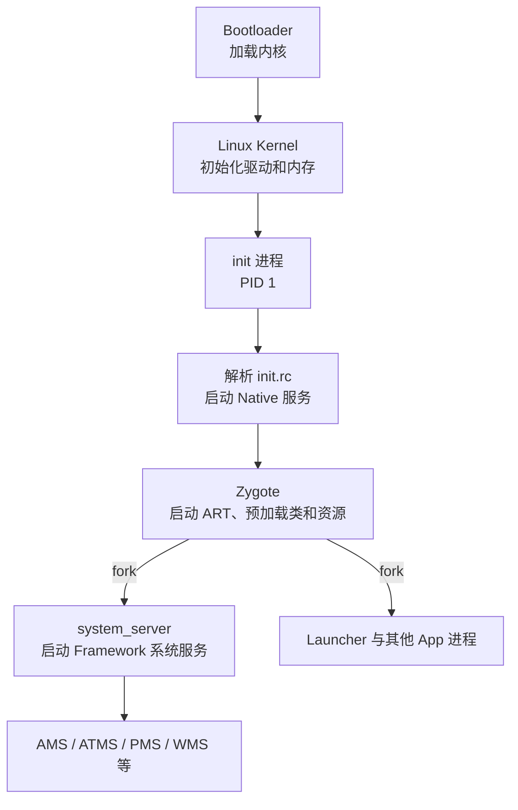

# 03 Android 系统启动总览

> 源码基线：Android 11 / API 30 / `android-11.0.0_r48`；本章在 macOS 上只读本地源码，不要求编译。

## 本章目标

先得到一张“Android 怎么活过来”的地图。本章只看主干，不深入每个函数；04～06 会分别拆解 init、Zygote 和 SystemServer。

## 1. 启动主流程



主线可以压缩成一句话：内核启动 `init`，`init` 根据 rc 配置启动 Zygote，Zygote fork 出 `system_server`，SystemServer 再启动 Android Framework 的核心服务。

这句话是导航，不是完整时序。例如：

- init 会在不同 rc trigger 下启动 servicemanager、surfaceflinger、Zygote 等多个分支，并非先把一个节点完全做完再进入下一个。
- `system_server` 由 Zygote fork，但大多数后续 App 的创建请求是 system_server 经 Zygote socket 发起的。
- Launcher 能否启动，依赖包扫描、Activity 管理、用户解锁/启动和开机阶段等状态，不是 SystemServer 无条件直接 `new Launcher()`。

## 2. 启动链上的“谁创建谁”

| 节点 | 谁创建/启动它 | 关键机制 | 主要代码形态 |
|---|---|---|---|
| Linux kernel | Bootloader | 加载内核与启动数据 | C / assembly |
| init PID 1 | kernel | 执行 init 程序 | Native C++ |
| Zygote | init | rc `service` + exec `app_process` | C++ 入口转 Java/ART |
| system_server | primary Zygote | `forkSystemServer()` | Java 为主，同时调 Native |
| 普通 App 进程 | Zygote/USAP 机制 | socket 请求 + fork/specialize | Java/Kotlin/Native 混合 |

“启动”一词可能指 rc 创建进程、fork 复制进程或 Framework 调度组件。后文看到“AMS 启动 App”时，要还原成“AMS/ATMS 决策，ProcessList/Process 向 Zygote 请求创建 Linux 进程，应用端 ActivityThread 再完成绑定”。

## 3. 第一站：init

入口文件：

```text
/Users/ninebot/androidSource/system/core/init/main.cpp
```

关键入口很短，但 Android 11 不是一进入 `main()` 就直接调第二阶段：

```cpp
int main(int argc, char** argv) {
    if (!strcmp(basename(argv[0]), "ueventd")) {
        return ueventd_main(argc, argv);
    }
    if (argc > 1) {
        // subcontext / selinux_setup / second_stage 分支
        ...
    }
    return FirstStageMain(argc, argv);
}
```

首次进入默认走 `FirstStageMain()`，完成早期挂载等工作；之后通过 exec 形式再进入 `selinux_setup` 和 `second_stage` 等分支。这些阶段仍属于 init 启动主线，不要由此误解成三个长期并存的 init 进程。

第二阶段主体在：

```text
/Users/ninebot/androidSource/system/core/init/init.cpp
```

Android 11 源码中，`SecondStageMain()` 会完成属性、信号处理、subcontext 等初始化，并调用：

```cpp
LoadBootScripts(am, sm);
```

它负责加载 rc 启动脚本。基础脚本入口是：

```text
/Users/ninebot/androidSource/system/core/rootdir/init.rc
```

此处先建立结论：init 不是“执行完就退出”的脚本程序，它是 PID 1，也负责管理许多 Native 服务的生命周期。rc 的 action 被解析和排队，init 后续在事件循环中处理 action、属性变化、子进程退出与重启，不是把 rc 当 shell 脚本一口气执行完。

## 4. 第二站：Zygote

init 会通过 rc 配置启动 `app_process`，Native 入口位于：

```text
/Users/ninebot/androidSource/frameworks/base/cmds/app_process/app_main.cpp
```

`app_process` 建立 Android Runtime，随后进入 Java 世界的：

```text
/Users/ninebot/androidSource/frameworks/base/core/java/com/android/internal/os/ZygoteInit.java
```

Zygote 的 rc 并不只有一份固定命令。依产品 ABI 组合，`init.zygote64.rc`、`init.zygote64_32.rc` 等会选择 `app_process64`/`app_process32`；primary Zygote 命令带 `--start-system-server`，secondary Zygote 通常不带。

`ZygoteInit.main()` 在这个版本的主线可简化为：

```text
解析 socket/ABI/start-system-server 参数
 → preload（非 lazy 时）
 → 创建 ZygoteServer，使用 init 传入的 socket
 → forkSystemServer()
 → 进入循环等待应用进程创建请求
```

源码中只有在 rc 传入 `--start-system-server` 后才走：

```java
Runnable r = forkSystemServer(abiList, zygoteSocketName, zygoteServer);
```

返回值需结合 fork 的两个分支读：在 Zygote 父进程中 `r == null`，它继续进入 `runSelectLoop()`；在新的 system_server 子进程中 `r != null`，执行 `r.run()` 进入 SystemServer，不会也成为一个接受应用孵化请求的 Zygote。

为什么不让每个 App 自己启动虚拟机？因为 Zygote 已经初始化运行时并预加载常用内容，fork 后启动更快，并能利用写时复制共享内存。

## 5. 第三站：SystemServer

Java 入口：

```text
/Users/ninebot/androidSource/frameworks/base/services/java/com/android/server/SystemServer.java
```

入口代码：

```java
public static void main(String[] args) {
    new SystemServer().run();
}
```

`run()` 进行了运行环境准备后，分三组启动服务：

```java
startBootstrapServices(t);
startCoreServices(t);
startOtherServices(t);
```

- Bootstrap services：系统继续启动所必需的基础服务。
- Core services：核心但数量较少的一组服务。
- Other services：WMS、输入、网络等大量其他服务。

这种分组表达了依赖顺序，并不表示服务重要性从高到低。

还要注意，三组方法不是三个并行进程，而是 `SystemServer.run()` 在同一 `system_server` 进程中按顺序调用。具体服务可以内部开 HandlerThread/线程池，SystemServer 也会使用 `SystemServerInitThreadPool`做部分并行初始化，但不能从“分三组”推导出“分三个线程”。

## 6. SystemServer 之后发生什么

PMS 扫描系统和应用包；AMS/ATMS 管理进程、组件、Activity 和 Task；WMS 管理窗口。系统达到合适阶段后启动 Launcher，用户才看到桌面。

注意“显示开机动画”和“Launcher 已启动”不是同一件事。BootAnimation 是 rc 定义的独立 Native 进程，基础定义在 `frameworks/base/cmds/bootanimation/bootanim.rc`；当动画显示时，系统服务仍可能在后台启动。

### boot completed 也不只是一个时刻

源码里会看到 boot phase、`sys.boot_completed` 属性、`BOOT_COMPLETED` 广播、用户启动完成等多个信号。它们服务不同的观察者，发生时机也不完全相同。所以调试“开机完成了吗”时，必须说清指哪个信号。

## 7. 五种关键控制流

启动过程混合了三种机制：

| 机制 | 例子 | 特点 |
|---|---|---|
| 直接函数调用 | `SystemServer.main()` → `run()` | 同一进程普通调用 |
| fork 创建进程 | Zygote → system_server/App | 子进程继承父进程状态 |
| Binder 跨进程调用 | App → AMS/ATMS | 看似方法调用，实际跨进程 |
| Unix socket | system_server → Zygote | 发送孵化参数，由 Zygote 处理 |
| init action/属性触发 | rc action → service | 事件驱动，非普通函数栈 |

以后画调用链时，务必用不同标记区分它们。

## 8. 本章实际阅读步骤

### 步骤一：只看入口，不展开

依次打开并定位：

1. `system/core/init/main.cpp` 的 `main()`。
2. `system/core/init/init.cpp` 的 `SecondStageMain()`。
3. `ZygoteInit.java` 的 `main()`。
4. `SystemServer.java` 的 `main()` 和 `run()`。

### 步骤二：用搜索建立连接

```bash
cd /Users/ninebot/androidSource

rg "SecondStageMain" system/core/init
rg "forkSystemServer" frameworks/base/core
rg "startBootstrapServices" frameworks/base/services
rg -n 'service zygote|--start-system-server' system/core/rootdir/init.zygote*.rc
```

### 步骤三：自己画一次

关闭本章，凭记忆写出：

```text
Kernel → ____ → ____ → system_server → 系统服务 → Launcher
```

两个空格应是 `init` 和 `Zygote`。然后给每个节点标注它是 Native 进程还是 Java/ART 进程。

## 9. 建议做一次“父子分支”手算

不需要编译，只读 `ZygoteInit.main()` 中 `forkSystemServer()` 之后的代码，然后填表：

| 问题 | Zygote 父进程 | system_server 子进程 |
|---|---|---|
| `r` 是否为 null |  |  |
| 是否执行 `r.run()` |  |  |
| 是否进入 `runSelectLoop()` |  |  |
| 最终运行的 Java 入口 |  |  |

正确结论是：父进程继续作为 Zygote 接收请求；子进程沿 `Runnable` 进入 SystemServer。这个练习能防止把 fork 误读成普通的“方法调用后返回一个对象”。

## 10. 现在先跳过什么

第一次阅读请跳过：

- SELinux 初始化细节。
- Zygote 的每一项预加载内容。
- `startOtherServices()` 内所有服务。
- fork 后的 UID、capability 参数细节。
- rc 语言的全部语法。

它们不是不重要，而是现在展开会遮住主线。

## 本章检查题

1. 谁启动了 Zygote？依据是什么？
2. Zygote 为什么适合创建 App 进程？
3. `system_server` 是谁创建的？
4. SystemServer 为什么分三组启动系统服务？
5. `init`、Zygote 和 `system_server` 是否是同一个进程？
6. init 首次进入 `main()` 时为什么不是直接走 `SecondStageMain()`？
7. primary Zygote 的父进程分支和 system_server 子进程分支各自去哪里？

完成标准：不看文档，用两分钟讲清楚启动主流程。完成后把进度文件中 03 的状态改为“已完成”，下一章进入 init 和 rc 脚本。
