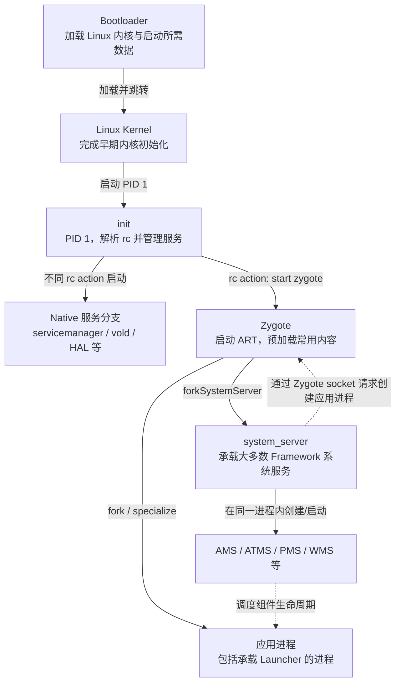
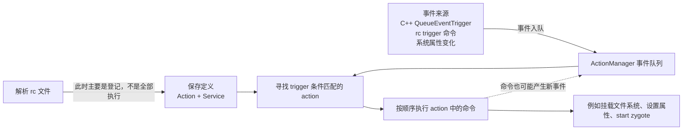

# 03 Android 系统启动总览：从按下电源到 Launcher 出现

> 源码基线：Android 11 / API 30 / `android-11.0.0_r48`。本章只在 macOS 上静态阅读本地源码，不要求编译或刷机。

## 先给结论：这篇到底解决什么问题

第一次看 Android 启动源码，很容易遇到三个困惑：

1. `init.rc` 里既有 `on boot`、`trigger zygote-start`，又有 `start zygote`，它们到底是不是一回事？
2. 图里写着 `init → Zygote → system_server`，源码里却同时启动了 servicemanager、vold、HAL、SurfaceFlinger 等进程，图是不是错了？
3. 手机已经显示开机动画，为什么 Launcher 还没出现？这时系统到底启动到哪一层了？

先记住本章的核心结论：

> Android 启动不是“一条函数从头调用到尾”，而是多种控制方式拼成的接力过程：Bootloader 加载内核，内核启动 PID 1 的 init；init 解析 rc 规则并根据 trigger 执行 action、管理 Native 服务；init 启动 Zygote；Zygote fork 出 system_server；system_server 启动 Framework 系统服务，并在条件满足后请求 Zygote 创建 Launcher 等应用进程。

读完本章，你应该能做到：

- 看懂两张图分别在表达什么，不再把“进程父子关系”和“启动时序”混为一谈。
- 用一句人话解释 rc trigger，并分清 `on`、`trigger`、`start`、`service`。
- 遇到卡开机问题时，先判断卡在 init、Zygote、system_server，还是应用启动阶段。
- 沿着真实源码入口继续阅读 04～06 章，而不是在几万个启动函数里迷路。

---

## 一个真实问题：开机动画一直转，应该从哪里查

“开机动画还在转”只能说明 BootAnimation 进程可能还活着，不能证明 Framework 已经准备好，也不能证明 Launcher 已经启动。

可能的故障点完全不同：

- init 的某个 action 等待文件系统或加密状态。
- Zygote 没启动，Java 世界还没有真正建立起来。
- system_server 启动了，但某个关键系统服务初始化失败或超时。
- 系统服务已经就绪，但用户、包扫描或 Launcher 解析/启动出了问题。

所以，学习启动流程的意义不是背一串名词，而是先拥有一张“故障分层地图”。只要知道每一层由谁启动、用什么机制连接，就能决定下一步应该看 rc、Native 日志、Zygote 日志，还是 system_server 日志。

---

## 图一：只看“谁启动或创建谁”

下面这张图表达的是**创建与控制关系**，不是所有进程的完整时间线。



### 这张图应该怎么读

- `init → Native 服务分支` 和 `init → Zygote` 是并列分支，并不是“所有 Native 服务全部启动完成后才轮到 Zygote”。具体先后由 rc action、trigger、服务依赖和设备配置决定。
- `Zygote → system_server` 是进程创建关系：primary Zygote 在自己的启动流程里 fork system_server。
- `system_server ⇢ Zygote` 是后续请求关系：创建普通应用时，system_server 中的进程管理逻辑会通过 Zygote socket 发送创建参数。
- Launcher 不是 `SystemServer` 里 `new` 出来的 Java 对象。它是一个应用组件，通常运行在 Zygote 创建的应用进程中，再由 Activity 管理相关服务调度启动。

图中没有画 BootAnimation、每个 HAL 和每个系统服务，因为它是一张主干地图，不是全量进程表。

---

## 图二：只看 init 内部怎样处理 rc trigger

第二张图把镜头拉进 init 进程，只解释 rc 规则怎样从“文本”变成“被执行的命令”。



### 为什么两张图不冲突

- 图一回答：“哪个角色创建或控制哪个角色？”
- 图二回答：“init 根据什么条件决定现在执行哪组 rc 命令？”

`trigger zygote-start` 出现在图二；它只是在 init 内部排入一个事件。等匹配的 action 执行到 `start zygote`，图一中的 `init → Zygote` 才真正发生。

原稿容易产生误解的地方就在这里：把“解析 rc”“触发 action”“启动进程”画成了三个连续进程节点。实际上前两项是 init 进程内部的规则与事件机制，最后一项才可能创建新进程。

---

## rc trigger 到底是什么

### 先用一句话说明

> trigger 是“让某组 rc action 具备执行机会的事件或条件”，不是进程、线程、Linux signal，也不是一次普通 Java/C++ 函数调用。

可以把 init 想成一个调度站：

- rc 文件是预先登记的处理手册。
- `on <trigger>` 是“收到什么票据时，执行下面这套流程”。
- trigger 事件是送进调度站的票据。
- action 是票据匹配到的处理流程。
- action 里的 `start`、`mkdir`、`setprop` 等是实际步骤。
- `service` 段只是登记“这个服务怎么启动、以什么身份运行”。

这个类比只用于理解调度关系。init 并不是一个通用消息队列产品；具体匹配、顺序和命令执行规则仍以 `ActionManager` 源码为准。

### 四个最容易混淆的词

| rc 写法 | 它是什么 | 它当下做了什么 |
|---|---|---|
| `service zygote ...` | 服务定义 | 登记可执行文件、参数、class、socket、权限等；解析到这里不等于已启动 |
| `on zygote-start ...` | action 定义及触发条件 | 登记“事件/属性满足时执行哪些命令” |
| `trigger zygote-start` | action 中的一条命令 | 把名为 `zygote-start` 的事件加入 init 的事件队列 |
| `start zygote` | action 中的一条命令 | 查找名为 `zygote` 的服务定义，并要求 init 启动它 |

最短记忆法：

```text
service = 说明“怎么启动”
on      = 说明“什么时候做”
trigger = 发出“现在检查这类 action”的事件
start   = 真正要求启动某个已定义服务
```

---

## trigger 有哪几类

Android 11 的 init README 把 trigger 分为两大类。

### 1. 事件 trigger

形式是一个事件名，例如：

```rc
on early-init
on init
on late-init
on boot
```

事件可以来自两处：

- init C++ 代码调用 `QueueEventTrigger("late-init")`。
- 某个 rc action 执行 `trigger zygote-start` 命令。

事件名本身没有“自动启动 Zygote”的魔法。只有存在与它匹配的 `on zygote-start ...` action，并且附加属性条件也满足，相关命令才会被执行。

### 2. 属性 trigger

形式是某个系统属性达到指定值：

```rc
on property:sys.boot_from_charger_mode=1
    class_stop charger
    trigger late-init
```

这里的意思是：当 `sys.boot_from_charger_mode` 变成 `1` 时，匹配并执行下面的 action。

属性 trigger 还可以用 `*` 表示“变成任意非空值”。属性 action 除了响应后续属性变化，init 在启动阶段启用属性触发后，还会按照当前属性状态做一次匹配检查。

### 3. 组合条件

一个 action 可以同时要求一个事件和若干属性条件：

```rc
on zygote-start && property:ro.crypto.state=unencrypted
    start zygote
```

意思不是“先运行 zygote-start，再等待属性变化”。准确理解是：处理 `zygote-start` 事件时，还要检查 `ro.crypto.state` 当前是不是 `unencrypted`；两者都满足才执行 action。

Android 11 的规则是：一个 action 最多有一个事件 trigger，但可以有多个属性 trigger。

---

## 用一条链讲透：late-init 怎样走到 Zygote

这里不换多个例子，只追踪 Android 11 中最关键的一条链。

### 第一步：init 先解析 rc，但不会从上到下全部执行

`SecondStageMain()` 调用：

```cpp
// system/core/init/init.cpp
ActionManager& am = ActionManager::GetInstance();
ServiceList& sm = ServiceList::GetInstance();
LoadBootScripts(am, sm);
```

`LoadBootScripts()` 会解析系统、system_ext、product、odm、vendor 等位置的 rc。源码树中的基础脚本是：

```text
system/core/rootdir/init.rc
```

安装到设备后，对应的主入口通常是：

```text
/system/etc/init/hw/init.rc
```

关键点：**解析阶段主要把 `service` 和 `on` 段变成内存中的定义；不是把文件当 shell 脚本从第一行执行到最后一行。**

### 第二步：C++ 把启动事件放进队列

Android 11 的第二阶段 init 会明确排入几个事件：

```cpp
// system/core/init/init.cpp
am.QueueEventTrigger("early-init");
// 中间还有内建 action
am.QueueEventTrigger("init");
// 正常开机分支
am.QueueEventTrigger("late-init");
```

特殊的 charger 模式会排入 `charger`，而不是正常启动的 `late-init`。因此，主流程图表示的是正常开机主线，不应拿它覆盖充电模式等分支。

### 第三步：`on late-init` 产生后续阶段事件

基础 `init.rc` 中有：

```rc
# system/core/rootdir/init.rc
on late-init
    trigger early-fs
    trigger fs
    trigger post-fs
    # 省略本章暂不展开的阶段
    trigger post-fs-data
    # 省略本章暂不展开的阶段
    trigger zygote-start
    # 省略本章暂不展开的阶段
    trigger early-boot
    trigger boot
```

这里每个 `trigger` 命令的作用都是**把新事件放到队列尾部**。它不是像函数调用那样立刻跳进 `on early-fs`，执行完再返回。

源码证据非常直接：

```cpp
// system/core/init/builtins.cpp
static Result<void> do_trigger(const BuiltinArguments& args) {
    ActionManager::GetInstance().QueueEventTrigger(args[1]);
    return {};
}
```

这也解释了一个常见误判：阅读 rc 时不能只靠缩进猜完整时间线。队列中可能已经有其他事件，设备 rc 也可能为同一 trigger 定义额外 action。

### 第四步：ActionManager 匹配 action，并逐条执行命令

`QueueEventTrigger()` 只是入队：

```cpp
// system/core/init/action_manager.cpp
void ActionManager::QueueEventTrigger(const std::string& trigger) {
    auto lock = std::lock_guard{event_queue_lock_};
    event_queue_.emplace(trigger);
}
```

`ExecuteOneCommand()` 才会从队列取事件、找出匹配 action，并一次执行一条命令。匹配同一事件的 action 按 rc 的解析顺序参与执行；一个 action 内的命令保持书写顺序。

为什么是“一次一条”而不是一口气执行整个 rc？init 还要处理设备节点、属性、子进程退出和服务重启等事件。命令之间回到事件循环，PID 1 才不会退化成只顾执行长脚本、无法照看系统的程序。

需要注意：这不表示每条命令都异步。像 `exec`/`exec_start` 或显式等待类命令仍可能阻塞相应启动阶段；判断性能问题时要看具体命令语义。

### 第五步：属性满足后，`start zygote` 才出现

Android 11 基础 rc 针对加密状态定义了不同 action，例如：

```rc
# system/core/rootdir/init.rc
on zygote-start && property:ro.crypto.state=unencrypted
    start statsd
    start netd
    start zygote
    start zygote_secondary
```

另外还有 `unsupported`、文件级加密等分支。不要把其中一个属性值当成所有设备的唯一启动条件。

到 `start zygote` 这一步，init 才根据已经解析好的 `service zygote ...` 定义启动相应进程。

---

## Zygote 的 service 定义来自哪里

主 `init.rc` 会导入与设备 ABI 配置匹配的文件：

```rc
# system/core/rootdir/init.rc
import /system/etc/init/hw/init.${ro.zygote}.rc
```

例如 64 位 primary Zygote 的定义是：

```rc
# system/core/rootdir/init.zygote64.rc
service zygote /system/bin/app_process64 -Xzygote /system/bin --zygote --start-system-server
    class main
    socket zygote stream 660 root system
```

不同产品可能选择 `init.zygote64.rc`、`init.zygote64_32.rc`、`init.zygote32_64.rc` 等。它们决定使用哪个 `app_process`、是否还有 secondary Zygote，以及 socket 名称。

这里的版本/产品边界很重要：

- “init 启动 Zygote”是稳定的架构结论。
- “一定运行一个 64 位 Zygote”不是稳定结论，取决于产品 ABI 配置。
- primary Zygote 带 `--start-system-server`；secondary Zygote 通常不负责 fork system_server。
- Android 11 还可能启用 USAP 池来加速部分应用进程创建；这不改变“system_server 提出需求、Zygote/USAP 体系完成进程创建”的总览结论，具体分支留到进程启动章节再展开。

---

## 从 app_process 进入 Java 世界

Zygote 的 Native 入口位于：

```text
frameworks/base/cmds/app_process/app_main.cpp
```

关键代码只有一处需要记：

```cpp
if (zygote) {
    runtime.start("com.android.internal.os.ZygoteInit", args, zygote);
}
```

这一步建立 Android Runtime，并进入：

```text
frameworks/base/core/java/com/android/internal/os/ZygoteInit.java
```

Zygote 主要做三件事：

1. 初始化运行时并预加载常用类和资源。
2. primary Zygote 根据 `--start-system-server` fork system_server。
3. 父进程继续监听 Zygote socket，处理后续应用进程创建请求。

为什么普通应用不各自从零启动一套运行时？Zygote 先做好一部分公共初始化，再通过 fork 产生子进程，可以减少重复启动工作，并利用写时复制共享未修改的内存页。

这并不表示所有预加载内容永久零成本共享：子进程修改页面会触发写时复制，预加载本身也会占用启动时间和内存。它是启动速度与资源占用之间的系统级折中。

---

## system_server 是普通 App 请求创建的吗

不是。它虽然也是 Zygote fork 出来的子进程，但创建路径很特殊：primary Zygote 在自身启动阶段直接调用 `forkSystemServer()`。

```java
// frameworks/base/core/java/com/android/internal/os/ZygoteInit.java
if (startSystemServer) {
    Runnable r = forkSystemServer(abiList, zygoteSocketName, zygoteServer);
    if (r != null) {
        r.run();
        return;
    }
}
caller = zygoteServer.runSelectLoop(abiList);
```

读这段必须带着 fork 的双分支思维：

| 执行位置 | `r` | 后续去向 |
|---|---:|---|
| Zygote 父进程 | `null` | 进入 `runSelectLoop()`，继续接收创建请求 |
| system_server 子进程 | 非 `null` | 执行 `r.run()`，进入 `com.android.server.SystemServer` |

所以，源码里看见同一段 `if`，不代表父子进程都会执行相同后续逻辑。

---

## SystemServer 为什么还要分组启动服务

入口位于：

```text
frameworks/base/services/java/com/android/server/SystemServer.java
```

主干很短：

```java
public static void main(String[] args) {
    new SystemServer().run();
}

startBootstrapServices(t);
startCoreServices(t);
startOtherServices(t);
```

三组的意义主要是组织依赖与启动顺序：

- Bootstrap services：后续启动依赖的基础能力。
- Core services：核心服务中的一组。
- Other services：WMS、网络、输入等大量其他服务。

这不是三个进程，也不能简单理解成三个并行线程。三个方法由 system_server 主线依次调用；方法内部可以使用线程池或 HandlerThread 做部分工作，但要以具体服务实现为准。

学习这个分组的实际用途是：system_server 卡住时，可以先从日志和 trace 判断落在哪一组，再缩小到具体服务，而不是直接阅读数千行 `startOtherServices()`。

---

## Launcher 出现之前，还缺哪些条件

system_server 启动服务后，系统还要经历包扫描、显示准备、Activity 管理、用户启动等过程。到合适阶段，系统才会解析并启动 Home/Launcher Activity。

因此下面三件事不能画成同一个节点：

| 观察到的现象/信号 | 它能说明什么 | 它不能保证什么 |
|---|---|---|
| BootAnimation 正在显示 | 动画进程和显示链路至少部分工作 | system_server、PMS 或 Launcher 已经准备好 |
| SystemService boot phase 推进 | Framework 服务进入某个约定阶段 | 所有用户与三方应用都已完成启动 |
| `sys.boot_completed=1` / BOOT_COMPLETED 相关流程 | 系统达到较后的启动完成流程 | 每台设备所有厂商任务都瞬间结束 |

Android 源码中还有 `PHASE_SYSTEM_SERVICES_READY`、`PHASE_ACTIVITY_MANAGER_READY`、`PHASE_BOOT_COMPLETED`、`sys.boot_completed` 属性和 `BOOT_COMPLETED` 广播等多个观察点。它们面向不同接收者，时间也不完全相同。

调试时不要只问“开机完成了吗”，而要问得更具体：

- Zygote 是否已经启动？
- system_server 是否进入服务启动？
- ActivityManager 是否 ready？
- `sys.boot_completed` 是否已经设为 `1`？
- Launcher 进程和 Home Activity 是否已真正创建？

---

## 启动链中混合了哪些控制方式

| 控制方式 | 本章例子 | 识别重点 |
|---|---|---|
| 内核启动用户空间进程 | kernel → init PID 1 | 不是 Java 调用 |
| init action 与服务管理 | trigger → action → `start zygote` | 基于事件和 rc 定义 |
| fork | Zygote → system_server / App | 同一段代码会分成父子执行路径 |
| Unix domain socket | system_server → Zygote 创建请求 | 请求者不直接执行 fork |
| 同进程函数调用 | `SystemServer.main()` → `run()` | 普通 Java 调用 |
| Binder 调度 | Framework 服务管理应用组件 | 跨进程，不等于调用方线程直接执行服务端代码 |

以后自己画调用图，至少区分“创建进程”“发送请求”和“同进程调用”。如果全部画成相同实线箭头，图很容易在视觉上正确、语义上错误。

---

## 常见翻车点

### 误区一：解析到 `service zygote` 就会立刻启动

不会。解析只是登记服务定义；后续 action 执行 `start zygote` 才要求启动。

### 误区二：`trigger boot` 等于执行 `on boot` 函数

不等于。`trigger boot` 将事件入队；ActionManager 之后匹配所有符合条件的 `on boot` action。中间隔着队列与匹配过程。

### 误区三：`late-init`、`early-fs`、`boot` 是线程名

它们是事件名/阶段名，不代表各自拥有一个线程。

### 误区四：启动图中排在右边，就一定在时间上最后开始

图一表达创建关系，不是纳秒级时序。Native 服务与 Framework 的准备可能交错，具体依赖 rc、属性、服务实现和产品配置。

### 误区五：Launcher 是 system_server 的子进程

从 Linux 进程创建角度，普通应用进程由 Zygote fork/specialize；system_server 负责决策和发请求。不要把“AMS 启动应用”口语化理解成 AMS 自己调用 `fork()`。

---

## 不编译也能完成的源码验证

### 验证一：确认谁产生早期事件

```bash
cd /Users/ninebot/androidSource
rg -n 'QueueEventTrigger\("(early-init|init|late-init)' system/core/init/init.cpp
```

预期看到 `SecondStageMain()` 将这些事件排入 ActionManager。

### 验证二：追踪唯一示例链

```bash
rg -n '^on late-init|trigger zygote-start|^on zygote-start|start zygote' \
  system/core/rootdir/init.rc
```

阅读时按以下顺序标注：

```text
QueueEventTrigger("late-init")
  → 匹配 on late-init
  → 执行 trigger zygote-start（事件入队）
  → 匹配 on zygote-start && property:...
  → 执行 start zygote
```

### 验证三：确认 `trigger` 只是入队

```bash
rg -n 'do_trigger|QueueEventTrigger' \
  system/core/init/builtins.cpp \
  system/core/init/action_manager.cpp
```

不要只看函数名；打开 `do_trigger()`，确认它调用的是 `QueueEventTrigger()`。

### 验证四：追踪 Zygote 到 SystemServer

```bash
rg -n 'runtime.start.*ZygoteInit' \
  frameworks/base/cmds/app_process/app_main.cpp

rg -n 'forkSystemServer|runSelectLoop' \
  frameworks/base/core/java/com/android/internal/os/ZygoteInit.java

rg -n 'startBootstrapServices|startCoreServices|startOtherServices' \
  frameworks/base/services/java/com/android/server/SystemServer.java
```

完成这四组搜索，就已经用源码验证了两张图的主干，而不是只背文章里的结论。

---

## API、实现与版本边界

本章大部分内容属于系统实现，不是普通 App 可以依赖的公开 API：

| 内容 | 边界 |
|---|---|
| `Activity`、`Service` 等 SDK 类型 | 面向应用开发者的公开 API（具体仍受 API 级别约束） |
| `SystemServer`、`ZygoteInit`、init rc 语法 | Android 平台内部实现或系统集成接口，不是普通 App API |
| `init.zygote64_32.rc` 等文件选择 | 产品 ABI 和构建配置相关，设备间可能不同 |
| 厂商 rc、HAL 启动顺序 | 设备实现相关，AOSP 基础脚本不能代表所有真机细节 |
| Bootloader 的具体实现 | SoC/设备相关，不完全由本仓库的 AOSP Framework 源码定义 |

所以这章教你的不是“写 App 时调用哪个启动 API”，而是如何阅读系统、分析开机日志、理解 Framework 服务从哪里来。

---

## 本章暂时跳过什么

第一次阅读先不要展开：

- FirstStageMount、AVB、动态分区和 SELinux 策略细节。
- 每一种加密状态下的完整 rc 分支。
- Zygote 的全部预加载列表和 fork 参数。
- `startOtherServices()` 中每一个系统服务。
- Launcher 解析与 Activity 启动的完整调用链。

这些内容后续会单独展开。现在的完成标准是：能把机制接起来，而不是记住所有函数。

---

## 读完马上能用的 takeaway

遇到启动相关源码或日志时，按下面五问定位：

1. 当前看到的是哪个进程：init、Zygote、system_server，还是 App？
2. 这条箭头表示创建进程、发送请求，还是普通函数调用？
3. rc 此处是在定义 `service`，定义 `on` action，产生 trigger，还是执行 `start`？
4. 触发条件是否还依赖属性值、加密状态或产品配置？
5. 所谓“启动完成”具体指哪个信号？

只要这五个问题答得出来，启动总览就已经真正起作用了。

---

## 检查题与答案

### 1. `service zygote ...` 被解析后，Zygote 是否已经运行？

**答案：没有。** 这一步只是登记服务定义。某个匹配 action 后续执行 `start zygote`，init 才会尝试启动它。

### 2. `trigger zygote-start` 与 `start zygote` 有什么区别？

**答案：**前者把 `zygote-start` 事件放进 ActionManager 队列，用来匹配 `on zygote-start ...` action；后者直接针对已经登记的 `zygote` 服务发出启动要求。

### 3. `on zygote-start && property:ro.crypto.state=unencrypted` 怎么判断？

**答案：**处理 `zygote-start` 事件时，还要检查该属性当前是否为 `unencrypted`。两个条件同时满足，action 才执行。

### 4. 为什么图一不能表示所有节点的严格开始时间？

**答案：**图一表达创建/控制关系。init 会通过不同 trigger 启动多个并列分支，服务内部还可能并行初始化；要分析真实先后，需要结合 action 队列、属性、日志和启动 trace。

### 5. system_server 与普通 App 都由 Zygote 创建，路径完全相同吗？

**答案：不完全相同。** primary Zygote 在自身启动阶段根据 `--start-system-server` 直接调用 `forkSystemServer()`；普通应用通常由 system_server 侧发出 Zygote socket 请求，再由 Zygote fork/specialize。

### 6. BootAnimation 正在显示，能证明 Launcher 已启动吗？

**答案：不能。** BootAnimation 是独立 Native 进程；动画显示期间，system_server、包扫描、用户启动或 Launcher 调度仍可能没有完成。

### 7. init 为什么一次只执行 action 中的一条命令再回到事件循环？

**答案：**init 作为 PID 1 还要处理设备、属性、子进程退出与服务重启等事件。分步执行可以在命令之间处理其他系统工作；但具体命令仍可能因为自身语义产生等待。

### 8. 用一句话复述正常启动主线。

**答案：**Bootloader 加载内核，内核启动 init；init 根据 rc trigger 执行 action 并启动 Zygote；Zygote fork system_server；system_server 启动 Framework 服务，并在条件满足后请求 Zygote 创建 Launcher 等应用进程。

---

## 下一章怎么接

下一章进入 init 与 rc 时，继续沿本章唯一示例：

```text
解析 service/action
  → trigger 入队
  → action 匹配
  → 命令逐条执行
  → 服务启动与重启管理
```

如果离开一段时间再回来，只需先重画图一，再解释 `on`、`trigger`、`start`、`service` 四个词，就能恢复本章上下文。
