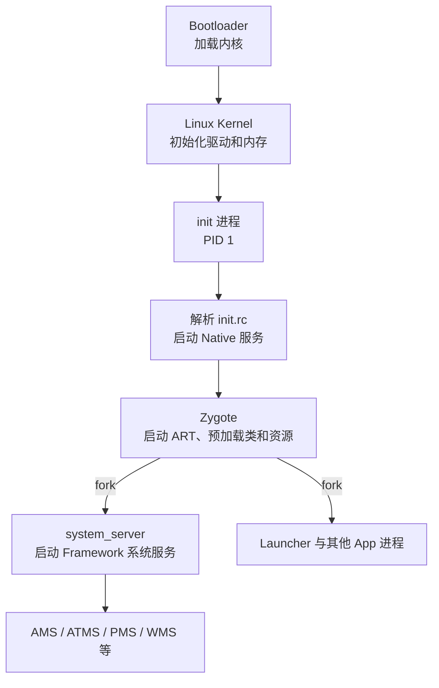

# 03 Android 系统启动总览

## 本章目标

先得到一张“Android 怎么活过来”的地图。本章只看主干，不深入每个函数；04～06 会分别拆解 init、Zygote 和 SystemServer。

## 1. 启动主流程



主线可以压缩成一句话：内核启动 `init`，`init` 根据 rc 配置启动 Zygote，Zygote fork 出 `system_server`，SystemServer 再启动 Android Framework 的核心服务。

## 2. 第一站：init

入口文件：

```text
/Users/ninebot/androidSource/system/core/init/main.cpp
```

关键入口很短：

```cpp
int main(int argc, char** argv) {
    // 根据启动阶段和参数进入不同处理分支
    ...
    return android::init::SecondStageMain(argc, argv);
}
```

第二阶段主体在：

```text
/Users/ninebot/androidSource/system/core/init/init.cpp
```

Android 11 源码中，`SecondStageMain()` 会完成属性、SELinux、信号处理等初始化，并调用：

```cpp
LoadBootScripts(am, sm);
```

它负责加载 rc 启动脚本。基础脚本入口是：

```text
/Users/ninebot/androidSource/system/core/rootdir/init.rc
```

此处先建立结论：init 不是“执行完就退出”的脚本程序，它是 PID 1，也负责管理许多 Native 服务的生命周期。

## 3. 第二站：Zygote

init 会通过 rc 配置启动 `app_process`，Native 入口位于：

```text
/Users/ninebot/androidSource/frameworks/base/cmds/app_process/app_main.cpp
```

`app_process` 建立 Android Runtime，随后进入 Java 世界的：

```text
/Users/ninebot/androidSource/frameworks/base/core/java/com/android/internal/os/ZygoteInit.java
```

`ZygoteInit.main()` 的主线可简化为：

```text
创建 ZygoteServer
 → 注册 Zygote socket
 → preload（预加载）
 → forkSystemServer()
 → 进入循环等待应用进程创建请求
```

源码中的关键调用是：

```java
Runnable r = forkSystemServer(abiList, zygoteSocketName, zygoteServer);
```

为什么不让每个 App 自己启动虚拟机？因为 Zygote 已经初始化运行时并预加载常用内容，fork 后启动更快，并能利用写时复制共享内存。

## 4. 第三站：SystemServer

Java 入口：

```text
/Users/ninebot/androidSource/frameworks/base/services/java/com/android/server/SystemServer.java
```

入口代码：

```java
public static void main(String[] args) {
    new SystemServer().run();
}
```

`run()` 进行了运行环境准备后，分三组启动服务：

```java
startBootstrapServices(t);
startCoreServices(t);
startOtherServices(t);
```

- Bootstrap services：系统继续启动所必需的基础服务。
- Core services：核心但数量较少的一组服务。
- Other services：WMS、输入、网络等大量其他服务。

这种分组表达了依赖顺序，并不表示服务重要性从高到低。

## 5. SystemServer 之后发生什么

PMS 扫描系统和应用包；AMS/ATMS 管理进程、组件、Activity 和 Task；WMS 管理窗口。系统达到合适阶段后启动 Launcher，用户才看到桌面。

注意“显示开机动画”和“Launcher 已启动”不是同一件事。BootAnimation 是独立 Native 进程，系统服务仍可能在后台启动。

## 6. 三种关键控制流

启动过程混合了三种机制：

| 机制 | 例子 | 特点 |
|---|---|---|
| 直接函数调用 | `SystemServer.main()` → `run()` | 同一进程普通调用 |
| fork 创建进程 | Zygote → system_server/App | 子进程继承父进程状态 |
| Binder 跨进程调用 | App → AMS/ATMS | 看似方法调用，实际跨进程 |

以后画调用链时，务必用不同标记区分它们。

## 7. 本章实际阅读步骤

### 步骤一：只看入口，不展开

依次打开并定位：

1. `system/core/init/main.cpp` 的 `main()`。
2. `system/core/init/init.cpp` 的 `SecondStageMain()`。
3. `ZygoteInit.java` 的 `main()`。
4. `SystemServer.java` 的 `main()` 和 `run()`。

### 步骤二：用搜索建立连接

```bash
cd /Users/ninebot/androidSource

rg "SecondStageMain" system/core/init
rg "forkSystemServer" frameworks/base/core
rg "startBootstrapServices" frameworks/base/services
```

### 步骤三：自己画一次

关闭本章，凭记忆写出：

```text
Kernel → ____ → ____ → system_server → 系统服务 → Launcher
```

两个空格应是 `init` 和 `Zygote`。然后给每个节点标注它是 Native 进程还是 Java/ART 进程。

## 8. 现在先跳过什么

第一次阅读请跳过：

- SELinux 初始化细节。
- Zygote 的每一项预加载内容。
- `startOtherServices()` 内所有服务。
- fork 后的 UID、capability 参数细节。
- rc 语言的全部语法。

它们不是不重要，而是现在展开会遮住主线。

## 本章检查题

1. 谁启动了 Zygote？依据是什么？
2. Zygote 为什么适合创建 App 进程？
3. `system_server` 是谁创建的？
4. SystemServer 为什么分三组启动系统服务？
5. `init`、Zygote 和 `system_server` 是否是同一个进程？

完成标准：不看文档，用两分钟讲清楚启动主流程。完成后把进度文件中 03 的状态改为“已完成”，下一章进入 init 和 rc 脚本。

