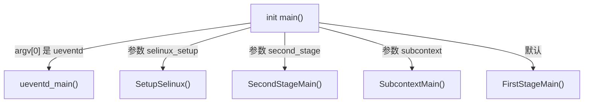
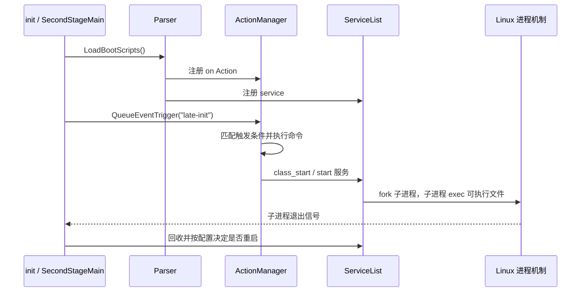

# 04 init 进程与 rc 脚本

> 源码基线：Android 11 / API 30 / `android-11.0.0_r48`；本章在 macOS 上只读本地源码，不要求编译。

## 本章目标

读完本章，你应该能够：

1. 解释 Android `init` 为什么是 PID 1，以及它为什么一直不退出。
2. 说清楚 init 第一阶段与第二阶段的大致分工。
3. 看懂 rc 文件里的 `import`、`on`、`service`。
4. 从“触发器”追到“命令”，再追到被启动的服务。
5. 找到 Zygote 的 rc 声明，并解释其中常用选项。

## 1. init 在整个启动流程中的位置


Linux 内核完成自身初始化后，需要启动第一个用户空间进程。Android 中这个进程就是 `init`，进程号为 1。

PID 1 有两个重要特点：

- 它是许多用户空间进程的祖先，负责启动和管理系统服务。
- 它必须回收退出的子进程，并根据服务配置决定是否重启。

所以 init 不是“执行一遍启动脚本后就结束”的程序。它进入事件循环，持续监听属性变化、控制消息、子进程退出等事件。

## 2. Native 入口 `main.cpp`

源码入口：

```text
/Users/ninebot/androidSource/system/core/init/main.cpp
```

核心结构如下：

```cpp
int main(int argc, char** argv) {
    if (!strcmp(basename(argv[0]), "ueventd")) {
        return ueventd_main(argc, argv);
    }

    if (argc > 1) {
        if (!strcmp(argv[1], "subcontext")) {
            ...
        }
        if (!strcmp(argv[1], "selinux_setup")) {
            return SetupSelinux(argv);
        }
        if (!strcmp(argv[1], "second_stage")) {
            return SecondStageMain(argc, argv);
        }
    }

    return FirstStageMain(argc, argv);
}
```

这段代码揭示了一个容易忽略的事实：同一个 init 可执行文件会根据程序名和参数进入不同角色或阶段。



这里的 `argv[0]` 通常表示程序以什么名字被调用。不同名字进入不同逻辑，是 Unix 系统中常见的多调用入口设计。

## 3. init 为什么分阶段

启动早期可用的文件、分区、权限和安全环境都很有限。如果把全部工作塞进一次初始化，依赖关系会非常混乱。因此 Android 把 init 启动拆成阶段。

### 第一阶段

入口位于：

```text
/Users/ninebot/androidSource/system/core/init/first_stage_init.cpp
```

第一阶段重点是创造第二阶段能够运行的基础条件，例如建立必要文件系统、准备设备节点、处理早期挂载。

### SELinux setup

负责加载和建立 SELinux 安全环境，然后再次执行 init，进入第二阶段。

### 第二阶段

入口位于 `system/core/init/init.cpp` 的：

```cpp
int SecondStageMain(int argc, char** argv)
```

它会初始化属性系统、日志、信号处理、SELinux/subcontext 状态、epoll，并解析 rc 配置。后续大部分“Android 服务启动”讨论都发生在第二阶段。

这里不需要马上读懂第一阶段的挂载和 SELinux 细节。先记住：分阶段是因为启动环境逐步变得完整。

## 4. 第二阶段主线

省略平台细节后，`SecondStageMain()` 可整理成：

```text
初始化日志和信号
  → 初始化属性系统
  → 准备 SELinux context
  → 创建 epoll
  → 启动属性服务
  → 创建 ActionManager / ServiceList
  → LoadBootScripts()
  → 排入 early-init、init、late-init 等事件
  → 进入永久事件循环
```

源码中的两个核心管理器：

```cpp
ActionManager& am = ActionManager::GetInstance();
ServiceList& sm = ServiceList::GetInstance();

LoadBootScripts(am, sm);
```

- `ActionManager`：保存和调度由触发器激活的 Action。
- `ServiceList`：保存 rc 文件解析出的 Service。

可以把它们暂时理解成“任务调度表”和“服务登记表”。

## 5. rc 文件不是 Shell 脚本

rc 是 Android init 自己定义的声明式配置语言。它看起来有点像 Shell，但不能把任意 Shell 命令直接写进去。

最重要的三个 section 是：

```text
import <文件>
on <触发条件>
service <名称> <可执行文件> [参数...]
```

解析器注册代码位于 `system/core/init/init.cpp`：

```cpp
parser.AddSectionParser("service", ...ServiceParser...);
parser.AddSectionParser("on", ...ActionParser...);
parser.AddSectionParser("import", ...ImportParser...);
```

这说明 `service`、`on`、`import` 不是注释或约定，而是分别交给不同 C++ 解析器处理的语法关键字。

## 6. `import`：加载更多配置

基础入口文件是：

```text
/Users/ninebot/androidSource/system/core/rootdir/init.rc
```

开头包含类似：

```rc
import /init.environ.rc
import /system/etc/init/hw/init.usb.rc
import /init.${ro.hardware}.rc
import /system/etc/init/hw/init.${ro.zygote}.rc
```

`${ro.hardware}` 和 `${ro.zygote}` 是属性展开。这样同一套基础 init.rc 就能加载不同设备和不同 Zygote 架构的配置。

Android 11 的 `LoadBootScripts()` 不只解析主 rc：若存在 `ro.boot.init_rc`，它会按该属性指定文件启动；通常路径则解析 `/system/etc/init/hw/init.rc`，并扫描这些目录：

```text
/system/etc/init
/system_ext/etc/init
/product/etc/init
/odm/etc/init
/vendor/etc/init
```

因此，寻找某个 Native 服务声明时不能只搜索根 `init.rc`。

## 7. `on`：触发条件和 Action

示例结构：

```rc
on early-init
    start ueventd

on property:sys.boot_completed=1
    # 属性满足后执行这里的命令
```

`on` 后面是触发条件，缩进内容是要执行的命令。触发器常见两类：

- 事件触发器：`early-init`、`init`、`late-init`、`boot`。
- 属性触发器：`property:属性名=期望值`。

条件也可以组合：

```rc
on zygote-start && property:ro.crypto.state=unencrypted
```

只有事件和属性条件都满足时，Action 才会进入执行队列。

第二阶段源码主动排入了几个关键事件：

```cpp
am.QueueEventTrigger("early-init");
am.QueueEventTrigger("init");
am.QueueEventTrigger("late-init");
```

重要理解：解析 rc 只是把 Action 和 Service 注册进内存；并不表示所有命令立刻执行、所有服务立刻启动。

## 8. `service`：声明受 init 管理的进程

基本语法：

```rc
service <服务名> <程序路径> [启动参数...]
    class <服务类别>
    user <运行用户>
    group <运行组...>
    socket <名称> <类型> <权限> [用户] [组]
    disabled
    oneshot
    onrestart <命令...>
```

以 64 位 Zygote 为例，文件位于：

```text
/Users/ninebot/androidSource/system/core/rootdir/init.zygote64.rc
```

核心声明为：

```rc
service zygote /system/bin/app_process64 -Xzygote /system/bin \
        --zygote --start-system-server
    class main
    priority -20
    user root
    group root readproc reserved_disk
    socket zygote stream 660 root system
```

逐项理解：

| 配置 | 含义 |
|---|---|
| `service zygote` | 服务在 init 中的名字是 zygote |
| `/system/bin/app_process64` | 真正执行的 Native 程序 |
| `--zygote` | 告诉 app_process 进入 Zygote 模式 |
| `--start-system-server` | 要创建 system_server |
| `class main` | 属于 main 服务类别 |
| `user/group` | 进程启动身份和附加组 |
| `socket zygote ...` | 由 init 创建服务 socket，其 fd 通过约定环境传给子进程 |
| `onrestart` | 服务退出并重启时额外执行的命令 |

因此，“init 启动 Zygote”更准确的含义是：init 解析 Zygote 的 service 声明，在对应触发条件到来时执行 `app_process64`，并持续管理这个进程。

## 9. Service class 是什么

`class main` 不是 Java 类，而是 init 对服务进行批量管理的分组标签。

rc 命令可以通过：

```rc
class_start core
class_start main
class_start late_start
```

启动某一类别中的服务。这样系统不必逐个写 `start xxx`，也能控制不同阶段的服务集合。

## 10. init 为什么一直不退出

解析配置并排入初始事件后，`SecondStageMain()` 进入：

```cpp
while (true) {
    ...
    am.ExecuteOneCommand();
    ...
    auto pending_functions = epoll.Wait(epoll_timeout);
    ...
    ReapAnyOutstandingChildren();
    HandleControlMessages();
}
```

这个循环持续处理：

- Action 队列中的命令。
- 属性变化。
- `ctl.start`、`ctl.stop` 等控制消息。
- 子进程退出和服务重启。
- 关机、重启请求。
- 文件描述符事件。

`epoll.Wait()` 让 init 没有工作时阻塞等待，避免空转浪费 CPU。

## 11. 从 rc 到进程的完整关系



请特别区分：

- `service` 是配置中描述的一个受管进程。
- `start zygote` 是启动动作。
- `/system/bin/app_process64` 才是真正被执行的文件。
- `ZygoteInit` 是 app_process 后续进入的 Java 入口之一。

## 12. 实际阅读练习

### 练习一：确认 init 分派入口

```bash
cd /Users/ninebot/androidSource
sed -n '51,85p' system/core/init/main.cpp
```

回答：没有特殊参数时进入哪个阶段？带 `second_stage` 参数时呢？

### 练习二：找到 rc 三种解析器

```bash
rg -n 'AddSectionParser' system/core/init/init.cpp
```

回答：`service`、`on`、`import` 分别由哪个 Parser 处理？

### 练习三：找到 Zygote 服务

```bash
rg -n 'service zygote|class main|socket zygote' \
  system/core/rootdir/init.zygote*.rc
```

回答：`zygote64_32` 与 `zygote64` 配置在进程数量上有什么不同？

### 练习四：追踪触发器

```bash
rg -n '^on (early-init|init|late-init|boot)' system/core/rootdir/init.rc
rg -n 'QueueEventTrigger' system/core/init/init.cpp
```

回答：C++ 排入的事件名称怎样与 rc 中的 `on` 对应？

## 13. 常见误区

### “init.rc 是一个 Shell 脚本”

错误。它由 Android init Parser 解析，只支持 init 定义的语法和内建命令。需要运行外部程序时要通过 `exec`、`exec_background` 或 service 等机制。

### “出现 service 声明就会立即运行”

错误。声明先进入 `ServiceList`，实际启动取决于 `start`、`class_start`、属性触发器等条件。

### “所有设备都读取同一份 Zygote rc”

错误。`init.${ro.zygote}.rc` 会根据产品属性选择 32 位、64 位或双 Zygote 配置。

### “服务崩溃后一定立刻重启”

不一定。是否重启还受 `oneshot`、`disabled`、崩溃频率、服务状态和关机状态等影响。

## 本章检查题

1. init 为什么是一个常驻进程？
2. `LoadBootScripts()` 做的是解析还是立即执行全部服务？
3. `on` 和 `service` 的职责有什么不同？
4. 属性触发器与事件触发器各是什么？
5. 从 `service zygote` 到 `ZygoteInit.main()` 中间还经过哪个 Native 程序？
6. 为什么 Zygote rc 中要声明 socket？

## 完成标准

不看文档，能够解释下面这条链路：

```text
SecondStageMain
 → LoadBootScripts
 → Parser
 → ActionManager / ServiceList
 → 触发器
 → class_start 或 start
 → fork + exec service
```

并能在源码中找到 Zygote 的 service 声明。达到后可把本章标为“已完成”，下一章进入 `app_process → AndroidRuntime → ZygoteInit → forkSystemServer`。
