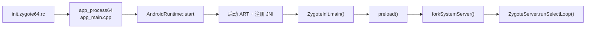
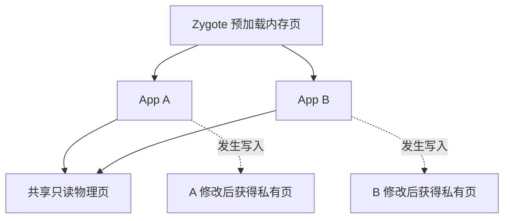
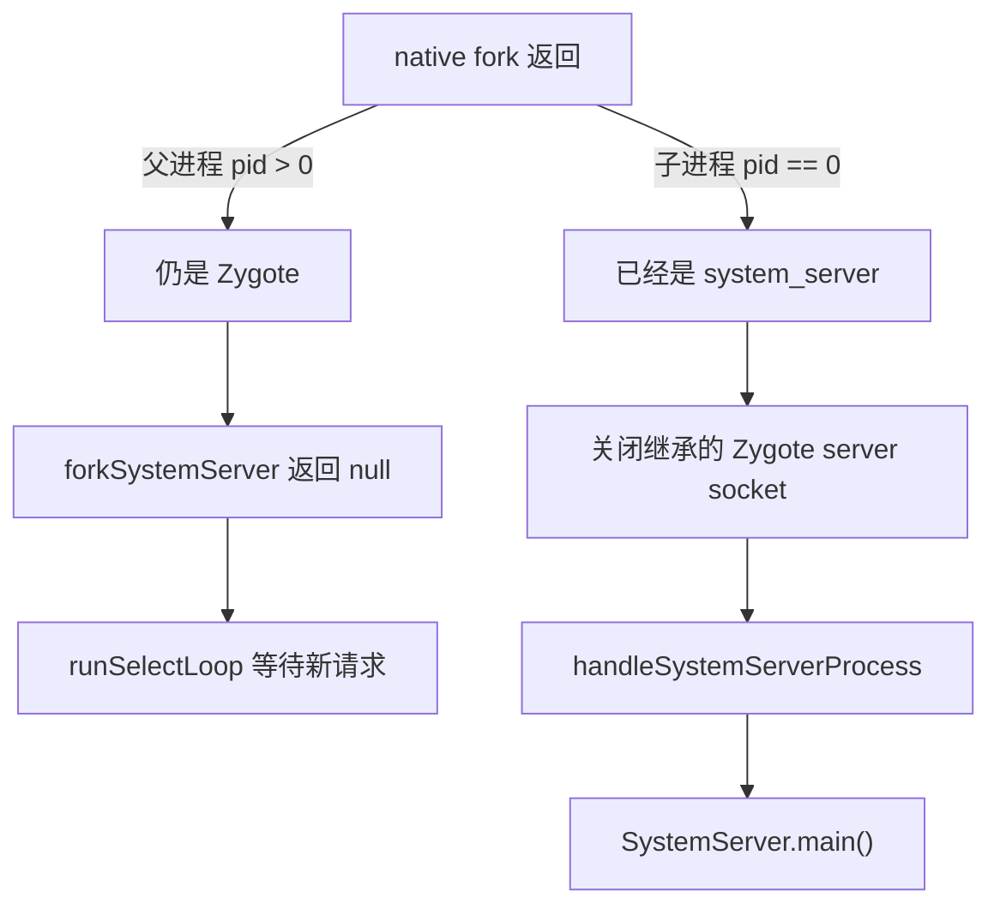
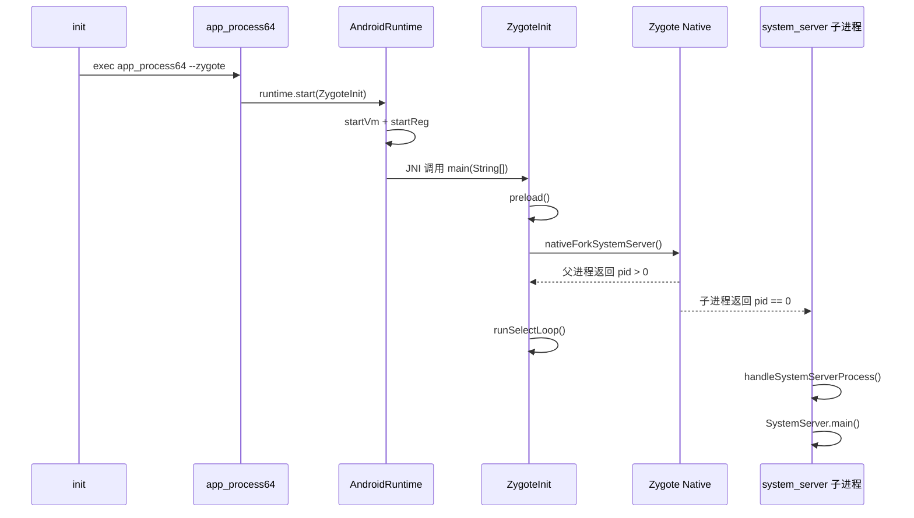

# 05 Zygote 启动与应用孵化

## 本章目标

读完本章，你应该能够解释：

1. rc 中的 `app_process64` 怎样进入 Java 的 `ZygoteInit.main()`。
2. Zygote 为什么预加载，以及 fork 后为什么能节省内存。
3. `forkSystemServer()` 的父进程和子进程分别继续做什么。
4. Zygote 为什么还要进入 socket 监听循环。
5. “创建进程”和“启动 Activity”为什么不是同一件事。

## 1. 接上上一章

上一章看到 64 位 Zygote 的 rc 声明：

```rc
service zygote /system/bin/app_process64 -Xzygote /system/bin \
        --zygote --start-system-server
```

本章从 `/system/bin/app_process64` 继续向下追：



这里连续跨越了三个世界：rc 配置、Native C++、Java。阅读时务必标出边界。

## 2. `app_process`：Native 与 Java 的接力点

源码：

```text
/Users/ninebot/androidSource/frameworks/base/cmds/app_process/app_main.cpp
```

入口创建了 `AppRuntime`：

```cpp
int main(int argc, char* const argv[]) {
    AppRuntime runtime(argv[0], computeArgBlockSize(argc, argv));
    ...
}
```

`AppRuntime` 继承 `AndroidRuntime`。接下来代码解析 rc 传来的参数：

```cpp
if (strcmp(arg, "--zygote") == 0) {
    zygote = true;
    niceName = ZYGOTE_NICE_NAME;
} else if (strcmp(arg, "--start-system-server") == 0) {
    startSystemServer = true;
}
```

参数决定了两件事：

- `--zygote`：以 Zygote 模式启动，而不是执行某个普通 Java 工具类。
- `--start-system-server`：主 Zygote 还需要创建 system_server。

最后进入关键调用：

```cpp
if (zygote) {
    runtime.start("com.android.internal.os.ZygoteInit", args, zygote);
}
```

注意：C++ 不能像普通 Java 代码一样直接写 `ZygoteInit.main()`。`AndroidRuntime::start()` 会先创建 ART 虚拟机，再通过 JNI 找到并调用 Java 方法。

## 3. `AndroidRuntime::start()` 做了什么

源码：

```text
/Users/ninebot/androidSource/frameworks/base/core/jni/AndroidRuntime.cpp
```

主线可以浓缩为：

```cpp
startVm(&mJavaVM, &env, zygote, primary_zygote);
startReg(env);

jclass startClass = env->FindClass(slashClassName);
jmethodID startMeth = env->GetStaticMethodID(
        startClass, "main", "([Ljava/lang/String;)V");
env->CallStaticVoidMethod(startClass, startMeth, strArray);
```

分别代表：

| 调用 | 作用 |
|---|---|
| `startVm()` | 创建 ART JavaVM，得到 JNI 环境 |
| `startReg()` | 注册 Android Framework 的大量 JNI 方法 |
| `FindClass()` | 找到 `ZygoteInit` 类 |
| `GetStaticMethodID()` | 找到静态 `main(String[])` |
| `CallStaticVoidMethod()` | 从 Native 正式进入 Java 主方法 |

方法签名 `([Ljava/lang/String;)V` 可以拆成：

- `[`：数组。
- `Ljava/lang/String;`：String 对象。
- `V`：返回值为 void。

至此调用从 C++ 跨过 JNI 边界，进入 `ZygoteInit.main()`。

## 4. `ZygoteInit.main()` 总流程

源码：

```text
/Users/ninebot/androidSource/frameworks/base/core/java/com/android/internal/os/ZygoteInit.java
```

Android 11 的主流程为：

```text
禁止创建线程
 → 解析启动参数
 → preload()
 → GC
 → 初始化 Zygote Native 状态
 → 创建 ZygoteServer
 → forkSystemServer()
 → 父进程进入 runSelectLoop()
```

对应的关键源码：

```java
ZygoteHooks.startZygoteNoThreadCreation();
...
preload(bootTimingsTraceLog);
...
zygoteServer = new ZygoteServer(isPrimaryZygote);

if (startSystemServer) {
    Runnable r = forkSystemServer(abiList, zygoteSocketName, zygoteServer);
    if (r != null) {
        r.run();
        return;
    }
}

caller = zygoteServer.runSelectLoop(abiList);
```

## 5. 为什么 fork 前避免创建线程

`fork()` 只复制发起调用的那个线程到子进程，其他线程不会一起出现。如果父进程是多线程的，某个消失的线程可能正持有锁，子进程继承锁状态后却再也没有线程能够释放它，造成死锁。

因此 Zygote 在 fork 的关键阶段对线程创建非常谨慎。可以先记住这个工程原则：

> 要作为稳定进程模板，fork 时的状态必须尽量简单、确定。

这也是看到 `startZygoteNoThreadCreation()` 和 `stopZygoteNoThreadCreation()` 的原因。

## 6. preload：先付一次成本

`ZygoteInit.preload()` 主要执行：

```java
preloadClasses();
cacheNonBootClasspathClassLoaders();
preloadResources();
nativePreloadAppProcessHALs();
maybePreloadGraphicsDriver();
preloadSharedLibraries();
preloadTextResources();
WebViewFactory.prepareWebViewInZygote();
warmUpJcaProviders();
```

它预加载的不是“所有 Android 代码”，而是一批高频类、资源、共享库、文字资源和部分运行环境。

### 为什么更快

如果每个 App 都自己加载常用类和资源，会重复做大量初始化。Zygote 预先完成后，子进程一出生就继承这些状态。

### 为什么能节省内存

Linux fork 使用写时复制（Copy-on-Write，COW）：



fork 后父子进程起初可以映射同一批物理内存页。只有某一方写入时，内核才复制对应页。共享程度越高，总内存通常越省。

### 预加载的代价

- Zygote 自己启动更慢。
- 预加载过多会常驻无用内容。
- 预加载对象若经常被修改，会触发 COW，削弱共享收益。

所以预加载本质上是在系统启动时间、应用启动时间和内存之间做权衡。

## 7. 主 Zygote 与副 Zygote

某些设备同时支持 64 位和 32 位应用，会配置两个 Zygote：

- `zygote`：主 Zygote，负责创建 system_server。
- `zygote_secondary`：副 Zygote，支持另一种 ABI。

`ZygoteInit.main()` 通过 socket 名判断是否为主 Zygote：

```java
final boolean isPrimaryZygote =
        zygoteSocketName.equals(Zygote.PRIMARY_SOCKET_NAME);
```

只有收到 `start-system-server` 参数的主 Zygote 执行 `forkSystemServer()`。副 Zygote 不会再创建一个 system_server。

## 8. `forkSystemServer()` 的参数

方法先构造 system_server 的启动参数：

```java
String args[] = {
    "--setuid=1000",
    "--setgid=1000",
    "--setgroups=...",
    "--capabilities=...",
    "--nice-name=system_server",
    "--runtime-args",
    "com.android.server.SystemServer",
};
```

这些参数表达了：

- UID/GID：system_server 以 Android `system` 身份运行，而不是继续保持 root。
- 附加组：允许访问特定系统资源。
- capabilities：保留完成系统职责所需的有限 Linux 能力。
- nice name：进程显示名为 `system_server`。
- 入口类：`com.android.server.SystemServer`。

这体现了最小权限思想：Zygote 从 root 身份启动，但 fork 的子进程会根据目标用途收紧身份、权限和能力。

## 9. Java 怎样真正调用 Linux fork

调用链：

```text
ZygoteInit.forkSystemServer()
 → Zygote.forkSystemServer()
 → nativeForkSystemServer()
 → com_android_internal_os_Zygote_nativeForkSystemServer()
 → fork()
```

关键文件：

```text
frameworks/base/core/java/com/android/internal/os/Zygote.java
frameworks/base/core/jni/com_android_internal_os_Zygote.cpp
```

Java 声明：

```java
private static native int nativeForkSystemServer(...);
```

Native 对应实现位于 `com_android_internal_os_Zygote.cpp`。这里是本章第二次跨越 Java/Native 边界。

第一次阅读只需要追到 Native 方法名，不必立即深挖 UID、namespace、SELinux 和 capability 的每项处理。

## 10. fork 之后：一行代码，两条道路

`fork()` 返回两次：

- 在父进程中返回子进程 PID，大于 0。
- 在新创建的子进程中返回 0。
- 失败时返回负值。

Android 代码据此分流：

```java
pid = Zygote.forkSystemServer(...);

if (pid == 0) {
    zygoteServer.closeServerSocket();
    return handleSystemServerProcess(parsedArgs);
}

return null;
```



这段分流是理解 Zygote 的核心。不是 Zygote 调用完 `SystemServer.main()` 再回来监听；而是 fork 后父子两个进程分别沿不同分支继续执行。

## 11. 为什么返回 `Runnable`

Android 11 中，fork 后的 Java 路径经常返回一个 `Runnable`，再由上层调用 `run()`：

```java
Runnable r = forkSystemServer(...);
if (r != null) {
    r.run();
    return;
}
```

它让新进程在完成必要的 fork 后清理、运行时初始化后，再进入目标 Java `main()`，同时减少额外栈帧和难以控制的流程嵌套。

现阶段可以把它理解成：已经准备好的“目标入口任务”。父进程得到 `null`；子进程得到通向 `SystemServer.main()` 的 Runnable。

## 12. 父 Zygote 为什么进入监听循环

创建 system_server 后，Zygote 的任务还没有结束。以后每当系统需要一个新的应用进程，系统服务会通过 Zygote socket 发送参数。

入口：

```text
/Users/ninebot/androidSource/frameworks/base/core/java/com/android/internal/os/ZygoteServer.java
```

核心方法：

```java
Runnable runSelectLoop(String abiList) {
    ...
    while (true) {
        ...
        int pollReturnValue = Os.poll(pollFDs, pollTimeoutMs);
        ...
    }
}
```

它监听：

- Zygote server socket：接受新连接。
- 已连接客户端的 socket：接收创建进程等命令。
- Android 11 的 USAP pool 相关文件描述符。

主流程可简化为：

```text
system_server 请求创建应用进程
 → 连接 Zygote socket
 → 发送 UID、GID、入口类等参数
 → Zygote 校验参数
 → fork
 → 父 Zygote 继续监听
 → 子进程执行应用入口
```

## 13. 创建 App 进程不等于启动 Activity

一个常见混淆是把下面两件事当成同一步：

1. 创建 Linux/ART 应用进程。
2. 在该进程中创建并执行 Activity。

Zygote 负责第一件事。进程创建后，`ActivityThread.main()` 建立应用主线程环境并向系统服务报告；随后 ATMS/AMS 才调度 Activity 生命周期，最终调用 `Activity.onCreate()`。

因此后面的 Activity 启动章节会再次遇到 Zygote，但还会继续经过 ActivityThread 和 Binder 调度。

## 14. 本章完整调用链



同一个 `nativeForkSystemServer()` 在图上画出两条返回线，正是 fork 语义的体现。

## 15. 实际阅读练习

### 练习一：从 rc 接到 app_process

```bash
cd /Users/ninebot/androidSource
rg -n 'service zygote' system/core/rootdir/init.zygote*.rc
rg -n 'runtime.start.*ZygoteInit' frameworks/base/cmds/app_process/app_main.cpp
```

回答：哪个 rc 参数让 app_process 进入 Zygote 模式？

### 练习二：找到 C++ 进入 Java 的位置

```bash
rg -n 'startVm|startReg|CallStaticVoidMethod' \
  frameworks/base/core/jni/AndroidRuntime.cpp
```

回答：为什么必须先执行 `startVm()`？

### 练习三：观察 fork 分流

```bash
rg -n 'pid == 0|handleSystemServerProcess|return null' \
  frameworks/base/core/java/com/android/internal/os/ZygoteInit.java
```

回答：哪个分支属于父 Zygote，哪个属于 system_server 子进程？

### 练习四：找到 Native fork

```bash
rg -n 'nativeForkSystemServer' \
  frameworks/base/core/java/com/android/internal/os/Zygote.java \
  frameworks/base/core/jni/com_android_internal_os_Zygote.cpp
```

回答：这一次调用跨越了什么语言边界？

### 练习五：找到常驻循环

```bash
rg -n 'runSelectLoop|while \(true\)|Os.poll' \
  frameworks/base/core/java/com/android/internal/os/ZygoteServer.java
```

回答：Zygote 创建完 system_server 后为什么不能退出？

## 16. 常见误区

### “Zygote 是一个 Java 程序，所以由 JVM 命令直接启动”

不准确。init 先执行 Native 的 app_process，app_process 创建 ART，再通过 JNI 进入 `ZygoteInit.main()`。

### “fork 会把父进程所有线程完整复制过去”

错误。子进程只保留调用 fork 的线程，这也是 Zygote 严格控制线程状态的原因之一。

### “预加载后，每个 App 都有一份完全独立的预加载内存”

错误。fork 初期通过 COW 共享物理页，写入时才复制相关页。

### “system_server 是 Zygote 中运行的一组线程”

错误。system_server 是 Zygote fork 出来的独立 Linux 进程。

### “Zygote fork 出 system_server 后任务就完成了”

错误。父 Zygote 继续监听 socket，为后续应用创建进程。

## 本章检查题

1. `app_process64` 如何找到 `ZygoteInit.main()`？
2. `startVm()` 和 `startReg()` 分别做什么？
3. preload 对启动速度和内存有什么帮助，又有什么代价？
4. fork 在父进程和子进程中的返回值有何不同？
5. `forkSystemServer()` 返回的 Runnable 在哪个进程中不为 null？
6. Zygote server socket 是谁创建并传入的？Zygote 用它做什么？
7. 为什么说创建应用进程不等于启动 Activity？

## 完成标准

不看文档，能画出并讲清楚：

```text
init rc
 → app_process
 → AndroidRuntime
 → ART / JNI
 → ZygoteInit.main
 → preload
 → forkSystemServer
 ├─ 父：runSelectLoop
 └─ 子：SystemServer.main
```

尤其要准确说出 fork 后父子进程的不同道路。完成后进入第 06 章：SystemServer 如何启动 AMS、ATMS、PMS、WMS 等系统服务。

