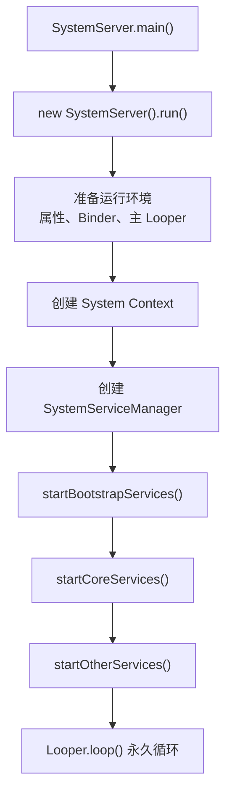
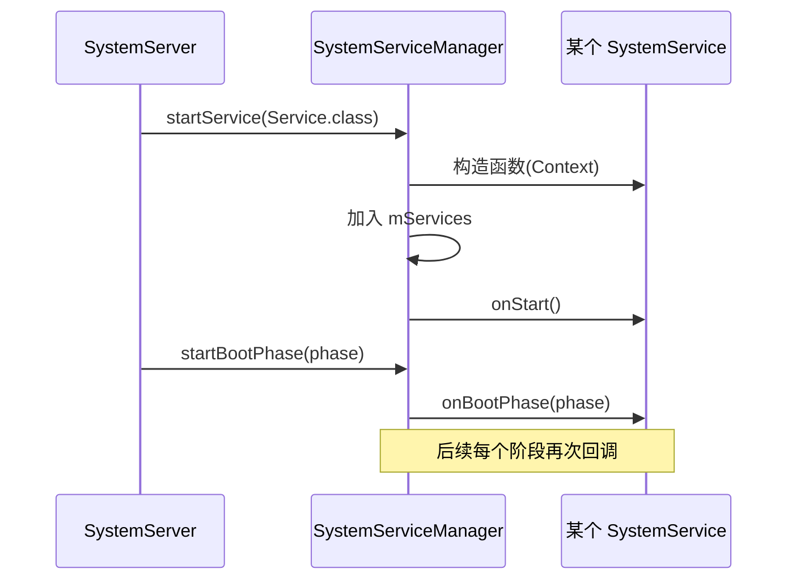
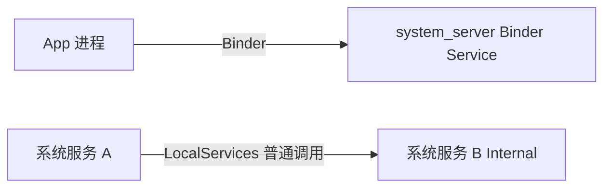
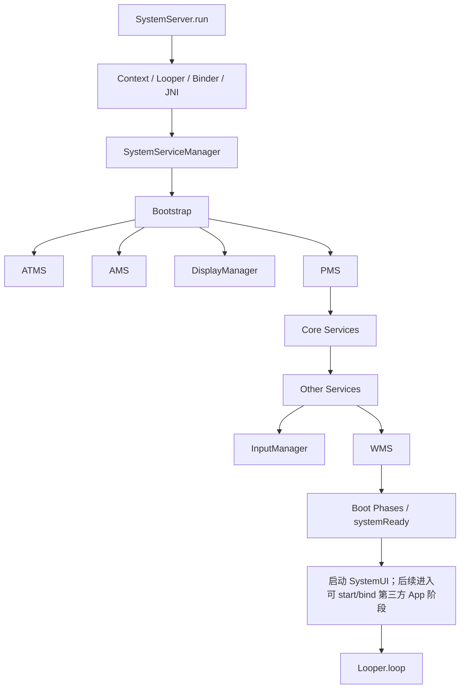

# 06 SystemServer 与系统服务

> 源码基线：Android 11 / API 30 / `android-11.0.0_r48`；本章在 macOS 上只读本地源码，不要求编译。

## 本章目标

读完后，你应该能够：

1. 从 `SystemServer.main()` 追到主线程永久消息循环。
2. 解释 Bootstrap、Core、Other 三组服务为什么按顺序启动。
3. 看懂 `SystemServiceManager.startService()` 的通用启动模板。
4. 区分构造函数、`onStart()`、`onBootPhase()` 和 `systemReady()`。
5. 找到 ATMS、AMS、PMS、WMS 的启动位置，并说出基本依赖关系。
6. 区分 Binder Service 和仅在 system_server 内使用的 Local Service。

## 1. 接上 Zygote 子进程

上一章中，Zygote fork 后的子进程通过 Runnable 进入：

```text
com.android.server.SystemServer.main()
```

源码文件：

```text
/Users/ninebot/androidSource/frameworks/base/services/java/com/android/server/SystemServer.java
```

入口非常短：

```java
public static void main(String[] args) {
    new SystemServer().run();
}
```

`SystemServer` 是 Java 启动类，`system_server` 是 Linux 进程名。这个进程承载大多数 Java Framework 系统服务。

## 2. `run()` 的整体结构

把几百行初始化压缩后，主线如下：



核心源码：

```java
createSystemContext();

mSystemServiceManager = new SystemServiceManager(mSystemContext);
LocalServices.addService(SystemServiceManager.class, mSystemServiceManager);

startBootstrapServices(t);
startCoreServices(t);
startOtherServices(t);

Looper.loop();
```

与 init 相似，system_server 也不会在启动完成后退出。它的主线程进入 `Looper.loop()`，持续处理消息。

## 3. 启动服务前准备了什么

`run()` 在启动具体服务之前会做许多进程级初始化。初读抓住以下内容即可：

### 配置 Binder

```java
Binder.setWarnOnBlocking(true);
BinderInternal.disableBackgroundScheduling(true);
BinderInternal.setMaxThreads(sMaxBinderThreads);
```

system_server 是 Binder 请求最密集的进程之一，因此要配置 Binder 线程池和调度行为。

### 准备主 Looper

```java
Process.setThreadPriority(Process.THREAD_PRIORITY_FOREGROUND);
Looper.prepareMainLooper();
```

系统服务的部分回调、Handler 工作和生命周期事件依赖这个主 Looper。

### 加载 Native 库

```java
System.loadLibrary("android_servers");
```

系统服务并非全是 Java；部分功能通过 JNI 进入 Native 实现。

### 创建 System Context

```java
createSystemContext();
```

系统服务也需要 Context 来访问资源、注册广播、检查权限和获取其他服务，但这里创建的是系统进程使用的特殊 Context。

### 创建服务管理器

```java
mSystemServiceManager = new SystemServiceManager(mSystemContext);
```

它统一创建服务并分发生命周期事件。注意它不是 Binder 的 `android.os.ServiceManager`，二者名字相似但职责不同。

## 4. 三个容易混淆的 Manager

| 名称 | 位置/范围 | 作用 |
|---|---|---|
| `SystemServer` | system_server 启动入口 | 安排整个系统服务启动顺序 |
| `SystemServiceManager` | system_server 内部 | 创建 `SystemService`、调用生命周期 |
| `ServiceManager` | Binder 服务注册中心 API | 让其他进程按名字获得 Binder 服务 |

记忆方法：

- SystemServer 像总导演。
- SystemServiceManager 像内部项目经理。
- Binder ServiceManager 像对外通讯录。

## 5. 为什么分 Bootstrap、Core、Other

源码依次调用：

```java
startBootstrapServices(t);
startCoreServices(t);
startOtherServices(t);
```

### Bootstrap Services

让系统“站起来”所必需、依赖关系紧密的服务。例如 Installer、ATMS、AMS、PowerManager、DisplayManager、PMS。

源码注释明确说这些服务有复杂的相互依赖，因此集中按顺序初始化。

### Core Services

重要但没有卷入 Bootstrap 复杂依赖的一组核心服务，例如 BatteryService、UsageStatsService、WebViewUpdateService。

### Other Services

数量最多，包括 WMS、InputManager、网络、通知、位置、音频、剪贴板等。

“Other”不表示不重要，只表示它们不属于前两组的启动组织方式。WMS 就在这里启动。

## 6. 依赖顺序比分类名称更重要

Bootstrap 中能看到明显依赖链：


几个例子：

- Installer 先准备 `/data/user` 等关键目录，PMS 扫包时需要它。
- DisplayManager 先提供默认显示和显示指标，PMS 初始化也会用到相关配置。
- PMS 先扫描并建立包信息，许多后续服务才能查询系统功能、权限和应用。
- WMS 启动后再回传给 AMS/ATMS，使 Activity/Task 管理与窗口管理建立联系。

阅读 `SystemServer.java` 时，不要只记“谁先谁后”，要读它附近的英文注释，寻找依赖原因。

## 7. `SystemServiceManager.startService()`

源码：

```text
/Users/ninebot/androidSource/frameworks/base/services/core/java/com/android/server/SystemServiceManager.java
```

常见调用：

```java
mSystemServiceManager.startService(PowerManagerService.class);
```

内部主线：

```java
Constructor<T> constructor = serviceClass.getConstructor(Context.class);
T service = constructor.newInstance(mContext);
mServices.add(service);
service.onStart();
```

因此，一个符合统一框架的 SystemService 通常需要：

1. 继承 `com.android.server.SystemService`。
2. 提供接收 `Context` 的 public 构造函数。
3. 在 `onStart()` 中发布接口或完成核心初始化。
4. 按需实现 `onBootPhase()` 和用户生命周期回调。

## 8. SystemService 生命周期

基类源码：

```text
/Users/ninebot/androidSource/frameworks/base/services/core/java/com/android/server/SystemService.java
```



### 构造函数

只做对象最基础的初始化。不要假设依赖服务都已准备好。

### `onStart()`

让服务开始工作，通常在这里发布 Binder 接口和 Local 接口。

### `onBootPhase(int phase)`

随着系统能力逐步准备好，一个服务会收到多次阶段回调。它可以等到依赖真正可用时再进行下一步初始化。

### 用户生命周期

SystemService 还可接收用户启动、解锁、切换、停止等回调。Android 支持多用户，系统启动完成不等于每个用户的数据都已解锁。

基类注释指出：这些生命周期方法由 system_server 主 Looper 线程调用。因此耗时操作会阻塞其他启动或消息处理，源码中也会对耗时服务发出警告。

## 9. Boot Phase 是系统级“进度通知”

Android 11 的典型阶段：

| 值 | 常量 | 含义 |
|---:|---|---|
| 100 | `PHASE_WAIT_FOR_DEFAULT_DISPLAY` | 等待默认显示可用 |
| 480 | `PHASE_LOCK_SETTINGS_READY` | 锁屏设置数据可用 |
| 500 | `PHASE_SYSTEM_SERVICES_READY` | 核心系统服务可安全访问 |
| 520 | `PHASE_DEVICE_SPECIFIC_SERVICES_READY` | 设备特有服务准备好 |
| 550 | `PHASE_ACTIVITY_MANAGER_READY` | 可发送广播等 |
| 600 | `PHASE_THIRD_PARTY_APPS_CAN_START` | 可启动/绑定第三方应用 |
| 1000 | `PHASE_BOOT_COMPLETED` | SystemService 的最后 boot phase；按基类契约，服务可在此后允许用户交互 |

`SystemServiceManager.startBootPhase()` 会遍历当时已经登记的服务：

```java
for (int i = 0; i < mServices.size(); i++) {
    mServices.get(i).onBootPhase(mCurrentPhase);
}
```

阶段必须递增，不能从 600 倒退回 500。这使依赖关系成为明确的单向启动过程。

`PHASE_BOOT_COMPLETED` 的名字很容易被误当成“开机的唯一硬完成证据”。r48 中它由 AMS `finishBooting()` 推进，首先表示 SystemService 收到了这个回调阶段。它不等同于：

- `sys.boot_completed=1` 已经写入（r48 在该 phase 之后才写此 property）。
- 某个用户的 `LOCKED_BOOT_COMPLETED` / `BOOT_COMPLETED` 所有 Receiver 已全部执行完。
- Launcher 的首帧已经由 SurfaceFlinger present 到显示器。

因此诊断开机要分别观察 boot phase、system property、用户解锁/广播和显示首帧，不能用一个 1000 覆盖全部时序。

## 10. Binder Service 与 Local Service

系统服务可能发布两种不同接口。

### Binder Service

供其他进程调用：

```java
publishBinderService("example", binderService);
// 或
ServiceManager.addService("example", binderService);
```

客户端通过 Binder 跨进程访问。参数需要序列化，调用受到 Binder 线程、权限和进程死亡等因素影响。

### Local Service

只供 system_server 内其他模块调用：

```java
publishLocalService(ExampleInternal.class, localService);
// 获取
LocalServices.getService(ExampleInternal.class);
```

这是同一进程内的普通对象调用，不经过 Binder。常以 `XxxInternal` 类型暴露特权内部能力。



判断是否跨进程，不能只看“Service”这个词；要看注册到 `ServiceManager` 还是 `LocalServices`。

## 11. ATMS 与 AMS 在哪里启动

位于 `startBootstrapServices()`：

```java
ActivityTaskManagerService atm = mSystemServiceManager.startService(
        ActivityTaskManagerService.Lifecycle.class).getService();

mActivityManagerService = ActivityManagerService.Lifecycle.startService(
        mSystemServiceManager, atm);
```

Android 11 中：

- ATMS 主要管理 Activity、Task、Activity 栈以及相关窗口容器状态。
- AMS 主要管理进程、Service、Broadcast、Provider 等系统状态。

二者关系紧密，所以启动时显式把 ATMS 传给 AMS。

这里的 `Lifecycle` 是一个 SystemService 包装器。真正的 ATMS/AMS 类历史悠久，并不完全按标准 SystemService 形式编写，通过 Lifecycle 适配统一启动框架。

## 12. PMS 在哪里启动

仍位于 Bootstrap：

```java
mPackageManagerService = PackageManagerService.main(
        mSystemContext,
        installer,
        mFactoryTestMode != FactoryTest.FACTORY_TEST_OFF,
        mOnlyCore);
```

PMS 启动工作很重，包括读取配置、扫描系统包和数据分区应用、建立包与权限信息等。因此源码在 `try/finally` 中临时调用 `Watchdog.pauseWatchingCurrentThread("packagemanagermain")`，并在返回或抛异常后 `resumeWatchingCurrentThread()`。这是明确的启动期特例，不是 PMS 永远不受 Watchdog 监控。

PMS 后面还会调用：

```java
mPackageManagerService.systemReady();
```

“对象已创建”和“整个系统已经具备它的全部依赖”是两个不同状态。

## 13. WMS 在哪里启动

WMS 位于 `startOtherServices()`：

```java
inputManager = new InputManagerService(context);

wm = WindowManagerService.main(
        context,
        inputManager,
        !mFirstBoot,
        mOnlyCore,
        new PhoneWindowManager(),
        mActivityManagerService.mActivityTaskManager);

ServiceManager.addService(Context.WINDOW_SERVICE, wm, ...);
ServiceManager.addService(Context.INPUT_SERVICE, inputManager, ...);

mActivityManagerService.setWindowManager(wm);
wm.onInitReady();
```

这里能看到明确连接：

- WMS 需要 InputManager。
- WMS 持有 ATMS 相关能力。
- AMS/ATMS 后续获得 WMS 引用。
- WMS 和 InputManager 的 Binder 接口注册到 ServiceManager。

这为后面的 Activity 和窗口学习埋下主线：Activity 调度由 ATMS 负责，真正窗口组织由 WMS 负责，但二者必须紧密协作。

## 14. `systemReady()` 与 `onBootPhase()`

你会同时看到：

```java
mSystemServiceManager.startBootPhase(...);
wm.systemReady();
mPackageManagerService.systemReady();
mActivityManagerService.systemReady(...);
```

二者区别：

- `onBootPhase()`：统一 SystemService 框架的广播式生命周期回调。
- `systemReady()`：某些大型历史服务自己定义的专用就绪入口。

Android Framework 长期演进，代码并非一次性按完全统一的框架设计，因此新旧生命周期模式会并存。不要误以为每个服务都有完全相同的启动形式。

## 15. 什么时候可以启动第三方应用

系统服务对象创建完，并不意味着普通 App 可以立刻运行。后面还需要让 WMS、PMS、AMS 和网络等服务进入 ready 状态。

关键流程：

```java
mActivityManagerService.systemReady(() -> {
    mSystemServiceManager.startBootPhase(
            t, SystemService.PHASE_ACTIVITY_MANAGER_READY);

    startSystemUi(context, windowManagerF);

    mPackageManagerService.waitForAppDataPrepared();

    mSystemServiceManager.startBootPhase(
            t, SystemService.PHASE_THIRD_PARTY_APPS_CAN_START);
});
```

这表达了一个重要原则：只有关键依赖、包数据和权限环境准备好之后，系统才进入允许第三方服务被 start/bind 的 boot phase。这是对 SystemService 的生命周期许可信号，并不代表此时所有第三方 App 都会立即创建进程。

`startSystemUi()` 出现在 `PHASE_ACTIVITY_MANAGER_READY` 附近，SystemUI 是受信任的系统应用，不是“第三方 App”的例子。`PHASE_BOOT_COMPLETED` 则在 AMS `finishBooting()` 后续发出，不是这个 lambda 一进入就立即发出。

## 16. SystemServer 为什么进入 `Looper.loop()`

启动流程末尾：

```java
Looper.loop();
throw new RuntimeException("Main thread loop unexpectedly exited");
```

正常情况下 `Looper.loop()` 永远不返回。system_server 主线程需要继续：

- 处理 Handler 消息。
- 接收部分服务生命周期和异步回调。
- 协调各系统服务。

如果主 Looper 意外退出，system_server 已无法正常工作，因此直接视为致命错误。

Binder 请求通常由 Binder 线程池处理，而不是全部在主线程处理。以后读某个系统服务方法时，还要继续确认它运行在 Binder 线程、主线程还是专用工作线程。

## 17. 本章调用地图



## 18. 实际阅读练习

### 练习一：抓住 `run()` 骨架

```bash
cd /Users/ninebot/androidSource
rg -n 'createSystemContext|new SystemServiceManager|startBootstrapServices|startCoreServices|startOtherServices|Looper.loop' \
  frameworks/base/services/java/com/android/server/SystemServer.java
```

回答：System Context 和 SystemServiceManager 谁先创建？

### 练习二：观察统一服务启动模板

```bash
rg -n 'startService\(|newInstance|mServices.add|service.onStart' \
  frameworks/base/services/core/java/com/android/server/SystemServiceManager.java
```

回答：为什么服务构造函数必须接收 Context？

### 练习三：定位四大服务

```bash
rg -n 'StartActivityManager|StartPackageManagerService|StartWindowManagerService' \
  frameworks/base/services/java/com/android/server/SystemServer.java
```

回答：ATMS/AMS、PMS、WMS 分别属于哪一组？

### 练习四：追踪 Boot Phase

```bash
rg -n 'PHASE_.*=' frameworks/base/services/core/java/com/android/server/SystemService.java
rg -n 'startBootPhase' frameworks/base/services/java/com/android/server/SystemServer.java
```

回答：第三方应用可以启动前，系统发出了哪个阶段？

### 练习五：区分两种服务注册

```bash
rg -n 'ServiceManager.addService|LocalServices.addService' \
  frameworks/base/services/java/com/android/server/SystemServer.java | head -30
```

回答：哪一种注册可以被其他进程通过 Binder 访问？

## 19. 常见误区

### “所有系统服务都继承 SystemService”

不一定。历史大型服务可能使用 `main()`、`Lifecycle` 包装器或手动创建方式。

### “startService 返回就表示服务完全 ready”

不一定。服务还可能等待 Boot Phase、其他服务的 `systemReady()` 或异步初始化完成。

### “Core Services 一定比 Other Services 中每个服务都重要”

错误。分组主要服务于启动依赖和代码组织。

### “ServiceManager 与 SystemServiceManager 是同一个东西”

错误。前者负责 Binder 名称注册和查询，后者管理 system_server 内的服务生命周期。

### “system_server 只有一个线程”

错误。它有主 Looper、Binder 线程池、初始化线程池和许多服务自建线程。

## 本章检查题

1. `SystemServer.run()` 在启动服务前准备哪些关键环境？
2. 三组服务各自的定位是什么？
3. `SystemServiceManager.startService()` 依次做了什么？
4. Binder Service 与 Local Service 有什么不同？
5. ATMS 为什么先于 AMS 创建？
6. PMS 为什么要等 Installer 和默认 Display？
7. WMS 与 InputManager、ATMS 如何建立关系？
8. `onBootPhase()` 与专用 `systemReady()` 为什么会并存？

## 完成标准

不看文档，能够画出：

```text
SystemServer.main
 → run
 → 创建 Context / Looper / SystemServiceManager
 → Bootstrap（ATMS、AMS、PMS...）
 → Core
 → Other（WMS...）
 → Boot Phase / systemReady
 → 允许第三方应用
 → Looper.loop
```

并能说明 SystemServiceManager 与 Binder ServiceManager 的区别。完成后进入第 07 章：Binder 如何让 App 调用 system_server 中的服务。
