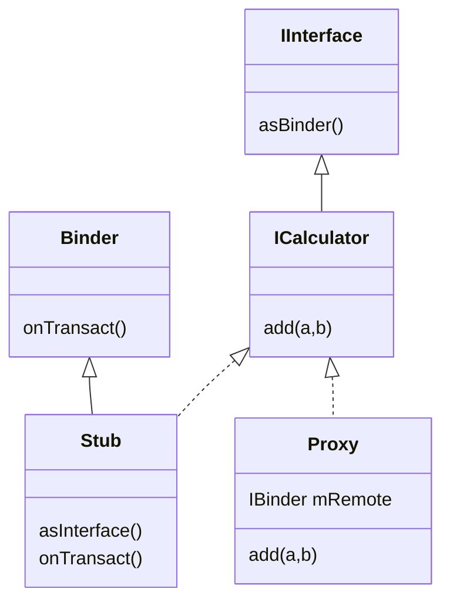
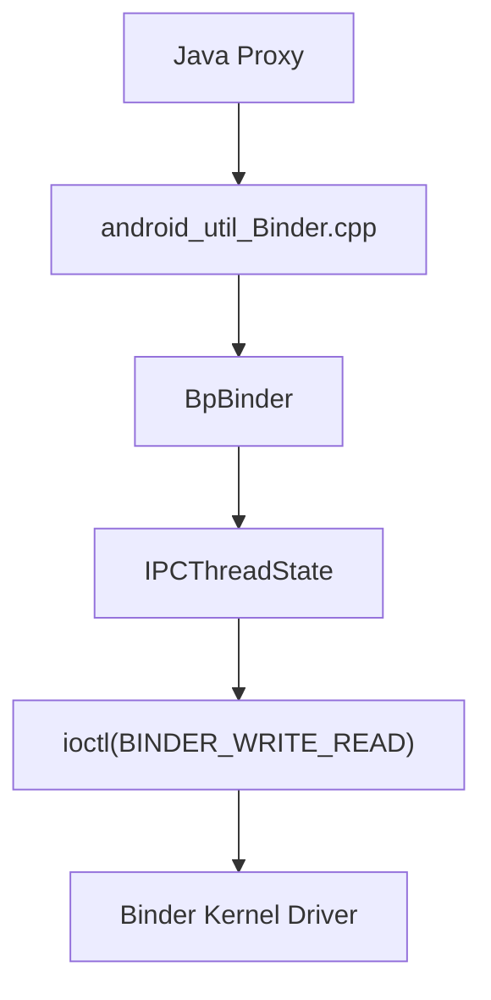
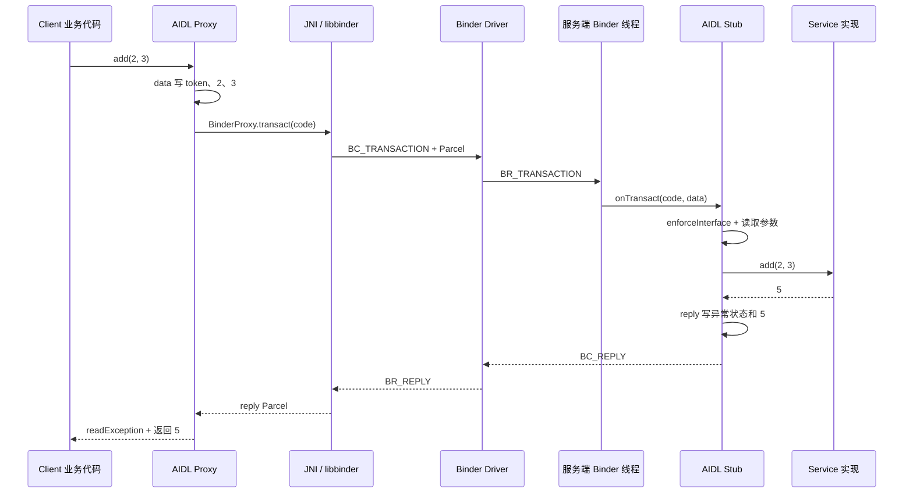
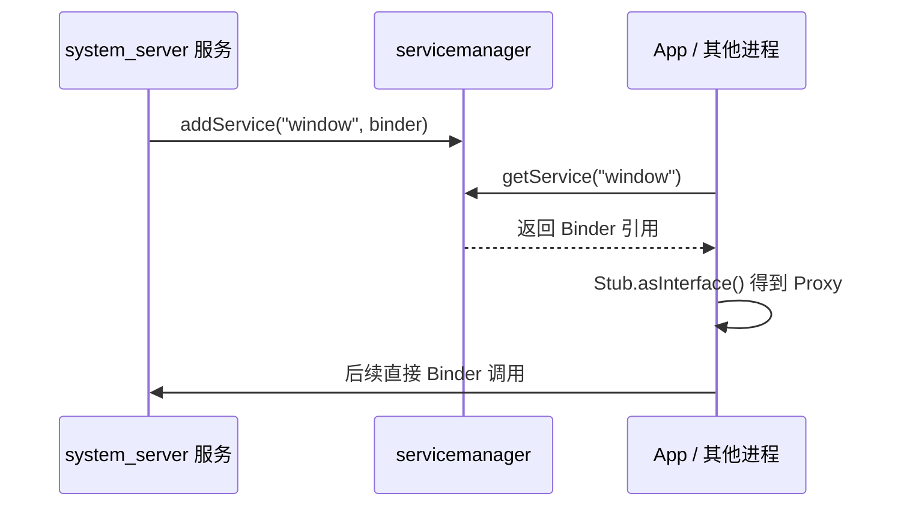
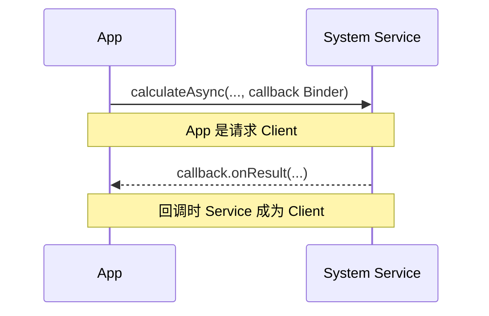

# 07 Binder 基础与完整调用链

## 本章目标

Binder 是后续 Activity、Service、PMS、WMS 等源码的共同骨架。本章会比前几章更细。读完后，你应该能够：

1. 解释 Client、Proxy、Binder Driver、Stub、Service 的职责。
2. 看懂一份 AIDL 生成代码的关键结构。
3. 从 Java Proxy 追到 JNI、libbinder、驱动，再回到服务端 `onTransact()`。
4. 理解 Parcel、transaction code、interface token 的作用。
5. 区分同步 Binder、`oneway`、Binder 线程和应用主线程。
6. 理解 ServiceManager 如何帮助客户端找到服务。
7. 理解权限校验、调用者身份、死亡通知和常见性能风险。

## 1. Binder 要解决什么问题

不同 Linux 进程拥有相互隔离的虚拟地址空间。App 进程中的对象引用不能直接指向 system_server 中的 Java 对象。

例如：

```java
activityTaskManager.startActivity(...);
```

如果 `activityTaskManager` 的真正实现位于另一个进程，这条语句必须解决：

- 如何找到目标服务。
- 如何描述要调用的方法。
- 如何把参数从客户端进程传给服务端进程。
- 服务端用哪个线程处理。
- 如何把结果或异常传回来。
- 如何确认调用者的 UID/PID 并检查权限。
- 服务进程死亡后客户端如何得知。

Binder 是 Android 为这组问题建立的一整套 IPC 机制，而不只是一个驱动文件。

## 2. 先记住五个角色


| 角色 | 所在位置 | 核心职责 |
|---|---|---|
| Client | 客户端进程 | 调用接口，希望获得结果 |
| Proxy | 客户端进程 | 把方法调用编码为 Binder 事务 |
| Binder Driver | Linux 内核 | 根据 Binder 引用传递事务、线程调度信息和身份 |
| Stub | 服务端进程 | 解码事务并按 code 调用具体方法 |
| Service | 服务端进程 | 执行业务逻辑 |

Proxy 和 Stub 让跨进程调用在业务层“看起来像普通方法调用”，但它仍然具有跨进程的延迟、失败、线程和数据大小约束。

## 3. 用最小 AIDL 例子建立直觉

假设定义：

```aidl
package com.example.calc;

interface ICalculator {
    int add(int a, int b);
}
```

AIDL 编译器会生成类似下面的结构。以下代码为了教学进行了删减：

```java
public interface ICalculator extends IInterface {
    int add(int a, int b) throws RemoteException;

    abstract class Stub extends Binder implements ICalculator {
        static final String DESCRIPTOR = "com.example.calc.ICalculator";
        static final int TRANSACTION_add = IBinder.FIRST_CALL_TRANSACTION;

        public static ICalculator asInterface(IBinder obj) {
            if (obj == null) return null;
            IInterface local = obj.queryLocalInterface(DESCRIPTOR);
            if (local instanceof ICalculator) {
                return (ICalculator) local;
            }
            return new Proxy(obj);
        }

        @Override
        protected boolean onTransact(int code, Parcel data,
                Parcel reply, int flags) throws RemoteException {
            if (code == TRANSACTION_add) {
                data.enforceInterface(DESCRIPTOR);
                int a = data.readInt();
                int b = data.readInt();
                int result = add(a, b);
                reply.writeNoException();
                reply.writeInt(result);
                return true;
            }
            return super.onTransact(code, data, reply, flags);
        }

        private static class Proxy implements ICalculator {
            private final IBinder mRemote;

            @Override
            public int add(int a, int b) throws RemoteException {
                Parcel data = Parcel.obtain();
                Parcel reply = Parcel.obtain();
                try {
                    data.writeInterfaceToken(DESCRIPTOR);
                    data.writeInt(a);
                    data.writeInt(b);
                    mRemote.transact(TRANSACTION_add, data, reply, 0);
                    reply.readException();
                    return reply.readInt();
                } finally {
                    reply.recycle();
                    data.recycle();
                }
            }
        }
    }
}
```

不要背代码，先看对称关系：

| 客户端 Proxy 写入 | 服务端 Stub 读取 |
|---|---|
| `writeInterfaceToken()` | `enforceInterface()` |
| `writeInt(a)` | `readInt()` |
| `writeInt(b)` | `readInt()` |
| `transact(TRANSACTION_add)` | `onTransact(code)` 分支 |
| `reply.readException()` | `reply.writeNoException()` |
| `reply.readInt()` | `reply.writeInt(result)` |

读写顺序必须一致。Parcel 不是按变量名查值，而是按序列化布局依次读写。

## 4. AIDL 各类型的关系



- `IInterface`：Binder 接口对象的共同父接口。
- `IBinder`：更底层的 Binder 能力，如 `transact()`、死亡通知。
- `Stub`：既是 `Binder`，又实现业务接口。
- `Proxy`：实现同一个业务接口，但内部持有远端 `IBinder`。

业务代码面向 `ICalculator`，因此同进程可能拿到 Stub，跨进程则拿到 Proxy，调用形式保持一致。

## 5. `asInterface()`：判断是否真的需要 IPC

这是 AIDL 生成代码中非常关键却容易被略过的方法：

```java
IInterface local = obj.queryLocalInterface(DESCRIPTOR);
if (local instanceof ICalculator) {
    return (ICalculator) local;
}
return new Proxy(obj);
```

分两种情况：

### 服务与调用者在同一进程

`queryLocalInterface()` 可以获得本地 Stub/实现对象，随后调用是普通 Java 调用，不经过驱动。

### 服务与调用者在不同进程

客户端手中是 `BinderProxy`，查询不到本地实现，于是包装为 AIDL Proxy，调用会进入 `transact()`。

因此“调用 AIDL 接口”不必然等于跨进程；是否走 Binder 驱动取决于对象是否远端。

## 6. Transaction Code：方法编号

驱动不理解 Java 方法名 `add`，它传递的是整数事务码：

```java
static final int TRANSACTION_add = IBinder.FIRST_CALL_TRANSACTION + 0;
```

Proxy 发送 code，Stub 的 `onTransact()` 按 code 分发。

`IBinder.java` 中定义：

```java
int FIRST_CALL_TRANSACTION = 0x00000001;
```

接口方法变化时，客户端和服务端必须使用兼容的接口定义。稳定 AIDL 还会采用更明确的版本化规则。

## 7. Interface Token：你在调用谁

Proxy 通常先写：

```java
data.writeInterfaceToken(DESCRIPTOR);
```

Stub 则执行：

```java
data.enforceInterface(DESCRIPTOR);
```

它用于确认收到的数据属于预期 Binder 接口，避免同一个 Binder 对象错误解释其他接口格式的数据。它不是完整权限系统；真正访问控制还要检查 UID、权限、SELinux 等。

## 8. Parcel 到底是什么

Parcel 是针对 Binder IPC 优化的二进制序列化容器，可以写入：

- 基本类型和 String。
- 数组、List 等受支持容器。
- `Parcelable` 对象。
- 文件描述符。
- Binder 对象引用。

### Parcelable 不等于 Serializable

Parcelable 显式控制字段写入和读取，更适合 Android IPC 的性能与格式要求。发送对象时不是把对方进程里的 Java 引用直接传过去，而是将数据重建到对方进程。

### Binder 引用是特殊情况

Parcel 中可以携带 Binder 对象。驱动会将本进程的 Binder 实体转换成接收进程可使用的 Binder 句柄/代理，从而支持回调接口。

### 大小限制

Binder 事务缓冲区有限，并由进程中并发事务共享。传大 Bitmap、大数组或超大 Bundle 可能触发 `TransactionTooLargeException`。Binder 适合控制消息和中小型结构化数据，不适合当大文件传输通道。

大数据通常考虑文件描述符、共享内存、数据库/文件或分批传输，并只通过 Binder 传控制信息。

## 9. 一次 Java Binder 调用的上半程

Android 11 Java 层重要文件：

```text
frameworks/base/core/java/android/os/IBinder.java
frameworks/base/core/java/android/os/Binder.java
frameworks/base/core/java/android/os/Parcel.java
```

客户端调用大致为：

```text
AIDL Proxy 方法
 → Parcel 写参数
 → BinderProxy.transact()
 → transactNative()
```

`BinderProxy` 是 Java 对远端 Binder 引用的包装。`transactNative()` 是 native 方法，调用进入 JNI：

```text
frameworks/base/core/jni/android_util_Binder.cpp
```

Native 函数：

```cpp
static jboolean android_os_BinderProxy_transact(...) {
    Parcel* data = parcelForJavaObject(env, dataObj);
    Parcel* reply = parcelForJavaObject(env, replyObj);
    IBinder* target = getBPNativeData(env, obj)->mObject.get();
    status_t err = target->transact(code, *data, reply, flags);
    ...
}
```

这里把 Java Parcel 映射到 Native Parcel，并继续调用 Native `IBinder::transact()`。

## 10. Native 客户端：BpBinder 与 IPCThreadState

跨进程目标在 Native 层通常表现为 `BpBinder`：

- `Bp` 可理解为 Binder Proxy。
- `BBinder` 是 Native 服务端 Binder 基类。

调用继续进入：

```text
BpBinder::transact()
 → IPCThreadState::transact()
 → writeTransactionData(BC_TRANSACTION, ...)
 → talkWithDriver()
```

源码：

```text
frameworks/native/libs/binder/BpBinder.cpp
frameworks/native/libs/binder/IPCThreadState.cpp
frameworks/native/libs/binder/ProcessState.cpp
```

`IPCThreadState` 表示当前线程的 Binder IPC 状态，管理发往驱动和从驱动收到的命令缓冲区。

同步调用的关键代码逻辑：

```cpp
writeTransactionData(BC_TRANSACTION, flags, handle, code, data, nullptr);

if ((flags & TF_ONE_WAY) == 0) {
    err = waitForResponse(reply);
} else {
    err = waitForResponse(nullptr, nullptr);
}
```

同步事务要等待 reply；oneway 不等待业务返回数据，但仍需要把命令正确交给驱动。

## 11. 真正进入内核的位置

`IPCThreadState::talkWithDriver()` 组织 `binder_write_read` 后执行：

```cpp
ioctl(mProcess->mDriverFD, BINDER_WRITE_READ, &bwr)
```

这是用户空间进入 Binder 驱动的关键系统调用。



`BC_TRANSACTION` 可以理解为用户空间发给驱动的“我要发起事务”命令；驱动交给目标线程后，服务端用户空间会收到 `BR_TRANSACTION`。

- `BC_*`：Binder Command，用户空间发给驱动。
- `BR_*`：Binder Return，驱动返回给用户空间。

## 12. 驱动大致做什么

Binder 驱动不会执行业务方法，它主要负责：

1. 根据客户端持有的 handle 找到目标 Binder 节点和进程。
2. 记录真实调用者 PID/UID 等身份信息。
3. 将事务数据安排给目标进程的 Binder 线程。
4. 管理 Binder 对象、引用计数和死亡关系。
5. 同步调用时协调客户端等待服务端 reply。

概念上：

```text
客户端中的 handle
 → 驱动中的 Binder 引用关系
 → 服务端中的 Binder 实体对象
```

客户端拿到的不是服务端内存地址。句柄只有结合当前进程及驱动维护的映射才有意义。

## 13. 服务端下半程

服务端 Binder 线程从驱动收到 `BR_TRANSACTION`，Native 层大致执行：

```text
IPCThreadState::executeCommand(BR_TRANSACTION)
 → 找到 BBinder
 → BBinder::transact()
 → JavaBBinder::onTransact()
 → Binder.execTransact()
 → Stub.onTransact()
 → 业务 Service 方法
```

`IPCThreadState.cpp` 中会从驱动数据构造 Parcel，并设置当前调用者身份：

```cpp
mCallingPid = tr.sender_pid;
mCallingUid = tr.sender_euid;
```

随后调用目标：

```cpp
reinterpret_cast<BBinder*>(tr.cookie)->transact(
        tr.code, buffer, &reply, tr.flags);
```

对于 Java 服务，JNI 桥最终调用 `Binder.execTransact()`，它再执行 Java Binder 对象的 `onTransact()`。AIDL Stub 在这里按 transaction code 解包并调用业务实现。

## 14. 完整往返时序



## 15. 同步调用与 `oneway`

`IBinder` 定义：

```java
int FLAG_ONEWAY = 0x00000001;
```

### 同步 Binder

默认调用是同步的：客户端线程发出请求后等待服务端执行并返回结果或异常。

风险：如果在 App 主线程调用慢服务，UI 会卡顿，严重时出现 ANR；如果持锁跨进程同步调用，还可能形成跨进程死锁链。

### `oneway`

AIDL 方法可声明：

```aidl
oneway void notifyChanged(int value);
```

客户端不等待业务返回值，服务端异步接收。oneway 方法不能依赖普通返回值来确认业务已执行完。

重要：oneway 不是“开启一个客户端新线程”，也不是“绝对不会阻塞”。发送仍有序列化、驱动队列和缓冲区成本；队列拥塞等情况仍可能造成延迟。

## 16. Binder 线程不是主线程

当 system_server 收到 Binder 请求，通常由 Binder 线程池中的线程处理。日志里常见类似：

```text
Binder:1234_1
Binder:1234_2
```

所以服务方法必须考虑：

- 多个 Binder 线程可能并发调用。
- 共享状态需要正确同步。
- 如果逻辑必须在主线程执行，要通过 Handler 切换。
- 切到主线程后同步等待结果，仍可能阻塞客户端。


以后每读一个 Binder 方法，都问：它直接在哪个线程运行？有没有切 Handler？锁跨越了哪些调用？

## 17. ServiceManager：Binder 服务通讯录

Binder 驱动能传递事务，但客户端仍要先获得目标服务引用。ServiceManager 负责按名称登记和查询 Binder 服务。

服务端发布：

```java
ServiceManager.addService(Context.WINDOW_SERVICE, wm);
```

客户端查询：

```java
IBinder binder = ServiceManager.getService(Context.WINDOW_SERVICE);
IWindowManager service = IWindowManager.Stub.asInterface(binder);
```



注意最后一步：ServiceManager 主要负责发现。客户端获得服务 Binder 后，普通业务事务不需要每次再经过 servicemanager。

## 18. ServiceManager 为什么特殊

“要通过 Binder 查询 ServiceManager，但还没有 ServiceManager 的 Binder 引用”看起来像鸡生蛋问题。

Binder 驱动保留了 Context Manager 这个特殊角色。servicemanager 启动时调用：

```cpp
ps->becomeContextManager(nullptr, nullptr);
```

其他进程通过约定的 context object 获得它。Android 11 Native 入口位于：

```text
frameworks/native/cmds/servicemanager/main.cpp
```

Java 查询入口位于：

```text
frameworks/base/core/java/android/os/ServiceManager.java
frameworks/base/core/java/android/os/ServiceManagerNative.java
```

不要把这里的 servicemanager 与上一章的 `SystemServiceManager` 混淆。

## 19. 服务获取后的包装层

App 很少直接写 `ServiceManager.getService()`。常见结构是：

```text
Context.getSystemService()
 → XxxManager
 → 缓存的 AIDL 接口 Proxy
 → Binder
 → system_server 的 XxxService
```

例如 Manager 是面向 App 的易用 API：处理参数、兼容性、缓存和异常；AIDL 接口是 IPC 契约；Service 是系统端实现。

这三层不要混为一谈：

| 层 | 常见命名 | 面向对象 |
|---|---|---|
| SDK API 包装 | `XxxManager` | App 开发者 |
| IPC 契约 | `IXxxService.aidl` | 客户端与服务端 |
| 系统实现 | `XxxService` | system_server 内部 |

## 20. 调用者身份与权限

服务端不能相信 Parcel 里由客户端自己填写的“我是某 UID”。Binder 驱动记录真实调用者，服务端可以获取：

```java
int uid = Binder.getCallingUid();
int pid = Binder.getCallingPid();
```

常见权限检查：

```java
mContext.enforceCallingOrSelfPermission(
        android.Manifest.permission.SOME_PERMISSION,
        "Requires SOME_PERMISSION");
```

也可能手动检查 UID、AppOps、用户范围或包名归属。

### `clearCallingIdentity()`

服务处理 Binder 请求期间，线程带有远端调用者身份。有时服务需要以 system_server 自己的身份调用下游能力：

```java
long token = Binder.clearCallingIdentity();
try {
    // 以本进程身份执行必要操作
} finally {
    Binder.restoreCallingIdentity(token);
}
```

必须在 `finally` 恢复。忘记恢复会污染同一 Binder 线程后续任务的身份语义，造成权限问题。

同时不能为了“方便”随意清除身份；这会形成 confused deputy（代理人权限滥用）风险。正确顺序通常是先基于调用者身份完成权限校验，再在严格限定范围内清除身份。

## 21. 异常如何跨进程

同步 AIDL 调用中，Stub 将成功/异常状态写入 reply：

```java
reply.writeNoException();
```

Proxy 读取：

```java
reply.readException();
```

并非任意 Throwable 都能原样跨进程重建。AIDL/Binder 对可传递异常有规则，远端进程死亡通常表现为 `DeadObjectException`，它是 `RemoteException` 的子类。

Framework 内部代码有时把 RemoteException 转换成系统服务不可用时的运行时异常，但普通跨进程接口仍应把失败视为正常分支，而不是认为远端调用永不失败。

## 22. 死亡通知 `linkToDeath()`

持有远端 Binder 的客户端可以注册：

```java
binder.linkToDeath(() -> {
    // 远端 Binder 所在进程死亡
}, 0);
```

用途包括：

- 清理与死亡客户端关联的资源。
- 移除失效回调。
- 标记服务断开并尝试重新获取。

`DeathRecipient` 通知的是 Binder 实体死亡，不等于某个业务请求失败回调。还要用 `unlinkToDeath()` 解除不再需要的监听，避免资源长期关联。

服务端也常对客户端传入的回调 Binder 注册死亡通知，这样客户端崩溃后可清理 session、窗口、媒体资源等。

## 23. 回调也是 Binder

AIDL 参数可以是另一个 AIDL 接口：

```aidl
interface IResultCallback {
    oneway void onResult(int value);
}

interface ICalculator {
    void calculateAsync(int a, int b, IResultCallback callback);
}
```

Client 把 callback Stub 传给服务；驱动让服务端拿到 callback Proxy。随后方向反转：服务端成为调用方，客户端成为回调接收方。



因此 Binder 的 Client/Server 是相对于某一次接口调用而言，不是进程永远固定的身份。

## 24. Binder 引用与进程生命周期

Binder 驱动维护对象引用关系，Native libbinder 使用强弱引用与驱动命令协作。概念上：

- 服务端持有 Binder 实体。
- 客户端持有远端代理。
- 驱动知道哪些进程引用哪些节点。
- 引用和进程死亡会触发对应清理与通知。

不要把它简单等同于 Java GC。Java 对象可达性、Native `sp/wp` 引用和驱动 Binder 引用是相关但不同的层次。

## 25. 常见性能与死锁问题

### 主线程同步 Binder

客户端主线程等待慢服务，会直接造成掉帧或 ANR。

### 服务端 Binder 线程做长任务

会占满线程池，使其他请求排队，表现为系统范围的卡顿。

### 持锁跨 Binder 调用

危险模式：

```text
进程 A 持有锁 LA → 同步调用 B
进程 B 持有锁 LB → 回调 A 并等待 LA
```

这样会跨进程死锁。常见原则是避免持内部锁进行不受控的远端调用。

### 频繁细粒度调用

每次 IPC 都有线程切换、序列化和调度成本。循环中发起成百上千次小 Binder 调用，可能比一次批量接口慢得多。

### 大 Parcel

可能耗尽共享事务缓冲区，而且多个同时进行的事务会互相影响。

### 忽略调用者身份

既可能越权，也可能因错误身份调用下游服务而被拒绝。

## 26. 如何识别源码中的 Binder 边界

遇到以下信号时停下来标记进程边界：

- 文件后缀 `.aidl`。
- 接口名 `IXxx`。
- `Stub.asInterface(...)`。
- `extends Binder` 或 `extends IXxx.Stub`。
- `ServiceManager.getService/addService`。
- `asBinder()`、`transact()`、`onTransact()`。
- `RemoteException`。
- `Binder.getCallingUid()`。

建议在笔记里写：

```text
[App 主线程]
XxxManager.foo()
  → [Binder IPC：同步]
[system_server Binder 线程]
XxxService.foo()
  → Handler.post
[system_server 主线程]
真正状态修改
```

这种标注比只抄类名更能解释真实运行行为。

## 27. Android 11 Java 到驱动源码地图

| 层次 | 关键文件 | 建议先看的符号 |
|---|---|---|
| Java 契约 | `core/java/android/os/IBinder.java` | `transact`、`FLAG_ONEWAY` |
| Java 本地/远端对象 | `core/java/android/os/Binder.java` | `BinderProxy`、`execTransact` |
| Java 数据 | `core/java/android/os/Parcel.java` | `obtain`、读写方法 |
| JNI 桥 | `core/jni/android_util_Binder.cpp` | `android_os_BinderProxy_transact` |
| Native 代理 | `frameworks/native/libs/binder/BpBinder.cpp` | `BpBinder::transact` |
| 每线程 IPC 状态 | `frameworks/native/libs/binder/IPCThreadState.cpp` | `transact`、`talkWithDriver`、`executeCommand` |
| 每进程 Binder 状态 | `frameworks/native/libs/binder/ProcessState.cpp` | 驱动打开、线程池 |
| 服务注册中心 | `frameworks/native/cmds/servicemanager` | `main`、`addService`、`getService` |

## 28. 分层阅读，不要一次钻进驱动

建议按三遍阅读：

### 第一遍：只看 AIDL

能解释 Proxy 写什么、Stub 读什么，以及调用在哪个进程发生。

### 第二遍：追 Java/JNI/Native

找到 `BinderProxy.transact → android_util_Binder.cpp → IPCThreadState::transact → ioctl`。

### 第三遍：再研究驱动

研究 Binder node/ref、transaction stack、线程唤醒、内存映射、优先级继承等。驱动细节可以成为单独专题，不应阻塞后面的 Activity 调用链。

## 29. 实际阅读练习

### 练习一：认识 IBinder 契约

```bash
cd /Users/ninebot/androidSource
rg -n 'FIRST_CALL_TRANSACTION|FLAG_ONEWAY|transact\(|linkToDeath' \
  frameworks/base/core/java/android/os/IBinder.java
```

回答：oneway 对应哪个 flag？死亡通知属于业务 AIDL 方法吗？

### 练习二：定位 Java 接收入口

```bash
rg -n 'execTransact|onTransact\(' \
  frameworks/base/core/java/android/os/Binder.java
```

回答：AIDL Stub 为什么重写 `onTransact()`？

### 练习三：追到 JNI

```bash
rg -n 'android_os_BinderProxy_transact|target->transact' \
  frameworks/base/core/jni/android_util_Binder.cpp
```

回答：Java Parcel 怎样交给 Native？

### 练习四：找到 ioctl

```bash
rg -n 'IPCThreadState::transact|BC_TRANSACTION|BINDER_WRITE_READ|ioctl' \
  frameworks/native/libs/binder/IPCThreadState.cpp
```

回答：`BC_TRANSACTION` 和 `BR_TRANSACTION` 的方向分别是什么？

### 练习五：观察同步与 oneway 分支

```bash
sed -n '651,720p' frameworks/native/libs/binder/IPCThreadState.cpp
```

回答：哪一个分支调用 `waitForResponse(reply)`？

### 练习六：定位 ServiceManager

```bash
rg -n 'getService\(|addService\(' \
  frameworks/base/core/java/android/os/ServiceManager.java | head -30

rg -n 'becomeContextManager' \
  frameworks/native/cmds/servicemanager/main.cpp
```

回答：servicemanager 的特殊 Binder 身份怎样建立？

### 练习七：在真实接口中找 AIDL

```bash
rg --files frameworks/base | rg '/IActivityTaskManager\.aidl$'
rg -n 'startActivity' \
  frameworks/base/core/java/android/app/IActivityTaskManager.aidl | head
```

回答：Activity 启动请求为什么必然涉及 Binder？

## 30. 调试时常用的观察方式

在连接 Android 设备或模拟器后：

```bash
# 查看已注册 Binder 服务
adb shell service list

# 查看某个服务的 dumpsys 输出
adb shell dumpsys activity
adb shell dumpsys window
adb shell dumpsys package

# 查看进程和线程
adb shell ps -A -T
```

`dumpsys` 本身也通过 Binder 请求服务输出诊断信息。不同服务支持的参数不同，可先尝试：

```bash
adb shell dumpsys activity -h
```

## 31. 常见误区

### “Proxy 就是服务实现的本地副本”

错误。Proxy 只负责封装远端引用、序列化参数和发起事务，不复制业务状态。

### “Binder 方法一定运行在服务端主线程”

错误。默认通常先到 Binder 线程，是否切主线程由服务实现决定。

### “oneway 表示服务端立即执行完成”

错误。它只表示调用者不等待业务 reply，服务端可能仍在排队。

### “ServiceManager 参与每次业务调用”

错误。它主要帮助发现服务；获得引用后，客户端与目标服务直接进行 Binder 事务。

### “Parcelable 对象是把 Java 引用传到另一个进程”

错误。普通对象被序列化并在目标进程重建。

### “Binder 调用与本地方法完全相同”

错误。它可能阻塞、失败、跨线程、有大小限制，并携带安全身份。

### “getCallingUid() 在任何地方都是远端 UID”

错误。只有处理 Binder 调用的上下文才有相应调用者语义；本地调用和清除身份后结果不同。

## 本章检查题

1. Proxy、Stub 和 Driver 各自解决什么问题？
2. `asInterface()` 为什么可能返回本地对象，也可能返回 Proxy？
3. transaction code 和 interface token 分别有什么作用？
4. Parcel 的写入与读取为什么必须同序？
5. 从 `BinderProxy.transact()` 到驱动 ioctl 的调用链是什么？
6. 服务端怎样从 `BR_TRANSACTION` 最终走到 AIDL 业务方法？
7. 同步与 oneway 的等待行为有什么区别？
8. Binder 服务方法默认在哪类线程执行？
9. ServiceManager 为什么不会形成“先找到自己才能查询自己”的死循环？
10. 为什么必须谨慎使用 `clearCallingIdentity()`？
11. `linkToDeath()` 解决什么问题？
12. 为什么不应通过 Binder 直接传大文件？

## 完成标准

请不看文档画出下面两张图。

第一张是调用链：

```text
Manager/API
 → AIDL Proxy
 → Parcel
 → BinderProxy
 → JNI
 → BpBinder / IPCThreadState
 → ioctl / Driver
 → 服务端 Binder 线程
 → Java Binder.execTransact
 → AIDL Stub.onTransact
 → Service 实现
```

第二张是服务发现：

```text
服务端 addService(name, binder)
 → servicemanager 保存
 → 客户端 getService(name)
 → Stub.asInterface(binder)
 → 获得 Proxy
 → 后续直接调用目标服务
```

能准确标出进程、线程、同步等待点和 Parcel 的方向，就可以进入第 08 章：Activity 启动流程的客户端请求。

