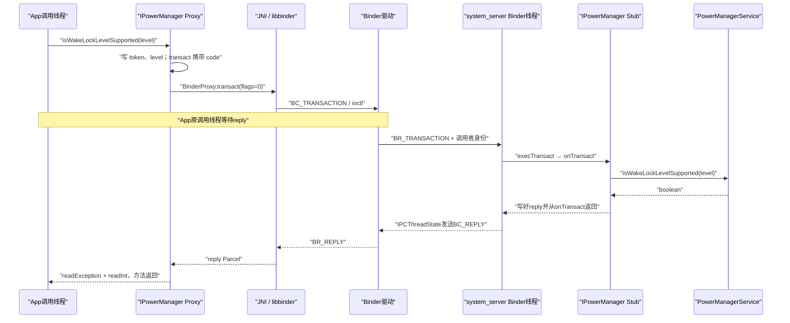

# 07 Binder 基础与完整调用链：一个 boolean 怎样跨进程返回

> 源码基线：Android 11 / API 30 / `android-11.0.0_r48`。本章只在 macOS 上阅读本地源码，不编译、不刷机。

## 先给结论

这一章只解决一个问题：**App 调用 `PowerManager.isWakeLockLevelSupported()` 时，一个看起来普通的 Java `boolean` 方法，怎样进入 `system_server`，又怎样把结果送回原调用线程？**

先记住这条主线：

```text
PowerManager
 → AIDL Proxy 写请求 Parcel
 → BinderProxy / JNI / libbinder
 → Binder 驱动把事务交给 system_server
 → Binder 工作线程进入 AIDL Stub
 → PowerManagerService 算出 boolean
 → reply Parcel 沿 Binder 返回
 → 原调用线程继续执行
```

这是一笔**同步 Binder 事务**。调用线程发出请求后，会等到以下三类结果之一：

1. 服务端正常返回 `boolean`；
2. 服务端异常被写进 reply，客户端重新抛出；
3. 传输失败或远端死亡，客户端得到 Binder 传输错误。

读完后，你应该能解决三类实际问题：

- 主线程卡在 `BinderProxy.transact()` 时，知道它在等谁；
- 看到 `IxxxService.aidl` 时，能找到真正的服务端实现；
- 阅读系统调用链时，能准确标出进程、线程、请求、reply 和完成点。

本章不会把 Binder 驱动的数据结构全部展开，也不重复第 01 章的 `oneway` 与 Service 启动。这里先把**一笔带返回值的同步调用**走完整；Binder node/ref、优先级继承和死亡通知可在后续专题继续追。

## 1. 问题：一行 Java 为什么会离开 App 进程

假设 App 想知道设备是否支持“距离传感器灭屏”这一类 WakeLock：

```java
PowerManager pm = context.getSystemService(PowerManager.class);
boolean supported = pm.isWakeLockLevelSupported(
        PowerManager.PROXIMITY_SCREEN_OFF_WAKE_LOCK);
```

如果只看调用形式，它像普通 Java 方法。但 Android 11 的 `PowerManager` 并不自己判断硬件能力：

```java
public boolean isWakeLockLevelSupported(int level) {
    try {
        return mService.isWakeLockLevelSupported(level);
    } catch (RemoteException e) {
        throw e.rethrowFromSystemServer();
    }
}
```

源码位置：

```text
frameworks/base/core/java/android/os/PowerManager.java
```

`mService` 的静态类型是 `IPowerManager`。这个名字里的 `I` 不是重点，真正的信号是它来自 AIDL：

```aidl
interface IPowerManager {
    // 省略其他方法
    boolean isWakeLockLevelSupported(int level);
}
```

源码位置：

```text
frameworks/base/core/java/android/os/IPowerManager.aidl
```

该方法有返回值，也没有声明 `oneway`，所以这里采用同步事务。调用方不能在请求刚送进驱动时就得到答案；答案必须由远端实现计算后写回。

先给这次调用建立“边界卡片”：

| 维度 | 本章场景中的事实 |
|---|---|
| Android 版本 | Android 11 r48 |
| 客户端进程 | 普通 App 进程 |
| 客户端线程 | 调用 `isWakeLockLevelSupported()` 的那条线程；可能是主线程，也可能是工作线程 |
| 服务端进程 | `system_server` |
| 服务端入口线程 | `system_server` 的 Binder 工作线程 |
| IPC 方式 | 同步 Binder，有 reply |
| 本路径是否切 Handler | 没有；服务方法直接在 Binder 工作线程读取状态并返回 |
| 本次调用完成点 | Proxy 读完 reply，`PowerManager` 把 `boolean` 返回给调用者 |

这张卡片很重要。只说“调用了 PowerManagerService”还不够，因为它没有告诉你谁在等、代码在哪条线程执行，以及什么时候才算这笔调用结束。

## 2. 调用前：客户端怎样拿到电源服务

### 为什么不能直接 `new PowerManagerService()`

真正的电源状态由 `system_server` 统一维护。每个 App 如果各自创建一份服务对象，会得到彼此冲突的状态，也没有权限直接操作系统电源。

Android 的方案是：服务端发布一个 Binder 对象，客户端按名字取得它的远端引用，再把远端引用包装成易用的 Manager。

可以把 ServiceManager 暂时理解为总机：`power` 是分机名。总机只负责让客户端拿到这条线路，不会坐在中间参与之后的每一句业务对话。

### 服务端先发布 Binder 实体

`PowerManagerService` 启动时发布 `mBinderService`：

```java
public void onStart() {
    publishBinderService(Context.POWER_SERVICE, mBinderService,
            false, DUMP_FLAG_PRIORITY_DEFAULT
                    | DUMP_FLAG_PRIORITY_CRITICAL);
    publishLocalService(PowerManagerInternal.class, mLocalService);
}
```

`publishBinderService()` 最终只是继续调用：

```java
ServiceManager.addService(
        name, service, allowIsolated, dumpPriority);
```

关键事实有两个：

1. 对 App 暴露的 Binder 服务名是 `power`，也就是 `Context.POWER_SERVICE`；
2. 发布的对象 `mBinderService` 是 `IPowerManager.Stub` 的子类，能接收 AIDL 事务。

`publishLocalService(PowerManagerInternal.class, mLocalService)` 是另一套只供 `system_server` 内部使用的本地接口，不是 App 本章所走的 Binder 入口。

### App 取得远端引用并包装成 Manager

`SystemServiceRegistry` 创建 `PowerManager` 时，真实代码的关键部分是：

```java
IBinder powerBinder = ServiceManager.getServiceOrThrow(
        Context.POWER_SERVICE);
IPowerManager powerService =
        IPowerManager.Stub.asInterface(powerBinder);
// thermalService 的获取过程省略
return new PowerManager(ctx.getOuterContext(), powerService,
        thermalService, ctx.mMainThread.getHandler());
```

为了只展示主线，上面省略了热管理服务的查询和参数细节。真实代码位于：

```text
frameworks/base/core/java/android/app/SystemServiceRegistry.java
```

这里的 `Stub.asInterface(binder)` 做一个关键判断：

- Binder 对象就在本进程：返回本地接口，之后可能是普通 Java 调用；
- Binder 对象位于其他进程：返回 AIDL Proxy，之后才走 Binder 驱动。

本章假设调用者是普通 App，服务在 `system_server`，因此 `binder` 在 App 中表现为 `BinderProxy`，`asInterface()` 返回 `IPowerManager` 的 Proxy。

Manager 创建后会保存这个 `IPowerManager` 引用。后续每次调用 `isWakeLockLevelSupported()`，不需要先让 ServiceManager 转发一遍业务请求；ServiceManager 主要解决“最初去哪里找服务”。

到这里，角色已经明确：

| 角色 | 本章中的对象 | 职责 |
|---|---|---|
| 业务入口 | `PowerManager` | 给调用者提供易用 Java API，转换远端异常 |
| 客户端代理 | `IPowerManager.Stub.Proxy` | 把方法参数编码成 Binder 事务 |
| 内核传输 | Binder 驱动 | 按句柄找到目标并传递事务 |
| 服务端分发 | `IPowerManager.Stub` | 按事务编号解包和调用实现 |
| 真实实现 | `PowerManagerService.BinderService` | 读取系统电源能力并返回结果 |

## 3. AIDL 怎样把方法变成可运输的请求

### 为什么不能把 Java 调用栈直接送过去

App 和 `system_server` 有不同的虚拟地址空间。App 中的对象地址、局部变量地址和 Java 调用栈，对 `system_server` 都没有直接意义。

AIDL 的办法不是“搬运方法”，而是让两端约定同一份协议：

- 用整数 transaction code 表示要调用哪个方法；
- 用 Parcel 按固定顺序写入参数；
- 用 interface token 确认这份数据属于哪个接口；
- 用 reply Parcel 按固定顺序写回异常状态和返回值。

### Proxy 写入请求

Android 构建时会根据 `IPowerManager.aidl` 生成 Stub/Proxy。生成文件通常位于构建产物而不是这份源码目录中。下面只保留生成代码的等价骨架，不冒充仓库里的连续源码：

```java
Parcel data = Parcel.obtain();
Parcel reply = Parcel.obtain();
data.writeInterfaceToken(DESCRIPTOR);
data.writeInt(level);
mRemote.transact(TRANSACTION_isWakeLockLevelSupported,
        data, reply, 0);
reply.readException();
boolean result = reply.readInt() != 0;
```

这里的 `flags` 是 `0`，表示普通同步 RPC，而不是 `FLAG_ONEWAY`。

调用 `transact(code, data, reply, flags)` 时，要把“事务元数据”和“请求 Parcel”分开记：

| 位置 | 本章携带什么 |
|---|---|
| `transact` 的独立参数 | 方法编号 `code`、同步/oneway 等 `flags` |
| `data` Parcel | 接口标识 `android.os.IPowerManager`、业务参数 `level` |
| `reply` Parcel | 服务端稍后写入的异常状态和 `boolean` |

transaction code 不是通过 `data.writeInt()` 写入的普通业务字段。严格说，Parcel 还包含 Binder 协议所需的数据，所以这张表表达的是阅读重点，不是逐字节布局。

### Stub 必须按相同顺序读取

服务端生成的 `onTransact()` 对应分支可概括为：

```java
data.enforceInterface(DESCRIPTOR);
int level = data.readInt();
boolean result = isWakeLockLevelSupported(level);
reply.writeNoException();
reply.writeInt(result ? 1 : 0);
return true;
```

这段对称关系比类名更值得记：

| Proxy | Stub | 作用 |
|---|---|---|
| `writeInterfaceToken()` | `enforceInterface()` | 确认接口协议 |
| `writeInt(level)` | `readInt()` | 传入参数 |
| `transact(methodCode)` | `onTransact(code)` 分支 | 选择方法 |
| `readException()` | `writeNoException()` 或写异常 | 传递调用状态 |
| `readInt()` | `writeInt()` | 传回 `boolean` |

Parcel 不是按变量名查找字段，而是依约定顺序读写。因此两端协议不一致时，可能读错数据、命中错误方法或直接失败。对于同一系统镜像里的内部 AIDL，两端生成代码来自匹配的接口定义；读源码时不要自己猜一个 transaction code 写死到业务代码里。

interface token 也不是权限检查的替代品。它证明“数据声称遵循哪个接口格式”，不证明调用者有权做某项操作。真正的访问控制通常还需要 Binder 提供的 UID/PID、Manifest 权限、AppOps 或 SELinux 规则。

## 4. 客户端为什么会停在 `transact()` 上等待

到这一步，Java Proxy 已准备好 request Parcel。下面沿真实 Android 11 代码追到用户空间与内核的分界。

### Java：`BinderProxy` 进入 native

远端 `IBinder` 在 Java 层由 `BinderProxy` 表示。它完成检查和跟踪后调用：

```java
try {
    return transactNative(code, data, reply, flags);
} finally {
    // 恢复 AppOps、监听器和 Trace 状态
}
```

源码位置：

```text
frameworks/base/core/java/android/os/BinderProxy.java
```

### JNI：从 Java 对象取出 native `IBinder`

JNI 函数把 Java Parcel 对应到 native Parcel，并调用 native Binder 对象：

```cpp
Parcel* data = parcelForJavaObject(env, dataObj);
Parcel* reply = parcelForJavaObject(env, replyObj);
IBinder* target = getBPNativeData(env, obj)->mObject.get();
status_t err = target->transact(code, *data, reply, flags);
```

源码位置：

```text
frameworks/base/core/jni/android_util_Binder.cpp
```

跨进程目标在 native 层通常由 `BpBinder` 表示。`BpBinder` 保存的不是服务端内存地址，而是当前进程可用的 Binder handle：

```cpp
status_t status = IPCThreadState::self()->transact(
        mHandle, code, data, reply, flags);
if (status == DEAD_OBJECT) mAlive = 0;
return status;
```

源码位置：

```text
frameworks/native/libs/binder/BpBinder.cpp
```

### libbinder：发送请求并等待 reply

`IPCThreadState` 保存当前线程参与 Binder IPC 所需的输入、输出缓冲和调用身份。同步分支的决定性代码是：

```cpp
err = writeTransactionData(
        BC_TRANSACTION, flags, handle, code, data, nullptr);
if ((flags & TF_ONE_WAY) == 0) {
    err = waitForResponse(reply);
} else {
    err = waitForResponse(nullptr, nullptr);
}
```

本章方法的 flags 为 `0`，所以进入 `waitForResponse(reply)`。这就是“同步”的源码证据：原调用线程不能越过这里直接拿到业务 `boolean`。

`talkWithDriver()` 最终执行：

```cpp
if (ioctl(mProcess->mDriverFD,
        BINDER_WRITE_READ, &bwr) >= 0) {
    err = NO_ERROR;
}
```

源码位置：

```text
frameworks/native/libs/binder/IPCThreadState.cpp
```

`ioctl(BINDER_WRITE_READ)` 是本章从用户空间进入 Binder 驱动的明确边界。JNI 和 libbinder 虽然是 C/C++，但仍运行在 App 的用户空间；不能把“进入 native”误说成“已经进入内核”。

Binder 驱动在这笔事务里主要做四件事：

1. 根据 App 持有的 handle 找到目标 Binder 节点和 `system_server`；
2. 记录真实发送者的 PID、UID 等身份；
3. 把事务排入目标进程可处理的队列并唤醒合适线程；
4. 对同步事务维护等待和 reply 的对应关系。

驱动不会执行 `PowerManagerService` 的 Java 代码，也不懂方法名 `isWakeLockLevelSupported`；它传递的是事务编号、数据、Binder 对象引用和元信息。

## 5. 请求到达 `system_server` 后，谁真正执行

### 先纠正一个常见误判

“到了服务端进程”不等于“到了服务端主线程”。本章的请求通常先由 `system_server` 的 Binder 工作线程接收。

Binder 工作线程在 native 层的循环可概括为：

```cpp
do {
    processPendingDerefs();
    result = getAndExecuteCommand();
} while (result != -ECONNREFUSED
        && result != -EBADF);
```

驱动向服务端用户空间交付 `BR_TRANSACTION`。`IPCThreadState::executeCommand()` 先保存原身份，再安装驱动给出的调用者身份：

```cpp
const pid_t origPid = mCallingPid;
const uid_t origUid = mCallingUid;
mCallingPid = tr.sender_pid;
mCallingUid = tr.sender_euid;
error = reinterpret_cast<BBinder*>(tr.cookie)->transact(
        tr.code, buffer, &reply, tr.flags);
```

这说明 `Binder.getCallingUid()` 的可信来源不是 App 自己往 Parcel 填的一个数字，而是驱动记录并交给接收线程的事务身份。

对于 Java Binder 服务，调用还会经过：

```text
JavaBBinder::onTransact()
 → Binder.execTransact()
 → IPowerManager.Stub.onTransact()
 → BinderService.isWakeLockLevelSupported()
```

JNI 中的关键桥接是：

```cpp
jboolean res = env->CallBooleanMethod(
        mObject, gBinderOffsets.mExecTransact,
        code, reinterpret_cast<jlong>(&data),
        reinterpret_cast<jlong>(reply), flags);
```

`Binder.execTransact()` 创建 Java Parcel 后调用当前 Binder 对象的 `onTransact()`；生成的 `IPowerManager.Stub` 再按 transaction code 进入目标方法。

### 服务端终于计算结果

真实 Binder 实现定义为：

```java
final class BinderService extends IPowerManager.Stub {
    // 省略其他 Binder 方法
}
```

目标方法没有投递 Handler，而是在当前 Binder 工作线程直接执行：

```java
public boolean isWakeLockLevelSupported(int level) {
    final long ident = Binder.clearCallingIdentity();
    try {
        return isWakeLockLevelSupportedInternal(level);
    } finally {
        Binder.restoreCallingIdentity(ident);
    }
}
```

内部实现持有 `mLock` 读取系统状态。把其他 `case` 省略后，与本章参数对应的源码分支是：

```java
synchronized (mLock) {
    switch (level) {
        // 其他 case 省略
        case PowerManager.PROXIMITY_SCREEN_OFF_WAKE_LOCK:
            return mSystemReady && mDisplayManagerInternal
                    .isProximitySensorAvailable();
        default:
            return false;
    }
}
```

源码位置：

```text
frameworks/base/services/core/java/com/android/server/power/PowerManagerService.java
```

这几行能确定四件事：

1. 结果由 `system_server` 中的真实状态决定，不是 App 本地常量计算；
2. 这里直接运行在入站 Binder 工作线程，没有自动切到主线程；
3. `synchronized (mLock)` 只是加锁，不是切线程；锁被占用时，Binder 工作线程也可能等待；
4. `clearCallingIdentity()` 改变当前 Binder 调用的身份语义，不改变进程，也不改变线程。

`clearCallingIdentity()` 后，内部代码不再以远端 App 的 Binder 调用身份继续执行；`finally` 中必须恢复。它不是获得 root 权限，也不是性能优化。若某个服务需要检查调用者权限，通常应先基于原身份完成检查，再把清除身份的范围限制在确有需要的内部操作中。

## 6. `boolean` 怎样沿原路返回

服务方法返回后，生成的 Stub 把成功状态和 `boolean` 写入 reply Parcel。随后 native 接收循环发现这不是 oneway 事务，就发送 reply：

```cpp
if ((tr.flags & TF_ONE_WAY) == 0) {
    if (error < NO_ERROR) reply.setError(error);
    sendReply(reply, 0);
}
```

服务端通过 `BC_REPLY` 把结果交给驱动。客户端等待循环收到 `BR_REPLY` 后，将驱动交付的数据设置到原 reply Parcel。把真实分支压缩成只看关键动作后是：

```cpp
case BR_REPLY:
    // 读取 binder_transaction_data
    reply->ipcSetDataReference(
            buffer, dataSize, offsets, offsetsSize,
            freeBuffer, this);
    goto finish;
```

最后回到 AIDL Proxy：

```java
reply.readException();
boolean result = reply.readInt() != 0;
return result;
```

再回到 `PowerManager.isWakeLockLevelSupported()`，原 App 调用线程才取得最终 `boolean` 并继续执行下一行代码。

### 异常也走 reply

如果服务端 Java 实现抛出 Binder 能编码的异常，同步事务不会把同一个 Throwable 对象搬到 App。`Binder.execTransact()` 会把可传递的异常信息写进 reply，Proxy 的 `readException()` 再在客户端抛出相应异常。

若服务进程死亡或驱动传输失败，则是另一类失败。`PowerManager` 捕获 `RemoteException` 并调用 `rethrowFromSystemServer()`，所以 App 最终看到的未必仍以受检 `RemoteException` 形式出现。

### 一张图看完整往返



请特别看清两条线程：App 的**原调用线程**在等；`system_server` 的**Binder 工作线程**在执行服务方法。本路径没有“服务端主线程”参与。

这笔调用的完成点也很具体：不是“请求进入驱动”，不是“服务端开始执行”，而是客户端 Proxy 成功读完 reply，并把结果返回给 API 调用者。

## 7. 这条链最容易被误读的边界

### 误判一：AIDL 方法一定跨进程

不一定。`Stub.asInterface()` 会先调用 `queryLocalInterface()`：

- 本地 Binder 能找到匹配接口，直接返回服务实现；
- `BinderProxy.queryLocalInterface()` 始终返回 `null`，才创建 Proxy。

同进程时可能没有 Parcel、驱动和 Binder 工作线程切换，方法就在当前调用线程普通执行。本章之所以确定跨进程，是因为场景明确为 App 调用 `system_server` 的电源服务。

### 误判二：同步表示在同一线程执行

同步只描述等待关系：客户端要等 reply。它没有说两端是同一线程。本章恰恰是 App 调用线程等待 `system_server` Binder 工作线程执行。

### 误判三：进入 native 就进入了内核

`android_util_Binder.cpp`、`BpBinder.cpp` 和 `IPCThreadState.cpp` 都是用户空间代码。只有执行 Binder `ioctl` 后，才跨过用户空间/内核空间边界。

### 误判四：ServiceManager 参与每次业务调用

ServiceManager 负责按名字取得 Binder 引用。拿到 `IPowerManager` Proxy 后，业务事务由客户端和目标 Binder 服务直接完成，不需要每次再让 ServiceManager 转发。

### 误判五：API 返回的结果以后一直有效

这次 reply 只给出服务端处理该请求时的结果快照。系统状态随后仍可能变化。同步保证“这笔调用拿到了一个结果”，不保证现实世界从此不变。

### 误判六：方法代码很短，所以主线程调用绝对安全

当前服务实现确实很短，但同步 Binder 的总耗时还可能包含线程排队、锁等待、系统负载和故障处理。不能仅凭 Manager 里一行 `mService.xxx()` 判断最坏延迟。

| 风险 | 在本章链路中的位置 | 阅读时怎样判断 |
|---|---|---|
| UI 卡顿 | App 主线程同步等待 reply | 看调用线程和 `flags=0` |
| Binder 线程拥塞 | 服务端请求排队或持锁等待 | 看服务入口是否耗时、是否争锁 |
| 远端死亡 | Proxy 到服务进程之间 | 看 `RemoteException` / `DEAD_OBJECT` 处理 |
| 协议不匹配 | Proxy 与 Stub 的 code、读写顺序 | 对照同一 AIDL 及生成规则 |
| 大事务失败 | request/reply Parcel | 看数据量；Binder 不适合直接搬大文件 |

本章请求只有一个 `int` 和一个 `boolean`，没有“大 Parcel”问题。这条边界仍值得记住，因为以后看到 Bitmap、超大 Bundle 或数组时，风险会完全不同。

## 8. 在 macOS 上按证据验证

下面所有命令只读取源码。目标不是背行号，而是亲手证明每一段结论。

先进入源码根目录：

```bash
cd /Users/ninebot/androidSource
```

### 第一步：确认 API 与 AIDL 合同

```bash
rg -n 'isWakeLockLevelSupported' \
  frameworks/base/core/java/android/os/PowerManager.java \
  frameworks/base/core/java/android/os/IPowerManager.aidl
```

预期观察：Manager 调用 `mService`；AIDL 方法返回 `boolean`，且没有 `oneway`。

### 第二步：确认服务发现只负责拿引用

```bash
rg -n 'POWER_SERVICE|IPowerManager.Stub.asInterface' \
  frameworks/base/core/java/android/app/SystemServiceRegistry.java

rg -n 'publishBinderService\(Context.POWER_SERVICE' \
  frameworks/base/services/core/java/com/android/server/power/PowerManagerService.java
```

预期观察：服务端发布 `power`，App 侧把查询到的 `IBinder` 转成 `IPowerManager`。

### 第三步：从 Java Proxy 追到驱动边界

```bash
rg -n 'transactNative|public boolean transact' \
  frameworks/base/core/java/android/os/BinderProxy.java

rg -n 'android_os_BinderProxy_transact|target->transact' \
  frameworks/base/core/jni/android_util_Binder.cpp
```

继续看 native 路径：

```bash
rg -n 'BpBinder::transact|IPCThreadState::transact' \
  frameworks/native/libs/binder/BpBinder.cpp \
  frameworks/native/libs/binder/IPCThreadState.cpp

rg -n 'waitForResponse\(reply\)|BINDER_WRITE_READ|ioctl' \
  frameworks/native/libs/binder/IPCThreadState.cpp
```

预期观察：`BpBinder` 把 handle、code 和 Parcel 交给 `IPCThreadState`；非 oneway 分支等待 reply；`ioctl` 是内核边界。

### 第四步：确认服务端线程、身份和真实实现

```bash
rg -n 'BR_TRANSACTION|mCallingUid = tr.sender_euid|tr.cookie.*transact' \
  frameworks/native/libs/binder/IPCThreadState.cpp

rg -n 'class JavaBBinder|mExecTransact' \
  frameworks/base/core/jni/android_util_Binder.cpp
```

再定位业务实现：

```bash
rg -n 'class BinderService|isWakeLockLevelSupported' \
  frameworks/base/services/core/java/com/android/server/power/PowerManagerService.java
```

预期观察：入站事务先落到 Binder 工作线程；驱动提供 sender UID/PID；BinderService 直接加锁读取状态，没有 `Handler.post()`。

### 第五步：自己完成一张证据表

不要复制本章时序图。按源码填写：

| 节点 | 进程 | 线程 | 输入 | 输出 | 是否等待 | 源码证据 |
|---|---|---|---|---|---|---|
| `PowerManager` |  |  |  |  |  |  |
| AIDL Proxy |  |  |  |  |  |  |
| `IPCThreadState` 客户端 |  |  |  |  |  |  |
| Binder 驱动 |  |  |  |  |  |  |
| AIDL Stub |  |  |  |  |  |  |
| `BinderService` |  |  |  |  |  |  |
| Proxy 读取 reply |  |  |  |  |  |  |

如果能填写“线程”和“是否等待”两列，说明你已经不再把 Binder 只理解成一串类名。

## 9. 读完马上能做的事

以后看到任何 `mService.someMethod()`，先不要一头扎进驱动。按下面顺序做一次五分钟判断：

1. 找 `mService` 的接口类型，确认是不是 AIDL；
2. 看方法有无 `oneway`、返回值和方向参数；
3. 找 `Stub.asInterface()`，确认运行时是远端 Proxy 还是本地实现；
4. 找 `extends Ixxx.Stub` 的服务类，标出服务端进程和入口线程；
5. 找服务方法里的锁、Handler、权限校验与完成点。

对本章场景，可以压缩成一句 takeaway：

> `PowerManager.isWakeLockLevelSupported()` 是 App 原调用线程发起的同步 Binder 查询；`system_server` Binder 工作线程在锁内读取状态，把 `boolean` 写入 reply，Proxy 读完 reply 才算这笔调用完成。

### 检查题

1. 为什么 `PowerManager` 不能在 App 内独立判断所有 WakeLock 能力？
2. ServiceManager 在本章链路中解决什么问题？它会转发每次业务调用吗？
3. transaction code、interface token 和 Parcel 各解决什么问题？
4. 哪一行 native 逻辑证明本章调用是同步等待？
5. Binder 驱动会直接调用 Java 的 `isWakeLockLevelSupported()` 吗？
6. 服务方法在哪个进程、哪类线程执行？它有没有切到主线程？
7. `clearCallingIdentity()` 会不会切线程或让进程变成 root？
8. 这笔调用的准确完成点是什么？
9. 什么情况下同一个 AIDL 调用可能完全不经过 Binder 驱动？

### 参考答案

#### 1. 为什么由系统服务判断

设备能力和电源状态由系统统一维护，有些判断依赖 `system_server` 内部对象，例如距离传感器可用性。App 里的 Manager 是入口和包装，不拥有这份权威状态。

#### 2. ServiceManager 的职责

它按服务名帮助客户端取得目标 Binder 引用。取得并包装成 `IPowerManager` 后，普通业务事务直接发往目标 Binder 服务，不由 ServiceManager 每次中转。

#### 3. 三个协议要素

transaction code 选择方法；interface token 校验数据遵循的接口；Parcel 按双方约定的顺序承载参数、异常状态和返回值。token 不是业务权限校验。

#### 4. 同步等待证据

`IPCThreadState::transact()` 在 `(flags & TF_ONE_WAY) == 0` 时调用 `waitForResponse(reply)`。本章 AIDL 方法的 transact flags 为 `0`，所以客户端等待 `BR_REPLY`、死亡或失败结果。

#### 5. 驱动是否执行 Java

不会。驱动负责定位、排队、唤醒、身份和事务传输。`system_server` 用户空间的 Binder 工作线程收到 `BR_TRANSACTION` 后，才经 JavaBBinder、`Binder.execTransact()` 和 Stub 进入业务实现。

#### 6. 服务端线程

它在 `system_server` 的 Binder 工作线程执行。本路径直接调用内部方法并获取 `mLock`，没有发送 Handler 消息，因此不能说它运行在 `system_server` 主线程。

#### 7. 清除身份的含义

`clearCallingIdentity()` 清除当前入站 Binder 调用携带的远端身份语义，随后必须在 `finally` 恢复。它既不切线程，也不调用 Linux `setuid()` 把进程变成 root。

#### 8. 完成点

服务端写好 reply 还不是客户端视角的最终完成。只有 reply 经驱动返回，Proxy 执行 `readException()`、读出 `boolean`，并从 `PowerManager` 返回，原 API 调用才完成。

#### 9. 本地接口例外

当 Binder 实体与调用者位于同一进程，`Stub.asInterface()` 可能通过 `queryLocalInterface()` 直接返回本地实现。这时调用可退化为当前线程上的普通 Java 方法，不经过 Proxy、Parcel 和驱动。
