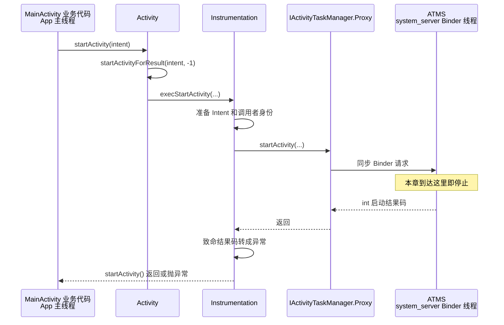

# 08 Activity 启动流程（一）：客户端怎样把“打开页面”变成系统请求

> 源码基线：Android 11 / API 30 / `android-11.0.0_r48` 这一套实现。本文在 macOS 上做静态源码阅读，不要求编译或运行系统。

## 1. 先给结论：`startActivity()` 发出的是请求，不是在创建对象

假设当前 `MainActivity` 中有一段最普通的跳转代码：

```java
button.setOnClickListener(v -> {
    Intent intent = new Intent(this, DetailActivity.class);
    startActivity(intent);
    Log.d("Launch", "startActivity returned");
});
```

下文假定两个 Activity 都使用应用的默认进程，没有额外配置 `android:process`。这样可以把注意力集中在一个反直觉点上：**即使目标最终与调用者同进程，也不能绕过系统服务直接创建。**

这段代码很容易引出两个疑问：

1. `DetailActivity` 也是 Java 类，为什么 Framework 不直接 `new DetailActivity()`？
2. `startActivity()` 已经返回时，`DetailActivity.onCreate()` 是否也执行完了？

先记住本章的四个结论：

- `startActivity()` 提交的是一份**组件启动请求**，不是构造 `Activity` 对象的指令。
- 客户端会把 Intent、调用进程和当前 Activity 的身份整理好，再通过 Binder 交给 `system_server` 中的 ATMS。
- 这次 Binder 调用是同步的；但它同步等待的是 ATMS 返回**启动结果码**，不是等待目标 Activity 的 `onCreate()`。
- 在这个点击场景中，App 主线程发起调用，ATMS 的入口通常由 `system_server` 的 Binder 线程执行。

理解这几点，实际排查时就能先分清：是请求根本没送到系统、系统拒绝了请求，还是请求已返回但目标生命周期尚未执行。

本章只追踪下面这段：

```text
MainActivity.startActivity()
    → Instrumentation.execStartActivity()
    → IActivityTaskManager Binder 调用
    → ActivityTaskManagerService.startActivity()
```

ATMS 怎样解析目标、选择 Task，以及目标进程怎样创建 `DetailActivity`，分别留给后续章节。

## 2. 为什么不能直接 `new DetailActivity()`

如果 `DetailActivity` 只是普通 Java 类，调用方自己创建它当然没有问题。但 Activity 不只是页面类，它还是受系统管理的组件。

系统至少要先回答这些问题：

- Manifest 中是否真的声明了目标 Activity？
- 当前调用者是否有权限启动它？
- 它应该进入哪个 Task、哪个显示区域？
- 已有实例能否复用，还是需要创建新实例？
- 目标进程是否存在，生命周期应该怎样与当前页面衔接？

这些信息横跨应用进程和系统全局状态，单个 App 没有完整视角，也不能自行修改系统维护的 Task 和 Activity 记录。

可以把它想成办理酒店入住：

- Intent 是写着目的和要求的入住申请；
- ATMS 是掌握房态、权限和登记记录的前台；
- Activity 对象是完成分配后才能使用的房间。

客人可以提出“我要住这间房”，却不能绕过前台自己改登记表。类比只帮助建立第一印象，回到源码中，真正的“前台”就是 `system_server` 里的 `ActivityTaskManagerService`。

直接写 `new DetailActivity()` 最多得到一个尚未被 Framework 正确装配的 Java 对象。它没有由系统分配的 Activity token，也没有完成 Context、Window 和生命周期状态的绑定，因此不等于启动了一个 Android Activity。

即使 `MainActivity` 和 `DetailActivity` 最终位于同一个进程，正常的组件启动仍要经过 ATMS。系统不能因为这次碰巧同进程，就放弃统一的权限、Task 和生命周期裁决。

## 3. 一张图看清请求经过了谁

下面只画本章负责的客户端链路。场景由点击事件触发，所以发起线程是 App 主线程；如果业务在别的线程调用，图中的“App 主线程”应替换成实际调用线程。



这张图需要同时从三个维度读：

| 维度 | 本章能确认的事实 |
|---|---|
| 进程 | `Instrumentation` 在 App 进程；ATMS 在 `system_server` |
| 线程 | 客户端代码未主动切线程；服务端入口由 Binder 线程处理 |
| 完成点 | 返回表示本次同步 IPC 已结束，不表示目标 `onCreate()` 已结束 |

不要把“跨进程”“切线程”“异步创建页面”混成同一件事。Binder 负责跨进程；服务端由哪条线程执行是另一个问题；目标生命周期何时完成又是第三个问题。

## 4. `Activity` 先把普通启动并入统一入口

公开的 `startActivity(Intent)` 先调用带 `options` 的重载，最终走到 `startActivityForResult()`：

```java
@Override
public void startActivity(Intent intent, @Nullable Bundle options) {
    if (options != null) {
        startActivityForResult(intent, -1, options);
    } else {
        startActivityForResult(intent, -1);
    }
}
```

源码位置：

```text
frameworks/base/core/java/android/app/Activity.java
```

这里最值得记的是 `-1`。负数 `requestCode` 表示这次启动**不建立返回业务结果的请求关系**。`requestCode >= 0` 时，结果也不是当前同步 Binder 调用的 reply：目标 Activity 以后 `finish()`，系统再通过另一条异步生命周期/结果分发链把数据送到调用方的 `onActivityResult()`。如果一边请求结果、一边又用 `FLAG_ACTIVITY_NEW_TASK` 启动，Android 11 会立即回送 `RESULT_CANCELED` 并解除这段结果关系，因为新 Task 不能继续依附原 Activity 的结果链。

因此，Framework 复用 `startActivityForResult()` 这条内部管线，并不表示普通 `startActivity()` 会阻塞等待目标页面退出。

继续进入 `startActivityForResult()`，常规分支中的关键代码只有这一段：

```java
Instrumentation.ActivityResult ar =
        mInstrumentation.execStartActivity(
                this,
                mMainThread.getApplicationThread(),
                mToken,
                this,
                intent, requestCode, options);
```

这几行证明两件事：

1. `Activity` 没有在这里创建 `DetailActivity`；它把工作交给了 `Instrumentation`。
2. 请求中不只有 Intent，还带上了调用应用和当前 Activity 的身份。

源码里还有嵌套 Activity、Autofill 等兼容分支。它们不会改变本章的主结论，第一次阅读可以先跳过。

## 5. `Instrumentation` 为什么是客户端的关键关口

很多人只在测试代码中见过 Instrumentation，于是把它理解成“测试专用工具”。实际上，普通应用进程也有一个 Instrumentation 对象，Activity 的启动请求同样会经过它。

把这层放在 Binder 调用之前有三个直接用途：

- 在统一位置整理即将离开进程的 Intent；
- 为 Instrumentation 监控或拦截启动保留入口；
- 把系统返回的内部结果码转换成 App 能理解的异常。

先看传入 `execStartActivity()` 的关键参数：

| 参数 | 在当前场景中是什么 | 为什么需要 |
|---|---|---|
| `who` | 当前 `MainActivity` 的 Context | 获取包名、ContentResolver 等调用侧信息 |
| `contextThread` | `ApplicationThread` Binder 对象 | 让系统关联调用进程，并保留反向调度 App 的通道 |
| `token` | 当前 Activity 的 `mToken` | 让系统找到发起者对应的服务端 Activity 记录 |
| `target` | 当前 `MainActivity` Java 对象 | 仅供 App 进程内提取 referrer、嵌入标记等信息 |
| `intent` | 指向 `DetailActivity` 的显式 Intent | 描述要启动谁以及携带什么数据 |
| `requestCode` | 普通启动时为 `-1` | 表明不请求业务结果 |
| `options` | 可为空的启动选项 | 携带动画、display、Task 等附加要求 |

这里有两个容易混淆的边界：

- `ActivityThread` 是 App 进程的 Framework 主控类，并不继承 `java.lang.Thread`。
- `ApplicationThread` 是 `IApplicationThread.Stub`，它是 Binder 接口对象，不是一条真实线程。

`who` 和 `target` 这样的 Java 对象不会整体送到 `system_server`。跨进程的是从它们提取出的包名、attribution tag、嵌入标记，以及 Intent、token 等可序列化数据或 Binder 引用。

`Instrumentation.execStartActivity()` 中真正决定主线的是下面几行：

```java
intent.migrateExtraStreamToClipData(who);
intent.prepareToLeaveProcess(who);
int result = ActivityTaskManager.getService().startActivity(
        whoThread, who.getBasePackageName(), who.getAttributionTag(),
        intent, intent.resolveTypeIfNeeded(who.getContentResolver()),
        token, target != null ? target.mEmbeddedID : null,
        requestCode, 0, null, options);
checkStartActivityResult(result, intent);
```

源码位置：

```text
frameworks/base/core/java/android/app/Instrumentation.java
```

这段代码按顺序完成：准备 Intent、调用 ATMS、检查返回码。`prepareToLeaveProcess()` 也从命名上提醒读者：下一步将越过进程边界。

## 6. `getService()` 怎样变成一次 Binder 调用

`ActivityTaskManager.getService()` 不是在 App 进程里创建一个 ATMS 实例。首次访问时，它从 ServiceManager 查询名为 `activity_task` 的系统 Binder 服务，再转换成强类型接口；外层 `Singleton` 会缓存这个接口，后续调用不必每次重新查询 ServiceManager：

```java
private static final Singleton<IActivityTaskManager>
        IActivityTaskManagerSingleton =
        new Singleton<IActivityTaskManager>() {
    @Override
    protected IActivityTaskManager create() {
        final IBinder b = ServiceManager.getService(
                Context.ACTIVITY_TASK_SERVICE);
        return IActivityTaskManager.Stub.asInterface(b);
    }
};
```

为便于阅读，上面只省略了注解和无关上下文，关键语句与真实源码一致。源码位置是：

```text
frameworks/base/core/java/android/app/ActivityTaskManager.java
```

在普通 App 场景中，服务位于另一个进程，所以 `Stub.asInterface(b)` 返回的是 `IActivityTaskManager.Proxy`。随后看似普通的 Java 调用，会在生成的 Proxy 中写 Parcel 并执行 Binder `transact`。

AIDL 契约明确写着返回 `int`，而且方法没有 `oneway`：

```aidl
int startActivity(in IApplicationThread caller,
        in String callingPackage, in String callingFeatureId,
        in Intent intent, in String resolvedType, in IBinder resultTo,
        in String resultWho, int requestCode, int flags,
        in ProfilerInfo profilerInfo, in Bundle options);
```

源码位置：

```text
frameworks/base/core/java/android/app/IActivityTaskManager.aidl
```

这足以确认本版本的 `startActivity` 是同步 Binder 方法：调用线程要等服务端给这次事务写回结果，才能继续执行 `checkStartActivityResult()`。

但“同步”只描述当前 Binder 事务，不等于整个页面启动过程同步完成。就像窗口工作人员已经给出“申请已受理”的回执，后续的房间准备并没有因此瞬间完成。

## 7. 到达 ATMS 入口：本章在这里刹车

Binder 驱动把请求送到 `system_server` 后，Stub 分发到 `ActivityTaskManagerService.startActivity()`：

```java
@Override
public final int startActivity(IApplicationThread caller,
        String callingPackage, String callingFeatureId,
        Intent intent, String resolvedType, IBinder resultTo,
        String resultWho, int requestCode, int startFlags,
        ProfilerInfo profilerInfo, Bundle bOptions) {
    return startActivityAsUser(caller, callingPackage, callingFeatureId,
            intent, resolvedType, resultTo, resultWho, requestCode,
            startFlags, profilerInfo, bOptions,
            UserHandle.getCallingUserId());
}
```

源码位置：

```text
frameworks/base/services/core/java/com/android/server/wm/
    ActivityTaskManagerService.java
```

在本章场景中，这个入口具备三项关键信息：

- 进程已经从 App 切到 `system_server`；
- 执行者通常是 `system_server` Binder 线程池中的线程；
- Binder 驱动还提供真实 calling UID/PID，服务端不会只相信客户端传来的包名字符串。

到这里，问题已经从“客户端怎样发请求”变成“系统怎样裁决请求”。`startActivityAsUser()` 后如何校验用户、解析 Intent、构造 `ActivityStarter` 和选择 Task，是第 09 章的范围，本章不继续展开。

## 8. Binder 返回时，究竟完成了什么

ATMS 返回一个内部启动结果码。它可能表示真正开始了一次新启动，也可能表示已有 Task 被移到前台、请求被交给顶部实例，或者发生了致命错误。

`Instrumentation` 只在结果属于致命错误时抛出异常：

```java
public static void checkStartActivityResult(int res, Object intent) {
    if (!ActivityManager.isStartResultFatalError(res)) {
        return;
    }
    switch (res) {
        case ActivityManager.START_CLASS_NOT_FOUND:
            throw new ActivityNotFoundException(...);
        case ActivityManager.START_PERMISSION_DENIED:
            throw new SecurityException(...);
    }
}
```

省略号代表同一方法中的消息拼装和其他错误分支，并不是可直接编译的完整源码。真实位置仍在 `Instrumentation.java`。

现在可以把四个完成点彻底分开：

| 观察到的现象 | 可以证明什么 | 不能证明什么 |
|---|---|---|
| 进入 ATMS 的 `startActivity()` | 请求已跨进程到达系统服务入口 | 目标已解析成功 |
| 内部 Binder 调用返回 `int` | ATMS 对这次同步事务给出了结果 | 新 Activity 对象已经创建 |
| App 的 `startActivity()` 正常返回 | 结果没有被客户端转成致命异常 | `DetailActivity.onCreate()` 已执行 |
| 目标 `onCreate()` 被调用 | 目标进程已开始执行创建事务 | 页面一定已完成绘制并对用户可见 |

在本文“两个 Activity 同进程、从主线程点击启动”的设定下，示例中的日志会先打印：

```text
startActivity returned
```

随后 App 主线程才有机会处理创建目标 Activity 的生命周期事务。完整调度过程要等第 10 章才能由服务端到客户端闭环；这里没有连接设备，因此这条日志顺序属于源码推导，不冒充本机实测结果。

还有一个容易忽略的事实：系统可能复用已有实例，所以“启动成功”本身也不保证一定出现一次新的构造或 `onCreate()`。这要结合 launch mode、Intent flags 和当前 Task 状态判断，属于后续调度章节。

## 9. 容易翻车的边界：不要把四类事实混在一起

### 9.1 线程边界

`Activity.startActivity()` 到 `Instrumentation.execStartActivity()` 之间没有自动 `post` 到主线程。在本文点击场景中，它们本来就在 App 主线程执行；Binder 调用期间，等待的是这条实际调用线程。服务端 ATMS 入口则由 Binder 线程处理。

### 9.2 进程边界

普通 App 获得的是远端 ATMS Proxy，因此 `IActivityTaskManager.startActivity()` 是 App → `system_server` 的 IPC。`IApplicationThread` 方向相反：它让 `system_server` 后续能够回调和调度 App。两个 Binder 接口不要记反。

### 9.3 API 与实现边界

`Activity.startActivity(Intent)` 是应用可调用的公开 API。`Instrumentation.execStartActivity()`、`IActivityTaskManager` 和 ATMS 的参数组织属于 Android 11 的内部实现细节。应用代码不应依赖这些隐藏接口，但源码学习需要借助它们解释公开 API 为什么呈现当前行为。

### 9.4 版本边界

本文的类名、参数列表和参考行号以 Android 11 r48 为准。其他版本可能增加调用归因字段、重排启动控制器或修改安全策略。跨版本阅读时，应重新核对下面三个不变量是否仍成立：

1. 公开入口最终把启动请求交给系统组件管理服务；
2. 客户端与系统服务之间存在 Binder 契约；
3. 请求调用返回与目标生命周期完成不是同一个完成点。

前两项的具体类名可能演进，第三项也应以对应版本源码和运行观察共同验证，不能只凭旧文章套结论。

### 9.5 从非 Activity Context 启动的边界

`applicationContext.startActivity()` 仍会进入 `Instrumentation.execStartActivity()`，但传入的 Activity token 和 target 都是 `null`，系统无法把它自然接到当前 Activity 的 Task。Android 11 中，面向现代版本（`targetSdk >= 28`）的普通应用若未加 `FLAG_ACTIVITY_NEW_TASK`，会先在 `ContextImpl` 抛出 `AndroidRuntimeException`；通过 `ActivityOptions` 明确指定目标 Task 是例外。Android N 到 O_MR1 的目标版本还保留过一段历史兼容行为，所以这条规则也必须带版本条件。

## 10. 在 macOS 上完成一次只读源码验证

不编译也能验证本章主线。进入源码根目录：

```bash
cd /Users/ninebot/androidSource
```

第一步，确认普通启动怎样传入 `-1`：

```bash
rg -n 'public void startActivity\(Intent intent|startActivityForResult' \
  frameworks/base/core/java/android/app/Activity.java
```

第二步，确认 Intent 准备、ATMS 调用和结果检查在同一方法中：

```bash
sed -n '1688,1730p' \
  frameworks/base/core/java/android/app/Instrumentation.java
```

第三步，确认服务发现和 AIDL 同步契约：

```bash
sed -n '150,163p' \
  frameworks/base/core/java/android/app/ActivityTaskManager.java
sed -n '84,96p' \
  frameworks/base/core/java/android/app/IActivityTaskManager.aidl
```

第四步，只定位 ATMS 入口，不继续追进第 09 章：

```bash
rg -n 'public final int startActivity\(' \
  frameworks/base/services/core/java/com/android/server/wm/ActivityTaskManagerService.java
```

建议在纸上画四列，边读边填：

```text
方法/类 | 所在进程 | 执行线程 | 这个返回点表示什么
```

预期得到：

| 方法/类 | 所在进程 | 执行线程 | 返回点含义 |
|---|---|---|---|
| `Activity.startActivity()` | App | 当前调用线程；本文是主线程 | 客户端管线正常结束或抛异常 |
| `Instrumentation.execStartActivity()` | App | 同一调用线程 | 已拿到 ATMS 结果并检查 |
| `IActivityTaskManager.Proxy` | App | 同一调用线程等待同步 IPC | 等待服务端结果 |
| `ActivityTaskManagerService.startActivity()` | `system_server` | Binder 线程 | 系统入口完成本次方法处理 |

### 检查题与答案

1. **为什么不能把启动 Activity 理解成 `new DetailActivity()`？**

   因为 Activity 的身份、Task、权限、进程和生命周期由系统统一管理；普通构造对象不会完成这些装配。

2. **普通启动为什么传 `requestCode = -1`？**

   为了复用 `startActivityForResult()` 的内部管线，同时明确表示不请求业务结果。

3. **App → `system_server` 的真正边界在哪里？**

   `IActivityTaskManager.Proxy.startActivity()` 内部执行 Binder 事务时；Java 源码表面入口是 `ActivityTaskManager.getService().startActivity(...)`。

4. **为什么说它是同步 Binder 调用？**

   Android 11 的 AIDL 方法返回 `int` 且没有声明 `oneway`，客户端要等这次事务的回复。

5. **这个同步回复是什么，不是什么？**

   它是启动请求的系统结果码；它不是 `DetailActivity` 的业务结果，也不证明 `onCreate()` 已完成。

6. **`IActivityTaskManager` 与 `IApplicationThread` 的方向分别是什么？**

   前者主要用于 App 调 ATMS；后者主要用于 `system_server` 反向调度 App。

7. **本章的停止点在哪里？**

   `ActivityTaskManagerService.startActivity()` Binder 入口；其后的系统调度交给第 09 章。

## 读完立刻能做什么

以后看到“调用 `startActivity()` 后页面没出现”，先按顺序问：

1. 是否走到了 `Instrumentation.execStartActivity()`？
2. 调用者是 Activity 还是其他 Context；后者是否缺少 `FLAG_ACTIVITY_NEW_TASK`？
3. 客户端是否收到 `ActivityNotFoundException`、`SecurityException` 等同步错误？
4. 如果请求已正常返回，问题是否已经进入 ATMS 调度或目标进程生命周期阶段？

本章的可操作 takeaway 是：**先用进程、线程和完成点给日志定位，再决定继续读客户端、ATMS，还是目标进程；不要用“`startActivity()` 已返回”代替“目标页面已创建”。**
