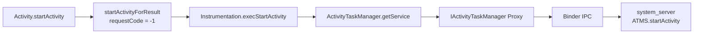
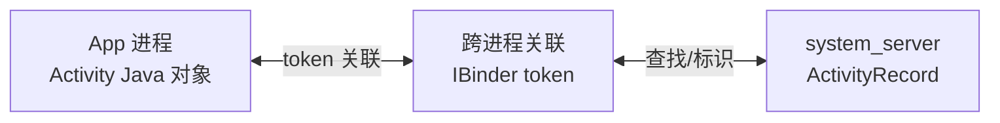
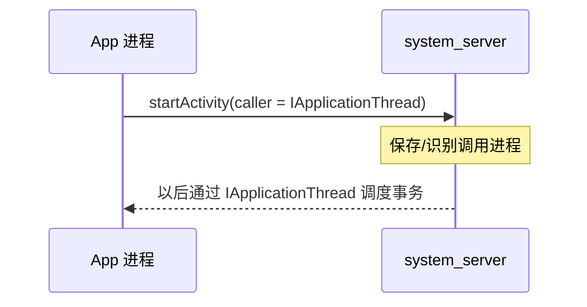
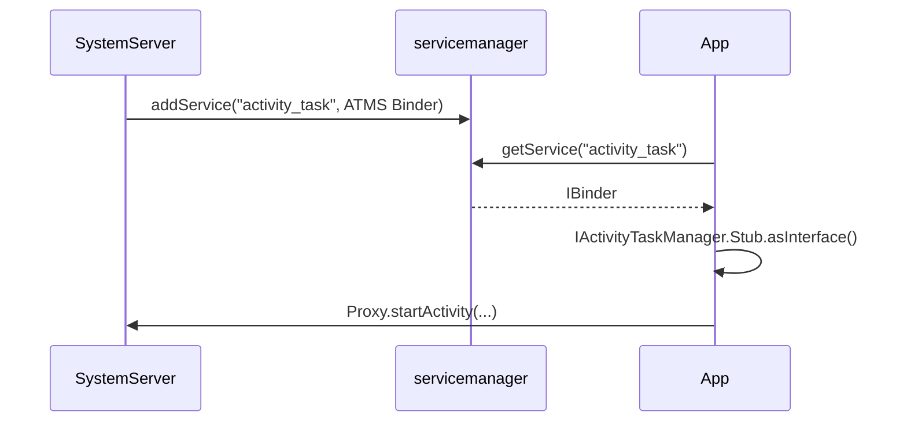
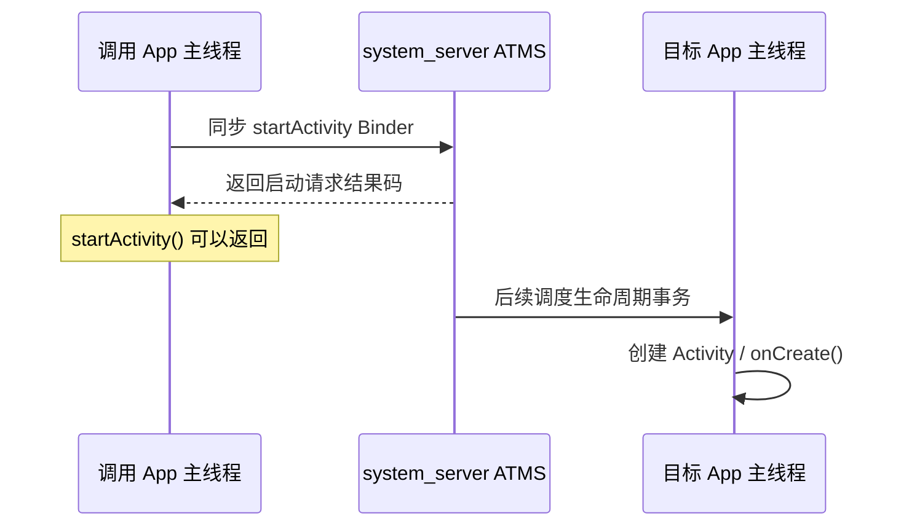
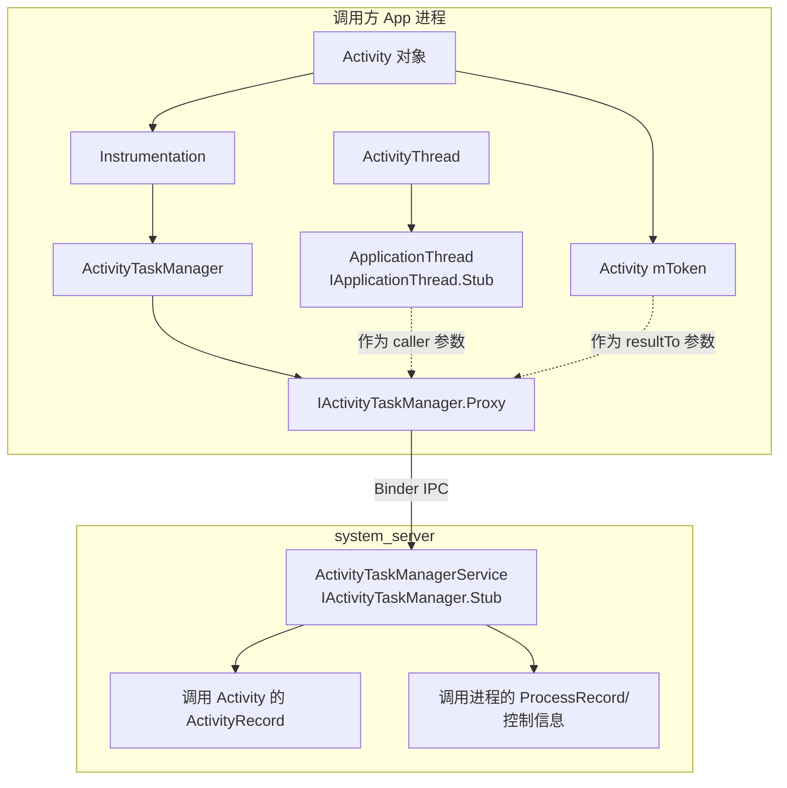
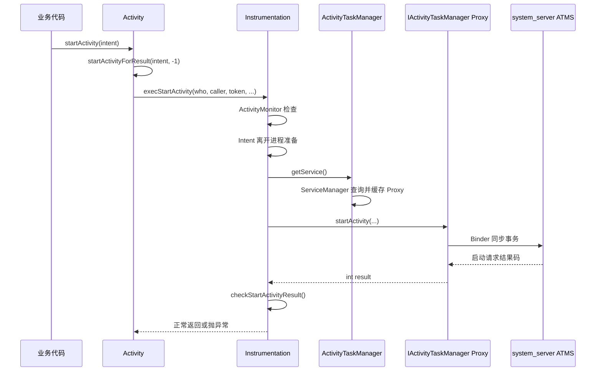

# 08 Activity 启动流程（一）：客户端如何发出请求

> 源码基线：Android 11 / API 30 / `android-11.0.0_r48`；本章在 macOS 上只读本地源码，不要求编译。

## 本章边界

Activity 启动链很长，本套笔记拆成三章：

```text
08 客户端请求：startActivity → Instrumentation → IActivityTaskManager
09 system_server 调度：ATMS → ActivityStarter → Task/ActivityRecord
10 目标进程执行：进程创建 → ClientTransaction → ActivityThread → onCreate
```

本章只追到请求跨过 Binder、进入 `ActivityTaskManagerService.startActivity()` 为止。先把发起方携带的每个关键参数弄清楚，下一章再研究系统如何解析 Intent、选择 Task 和目标 Activity。

## 本章目标

读完后，你应该能够：

1. 说清 `Activity.startActivity()` 为什么转到 `startActivityForResult(..., -1)`。
2. 解释 Activity Context 与非 Activity Context 两条启动入口的区别。
3. 解释 `Instrumentation` 在启动链中的职责，而不是只把它当测试类。
4. 识别 `IApplicationThread caller`、`activity token`、`callingPackage`、`resolvedType`、`requestCode`。
5. 从 `ActivityTaskManager.getService()` 找到 ATMS 的 Binder Proxy。
6. 明确哪一行发生 App → system_server 的进程切换。
7. 理解“Binder 调用返回”不等于“目标 Activity 的 `onCreate()` 已执行”。

## 1. 从最常见代码开始

App 中通常写：

```java
Intent intent = new Intent(this, DetailActivity.class);
intent.putExtra("item_id", 42L);
startActivity(intent);
```

表面只有两步：构造 Intent、调用 `startActivity()`。Framework 实际会完成：



这一段主要做“把启动意图整理成系统可验证、可调度的 IPC 请求”。它还没有创建目标 Activity 对象。

## 2. Intent 是请求描述，不是 Activity 对象

Intent 描述“想做什么”以及携带什么信息。常见内容：

- `ComponentName`：显式指定包名和 Activity 类。
- action：例如 `ACTION_VIEW`。
- category：对目标匹配增加约束。
- data URI 和 MIME type。
- extras。
- flags：影响 Task、历史栈和启动行为。

### 显式 Intent

```java
new Intent(this, DetailActivity.class)
```

内部带明确 Component，系统仍需检查组件是否存在、是否 exported、权限是否允许、用户状态是否匹配等。

### 隐式 Intent

```java
new Intent(Intent.ACTION_VIEW, Uri.parse("https://example.com"))
```

系统必须通过 PackageManager 的解析结果选择匹配 Activity；可能没有结果、只有一个结果，也可能弹出选择器。

关键认识：调用方不负责直接 `new DetailActivity()`。Activity 是受系统管理的组件，对象必须由目标进程的 Framework 在系统调度后创建。

## 3. 第一站：`Activity.startActivity()`

源码：

```text
/Users/ninebot/androidSource/frameworks/base/core/java/android/app/Activity.java
```

Android 11 中：

```java
@Override
public void startActivity(Intent intent) {
    this.startActivity(intent, null);
}
```

带 options 的重载最终进入：

```java
if (options != null) {
    startActivityForResult(intent, -1, options);
} else {
    startActivityForResult(intent, -1);
}
```

这里的 `-1` 是理解链路的第一个关键值。

## 4. 为什么普通启动也走 `startActivityForResult()`

Framework 复用同一条内部管线。`requestCode` 的语义是：

| requestCode | 含义 |
|---:|---|
| `>= 0` | 调用方请求结果；若有有效 source Activity 且其未 finishing，系统才建立结果关系 |
| `< 0` | 普通启动，不建立 Activity result 关系 |

因此：

```java
startActivity(intent)
```

可理解为：

```java
startActivityForResult(intent, -1, options)
```

这不表示普通 `startActivity()` 真的等待结果；它只是复用支持结果参数的统一实现。即使 `requestCode >= 0`，`startActivityForResult()` 本身也不是阻塞等到目标 finish：结果在后续生命周期中异步回传。

现代 AndroidX 的 Activity Result API 在应用层提供更安全的注册与分发方式，但底层仍要向系统表达启动者、目标和结果关联。

## 5. `startActivityForResult()` 的核心代码

省略嵌套 Activity 等兼容分支后：

```java
public void startActivityForResult(Intent intent, int requestCode,
        Bundle options) {
    if (mParent == null) {
        Instrumentation.ActivityResult ar =
                mInstrumentation.execStartActivity(
                        this,
                        mMainThread.getApplicationThread(),
                        mToken,
                        this,
                        intent,
                        requestCode,
                        options);
        ...
    }
}
```

这一行一次传入多个看似相似的对象。先不要急着跳进方法，逐项拆解。

## 6. `execStartActivity()` 七个参数逐项解释

方法签名：

```java
execStartActivity(
        Context who,
        IBinder contextThread,
        IBinder token,
        Activity target,
        Intent intent,
        int requestCode,
        Bundle options)
```

### 6.1 `who = this`

当前 Activity 的 Context。用于获得包名、ContentResolver，以及对 Intent 做离开进程前的准备。

### 6.2 `contextThread = mMainThread.getApplicationThread()`

名字很容易误导。它不是 `java.lang.Thread`，而是 `IApplicationThread` Binder 接口的服务端对象引用。

```text
ActivityThread
 └─ ApplicationThread extends IApplicationThread.Stub
```

App 把这个 Binder 交给 system_server，相当于告诉系统：“这是调用进程的回调通道。”之后 system_server 可以通过它调度应用组件和生命周期事务。

在 App 进程内，它是一个 Stub；传入 system_server 后，system_server 一侧持有对应 Proxy。

### 6.3 `token = mToken`

这是当前 Activity 的 Binder token，用于跨进程标识“是哪一个 Activity 发起请求”。

不能把普通 Java Activity 对象直接传给 system_server，因此需要稳定的 Binder 身份标识。

它帮助系统：

- 找到调用 Activity 对应的服务端记录。
- 确定其 Task、显示区域和生命周期状态。
- 建立 resultTo 关系。
- 应用某些以调用 Activity 为上下文的启动规则。

### 6.4 `target = this`

这是 App 进程内的 Activity Java 对象，主要供 `Instrumentation` 在本地获取 referrer、嵌入标识或监控启动。这个对象本身不会通过 Binder 传到 system_server。

### 6.5 `intent`

启动请求主体。进入 IPC 前会做迁移和合法化准备，然后通过 Parcel 发送。

### 6.6 `requestCode`

结果关联编号。普通 `startActivity()` 为 `-1`；请求结果时通常为非负数。

### 6.7 `options`

启动附加选项，常来自 `ActivityOptions`，例如动画、目标 display、launch bounds、Task 相关选项。它会以 Bundle 形式跨进程传递。

## 7. Activity Token 到底是什么

这是 Activity 启动中最容易抽象过头的概念之一。

同一个 Activity 在不同位置有不同表示：



- App 进程关心真实 Activity 对象、View 和生命周期回调。
- system_server 不持有这个 Java 对象，而维护自己的 `ActivityRecord`。
- token 让双方谈论“同一个逻辑 Activity”。

token 不是 Activity 对象的内存地址，也不是 Intent，更不是进程 ID。

`Activity.attach()` 会把系统提供的 token 赋给 `mToken`：

```java
mToken = token;
```

这一赋值发生在 Activity 对象创建后的 attach 阶段，第 10 章会再追。

## 8. `IApplicationThread` 又是什么

`IApplicationThread` 是 system_server 调度 App 进程的重要反向 Binder 接口。



不要把这些名字混淆：

| 名称 | 是什么 |
|---|---|
| `ActivityThread` | App 进程 Framework 主控类，不是 Thread 子类 |
| `ApplicationThread` | ActivityThread 的内部 Binder Stub |
| `IApplicationThread` | system_server 与 App 间的 AIDL 接口 |
| App 主线程 | 执行 Looper 和组件回调的真实线程 |

`ActivityThread` 名称中的 Thread 是历史命名，它自身并不继承 `java.lang.Thread`。

## 9. 为什么要经过 `Instrumentation`

很多初学者把 Instrumentation 仅理解为“测试工具”。实际上，每个应用进程都有 Instrumentation 对象，Framework 会通过它统一包裹许多组件创建和生命周期调用。

Activity 启动请求中，`execStartActivity()` 负责：

1. 获取 referrer 并补到 Intent。
2. 让已注册的 `ActivityMonitor` 检查或拦截启动。
3. 对 Intent 做离开进程前的准备。
4. 调用 ATMS Binder 接口。
5. 把系统返回的启动结果码转换成 Java 异常。

测试框架可以替换或配置 Instrumentation，从而监视组件启动；但普通 App 启动也经过默认 Instrumentation。

## 10. ActivityMonitor 为什么能拦截启动

`execStartActivity()` 在发 Binder 请求前检查 `mActivityMonitors`。简化逻辑：

```java
for (ActivityMonitor monitor : monitors) {
    if (monitor.match(who, null, intent)) {
        if (monitor.isBlocking()) {
            return requestCode >= 0 ? monitor.getResult() : null;
        }
        break;
    }
}
```

因此测试可以：

- 观察某个 Intent 是否发起。
- 统计命中次数。
- 阻断实际系统启动。
- 为 result 场景返回模拟结果。

这也解释了为什么 Instrumentation 必须位于 Binder 调用之前。

## 11. Intent 离开进程前的准备

关键代码：

```java
intent.migrateExtraStreamToClipData(who);
intent.prepareToLeaveProcess(who);
```

### `migrateExtraStreamToClipData()`

将历史上放在 extras 中的流/URI 信息迁移到 ClipData 等统一表达，使 URI 权限授予等机制能正确识别。

### `prepareToLeaveProcess()`

在 Intent 跨进程前检查和整理状态，例如处理不允许跨进程泄漏的内容、准备 URI 暴露检查等。

这说明 Intent 并不是随手丢进 Parcel；Framework 会在进程边界前进行安全和兼容性处理。

## 12. 真正的 Binder 调用

`Instrumentation.execStartActivity()` 中最关键的一行：

```java
int result = ActivityTaskManager.getService().startActivity(
        whoThread,
        who.getBasePackageName(),
        who.getAttributionTag(),
        intent,
        intent.resolveTypeIfNeeded(who.getContentResolver()),
        token,
        target != null ? target.mEmbeddedID : null,
        requestCode,
        0,
        null,
        options);
```

从 Java 语法看是普通方法调用；从第 07 章知识看，`getService()` 通常返回 AIDL Proxy，因此这里进行同步 Binder IPC。

```text
[App 调用线程]
IActivityTaskManager.Proxy.startActivity(...)
        ↓ Binder 同步事务
[system_server Binder 线程]
ActivityTaskManagerService.startActivity(...)
```

界面点击场景下，`startActivity()` 通常由 App 主线程发起，所以主线程会在这里同步等待 ATMS 返回“启动请求处理结果码”。但 Framework 并没有在这条入口里把调用强制切到主线程；如果业务从其他线程调用，那么同步等待 Binder 返回的是那个实际调用线程。后文图中的“App 主线程”代表最常见 UI 场景，不是绝对规则。

### 一个判断线程的可靠方法

不要根据类名猜线程，应沿代码查有没有 `Handler.post()`、`sendMessage()`、Executor 或 Binder 边界：

```text
Activity.startActivity
 → Instrumentation.execStartActivity
```

这一段没有主动切线程，所以仍运行在调用者线程；跨 Binder 后，ATMS 入口运行在 system_server Binder 线程。

## 13. `ActivityTaskManager.getService()` 如何拿到 Proxy

源码：

```text
/Users/ninebot/androidSource/frameworks/base/core/java/android/app/ActivityTaskManager.java
```

核心实现：

```java
private static final Singleton<IActivityTaskManager>
        IActivityTaskManagerSingleton =
        new Singleton<IActivityTaskManager>() {
            @Override
            protected IActivityTaskManager create() {
                IBinder b = ServiceManager.getService(
                        Context.ACTIVITY_TASK_SERVICE);
                return IActivityTaskManager.Stub.asInterface(b);
            }
        };
```

完整含义：

1. 向 servicemanager 查询名为 `activity_task` 的 Binder 服务。
2. 得到原始 `IBinder`。
3. 用 `Stub.asInterface()` 转成强类型 `IActivityTaskManager`。
4. App 与 ATMS 不在同一进程，所以得到 Proxy。
5. `Singleton` 缓存这个接口，避免每次启动都重新查询。

## 14. ATMS 服务是谁注册的

第 06 章中 SystemServer 启动 ATMS：

```java
public void onStart() {
    publishBinderService(Context.ACTIVITY_TASK_SERVICE, mService);
    mService.start();
}
```

其中 `Context.ACTIVITY_TASK_SERVICE` 对应服务名 `activity_task`。



服务注册发生在系统启动阶段，普通 Activity 启动时通常只进行一次懒加载查询并缓存。

## 15. AIDL 契约

源码：

```text
/Users/ninebot/androidSource/frameworks/base/core/java/android/app/IActivityTaskManager.aidl
```

Android 11 定义：

```aidl
int startActivity(
    in IApplicationThread caller,
    in String callingPackage,
    in String callingFeatureId,
    in Intent intent,
    in String resolvedType,
    in IBinder resultTo,
    in String resultWho,
    int requestCode,
    int flags,
    in ProfilerInfo profilerInfo,
    in Bundle options);
```

### 为什么返回 `int`

这个 int 是启动请求结果码，例如成功、找不到 Activity、权限拒绝等。它不是目标 Activity 的业务 resultCode，也不是目标 Activity 的进程 PID。

### `in` 是什么

表示参数数据主要从客户端传向服务端。AIDL 编译器据此生成 Parcel 写入/读取代码。

## 16. `startActivity()` Binder 参数详解

| 参数 | 客户端传入 | 服务端用途 |
|---|---|---|
| `caller` | `IApplicationThread` | 识别/关联调用应用进程及回调通道 |
| `callingPackage` | 基础包名 | 归因、权限与调用身份一致性验证 |
| `callingFeatureId` | attribution tag | 更细粒度调用归因 |
| `intent` | 启动 Intent | 解析目标组件和启动要求 |
| `resolvedType` | 解析出的 MIME type | 参与 Intent 匹配 |
| `resultTo` | 当前 Activity token | 找到发起 Activity，建立结果和 Task 上下文 |
| `resultWho` | 嵌套/嵌入来源标记 | result 精确分发，普通情况常为 null |
| `requestCode` | `-1` 或非负值 | 是否建立返回结果关系 |
| `flags` | Instrumentation start flags | 不是 `Intent.getFlags()` 本身 |
| `profilerInfo` | 通常 null | 可携带启动进程的性能分析配置 |
| `options` | Bundle | 动画、display、Task 等启动选项 |

### 两种 flags 不要混淆

这里传给 `startActivity()` 的 `flags` 参数与 `intent.getFlags()` 是不同概念。

- Intent flags 存在 Intent 内，如 `FLAG_ACTIVITY_NEW_TASK`。
- start flags 是单独的系统启动控制参数。

在本链路中 Instrumentation 传的 start flags 为 `0`，但 Intent 自己仍可能携带多个 flag。

### 为什么普通启动也传名为 `resultTo` 的 token

`resultTo` 这个参数名很容易让人误以为只有 `requestCode >= 0` 时才需要。实际上普通启动虽然不要求返回业务结果，ATMS 仍需要知道哪个 Activity 发起了请求，以推导调用者的 Task、显示区域和启动上下文。因此常见 Activity 启动会同时出现：

```text
resultTo = 当前 Activity token
requestCode = -1
```

是否建立 `onActivityResult` 关系主要还要结合 `requestCode` 等条件判断，不能只看 `resultTo` 是否为空。

## 17. `resolvedType` 为什么单独传

Intent 可能显式指定 MIME type，也可能需要结合 `ContentResolver` 从 URI 获得：

```java
intent.resolveTypeIfNeeded(who.getContentResolver())
```

例如一个 `content://` URI 可能对应 `image/png`。系统解析隐式 Intent 时，action、data、category 和 MIME type 会一起参与匹配。

类型单独作为已解析参数传递，可避免服务端在错误的调用方 Context 下重复执行相同解析，并保留调用侧 ContentResolver 得到的信息。

## 18. `callingPackage` 不能随便冒充

客户端把包名作为字符串传入，乍看似乎可以伪造。但 system_server 不能只相信这个字符串。

ATMS 服务端入口会调用类似：

```java
assertPackageMatchesCallingUid(callingPackage);
```

Binder 驱动提供真实 calling UID，ATMS 再验证传入包名是否属于该 UID。

安全模型是：

```text
客户端声明 callingPackage
        +
Binder 驱动提供真实 UID/PID
        +
system_server 交叉验证与权限检查
```

不能把安全建立在客户端自报信息上。

### 三类“调用者身份”不要混在一起

| 信息 | 回答的问题 | 是否可信来源 |
|---|---|---|
| Binder calling UID/PID | 是哪个 Linux 身份/进程发起 IPC？ | 驱动提供，服务端安全判断的基础 |
| `callingPackage` | 该 UID 以哪个包名归因本次操作？ | 客户端声明，服务端必须与 UID 核验 |
| `IApplicationThread caller` | system_server 如何关联并反向调度调用应用进程？ | Binder 对象引用，服务端结合进程记录验证 |

Activity token 则回答“该进程中的哪个 Activity 发起”，它与以上三类信息互补，而不是替代关系。

## 19. App 侧 Proxy 做了什么

AIDL 编译器为 `IActivityTaskManager` 生成 Proxy。虽然生成文件不一定以普通源文件形式直接保存在当前目录，但逻辑与第 07 章一致：

```text
data.writeInterfaceToken(DESCRIPTOR)
data.writeStrongBinder(caller.asBinder())
data.writeString(callingPackage)
...
intent.writeToParcel(data, 0)
...
mRemote.transact(TRANSACTION_startActivity, data, reply, 0)
reply.readException()
int result = reply.readInt()
```

Intent、Bundle 被序列化；`IApplicationThread` 和 Activity token 作为 Binder 引用写入 Parcel。驱动在 system_server 侧重建可用的 Binder Proxy/引用。

## 20. 服务端入口在哪

源码：

```text
/Users/ninebot/androidSource/frameworks/base/services/core/java/com/android/server/wm/ActivityTaskManagerService.java
```

Binder Stub 分发后进入：

```java
@Override
public final int startActivity(
        IApplicationThread caller,
        String callingPackage,
        String callingFeatureId,
        Intent intent,
        String resolvedType,
        IBinder resultTo,
        String resultWho,
        int requestCode,
        int startFlags,
        ProfilerInfo profilerInfo,
        Bundle bOptions) {
    return startActivityAsUser(..., UserHandle.getCallingUserId());
}
```

运行位置通常是：

```text
进程：system_server
线程：Binder 线程池中的某个线程
调用者身份：Binder 驱动记录的 App UID/PID
```

这个 `startActivity()` 又补上 calling user，继续进入 `startActivityAsUser()`。具体如何构建 `ActivityStarter`、解析目标、选择 Task，是第 09 章内容。

## 21. Binder 返回值不代表 `onCreate()` 已完成

这是本章最重要的时序认识。

同步 Binder 调用等待的是：ATMS 对“启动请求”的同步处理得到一个结果码。系统后续可能还要：

- 暂停当前顶部 Activity。
- 判断目标进程是否存在。
- 如有需要，请 Zygote 创建进程。
- 让目标进程绑定 Application。
- 调度 LaunchActivityItem。
- 在目标进程主线程创建 Activity。
- 调用 `onCreate()`、`onStart()`、`onResume()`。



图中 ATMS 返回与目标 `onCreate()` 不是同一个完成点。不能在 `startActivity()` 下一行假设目标页面已经创建完成。

即使目标 Activity 与调用 Activity 声明在同一个应用、最终运行在同一个进程，启动请求通常也仍要经过 system_server。原因是 Task、权限、生命周期顺序和窗口状态必须由系统统一裁决，不能因为目标碰巧同进程就绕过 ATMS 直接 new Activity。

## 22. 启动失败如何变成 App 异常

ATMS 返回 int 后：

```java
checkStartActivityResult(result, intent);
```

`Instrumentation.checkStartActivityResult()` 将致命结果码转成开发者熟悉的异常：

| 系统结果 | App 侧异常 |
|---|---|
| Intent 无法解析/类不存在 | `ActivityNotFoundException` |
| 权限拒绝 | `SecurityException` |
| 参数组合错误 | `IllegalArgumentException` 或运行时异常 |
| `START_CANCELED` 启动取消 | `AndroidRuntimeException` |

只有 `ActivityManager.isStartResultFatalError(result)` 为 true 时，`checkStartActivityResult()` 才进入 switch 抛异常。像 `START_ABORTED` 这类非致命结果可能被系统策略拦下，但客户端不一定因此抛出异常。这是“方法没抛异常”不能证明目标 Activity 已启动的另一个原因。

所以 `ActivityNotFoundException` 并不是 App 进程自己扫描 Manifest 得出的；通常是 system_server 解析失败后通过结果码返回，再由 Instrumentation 转译。

## 23. `RemoteException` 与启动结果错误不同

代码中：

```java
try {
    int result = ActivityTaskManager.getService().startActivity(...);
    checkStartActivityResult(result, intent);
} catch (RemoteException e) {
    throw new RuntimeException("Failure from system", e);
}
```

两类失败要分开：

- ATMS 正常收到请求，但业务检查失败：返回错误码，再变成 `ActivityNotFoundException`、`SecurityException` 等。
- Binder 通信或 system_server 本身异常：抛 `RemoteException`，代表 IPC 层失败。

前者是“系统拒绝/无法完成请求”，后者是“连系统服务通信都失败”。

## 24. Activity Context 与非 Activity Context

使用 Activity：

```java
activity.startActivity(intent);
```

有当前 Activity token，系统可默认把新 Activity 放入调用者相关 Task，通常不要求 `FLAG_ACTIVITY_NEW_TASK`。

使用 Application、Service 等 Context：

```java
applicationContext.startActivity(intent);
```

会进入 `ContextImpl.startActivity()`，没有当前 Activity token。Android 11 中，当 Intent 没有 `FLAG_ACTIVITY_NEW_TASK`、options 也没有指定 `launchTaskId` 时，对 `targetSdk < N` 或 `targetSdk >= P` 的调用会明确要求：

```java
intent.addFlags(Intent.FLAG_ACTIVITY_NEW_TASK);
```

否则抛出：

```text
Calling startActivity() from outside of an Activity context requires
the FLAG_ACTIVITY_NEW_TASK flag.
```

## 25. `ContextImpl.startActivity()` 的不同参数

源码：

```text
/Users/ninebot/androidSource/frameworks/base/core/java/android/app/ContextImpl.java
```

它最终也调用：

```java
mMainThread.getInstrumentation().execStartActivity(
        getOuterContext(),
        mMainThread.getApplicationThread(),
        null,
        (Activity) null,
        intent,
        -1,
        options);
```

与 Activity 入口对比：

| 参数 | Activity Context | 非 Activity Context |
|---|---|---|
| `who` | Activity | 外层 Context |
| `contextThread` | ApplicationThread Binder | 同样存在 |
| `token/resultTo` | 当前 Activity token | `null` |
| `target` | 当前 Activity | `null` |
| `requestCode` | 普通启动为 `-1` | `-1` |
| Task 上下文 | 可继承当前 Activity | 无，需要 NEW_TASK 等信息 |

关键差异不是“Application 没有主线程”或“没有 IApplicationThread”；它缺的是当前 Activity 身份和 Task 上下文。

## 26. 为什么非 Activity Context 需要 NEW_TASK

没有调用 Activity token，系统无法自然回答：“新页面应加入哪一个现有 Activity 的 Task？”

`FLAG_ACTIVITY_NEW_TASK` 明确要求系统从 Task 级别寻找或创建合适任务，而不是默认依附当前 Activity。

这是 Task 归属语义，不只是 API 人为限制。但 r48 源码为 target N—O_MR1 的历史兼容 bug 保留了例外，options 明确给出 launch task id 时也例外。所以最稳妥的开发规则仍是：非 Activity Context 要么加 `NEW_TASK`，要么通过受支持的 Task 选项明确归属；不要依赖旧 targetSdk 兼容漏洞。

## 27. 从 View 点击到启动请求

常见业务链：

```java
button.setOnClickListener(v -> {
    startActivity(new Intent(this, DetailActivity.class));
});
```

线程和进程标注：

```text
[App 进程主线程]
View.OnClickListener.onClick()
 → Activity.startActivity()
 → startActivityForResult(-1)
 → Instrumentation.execStartActivity()
 → IActivityTaskManager.Proxy.startActivity()

[Binder 同步跨进程]

[system_server Binder 线程]
ActivityTaskManagerService.startActivity()
```

在这一小段里，第一次明确的进程边界就是 AIDL Proxy 的 Binder transact。

## 28. 从 Launcher 点击图标有什么不同

Launcher 本质上也是 App。点击图标后，它构造指向目标应用入口 Activity 的 Intent，并通过同一套 ATMS Binder 接口发起启动。

差异主要在 Intent 内容与启动选项，例如 Launcher 常带 `ACTION_MAIN`、`CATEGORY_LAUNCHER` 语义和 Task flags；底层客户端骨架仍是：

```text
Launcher Activity/Context
 → Instrumentation
 → IActivityTaskManager
 → ATMS
```

因此学习一次 Activity 启动主链，也是在学习“点击桌面图标后发生了什么”的核心路径。

## 29. 调用对象关系总图



图中 `ApplicationThread` 与 ATMS Proxy 都在 App 进程，但方向不同：

- ATMS Proxy：App 主动调用 system_server。
- ApplicationThread Stub：供 system_server 反向调度 App。

## 30. 完整客户端时序图



## 31. 阅读源码时应该主动跳过什么

第一次阅读本章链路，可暂时跳过：

- Autofill session token 的特殊处理。
- 嵌套 Activity 的 `mParent` 历史兼容分支。
- `ActivityMonitor` 的全部匹配细节。
- referrer 的全部来源规则。
- ProfilerInfo。
- 每种 Activity 启动结果码。
- attribution tag 的完整权限归因体系。

但不能跳过：`requestCode=-1`、Instrumentation、IApplicationThread、Activity token、`getService()`、AIDL Binder 边界。

## 32. 实际阅读练习

### 练习一：找到统一入口

```bash
cd /Users/ninebot/androidSource
rg -n 'public void startActivity\(|startActivityForResult\(' \
  frameworks/base/core/java/android/app/Activity.java
```

任务：确认普通启动传入的 requestCode。

### 练习二：拆解七个参数

```bash
sed -n '5305,5335p' frameworks/base/core/java/android/app/Activity.java
```

任务：在纸上给每个参数标注“本地对象”“Binder 引用”或“Parcelable 数据”。

参考：

- 本地对象：`this` 作为 Context/target。
- Binder 引用：ApplicationThread、mToken。
- Parcelable/值：Intent、requestCode、options。

### 练习三：找到 Binder 发起点

```bash
sed -n '1685,1735p' frameworks/base/core/java/android/app/Instrumentation.java
```

任务：标出 Intent 准备、Binder 调用、错误码检查三部分。

### 练习四：验证服务发现

```bash
sed -n '145,165p' frameworks/base/core/java/android/app/ActivityTaskManager.java
```

任务：解释为什么 App 进程得到的是 Proxy，不是 ATMS Java 实例。

### 练习五：读取 AIDL 契约

```bash
sed -n '82,100p' \
  frameworks/base/core/java/android/app/IActivityTaskManager.aidl
```

任务：把每个参数和 `execStartActivity()` 实参一一连线。

### 练习六：确认服务端线程边界

```bash
rg -n 'public final int startActivity\(' \
  frameworks/base/services/core/java/com/android/server/wm/ActivityTaskManagerService.java
```

任务：在调用图上写明“App 实际调用线程等待，system_server Binder 线程处理”；再注明 UI 点击场景中的实际调用线程通常是主线程。

### 练习七：比较两种 Context

```bash
sed -n '992,1030p' frameworks/base/core/java/android/app/ContextImpl.java
```

任务：解释 token 为 null 与 `FLAG_ACTIVITY_NEW_TASK` 要求之间的关系。

## 33. 建议的断点与日志观察

如果有可运行的 Android 11 模拟器/设备和调试环境，可关注：

```text
Activity.startActivityForResult()
Instrumentation.execStartActivity()
ActivityTaskManager.getService()
ActivityTaskManagerService.startActivity()
```

在 App 侧打印：

```java
Log.d("LaunchTrace", "before start: " + Thread.currentThread().getName());
startActivity(intent);
Log.d("LaunchTrace", "after start");
```

`after start` 出现只说明启动请求同步调用已经返回，不证明目标 Activity 已完成 `onCreate()`。

可结合：

```bash
adb logcat -v threadtime
adb shell dumpsys activity activities
adb shell dumpsys activity processes
```

观察调用 Activity、目标 Activity、Task 和进程状态。

## 34. 常见误区

### “startActivity 直接 new 目标 Activity”

错误。调用方向 system_server 发请求，最终由目标进程 Framework 创建 Activity 对象。

### “普通 startActivity 不经过 startActivityForResult”

错误。Android 11 的 Activity 实现使用 `requestCode=-1` 复用同一管线。

### “Instrumentation 只在自动化测试时存在”

错误。普通应用进程也有默认 Instrumentation，并通过它启动组件和调用部分生命周期。

### “ActivityThread 就是应用主线程对象”

不准确。它是应用 Framework 主控类，并不继承 Thread；真实主线程运行它建立的 Looper。

### “IApplicationThread 是客户端用来调用 ATMS 的 Proxy”

错误。App 调用 ATMS 使用 `IActivityTaskManager.Proxy`；IApplicationThread 主要是 system_server 反向调度 App 的通道。

### “mToken 就是 Activity 对象”

错误。它是跨进程身份标识，关联 App Activity 对象与 system_server ActivityRecord。

### “startActivity 返回就说明目标 onCreate 完成”

错误。它通常只说明系统已同步处理启动请求并返回结果码。

### “非 Activity Context 不能启动 Activity”

错误。通常需要明确添加 `FLAG_ACTIVITY_NEW_TASK`。

### “Binder 的 callingPackage 字符串决定调用身份”

错误。真实 UID/PID 来自驱动，服务端会交叉验证包名。

### “目标 Activity 与调用者同进程，就不需要经过 ATMS”

错误。Activity 是系统管理组件，即使最终同进程，Task、权限和生命周期调度通常仍由 system_server 统一决定。

## 35. 复读后的易混点速查

本章完成初稿后按初学者视角复读，最容易卡住的是下面五组概念。阅读主线忘记细节时，回到这张表即可：

| 容易混淆 | 一句话区分 |
|---|---|
| `ActivityThread` 与主线程 | 前者是 Framework 主控对象，后者是真实执行线程 |
| `IActivityTaskManager` 与 `IApplicationThread` | 前者 App → system_server，后者 system_server → App |
| Activity 对象与 token | 对象只在 App 内；token 用于跨进程标识 |
| `resultTo` 与 `requestCode` | 前者标识发起 Activity；后者决定是否请求业务结果 |
| Binder 返回与 Activity 创建完成 | 前者是请求处理结果；后者由后续生命周期事务推进 |

再用一句话串起来：

> 调用线程把 Intent、调用进程回调 Binder、发起 Activity token 和结果请求编号交给 ATMS；ATMS 先返回是否接受/如何处理请求，目标 Activity 对象则在后续调度中创建。

## 本章检查题

1. 普通 `startActivity()` 为什么传 `requestCode=-1`？
2. Instrumentation 在发 Binder 请求前后分别做什么？
3. `mMainThread.getApplicationThread()` 为什么不是普通线程对象？
4. Activity token 如何关联 App 与 system_server 对同一 Activity 的表示？
5. `ActivityTaskManager.getService()` 的三步是什么？
6. `IActivityTaskManager.startActivity()` 返回的 int 代表什么？
7. `resultTo` 为什么在 Activity Context 中非空，在 Application Context 中为空？
8. Intent flags 与单独的 start flags 有什么不同？
9. 哪一行发生 App → system_server 的进程切换？
10. 为什么 `startActivity()` 返回后目标 `onCreate()` 可能还没执行？
11. `ActivityNotFoundException` 如何从 system_server 的结果变成 App 异常？
12. IApplicationThread 与 IActivityTaskManager 的调用方向分别是什么？

## 完成标准

不看文档，用自己的话讲清：

```text
[App 调用线程（UI 场景通常为主线程）]
Activity.startActivity
 → startActivityForResult(requestCode=-1)
 → Instrumentation.execStartActivity
 → 准备 Intent
 → ActivityTaskManager.getService
 → IActivityTaskManager.Proxy.startActivity

[Binder IPC]

[system_server Binder 线程]
ActivityTaskManagerService.startActivity
 → 返回启动请求结果码

[App 原调用线程]
Instrumentation.checkStartActivityResult
 → 正常返回或抛异常
```

同时能够解释 caller、token、callingPackage、resolvedType 和 requestCode。完成后进入第 09 章：ATMS 如何解析请求、构造 ActivityStarter、选择 Task 并决定启动模式。
