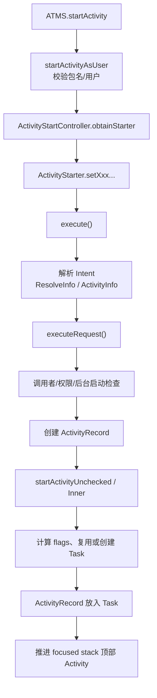
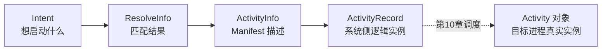
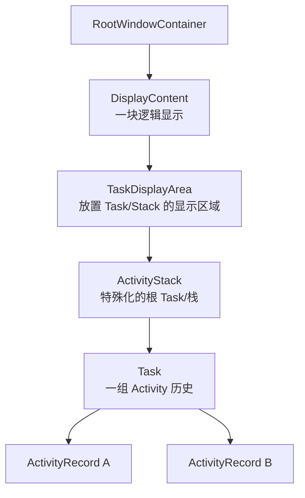
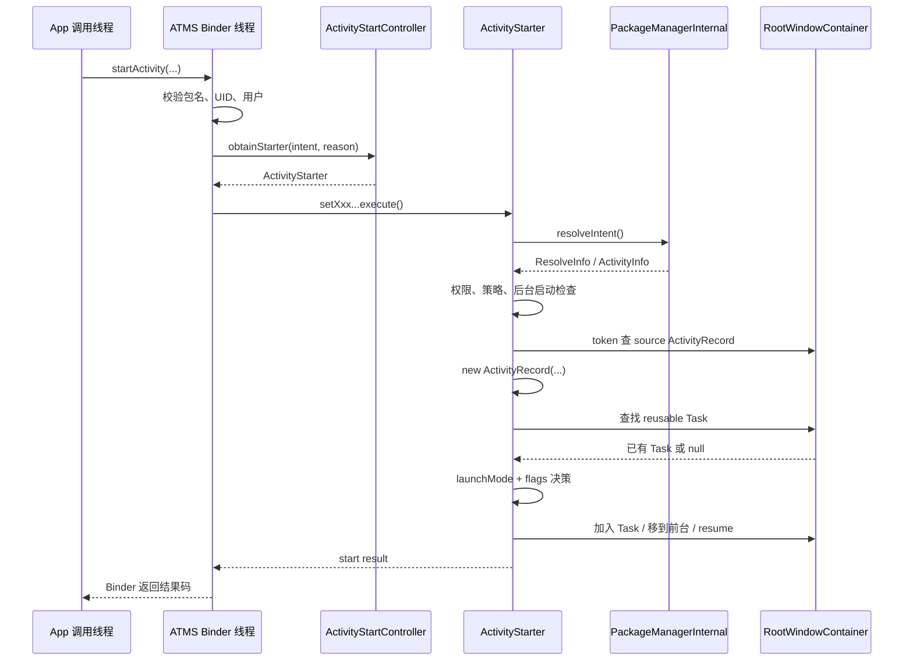
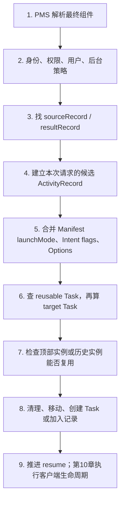

# 09 Activity 启动流程（二）：ATMS 系统端调度

## 本章边界

上一章停在：

```text
[App 调用线程]
IActivityTaskManager.Proxy.startActivity(...)
        ↓ Binder
[system_server Binder 线程]
ActivityTaskManagerService.startActivity(...)
```

本章研究 system_server 如何回答三个问题：

1. 这个 Intent 最终指向哪个 Activity？
2. 调用者是否有权启动，当前后台启动策略是否允许？
3. 应创建新 Activity、新 Task，还是复用已有实例/Task？

本章最终停在 ATMS 已经把目标 ActivityRecord 放入合适 Task，并开始推进顶部 Activity resume。目标进程创建、ClientTransaction 和 `onCreate()` 放在第 10 章。

## 本章目标

读完后，你应该能够：

1. 从 ATMS Binder 入口追到 `ActivityStarter.execute()`。
2. 解释为什么使用 Builder 风格的 `setXxx().execute()`。
3. 区分 Intent、ResolveInfo、ActivityInfo、ActivityRecord 和真实 Activity 对象。
4. 理解调用者识别、权限校验、Intent Firewall、后台启动限制。
5. 解释 RootWindowContainer、DisplayContent/TaskDisplayArea、ActivityStack、Task、ActivityRecord 的层级。
6. 从源码解释 standard、singleTop、singleTask、singleInstance 的主要决策。
7. 区分 NEW_TASK、CLEAR_TOP、SINGLE_TOP、CLEAR_TASK、REORDER_TO_FRONT。
8. 理解“复用 Activity”通常意味着 `onNewIntent()`，不是重新 `onCreate()`。

## 1. system_server 端总路线



不要试图第一次就记住所有分支。先抓住四个阶段：

```text
收集请求 → 解析与安全检查 → 建立系统记录 → Task/实例决策
```

## 2. ATMS Binder 入口

源码：

```text
/Users/ninebot/androidSource/frameworks/base/services/core/java/com/android/server/wm/ActivityTaskManagerService.java
```

入口：

```java
public final int startActivity(..., Bundle bOptions) {
    return startActivityAsUser(...,
            UserHandle.getCallingUserId());
}
```

这里使用 Binder 调用者 UID 推导 userId。Android 是多用户系统，同一个包在不同用户下是不同安装/运行空间，因此解析组件和 Task 管理必须带 userId。

随后进入私有重载：

```java
private int startActivityAsUser(...) {
    assertPackageMatchesCallingUid(callingPackage);
    enforceNotIsolatedCaller("startActivityAsUser");

    userId = getActivityStartController().checkTargetUser(
            userId, validateIncomingUser,
            Binder.getCallingPid(), Binder.getCallingUid(),
            "startActivityAsUser");
    ...
}
```

入口先做三类基础验证：

- 包名是否属于真实 calling UID。
- isolated 进程是否被禁止调用。
- 目标用户是否允许访问。

## 3. 为什么先保留 Binder 身份

此时运行在 system_server Binder 线程，但线程携带远端调用者身份：

```java
Binder.getCallingUid()
Binder.getCallingPid()
```

ATMS 必须在 `clearCallingIdentity()` 前完成依赖真实调用者的校验和信息记录，否则可能错误地把调用者当成 system_server。

安全原则：

```text
先验证远端调用者
 → 保存 callingUid/callingPid 等必要信息
 → 仅在受控内部操作时 clearCallingIdentity
 → finally/正确路径恢复
```

## 4. ActivityStarter：一次启动请求的执行器

入口继续：

```java
return getActivityStartController()
        .obtainStarter(intent, "startActivityAsUser")
        .setCaller(caller)
        .setCallingPackage(callingPackage)
        .setCallingFeatureId(callingFeatureId)
        .setResolvedType(resolvedType)
        .setResultTo(resultTo)
        .setResultWho(resultWho)
        .setRequestCode(requestCode)
        .setStartFlags(startFlags)
        .setProfilerInfo(profilerInfo)
        .setActivityOptions(bOptions)
        .setUserId(userId)
        .execute();
```

这不是在创建 Activity 对象，而是在配置一次启动请求。

### 为什么不用一个超长方法参数表

Activity 启动入口很多：普通启动、批量启动、PendingIntent、Home、Voice、Assistant、指定用户等。它们共享大量参数但又有可选差异。

Builder 风格的好处：

- 每个入口只设置自己拥有的信息。
- 参数含义比位置式超长参数更清楚。
- 最终统一进入 `execute()`。
- ActivityStarter 可以通过 Factory 复用，减少频繁分配。

## 5. ActivityStartController 与 Factory

源码：

```text
frameworks/base/services/core/java/com/android/server/wm/ActivityStartController.java
```

```java
ActivityStarter obtainStarter(Intent intent, String reason) {
    return mFactory.obtain()
            .setIntent(intent)
            .setReason(reason);
}
```

注释强调 Starter 只在 `execute()` 前有效，执行完会回收：

```java
void onExecutionComplete(ActivityStarter starter) {
    ...
    mFactory.recycle(starter);
}
```

因此不要把 ActivityStarter 理解为某个 Activity 的长期系统记录。它更像一次性/可复用的“启动计算工作台”。长期记录是 ActivityRecord。

## 6. 五个对象先分清

| 对象 | 所在位置 | 表示什么 | 生命周期 |
|---|---|---|---|
| `Intent` | 两个进程都有副本 | 调用方的启动请求 | 一次请求/也可能保存为 Task baseIntent |
| `ResolveInfo` | system_server | Intent 匹配结果及匹配信息 | 解析阶段 |
| `ActivityInfo` | system_server | Manifest 中目标 Activity 的结构化信息 | 包信息生命周期 |
| `ActivityRecord` | system_server | 一个逻辑 Activity 实例的系统侧记录 | Activity 历史记录生命周期 |
| `Activity` 对象 | 目标 App 进程 | 真正执行生命周期、持有 Window/View 的 Java 对象 | 组件实例生命周期 |



最常见错误是看到 `new ActivityRecord()` 就以为目标 Activity 已经创建。此时 App 侧 Activity 对象可能还不存在，甚至目标进程也可能不存在。

## 7. `execute()` 第一件事：拒绝文件描述符泄漏

源码：

```text
frameworks/base/services/core/java/com/android/server/wm/ActivityStarter.java
```

```java
if (mRequest.intent != null
        && mRequest.intent.hasFileDescriptors()) {
    throw new IllegalArgumentException(
            "File descriptors passed in Intent");
}
```

文件描述符具有进程资源和权限语义，不能作为普通 Intent 内容任意泄漏。需要传文件访问能力时，通常应使用受控 URI、ClipData 与 URI grant 等机制。

## 8. Intent 解析：从“想做什么”到具体组件

如果请求尚未带 ActivityInfo：

```java
if (mRequest.activityInfo == null) {
    mRequest.resolveActivity(mSupervisor);
}
```

Request 内部先解析 Intent，再获得 ActivityInfo：

```text
ActivityStackSupervisor.resolveIntent()
 → PackageManagerInternal.resolveIntent()
 → ResolveInfo
 → ActivityStackSupervisor.resolveActivity()
 → ActivityInfo
 → intent.setComponent(...)
```

### 显式 Intent 也要解析

即使 Component 已指定，系统仍要查询 PMS 获得 ActivityInfo，并检查组件、用户、安装状态、enabled、权限等。显式只代表“目标名字明确”，不代表绕过系统验证。

### 隐式 Intent

系统综合 action、category、data、MIME type、用户、可见性和 filter 规则匹配。如果需要用户选择，解析结果可能导向 ResolverActivity/ChooserActivity，而不是原始候选之一。

## 9. `ResolveInfo` 与 `ActivityInfo`

`ResolveInfo` 关注“为什么/如何匹配到”，包含匹配优先级、filter、目标组件信息等；其中的 `activityInfo` 是目标 Activity 的 Manifest 信息。

`ActivityInfo` 常包含：

- packageName、name、processName。
- applicationInfo/uid。
- launchMode。
- exported、permission。
- taskAffinity。
- theme、screenOrientation、configChanges。
- documentLaunchMode、windowLayout。

系统把最终组件写回 Intent：

```java
intent.setComponent(new ComponentName(
        aInfo.applicationInfo.packageName,
        aInfo.name));
```

之后即使原来是隐式 Intent，历史记录也能稳定指向这次真正选择的组件。

## 10. 为什么解析时会清除调用身份

`ActivityStackSupervisor.resolveIntent()` 中：

```java
long token = Binder.clearCallingIdentity();
try {
    return packageManagerInternal.resolveIntent(...,
            filterCallingUid);
} finally {
    Binder.restoreCallingIdentity(token);
}
```

这里用 system_server 身份执行内部 PMS 查询，以避免 Binder 身份造成错误的跨用户/内部调用限制；但仍显式传入 `filterCallingUid`，让包可见性与过滤结果基于真正调用者。

所以 `clearCallingIdentity()` 不等于“忽略调用者安全”。安全相关调用者信息已经显式保存并继续传给解析逻辑。

## 11. `execute()` 的全局锁边界

解析之后：

```java
synchronized (mService.mGlobalLock) {
    long origId = Binder.clearCallingIdentity();
    ...
    res = executeRequest(mRequest);
    Binder.restoreCallingIdentity(origId);
    ...
}
```

Activity/Task/Window 层级是高度共享的系统状态，多个 Binder 线程可能同时发起启动、结束、旋转、窗口变化等操作。全局锁保证关键结构变更一致。

但全局锁也意味着：

- 锁内慢操作会影响大量窗口和 Activity 操作。
- 锁内跨进程同步调用容易导致死锁。
- 源码会尽量把某些外部查询放在锁外，或以 Handler/内部接口协调。

阅读 WM/ATMS 源码时，始终观察 `mGlobalLock` 的持有范围。

## 12. `executeRequest()`：把请求变成可调度记录

方法开头把 Request 字段取成本地变量：

```java
IApplicationThread caller = request.caller;
Intent intent = request.intent;
ActivityInfo aInfo = request.activityInfo;
IBinder resultTo = request.resultTo;
int callingPid = request.callingPid;
int callingUid = request.callingUid;
...
```

后续大致分为：

```text
识别 caller 进程
 → 找 sourceRecord/resultRecord
 → 检查解析错误
 → 权限与策略检查
 → 必要时拦截/改写目标
 → 创建 ActivityRecord
 → 检查 App switch
 → startActivityUnchecked()
```

## 13. 如何从 IApplicationThread 找到调用进程

```java
WindowProcessController callerApp = null;
if (caller != null) {
    callerApp = mService.getProcessController(caller);
    if (callerApp != null) {
        callingPid = callerApp.getPid();
        callingUid = callerApp.mInfo.uid;
    } else {
        err = START_PERMISSION_DENIED;
    }
}
```

ATMS 不仅使用客户端传来的包名，还把 IApplicationThread Binder 映射到已登记进程控制记录，从中得到可信的进程与 UID 信息。

### WindowProcessController 是什么

ATMS/WM 侧使用的进程控制表示，承载与 Activity/窗口调度相关的进程状态。它与 AMS 侧进程管理协作，但不要把它和真实 Linux 进程或 App 中的 ApplicationThread 对象混成一个东西。

## 14. 从 resultTo 找 sourceRecord

```java
ActivityRecord sourceRecord = null;
ActivityRecord resultRecord = null;

if (resultTo != null) {
    sourceRecord = mRootWindowContainer
            .isInAnyStack(resultTo);
    if (sourceRecord != null
            && requestCode >= 0
            && !sourceRecord.finishing) {
        resultRecord = sourceRecord;
    }
}
```

这里印证第 08 章：Activity token 是 App Activity 与 system_server ActivityRecord 之间的关联键。

- `sourceRecord`：谁发起启动，普通启动也有意义。
- `resultRecord`：谁应该接收结果，只有 requestCode 合法且 Activity 未 finishing 时才建立。

## 15. 解析失败如何返回

```java
if (intent.getComponent() == null) {
    err = START_INTENT_NOT_RESOLVED;
}

if (aInfo == null) {
    err = START_CLASS_NOT_FOUND;
}
```

错误码通过同步 Binder 返回 App，最终由 Instrumentation 转成 `ActivityNotFoundException` 等。

系统端先处理 result 取消、释放 ActivityOptions，再返回错误，避免调用方留下悬空结果等待或动画资源。

## 16. 启动安全不是一个 if

Android 11 组合多层检查：

```java
abort = !checkStartAnyActivityPermission(...);
abort |= !mIntentFirewall.checkStartActivity(...);
abort |= !mPermissionPolicyInternal.checkStartActivity(...);
restrictedBgActivity = shouldAbortBackgroundActivityStart(...);
```

### 组件与权限检查

包括目标是否 exported、调用者是否持有所需 permission、跨用户访问、调用 UID 等。

### Intent Firewall

系统策略层可基于 Intent、调用 UID/PID、目标应用等阻止特定组件启动。

### Permission Policy

结合运行时权限与系统权限策略作额外判断。

### 后台 Activity 启动限制

后台应用不能随意抢到前台弹页面。系统结合 calling/realCalling UID、进程状态、PendingIntent 来源、允许标志等判断。

这几层目的不同，不能只找到某一个 `checkPermission()` 就认为安全检查结束。

## 17. realCallingUid 与 callingUid

普通直接调用时二者往往一致，但经过 PendingIntent、代理入口、身份转交或内部调用时可能不同。

- realCallingUid/Pid：Binder 边界最初真实调用者。
- callingUid/Pid：经过受控代理或请求构造后，当前用于归因本次启动的调用身份。

系统同时保留两者，是为了既支持合法代理场景，又不丢失真实来源，避免后台启动与权限策略被错误绕过。

## 18. 拦截器可能改写目标

```java
if (mInterceptor.intercept(...)) {
    intent = mInterceptor.mIntent;
    rInfo = mInterceptor.mRInfo;
    aInfo = mInterceptor.mAInfo;
    ...
}
```

典型场景：

- 工作资料处于 quiet mode，需要先展示解锁/提示页面。
- 目标应用被 suspended。
- 权限需要 review，先启动权限审查 Activity。
- 瞬时应用需要先进入安装器。

因此用户发出的原始 Intent 和最终创建 ActivityRecord 的 Intent 不一定相同。系统可能合法地插入中间页面，并保留稍后继续原请求的能力。

## 19. ActivityRecord：系统侧的逻辑 Activity

通过所有前置检查后：

```java
ActivityRecord r = new ActivityRecord(
        mService,
        callerApp,
        callingPid,
        callingUid,
        callingPackage,
        callingFeatureId,
        intent,
        resolvedType,
        aInfo,
        globalConfiguration,
        resultRecord,
        resultWho,
        requestCode,
        ...);
```

ActivityRecord 记录：

- 目标组件、Intent、ActivityInfo。
- 启动来源 UID/包。
- resultTo/requestCode。
- 所属用户、Task、显示区域。
- 生命周期状态、可见性、窗口 token。
- 目标进程关联。

它位于 `com.android.server.wm`，并继承 WindowToken，反映 Android 10/11 之后 Activity/Task 管理与窗口层级深度整合。

## 20. 为什么先有 ActivityRecord，后有 Activity

系统必须先决定：

- 目标放在哪个 Task/Display。
- 是否复用已有实例。
- 当前顶部谁先 pause。
- 是否需要创建目标进程。
- 以什么配置和窗口模式启动。

只有系统记录确定后，才有条件命令目标进程创建 Activity 对象。

```text
ActivityRecord = 系统的调度事实
Activity 对象 = App 进程执行组件代码的实例
```

## 21. App Switch 与延迟启动

系统还会检查当前是否允许应用切换：

```java
if (!mService.checkAppSwitchAllowedLocked(...)) {
    mController.addPendingActivityLaunch(...);
    return START_SWITCHES_CANCELED;
}
```

某些启动会被暂存为 PendingActivityLaunch，待允许切换时再处理。这说明同步 `startActivity()` 请求并不保证立即可见；系统调度还受全局交互状态约束。

## 22. 进入 Task 决策阶段

```java
mLastStartActivityResult = startActivityUnchecked(
        r, sourceRecord, voiceSession, voiceInteractor,
        startFlags, true /* doResume */, checkedOptions,
        inTask, restrictedBgActivity, intentGrants);
```

“Unchecked”不表示没有安全检查，而是前面的 `executeRequest()` 已完成主要权限与策略验证。这个方法聚焦结构和状态调度。

## 23. 为什么临时 defer Window Layout

```java
mService.deferWindowLayout();
try {
    result = startActivityInner(...);
} finally {
    handleStartResult(...);
    mService.continueWindowLayout();
}
```

Task、Stack、ActivityRecord 可能连续发生多次结构变化。如果每一步都立即触发布局和 Surface 更新，会看到中间不一致状态并增加开销。

defer/continue 把多步结构修改作为一个相对完整的批次，再统一继续窗口布局。`finally` 确保异常或提前返回时也恢复布局。

## 24. 窗口容器层级地图

Android 11 源码中常见抽象：



源码版本演进会改变命名。Android 11 处在 ActivityStack/Task 与 WindowContainer 模型持续整合阶段；阅读新版本文章时可能看到 RootTask、TaskFragment 等不同表述。

### RootWindowContainer

整个窗口容器层级根节点，跨显示查找 Activity/Task、获取 focused stack、推进顶部 Activity。

### DisplayContent / TaskDisplayArea

表示显示及其中可放置 Task 的区域。多屏、分屏和自由窗口都需要明确目标显示区域。

### ActivityStack

Android 11 中管理顶部 Activity 状态、resume/pause 和一组子 Task 的特殊容器。需要特别注意：源码声明是 `class ActivityStack extends Task`。也就是说它本身就是一种特殊 Task，通常承担 root task/stack 角色，而不是一个与 Task 完全无继承关系的普通列表。

### Task

通用任务容器。叶子 Task 对应用户视角的一段 Activity 历史，拥有 taskId、baseIntent、affinity、最近任务状态等；某些 Task 子类/上层 Task 也可作为组织其他 Task 的容器。

因此前面的层级图是“常见逻辑布局”，不是说 Java 类型系统永远严格只有 `ActivityStack → Task` 这一种固定组合。

### ActivityRecord

Task 中的单个逻辑 Activity 记录。

## 25. Task 不是进程，也不等于应用

三个概念相互独立：

| 概念 | 回答的问题 |
|---|---|
| Process | 代码在哪个 Linux 进程运行？ |
| Task | 用户返回/最近任务视角下，Activity 历史如何组织？ |
| Application/package | 代码与资源属于哪个安装包？ |

一个 Task 可以包含来自多个应用的 Activity；同一应用也可以拥有多个 Task；一个进程也可能承载多个 Activity 实例。

## 26. `startActivityInner()` 的决策骨架

```java
setInitialState(...);
computeLaunchingTaskFlags();
computeSourceStack();
mIntent.setFlags(mLaunchFlags);

Task reusedTask = getReusableTask();
Task targetTask = reusedTask != null
        ? reusedTask : computeTargetTask();
boolean newTask = targetTask == null;

computeLaunchParams(...);
isAllowedToStart(...);
recycleTask(...);
deliverToCurrentTopIfNeeded(...);
...
```

翻译为普通语言：

```text
整理 launchMode/flags/options
 → 找来源 Task/Stack
 → 看有没有应该复用的 Task
 → 没有则决定当前 Task 或新 Task
 → 计算 display/windowing mode
 → 看现有顶部实例是否直接接收新 Intent
 → 否则把新 ActivityRecord 加入目标 Task
```

## 27. `setInitialState()` 合并 Manifest 与 Intent

```java
mLaunchMode = r.launchMode;
mLaunchFlags = adjustLaunchFlagsToDocumentMode(
        r,
        LAUNCH_SINGLE_INSTANCE == mLaunchMode,
        LAUNCH_SINGLE_TASK == mLaunchMode,
        mIntent.getFlags());
```

最终决策同时受以下来源影响：

- Manifest `launchMode`。
- Manifest `documentLaunchMode`、taskAffinity。
- Intent flags。
- ActivityOptions（display、taskId、windowing mode 等）。
- sourceRecord、显式 inTask。
- 当前系统的 Task/Activity 历史。

所以不能只凭 launchMode 背诵结果；同一个 launchMode 在不同 flags 和历史状态下可能走不同分支。

## 28. `computeLaunchingTaskFlags()`

这一方法会补充或修正 Task 相关 flag。例如：

```java
if (mSourceRecord == null) {
    mLaunchFlags |= FLAG_ACTIVITY_NEW_TASK;
}
```

这与第 08 章非 Activity Context 的语义一致：没有来源 Activity，就无法自然加入来源 Task。

另外：

- 来源 Activity 是 singleInstance 时，它启动的新 Activity 通常要进入其他 Task。
- 目标是 singleTask/singleInstance 时，会加入 NEW_TASK 语义。
- 来源正在 finishing 时，不能再可靠依附它的 Task，可能强制 NEW_TASK。

## 29. `getReusableTask()` 在找什么

主要条件简化为：

```java
boolean putIntoExistingTask =
        (NEW_TASK && !MULTIPLE_TASK)
        || singleTask
        || singleInstance;
```

随后：

- 如果 ActivityOptions 明确指定 taskId，先尝试该 Task。
- singleInstance 做更严格的实例搜索。
- 其他 NEW_TASK/singleTask 场景通过 RootWindowContainer 查找匹配 Task。
- 请求 result 时通常不能随意复用另一个 Task。

“复用 Task”不一定等于“复用 Activity 实例”。找到 Task 后，还要看 CLEAR_TOP、SINGLE_TOP、目标在栈中位置等决定是投递新 Intent 还是创建新 ActivityRecord。

## 30. 四种 launchMode：用实例与 Task 两个维度理解

### standard / LAUNCH_MULTIPLE

通常每次创建新 Activity 实例，并加入来源或目标 Task。

```text
原 Task: A → B
从 B 启动 A
结果:   A → B → A(新实例)
```

### singleTop

只有目标已经是目标 Task 顶部时才复用，并调用 `onNewIntent()`；不在顶部仍创建新实例。

```text
原 Task: A → B
B 启动 B: A → B（复用顶部 B）
B 启动 A: A → B → A（A 不在顶部，创建新实例）
```

### singleTask

系统寻找适合的已有 Task/目标实例。若找到目标，通常清除其上方 Activity，并把新 Intent 投递给已有实例；若没有则创建。

```text
原 Task: A → B → C
启动 A(singleTask)
结果:   A，并向已有 A 调用 onNewIntent()
```

实际 Task 搜索还受 affinity、用户、display、document 模式等影响。

### singleInstance

目标实例具有更强的全局唯一/独占 Task 语义；该 Activity 独占自己的 Task，其他 Activity 不与它放在同一 Task。它启动别的 Activity 时，别的 Activity 进入其他 Task。

## 31. launchMode 与 flags 不是一一对应

常用近似关系：

| Manifest/Intent | 主要语义 |
|---|---|
| `singleTop` / `FLAG_ACTIVITY_SINGLE_TOP` | 目标位于顶部时复用 |
| `singleTask` | 寻找已有任务/实例并清理其上方 |
| `FLAG_ACTIVITY_NEW_TASK` | 从 Task 级别寻找/创建目标 Task |
| `FLAG_ACTIVITY_CLEAR_TOP` | 若目标已在 Task 中，移除其上方 Activity |
| `NEW_TASK | CLEAR_TASK` | 清空目标 Task，再以目标作为新根 |
| `FLAG_ACTIVITY_REORDER_TO_FRONT` | 将 Task 内已有目标移动到顶部 |

但它们不是简单等价：NEW_TASK 本身不保证目标 Activity 实例一定复用；CLEAR_TOP 对 standard 目标可能涉及旧实例结束后新建；最终以 ActivityStarter 当前历史状态判断为准。

## 32. 顶部复用判断

`deliverToCurrentTopIfNeeded()` 的核心条件：

```java
top != null
&& resultTo == null
&& top.component == start.component
&& top.userId == start.userId
&& top.attachedToProcess()
&& (FLAG_SINGLE_TOP
        || launchMode == singleTop
        || launchMode == singleTask)
```

满足后不会创建新 Activity 实例，而是：

```java
deliverNewIntent(top, intentGrants);
return START_DELIVERED_TO_TOP;
```

目标进程后续会收到新 Intent，并调用已有 Activity 的 `onNewIntent()`。

为什么要求 `resultTo == null`？因为请求结果会建立实例间明确关系，直接复用顶部实例可能破坏调用者期望的结果语义。

## 33. CLEAR_TOP 与 Task 清理

`complyActivityFlags()` 处理：

```java
if (NEW_TASK && CLEAR_TASK) {
    targetTask.performClearTaskLocked();
    mAddingToTask = true;
} else if (CLEAR_TOP || singleTask || singleInstance) {
    ActivityRecord top =
            targetTask.performClearTaskForReuseLocked(...);
    if (top != null) {
        deliverNewIntent(top, intentGrants);
    } else {
        mAddingToTask = true;
    }
}
```

概念示例：

```text
Task: A → B → C → D
以 CLEAR_TOP 启动 B

系统找到 B，移除/结束 B 上方的 C、D；
随后是复用 B 还是重建 B，还要结合 B 的 launchMode 与 SINGLE_TOP 等条件。
```

不要机械记成“CLEAR_TOP 永远复用 B”。

## 34. `computeTargetTask()`

没有可复用 Task 后：

```java
if (需要全新 Task) {
    return null;
} else if (sourceRecord != null) {
    return sourceRecord.getTask();
} else if (inTask != null) {
    return inTask;
} else {
    // 从合适 stack 顶部 Task 等推导
}
```

返回 null 在这里不一定是错误，而是表示“调用方应该创建新 Task”。

## 35. LaunchParams：不只决定 Task

`computeLaunchParams()` 还计算：

- 目标 display / TaskDisplayArea。
- windowing mode：全屏、分屏、自由窗口等。
- launch bounds。
- ActivityOptions 和设备策略的影响。

因此 Activity 启动属于 WindowManager 子系统并非偶然：启动决策不仅关心组件，还必须决定它在什么显示和窗口容器中出现。

## 36. 创建新 Task 或加入已有 Task

决策完成后：

```java
if (newTask) {
    setNewTask(...);
} else if (mAddingToTask) {
    addOrReparentStartingActivity(
            targetTask, "adding to task");
}
```

- `setNewTask()`：创建/设置新 Task，把 ActivityRecord 作为其中成员。
- `addOrReparentStartingActivity()`：加入或移动到已有 Task。

到这里系统侧容器归属才真正确定。

## 37. URI 权限为什么在这里授予

Intent 可能携带 content URI 和临时读写权限。系统已经解析出真实目标 UID，并确定启动被允许后，才安全地授予：

```java
grantUriPermissionUncheckedFromIntent(
        intentGrants,
        mStartActivity.getUriPermissionsLocked());
```

过早授予可能在启动被拒绝或被拦截改写时把能力给错目标。因此 Intent 解析、拦截与权限验证顺序非常重要。

## 38. 把目标 Task/Stack 移到前台

如果允许 resume：

```java
mTargetStack.getStack().moveToFront(
        "reuseOrNewTask", targetTask);
```

随后 ActivityRecord 被加入窗口/Activity 层级：

```java
mTargetStack.startActivityLocked(
        mStartActivity, previousTop, newTask,
        mKeepCurTransition, mOptions);
```

这里名字叫 `startActivityLocked`，仍主要是系统侧记录、层级、转场和可见性准备，不等于 App 已执行 `onCreate()`。

## 39. 推进 resume

```java
mRootWindowContainer.resumeFocusedStacksTopActivities(
        mTargetStack, mStartActivity, mOptions);
```

它开始协调：

- 当前 resumed Activity 是否需要 pause。
- 目标 Activity 是否已有进程。
- 目标是否可直接 realStart。
- 否则是否请求创建进程。

第 10 章从这里继续，追到 Zygote、ApplicationThread、ClientTransaction 和 ActivityThread。

## 40. 返回码并不只有成功/失败

Activity 启动结果可能包括：

| 结果 | 含义 |
|---|---|
| `START_SUCCESS` | 创建/调度新启动流程 |
| `START_DELIVERED_TO_TOP` | 已有顶部实例收到新 Intent |
| `START_TASK_TO_FRONT` | 已有 Task 被带到前台 |
| `START_INTENT_NOT_RESOLVED` | Intent 无匹配组件 |
| `START_CLASS_NOT_FOUND` | 目标 ActivityInfo 不存在 |
| `START_PERMISSION_DENIED` | 权限/调用身份不允许 |
| `START_ABORTED` | 被策略阻止，但可能对调用方伪装为已处理 |

“成功类结果”不一定表示创建了新实例。例如 DELIVERED_TO_TOP 是复用。

## 41. 为什么某些策略阻止却返回得像成功

源码在部分 abort 场景写道：对调用者假装已启动，同时 result 场景返回取消。

这可避免恶意或后台调用方通过精确错误差异探测系统状态，也能保持某些 API 兼容语义。系统安全策略的“实际动作”与外部返回值不一定一一暴露。

## 42. 完整时序图



## 43. 一条 concrete 示例：A → B（standard）

假设：

- A 在前台 Task 100 顶部。
- A 用显式 Intent 启动 standard B。
- 没有 NEW_TASK/CLEAR_TOP 等 flag。

路径：

```text
resultTo token → 找到 sourceRecord A
PMS 解析 → ActivityInfo B
权限检查通过
new ActivityRecord(B)
sourceRecord 非空 → targetTask = Task 100
B 不是顶部复用场景
把 B record 加入 Task 100
Task: A → B
推进 resume：先协调 A pause，再启动/恢复 B
```

## 44. 示例：顶部 B 再启动 B（singleTop）

```text
Task: A → B
B 启动 B，B launchMode=singleTop
```

系统发现目标组件就是当前 top，且满足 singleTop：

```text
前面为本次请求构造的候选 ActivityRecord 不会作为新实例加入 Task
 → 复用历史中已有的 B ActivityRecord
 → deliverNewIntent(B)
 → 返回 START_DELIVERED_TO_TOP
 → 目标进程后续调用 B.onNewIntent()
```

这里要精确区分“构造候选 ActivityRecord”和“正式创建新逻辑实例”：`executeRequest()` 为统一决策通常先构造候选记录；发现可复用顶部 B 后，该候选记录不会成为 Task 中的新成员，已有 B 才是最终目标。

## 45. 示例：A → B → C 后 CLEAR_TOP 启动 B

```text
Task: A → B → C
C 以 FLAG_ACTIVITY_CLEAR_TOP 启动 B
```

系统找到 Task 中的 B，清理 B 上方的 C。B 是否直接复用还受 B launchMode/SINGLE_TOP 等影响，因此理解为：

```text
CLEAR_TOP 首先规定“清掉目标上方”
实例是否保留/新建由后续复用规则决定
```

## 46. 实际阅读练习

### 练习一：从 ATMS 追到 execute

```bash
cd /Users/ninebot/androidSource
sed -n '1038,1105p' \
  frameworks/base/services/core/java/com/android/server/wm/ActivityTaskManagerService.java
```

任务：圈出调用身份校验、用户校验和 Builder 参数。

### 练习二：观察 Starter 生命周期

```bash
rg -n 'obtainStarter|onExecutionComplete|recycle' \
  frameworks/base/services/core/java/com/android/server/wm/ActivityStartController.java
```

任务：解释为什么 Starter 不是长期 Activity 记录。

### 练习三：追 Intent 解析

```bash
rg -n 'resolveIntent\(|resolveActivity\(' \
  frameworks/base/services/core/java/com/android/server/wm/ActivityStackSupervisor.java
```

任务：写出 Intent → ResolveInfo → ActivityInfo。

### 练习四：找 sourceRecord

```bash
rg -n 'sourceRecord =|resultRecord =|isInAnyStack' \
  frameworks/base/services/core/java/com/android/server/wm/ActivityStarter.java
```

任务：解释 resultTo token 如何变回系统侧记录。

### 练习五：找安全检查

```bash
rg -n 'checkStartAnyActivityPermission|IntentFirewall|shouldAbortBackgroundActivityStart' \
  frameworks/base/services/core/java/com/android/server/wm/ActivityStarter.java
```

任务：说明三类检查关注点为何不同。

### 练习六：追 Task 决策骨架

```bash
sed -n '1588,1665p' \
  frameworks/base/services/core/java/com/android/server/wm/ActivityStarter.java
```

任务：按顺序写出 initial state、flags、reusable task、target task。

### 练习七：观察顶部复用

```bash
rg -n 'deliverToCurrentTopIfNeeded|deliverNewIntent' \
  frameworks/base/services/core/java/com/android/server/wm/ActivityStarter.java
```

任务：列出顶部实例复用的五个主要条件。

### 练习八：找到最终 resume 入口

```bash
rg -n 'startActivityLocked|resumeFocusedStacksTopActivities' \
  frameworks/base/services/core/java/com/android/server/wm/ActivityStarter.java
```

任务：解释为什么到这里仍不能说 `onCreate()` 已执行。

## 47. 调试与观察

连接设备后：

```bash
# 当前 Activity/Task 层级
adb shell dumpsys activity activities

# 最近任务
adb shell dumpsys activity recents

# 窗口与显示层级
adb shell dumpsys window containers

# 过滤启动日志（不同构建日志标签/开关可能不同）
adb logcat -v threadtime | rg 'START u|ActivityTaskManager|ActivityStarter'
```

重点观察：

- taskId。
- `mResumedActivity`/top activity。
- ActivityRecord component。
- Intent flags 十六进制值。
- 返回是新建、deliver-to-top 还是 task-to-front。

## 48. 常见误区

### “ActivityInfo 就是 ActivityRecord”

错误。ActivityInfo 是 Manifest 静态描述；ActivityRecord 是一次逻辑实例的动态系统记录。

### “创建 ActivityRecord 等于调用 onCreate”

错误。此时目标进程中的 Activity Java 对象可能还不存在。

### “Task 就是 App”

错误。Task 可以跨包组织 Activity，同一 App 也能有多个 Task。

### “startActivityUnchecked 没有权限检查”

错误。主要检查已在 executeRequest 完成，Unchecked 指进入后续结构调度阶段。

### “NEW_TASK 每次都新建 Task”

错误。没有 MULTIPLE_TASK 等限定时，系统通常先尝试查找可复用 Task。

### “singleTop 保证全系统只有一个实例”

错误。它只在目标已位于目标 Task 顶部时复用。

### “CLEAR_TOP 永远调用旧实例 onNewIntent”

错误。清理上方 Activity 与目标实例是否复用是相关但不同的决策。

### “安全检查只看 exported”

错误。还包括 permission、UID、用户、后台启动、Intent Firewall、策略等。

### “同步 startActivity 返回 START_SUCCESS 时目标已经显示”

错误。它表示系统调度决策成功，生命周期和绘制仍在后续推进。

## 49. 复读后的决策顺序速查

复读本章时，最容易犯的错误是直接从某一个 flag 推导最终结果。实际应按下面顺序思考：



### 四个“复用”不是一回事

| 说法 | 真正含义 |
|---|---|
| 复用服务 Proxy | App 缓存同一个 ATMS Binder Proxy |
| 复用 ActivityStarter | Factory 回收一次启动计算对象，和 Activity 实例无关 |
| 复用 Task | 找到已有 Task 作为目标，但仍可能创建新 Activity 实例 |
| 复用 Activity | 使用已有 ActivityRecord/客户端对象并投递 `onNewIntent()` |

### 阅读启动模式的最小问题集

不要只问“launchMode 是什么”，至少同时问：

1. sourceRecord 是否存在、是否 finishing？
2. 目标组件当前是否已经在某个 Task 中？
3. 它是否位于目标 Task 顶部？
4. Intent 是否含 NEW_TASK、MULTIPLE_TASK、CLEAR_TOP、CLEAR_TASK、SINGLE_TOP？
5. 是否请求 result？
6. ActivityOptions 是否指定 taskId、display 或 windowing mode？

这些问题共同决定最终路径。

## 本章检查题

1. ActivityStarter 与 ActivityRecord 的生命周期有何不同？
2. Intent、ResolveInfo、ActivityInfo、ActivityRecord 如何依次产生？
3. 为什么解析 Intent 时 clear identity 后仍能按调用者过滤？
4. sourceRecord 和 resultRecord 有何区别？
5. 启动安全为什么需要多层检查？
6. Task、ActivityStack、DisplayContent 分别解决什么层级问题？
7. standard 与 singleTop 在 `A → B` 顶部再次启动 B 时有何区别？
8. NEW_TASK 为什么不等于必然新建 Task？
9. CLEAR_TOP 为什么不能简单等同于复用实例？
10. `getReusableTask()` 与 `computeTargetTask()` 分别做什么？
11. 为什么 URI grant 要等最终目标确定后再授予？
12. `resumeFocusedStacksTopActivities()` 之后还缺哪些步骤才能到 `onCreate()`？

## 完成标准

不看文档讲清下面主线：

```text
[system_server Binder 线程]
ATMS.startActivity
 → 校验 calling package / UID / user
 → ActivityStartController.obtainStarter
 → ActivityStarter.execute
 → PMS resolve Intent
 → caller/source/result 识别
 → 权限、Firewall、后台启动检查
 → new ActivityRecord
 → startActivityUnchecked / startActivityInner
 → 合并 launchMode + Intent flags + ActivityOptions
 → reusable Task / target Task / new Task
 → 顶部复用或加入新 ActivityRecord
 → moveToFront / resumeFocusedStacksTopActivities
```

并能准确区分 ActivityInfo、ActivityRecord、Task 和 App Activity 对象。完成后进入第 10 章：目标进程不存在时如何请求 Zygote，存在时如何通过 ClientTransaction 调用 `ActivityThread`，最终执行 `onCreate()`。
