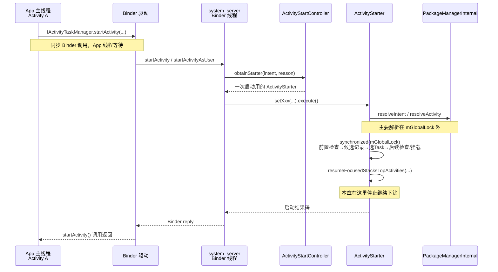

# 09 Activity 启动流程（二）：ATMS 系统端调度

> 源码基线：Android 11 / API 30 / `android-11.0.0_r48`
> 阅读方式：macOS 上静态阅读源码，不要求编译或运行 AOSP。

你在 `Activity A` 的按钮回调里调用了 `startActivity()`，方法已经返回，`Activity B` 却还没有执行 `onCreate()`；或者 B 没有新建，旧页面反而收到了 `onNewIntent()`。要解释这些现象，不能只看 App 进程，还要知道 ATMS 在系统端做了什么决定。

**一句话结论：ATMS 不负责 `new Activity B()`；它先把请求解析成目标组件并完成前置检查，再建立候选 `ActivityRecord`，结合目标 Task 做后续策略检查，最终决定复用还是挂载记录并推进 resume 调度。**

读完本章，你应该能判断问题卡在三类位置中的哪一类：

- Intent 没有解析到预期组件；
- 权限或系统策略拒绝、拦截了启动；
- launchMode、flags 或当前任务状态改变了 Task/实例选择。

本章只使用一个贯穿场景：前台同一应用的 `Activity A` 显式启动 `standard` 模式的 `Activity B`，不加特殊 flag，A、B 属于同一用户，应用进程已经存在。源码追到 `resumeFocusedStacksTopActivities()` 这个边界就停止；目标进程如何收到事务、主线程如何创建 B、何时回调 `onCreate()`，留到第 10 章。

## 1. 为什么请求到了 ATMS，还不能直接创建 B

App 传给系统的主要是一个 `Intent`、调用者信息和 Activity token。仅凭这些信息，系统还不能直接说“创建 B”，因为它至少要回答：

1. 这个 Intent 在当前用户下究竟匹配哪个组件？
2. 调用者能否访问该组件，后台启动等策略是否允许？
3. B 应进入 A 所在的 Task，还是另一个已有 Task，或一个新 Task？
4. 是否已经有可复用的 B，因而根本不需要创建新实例？

可以把 ATMS 暂时理解成“交通调度台”：A 提交的是出发请求，调度台掌握所有 Task、显示区域和系统策略，因此由它决定目的地与路线；但真正开车的是目标 App 进程的主线程。类比只帮助建立第一印象，源码中的真实角色是：

| 角色 | 真实职责 |
|---|---|
| `ActivityTaskManagerService` | Binder 入口，校验调用身份和目标用户 |
| `ActivityStartController` | 提供并回收一次启动所用的 `ActivityStarter` |
| `ActivityStarter` | 分阶段解析和检查，建立候选记录、选择 Task，推进启动 |
| `ActivityRecord` | system_server 中一个逻辑 Activity 实例的记录 |
| App 中的 `Activity` 对象 | 目标进程主线程稍后创建的真实组件对象 |

这套分工的意义是：影响全局界面状态的决策集中在 system_server，应用不能自行伪造 Task 归属，也不能绕过组件权限和跨用户限制。

## 2. 先把进程、线程、锁和返回点放在一张图里



在本章设定的点击场景里，线程与锁可以这样读：

| 阶段 | 进程 / 线程 | `mGlobalLock` | 阶段完成代表什么 |
|---|---|---|---|
| A 调用 `startActivity()` | App 进程 / 主线程 | 无 | 发出请求并等待同步 Binder 返回 |
| ATMS 入口与 `ActivityStarter.execute()` | system_server / Binder 线程池中的一条线程 | 分阶段持有 | 系统开始解析和修改 Activity/Task 状态 |
| Intent 解析 | 同一条 system_server Binder 线程 | 主体在锁外，少量查询会短暂加锁 | 得到 `ResolveInfo`、`ActivityInfo` 等 |
| `executeRequest()`、`startActivityInner()` | 同一条 system_server Binder 线程 | 由 `execute()` 外层持有 | 分阶段完成前置检查、候选记录和 Task 相关策略决策，正常路径再把记录放入 Task |
| 目标 B 的生命周期 | 目标 App / 主线程 | 不持有 ATMS Java 全局锁 | 属于下一章，不能由本次 Binder 返回推断已经完成 |

这里没有一条必经的 `Handler.post()` 把 ATMS 调度整体切到 system_server 主线程。App 发来的远程调用先落在 system_server 的 Binder 线程，本章主路径也在这条线程上继续执行。

## 3. 同步 Binder 入口怎样变成一次 `ActivityStarter` 请求

接口声明位于：

`frameworks/base/core/java/android/app/IActivityTaskManager.aidl`

```aidl
interface IActivityTaskManager {
    int startActivity(in IApplicationThread caller, in String callingPackage,
            in String callingFeatureId, in Intent intent, in String resolvedType,
            in IBinder resultTo, in String resultWho, int requestCode,
            int flags, in ProfilerInfo profilerInfo, in Bundle options);
}
```

它有返回值，而且接口和方法都没有标记 `oneway`，所以远程调用是同步 Binder 请求。`Activity.startActivity()` 对应用暴露的是 `void`，但内部的 `Instrumentation` 会拿到这个 `int` 结果并检查失败码。

“同步”只表示：调用线程等待 ATMS 给这次请求返回结果。它**不表示**调用线程等待 B 的 `onCreate()`，更不表示等待首帧显示。

ATMS 入口位于：

`frameworks/base/services/core/java/com/android/server/wm/ActivityTaskManagerService.java`

```java
private int startActivityAsUser(...) {
    assertPackageMatchesCallingUid(callingPackage);
    enforceNotIsolatedCaller("startActivityAsUser");
    userId = getActivityStartController().checkTargetUser(
            userId, validateIncomingUser, Binder.getCallingPid(),
            Binder.getCallingUid(), "startActivityAsUser");
    return getActivityStartController()
            .obtainStarter(intent, "startActivityAsUser")
            // 省略若干 setXxx(...)
            .setUserId(userId).execute();
}
```

这段代码先验证“包名是否属于 Binder 调用 UID”“isolated 进程能否调用”“目标用户是否合法”，然后才组装启动请求。

`ActivityStartController.obtainStarter()` 很短：

```java
ActivityStarter obtainStarter(Intent intent, String reason) {
    return mFactory.obtain()
            .setIntent(intent)
            .setReason(reason);
}
```

为什么不把几十个参数塞进一个超长方法？因为普通启动、PendingIntent、Home、指定用户等入口拥有不同的可选信息。`setXxx()` 让各入口先收集自己的参数，最后统一在 `execute()` 中处理。

`ActivityStarter` 是“一次启动计算器”，不是长期保存某个 Activity 的对象。`execute()` 结束后，`ActivityStartController.onExecutionComplete()` 会保存必要的最后执行信息并回收 Starter。真正进入 Activity 历史结构的是后面创建并挂载的 `ActivityRecord`。

## 4. Intent 怎样变成可检查的目标组件

Intent 只表达“想去哪里”，调度还需要目标组件的 Manifest 信息。`ActivityStarter.Request.resolveActivity()` 完成这次转换，关键部分是：

```java
resolveInfo = supervisor.resolveIntent(intent, resolvedType, userId,
        0 /* matchFlags */,
        computeResolveFilterUid(callingUid, realCallingUid, filterCallingUid));
activityInfo = supervisor.resolveActivity(
        intent, resolveInfo, startFlags, profilerInfo);
if (activityInfo != null) {
    intentGrants = supervisor.mService.mUgmInternal
            .checkGrantUriPermissionFromIntent(intent, resolvedCallingUid,
                    activityInfo.applicationInfo.packageName,
                    UserHandle.getUserId(activityInfo.applicationInfo.uid));
}
```

三个容易混淆的对象只需要这样区分：

| 对象 | 回答的问题 | 是否代表 App 中真实的 B |
|---|---|---|
| `Intent` | 调用者想启动什么 | 否 |
| `ResolveInfo` / `ActivityInfo` | 匹配到了谁；Manifest 如何声明它 | 否 |
| `ActivityRecord` | system_server 如何记录这次逻辑实例 | 仍然不是 |

本章场景使用显式 Intent，组件名虽然已经确定，系统仍要取得 `ActivityInfo`，才能继续检查 UID、`exported`、permission、launchMode、processName 等信息。显式 Intent 的含义是“目标名字明确”，不是“跳过 PackageManager 和安全检查”。

### 为什么解析没有一直拿着 `mGlobalLock`

`ActivityStarter.execute()` 的结构是：

```java
if (mRequest.activityInfo == null) {
    mRequest.resolveActivity(mSupervisor);
}

int res;
synchronized (mService.mGlobalLock) {
    final long origId = Binder.clearCallingIdentity();
    res = executeRequest(mRequest);
    Binder.restoreCallingIdentity(origId);
    return getExternalResult(res);
}
```

真实源码在返回前还有配置、启动指标和等待结果等处理，上面只保留锁边界。它证明两件事：

- 主要解析发生在外层 `mGlobalLock` 之外；
- 改动 Activity/Task 全局状态的 `executeRequest()` 在锁内执行。

源码注释明确提到，解析涉及动态 URI 权限时，错误地持有 WM 全局锁可能带来死锁风险。由此可以合理推断：把可能跨子系统的解析工作放到锁外，也能缩短全局状态锁的临界区。但“具体缩短了多少耗时”必须在设备上测量，本章没有数据，不给出虚构百分比。

解析前，`Request` 会用 `Binder.getCallingPid/Uid()` 保存真实来访者；内部查询可暂时 `clearCallingIdentity()`，但权限判断仍使用之前保存的 calling/realCalling 信息。不要把“清除 Binder 身份”误读成“后续不再检查原调用者”。

## 5. 为什么安全检查不是一个 `if`

一次 Activity 启动同时涉及组件暴露、声明权限、用户空间、设备策略和当前前后台状态。把它们压成一个 `allowed` 字段，既无法表达不同失败方式，也容易在新增策略时漏掉入口。

`ActivityStarter.executeRequest()` 中能直接看到三道检查：

```java
boolean abort = !mSupervisor.checkStartAnyActivityPermission(
        intent, aInfo, resultWho, requestCode, callingPid, callingUid,
        callingPackage, callingFeatureId, request.ignoreTargetSecurity,
        inTask != null, callerApp, resultRecord, resultStack);
abort |= !mService.mIntentFirewall.checkStartActivity(
        intent, callingUid, callingPid, resolvedType, aInfo.applicationInfo);
abort |= !mService.getPermissionPolicyInternal().checkStartActivity(
        intent, callingUid, callingPackage);
```

把完整流程按“问题”而不是类名记忆，会更容易：

| 问题 | 典型检查位置 | 失败表现不一定相同 |
|---|---|---|
| 你真的是所声明的包和进程吗 | ATMS 入口、`getProcessController()` | 异常或失败码 |
| 你能访问目标组件吗 | `checkStartAnyActivityPermission()` | 例如未导出/缺权限时抛 `SecurityException` |
| 这个 Intent 是否被系统规则禁止 | Intent Firewall、Permission Policy | 可中止启动 |
| 当前后台状态允许弹界面吗 | `shouldAbortBackgroundActivityStart()`、`isAllowedToStart()` | 依目标 Task 和兼容策略中止 |
| 目标显示区域或锁定任务模式允许吗 | `isAllowedToStart()` 等 | 返回相应 start result |

本章的 A 正在前台，且 A、B 属于同一应用，正常配置下这些门会通过。但“同一应用”也不是可以删除检查的理由：系统入口面对的是所有调用者，必须根据实际 Binder 身份做决定。

还有一个排错时很重要的兼容性细节：内部的 `START_ABORTED` 会被 `getExternalResult()` 转成 `START_SUCCESS`。因此调用方没有收到异常、`startActivity()` 正常返回，并不能单独证明新 Activity 已经创建。系统可能为了兼容旧应用，让外部看到“请求已处理”，但内部没有继续启动原目标。

## 6. `ActivityRecord` 是候选记录，不是 `Activity` 对象

ATMS 还要知道“谁发起了这次跳转”。从 Activity A 调用时传来的 `resultTo` 是 A 的 Activity token；系统用它找到 source record：

```java
ActivityRecord sourceRecord = null;
if (resultTo != null) {
    sourceRecord = mRootWindowContainer.isInAnyStack(resultTo);
    if (sourceRecord != null && requestCode >= 0
            && !sourceRecord.finishing) {
        resultRecord = sourceRecord;
    }
}
```

这里的 `resultTo` 不只是 `startActivityForResult()` 才有意义。即使普通跳转不等待结果，这个 token 也能帮助系统定位发起者 A，从而确定来源 Task、显示区域和调用关系。`requestCode >= 0` 时，它才进一步承担结果接收者的含义。

同一阶段还会把 `IApplicationThread caller` 映射为 `WindowProcessController`，校准 callingPid/callingUid。前者是 App 暴露给系统的 Binder 接口，后者是 system_server 维护的进程记录；两者都不是 Linux 进程本身。

目标解析和组件权限、Intent Firewall、Permission Policy 等前置检查完成后，系统创建 B 的候选记录：

```java
final ActivityRecord r = new ActivityRecord(
        mService, callerApp, callingPid, callingUid,
        callingPackage, callingFeatureId, intent, resolvedType, aInfo,
        mService.getGlobalConfiguration(), resultRecord, resultWho,
        requestCode, request.componentSpecified, voiceSession != null,
        mSupervisor, checkedOptions, sourceRecord);
mLastStartActivityRecord = r;
```

为什么说它还是“候选”？因为创建记录不等于最终获准或已经挂载。后面的 Task 相关后台启动/LockTask 等策略仍可能中止请求；singleTop、singleTask、`CLEAR_TOP` 等分支也可能找到旧记录并投递新 Intent，此时这个新建的 `ActivityRecord` 不会代表一个新的 App 侧 Activity 实例。

在本章的 `standard B + 无特殊 flag + B 不在顶部` 场景中，不发生实例复用，所以这条候选记录随后会真正加入 A 所在 Task。即使已经加入 Task，B 的 Java `Activity` 对象仍可能尚未创建；那是目标 App 主线程的工作。

## 7. ATMS 怎样为本章场景选择 Task

Task 不是进程，也不等于应用。它是系统组织 Activity 历史和返回栈的一种任务容器；一个 Task 可以包含不同应用的 Activity，同一应用也可以拥有多个 Task。

Android 11 r48 中，与本章有关的容器可以先记成：

```text
RootWindowContainer
└── DisplayContent
    └── TaskDisplayArea
        └── ActivityStack（Android 11 中的 root task / stack）
            └── Task
                └── ActivityRecord
```

后续 Android 版本重构过 WindowManager/Task 类层级，因此读新版本源码时不要强行寻找完全相同的 `ActivityStack` 类名；本章结论只以 Android 11 r48 为准。

`startActivityInner()` 的决策骨架是：

```java
setInitialState(r, options, inTask, doResume, startFlags,
        sourceRecord, voiceSession, voiceInteractor, restrictedBgActivity);
computeLaunchingTaskFlags();
computeSourceStack();
final Task reusedTask = getReusableTask();
final Task targetTask = reusedTask != null
        ? reusedTask : computeTargetTask();
final boolean newTask = targetTask == null;
mTargetTask = targetTask;
computeLaunchParams(r, sourceRecord, targetTask);
int startResult = isAllowedToStart(r, newTask, targetTask);
```

这段顺序值得记住：**先归一化 launchMode/flags 和来源，再寻找可复用 Task；找不到时才根据 source/inTask 等计算目标，最后还要检查是否允许放入那个 Task/显示区域。**

对于本章唯一场景，推导过程如下：

1. `sourceRecord` 是 A，A 已经属于 Task T1。
2. B 是 `standard`，Intent 没有 `NEW_TASK` 等特殊 flag，因此 `getReusableTask()` 不会找到一条需要复用的独立任务路径。
3. `computeTargetTask()` 看到有效的 `mSourceRecord`，返回 `mSourceRecord.getTask()`，也就是 T1。
4. `recycleTask()` 进入 `complyActivityFlags()`；普通已有 Task 且没有 clear/reuse/reset 等分支时，它把 `mAddingToTask` 设为 true。
5. `deliverToCurrentTopIfNeeded()` 再确认顶部 A 不满足同组件 singleTop 复用条件。
6. `addOrReparentStartingActivity(T1, ...)` 最终把 B 的 `ActivityRecord` 加到 T1 顶部。

第 3 步可由这几行直接证明：

```java
private Task computeTargetTask() {
    if (mStartActivity.resultTo == null && mInTask == null
            && !mAddingToTask
            && (mLaunchFlags & FLAG_ACTIVITY_NEW_TASK) != 0) {
        return null;
    } else if (mSourceRecord != null) {
        return mSourceRecord.getTask();
    } else if (mInTask != null) {
        return mInTask;
    }
    // 省略兜底分支
}
```

第 5 步的“加入”不是抽象说法，源码最终调用容器操作：

```java
private void addOrReparentStartingActivity(Task parent, String reason) {
    if (mStartActivity.getTask() == null
            || mStartActivity.getTask() == parent) {
        parent.addChild(mStartActivity);
    } else {
        mStartActivity.reparent(parent, parent.getChildCount(), reason);
    }
}
```

阅读其他分支时，可以用下面的短表定位，而不必一次背完所有 flag：

| 条件方向 | ATMS 可能做出的决定 |
|---|---|
| 有正常 source，且不要求新任务 | 优先使用 source 所在 Task |
| `NEW_TASK`、singleTask/singleInstance 等要求寻找任务 | 通过 `getReusableTask()` 查找合适的历史 Task |
| 最终没有目标 Task | `setNewTask()` 创建/取得新 Task 并挂载记录 |
| 顶部存在满足 singleTop 条件的同组件记录 | 向旧记录投递 Intent，不创建新的 B 实例 |

这些不是四套互相独立的固定公式。最终结果还会受到 `ActivityOptions`、显示区域、文档模式、锁定任务模式和现有历史状态影响。排查时必须同时记录 Manifest、Intent flags 与启动前的 Task 栈，不能只看其中一个字段。

### 全局锁到底保护了什么

`execute()` 在调用 `executeRequest()` 前进入 `synchronized (mService.mGlobalLock)`，而 `startActivityInner()` 是在这条调用链内同步执行的。因此 sourceRecord 查找、Task 选择、ActivityRecord 挂载等关键状态变更处于同一全局锁保护下。

锁的意义是避免另一条 system_server 线程同时改动 Activity/Task/显示容器树，让本次决策看到一半旧、一半新的状态。它不等于“整个启动只允许一条线程工作”，更不等于“目标 App 生命周期也受这把 Java 锁同步保护”。

`startActivityUnchecked()` 还会用 `deferWindowLayout()` / `continueWindowLayout()` 包围 `startActivityInner()`。这是延后窗口布局、把中间状态的布局工作合并到决策结束后处理；它不是释放 `mGlobalLock`，也不是切换线程。

## 8. `startActivity()` 返回时，究竟完成到了哪里

正常新建路径在挂载 ActivityRecord 后，会继续做前台与可见性调度。`startActivityInner()` 末段的关键入口是：

```java
mTargetStack.startActivityLocked(mStartActivity,
        topStack != null ? topStack.getTopNonFinishingActivity() : null,
        newTask, mKeepCurTransition, mOptions);

if (mDoResume) {
    mRootWindowContainer.resumeFocusedStacksTopActivities(
            mTargetStack, mStartActivity, mOptions);
}
```

本章在 `resumeFocusedStacksTopActivities()` 调用处停止继续下钻。它表示 ATMS 已经把“让目标成为合适顶部 Activity”的工作向后推进，但其内部还会进入暂停旧 Activity、查找或启动目标进程、发送客户端事务等流程，这些属于第 10 章。

由于外层 Binder 调用是同步的，App 线程通常要等 `ActivityStarter.execute()` 返回结果码后才能从 `startActivity()` 返回。对于本章正常路径，返回前 system_server 已完成目标解析、安全/策略检查、Task 选择和 ActivityRecord 挂载，并已经调用 resume 推进入口。

但下面这些结论不能从“方法返回”推出：

| 观察 | 正常 `startActivity()` 返回能否保证 |
|---|---|
| ATMS 已经处理本次请求并给出外部结果 | 能 |
| 一定新建了 ActivityRecord | 不能，可能复用、拦截或中止 |
| B 的 App 侧 `Activity` 对象已经创建 | 不能 |
| B 的 `onCreate()` 已经执行完 | 不能 |
| B 的首帧已经绘制并显示 | 不能 |

最实用的完成点定义是：

```text
startActivity() 返回
≠ 目标 Activity 生命周期完成
≠ 窗口已经可见

它只说明同步的“系统受理与调度阶段”已经返回。
```

如果结果是“已有 Task 被移到前台”或“新 Intent 投递给顶部旧实例”，同步返回点仍然成立，但系统端完成的具体动作不同。因此调试日志里最好同时记录启动结果、Task/ActivityRecord 变化和目标生命周期，而不是只记录调用前后两个时间点。

## 9. 用现象反推该查哪一段

| 现象 | 本章优先检查 | 还不能下的结论 |
|---|---|---|
| 直接抛 `SecurityException` | `checkStartAnyActivityPermission()`、组件 exported/permission、调用 UID | 不是“B 的 onCreate 崩了” |
| 调用正常返回，但没有打开原目标 | 后台启动策略、Intent Firewall、拦截器、App Switch；再接第 10 章 | 返回正常不代表原目标一定启动 |
| B 进入了意外 Task | `mSourceRecord`、launchMode、Intent flags、`computeTargetTask()` | 不能只怪 `NEW_TASK` 一个 flag |
| 旧 B 收到 `onNewIntent()` | `getReusableTask()`、`recycleTask()`、`deliverToCurrentTopIfNeeded()` | 不一定创建过新的 B 实例 |
| A 的调用线程长时间卡在 `startActivity()` | 同步 Binder、system_server 调度与锁等待；结合 trace/dump 验证 | 不能仅凭静态源码断言是哪把锁或耗时多少 |

最常见的误读有三种：

1. 看到 `new ActivityRecord()` 就说 B 已执行 `onCreate()`。两者分别在 system_server 与 App 进程。
2. 看到 `START_SUCCESS` 就说页面已显示。返回码描述的是启动请求处理结果，不是首帧完成信号。
3. 看到 `synchronized (mGlobalLock)` 就说整个调用都在锁内。Intent/URI 解析主体明确位于外层全局锁之外。

## 10. 在 macOS 上完成一次“只读验证”

以下命令只读源码，不会编译或修改工程。先进入源码根目录：

```bash
cd /Users/ninebot/androidSource
```

### 验证 1：确认版本和同步接口

```bash
rg -n 'android-11.0.0_r48' .repo/manifests/default.xml
rg -n 'int startActivity\(' \
  frameworks/base/core/java/android/app/IActivityTaskManager.aidl
```

预期看到 manifest 默认 revision 是 `android-11.0.0_r48`，`startActivity` 返回 `int` 且没有 `oneway`。

### 验证 2：从 ATMS 入口追到 Starter

```bash
rg -n 'startActivityAsUser|obtainStarter\(|int execute\(' \
  frameworks/base/services/core/java/com/android/server/wm/ActivityTaskManagerService.java \
  frameworks/base/services/core/java/com/android/server/wm/ActivityStartController.java \
  frameworks/base/services/core/java/com/android/server/wm/ActivityStarter.java
```

预期得到主线：

```text
ATMS.startActivityAsUser
→ ActivityStartController.obtainStarter
→ ActivityStarter.execute
→ executeRequest
→ startActivityUnchecked
→ startActivityInner
```

### 验证 3：核对解析与全局锁边界

```bash
sed -n '628,685p' \
  frameworks/base/services/core/java/com/android/server/wm/ActivityStarter.java
sed -n '440,525p' \
  frameworks/base/services/core/java/com/android/server/wm/ActivityStarter.java
```

应记录三点：`resolveActivity()` 在外层 `synchronized (mGlobalLock)` 前；Request 先保存真实 Binder 调用者；URI grant 检查注释要求谨慎处理锁。

### 验证 4：核对检查、建记录和选 Task 的先后顺序

```bash
sed -n '990,1200p' \
  frameworks/base/services/core/java/com/android/server/wm/ActivityStarter.java
sed -n '1588,1670p' \
  frameworks/base/services/core/java/com/android/server/wm/ActivityStarter.java
```

预期顺序是：安全/策略检查在前，`new ActivityRecord(...)` 在后；进入 `startActivityInner()` 后先算 flags/source/reuse/target，再挂载或复用记录。

### 检查题

1. App 主线程从 `startActivity()` 返回，为什么不能说明 B 已执行 `onCreate()`？
2. 本章主路径进入 ATMS 后，主要在哪个进程、哪类线程执行？
3. 为什么 `ActivityStarter` 和 `ActivityRecord` 不能当成同一种对象？
4. 本章场景中，B 为什么进入 A 所在的 Task？
5. `mGlobalLock` 保护了什么，又没有保护什么？
6. 调用没有抛异常，为什么仍不能断定原目标 B 已经启动？

### 答案

1. 同步 Binder 只等待 ATMS 返回调度结果；目标 App 主线程处理客户端事务、创建 B 和执行生命周期属于后续阶段。
2. 在 `system_server` 进程的 Binder 线程上；这条主线没有先统一切到 system_server 主线程。
3. `ActivityStarter` 是一次启动请求的短期计算器，执行后可回收；`ActivityRecord` 是 system_server Activity/Task 历史中的逻辑实例记录。二者都不是 App 侧 `Activity` 对象。
4. A 的 token 被解析成 `sourceRecord`；B 是 standard 且没有要求新 Task 的 flag，`computeTargetTask()` 因而返回 `sourceRecord.getTask()`。
5. 它保护 system_server 内 Activity、Task、显示容器等共享状态的关键读取和修改；它不让 App 生命周期与 ATMS 同步，也不覆盖主要 Intent/URI 解析阶段。
6. 策略中止可能被兼容逻辑对外映射为成功，拦截器也可能替换目标；此外复用路径可能只把 Task 移到前台或向旧实例发送新 Intent。

### 读完立刻可用的 takeaway

以后遇到 Activity 启动问题，先写一张六项记录卡，而不是从 `onCreate()` 盲目向前搜索：

```text
目标组件：Intent 最终解析成谁？
调用身份：callingUid / callingPackage / sourceRecord 是谁？
策略结果：权限、后台启动、Firewall 是否通过？
任务决策：source Task、reused Task、new Task 选了哪个？
实例决策：新 ActivityRecord，还是旧记录收新 Intent？
完成点：只到 ATMS 返回，还是已经观察到生命周期/首帧？
```

能填完这六项，就能把“系统端没让它启动”“Task/实例被复用”和“系统已调度、目标进程尚未执行”三类问题分开。第 10 章从 `resumeFocusedStacksTopActivities()` 往下，继续回答最后一类问题。
