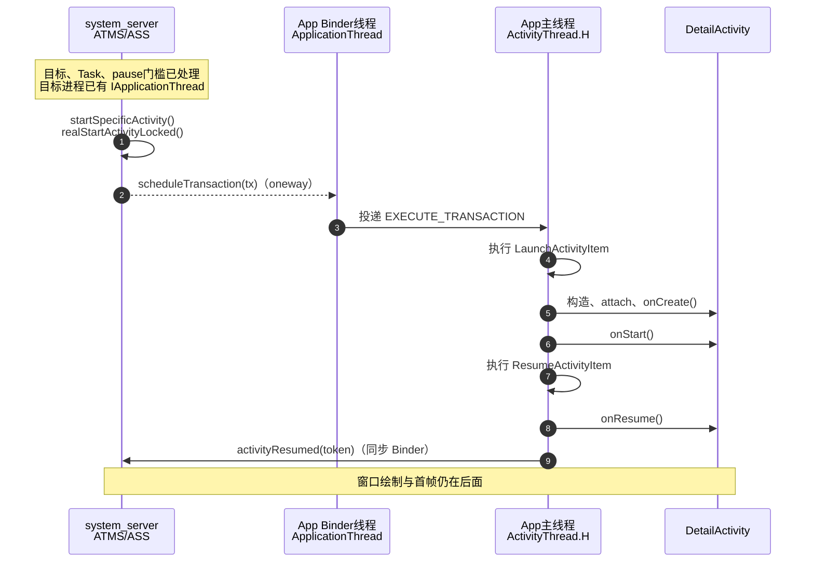

# 10 Activity 启动流程（三）：目标进程与生命周期

> 源码基线：Android 11 / API 30 / `android-11.0.0_r48`
> 阅读方式：macOS 上静态阅读本地 AOSP，不要求编译和刷机。

在 `MainActivity` 中调用 `startActivity()` 打开 `DetailActivity` 时，经常会看到一个看似矛盾的现象：

- `startActivity()` 已经返回；
- `DetailActivity.onCreate()` 却还没有执行；
- 等它真正执行时，线程又是 App 主线程，而不是收到 Binder 请求的线程。

这不是“系统调度慢了一拍”，而是 Android 有意把一次启动拆成了三段：

1. `system_server` 决定要启动谁、最终希望它到达什么生命周期状态；
2. Binder 把一张 `ClientTransaction`“工作单”送进目标 App；
3. 目标 App 的 Binder 线程接收工作单并做轻量预处理，真正的 Activity 生命周期由主线程按顺序执行。

读完本章，你能回答并排查这几个实际问题：

- 为什么 `startActivity()` 返回不等于 `onCreate()` 已完成；
- 断点停在 `scheduleTransaction()`、`onCreate()`、`onResume()`，各自代表启动到了哪一步；
- 启动卡住时，怎样判断问题在 system_server、Binder 投递、主线程队列，还是首帧绘制；
- `ClientTransaction`、`LaunchActivityItem`、`ResumeActivityItem` 分别是干什么的。

本章从 ATMS 已完成目标 Activity 与 Task 决策之后开始。主线只讨论默认情况下与 `MainActivity` 同进程、且目标进程已经存在的 `DetailActivity`；进程不存在的情况只在边界小节交代接力点。Intent 解析、启动模式、Task 选择和首帧渲染不在本章展开。

## 1. 问题：system_server 为什么不直接调用 `onCreate()`

假设两个 Activity 都没有配置 `android:process`：

```java
// MainActivity：两者默认运行在同一个 App 进程
startActivity(new Intent(this, DetailActivity.class));
```

此时存在三个不同的执行角色：

| 角色 | 所在进程 | 负责什么 |
|---|---|---|
| ATMS / `ActivityStackSupervisor` | `system_server` | 决定启动目标、记录系统侧状态、下发事务 |
| `ApplicationThread` Binder Stub | 目标 App | 接收 system_server 发来的跨进程调度 |
| `ActivityThread` 主线程 | 目标 App | 创建 Activity，执行 `onCreate()`、`onStart()`、`onResume()` |

`system_server` 不能直接在自己的线程里执行 `DetailActivity.onCreate()`，原因有两个：

1. `DetailActivity` 的类、对象和资源属于目标 App 进程，不属于 `system_server`；
2. Activity 生命周期会操作 App 的 UI 状态，必须与该 App 的主线程消息串行执行。

可以把 `ClientTransaction` 理解成一张工作单：system_server 填写“创建 `DetailActivity`，最后推进到 resumed”，Binder 把工作单送到 App 前台，`ActivityThread.H` 再把它排进主线程队列。这个类比只说明分工；真正对应的源码对象就是后文的 `ClientTransaction`、`LaunchActivityItem` 和 `ResumeActivityItem`。

## 2. 先看全链路：一次启动跨了哪些进程和线程

在本章场景中，`MainActivity` 与 `DetailActivity` 位于同一个 App 进程。主线程调用 `startActivity()` 后，会同步进入 system_server；但 system_server 可能先要求 `MainActivity` 完成 pause，之后才真正下发 `DetailActivity` 的 launch。若把这两段强画成固定相邻顺序，反而会误导。

所以下图从本章的准确入口开始：目标和 Task 已确定，前一个 Activity 的 pause 门槛也已满足，ATMS 准备调用 `startSpecificActivity()`。



把这张图与入口前的调用连起来，会遇到两个方向相反、同步语义不同的 Binder 调用：

- App → system_server 的 `startActivity(...)` 是同步请求，调用线程会等 system_server 返回启动结果；
- system_server → App 的 `scheduleTransaction(...)` 属于 `oneway IApplicationThread`，system_server 不等 App 执行生命周期。

`startActivity()` 的同步性可由 `IActivityTaskManager.aidl:86-90` 验证：接口不是 `oneway`，方法还要返回一个 `int` 启动结果。但这个返回值描述系统是否接受启动，不是等生命周期的承诺。尤其在需要先 pause `MainActivity` 时，系统不可能让 App 主线程一边阻塞等 `startActivity()`，一边又在同一主线程执行 `onPause()` 和新 Activity 生命周期；原调用会先返回，后续事务再由 Looper 处理。

因此，`startActivity()` 返回能证明“系统已受理并完成这一阶段的启动处理”，不能证明 `DetailActivity.onCreate()` 已执行。

## 3. system_server 如何把“创建”和“最终状态”装进同一张工作单

上一章完成目标 Activity 和 Task 决策后，流程会到达：

```text
ActivityStackSupervisor.startSpecificActivity()
    → realStartActivityLocked()
```

本章假定目标进程已经存在，且 system_server 保存着可用的 `IApplicationThread`。`realStartActivityLocked()` 的关键工作不是创建 Java `Activity` 对象，而是组装事务。

源码：`frameworks/base/services/core/java/com/android/server/wm/ActivityStackSupervisor.java:843-868`。下面是用于看结构的等价精简摘录：变量名缩短，源码中的 `if/else` 合并为三元表达式，长参数列表省略，不是可直接编译的连续原文。

```java
final ClientTransaction tx = ClientTransaction.obtain(
        proc.getThread(), r.appToken);

tx.addCallback(LaunchActivityItem.obtain(
        /* Intent、ActivityInfo、Configuration、saved state 等参数 */));

tx.setLifecycleStateRequest(andResume
        ? ResumeActivityItem.obtain(dc.isNextTransitionForward())
        : PauseActivityItem.obtain());

mService.getLifecycleManager().scheduleTransaction(tx);
```

上面是按源码结构摘取的关键行，`LaunchActivityItem.obtain()` 的长参数列表被明确省略。三层对象各有不同职责：

| 对象 | 本场景中的含义 | 不要误解为 |
|---|---|---|
| `ClientTransaction` | 发给一个 Activity token 的事务容器 | 一个线程或一个 Activity 对象 |
| `LaunchActivityItem` | “请创建这个 Activity”的客户端操作 | 开发者注册的回调 |
| `ResumeActivityItem` | 事务执行后的目标生命周期是 `ON_RESUME` | 它单独负责 `onCreate()` |

为什么不只发一个“调用 `onCreate()`”命令？因为 system_server 管理的是生命周期状态，而不只是某一个回调。把“要做的操作”和“最终目标状态”分开后，同一套执行器可以处理启动、暂停、停止、销毁、重建等组合，并自动补齐中间状态。

本场景里 `andResume` 通常为 `true`，所以最终项是 `ResumeActivityItem`。若系统决定 Activity 创建后暂时不能位于前台，最终项也可能是 `PauseActivityItem`，不能把每次 launch 都写死成 resume。

## 4. `scheduleTransaction()` 返回时，App 做完了吗

没有。这个方法名里的 `schedule` 就是在提醒我们：它负责安排执行，不负责等待执行完成。

system_server 侧最终调用：

源码：`frameworks/base/services/core/java/com/android/server/wm/ClientLifecycleManager.java:45-53`

```java
void scheduleTransaction(ClientTransaction transaction)
        throws RemoteException {
    final IApplicationThread client = transaction.getClient();
    transaction.schedule();
    if (!(client instanceof Binder)) {
        transaction.recycle();
    }
}
```

`transaction.schedule()` 再调用目标进程的 `IApplicationThread.scheduleTransaction()`。决定同步语义的是 AIDL 声明：

源码：`frameworks/base/core/java/android/app/IApplicationThread.aidl:59,144`

```aidl
oneway interface IApplicationThread {
    // 省略其他 system_server → App 的调度方法
    void scheduleTransaction(in ClientTransaction transaction);
}
```

因为整个接口是 `oneway`，远程调用方不等待服务端方法返回值，也不等待 App 主线程执行事务。对本章的远程 App 场景，可以这样记录：

| 节点 | 调用方会等待什么 | 返回时不能证明什么 |
|---|---|---|
| `startActivity(...)` | App 主线程等待 system_server 返回启动结果 | `DetailActivity` 已创建 |
| `scheduleTransaction(...)` | system_server 只完成异步 Binder 投递，不等客户端生命周期 | `onCreate()` 或 `onResume()` 已完成 |
| `ActivityThread.H.sendMessage(...)` | 只把消息放入主线程队列 | 消息已经被主线程处理 |

`oneway` 也不等于“为每次调用新建线程”。Binder 驱动和目标进程的 Binder 线程池负责接收；之后用哪条业务线程执行，由接收端代码自己决定。

还有一个版本和进程边界：如果 Binder 接口在同一进程内以本地对象调用，可能不会发生真正的内核 Binder IPC。普通三方 App 启动 Activity 时，ATMS 在 `system_server`、`ApplicationThread` 在 App 进程，本章讨论的是远程 Binder 路径。

## 5. Binder 线程为什么还要把工作切到主线程

目标 App 收到事务后，先进入 `ActivityThread.ApplicationThread`。它是 `IApplicationThread.Stub` 的实现，远程调用通常落在 App 的 Binder 线程池中。

源码：`frameworks/base/core/java/android/app/ActivityThread.java:1717-1720`

```java
@Override
public void scheduleTransaction(ClientTransaction transaction)
        throws RemoteException {
    ActivityThread.this.scheduleTransaction(transaction);
}
```

`ActivityThread` 继承自 `ClientTransactionHandler`。父类没有直接执行事务，而是投递 `EXECUTE_TRANSACTION`：

源码：`frameworks/base/core/java/android/app/ClientTransactionHandler.java:45-49`

```java
void scheduleTransaction(ClientTransaction transaction) {
    transaction.preExecute(this);
    sendMessage(ActivityThread.H.EXECUTE_TRANSACTION, transaction);
}
```

这次切线程有明确目的：

- 生命周期回调和 View 操作需要在 App 主线程上串行执行；
- Binder 线程只做接收、`preExecute()` 预处理和转交，不执行开发者的 Activity 生命周期，避免 `onCreate()` 等工作长期占住共享 Binder 线程；
- 同一主 Looper 会串行处理启动事务与其他生命周期、配置和 UI 消息，避免这些操作并发修改客户端状态。

所以，“Binder 请求已经到达目标进程”只说明跨进程运输结束，不代表已经在主线程执行。若 App 主线程正在执行长任务，`EXECUTE_TRANSACTION` 会在消息队列中等待，表现就是 `startActivity()` 已返回，但 `onCreate()` 迟迟不进。

严格说，`transaction.preExecute(this)` 在投递消息之前由 Binder 入口线程执行；例如 `LaunchActivityItem.preExecute()` 会更新进程状态、待处理配置并增加启动计数。真正创建 Activity 和调用生命周期的 `TransactionExecutor.execute()` 才在主线程。因此，“Binder 线程只转手，什么都没做”和“整个 `scheduleTransaction()` 都在主线程”都不准确。

## 6. 主线程怎样从事务走到 `onCreate()`

`ActivityThread.H` 收到消息后，把事务交给 `TransactionExecutor`。

源码：`frameworks/base/core/java/android/app/ActivityThread.java:2064-2071`

```java
case EXECUTE_TRANSACTION:
    final ClientTransaction transaction =
            (ClientTransaction) msg.obj;
    mTransactionExecutor.execute(transaction);
    if (isSystem()) {
        transaction.recycle();
    }
    break;
```

执行器严格分两段：先执行 callbacks，再推进最终生命周期。

源码：`frameworks/base/core/java/android/app/servertransaction/TransactionExecutor.java:93-99`

```java
executeCallbacks(transaction);
executeLifecycleState(transaction);
mPendingActions.clear();
```

本场景的第一段 callback 就是 `LaunchActivityItem`：

源码：`frameworks/base/core/java/android/app/servertransaction/LaunchActivityItem.java:78-86`

```java
public void execute(ClientTransactionHandler client, IBinder token,
        PendingTransactionActions pendingActions) {
    Trace.traceBegin(TRACE_TAG_ACTIVITY_MANAGER, "activityStart");
    ActivityClientRecord r = new ActivityClientRecord(
            token, mIntent, mIdent, mInfo, /* 其余字段省略 */);
    client.handleLaunchActivity(r, pendingActions, null);
    Trace.traceEnd(TRACE_TAG_ACTIVITY_MANAGER);
}
```

到这里仍没有由 system_server “远程调用 `onCreate()`”。system_server 只传来了描述启动所需的数据；App 主线程根据数据创建 `ActivityClientRecord`，然后进入：

```text
LaunchActivityItem.execute()
    → ActivityThread.handleLaunchActivity()
    → ActivityThread.performLaunchActivity()
```

这条链是定位“事务已到 App，但 Activity 为什么没创建”的最短阅读路线。

## 7. `onCreate()` 到底由谁调用，返回后完成了什么

`performLaunchActivity()` 在 App 主线程做四件关键事：

1. 用 `Instrumentation.newActivity()` 反射创建 `DetailActivity` 实例；
2. 获取或确保 `Application` 实例存在；
3. 调用 `activity.attach(...)`，把 Context、Window、token、Application 等交给 Activity；
4. 经 `Instrumentation` 调用 `Activity.onCreate()`。

源码：`frameworks/base/core/java/android/app/ActivityThread.java:3331-3353,3382-3409`。下面合并展示普通、非持久化状态分支，长参数和另一个 `callActivityOnCreate` 重载已省略。

```java
ContextImpl appContext = createBaseContextForActivity(r);
Activity activity = mInstrumentation.newActivity(
        appContext.getClassLoader(), component.getClassName(), r.intent);
Application app = r.packageInfo.makeApplication(false, mInstrumentation);

activity.attach(appContext, this, getInstrumentation(), r.token,
        r.ident, app, r.intent, r.activityInfo, /* 其余参数省略 */);

activity.mCalled = false;
mInstrumentation.callActivityOnCreate(activity, r.state);
if (!activity.mCalled) {
    throw new SuperNotCalledException(/* 信息省略 */);
}
```

`Instrumentation` 最终调用 Activity 内部的 `performCreate()`：

源码：`frameworks/base/core/java/android/app/Instrumentation.java:1307-1311`

```java
public void callActivityOnCreate(Activity activity, Bundle icicle) {
    prePerformCreate(activity);
    activity.performCreate(icicle);
    postPerformCreate(activity);
}
```

`Activity.performCreate()` 再调用开发者覆写的 `onCreate(savedInstanceState)`。如果覆写方法没有调用 `super.onCreate()`，`mCalled` 检查会抛出 `SuperNotCalledException`。

在 `MainActivity → DetailActivity` 的同进程场景里，`Application` 已经因为 `MainActivity` 而存在，`makeApplication()` 通常返回现有对象，不会为每个 Activity 再执行一次 `Application.onCreate()`。

当 `onCreate()` 正常返回后，`performLaunchActivity()` 才把客户端记录标为 `ON_CREATE` 并放入 `mActivities`：

源码：`frameworks/base/core/java/android/app/ActivityThread.java:3411-3422`

```java
r.activity = activity;
r.setState(ON_CREATE);
synchronized (mResourcesManager) {
    mActivities.put(r.token, r);
}
```

这里的准确结论是：`onCreate()` 正常返回、Instrumentation 后处理与 `super` 检查也通过后，客户端才记录 `ON_CREATE`，Activity 的“创建阶段”才算走完。它还没有证明 Activity 已 resumed，更没有证明首帧已经显示。

## 8. 为什么一个事务还能继续调用 `onStart()` 和 `onResume()`

`LaunchActivityItem` 执行完后，`TransactionExecutor` 开始处理事务的最终生命周期请求。对于本章的 `ResumeActivityItem`，目标状态是 `ON_RESUME`。

此时客户端记录已经是 `ON_CREATE`。执行器先计算从 `ON_CREATE` 到 `ON_RESUME` 的合法路径，并把最后一步留给带参数的 `ResumeActivityItem`：

```text
当前 ON_CREATE
    → handleStartActivity()       → onStart()
                                  → [可能恢复状态] → onPostCreate()
    → ResumeActivityItem.execute()
    → handleResumeActivity()      → Activity.onResume()
```

这个顺序来自 `TransactionExecutor` 计算的生命周期路径，不是 `LaunchActivityItem` 一口气硬编码了三个回调。图中“可能恢复状态”指有保存状态时还会调用 `onRestoreInstanceState()`；此外这里只列关键公开回调，内部准备与 Instrumentation 前后处理仍被省略。

源码：`frameworks/base/core/java/android/app/servertransaction/TransactionExecutor.java:151-177`。下面省略了空值检查、日志以及 `token`、`r` 的取值，只保留“补中间状态→执行最终状态→执行后处理”三步。

```java
final ActivityLifecycleItem lifecycleItem =
        transaction.getLifecycleStateRequest();

cycleToPath(r, lifecycleItem.getTargetState(),
        true /* excludeLastState */, transaction);

lifecycleItem.execute(mTransactionHandler, token, mPendingActions);
lifecycleItem.postExecute(mTransactionHandler, token, mPendingActions);
```

最后一步由 `ResumeActivityItem` 自己执行，并在执行后向 system_server 报告：

源码：`frameworks/base/core/java/android/app/servertransaction/ResumeActivityItem.java:48-65`。下面只保留调用结构，`postExecute()` 中的 `try/catch` 已省略。

```java
public void execute(ClientTransactionHandler client, IBinder token,
        PendingTransactionActions pendingActions) {
    client.handleResumeActivity(token, true, mIsForward,
            "RESUME_ACTIVITY");
}

public void postExecute(ClientTransactionHandler client, IBinder token,
        PendingTransactionActions pendingActions) {
    ActivityTaskManager.getService().activityResumed(token);
}
```

Android 11 的 `IActivityTaskManager.aidl` 中，`activityResumed()` 没有声明 `oneway`，所以这是 App 主线程到 system_server 的同步 Binder 调用。它发生在客户端 `handleResumeActivity()` 返回之后，是客户端完成 resume 路径后的确认与收尾：Android 11 中会清理保存状态，并结束 unknown-app-visibility 等跟踪；它仍然不是“首帧已经绘制”的回执。

还要区分客户端确认和服务端预记状态。`realStartActivityLocked()` 下发事务后，如果目标应当 resume，system_server 会先调用 `minimalResumeActivityLocked(r)`，把服务端 `ActivityRecord` 置为 `RESUMED`。所以 `activityResumed()` 不是服务端第一次把记录改成 `RESUMED`，而是客户端真正执行 resume 路径之后的回报。

## 9. 四个“完成”不是同一个时间点

阅读启动源码时，只说“启动完成”很危险，因为它可能指四件不同的事：

| 时间点 | 能确定什么 | 还不能确定什么 |
|---|---|---|
| system_server 的 `scheduleTransaction()` 返回 | 启动事务已被异步下发 | App 主线程已经处理 |
| 执行到 `r.setState(ON_CREATE)` | `onCreate()` 已正常返回，后续检查通过，客户端状态进入 `ON_CREATE` | `onStart()`、`onResume()`、首帧完成 |
| `activityResumed(token)` 返回 | 客户端已执行 resume 路径，system_server 完成确认与收尾 | 服务端第一次置为 `RESUMED`；用户已经看到完整页面 |
| 窗口完成绘制 / 首帧呈现 | 启动界面真正进入可见结果阶段 | 业务数据全部加载完成 |

`onCreate()` 里调用 `setContentView()` 只是建立或修改 View 树。测量、布局、绘制、Surface 提交还在后续的窗口与渲染流程中。因此这些排查结论才有用：

- `scheduleTransaction()` 已走到，`EXECUTE_TRANSACTION` 没执行：重点看 Binder 投递和 App 主线程队列；
- 已进入 `performLaunchActivity()`，却没进入业务 `onCreate()`：重点看类实例化、Context/资源、`attach()` 或 Instrumentation；
- `onCreate()` 已返回，`onResume()` 没到：重点看事务生命周期推进或回调异常；
- `onResume()` 已返回，页面仍未出现：不要继续困在 Activity 创建链，应转向 Window、ViewRootImpl、绘制和 Surface 路径。

这就是本章知识的实际意义：它把“启动慢/启动失败”从一个模糊问题切成可以设置断点、逐段排除的四段问题。

## 10. 边界：目标进程不存在时，多出的接力是什么

本章场景默认两个 Activity 同进程，因此 `MainActivity` 能运行就说明目标进程已经存在。不过，如果 `DetailActivity` 配了独立 `android:process`，或系统正要启动另一个 App，目标进程可能不存在。

`startSpecificActivity()` 的分支依据不是“看到一个进程记录”就够了，还要求 `hasThread()`：system_server 必须已经拿到可调度的 `IApplicationThread`。

源码：`frameworks/base/services/core/java/com/android/server/wm/ActivityStackSupervisor.java:974-997`

```java
final WindowProcessController wpc = mService.getProcessController(
        r.processName, r.info.applicationInfo.uid);

if (wpc != null && wpc.hasThread()) {
    realStartActivityLocked(r, wpc, andResume, checkConfig);
    return;
}

mService.startProcessAsync(
        r, knownToBeDead, isTop, isTop ? "top-activity" : "activity");
```

进程不存在时，只需先记住下面这条简化边界链；它表达依赖关系，不保证每一步都等前一步完全结束才开始：

```text
ATMS.startProcessAsync()
    → ActivityManagerInternal / AMS / ProcessList
    → Process.start() 请求 Zygote fork
    → 新进程 ActivityThread.main()
    → 新进程 attachApplication(IApplicationThread)
    → AMS.attachApplicationLocked()
    → IApplicationThread.bindApplication(...)
    → ATMS/RootWindowContainer.attachApplication(...)
    → realStartActivityLocked(...)
    → 回到本章的 ClientTransaction 主线
```

其中 `startProcessAsync()` 会先向 ATMS 的 Handler 投递消息，避免持有 ATMS 全局锁时直接进入 AMS 造成潜在锁问题；`ProcessList` 最终通过 `Process.start()` 走向 Zygote。新进程执行 `ActivityThread.main()`、建立主 Looper，并把自己的 `IApplicationThread` 通过 `attachApplication()` 交给 AMS。等 system_server 能够调用这个 Binder 接口后，才有条件下发 Activity 启动事务。

为了缩短启动等待，`resumeTopActivityInnerLocked()` 可能在等待旧 Activity 完成 pause 的同时就提前调用 `startProcessAsync()`，让 fork 和进程初始化与 pause 重叠。因此不能把“启动进程”死记成一定发生在 `startSpecificActivity()` 之后；最终门槛仍是目标进程已经 `attach`，system_server 拿到了可用的 `IApplicationThread`。

这里要守住两个边界：

- Linux 进程已经 fork 出来，不等于 `Application` 和 Activity 已创建；
- `ProcessRecord` / `WindowProcessController` 存在，也不等于 `hasThread()` 已成立。

完整的 Zygote 参数、`bindApplication()`、Provider 安装和 `Application.onCreate()` 应放到专门的进程启动章节，本章不展开。

## 11. macOS 上怎样只读验证这条链

先进入源码根目录：

```bash
cd /Users/ninebot/androidSource
```

### 第一步：确认 system_server 组装了两类事务项

```bash
rg -n "realStartActivityLocked|ClientTransaction.obtain|LaunchActivityItem.obtain|ResumeActivityItem.obtain|minimalResumeActivityLocked" \
  frameworks/base/services/core/java/com/android/server/wm/ActivityStackSupervisor.java \
  frameworks/base/services/core/java/com/android/server/wm/ActivityStack.java
```

预期观察：`realStartActivityLocked()` 中先添加 `LaunchActivityItem`，再设置最终的 `ResumeActivityItem` 并调用 `scheduleTransaction()`；随后服务端通过 `minimalResumeActivityLocked()` 预记目标状态。

### 第二步：确认 Binder 调度是 oneway，并被转交给主线程

```bash
rg -n "oneway interface IApplicationThread|scheduleTransaction" \
  frameworks/base/core/java/android/app/IApplicationThread.aidl \
  frameworks/base/core/java/android/app/ActivityThread.java \
  frameworks/base/core/java/android/app/ClientTransactionHandler.java
```

预期观察：AIDL 整体是 `oneway`；`ApplicationThread.scheduleTransaction()` 没有调用生命周期，而是走到 `sendMessage(H.EXECUTE_TRANSACTION, ...)`。

### 第三步：确认主线程先 launch，再推进最终状态

```bash
rg -n "EXECUTE_TRANSACTION|executeCallbacks|executeLifecycleState|handleLaunchActivity|performLaunchActivity" \
  frameworks/base/core/java/android/app/ActivityThread.java \
  frameworks/base/core/java/android/app/servertransaction/TransactionExecutor.java \
  frameworks/base/core/java/android/app/servertransaction/LaunchActivityItem.java
```

预期观察：`TransactionExecutor.execute()` 的顺序是 callbacks 在前、lifecycle state 在后。

### 第四步：把证据填成一张线程表

不要抄整份文件，只记录下面六个节点：

| 节点 | 进程 | 线程 | 同步含义 |
|---|---|---|---|
| `realStartActivityLocked()` | `system_server` | 当前 ATMS 调用线程 | 系统侧内部执行 |
| `IApplicationThread.scheduleTransaction()` | 目标 App | Binder 线程 | oneway 接收，不等生命周期 |
| `H.EXECUTE_TRANSACTION` | 目标 App | 主线程 | 消息出队后才执行事务 |
| `performLaunchActivity()` | 目标 App | 主线程 | 创建并 attach Activity |
| `Activity.onCreate()` | 目标 App | 主线程 | 完成创建阶段 |
| `activityResumed()` | App → `system_server` | App 主线程发起 | 同步报告 resumed 状态 |

如果你的表与源码相符，就已经完成本章验证。macOS 静态阅读能证明调用关系和代码声明；它不能替代真机调度时延、消息队列等待时间与首帧耗时测量。

### 检查题与答案

1. **为什么不能把 `startActivity()` 返回当成 `onCreate()` 已完成或共享状态已就绪的证据？**

   因为返回只表示同步的系统侧启动请求已返回；创建命令通过反向的 oneway Binder 和主线程消息队列异步执行。并且应用本来也没有受支持的 API 在返回后直接取得目标 Activity 实例。

2. **`scheduleTransaction()` 是在哪条线程执行 `onCreate()` 的？**

   它自己不执行 `onCreate()`。远程 Binder 入口通常在目标 App 的 Binder 线程，随后投递 `EXECUTE_TRANSACTION`，由 App 主线程走到 `performLaunchActivity()` 和 `onCreate()`。

3. **`LaunchActivityItem` 与 `ResumeActivityItem` 为什么不能当成同一件事？**

   前者负责创建 Activity 客户端记录和实例；后者声明并执行最终的 resume 状态。中间的 `onStart()` 由事务执行器按状态路径补齐。

4. **`onCreate()` 已返回，页面空白，应继续只查创建链吗？**

   不应。先确认 `onStart()`、`onResume()`，再转向窗口添加、ViewRootImpl 遍历、绘制和 Surface 提交；`onCreate()` 完成不是首帧完成。

5. **已有 `WindowProcessController` 为什么仍可能启动进程？**

   因为记录存在不代表 Binder 客户端已经可用；只有 `wpc != null && wpc.hasThread()` 才能直接下发事务。

### 读完立刻能做的事

以后看到“点击后 `startActivity()` 返回了，但新页面没有出现”，按下面四个断点分段定位：

```text
realStartActivityLocked
    → ApplicationThread.scheduleTransaction
    → ActivityThread.H 的 EXECUTE_TRANSACTION
    → ActivityThread.performLaunchActivity / 业务 onCreate
```

前一个断点命中、后一个不命中，就能把范围缩到两点之间。最后再用 `onResume()` 与窗口绘制节点区分“生命周期没走完”和“生命周期完成但首帧没出来”。这比只在业务 `onCreate()` 里反复加日志更快，也更接近 Android 真实的进程与线程边界。
