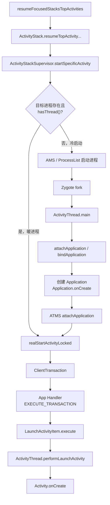
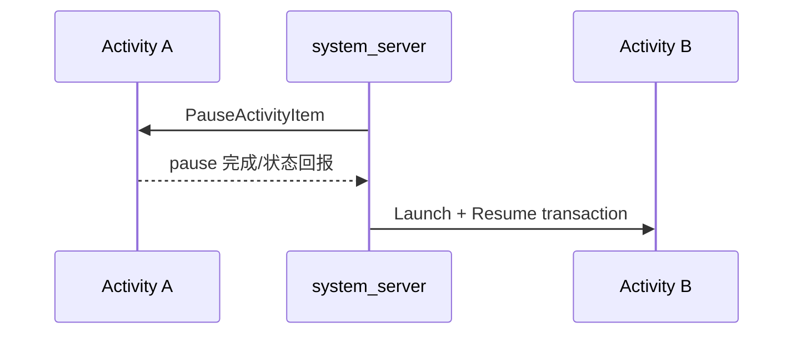
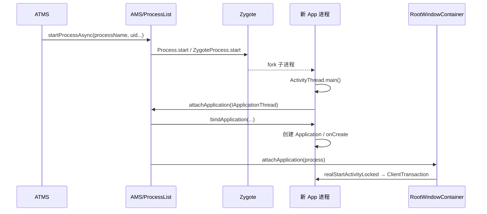
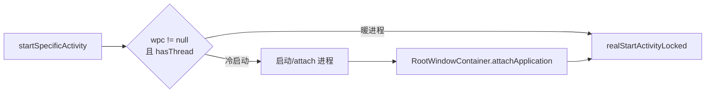
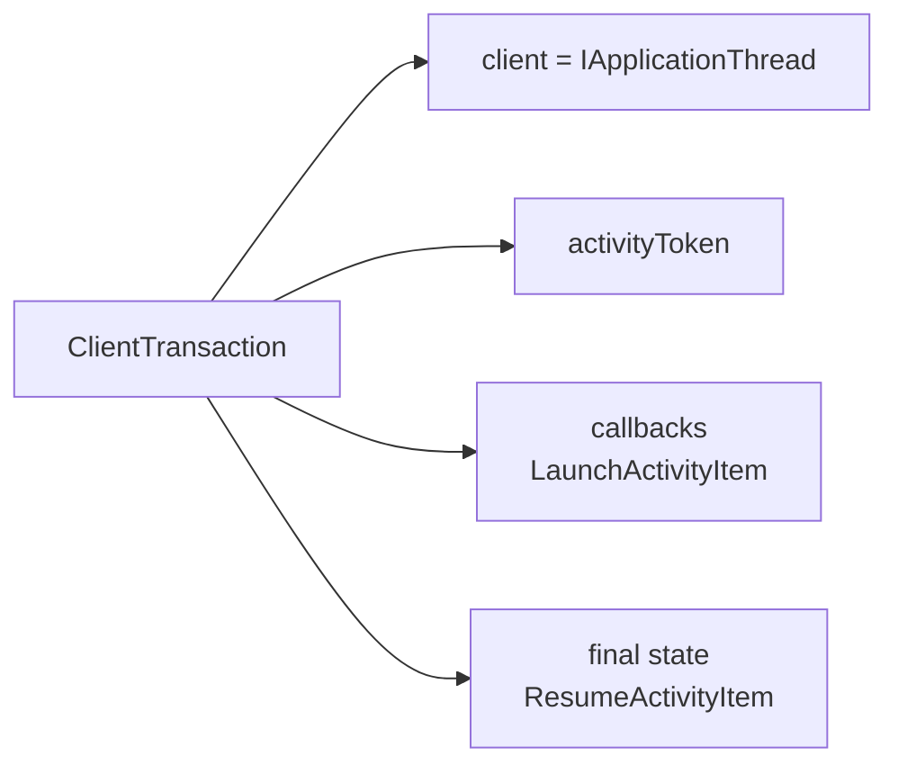
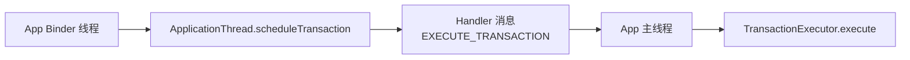
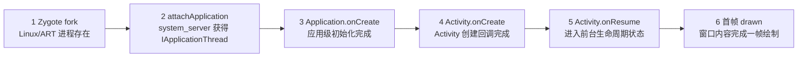
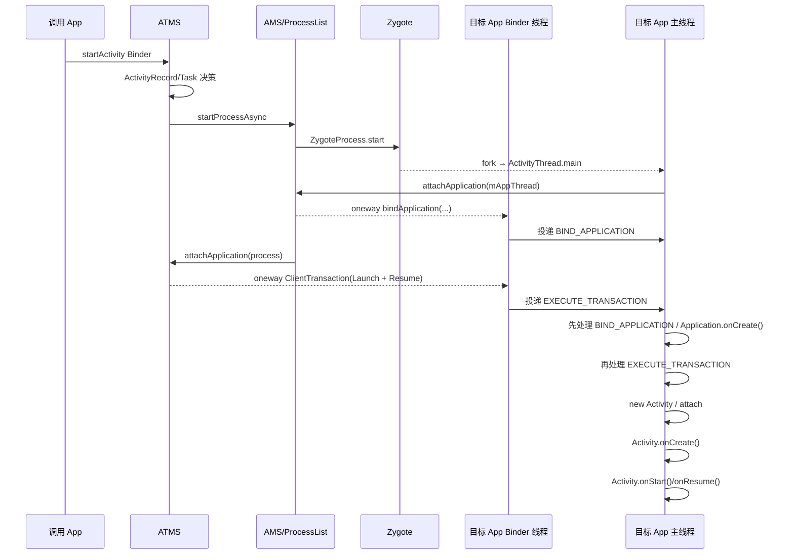

# 10 Activity 启动流程（三）：目标进程与生命周期

## 本章边界

第 09 章停在：

```text
ActivityRecord 已进入目标 Task
 → RootWindowContainer.resumeFocusedStacksTopActivities()
```

本章继续到：

```text
目标进程主线程调用 Activity.onCreate()
```

同时解释冷启动和已有进程两条分支，以及 `onCreate()` 后为什么还不能立刻等同于“页面已显示”。

## 本章目标

读完后，你应该能够：

1. 从 `resumeFocusedStacksTopActivities()` 追到 `startSpecificActivity()`。
2. 区分目标进程已存在与不存在两条路径。
3. 解释冷启动时 AMS、ProcessList、Zygote、ActivityThread、attachApplication 的接力。
4. 解释 Application 创建与 Activity 创建的先后关系。
5. 看懂 `ClientTransaction + LaunchActivityItem + ResumeActivityItem`。
6. 说明 Binder 线程如何通过 Handler 把事务切到 App 主线程。
7. 从 `LaunchActivityItem.execute()` 追到 `Activity.onCreate()`。
8. 区分“进程已创建、Application.onCreate、Activity.onCreate、首帧显示”四个完成点。

## 1. 完整路线总览



冷启动比暖进程多出的核心部分是：创建 Linux/ART 进程、绑定 Application、进程向 system_server attach。

## 2. resume 从哪里开始

第 09 章末尾调用：

```java
mRootWindowContainer.resumeFocusedStacksTopActivities(
        mTargetStack, mStartActivity, mOptions);
```

源码：

```text
frameworks/base/services/core/java/com/android/server/wm/RootWindowContainer.java
```

它会找到目标/各显示的 focused stack，并调用：

```java
targetStack.resumeTopActivityUncheckedLocked(
        target, targetOptions);
```

继续进入：

```text
ActivityStack.resumeTopActivityUncheckedLocked()
 → resumeTopActivityInnerLocked()
```

## 3. 为什么叫 `UncheckedLocked`

- `Locked`：调用时处于 ATMS/WMS 全局锁保护的状态变更路径。
- `Unchecked`：外层已做部分状态/重入保护，这一层继续执行核心 resume 决策，并非“没有权限检查”。

方法会处理大量状态：

- 当前 pause 是否完成。
- 目标是否已经 resumed。
- keyguard、sleep、visibility。
- configuration/orientation。
- 当前顶部 Activity 的 pause。
- 目标进程是否可用。

第一次阅读应搜索最终的 `startSpecificActivity()`，不要逐行展开所有窗口状态分支。

## 4. 为什么常要先 pause 当前 Activity

通常同一 focused stack 同一时刻只有一个 resumed Activity。启动 B 时，顶部 A 需要先走 pause，再允许 B resume。



如果 pause 尚未完成，`realStartActivityLocked()` 会暂缓：

```java
if (!mRootWindowContainer.allPausedActivitiesComplete()) {
    return false;
}
```

这避免两个 Activity 同时被错误地当作 resumed 顶部。

## 5. `startSpecificActivity()`：进程分叉点

源码：

```text
frameworks/base/services/core/java/com/android/server/wm/ActivityStackSupervisor.java
```

核心代码：

```java
WindowProcessController wpc =
        mService.getProcessController(
                r.processName,
                r.info.applicationInfo.uid);

if (wpc != null && wpc.hasThread()) {
    realStartActivityLocked(r, wpc, andResume, checkConfig);
    return;
}

mService.startProcessAsync(
        r, knownToBeDead, isTop,
        isTop ? "top-activity" : "activity");
```

判断不仅是“进程记录不为 null”，还要求 `hasThread()`。

## 6. `hasThread()` 为什么关键

system_server 可能已有进程记录，但目标进程：

- 还在启动，尚未 attach。
- 已经死亡，记录清理尚在进行。
- Binder ApplicationThread 不可用。

`hasThread()` 表示 system_server 已持有可用于反向调度的 `IApplicationThread` Binder 接口。只有这样才能立刻发送 ClientTransaction。

所以：

```text
有 Process/WindowProcessController 记录
≠ 进程已可接收 Framework 调度
```

## 7. 暖进程路径

目标进程已运行并 attach：

```text
startSpecificActivity
 → realStartActivityLocked
 → 构造 ClientTransaction
 → IApplicationThread.scheduleTransaction
 → App 主线程创建 Activity
```

这里“暖进程”仅表示进程和 Application 环境已存在，不表示目标 Activity 实例存在。standard Activity 仍可能需要创建新的 Activity 对象。

## 8. 冷启动路径总览

目标进程不存在或不可用：



顺序上要注意：`IApplicationThread` 整个 AIDL 接口声明为 `oneway`。因此 `bindApplication()` 是 system_server 发出的异步 Binder 调度；AMS 发出它后，不会同步等待 App 的 `Application.onCreate()` 完成，就可以继续匹配等待该进程的 Activity 并发送 launch transaction。

但“system_server 发出顺序”和“App 主线程执行完成顺序”是两件事。对同一 ApplicationThread Binder 的这些 oneway 调度会按 Binder/客户端消息投递顺序到达，`bindApplication()` 先投递 `BIND_APPLICATION`，后续 `scheduleTransaction()` 再投递 `EXECUTE_TRANSACTION`。App 主线程先处理绑定应用，建立 Application 环境，然后处理 Activity launch。

## 9. ATMS 与 AMS 为什么再次协作

ATMS 管 Activity/Task/Window 侧状态；AMS/ProcessList 管 Linux 应用进程、OOM、Service/Provider 等。

ATMS 通过内部接口请求：

```text
ActivityTaskManagerService.startProcessAsync
 → ActivityManagerInternal.startProcess
 → ActivityManagerService / ProcessList
```

这通常是 system_server 内的 LocalServices/内部调用，不是 App 发起的那次外部 Binder IPC。

## 10. ProcessRecord 与 WindowProcessController

| 对象 | 主要归属 | 关注点 |
|---|---|---|
| `ProcessRecord` | AMS | 进程生命周期、OOM、组件、Binder thread 等综合状态 |
| `WindowProcessController` | ATMS/WM | Activity、配置、可见性、窗口相关进程状态 |
| Linux process | Kernel | PID、线程、内存、调度 |
| `ActivityThread` | App 进程 | 客户端组件和主线程调度 |

ProcessRecord 与 WindowProcessController 是 system_server 内对同一目标进程的不同管理视角，不是两个实际进程。

## 11. ProcessList 准备 Zygote 参数

源码：

```text
frameworks/base/services/core/java/com/android/server/am/ProcessList.java
```

`startProcessLocked()` 会准备：

- entryPoint，普通 App 通常为 `android.app.ActivityThread`。
- processName。
- uid/gid、附加组。
- runtimeFlags、targetSdkVersion。
- ABI、instructionSet。
- SELinux seInfo。
- dataDir、packageName。
- startSeq。
- 挂载和存储隔离参数。

然后普通路径调用：

```java
Process.start(entryPoint, processName, uid, uid,
        gids, runtimeFlags, ...);
```

## 12. `Process.start()` 再次连接 Zygote

源码：

```text
frameworks/base/core/java/android/os/Process.java
```

```java
return ZYGOTE_PROCESS.start(
        processClass, niceName, uid, gid, gids,
        runtimeFlags, ...);
```

`ZygoteProcess` 通过 Zygote socket 发送创建参数；Zygote 校验后 fork。第 05 章讲过 Zygote 监听循环，此处正是它等待的应用进程创建请求之一。

```text
第05章：Zygote 为什么长期监听
第10章：ATMS/AMS 何时真正向它发送 App 创建请求
```

## 13. fork 后进入 `ActivityThread.main()`

Zygote 子进程经过 RuntimeInit 后执行 entryPoint：

```text
android.app.ActivityThread.main(String[] args)
```

源码：

```text
frameworks/base/core/java/android/app/ActivityThread.java
```

主线：

```java
Looper.prepareMainLooper();

ActivityThread thread = new ActivityThread();
thread.attach(false, startSeq);

Looper.loop();
```

### 再次强调 ActivityThread 不是 Thread

它不继承 `java.lang.Thread`，而是 App 进程 Framework 主控对象。执行 `main()` 的这条 Linux/Java 线程才是应用主线程。

## 14. 为什么先 prepare Looper 再 attach

attach 后 system_server 很快可能通过 ApplicationThread Binder 回调 `bindApplication()`、`scheduleTransaction()` 等。这些回调通常要投递到主线程 Handler。

因此主线程消息基础设施必须先准备好：

```text
prepareMainLooper
 → 创建 ActivityThread/ApplicationThread/Handler
 → attach system_server
 → Looper.loop 开始消费调度
```

## 15. App 主动 attach AMS

`ActivityThread.attach(false, startSeq)`：

```java
IActivityManager mgr = ActivityManager.getService();
mgr.attachApplication(mAppThread, startSeq);
```

这是一次 App → system_server 的 Binder 调用。

- `mAppThread` 是 `ApplicationThread extends IApplicationThread.Stub`。
- startSeq 用于把新进程与 system_server 中对应的待启动记录准确匹配，处理并发启动和旧进程竞态。

## 16. attachApplication 为什么不是“绑定 Activity”

它绑定的是整个应用进程：把新 PID、UID、ProcessRecord 与 IApplicationThread Binder 连接起来。

AMS 入口：

```java
public final void attachApplication(
        IApplicationThread thread,
        long startSeq) {
    int callingPid = Binder.getCallingPid();
    int callingUid = Binder.getCallingUid();
    attachApplicationLocked(
            thread, callingPid, callingUid, startSeq);
}
```

系统使用 Binder 驱动提供的真实 PID/UID，并为 ApplicationThread 注册死亡通知。

## 17. system_server 反向调用 `bindApplication()`

AMS 完成记录准备后：

```java
thread.bindApplication(processName, appInfo,
        providerList, instrumentationName,
        profilerInfo, ...);
```

此时方向反转：

```text
system_server IApplicationThread.Proxy
        ↓ Binder
App 进程 ApplicationThread.Stub
```

ApplicationThread Binder 方法不会直接在 Binder 线程创建 Application，而是把 `BIND_APPLICATION` 消息交给 ActivityThread 主线程。

`IApplicationThread.aidl` 的定义开头是：

```aidl
oneway interface IApplicationThread {
    void bindApplication(...);
    ...
    void scheduleTransaction(in ClientTransaction transaction);
}
```

这意味着 system_server 调用这些方法时不等待客户端业务处理结果。oneway 解决的是调用方等待语义；客户端仍需按顺序在主线程完成实际工作。

## 18. `handleBindApplication()` 做什么

运行位置：目标 App 主线程。

主要工作包括：

- 设置进程名、时区、Locale、StrictMode 等。
- 建立 LoadedApk/资源和 ClassLoader 环境。
- 准备 Instrumentation。
- 安装 ContentProvider。
- 创建 Application。
- 调用 `Application.onCreate()`。

核心代码：

```java
Application app = data.info.makeApplication(...);
...
mInstrumentation.callApplicationOnCreate(app);
```

## 19. Application 只创建一次

同一个应用进程通常只有一个对应 Application 实例。暖进程启动新 Activity 时，`makeApplication()` 会返回已有实例，不会每次重新调用 `Application.onCreate()`。

```text
冷启动：创建进程 → Application.onCreate → Activity.onCreate
暖进程：复用进程/Application → 新 Activity.onCreate
实例复用：连 Activity.onCreate 也不调用，可能走 onNewIntent
```

## 20. attach 后如何找回等待的 Activity

AMS 在进程 attach 流程中调用：

```java
mAtmInternal.attachApplication(
        app.getWindowProcessController());
```

进入：

```text
ActivityTaskManagerService.LocalService.attachApplication
 → RootWindowContainer.attachApplication
```

RootWindowContainer 遍历可见显示/Task/ActivityRecord，寻找：

- 尚未 finishing。
- 应当显示。
- 还未绑定 app。
- uid 与 processName 匹配新进程。

找到后重新调用：

```java
realStartActivityLocked(r, app, andResume, checkConfig)
```

这就是冷启动分支与暖进程分支重新汇合的位置。

## 21. 两条分支汇合图



后面无论冷暖，都使用相同 ClientTransaction 启动 Activity。

## 22. `realStartActivityLocked()` 的前置条件

源码仍在 `ActivityStackSupervisor.java`。

它先确保：

- 所有待 pause Activity 已完成 pause。
- ActivityRecord 已关联目标 WindowProcessController。
- configuration 和 display 状态准备好。
- keyguard/visibility 允许。
- 目标进程确实有 ApplicationThread。

```java
r.setProcess(proc);
...
if (!proc.hasThread()) {
    throw new RemoteException();
}
```

## 23. ClientTransaction 是什么

Android 9 以后，Framework 使用 ClientTransaction 统一表达对 App 组件的生命周期调度。

一次事务包含：

- client：目标 `IApplicationThread`。
- activityToken：目标 Activity 的 Binder token。
- callbacks：先执行的操作列表。
- lifecycleStateRequest：期望到达的最终生命周期状态。



## 24. system_server 构造启动事务

```java
ClientTransaction transaction =
        ClientTransaction.obtain(
                proc.getThread(), r.appToken);

transaction.addCallback(
        LaunchActivityItem.obtain(
                new Intent(r.intent),
                System.identityHashCode(r),
                r.info,
                globalConfig,
                overrideConfig,
                r.compat,
                r.launchedFromPackage,
                ...));

transaction.setLifecycleStateRequest(
        ResumeActivityItem.obtain(isForward));

mService.getLifecycleManager()
        .scheduleTransaction(transaction);
```

如果不应立即 resume，最终状态请求可能是 PauseActivityItem。

## 25. callback 与最终状态为什么分开

`LaunchActivityItem` 回答：“先把 Activity 创建出来。”

`ResumeActivityItem` 回答：“事务执行结束时让它进入 RESUMED。”

TransactionExecutor 可以计算从当前状态到目标状态需要补哪些中间生命周期：

```text
不存在
 → ON_CREATE（Launch callback）
 → ON_START
 → ON_RESUME（final state request）
```

这样创建、恢复、暂停、停止、销毁等调度使用统一事务模型，而非散落的大量独立 Binder 方法。

## 26. LaunchActivityItem 携带了什么

主要包括：

- Intent、ActivityInfo。
- Activity token/ident。
- 全局和 override Configuration。
- CompatibilityInfo。
- referrer、voiceInteractor。
- saved instance state。
- pending results/new intents。
- ProfilerInfo。
- assist token、旋转调整。

它是创建 Activity 所需的“客户端施工单”，不是 Activity 对象本身。

## 27. 调度如何跨 Binder

```text
ClientLifecycleManager.scheduleTransaction
 → ClientTransaction.schedule()
 → mClient.scheduleTransaction(this)
 → IApplicationThread Binder IPC
 → ApplicationThread.scheduleTransaction()
```

`mClient` 在 system_server 中是 IApplicationThread Proxy；目标 App 中 ApplicationThread 是 Stub。

这是与第 08 章相反方向的 Binder 调用：

| 阶段 | 调用方向 | 接口 |
|---|---|---|
| App 请求启动 | App → system_server | IActivityTaskManager |
| 系统调度客户端 | system_server → App | IApplicationThread |

## 28. Binder 线程怎样切到主线程

App 进程收到：

```java
ApplicationThread.scheduleTransaction(transaction) {
    ActivityThread.this.scheduleTransaction(transaction);
}
```

`ActivityThread` 继承 ClientTransactionHandler，其实现：

```java
void scheduleTransaction(ClientTransaction transaction) {
    transaction.preExecute(this);
    sendMessage(
            ActivityThread.H.EXECUTE_TRANSACTION,
            transaction);
}
```



因此 Activity 生命周期不是在 Binder 线程执行，而是在 App 主线程执行。

## 29. 为什么 Binder 回调不直接创建 Activity

如果直接在 Binder 线程创建 Activity：

- 生命周期函数可能并发运行。
- View/Window 主线程约束被破坏。
- 应用状态顺序难以保证。
- 多个 Binder 调度会产生竞态。

Handler 将组件生命周期串行化到主 Looper，是 Android App 单线程 UI 模型的重要基础。

## 30. `EXECUTE_TRANSACTION`

ActivityThread.H 处理：

```java
case EXECUTE_TRANSACTION:
    ClientTransaction transaction =
            (ClientTransaction) msg.obj;
    mTransactionExecutor.execute(transaction);
    break;
```

TransactionExecutor 分两部分：

```java
executeCallbacks(transaction);
executeLifecycleState(transaction);
```

- callbacks：LaunchActivityItem、NewIntentItem、ActivityResultItem 等。
- final lifecycle：ResumeActivityItem、PauseActivityItem、StopActivityItem 等。

## 31. `LaunchActivityItem.execute()`

源码：

```text
frameworks/base/core/java/android/app/servertransaction/LaunchActivityItem.java
```

它先创建客户端记录：

```java
ActivityClientRecord r =
        new ActivityClientRecord(
                token, mIntent, mIdent,
                mInfo, mOverrideConfig,
                ...);

client.handleLaunchActivity(
        r, pendingActions, null);
```

## 32. 两个 Record 不要混淆

| 记录 | 进程 | 类 |
|---|---|---|
| `ActivityRecord` | system_server | 系统侧 Task/窗口/生命周期事实 |
| `ActivityClientRecord` | App | 客户端 Activity 对象、Intent、状态、配置 |

二者通过 Activity token 关联，但不是同一对象，也不会跨进程共享 Java 内存。

## 33. `handleLaunchActivity()`

运行在 App 主线程，主要做：

- 取消后台 GC idle。
- 处理最新 Configuration。
- 预加载硬件渲染环境。
- 初始化 WindowManagerGlobal。
- 调用 `performLaunchActivity()`。

```java
Activity activity =
        performLaunchActivity(r, customIntent);
```

## 34. `performLaunchActivity()` 总路线

```text
取得 LoadedApk / ClassLoader
 → 确认 ComponentName
 → 创建 Activity Context
 → Instrumentation.newActivity（反射创建对象）
 → 获取/创建 Application
 → Activity.attach
 → 应用 theme
 → Instrumentation.callActivityOnCreate
 → Activity.performCreate
 → Activity.onCreate
 → 保存到 mActivities
```

## 35. ClassLoader 与反射创建 Activity

```java
ClassLoader cl = appContext.getClassLoader();
Activity activity = mInstrumentation.newActivity(
        cl, component.getClassName(), r.intent);
```

默认 Instrumentation 最终通过 App ClassLoader 加载 Activity 类并实例化。

为什么不是直接 `new`？system_server 只传来类名/ActivityInfo，Framework 在目标 App 的 ClassLoader 环境中动态加载实际类。

如果类不存在、构造失败或初始化异常，会出现类似：

```text
Unable to instantiate activity ...
```

## 36. Application 获取/创建

```java
Application app =
        r.packageInfo.makeApplication(
                false, mInstrumentation);
```

冷启动中 Application 通常已在 `handleBindApplication()` 创建；这里会拿到缓存实例。某些特殊路径下 `makeApplication()` 能保证存在。

不要把这行理解成每启动一个 Activity 都创建新 Application。

## 37. `Activity.attach()` 做什么

```java
activity.attach(
        appContext,
        this,
        getInstrumentation(),
        r.token,
        r.ident,
        app,
        r.intent,
        r.activityInfo,
        title,
        ...);
```

attach 将一个刚反射创建、几乎还没有 Android 环境的普通 Java 对象，连接到 Framework：

- base Context。
- ActivityThread。
- Instrumentation。
- Activity token。
- Application。
- Intent、ActivityInfo、Configuration。
- Window、WindowManager、标题等。

`attach()` 先于 `onCreate()`。因此开发者在 `onCreate()` 中可以使用 Context、Intent、Window 和 Application。

## 38. PhoneWindow 在哪里建立

Activity.attach() 内会创建/关联 Window，普通 Activity 通常是 PhoneWindow，并设置 Window callback、WindowManager 等。

这时只是建立窗口对象和管理关系；DecorView、布局内容和 Surface 是否已经创建/绘制，是后续 `setContentView`、resume、addView/traversal 的故事。

## 39. 真正调用 `onCreate()`

调用链：

```text
ActivityThread.performLaunchActivity
 → Instrumentation.callActivityOnCreate
 → Activity.performCreate
 → Activity.onCreate
```

Instrumentation：

```java
public void callActivityOnCreate(
        Activity activity, Bundle state) {
    prePerformCreate(activity);
    activity.performCreate(state);
    postPerformCreate(activity);
}
```

Activity：

```java
final void performCreate(...) {
    ...
    onCreate(icicle);
    ...
}
```

终于到达开发者覆写的：

```java
protected void onCreate(Bundle savedInstanceState)
```

## 40. 为什么要求调用 `super.onCreate()`

调用前：

```java
activity.mCalled = false;
```

调用后：

```java
if (!activity.mCalled) {
    throw new SuperNotCalledException(...);
}
```

基类 `Activity.onCreate()` 会设置相关内部状态。开发者不调用 super，会破坏 Framework 生命周期契约，因此系统主动检测并抛异常。

## 41. `onCreate()` 后保存客户端记录

```java
r.activity = activity;
r.setState(ON_CREATE);

synchronized (mResourcesManager) {
    mActivities.put(r.token, r);
}
```

以后 Pause/Resume/Stop/Destroy/NewIntent 等事务都能通过 token 找到 ActivityClientRecord 和真实 Activity 对象。

```text
IBinder token
 → ActivityThread.mActivities[token]
 → ActivityClientRecord
 → Activity 对象
```

## 42. ResumeActivityItem 如何继续生命周期

Launch callback 完成后，TransactionExecutor 执行最终状态请求 `ResumeActivityItem`，并通过生命周期路径补齐状态：

```text
ON_CREATE
 → performStart / Activity.onStart
 → performResume / Activity.onResume
```

具体调用仍经 ActivityThread/Instrumentation 的生命周期包装。

所以同一个 ClientTransaction 可以表达：

```text
创建 Activity + 最终进入 RESUMED
```

而不是 system_server 分三次同步 Binder 调 `onCreate/onStart/onResume`。

## 43. `onNewIntent()` 分支与本章主线不同

第 09 章 singleTop/singleTask 复用已有实例时，不需要 LaunchActivityItem。系统会使用 NewIntentItem 等事务，把 Intent 投递到已有 Activity：

```text
NewIntentItem
 → ActivityThread.handleNewIntent
 → Activity.performNewIntent
 → Activity.onNewIntent
```

因此：

| 情况 | 主要回调 |
|---|---|
| 新 Activity 实例 | `onCreate()` |
| 复用已有 Activity | `onNewIntent()`，并按状态需要 resume |

## 44. 四个不同的“完成”点



这些不能混为一谈：

- 进程存在时，Application 可能尚未创建。
- Application.onCreate 完成时，目标 Activity 可能尚未 onCreate。
- Activity.onCreate 完成时，页面还没 resume，更没保证绘制。
- onResume 完成也不等于首帧已经提交到 SurfaceFlinger。

## 45. 为什么 `setContentView()` 不代表已经显示

`setContentView()` 主要创建/填充 View 层级到 Activity Window。真正显示还需要：

```text
Activity resume
 → WindowManager.addView
 → ViewRootImpl
 → measure/layout/draw
 → Surface/BufferQueue
 → SurfaceFlinger 合成
 → 屏幕显示
```

这将是第 11、12 章主线。

## 46. 冷启动、暖启动、热启动术语

行业文章定义偶有差异，建议基于实际状态描述：

| 状态 | 需要创建进程 | 需要创建 Application | 需要创建 Activity |
|---|---:|---:|---:|
| 进程不存在 | 是 | 是 | 是 |
| 进程存在、目标 Activity 不存在 | 否 | 否 | 是 |
| 目标 Activity 已存在但需恢复 | 否 | 否 | 可能否 |
| 顶部实例复用 | 否 | 否 | 否，走 onNewIntent |

比只说“冷/温/热”更准确。

## 47. 线程与进程总表

| 阶段 | 进程 | 典型线程 |
|---|---|---|
| resume/进程判断 | system_server | 持全局锁的 Binder/系统调度线程 |
| Zygote 接收请求 | zygote | Zygote 命令处理线程/主循环 |
| ActivityThread.main | 目标 App | App 主线程 |
| attachApplication 调用 | 目标 App → system_server | App 主线程同步 Binder；服务端 Binder 线程 |
| bindApplication 接收 | 目标 App | 先 Binder 线程，再 Handler 到主线程 |
| realStart 构造事务 | system_server | 系统调度线程 |
| scheduleTransaction 接收 | 目标 App | Binder 线程 |
| TransactionExecutor | 目标 App | 主线程 |
| onCreate/onStart/onResume | 目标 App | 主线程 |

具体 system_server 调用链可能在 Binder 线程或 Handler 驱动的系统线程继续，判断时仍应看实际入口与切线程点。

## 48. 完整冷启动时序图



图特意区分了“system_server 发出消息”和“App 主线程执行消息”：AMS 可能在 Application.onCreate 真正执行前就发出 launch 调度，但 App 主线程会先处理排在前面的 BIND_APPLICATION，再执行 Activity transaction。

## 49. 完整源码调用链

```text
RootWindowContainer.resumeFocusedStacksTopActivities
 → ActivityStack.resumeTopActivityUncheckedLocked
 → ActivityStack.resumeTopActivityInnerLocked
 → ActivityStackSupervisor.startSpecificActivity

[已有进程]
 → realStartActivityLocked

[无进程]
 → ActivityTaskManagerService.startProcessAsync
 → ActivityManagerInternal.startProcess
 → AMS / ProcessList.startProcessLocked
 → Process.start
 → ZygoteProcess.start
 → Zygote fork
 → ActivityThread.main
 → ActivityThread.attach(false)
 → AMS.attachApplication
 → IApplicationThread.bindApplication
 → ActivityThread.handleBindApplication
 → Application.onCreate
 → ATMS LocalService.attachApplication
 → RootWindowContainer.attachApplication
 → realStartActivityLocked

[汇合]
 → ClientTransaction.obtain
 → LaunchActivityItem + ResumeActivityItem
 → ClientLifecycleManager.scheduleTransaction
 → IApplicationThread.scheduleTransaction
 → ClientTransactionHandler.scheduleTransaction
 → H.EXECUTE_TRANSACTION
 → TransactionExecutor.execute
 → LaunchActivityItem.execute
 → ActivityThread.handleLaunchActivity
 → ActivityThread.performLaunchActivity
 → Instrumentation.newActivity
 → Activity.attach
 → Instrumentation.callActivityOnCreate
 → Activity.performCreate
 → Activity.onCreate
```

## 50. 实际阅读练习

### 练习一：找到进程分叉点

```bash
cd /Users/ninebot/androidSource
sed -n '974,1005p' \
  frameworks/base/services/core/java/com/android/server/wm/ActivityStackSupervisor.java
```

任务：解释为什么条件必须是 `wpc != null && wpc.hasThread()`。

### 练习二：追到 Zygote 请求

```bash
rg -n 'Process.start\(|ZYGOTE_PROCESS.start' \
  frameworks/base/services/core/java/com/android/server/am/ProcessList.java \
  frameworks/base/core/java/android/os/Process.java
```

任务：找到普通 App entryPoint 的来源，并说明它为何是 ActivityThread。

### 练习三：阅读 App main/attach

```bash
rg -n 'public static void main|attach\(false|attachApplication' \
  frameworks/base/core/java/android/app/ActivityThread.java
```

任务：标出 Looper、attach 和永久循环的顺序。

### 练习四：追冷启动汇合

```bash
rg -n 'mAtmInternal.attachApplication|attachApplication\(' \
  frameworks/base/services/core/java/com/android/server/am/ActivityManagerService.java \
  frameworks/base/services/core/java/com/android/server/wm/RootWindowContainer.java
```

任务：解释新进程 attach 后系统如何找到等待它的 ActivityRecord。

### 练习五：拆 ClientTransaction

```bash
sed -n '835,875p' \
  frameworks/base/services/core/java/com/android/server/wm/ActivityStackSupervisor.java
```

任务：区分 callback 与 final lifecycle request。

### 练习六：确认 Binder → Handler 切线程

```bash
rg -n 'scheduleTransaction|EXECUTE_TRANSACTION' \
  frameworks/base/core/java/android/app/ActivityThread.java \
  frameworks/base/core/java/android/app/ClientTransactionHandler.java
```

任务：分别标注 Binder 线程与 App 主线程。

### 练习七：追到 onCreate

```bash
rg -n 'performLaunchActivity|newActivity\(|callActivityOnCreate|performCreate\(' \
  frameworks/base/core/java/android/app/ActivityThread.java \
  frameworks/base/core/java/android/app/Instrumentation.java \
  frameworks/base/core/java/android/app/Activity.java
```

任务：手写最后六跳调用链。

### 练习八：比较复用路径

```bash
rg -n 'class NewIntentItem|handleNewIntent|performNewIntent' \
  frameworks/base/core/java/android/app/servertransaction/NewIntentItem.java \
  frameworks/base/core/java/android/app/ActivityThread.java \
  frameworks/base/core/java/android/app/Activity.java
```

任务：解释为什么 singleTop 复用不会再走 onCreate。

## 51. 调试观察

```bash
# 观察进程是否已存在
adb shell pidof your.package.name

# 清进程后触发冷启动（会改变运行状态，请在测试环境使用）
adb shell am force-stop your.package.name

# 启动并输出启动耗时
adb shell am start -W -n your.package.name/.MainActivity

# 查看 Activity/进程记录
adb shell dumpsys activity activities
adb shell dumpsys activity processes

# 观察主要日志
adb logcat -v threadtime | rg 'Start proc|ActivityThread|ActivityTaskManager|Displayed'
```

`am start -W` 的 ThisTime/TotalTime/WaitTime 含义和版本实现有关，不应简单等同于单个 `onCreate()` 耗时。

## 52. 常见误区

### “进程存在就一定可以 realStart”

错误。还需要有效 IApplicationThread，即 `hasThread()`。

### “ActivityThread.main 一进入就创建 Activity”

错误。它先建立主 Looper 并 attach system_server，等待 bind/launch 事务。

### “attachApplication 是 Activity attach”

错误。前者绑定整个 App 进程到 AMS；`Activity.attach()` 是客户端创建具体 Activity 对象时连接 Context、Window、token 等。

### “Application.onCreate 每启动页面都会调用”

错误。同一进程通常只创建一次 Application。

### “ClientTransaction 在 App Binder 线程直接执行”

错误。ApplicationThread 把它投递到 App 主线程 Handler。

### “LaunchActivityItem 就是 Activity 实例”

错误。它是可 Parcel 的启动指令和数据载体。

### “ActivityRecord 与 ActivityClientRecord 是同一对象”

错误。它们分属 system_server 和 App，通过 token 关联。

### “onCreate 完成就是首帧显示”

错误。后面还有 start/resume、View traversal、Surface 和合成。

### “暖进程意味着复用 Activity”

错误。进程/Application 可复用，但 Activity 仍可能新建。

## 53. 复读后的四组易混概念

### 四个带 attach/bind 的名字

| 名称 | 方向/位置 | 真正含义 |
|---|---|---|
| `ActivityThread.attach(false)` | App 进程本地方法 | 新进程准备后主动联系 AMS |
| `AMS.attachApplication()` | App → system_server Binder | 把 PID/UID、ProcessRecord 与 IApplicationThread 绑定 |
| `IApplicationThread.bindApplication()` | system_server → App oneway Binder | 发送应用级初始化资料，客户端随后创建 Application |
| `Activity.attach()` | App 主线程本地方法 | 把具体 Activity 对象接上 Context、Window、token 等 |

### 三种“线程对象”

| 名称 | 是不是实际线程 |
|---|---|
| `ActivityThread` | 不是 Thread 子类，是 App Framework 主控对象 |
| `ApplicationThread` | 不是业务工作线程，是 IApplicationThread Binder Stub |
| App main thread | 是实际执行 Looper 和生命周期的线程 |

### system_server 发出与 App 完成

由于 IApplicationThread 是 oneway：

```text
system_server 调用 bindApplication 返回
≠ Application.onCreate 已完成

system_server 调用 scheduleTransaction 返回
≠ Activity.onCreate 已完成
```

真正完成点要看 App 主线程何时处理对应 Handler 消息。

### Record、Item、对象

| 名称 | 含义 |
|---|---|
| ActivityRecord | system_server 的逻辑 Activity 事实 |
| ActivityClientRecord | App 侧生命周期与对象记录 |
| LaunchActivityItem | 一次可传输的启动指令 |
| Activity | 开发者代码实际运行的组件对象 |

## 本章检查题

1. `startSpecificActivity()` 为什么检查 `hasThread()`？
2. 暖进程与冷启动在哪里分叉、在哪里汇合？
3. ProcessRecord 与 WindowProcessController 有何区别？
4. 新进程为什么主动调用 attachApplication？
5. bindApplication 与 attachApplication 的方向分别是什么？
6. Application.onCreate 与 Activity.onCreate 的先后是什么？
7. ClientTransaction 的 callback 与 final lifecycle request 分别做什么？
8. 为什么生命周期必须从 Binder 线程切到主线程？
9. ActivityRecord 和 ActivityClientRecord 如何关联？
10. Instrumentation.newActivity 为什么需要 ClassLoader？
11. Activity.attach 为什么必须先于 onCreate？
12. 从 onCreate 到首帧显示还缺哪些主要阶段？

## 完成标准

不看文档画出冷启动主线，并准确标注三个进程：

```text
system_server
 → 发现目标进程不存在
 → AMS/ProcessList 请求 Zygote

zygote
 → fork 新 App 进程

目标 App
 → ActivityThread.main / attachApplication
 → bindApplication / Application.onCreate

system_server
 → attachApplication 找到等待 ActivityRecord
 → realStartActivityLocked
 → ClientTransaction(Launch + Resume)

目标 App Binder 线程
 → scheduleTransaction
 → Handler EXECUTE_TRANSACTION

目标 App 主线程
 → TransactionExecutor
 → LaunchActivityItem
 → performLaunchActivity
 → new Activity / attach
 → onCreate / onStart / onResume
```

并能说明为什么 `onCreate()` 不等于页面已经显示。完成后，第 11 章进入 View、Window、DecorView 与 ViewRootImpl。
