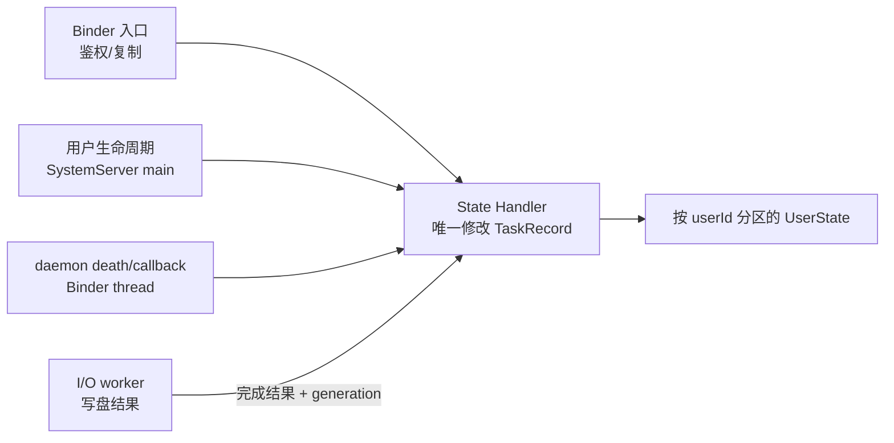
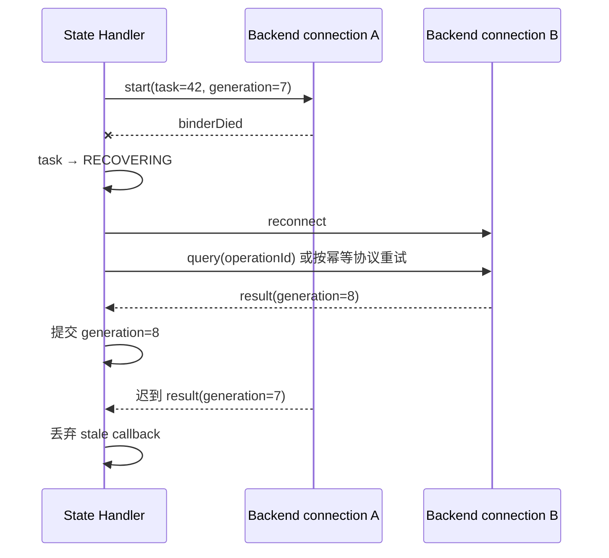

# 100 新增 Framework SystemService：怎样让“请求已受理”在重启和故障后仍说得清？

一个新的系统诊断服务在演示机上运行得很好：系统 App 调 `startDiagnosis()`，服务返回 `taskId=42`，稍后 callback 报告成功。

到了真实环境，问题接连出现：

- App 被杀后 callback 丢了，重启后不知道任务是否完成；
- 后端 daemon 重连后，旧连接的完成回调把新任务误写成成功；
- 用户切换后，用户 10 看到了用户 0 的状态；
- `system_server` 重启后，只存在内存里的 `taskId=42` 消失；
- 出问题时 `dumpsys` 只有一句“busy”，无法判断卡在排队、后端还是写盘。

先记住本章结论：

> **一个 SystemService 的完成标准不是“Binder 方法能调用”。可靠服务必须同时定义：谁有权调用、请求在哪个线程被接受、谁拥有可变状态、callback 丢失后从哪里查询、什么事实需要持久化、后端与 `system_server` 重启后怎样收敛，以及现场怎样证明卡在哪一步。**

本章继续使用虚构的 `MowerDiagnosticsService` 做教学设计。它不是 r48 仓库中已有服务，也不是可直接编译的补丁；所有平台机制都用 Android 11 / `android-11.0.0_r48` 的真实类和源码模式校准。

读完后，你应该能：

1. 区分 Binder 发布、Manager 注册和 `LocalServices` 三条注册链。
2. 设计“快速受理 + 可查询状态 + oneway 通知”的 AIDL。
3. 用 Handler 单线程 owner 和状态机避免 Binder 并发破坏状态。
4. 用 generation、幂等键和持久化恢复处理迟到回调与进程重启。
5. 分清 Framework permission、跨用户检查、SELinux `find/add/call` 的层次。
6. 设计不会泄密、不会把系统再次卡住的 `dumpsys` 与指标。

macOS 上只做静态阅读和设计推演，不编译、刷机或声称完成了设备验证。

---

## 1. 先把需求写成“可验证的完成边界”

假设产品真正需要的是：系统 App 发起一次割草机诊断，任务可跨 App 重启查询；后端断开后可以明确失败或恢复；每个 Android 用户只能看到自己的任务。

先不要写类，先回答七个问题：

| 问题 | 本章选择 | 为什么 |
|---|---|---|
| 谁能发起？ | 持有签名级业务权限的受信 App | 诊断可能控制硬件并读取敏感状态 |
| 调用要等多久？ | 只等校验、生成 taskId 和内存受理 | Binder 线程不等待真正诊断 |
| 结果从哪取？ | callback 做通知，`getStatus(taskId)` 做权威查询 | callback 会随客户端死亡而丢失 |
| 谁拥有状态？ | 专用 HandlerThread | Binder 线程池会并发进入 |
| 用户如何隔离？ | key 至少包含 `userId + taskId` | taskId 单独使用会跨用户串数据 |
| 什么要落盘？ | 恢复必须知道的任务身份、终态和后端关联信息 | 内存不能跨 `system_server` 重启 |
| 怎样诊断？ | 阶段、队列等待、执行时长、generation、最近失败 | “busy=true”不能定位 |

### 一次任务至少有七个“完成”

```text
Binder transact 到达
→ 权限与参数校验通过
→ 任务写入内存权威状态并返回 taskId
→ 后端接受请求
→ 后端产生结果
→ 结果持久化并可查询
→ callback 通知客户端
```

最后两步故意没有强行说成同一个原子事务。写盘成功后 callback 可能因客户端死亡而失败；callback 到达也不应证明结果已经可靠落盘。设计时必须选定哪个状态是事实，哪个只是通知。

本章把“结果写入权威状态并完成要求的持久化”定义为服务端成功；callback 只是让在线客户端更快知道。App 收到通知后仍可按 taskId 查询确认。

---

## 2. 一个 SystemService 为什么需要三条注册链？

可以把三条注册链类比成一家医院：

```text
ServiceManager        = 总机号码簿：服务名映射到 Binder
SystemServiceRegistry = App 端前台：Context 名字/类型映射到 Manager 工厂
LocalServices         = 医院内部专线：只供 system_server 内对象调用
```

它们不是同一件事的三种写法。

| 注册动作 | 注册内容 | 调用范围 | 是否跨进程 |
|---|---|---|---|
| `publishBinderService(name, binder)` | 服务名 → Binder Stub | 能找到服务的进程 | 是 |
| `SystemServiceRegistry.registerService(...)` | Context 名字/Manager 类型 → 客户端工厂 | Framework Java 调用方 | 工厂本身不是 IPC |
| `publishLocalService(Class, object)` | Class → 普通 Java 对象 | 同一 `system_server` | 否 |

只发布 Binder，`ServiceManager.getService()` 可以拿到它，但 `Context.getSystemService(MowerDiagnosticsManager.class)` 不会凭空出现。

只注册 Manager 而不发布 Binder，Manager 创建时找不到远端服务。

`LocalServices` 是进程内直接调用：没有 Parcel 隔离，不自动切线程，也没有远端 Binder UID 身份。不能因为它“快”就绕过本该存在的线程和权限边界。

### 用 r48 真实源码校准骨架

`SystemConfigService` 是一个很小的真实 `SystemService`：

```java
public class SystemConfigService extends SystemService {
    private final ISystemConfig.Stub mInterface =
            new ISystemConfig.Stub() { /* 权限检查与查询 */ };

    @Override
    public void onStart() {
        publishBinderService(
                Context.SYSTEM_CONFIG_SERVICE, mInterface);
    }
}
```

它证明“继承 `SystemService`、持有 Binder Stub、在 `onStart()` 发布”的最小形态。复杂服务只是在这副骨架上增加线程、状态、生命周期与恢复。

Manager 注册可对照 `SystemServiceRegistry` 中真实的 `SystemUpdateManager` 模式：`CachedServiceFetcher` 通过 `ServiceManager.getServiceOrThrow()` 取 Binder，再构造 Manager。

### 教学服务可能涉及哪些文件？

以下带 `Mower` 的路径都是拟新增，不是当前仓库已有源码：

```text
frameworks/base/core/java/android/content/Context.java
frameworks/base/core/java/android/app/SystemServiceRegistry.java
frameworks/base/core/java/android/os/IMowerDiagnosticsService.aidl     # 拟新增
frameworks/base/core/java/android/os/IMowerDiagnosticsCallback.aidl    # 拟新增
frameworks/base/core/java/android/os/MowerDiagnosticsManager.java       # 拟新增
frameworks/base/services/core/java/com/android/server/mower/            # 拟新增
frameworks/base/services/java/com/android/server/SystemServer.java
frameworks/base/core/res/AndroidManifest.xml
system/sepolicy/private/service_contexts
system/sepolicy/private/service.te
```

真实接入还可能涉及 `Android.bp`、API signature、权限 allowlist、stats Atom 和测试。是否公开成 SDK API、`@SystemApi`、`@hide` 或设备私有接口，是兼容性决策，不是顺手加一个 Java 常量。

---

## 3. AIDL 为什么要同时有 taskId、查询和 callback？

教学接口只保留核心语义：

```aidl
interface IMowerDiagnosticsService {
    long startDiagnosis(in DiagnosisRequest request,
            IMowerDiagnosticsCallback callback);
    DiagnosisStatus getStatus(long taskId);
    void cancel(long taskId);
}

oneway interface IMowerDiagnosticsCallback {
    void onProgress(long taskId, int progress);
    void onFinished(long taskId, in DiagnosisResult result);
}
```

设计顺序是先问 Why：

- `startDiagnosis()` 只受理，不等诊断完成，因此 Binder 返回可控；
- `taskId` 让任务可以查询、取消、去重和恢复；
- `getStatus()` 是 callback 丢失后的补偿通道；
- callback 用 `oneway`，服务发送通知时不等待客户端 reply；
- request/result 必须有大小上限，不在 Binder 里塞完整日志和图片。

### 同步 `startDiagnosis()` 不等于同步执行业务

普通 AIDL 调用会让客户端线程等待返回，但服务端只做短事务：鉴权、复制输入、分配/恢复幂等 taskId、把“已受理”提交给状态 owner，然后返回。

若连“已受理”都只是随手 `post()` 后立即返回，就会产生一个空窗：客户端拿到 taskId，Handler 却可能尚未建立对应状态，紧接着查询得到 NOT_FOUND。可以采用以下一种明确契约：

1. Binder 入口用一个短的同步交接，等 Handler 确认任务记录已建立后再返回；或
2. 返回后允许短暂 `ACCEPTING`，且查询协议明确认识这个状态。

不要一边宣称“返回 taskId 就已受理”，一边让状态仍不存在。

### `oneway` 只改变等待方式，不提供可靠消息队列

`oneway` callback 没有业务 reply，发送方线程不等待客户端处理。但它仍可能排队、因客户端死亡而失败，也不会替你保存通知供 App 重启后补领。

所以：

```text
callback = 低延迟提示
query API = 当前权威状态
持久化 = 跨 system_server 重启的恢复事实
```

通知不是事实本身。

---

## 4. `onStart()` 返回后，服务到底 ready 到哪一步？

r48 的 `SystemService` 文档说明：构造、`onStart()`、各个 `onBootPhase()` 和用户生命周期回调都由 SystemServer 主 Looper 线程调用。

这条事实带来两个约束：

1. 生命周期回调不能做无界 I/O、等待后端或长时间持锁，否则会拖慢甚至卡住 SystemServer 主线程；
2. `onStart()` 中发布 Binder 只说明服务“可被找到”，不说明所有依赖、用户数据和后端连接都 ready。

服务可显式维护 readiness：

```text
PUBLISHED          Binder 已发布，调用方可能进来
SYSTEM_READY       必需的系统服务依赖可用
USER_STARTED       某用户的 DE 状态可建立
USER_UNLOCKED      该用户 CE 数据可读取
BACKEND_CONNECTED  外部 daemon/HAL 连接可用
```

Binder API 遇到尚未 ready 时，要么返回可行动的状态码，要么将任务记为等待依赖；不能静默在 Binder 线程睡眠。

### BootPhase 和用户解锁是两条轴

`PHASE_SYSTEM_SERVICES_READY`、`PHASE_THIRD_PARTY_APPS_CAN_START`、`PHASE_BOOT_COMPLETED` 描述整个系统启动阶段；`onUserStarting()`、`onUserUnlocking()`、`onUserUnlocked()`、`onUserStopping()`、`onUserStopped()` 描述某个用户的生命周期。

系统已经 `BOOT_COMPLETED`，不代表后来切换进来的用户已解锁；用户已 starting，也不代表其 credential-encrypted（CE）存储可用。

如果最终结果需要在锁屏启动阶段查询，应考虑 device-encrypted（DE）存储及泄密风险；若内容敏感且必须放 CE，则在 `onUserUnlocked()` 后再加载，并在未解锁时返回明确状态。

### SystemServer 中的启动位置由依赖决定

教学服务应由 `SystemServiceManager.startService()` 启动。放在哪一段不是按名称排序，而取决于：

- 构造/`onStart()` 立即需要哪些服务；
- 哪个 BootPhase 才允许接入后端或第三方 App；
- 是否能先发布 Binder，再以 NOT_READY 响应；
- 哪些服务需要它的 LocalService。

为了“看起来早点可用”而过早启动，通常只是把显式依赖错误变成时序竞态。

---

## 5. Binder 入口为什么只能做“验票、复印、交接”？

Binder 线程池会并发进入 Stub。可以把入口想成车站检票口：它适合查票、核对身份、复制必要信息并把旅客送进站内队列，不适合让检票员亲自开完整段列车。

一个稳健入口的顺序是：

```text
1. 检查业务 permission
2. 读取 Binder.getCallingUid()/Pid()
3. 解析并检查目标 userId 与跨用户权限
4. 校验长度、数量、枚举和 FD/URI 等参数
5. 将可变 Parcelable/Bundle 复制成服务自己的不可变请求
6. 必要时 clearCallingIdentity，再调用系统内部能力
7. 把请求交给 Handler 状态 owner
8. 返回 taskId 或明确错误
```

### 为什么服务端还要检查，Manager 检查不算吗？

Manager 的参数预检改善调用体验，但恶意或有 bug 的客户端可以绕过 Manager，直接拿 Binder transact。权限、UID、userId 和资源上限必须由服务端 Stub 再检查。

教学入口可以写成结构示意：

```java
public long startDiagnosis(DiagnosisRequest request,
        IMowerDiagnosticsCallback callback) {
    enforceStartPermission();
    final int callingUid = Binder.getCallingUid();
    final int callingPid = Binder.getCallingPid();
    final int userId = resolveAndEnforceUser(request.userId, callingUid);
    final ImmutableRequest copy = validateAndCopy(request);

    final long token = Binder.clearCallingIdentity();
    try {
        return acceptOnStateThread(copy, callback,
                callingUid, callingPid, userId);
    } finally {
        Binder.restoreCallingIdentity(token);
    }
}
```

这是教学骨架，不是可直接编译的连续源码。特别是 `clearCallingIdentity()` 不能提前到鉴权之前，否则后续代码看到的是 `system_server` 身份，会把调用者边界抹掉。

### 为什么必须复制请求？

跨进程 AIDL 的 Parcelable 已经过反序列化，但它内部的 `Bundle`、集合或可变对象仍可能被服务自己的后续代码修改或共享。进程内 LocalService 更没有 Parcel 复制这一层。

状态机应只保存经过校验的不可变值，并在入口限制：

- 文本、数组、集合和 Bundle 条目数；
- 单项长度与总序列化规模；
- 不认识的 enum/flag；
- URI/FD 的权限与生命周期；
- callback 是否允许为空。

“Binder 有事务大小上限”不是业务可以不设上限的理由。靠驱动在极限处报 `TransactionTooLargeException`，错误既晚又不可行动。

### 不要持锁或占 Binder 线程调用外部系统

后端 daemon、HAL、磁盘、callback 和其他 Binder 服务都可能阻塞或反向调用。如果在全局锁内调用它们，容易形成：

```text
本服务持锁 → 等后端 Binder
后端回调本服务 → 等同一把锁
```

正确方向是先在 owner 线程内生成要执行的动作和不可变快照，锁外/状态线程外做外部调用，再把结果携带 generation 投回 owner 线程提交。

---

## 6. 为什么 Handler 单线程 owner 比“到处 synchronized”更容易证明正确？

如果 Binder 线程、后端回调线程、用户生命周期主线程和写盘线程都能直接修改 `TaskRecord`，每个字段都可能处在不同代际。

本章选择一条专用 HandlerThread 作为唯一可变状态 owner：



这里的“单线程”只保证状态转换串行，不保证系统不会卡。Handler 上仍不能做长 I/O、等待后端或执行慢 callback。

### 状态机比多个 boolean 更可靠

教学任务可使用：

```text
ACCEPTED
→ WAITING_BACKEND
→ RUNNING
→ PERSISTING
→ SUCCEEDED

任意未终态 → CANCEL_REQUESTED → CANCELLED
任意未终态 → FAILED(code, stage)
恢复时       → RECOVERING → RUNNING / FAILED / SUCCEEDED
```

每条边要写清楚：

- 谁触发；
- 是否允许重复；
- 修改哪些字段；
- 是否需要写盘；
- 对客户端发哪个通知；
- 外部调用失败后回到什么状态。

`running=true`、`finished=true`、`failed=true` 三个布尔变量可能同时为真；一个枚举状态和显式转换表更容易审查。

### generation 为什么能挡住迟到回调？

假设后端连接 A 断开，服务建立连接 B 并重试 task 42。此时 A 的旧完成回调迟到。如果只按 taskId 提交，它可能覆盖 B 的新状态。

为每次后端连接或执行尝试分配单调 generation：

```java
void onBackendFinished(long taskId, long callbackGeneration,
        DiagnosisResult result) {
    mHandler.post(() -> {
        TaskRecord task = findTask(taskId);
        if (task == null || task.generation != callbackGeneration) {
            recordStaleCallback(taskId, callbackGeneration);
            return;
        }
        transitionToPersisting(task, result);
    });
}
```

generation 不是安全凭据，而是时序版本。它证明“这条异步结果属于当前尝试”，避免旧世界污染新世界。

### 幂等键解决的是重复请求，不是迟到回调

客户端可能因超时没收到 `startDiagnosis()` reply 而重试。若每次都新建任务，后端可能执行两次危险操作。

可让调用方提供受约束的 request id，服务以 `userId + callingUid + requestId` 查找已有任务：

```text
相同键 + 相同规范化参数 → 返回原 taskId
相同键 + 不同参数       → 明确冲突
没有键                  → 新建任务
```

幂等键处理“同一意图被提交多次”；generation 处理“同一任务的旧异步结果晚到”。二者不能互相替代。

---

## 7. callback 为什么只能当通知，不能当任务真相？

客户端可能在任务完成前被 LMKD 回收，也可能旋转页面、重建进程或主动注销 callback。反过来，callback 已送出时服务也可能尚未完成持久化。

所以服务端权威状态必须独立于 callback：

```text
TaskRecord / 持久化记录 = 任务事实
RemoteCallbackList      = 当前在线的通知订阅者
getStatus(taskId)       = 客户端重新同步事实的入口
```

`RemoteCallbackList` 是 r48 的真实基础设施。它按 callback 的底层 `IBinder` 去重，为每个 callback `linkToDeath()`，客户端进程死亡时自动移除，并允许在 `onCallbackDied()` 做额外清理。

但它不会：

- 保存客户端错过的通知；
- 跨 `system_server` 重启恢复订阅；
- 将 callback 失败自动变成业务失败；
- 替任务状态做持久化。

### 广播 callback 时不要持有业务状态锁

`RemoteCallbackList.beginBroadcast()` 给出稳定的回调快照，必须与 `finishBroadcast()` 配对。教学结构可写成：

```java
List<CallbackEvent> events = buildEventsOnStateThread();

int count = mCallbacks.beginBroadcast();
try {
    for (int i = 0; i < count; i++) {
        try {
            deliver(mCallbacks.getBroadcastItem(i), events);
        } catch (RemoteException ignored) {
            // death recipient/后续清理负责失效 callback
        }
    }
} finally {
    mCallbacks.finishBroadcast();
}
```

实际代码还应避免在 state Handler 上连续调用大量 callback；可构造快照后交给专用通知执行器。`oneway` 只避免等待业务 reply，Binder 驱动发送和队列压力仍有成本。

### callback 死亡是否应该取消任务？

本章需求说“App 死亡后任务仍可完成”，所以 `onCallbackDied()` 只移除订阅，不取消任务。

另一类“仅服务于当前前台客户端”的操作可能选择随 token 死亡取消。这个行为必须写进 API 语义，不能从 `linkToDeath()` 的存在自动推断。

---

## 8. `AtomicFile` 能保证什么，不能保证什么？

r48 的 `AtomicFile` 通过 `.new` 文件完成写入、sync、close，再 rename 到正式文件；失败时删除新文件。它的目标是让读者看到完整旧文件或完整新文件，而不是半截内容。

典型写法：

```java
FileOutputStream out = null;
try {
    out = atomicFile.startWrite();
    writeSnapshot(out, snapshot);
    atomicFile.finishWrite(out);
} catch (IOException e) {
    atomicFile.failWrite(out);
    throw e;
}
```

### “Atomic” 不等于整个诊断事务原子

`AtomicFile` 自己的类注释明确指出：它不提供文件锁；并发读写的互斥由调用者负责。

r48 的 `finishWrite()` 还是 `void`：底层 sync、close 或 rename 异常主要通过日志暴露，没有向上返回一个可组合的“持久化事务已确认”对象。因此服务除了捕获 `startWrite()/序列化` 异常，还应记录写盘阶段和最近失败；不能只因调用过 `finishWrite()` 就对外宣称后端、指标与通知也一并提交。

它也不能把以下动作变成一个跨系统事务：

```text
后端硬件已经执行成功
状态文件 rename 成功
statsd Atom 写入成功
callback 送达客户端
```

任何两步之间都可能重启。服务必须通过恢复协议处理“后端成功但本地还没记”“本地已记但 callback 没送到”等中间态。

### 哪些事实应该持久化？

不要把整个内存对象图序列化。只保存恢复所需、版本化且有边界的数据，例如：

```text
schemaVersion
userId / taskId / idempotencyKey
规范化请求摘要（避免保存不必要敏感原文）
当前恢复状态与 generation
后端稳定 operationId（若后端支持查询）
最终 result code / failure stage
创建、开始、完成的时间基准说明
```

若后端不支持稳定 operationId 和结果查询，`system_server` 重启后就无法证明旧操作是成功、失败还是仍在运行。此时应恢复成 `UNKNOWN_AFTER_RESTART` 或按明确策略重新执行，而不是为了界面好看随便标成功。

写盘也必须有单一顺序：由 state owner 产生带版本的不可变 snapshot，交给串行 I/O writer；完成结果再携带 snapshot version 投回 state owner。否则旧快照可能在新快照之后落盘，AtomicFile 仍会“原子地写回旧状态”。

### DE、CE 与用户边界

每个用户单独保存，文件路径和内存 key 都包含 userId。放 DE 还是 CE 由需求决定：

- 锁屏启动前必须恢复的非敏感调度信息可考虑 DE；
- 凭据保护的敏感结果放 CE，并等 `onUserUnlocking/onUserUnlocked`；
- `onUserStopping()` 是释放该用户资源、停止使用其 CE 数据的关键窗口；
- `onUserStopped()` 后不应继续持有该用户 callback、打开的 FD 或后端会话。

“所有文件都放 `/data/system`”不能替代多用户和加密语义设计。

---

## 9. 后端 daemon/HAL 死亡后，怎样恢复而不重复执行？

如果服务依赖 native daemon 或 HAL，Binder death 只告诉你“能力端点死了”，不告诉你某次诊断是否已经作用于硬件。

恢复链应显式建模：



关键问题不是“能否重连”，而是重连后如何判定旧操作：

| 后端能力 | 服务恢复策略 |
|---|---|
| 有稳定 operationId，可查询结果 | 重连后查询并收敛 |
| start 支持幂等 request id | 用同一 id 重试，后端返回同一操作 |
| 操作天然幂等 | 可按明确重试预算重做 |
| 不可查询、不可幂等且有副作用 | 标记未知并要求人工/更高层协调，不能盲重试 |

### 重连也需要状态，而不是无限 while

至少记录：

- 当前连接 generation；
- 连续失败次数和最近错误；
- 下一次重试时间；
- 是否因用户停止、服务关闭或永久错误而不再重试；
- 正在恢复的任务数。

退避、抖动和上限要按产品要求定义。本章没有真机数据，因此不虚构“最佳 1 秒/5 次”等数字。

---

## 10. Java permission、跨用户与 SELinux 为什么缺一不可？

三者回答不同问题：

```text
Framework permission  = 这个 UID 是否有权执行这项业务操作？
跨用户检查            = 它是否能代表目标 userId 操作？
SELinux                = 这个进程域能否发现/调用/发布该 Binder 能力？
```

### 业务鉴权必须使用原始调用者身份

Stub 入口先保存 `Binder.getCallingUid()`，检查签名权限和目标用户。只有进入受信的系统内部调用时才 `clearCallingIdentity()`，并在 `finally` 恢复。

若先 clear 再 `enforceCallingPermission()`，检查到的可能是 `system_server` 自己，权限边界等于被绕过。

仅比较传入 packageName 也不够；字符串包名不是身份，应从 UID/PackageManager 关系和签名/权限建立证据。

### 跨用户不是把 `UserHandle.getUserId(uid)` 算出来就结束

默认可把 calling UID 所属用户作为目标。若 API 允许显式 userId，需要按平台规则检查跨用户权限、特殊 UID 和 user/profile 关系，并在所有状态、文件、callback cookie 与日志 key 中保留最终解析的 userId。

入口校验正确但内部用 `taskId` 单独查表，仍会在后续查询或 callback 阶段串用户。

### SELinux 的三道门

新增服务名通常需要在 `service_contexts` 映射到 service type，并配置最小权限：

| SELinux/Framework 门 | 作用 |
|---|---|
| `service_manager add` | `system_server` 是否能用该名字发布服务 |
| `service_manager find` | 客户端域是否能取得服务 handle |
| `binder call` | 客户端域是否能向服务进程发 Binder 事务 |
| Java permission/check | 拿到 handle 后，具体方法是否允许该 UID 调用 |

“能 find”不等于“业务方法获准”；Java 权限通过也不能绕过 SELinux 的进程域强制访问控制。

不要为了让 demo 通过而给所有 appdomain 广泛 `find/call`。先列出真实客户端域，再授予最小集合，并让拒绝日志能对应到具体 type。

---

## 11. Manager 应该隐藏 Binder，但不能伪造成功

面向调用方的 Manager 负责把底层 AIDL 变成稳定、易用的 Java API：

```java
@SystemService(Context.MOWER_DIAGNOSTICS_SERVICE)
public final class MowerDiagnosticsManager {
    private final IMowerDiagnosticsService mService;

    public long startDiagnosis(DiagnosisRequest request,
            Executor executor, Callback callback) {
        // 本地参数预检、Binder callback → Executor、异常映射
        return ...;
    }
}
```

省略号表示教学职责，不是可编译实现。Manager 应做：

- 类型安全和便利参数检查；
- 将 Binder callback 转发到调用者指定的 `Executor`；
- 将 `RemoteException` 按平台 API 约定重新抛出或映射；
- 隐藏 AIDL Stub/Proxy 和线程细节；
- 明确服务不存在、尚未 ready 与业务失败的差异。

它不应捕获所有异常然后返回 `taskId=0` 或空结果。那会把“system_server/服务死亡”和“任务确实不存在”压成同一假成功。

r48 中很多 Manager 对 `RemoteException` 使用 `rethrowFromSystemServer()`；具体公开 API 选择异常还是状态对象要保持一致，但都不应静默吞掉死亡事实。

### `CachedServiceFetcher` 缓存的是什么？

`SystemServiceRegistry.CachedServiceFetcher` 把 Manager 实例缓存在对应 `ContextImpl` 的 service cache。它缓存的不是任务结果，也不是服务端 `TaskRecord`。

Manager 内持有的 Binder proxy 死亡后是否自动重新获取，要看 Manager 自己的实现；“Context 能再次返回同一个 Manager”不等于“远端能力已自动恢复”。对普通 App 而言，`system_server` 死亡常伴随更大范围的 framework 重启，不能承诺所有调用透明续接。

### API 与内部实现的版本边界

若接口只在同一次 platform 构建内使用，普通 framework AIDL 可以与系统一起升级；若接口跨 system/vendor、独立 Mainline 模块或需要长期兼容，则要评估 stable AIDL、冻结版本/hash 与 VINTF。

在 Parcelable 里随便加 `version` 字段并不会自动得到兼容性。仍需定义：旧端遇到新字段怎么办、新端缺字段用什么默认值、未知 enum 是否拒绝、最大尺寸是多少。

---

## 12. `dumpsys` 怎样解释现场，又不制造第二次卡死？

当 task 42 卡住时，最有价值的不是一大段原始对象，而是一条阶段化证据：

```text
serviceReady=BACKEND_CONNECTED
user=10 task=42 state=RUNNING generation=8
acceptedAgo=12s queueWait=37ms backendRunning=11.9s
backendConnected=true reconnectCount=1
lastTransition=WAITING_BACKEND→RUNNING
lastError=none
pendingPersistWrites=0 callbackCount=1
```

这些数字只是字段示例，不是假装测得的性能数据。

### dump 的线程和锁边界

`dump()` 通常从 Binder dump 入口进入，先用 `DumpUtils.checkDumpPermission()` 检查权限。它不能持业务锁去等待后端，也不能无限等待 state Handler。

稳健做法是：

1. 用有超时的方式向 state Handler 请求不可变快照；
2. 快照只包含已脱敏、大小受限的数据；
3. Handler 超时时打印“snapshot timeout”和已知线程/队列事实，而不是永久阻塞 dumpsys；
4. 在 dump 调用线程格式化和输出，不边遍历边修改真实状态。

若 system_server 已因状态线程卡住，`dumpsys` 再无界等待同一线程只会让现场更糟。

### 四类可观测工具各回答什么？

| 工具 | 适合回答 | 不适合 |
|---|---|---|
| `dumpsys` | 当前状态、队列、最近错误和配置 | 高频长期统计 |
| trace/Perfetto | Binder→Handler→后端→持久化的时序与线程等待 | 充当永久业务数据库 |
| statsd Atom | 成功率、失败阶段、耗时分布等聚合 | 输出敏感请求全文 |
| EventLog/受限日志 | 低频关键状态变化与关联 id | 每个进度点无限刷日志 |

### 延迟要拆段，不写一个含糊的“总耗时”

至少区分：

```text
Binder validation time
Handler queue wait
backend connect wait
backend execution time
persist time
callback dispatch lag
end-to-end time
```

否则 P99 变慢时无法判断是 system_server 消息积压、daemon 执行慢还是存储卡顿。本章没有真实测量，所以只定义指标，不编造提升比例。

日志和 dump 只保留 taskId、状态、阶段、错误枚举和必要时间。硬件序列号、用户输入、完整请求参数与原始诊断数据要默认脱敏或仅在受控 debug 能力下输出。

---

## 13. 怎样验证这套设计不是只在成功路径上自洽？

先按层写测试矩阵：

| 层 | 必测问题 |
|---|---|
| Binder/API | 无权限、跨用户、null/超长参数、未知 flag、并发重复请求 |
| 状态机 | 每条合法转换、非法转换、cancel 与 finish 竞态、generation 过期 |
| callback | 客户端死亡、注销、oneway 堵塞、回调抛异常、重注册后 query |
| 后端 | 死在接受前、接受后/结果前、结果后/本地写盘前，重连失败 |
| 持久化 | 写半截、sync/rename 失败、旧 schema、损坏文件、用户未解锁 |
| 生命周期 | BootPhase 依赖未 ready、用户 start/unlock/stop、服务关闭 |
| 可观测性 | dump 权限、快照超时、超多任务截断、敏感字段脱敏 |

### 故障注入比只测“一次成功”更有价值

针对本章场景，至少推演四刀：

```text
刀 1：startDiagnosis 返回 taskId 后立刻杀客户端
预期：任务继续；callback 自动清理；重启后 query 可取状态

刀 2：后端接受任务后死亡
预期：进入 RECOVERING；按 operationId/幂等策略收敛；不盲目重复副作用

刀 3：后端结果到达后、AtomicFile 提交前重启 system_server
预期：恢复后查询后端或标 UNKNOWN；不能凭内存假装成功

刀 4：新连接 generation=8 建立后注入 generation=7 的迟到结果
预期：记录 stale callback，不修改 task 42 当前状态
```

这些“预期”是设计验收标准，不是本机已经执行的测试结果。

---

## 14. 在 Mac 上不编译，怎样完成一次源码验证？

### 验证一：服务怎样启动与发布

```bash
rg -n 'StartSystemConfigService|startService\(SystemConfigService' frameworks/base/services/java/com/android/server/SystemServer.java

rg -n 'class SystemConfigService|onStart|publishBinderService' frameworks/base/services/java/com/android/server/SystemConfigService.java
```

预期证明：SystemServer 通过 `SystemServiceManager` 启动服务，服务在 `onStart()` 发布 Binder。

### 验证二：三条注册链确实不同

```bash
rg -n 'publishBinderService|publishLocalService' frameworks/base/services/core/java/com/android/server/SystemService.java

rg -n 'SYSTEM_UPDATE_SERVICE|CachedServiceFetcher|getServiceOrThrow' frameworks/base/core/java/android/app/SystemServiceRegistry.java
```

记录 `ServiceManager.addService()`、`LocalServices.addService()` 和 `ContextImpl` Manager cache 分别出现在哪里。

### 验证三：生命周期都在哪条线程被调用

```bash
rg -n 'All lifecycle methods|onBootPhase|onUserStarting|onUserUnlocking|onUserStopping|onUserStopped' frameworks/base/services/core/java/com/android/server/SystemService.java
```

预期证明：SystemService 生命周期在 SystemServer main Looper；BootPhase 与 per-user 生命周期是不同维度。

### 验证四：callback death 与 AtomicFile 边界

```bash
rg -n 'linkToDeath|binderDied|beginBroadcast|finishBroadcast' frameworks/base/core/java/android/os/RemoteCallbackList.java

rg -n 'does not confer any file locking|startWrite|finishWrite|failWrite' frameworks/base/core/java/android/util/AtomicFile.java
```

记录 `RemoteCallbackList` 自动清理什么，以及 `AtomicFile` 明确要求调用者负责什么互斥。

### 验证五：服务名与 SELinux type 的对应

```bash
rg -n '^system_config|^system_update' system/sepolicy/private/service_contexts

rg -n 'system_config_service|system_update_service' system/sepolicy/public/service.te
```

预期证明：Binder 服务名不仅是 Java 常量，还要映射到 SELinux service type。

### 自检题与答案

**1. `publishBinderService()` 成功后，为什么 `Context.getSystemService()` 仍可能取不到 Manager？**

Binder 发布只建立 ServiceManager 的“名字→Binder”映射。Context 侧还需要 `SystemServiceRegistry` 注册 Manager 工厂和类型映射。

**2. `startDiagnosis()` 为什么不是 oneway？**

调用方需要明确知道鉴权/参数校验是否通过并取得 taskId。它是一个短同步“受理事务”，真正诊断异步执行。

**3. callback 已经是 oneway，为什么还必须提供 `getStatus()`？**

oneway 只让发送方不等 reply。客户端可死亡、通知可错过、system_server 可重启；查询接口才用于重新同步权威状态。

**4. Handler 单线程 owner 能否保证服务永不卡？**

不能。它只让状态转换串行。若在 Handler 上做慢 I/O、等待后端或发送大量 callback，仍会造成队列积压。

**5. generation 与幂等键分别解决什么？**

generation 拒绝旧连接/旧尝试的迟到异步结果；幂等键让客户端重复提交同一意图时返回同一任务或明确冲突。

**6. AtomicFile 提交成功，能否证明 callback 已送达、后端事务也原子完成？**

不能。它只保护单个文件的新旧版本完整性，不提供跨后端、日志、回调的分布式事务，也不提供并发文件锁。

**7. 为什么不能先 `clearCallingIdentity()` 再检查权限？**

那会把后续检查的调用身份变成 system_server，可能让未经授权的原始调用者借用系统身份通过检查。

**8. `onBootPhase(PHASE_BOOT_COMPLETED)` 到了，能否读取所有用户 CE 数据？**

不能。BootPhase 是系统启动轴，每个用户还有独立的 start/unlock/stop 轴；未解锁用户的 CE 数据仍不可用。

**9. 后端死后为什么不能总是自动重试？**

若操作有副作用且后端不能查询、不能用幂等 id 去重，服务无法知道旧操作是否已经执行；盲重试可能重复控制硬件。

**10. dumpsys 为什么需要超时快照？**

若它无界等待已卡住的状态线程，会让诊断命令本身也挂住。超时快照至少保留“取不到状态”这一现场证据。

### 本章 takeaway

以后评审新增 SystemService，不要先问“Stub 写完了吗”，先画这条链：

```text
[身份/用户/参数]
        ↓
[短同步受理 + taskId]
        ↓
[Handler 状态机]
        ↓
[后端 operationId + generation]
        ↓
[持久化权威状态]
        ↓
[callback 通知 + query 补偿]
        ↓
[dump / trace / metrics 可证明]
```

链上任何一步没有失败语义和恢复入口，服务就只是“正常路径能跑”，还不是可上线维护的系统能力。

---

## 源码定位表

| 目的 | r48 文件/符号 |
|---|---|
| SystemService 生命周期与发布 helper | `frameworks/base/services/core/java/com/android/server/SystemService.java` |
| 服务启动与 BootPhase 调度 | `frameworks/base/services/core/java/com/android/server/SystemServiceManager.java` |
| SystemServer 启动真实服务 | `frameworks/base/services/java/com/android/server/SystemServer.java` |
| 最小真实 Binder SystemService | `frameworks/base/services/java/com/android/server/SystemConfigService.java` |
| Context Manager 注册与缓存 | `frameworks/base/core/java/android/app/SystemServiceRegistry.java` |
| Manager 的 RemoteException 处理示例 | `frameworks/base/core/java/android/os/SystemUpdateManager.java` |
| 进程内服务注册 | `frameworks/base/core/java/com/android/server/LocalServices.java` |
| callback 注册、快照广播与死亡清理 | `frameworks/base/core/java/android/os/RemoteCallbackList.java` |
| 单文件完整写入/恢复 | `frameworks/base/core/java/android/util/AtomicFile.java` |
| dump 权限检查示例 | `frameworks/base/services/core/java/com/android/server/UiModeManagerService.java` |
| Binder 服务名标签 | `system/sepolicy/private/service_contexts` |
| 服务 type 定义 | `system/sepolicy/public/service.te` |

文中的 `MowerDiagnostics*`、`DiagnosisRequest`、`TaskRecord` 和状态机都是教学设计，不能用 `rg` 在 r48 找到。真实源码只用来证明平台提供了哪些生命周期、注册、回调、文件与安全机制；最终 API、SELinux 规则、恢复策略、时延预算和测试结果必须由实际产品约束决定。
