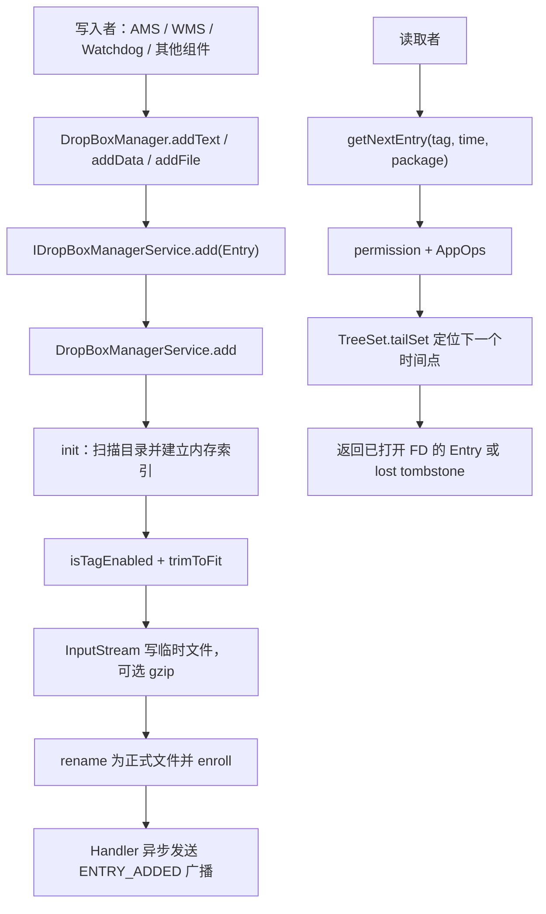

# 101 Android DropBoxManagerService：真实 SystemService 逐层精读

> 源码版本：Android 11（`android-11.0.0_r48`）  
> 核心文件：`frameworks/base/services/core/java/com/android/server/DropBoxManagerService.java`  
> 本章目标：把第 100 章的 SystemService 设计清单应用到一个真实服务，理解系统诊断条目如何写入文件、建立索引、控制配额、授权读取并发出通知。  
> 环境：macOS 只读源码，不要求编译或真机验证。

---

## 1. DropBox 不是云盘，也不是 Dropbox 应用

Android Framework 的 DropBox 是一个系统诊断事件仓库。不同系统组件把 ANR、崩溃、看门狗、内核日志等诊断材料按 `tag` 写入，服务将它们保存在：

```text
/data/system/dropbox
```

这里的“drop box”可以理解为系统内部的诊断投递箱。它不是网络同步服务，也不保证永久保存。

---

## 2. 先回答它解决什么问题

如果每个组件各自保存日志，会出现：

- 文件格式和目录各不相同。
- 一个故障源可能无限写满 `/data`。
- 读取权限无法集中控制。
- 旧日志和低价值日志难以统一裁剪。
- 新条目到达后，诊断消费者不知道何时查询。

DropBoxManagerService 提供统一入口、统一磁盘配额、统一枚举方式和统一读取授权。

---

## 3. 本章源码地图

```text
frameworks/base/core/java/android/os/DropBoxManager.java
frameworks/base/core/java/com/android/internal/os/IDropBoxManagerService.aidl
frameworks/base/services/core/java/com/android/server/DropBoxManagerService.java
frameworks/base/services/java/com/android/server/SystemServer.java
frameworks/base/core/java/android/content/Context.java
frameworks/base/core/java/android/app/SystemServiceRegistry.java
frameworks/base/core/res/res/values/config.xml
frameworks/base/core/res/AndroidManifest.xml
system/sepolicy/private/service_contexts
system/sepolicy/private/system_server.te
```

先看服务类，再沿 Manager、AIDL、启动和策略向外扩散，阅读成本最低。

---

## 4. 一张完整数据流图



它的权威数据在文件系统，内存结构主要是索引和空间记账。

---

## 5. 类的外壳仍是标准 SystemService

源码：

```java
public final class DropBoxManagerService extends SystemService {
    private final IDropBoxManagerService.Stub mStub =
            new IDropBoxManagerService.Stub() { ... };
}
```

这与第 100 章的教学骨架一致：`SystemService` 管平台生命周期，AIDL Stub 管跨进程入口，内部方法管业务。

Stub 中的 `add()`、`isTagEnabled()`、`getNextEntry()`、`dump()` 都转发到外层服务，避免把所有业务堆进匿名 Stub。

---

## 6. 构造函数做了什么

默认构造：

```java
public DropBoxManagerService(final Context context) {
    this(context, new File("/data/system/dropbox"),
            FgThread.get().getLooper());
}
```

它只确定目录、ContentResolver 和广播 Handler，没有立即扫描文件。

另一个 `@VisibleForTesting` 构造函数允许注入临时目录和 Looper。这是很实用的可测试性设计：测试不必操作真实 `/data/system/dropbox`，也能控制消息循环。

---

## 7. `onStart()` 为什么很短

```java
@Override
public void onStart() {
    publishBinderService(Context.DROPBOX_SERVICE, mStub);
    // real work gets done lazily in init()
}
```

服务先发布 Binder，磁盘扫描推迟到首次真正使用。源码注释给出的理由是：即使磁盘有问题，服务对象创建仍能成功，由单次方法处理失败。

这体现两种完成点：

```text
Binder 已发布 ≠ 文件目录已成功初始化
```

惰性初始化降低启动关键路径，但把首次调用延迟和失败移到了运行期。

---

## 8. 惰性初始化的收益与代价

收益：

- 不阻塞 SystemServer 启动。
- 开机期间没有 DropBox 调用时不做目录扫描。
- 一次磁盘问题不一定使 SystemServer 启动失败。

代价：

- 第一个调用者承担扫描成本。
- 首次调用可能在 Binder 线程执行慢 I/O。
- 多个入口都必须正确调用 `init()`。
- 初始化失败需要各入口分别决定返回、记录还是丢弃。

“lazy”不是免费优化，而是把成本换了时间和责任位置。

---

## 9. 两个 BootPhase

在 `PHASE_SYSTEM_SERVICES_READY`：

```text
注册 ACTION_DEVICE_STORAGE_LOW Receiver
注册 Settings.Global ContentObserver
读取低优先级 tag 和广播限流资源配置
```

在 `PHASE_BOOT_COMPLETED`：

```java
mBooted = true;
```

`mBooted` 是 `volatile`，因为广播 Handler 与 phase 回调可能处在不同线程。

---

## 10. `mBooted` 控制的不是“服务可用”

广播发送前：

```java
if (!mBooted) {
    intent.addFlags(Intent.FLAG_RECEIVER_REGISTERED_ONLY);
}
```

含义是：开机完成前只通知已动态注册的 Receiver，避免启动尚未完成时拉起 manifest Receiver。

因此 `mBooted` 控制广播投递范围，不控制 add/get 接口是否可调用，也不表示文件索引已初始化。

---

## 11. Manager、AIDL、Service 三层

```text
DropBoxManager
  → IDropBoxManagerService.Proxy
  → Binder driver
  → IDropBoxManagerService.Stub
  → DropBoxManagerService
```

App 通常通过：

```java
DropBoxManager manager = context.getSystemService(DropBoxManager.class);
```

Manager 提供 `addText()`、`addData()`、`addFile()` 等方便接口，最终包装成 `DropBoxManager.Entry` 发送到服务端。

---

## 12. Entry 是流的抽象

`DropBoxManager.Entry` 可以代表：

```text
文本
byte[]
文件
已压缩数据
只有元数据的 lost entry
```

服务端通过 `entry.getInputStream()` 顺序读取，而不是要求所有内容一次性驻留在 Java heap。

但 Entry 仍通过 Binder 传递，涉及 FD/Parcelable 生命周期；服务端 finally 中必须关闭它。

---

## 13. `add()` 的九步主流程

```text
1. 读取 tag/flags
2. 拒绝调用方直接提交 IS_EMPTY
3. init() 建索引
4. 检查 tag 是否启用
5. trimToFit() 得到单条最大空间参考值
6. 流式读取并决定是否 gzip
7. 超限则删除临时内容并生成 tombstone
8. createEntry() rename/enroll
9. Handler 异步发广播
```

理解 `add()` 时，应先掌握这条骨架，再看循环中的每一行。

---

## 14. 为什么拒绝外部 `IS_EMPTY`

源码：

```java
if ((flags & DropBoxManager.IS_EMPTY) != 0) {
    throw new IllegalArgumentException();
}
```

`IS_EMPTY` 是服务内部表示“原内容因空间限制丢失”的 tombstone 语义。若调用者能自行声明，就能伪造“系统曾保存但后来丢失”的记录。

这是一个小而重要的信任边界：Parcelable 字段到达服务端后仍要验证。

---

## 15. Tag 开关来自 Settings

```java
return !"disabled".equals(Settings.Global.getString(
        mContentResolver, Settings.Global.DROPBOX_TAG_PREFIX + tag));
```

每个 tag 可通过形如 `dropbox:<tag>` 的 Global Settings 控制。只有值恰好为 `disabled` 时关闭。

读取 Settings 前清除 Binder calling identity，确保以 system_server 身份访问系统设置，最后在 `finally` 恢复身份。

---

## 16. 身份清除的正确顺序

```java
final long token = Binder.clearCallingIdentity();
try {
    // 代表 system_server 访问 Settings
} finally {
    Binder.restoreCallingIdentity(token);
}
```

这里没有在清除后做调用者权限判断。若还需要 UID/package 鉴权，应先捕获和验证调用身份，再清除。

`finally` 必不可少，否则 Binder 线程处理下一个事务时身份可能错误。

---

## 17. 先读一个文件系统 block 再决定压缩

源码先分配 `mBlockSize` 大小 buffer，读满一个 block 后才启用 `GZIPOutputStream`：

```text
不足一 block → 不压缩，避免小数据的 gzip 开销
至少一 block → 若输入尚未 gzip，则压缩
```

这是启发式策略，不是判断“文本才压缩”。压缩标志写入最终扩展名，读取端据此解压。

---

## 18. 为什么 buffer 又被限制在 512～4096

`buffer` 用于判断一个文件系统 block；`BufferedOutputStream` 的 bufferSize 则被夹在 512～4096。

两个大小承担不同职责：

```text
mBlockSize byte[]：首块探测和循环搬运
BufferedOutputStream buffer：Java 输出缓冲效率
```

不要看到两个 buffer 就认为代码重复。

---

## 19. 临时文件命名

```java
temp = new File(mDropBoxDir,
        "drop" + Thread.currentThread().getId() + ".tmp");
```

同一线程同时只应执行一个同步 `add()`，线程 ID 用于降低不同 Binder 线程冲突。最终文件创建前，数据先落 `.tmp`。

`init()` 会删除上次崩溃遗留的 `.tmp`，因此临时文件不会被当成有效条目。

---

## 20. 写入完成点

源码的实际 EOF 顺序是：

```text
output.write
 → FileUtils.sync(foutput)
 → output.close（此时才 flush Java buffer，并可能写 gzip 尾部）
 → 测量最终长度
 → rename 到正式文件名
 → 内存索引 enroll
```

非 EOF 的循环分支会先 `output.flush()`，只是为了让 `temp.length()` 的超限判断较接近真实大小。
尤其要注意：r48 在最终 `close()` **之前**调用 `sync()`，所以不能声称 close 时补写的 Java 缓冲或
gzip 尾部一定被同一次 fsync 覆盖。rename 让正常扫描只接纳正式文件名，但这套顺序仍不等同于
数据库事务；文件内容、目录项和掉电持久性都有边界。

---

## 21. 流式写入期间为何每 30 秒重算配额

输入流可能非常慢或非常大。如果只在开始时 `trimToFit()`，写入期间磁盘剩余空间可能已经变化。

代码每隔 30 秒重新 trim，并更新 `max`。这是运行中背压的一种有限实现。

它不保证磁盘绝不会临时吃紧，但比只在入口检查一次更稳健。

---

## 22. 单条内容超限时为什么还留下文件

当 `temp.length() > max`：

```text
删除临时数据
temp = null
createEntry(null, tag, flags)
```

`createEntry()` 会创建零长度 `.lost` 文件。它表达：

```text
这个时间和 tag 确实发生过一条事件，但内容因配额丢失
```

如果直接什么都不留，消费者无法区分“没有事件”和“事件内容被裁剪”。

---

## 23. tombstone 是可观测性设计

tombstone 保留元数据但不保留内容，可帮助回答：

- 某类事件是否发生过？
- 哪个时间点发生？
- 是否因为存储压力丢失？

代价是 tombstone 自身也占目录项，因此代码仍会按年龄/数量清理它。

这和分布式系统的删除标记思想相似，但本实现不是分布式一致性协议。

---

## 24. 为什么广播必须异步

源码注释给了具体死锁链：调用方可能持有 WMS 锁，而发送广播需要 AMS 锁；AMS 又可能持 AMS 锁等待 WMS 锁。

所以保存完成后不是直接 `sendBroadcastAsUser()`，而是：

```java
mHandler.sendBroadcast(tag, time);
```

调用返回、上游锁释放后，FgThread Handler 再发送广播，打断潜在锁环。

---

## 25. 异步发送改变了什么语义

`add()` 返回意味着文件已建立并加入索引，但不意味着广播已经发出或 Receiver 已处理。

```text
条目提交完成
  ≠ 广播入 Handler 已处理
  ≠ AMS 已投递
  ≠ 接收者已读取条目
```

这正是第 100 章“六种完成点”在真实服务中的体现。

---

## 26. 低优先级广播如何合并

`mDeferredMap` 以 tag 为键：

```text
该 tag 尚无延迟消息 → 保存 Intent 并延迟发送
已经有延迟消息 → 更新时间，droppedCount + 1
```

它合并的是通知，不删除刚写入的 DropBox 文件。消费者收到一次广播后仍可按时间迭代多条 Entry。

“广播 dropped count”不是“日志文件丢失数量”。

---

## 27. Handler 内部为什么还有一把锁

`sendBroadcast()` 可能由多个 Binder/工作线程调用，而 Handler 最终在单 Looper 处理。`mDeferredMap` 在生产消息时就会读写，因此仍需要 `mLock`。

“有 Handler”不等于所有相关方法自动都在 Handler 线程。必须查看调用点。

---

## 28. `init()` 的双层初始化

```text
mStatFs == null
  → 创建目录
  → 建 StatFs
  → 记录 blockSize

mAllFiles == null
  → listFiles
  → 创建全局/分 tag 索引
  → 删除 .tmp
  → 解析其余正式文件并 enroll
```

方法是 `synchronized`，避免两个 Binder 线程同时扫描和创建索引。

---

## 29. 磁盘是恢复来源

服务没有单独数据库保存 Entry 元数据。重启后通过文件名恢复：

```text
Uri.encode(tag)@timestamp.txt
Uri.encode(tag)@timestamp.dat
Uri.encode(tag)@timestamp.txt.gz
Uri.encode(tag)@timestamp.dat.gz
Uri.encode(tag)@timestamp.lost
```

文件名同时承担 tag、时间、类型、压缩和 tombstone 元数据。

---

## 30. 无效文件名如何处理

`EntryFile(File, blockSize)` 解析失败时：

```text
Slog.wtf
删除文件
构造一个 hasFile=false 的空对象
init 不 enroll 它
```

这种策略偏向保持目录可用，而非保留无法识别的未知文件。

升级设计中必须谨慎：新版本文件格式若会被旧版本删除，就可能影响降级兼容。

---

## 31. 两套索引

```text
mAllFiles：所有条目按时间排序，记录总 blocks
mFilesByTag：每个 tag 的非空内容条目，记录该 tag blocks
```

全局索引用于枚举和按年龄/数量裁剪；分 tag 索引用于公平空间裁剪。

tombstone 加入全局索引，但不加入分 tag 的有内容空间索引。

---

## 32. 为什么用 TreeSet

`EntryFile.compareTo()` 依次比较：

```text
timestampMillis
tag
flags
hashCode 兜底
```

TreeSet 支持：

- `first()` 取最旧条目。
- `last()` 取最新时间。
- `tailSet()` 从给定时间继续迭代。
- 自动保持排序。

代价是插入、删除通常为 `O(log n)`，Entry 数量由配置上限约束。

---

## 33. `hashCode()` 兜底意味着什么

多个 Entry 若时间、tag、flags 相同，TreeSet 会把 compareTo 为 0 的对象视为同一元素。源码用对象 hashCode 进一步区分。

但真正创建条目时也努力保证 timestamp 唯一，因此正常路径通常不会依赖兜底。

阅读集合代码时，要同时看 comparator 和生产数据的不变量。

---

## 34. 时间戳唯一化

`createEntry()`：

```java
long t = System.currentTimeMillis();
if (!mAllFiles.contents.isEmpty()) {
    t = Math.max(t,
            mAllFiles.contents.last().timestampMillis + 1);
}
```

同一毫秒加入多条时，后续条目至少递增 1ms。这是逻辑排序时间，不保证完全等于真实墙上时间。

---

## 35. 系统时钟回拨/跳变处理

代码找出比当前 wall time 超前 10 秒以上的旧条目，把它们重新命名到当前递增时间附近。

目的：如果系统时间曾错误地跳到未来，这些文件不应因为未来时间戳而永远无法按年龄过期。

这里使用 wall clock 是因为文件名和用户可读日期需要日历时间；配额缓存则使用 uptime，防止调时破坏刷新间隔。

---

## 36. 四类时间不要混

```text
Entry timestamp：System.currentTimeMillis，墙上时间
年龄 cutoff：墙上时间
quota rescan：SystemClock.uptimeMillis
Handler delay：基于 Looper 的 uptime 时间
```

墙上时间可校准，uptime 单调且不含深睡。代码为不同语义选不同时间基准。

---

## 37. `trimToFit()` 第一层：年龄和数量

循环从最旧条目开始：

```java
if (entry.timestampMillis > cutoffMillis
        && mAllFiles.contents.size() < mMaxFiles) {
    break;
}
```

否则从分 tag 索引、全局索引和磁盘同时删除。

注意条件使用 `< mMaxFiles`，当数量恰好等于上限时仍会删除一条，为新条目留出位置。

---

## 38. 默认保留策略

源码常量：

```text
默认年龄：3 天
默认最大文件数：1000
低内存设备：300
绝对 quota：5 MiB
可用空间比例：10%
保留空间比例：10%
quota 重算缓存：5 秒
```

这些是 Android 11 基线默认值，可由资源或 Global Settings 调整，不能视为所有设备固定事实。

---

## 39. 第二层：动态总空间配额

简化公式：

```text
nonreservedBlocks = availableBlocks
                    - totalBlocks × reservePercent

percentageQuota = max(0, nonreservedBlocks) × quotaPercent

cachedQuotaBlocks = min(absoluteQuotaBlocks, percentageQuota)
```

磁盘空闲较多时仍受绝对上限；磁盘紧张时按比例主动让路。

---

## 40. 为什么用 block 而非 file.length

文件系统分配以 block 为单位。一个只有几十字节的小文件也可能占一个完整 block。

```java
blocks = (file.length() + blockSize - 1) / blockSize;
```

用逻辑字节长度会严重低估大量小文件的真实磁盘占用。

tombstone 的 `blocks` 在内存中设为 0，但目录项和文件系统元数据仍有成本；这里是简化记账。

---

## 41. 第三层：按 tag 公平挤压

如果总 blocks 超出 quota，代码把各 tag 的 FileList 按占用从大到小排序，计算一个共同 `tagQuota`。

可以把它想象成把过高的柱子逐渐削平：大户先被压缩，小户尽量保留。

这避免一个高频大 tag 把所有小而重要的事件完全挤走。

---

## 42. 公平不等于每个 tag 平均分

小 tag 若原本低于公平线，不会强迫它增长或占满份额；剩余空间由大 tag 分享。

```text
小户保持原占用
大户共同压到计算出的水平
```

这是类似 water-filling 的上限计算，不是简单的 `总配额 / tag 数量`。

---

## 43. 被空间裁剪后为什么换成 tombstone

按年龄清理会直接删除；按空间公平裁剪则删除内容并在同一时间点创建 `.lost`。

两种语义不同：

```text
年龄过期：事件已经超出保留窗口，可彻底遗忘
空间挤压：事件本应仍在窗口内，但内容因资源不足丢失
```

tombstone 让读取者看到第二种情况。

---

## 44. `getNextEntry()` 的授权链

优先检查 `PEEK_DROPBOX_DATA`。持有者被视为系统组件，可直接读取。

否则必须：

```text
READ_LOGS permission
  + AppOps OP_GET_USAGE_STATS
```

当 AppOps 返回 `MODE_DEFAULT`，还要持有 `PACKAGE_USAGE_STATS`。

这是 permission 与 AppOps 组合的真实示例。

---

## 45. 为什么传 `callingPackage`

AppOps 决策通常关联 UID 和 package。服务把 `Binder.getCallingUid()` 与调用方传入的 package 交给 `noteOp()`。

严谨阅读时应继续追 AppOps 是否验证 package/UID 对应关系，不能仅凭这里的参数名断言安全性。

安全审计不能只看一个方法，要沿被调用 API 的契约继续追。

---

## 46. 权限拒绝为何有两种表现

```text
缺 READ_LOGS / PACKAGE_USAGE_STATS → enforce 抛 SecurityException
AppOps 明确拒绝 → checkPermission 返回 false → getNextEntry 返回 null
```

因此 `null` 既可能表示无下一条，也可能表示 AppOps 不允许。API 契约为兼容性选择了模糊结果。

设计新 API 时，应评估这种模糊是否会妨碍调用者正确处理。

---

## 47. 按时间找下一条

```java
list.contents.tailSet(new EntryFile(millis + 1))
```

传入时间点后，只遍历严格更晚的 Entry。消费者可以：

```text
lastTime = 0
while ((entry = getNextEntry(tag, lastTime)) != null) {
    process(entry)
    lastTime = entry.getTimeMillis()
}
```

由于服务保证时间戳单调唯一，游标模型较简单。

---

## 48. `tag == null` 的意义

指定 tag：使用 `mFilesByTag.get(tag)`。

tag 为 null：使用 `mAllFiles`，按全局时间遍历所有 tag。

分 tag 索引只 enroll `blocks > 0` 的条目，因此指定 tag 查询在 r48 中看不到 `.lost`
tombstone，也看不到占用 0 block 的有效空文件；`tag == null` 的全局查询才会遍历这些条目。
这不是 API 文档中的直觉差异，而是两套索引实际内容造成的结果。

---

## 49. 返回 Entry 没有一次性读完整内容

对于有效文件：

```java
return new DropBoxManager.Entry(
        entry.tag, entry.timestampMillis, file, entry.flags);
```

Entry 包装文件，调用者随后通过 FD/流读取。这样避免 Binder reply 携带全部诊断数据。

调用者必须关闭 Entry；否则会泄漏 FD。

---

## 50. 同步锁的真实范围

`init()`、`getNextEntry()`、`dump()`、`createEntry()`、`trimToFit()` 等均有 `synchronized`。

这保护：

```text
mAllFiles
mFilesByTag
block 记账
quota 缓存
文件创建/删除与索引的一致关系
```

但 `add()` 本身不是 synchronized，它在流式写临时文件期间不长期持有服务对象锁，只在调用同步子方法时进入。

---

## 51. 锁设计的优点

- 索引不容易出现并发修改异常。
- 文件 enroll/delete 与 block 记账顺序集中。
- 实现比多把细粒度锁简单。
- 默认文件数量不大，TreeSet 操作成本可控。

这是用吞吐换推理简单性的典型系统服务设计。

---

## 52. 锁设计的风险

- `getNextEntry()` 在锁内构造文件 Entry。
- `dump()` 可在锁内遍历并读取大量文件。
- `trimToFit()` 在锁内 StatFs、删除、创建 tombstone。
- 首次 `init()` 扫描目录也在锁内。

一个慢 dump 或磁盘卡顿可能阻塞其他读写。源码注释也承认 Receiver 后台线程仍会因 synchronized 阻塞其他用户。

阅读真实源码的目标不是宣布它“完美”，而是理解当时的取舍和风险。

---

## 53. Storage low Receiver 做了什么

收到 `ACTION_DEVICE_STORAGE_LOW`：

```text
mCachedQuotaUptimeMillis = 0
启动一个新 Thread
  → init()
  → trimToFit()
```

把工作移出主线程，避免 `onReceive()` 长时间阻塞。但每次事件直接 `new Thread()`，并不是有界 executor。

由于内部方法 synchronized，多线程最终串行；线程数量和触发频率仍值得审查。

---

## 54. Settings Observer 复用了 Receiver

Global Settings 变化时，ContentObserver 直接调用：

```java
mReceiver.onReceive(getContext(), null);
```

Receiver 实现没有读取 Intent 内容，所以 null 可用。效果是清空 quota 缓存并后台重新 trim。

这是代码复用，但阅读者必须看到 `intent` 并未被解引用。

---

## 55. Broadcast 的安全边界

```java
getContext().sendBroadcastAsUser(intent, UserHandle.ALL,
        Manifest.permission.READ_LOGS);
```

Receiver 需要 READ_LOGS 才能收到。但广播只携带 tag、time 和合并计数，不直接携带日志正文。

收到通知也不代表一定能读取；`getNextEntry()` 还有自身 permission/AppOps 检查。

---

## 56. 为何广播发给 ALL users

DropBox 是设备级 `/data/system` 仓库，不按 Android user 分目录。通知发给所有用户，但权限限制只有特权消费者能够收到和读取。

这与第 100 章教学服务的 per-user 数据不同。不是所有 SystemService 都应强行做 per-user；要看数据归属。

---

## 57. dumpsys 权限

```java
if (!DumpUtils.checkDumpAndUsageStatsPermission(
        getContext(), TAG, pw)) return;
```

DropBox 内容可能包含敏感诊断数据，所以不只检查普通 DUMP 权限，还结合 usage stats 访问规则。

dump 是 Binder 暴露面的一部分，不能因为“只给调试用”就省略授权。

---

## 58. dumpsys 参数

```text
-p / --print：打印条目正文
-f / --file：打印文件路径
--proto：输出结构化 proto
时间字符串：过滤日期/时间
tag：过滤类型
```

默认只输出摘要，避免无意打印全部大日志。显式 `--print` 才读正文。

---

## 59. Proto dump 为什么限制 256 KiB

```java
private static final int PROTO_MAX_DATA_BYTES = 256 * 1024;
```

每个条目最多写入固定大小，防止一次 proto dump 被巨大 bugreport 撑爆内存和输出。

这是诊断接口也必须做载荷上限的真实例子。限制的是 proto 内嵌数据，不是磁盘 Entry 的统一最大值。

---

## 60. dump 过滤是 AND

`matchEntry()` 对每个 search arg 都要求：

```text
日期字符串包含 arg，或者 tag 等于 arg
```

多个参数逐个累积，整体是 AND 关系。例如日期和 tag 可以同时过滤。

不能只看命令帮助就猜过滤语义，方法实现才是权威。

---

## 61. ShellCommand 能改运行配置

支持：

```text
set-rate-limit PERIOD
add-low-priority TAG
remove-low-priority TAG
restore-defaults
```

它操作当前服务进程内配置，不等同于修改 overlay 资源或持久 Settings；重启后的持久性应根据实现判断。

阅读 shell 命令时要问：鉴权在哪里、修改是否持久、对生产 build 是否开放。

---

## 62. DropBox 与 logcat 的区别

| DropBox | logcat |
|---|---|
| 文件化条目 | 环形日志 buffer |
| tag + timestamp 枚举 | 按 buffer/tag/pid 等过滤 |
| 可保存较大诊断附件 | 更适合连续文本事件流 |
| 有年龄/数量/空间裁剪 | 主要按 buffer 容量覆盖 |
| 事件到达广播 | log reader 持续读取 |

实际故障调查经常同时使用，不能互相替代。

---

## 63. DropBox 与 statsd 的区别

DropBox 保存可供工程师阅读的诊断样本；statsd 聚合结构化 Atom。

```text
ANR traces / crash text → DropBox 更合适
失败率、耗时分桶、设备规模统计 → statsd 更合适
```

把大量原始文本写入 statsd 不合适；只写 DropBox 又难以做可靠总体趋势统计。

---

## 64. DropBox 与 tombstoned 的区别

native crash tombstone 通常由 tombstoned 管理，之后相关系统组件可能把摘要或内容关联到 DropBox。

```text
tombstoned：native crash dump 产生/管理链
DropBox：通用诊断条目仓库和通知/查询接口
```

名字中都出现 tombstone 时尤其容易混淆：DropBox 的 `.lost` tombstone 只是“内容被裁剪”的零长度标记。

---

## 65. 从第 100 章检查表反向评审

| 检查项 | DropBoxManagerService 的选择 |
|---|---|
| Binder 快入口 | `add()` 可能执行流式磁盘 I/O，并非快入口模型 |
| 单 owner Handler | 业务索引用 synchronized；Handler 主要发广播 |
| per-user | 设备级全局仓库 |
| lazy init | 是，减少启动成本 |
| 大数据 | Entry 流/文件，而非大 byte[] reply |
| 恢复 | 启动时从文件名重建索引 |
| 配额 | 年龄、数量、动态空间、per-tag 公平 |
| 可观测性 | tombstone、广播、dump/proto |

真实旧服务可能与理想新服务模板不同。检查表用于揭示取舍，不是机械判错。

---

## 66. 一个可能的现代化方向

若重新设计，可考虑：

- 专用串行 I/O executor，Binder 入口只接收 FD/任务。
- 有界队列与明确 backpressure。
- immutable snapshot 让 dump 不长时间占主锁。
- 持久化 manifest/index，避免每次冷启动全目录扫描。
- 更明确的错误和提交 callback。
- 对调用方写入速率、tag 数和单条大小做配额。

但每项都增加复杂度和兼容风险，必须用实际性能/故障数据证明价值。

---

## 67. 为什么不能贸然把 `add()` 改成 oneway

oneway 只改变 Binder reply 行为，不能自动解决：

- Entry 中 FD 何时可关闭。
- 调用方是否需要知道服务已接管数据。
- 服务端异步队列如何限流。
- system_server 死亡时未提交数据如何报告。
- 旧 API 兼容性。

正确方向是先定义提交语义和背压，再选择 IPC 形式。

---

## 68. 写入竞态推演

两个 Binder 线程同时 add：

```text
线程 A init/trim → 写 temp A
线程 B init/trim → 写 temp B
线程 A createEntry（同步）→ enroll
线程 B createEntry（同步）→ 看到 A 的最新 timestamp → enroll
```

临时文件写入可并行，最终命名和索引修改串行。配额在写入前计算，期间还会周期重算，但仍可能有短暂超配和竞争窗口。

---

## 69. 崩溃点推演

```text
写 temp 前崩溃：无条目
写 temp 中崩溃：下次 init 删除 .tmp
sync 后 rename 前崩溃：仍是 .tmp，下次删除
rename 后 enroll 前进程崩溃：下次扫描正式文件并恢复
enroll 后广播前崩溃：文件存在，但通知可能丢失
广播后消费者处理前崩溃：消费者应靠时间游标补查
```

文件系统扫描让正式文件具有恢复能力；广播从来不是可靠账本。

---

## 70. 时钟异常推演

场景：设备时间错误跳到 2030 年，写入若干文件，随后校准回 2026 年。

若不处理，这些文件的 timestamp 永远大于三天前 cutoff，可能长期不被年龄裁剪。

`createEntry()` 将超前 10 秒以上的 future entries 拉回当前序列，恢复年龄淘汰能力。代价是原始错误墙上时间被改写。

---

## 71. 存储紧张推演

假设：

```text
总 quota = 100 blocks
tag A = 80
tag B = 30
tag C = 10
总计 = 120
```

C 低于公平挤压线可保持；A、B 中占用较大的 tag 按算法从最旧文件开始削减，直到总量低于 quota。被空间裁掉的有效 Entry 变成 `.lost`。

算法按 block 和 tag 总量工作，不理解某个日志的业务重要性；重要性主要通过 tag enable、低优先级通知等外围配置表达。

---

## 72. 读取竞态推演

服务端执行 `new DropBoxManager.Entry(..., file, flags)` 时，构造器立即用
`ParcelFileDescriptor.open(..., MODE_READ_ONLY)` 打开文件；Parcelable 再把 FD 传给调用者。
因此在类 Unix 文件语义下，之后即使配额裁剪 unlink 了目录项，已经打开的 FD 通常仍能把原内容
读完，直到所有引用关闭。若构造 Entry 时文件已经打不开，服务会记录错误并继续找下一条。

这也说明源码阅读不能停在 `return new Entry(file)`：必须继续确认 FD 的打开时机、跨 Binder
复制和 `Entry.close()` 责任。

---

## 73. macOS 只读练习一：画启动闭环

```bash
cd /Users/ninebot/androidSource

rg -n "DropBoxManagerService|DROPBOX_SERVICE" \
  frameworks/base/services/java/com/android/server/SystemServer.java \
  frameworks/base/core/java/android/content/Context.java \
  frameworks/base/core/java/android/app/SystemServiceRegistry.java

sed -n '300,365p' \
  frameworks/base/services/core/java/com/android/server/DropBoxManagerService.java
```

输出一张图：SystemServer → onStart → publishBinderService → Manager 获取 Binder。

---

## 74. macOS 只读练习二：追 Entry 的 FD

```bash
cd /Users/ninebot/androidSource

rg -n "class Entry|writeToParcel|getInputStream|ParcelFileDescriptor" \
  frameworks/base/core/java/android/os/DropBoxManager.java

sed -n '250,620p' \
  frameworks/base/core/java/android/os/DropBoxManager.java
```

回答：文件型 Entry 在何时打开 FD？Parcel 接收方如何取得流？谁负责 close？

---

## 75. macOS 只读练习三：手算配额

```bash
cd /Users/ninebot/androidSource

sed -n '1055,1180p' \
  frameworks/base/services/core/java/com/android/server/DropBoxManagerService.java
```

自设五个 tag 的 block 占用，手工走一遍 `unsqueezed`、`squeezed` 和 `tagQuota`。再解释为什么按 file.length 计算会低估小文件。

---

## 76. macOS 只读练习四：找真实写入者

```bash
cd /Users/ninebot/androidSource

rg -n "addText\(|addData\(|addFile\(" \
  frameworks/base/services frameworks/base/core | head -120
```

选择 ANR、Watchdog 或 BootReceiver 中一个写入点，记录 tag、数据来源、调用线程、是否可能持锁以及 Entry 大小。

---

## 77. macOS 只读练习五：权限链

```bash
cd /Users/ninebot/androidSource

rg -n "PEEK_DROPBOX_DATA|READ_LOGS|PACKAGE_USAGE_STATS" \
  frameworks/base/core/res/AndroidManifest.xml \
  frameworks/base/services/core/java/com/android/server/DropBoxManagerService.java

rg -n "dropbox" system/sepolicy/private/service_contexts \
  system/sepolicy/private/*.te
```

把 Java permission/AppOps 和 SELinux service find/call 分成两列，禁止混写成一句“有权限即可”。

---

## 78. 第一遍复盘问题

1. 为什么 `onStart()` 不访问磁盘？
2. `.tmp`、正式文件和 `.lost` 分别表达什么？
3. 为什么保存完成后不直接发广播？
4. `mAllFiles` 与 `mFilesByTag` 为什么不能只留一个？
5. 年龄裁剪和空间裁剪为何对 tombstone 的处理不同？
6. `getNextEntry()` 为什么同时涉及 permission 与 AppOps？
7. wall clock 与 uptime 各用于哪里？
8. `add()` 返回时哪些事情还没完成？

能不用源码回答，再回到具体行验证，才算形成结构化理解。

---

## 79. 第二遍复读：易混点一——DropBox 与 DropBoxManagerService

`DropBoxManager` 是调用方 API；`DropBoxManagerService` 是 system_server 实现；磁盘目录才是跨重启数据载体。

不要把 Manager 对象的生命周期误认为数据生命周期。

---

## 80. 易混点二——lazy init 与 lazy service

这里是服务已经启动并发布 Binder，只把文件扫描延后。

它不是 servicemanager 控制的 lazy AIDL 进程，也不会因无客户端自动退出。

---

## 81. 易混点三——压缩与配额

压缩降低正式文件 blocks，但单条允许写入的 `max` 来自当时总 quota 字节值。写入过程中按压缩后临时文件长度比较。

因此高度可压缩的大文本可能被保留，难压缩数据更早产生 tombstone。

---

## 82. 易混点四——通知被合并与数据被删除

低优先级 tag 的多个广播可合并，但 Entry 文件仍逐条写入。

空间裁剪则真的删除正文并留下 lost 标记。这是完全不同的“drop”。

---

## 83. 易混点五——同步方法与同步 Binder 调用

Java `synchronized` 表示对象锁；AIDL 非 oneway 方法表示调用者等待 reply。

`getNextEntry()` 同时具备两者；`add()` Binder 调用同步，但外层业务方法本身未整体 synchronized。

---

## 84. 易混点六——广播权限与读取权限

有权收到 `ACTION_DROPBOX_ENTRY_ADDED` 不必然意味着所有读取检查自动通过。广播与 get API 是两个独立入口。

安全分析必须逐入口列出检查。

---

## 85. 易混点七——文件存在与广播可靠

正式文件 rename 后即使 system_server 在发送广播前死亡，下次仍能扫描恢复。

消费者若只依赖每次广播而不保存时间游标补查，就会漏事件。通知不是账本。

---

## 86. 用“图书馆”再类比一次

```text
Entry 正文          = 馆藏书
文件名              = 书脊上的分类、日期和格式
mAllFiles            = 按入馆时间的总目录
mFilesByTag          = 各分类目录
quota                = 书库容量
按 tag 公平裁剪      = 防止一种期刊占满书库
.lost                = 目录仍记载曾有此书，但书已损毁
ENTRY_ADDED 广播     = 新书到馆通知
getNextEntry 游标    = 从上次读到的位置继续查目录
```

通知丢失时仍可查目录；目录重建时则扫描书脊，而不是依赖旧通知重放。

---

## 87. 本章结论

DropBoxManagerService 展示了一个成熟系统服务的现实取舍：

```text
启动速度：Binder 先发布，磁盘索引 lazy init
可恢复性：正式文件名自描述，重启扫描重建内存索引
容量治理：年龄 + 数量 + 动态空间 + per-tag 公平裁剪
大数据传输：Entry/FD 流式读写与可选 gzip
可观测性：lost tombstone、到达广播、dumpsys/proto
安全：READ_LOGS、usage stats AppOps、dump 权限与 SELinux
死锁规避：提交文件后由 Handler 异步广播
```

最值得学习的并不是某个常量，而是它如何明确区分“条目已持久化”“通知已调度”“消费者已读取”，以及如何在磁盘有限时保留“发生过但内容已丢失”的事实。

下一章将继续沿诊断基础设施，精读 `BootReceiver`：它如何在开机后收集 last_kmsg、pstore、fsck、shutdown metrics，并把不同来源送入 DropBox。
