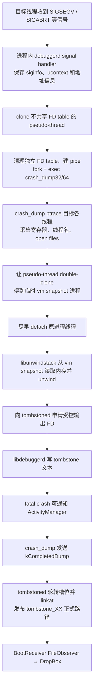

# 103 Android tombstoned、debuggerd 与 Native Crash 生成链

> 源码版本：Android 11（`android-11.0.0_r48`）  
> 本章目标：从进程收到致命信号开始，追踪 bionic debuggerd handler、`crash_dump32/64`、ptrace、地址空间快照、libunwindstack、tombstoned 文件轮转、ActivityManager 通知与 BootReceiver/DropBox 后续收集。  
> 环境：macOS 只读源码；不要求编译、制造崩溃或连接设备。

---

## 1. 先建立正确认识

Native crash 不是“内核自动生成一个 tombstone 文件”。Android 11 把高风险的信号捕获、跨进程取证、报告生成和文件管理拆给不同组件。先记住职责边界，后面的 fork、ptrace 和 FD 传递才不会混在一起：

| 组件 | 主要职责 | 它不负责什么 |
|---|---|---|
| 崩溃进程内的 `libdebuggerd_handler` | 注册 fatal signal handler；在 async-signal-safe 约束下保存 `siginfo/ucontext`；派生 pseudo-thread 和 `crash_dump32/64` | 不在 signal handler 中做完整 unwind，也不直接创建 `/data/tombstones/tombstone_XX` |
| `crash_dump32/64` | ptrace 目标线程、采集寄存器和 `/proc` 信息、建立地址空间快照；调用 libunwindstack/libdebuggerd 生成报告 | 不决定正式文件名、轮转槽位和保留数量 |
| libunwindstack + libdebuggerd | 从寄存器、maps、远端内存和 ELF unwind 信息恢复调用栈，并把证据组织成文本 | 它们是库，不是常驻守护进程，也不管理目录 |
| `tombstoned` | 排队和限制并发；创建受控输出 FD；在 completed 后轮转并发布正式路径；支持 intercept | 不 ptrace 崩溃进程，也不解释寄存器和调用栈 |
| ActivityManager / BootReceiver / DropBox | 在报告生成后做进程错误处置、二次采集与留存 | 不是 native tombstone 的生成者 |

日常口语中的“debuggerd”可能指整套机制，也可能专指 `/system/bin/debuggerd` 主动抓栈命令。本章读源码时会写出具体对象，避免把命令行客户端、进程内 handler 和 `crash_dump` 混为一谈。

---

## 2. 本章源码地图

```text
system/core/debuggerd/handler/debuggerd_handler.cpp
system/core/debuggerd/crash_dump.cpp
system/core/debuggerd/tombstoned/tombstoned.cpp
system/core/debuggerd/tombstoned/tombstoned_client.cpp
system/core/debuggerd/tombstoned/intercept_manager.cpp
system/core/debuggerd/tombstoned/tombstoned.rc
system/core/debuggerd/protocol.h
system/core/debuggerd/common/include/dump_type.h
system/core/debuggerd/libdebuggerd/tombstone.cpp
system/core/debuggerd/libdebuggerd/backtrace.cpp
system/core/debuggerd/libdebuggerd/open_files_list.cpp
system/core/debuggerd/libdebuggerd/utility.cpp
system/core/debuggerd/client/debuggerd_client.cpp
frameworks/base/core/java/com/android/server/BootReceiver.java
frameworks/base/services/core/java/com/android/server/am/ActivityManagerService.java
```

Android 11 的 tombstoned 位于 `system/core/debuggerd/tombstoned/`，不是单独的 `system/core/tombstoned/`。

---

## 3. 全链路总图



图里有两个容易混淆的完成点：报告文本写完后，ActivityManager 才可能收到 native crash 摘要；而正式 `tombstone_XX` 路径要等 `kCompletedDump` 后由 tombstoned 发布。二者不是同一个回调，也没有彼此等待完成的承诺。

---

## 4. 哪些信号会进入链路

典型致命信号包括：

```text
SIGSEGV：非法内存访问
SIGABRT：主动 abort，常见于 CHECK/fatal/assert
SIGBUS：总线/映射访问错误
SIGILL：非法指令
SIGFPE：算术异常
SIGTRAP：陷阱
```

此外 bionic 保留的 `BIONIC_SIGNAL_DEBUGGER` 可请求非致命 dump。它与真正 fatal signal 共用大量基础设施，但最终是否杀死进程不同。

---

## 5. handler 是何时注册的

`debuggerd_init()` 分配专用 pseudo-thread stack，配置 guard page，并通过 `debuggerd_register_handlers()` 安装 `SA_SIGINFO` handler。

```text
进程正常初始化阶段：预先准备 handler 和 stack
进程崩溃阶段：使用已准备资源
```

不能等 heap 已损坏、锁状态未知时再临时做复杂初始化。

---

## 6. 为什么 signal handler 受到严格限制

崩溃可能发生在：

- malloc 内部且 allocator 锁已持有。
- libc I/O 正在修改内部状态。
- 任意 pthread mutex 临界区。
- 栈或 heap 已损坏。
- FD 已耗尽。

因此 handler 尽量使用 syscall、`async_safe_*` 和预分配资源。普通日志、分配内存、`pthread_create()` 等可能再次死锁或崩溃。

---

## 7. 第一份证据先写 logcat

`log_signal_summary()` 使用 async-safe logging 输出类似：

```text
Fatal signal 11 (SIGSEGV), code 1 (SEGV_MAPERR),
fault addr ... in tid ... (...), pid ... (...)
```

源码注释说明：即使后续无法联系 debuggerd，至少 log buffer 中还有信号摘要。

这份摘要不是完整 tombstone，只是降级证据。

---

## 8. `siginfo_t` 告诉我们什么

可能包括：

```text
si_signo：信号编号
si_code：内核产生、用户发送、地址未映射等子原因
si_addr：部分信号的 fault address
si_pid/si_uid：人工发送信号时的发送方
si_value：debuggerd 请求中的附加值
```

不是所有信号都有合法 `si_addr`，源码通过 `signal_has_si_addr()` 判断，不能无条件解释该字段。

---

## 9. ucontext 保存崩溃瞬间寄存器

signal handler 的第三个参数包含 `ucontext_t`。它记录崩溃线程在信号交付时的 PC、SP 和通用寄存器。

crash_dump 后续从 pipe 读取并转换为 `unwindstack::Regs`。若只在 attach 后重新读取寄存器，看到的可能已经是 handler 内部位置，而非原始 fault 位置。

---

## 10. Abort message 从哪里来

对于 fatal signal，bionic callback 可返回 abort message 地址，例如 `android_set_abort_message()` 保存的 CHECK/fatal 文本。

handler 不在危险上下文里直接完整解引用打印，而把地址交给 crash_dump；后者从目标地址空间快照读取并验证长度。

所以 tombstone 中：

```text
Abort message: '...'
```

是辅助解释，不替代 signal/code/backtrace。

---

## 11. crash mutex 的作用

```cpp
static pthread_mutex_t crash_mutex = PTHREAD_MUTEX_INITIALIZER;
```

只允许一个线程处理崩溃。多线程因同一内存破坏几乎同时收到 fatal signal 时，若同时派生多个 dumper，会互相 ptrace、争抢资源并生成混乱报告。

fatal 路径最终不主动 unlock，避免进程死亡前另一个崩溃线程又开始 dump。

---

## 12. 为什么不用普通 pthread_create

源码用 `clone()` 创建 pseudo-thread，并特意不带 `CLONE_FILES`：

```text
共享地址空间、信号处理和线程组
不共享文件描述符表
```

这样 pseudo-thread 可关闭 0～1023 FD，腾出资源，而不影响原进程的 FD table。

它不是普通 POSIX 线程；TLS 也可能共享，代码必须极度克制。

---

## 13. pseudo-thread 解决 FD exhaustion

若进程因为 FD 泄漏崩溃，普通 handler 再 `pipe/socket/open` 可能全部收到 `EMFILE`。

pseudo-thread 拥有独立 FD table，先直接 syscall close 大量 FD，再打开 `/dev/null` 和两组 pipe，使 crash dump 链仍有机会工作。

诊断系统必须能在“正是资源耗尽导致故障”时继续取证。

---

## 14. CrashInfo 协议

handler 用 `writev()` 一次写入版本 3 数据：

```text
version
siginfo_t
ucontext_t
abort message address
fdsan table address
GWP-ASan allocator state address
GWP-ASan metadata address
```

crash_dump 的 `ReadCrashInfo()` 支持 v1/v2/v3，并按版本期望精确大小。这是同一系统镜像内部的私有版本化协议。

---

## 15. 为什么用 pipe 而不是普通对象共享

接下来会 `exec` crash_dump，exec 后原 C++ 对象和地址布局不再存在。pipe 提供清晰的字节协议和生命周期。

两组 pipe 分工：

```text
CrashInfo 数据：pseudo-thread → crash_dump stdin
握手/完成：crash_dump stdout → pseudo-thread
```

名称不能代替方向，阅读时要跟 `dup2()`。

---

## 16. fork 后 exec 哪个程序

编译位数决定：

```text
/system/bin/crash_dump32
/system/bin/crash_dump64
```

参数为：

```text
crashing tid
pseudothread tid
dump type
```

代码直接使用 clone/fork 与 `execle()`，避免 `pthread_atfork` handler 在已损坏的多线程进程里执行。

---

## 17. dump type 不只有 tombstone

Android 11 定义至少包含：

```text
kDebuggerdTombstone
kDebuggerdNativeBacktrace
kDebuggerdJavaBacktrace
kDebuggerdAnyIntercept
```

fatal signal 通常生成 tombstone；显式 debuggerd 请求可只输出 native backtrace。Java trace 也可借 tombstoned 管理文件，但生产链不同。

---

## 18. crash_dump 先解除自己的 handler

`DefuseSignalHandlers()` 把 fatal handlers 设为默认，避免 crash_dump 自己崩溃时递归尝试 dump 自己。

tombstoned 也安装简单 handler，fatal 时直接 `_exit(1)`。诊断基础设施必须防止无限递归。

---

## 19. 为什么 crash_dump 要 reparent 给 init

crash_dump 内部再次 fork，使真正工作进程由 init 收养。这样原 signal handler/pseudo-thread 可以 wait 合适的子进程关系，避免 zombie，并协调原进程退出。

这部分进程树较绕，画图比背代码更有效：

```text
target process
 ├─ pseudo-thread
 └─ crash_dump intermediate
      └─ crash_dump worker（reparent → init）
```

不要把所有 fork/clone 出来的 PID 都叫“crash_dump”。

---

## 20. 30 秒 alarm

crash_dump 设置：

```cpp
alarm(30);
```

多线程和 minidebug-info unwind 可能较慢，因此不能过短；但也不能无限挂住崩溃进程和系统资源。

这是整段辅助程序的故障保险，不代表每个子步骤各有 30 秒预算。

---

## 21. 为什么先枚举 open files

```cpp
populate_open_files_list(&open_files, g_target_thread);
```

在目标进程仍存在、`/proc/<pid>/fd` 仍可访问时先收集 FD 列表。随后原进程可能退出，晚读会丢失信息。

fdsan table 地址还能帮助解释 FD 所有权错误。

---

## 22. 获取线程列表

`GetProcessTids()` 枚举 `/proc/<pid>/task`。crash_dump 对每个线程：

```text
PTRACE_SEIZE
确认 tid 仍属于目标 pid
PTRACE_INTERRUPT
waitpid 等待 stop
读取线程名、寄存器、信号信息
```

线程可并发退出，因此非崩溃线程 attach 失败多为 warning；目标崩溃线程失败则是 fatal。

---

## 23. PID/TID 复用防护

attach 后调用 `pid_contains_tid()`，通过目标进程已打开的 `/proc/<pid>/task/<tid>` 检查线程仍属于该进程。

这是为了防止竞态中 tid 退出并被别的进程复用，导致 ptrace 错对象。

仅持有整数 PID/TID 不构成稳定身份。

---

## 24. `PTRACE_SEIZE` 与 `PTRACE_INTERRUPT`

`PTRACE_SEIZE` 建立追踪关系但不像传统 attach 立刻发送 SIGSTOP；随后显式 `PTRACE_INTERRUPT`，再等待 ptrace stop。

这样控制更清楚，并能区分目标原本收到的信号和 debugger 产生的 stop。

ptrace 权限还受 dumpable、capability、Yama 和 SELinux 共同影响。

---

## 25. handler 为什么临时设置 dumpable

崩溃进程调用：

```text
PR_GET_DUMPABLE
PR_SET_DUMPABLE = 1
PR_SET_PTRACER_ANY（内核支持时）
```

为 crash_dump 打开必要 ptrace 窗口，结束后恢复原值。

这不是让任意应用永久可调试；窗口、辅助进程能力和 SELinux 策略共同限定访问。

---

## 26. capability 为什么要传给 crash_dump

pseudo-thread 子进程把 permitted capability 提升到 inheritable/ambient，使 exec 后的 crash_dump 保留必要能力完成 ptrace。

抓取所需信息后 crash_dump 调用 `drop_capabilities()`，缩短高权限持续时间。

最小权限不仅是“有什么权”，还包括“持有多久”。

---

## 27. 地址空间快照是本章难点

目标线程被 ptrace stop 后，crash_dump 让 pseudo-thread double-clone 出一个共享原始地址空间视图的 vm process。

随后：

```text
寄存器/线程信息已抓取
原目标线程尽早 detach/恢复或退出
耗时 unwind 从 vm snapshot 读取内存
```

目的是减少原进程所有线程被冻结的时长。

---

## 28. 快照不是 core dump 文件

vm process 是一个临时进程级地址空间副本，供 crash_dump 用 `process_vm_readv`/unwindstack 等读取。

它不是写到磁盘的 ELF core，也不是永久快照；crash_dump 完成后相关临时进程退出。

tombstone 只保存精选文本，而非完整进程内存。

---

## 29. 为什么 double-clone

第一层 clone 再创建 orphan，并由合适父进程关系配合 ptrace/wait。源码还用 `setsid()` 避免停止 job 与进程组退出触发 SIGHUP 的内核行为问题。

这些步骤主要解决 Linux 进程关系和 ptrace 生命周期，不是为了业务并行。

阅读此处应追“谁 wait 谁、谁 ptrace 谁、谁共享什么”，而不是只数 fork 次数。

---

## 30. 原进程何时恢复

抓取每个线程的寄存器后，crash_dump 对已附加线程执行 `PTRACE_DETACH`：

```text
非致命 debugger 请求 → resume signal 0，继续运行
fatal crash → detach 时注入该线程原先记录的 fatal signal
wait_for_gdb → 先 SIGSTOP 供调试器附加
```

fatal 进程不是在 handler 一进入就立即消失；它会配合取证，最后以原信号终止。

---

## 31. 为什么重新发送原信号

这里有两个相邻但不能混成一步的动作：

1. `crash_dump` 在 `PTRACE_DETACH` 时把记录到的 fatal signal 作为 resume signal 注入目标线程；源码注释称这是为了保留正确的 signal exit status。
2. 进程内 handler 等待 dump 流程后，将该信号的 disposition 改回 `SIG_DFL`，再由 `resend_signal()` 调用 `rt_tgsigqueueinfo` 重新排队。

标准信号可能合并；这里不应理解为“必然连续终止两次”。关键是 handler 退出前恢复默认处置，并让父进程最终观察到真实 fatal signal，而不是辅助流程的普通退出码。

这样父进程的 `waitpid()`、shell 和 ActivityManager 能看到真实的 `SIGSEGV`/`SIGABRT` 退出原因，而不是辅助流程产生的 SIGKILL 或普通 exit code。

正确终止语义也是诊断证据的一部分。

---

## 32. fatal 与 requested dump

```text
fatal signal：生成报告后目标进程终止
BIONIC_SIGNAL_DEBUGGER：请求 tombstone/backtrace，通常目标继续运行
```

两者都可能使用 ptrace/unwind/tombstoned，但生命周期和 resume signal 不同。

“有 tombstone”不必然说明进程已经 fatal crash，也可能是显式 dump 请求；要看 signal 和 dump type。

---

## 33. tombstoned 何时启动

`tombstoned.rc`：

```rc
service tombstoned /system/bin/tombstoned
    user tombstoned
    group system
    ...

on post-fs-data
    start tombstoned
```

它需要 `/data` 就绪后管理 tombstone 文件，因此在 `post-fs-data` 启动。

---

## 34. 三个 init socket

```text
tombstoned_crash：native crash/dump 输出协商
tombstoned_intercept：调试工具拦截某 PID dump
tombstoned_java_trace：Java trace 文件协商
```

socket 由 init 创建并传给 tombstoned。文件 mode 为 0666 不代表没有安全边界，仍有 SO_PEERCRED、协议验证和 SELinux socket 权限。

---

## 35. tombstoned 是 event loop

它使用 libevent：

```text
accept crash socket
读取固定大小 request packet
校验 dump type/PID 来源
排队或立即 perform_request
等待 completed packet/timeout
提交文件并处理下一项
```

它不是每次 crash 都 fork 一个保存进程，而是常驻协调者。

---

## 36. Java trace 为什么不信请求 PID

源码注释指出 Java trace 请求来自不可信进程，因此 tombstoned 使用：

```cpp
getsockopt(sockfd, SOL_SOCKET, SO_PEERCRED, ...)
```

取得内核认证的连接方 PID，而不是相信 packet 里的 PID。

跨进程协议中的身份字段必须由可信通道绑定。

---

## 37. CrashQueue 管什么

每类 artifact 队列维护：

```text
目录与文件名前缀
最大保存数量
下一轮转槽位
最大并发 dump 数
当前并发数
等待队列
```

它同时解决磁盘环形保留和昂贵 crash dump 的并发保护。

---

## 38. 文件为什么叫 `tombstone_XX`

`CrashQueue` 在固定编号范围内轮转。启动时扫描槽位，选择不存在的或 mtime 最旧的 artifact 作为下一覆盖目标。

因此编号不是全局递增 crash ID，`tombstone_00` 不一定比 `tombstone_31` 老。

判断时间应看 mtime/内容 header，不能只按文件名排序。

Android 11 基线默认通过 `tombstoned.max_tombstone_count` 读取最大数量，缺省为 32；native tombstone 默认最多 1 个并发 dump。属性可改变保留数量，因此“00～31”是默认布局，不是所有设备不可变的协议。

---

## 39. 并发 dump 为什么要限制

unwind 多线程进程会消耗 CPU、内存、ptrace 资源和 I/O。多个进程同时崩溃若无限并行，可能让系统雪崩更严重。

队列将资源压力有界化，但排队也有代价：目标进程可能等待更久，超时或退出后证据质量下降。

---

## 40. tombstoned 先返回输出 FD

`tombstoned_connect()`：

```text
连接 crash socket
发送 DumpRequest(pid, dump_type)
recvmsg 接收 response + SCM_RIGHTS output FD
给 FD 添加 O_APPEND
```

crash_dump 获得的是由 tombstoned 创建/选择的 FD，而不是自己直接 `open("/data/tombstones/...")`。

这集中控制目录权限、命名和轮转。

---

## 41. O_APPEND 的意义

客户端把输出 FD 设为 `O_APPEND`：

- 确保写入发生在文件末尾。
- 与 SELinux 对 append/write FD 的规则保持一致。
- 允许拦截器或预写内容时继续追加。

O_APPEND 不等于多个复杂报告并发写同一文件就自动有事务性。

---

## 42. 临时 inode 到正式名字

tombstoned 可使用 `O_TMPFILE` 创建无目录名 inode；不支持时使用临时路径。crash_dump 往 FD 写完并通知完成后，tombstoned 才：

```text
选择下一 tombstone_XX
unlink 旧槽位
linkat /proc/self/fd/<fd> → 正式路径
删除 fallback 临时路径
```

正式名字出现代表完成协议走到提交阶段。

---

## 43. 这修正了上一章的疑问

BootReceiver 监听 `/data/tombstones` 的 `CREATE`。对 native tombstone 正常路径，正式 `tombstone_XX` 是在 crash_dump 发送 completed 后由 linkat 创建的，而不是从第一字节开始直接写正式文件。

因此在本章所核对的 Android 11 r48 正常实现中，observer 对 `tombstone_` 前缀看到的 CREATE 对应已完成写入后发布的 inode。即使文件系统不支持 `O_TMPFILE`，写入阶段使用的也是 `.temporaryN`，BootReceiver 的前缀过滤不会把它当正式 tombstone。

这不消除上一章指出的“先扫描已有文件、后安装 observer”窗口；也不能直接替厂商重写过的实现作保证。但基线源码里的主要竞态不是“正式 `tombstone_XX` 从空文件开始慢慢写”。

---

## 44. 完成包是提交边界

crash_dump：

```cpp
close(STDOUT_FILENO);
tombstoned_notify_completion(socket);
```

先关闭输出，再发送 `kCompletedDump`。tombstoned 收到后才发布正式路径。

```text
FD 已取得 ≠ 报告已写完
最后一行已 write ≠ 正式路径已发布
completed 已收 ≈ tombstoned 可以提交
```

---

## 45. tombstoned 有超时

给出 FD 后，tombstoned 将事件改为等待 read/timeout，Android 11 这里为 10 秒。

而 crash_dump 自身有 30 秒 alarm。两个超时属于不同组件和阶段，不能说“生成 tombstone 总超时就是 10 秒”而忽略链路细节。

超时后临时对象清理、队列继续推进，防止一个 dumper 永久占槽。

---

## 46. Intercept 是什么

调试工具可为某 PID、dump type 注册 intercept，并提供自己的输出 FD。匹配时 tombstoned 把 dump 导向拦截者，而非普通轮转文件。

用途包括 `debuggerd` 命令主动抓取并在终端显示。

拦截器断开、超时、类型不匹配都要清理，不能把调试客户端当永久可靠消费者。

---

## 47. native backtrace 为什么写 `/dev/null`

若只是 `kDebuggerdNativeBacktrace` 且未被 interceptor 接收，tombstoned 不生成持久 tombstone，而返回 `/dev/null`。

主动 backtrace 通常期望由请求工具截获输出；没有消费者时不应污染 `/data/tombstones`。

dump type 决定持久化策略。

---

## 48. libunwindstack 做什么

crash_dump 创建：

```cpp
unwindstack::UnwinderFromPid unwinder(256, vm_pid);
```

它结合：

```text
线程寄存器
/proc maps
远端进程内存
ELF unwind 信息
JIT/Dex 调试信息
架构规则
```

逐帧恢复 PC、SP、函数/偏移和 so 映射。

---

## 49. unwind 不是简单读 frame pointer

可能使用 DWARF CFI、ARM exidx、frame pointer、signal frame 修正等信息。优化、缺符号、损坏栈、无 unwind table 都会影响结果。

backtrace 缺帧不等于代码只调用了这些函数；报告是依据可用元数据重建的最佳结果。

---

## 50. 为什么最多 256 帧

`UnwinderFromPid(256, ...)` 给出有界最大帧数，防止损坏栈或循环 unwind 无限输出和耗时。

限制是资源 guardrail，不表示正常调用栈一定小于 256。

分析时看到截断应关注 unwinder error 和帧上限。

---

## 51. `engrave_tombstone()` 的报告结构

典型文本包括：

```text
build fingerprint / revision / ABI
timestamp / pid / tid / uid / process / thread
signal / code / fault address / probable cause
Abort message
registers
backtrace
stack/memory near registers or fault
memory map
其他线程 backtrace
open files / fdsan
GWP-ASan 分配与释放栈（若适用）
```

不同 signal、架构和数据可用性会改变段落。

---

## 52. 崩溃线程与其他线程

主崩溃线程报告最详细：信号、寄存器、cause、memory 等。其他线程通常输出线程信息、寄存器和 backtrace。

根因未必在收到 signal 的线程：其他线程可能先破坏 heap，直到当前线程访问时才触发。因此多线程栈仍有价值。

---

## 53. probable cause 是推断

`dump_probable_cause()` 根据 signal、fault addr、SP 和 maps 推断：

```text
null pointer dereference
stack overflow
execute-only memory read
seccomp prohibited syscall
```

报告里的 `Cause:` 是启发式结论，不是内核给出的绝对根因。应结合指令、寄存器、源码和复现验证。

---

## 54. SIGSEGV code 怎么读

```text
SEGV_MAPERR：地址没有映射
SEGV_ACCERR：地址存在，但访问权限不允许
```

fault addr 很小常提示空指针加偏移；靠近 SP guard region 可能提示栈溢出；但内存破坏可让任何地址看似随机。

不要只凭一行 signal 下结论。

---

## 55. SIGABRT 与 Abort message

SIGABRT 常是进程主动检测到不变量破坏：

```text
CHECK failed
FORTIFY
fdsan
Scudo allocator error
assert
显式 abort()
```

此时崩溃位置常在 libc abort 路径，真正原因主要看 Abort message 和更早日志，而不是把 `abort()` 帧当业务 bug。

---

## 56. GWP-ASan 信息

CrashInfo v3 传递 GWP-ASan state/metadata 地址。若命中采样保护分配，报告可推断：

```text
use-after-free
double free
buffer underflow/overflow
invalid free
allocation stack
deallocation stack
```

它能把“在哪里崩”扩展到“内存何时分配/释放”，但只覆盖被采样保护的分配。

---

## 57. fdsan 信息

fdsan 检测 FD 所有权错误，例如重复 close、错误 owner 关闭。handler 把 fdsan table 地址交给 crash_dump，后者结合 open files 丰富报告。

如果 crash 正由 FD exhaustion 引发，pseudo-thread 的独立 FD table 又保证诊断链仍可能建立 pipe/socket。

机制形成闭环。

---

## 58. open files 的价值

可用于发现：

- FD 泄漏。
- 重复打开设备节点/数据库/socket。
- 意外持有删除文件。
- fdsan owner 信息。
- 崩溃时实际访问资源。

但 FD 列表可能包含敏感路径，访问 tombstone 必须受权限和 SELinux 控制。

---

## 59. memory dump 不是全内存

libdebuggerd 只选择 PC、SP、寄存器值或 fault address 附近的小片段，并检查 maps 可读性。

这在报告大小、隐私和诊断价值间折中。缺少某块 heap 内容不代表 crash dumper 没有远程内存读取能力，而是报告策略未全量输出。

---

## 60. map 与 build id

backtrace 的共享库路径、相对 PC 和 build id 用来匹配正确符号文件。

只拿函数地址而没有同一 build 的 unstripped binary，符号化可能错误。OTA/OEM 差异下，build fingerprint 和 build id 尤其关键。

---

## 61. ActivityManager 通知

fatal dump 完成后，crash_dump 连接：

```text
/data/system/ndebugsocket
```

发送网络字节序 pid、signal 和以 NUL 结尾的摘要文本，等待短 ACK。

ActivityManager 随后进入 native crash 的进程管理、应用错误和 UI/重启策略。

---

## 62. 为什么 system_server crash 不通知 AMS

源码检查的是 `thread_info[target_process].thread_name`：也就是以进程 PID 为 TID 的主线程名。若这个名字为 `system_server`，无论实际崩溃发生在哪个工作线程，都跳过 ActivityManager notify。

因为 AMS 就在 system_server 中，进程已经 native crash；连接自身服务可能等待超时或死锁。system_server 的死亡由 init/zygote/系统重启链处理。

诊断通知必须避免依赖正在崩溃的组件。

---

## 63. notify 超时是有界的

socket send 约 1 秒超时，handshake read 约 3 秒。ACK 读取失败不阻止 crash_dump 结束。

ActivityManager 通知属于后续协调，不应让 tombstone 生成无限等待。

完成 tombstone 与 AMS 已处理 crash 是两个完成点。

---

## 64. BootReceiver 如何接上

上一章的 FileObserver 监听 `/data/tombstones`：

```text
tombstoned completed
 → linkat 正式 tombstone_XX
 → inotify CREATE
 → BootReceiver 截断文本
 → SYSTEM_TOMBSTONE DropBox Entry
 → 若含 system_server，再额外 system_server_native_crash
```

原 tombstone 和 DropBox 副本有各自容量、命名、权限和保留周期。

---

## 65. tombstone 文件与 DropBox Entry

| tombstone | DropBox Entry |
|---|---|
| `/data/tombstones/tombstone_XX` | `/data/system/dropbox/...` |
| tombstoned 生成和轮转 | DropBoxManagerService 管配额 |
| 完整文本（受 dumper 输出限制） | BootReceiver 截断并加上一轮 headers |
| 固定槽位覆盖 | 按时间/tag/空间裁剪 |
| 调试原始证据 | Framework 统一查询/通知入口 |

二者不是同一个文件的硬链接。

---

## 66. `debuggerd` 命令与自动 crash

`/system/bin/debuggerd <pid>` 通过 `libdebuggerd_client` 发送保留信号请求目标进程 dump，并向 tombstoned 注册 intercept 获取输出。

自动 fatal crash 则由目标进程 signal handler 自发启动 crash_dump。

两者最终共用很多代码，但触发者、目标是否死亡和输出去向不同。

---

## 67. Java ANR traces 不等于 native tombstone

tombstoned 有 `tombstoned_java_trace` socket 和独立 artifact queue，但 Java ANR 线程 dump 的信号、runtime handler 和内容格式不同。

```text
native fatal crash → crash_dump + text tombstone
Java ANR → ART/AMS 请求 Java traces，可由 tombstoned 管文件
```

共用文件协调器不代表生成机制相同。

---

## 68. SELinux 在哪里起作用

至少涉及：

```text
目标进程能否执行 crash_dump
crash_dump 能否 ptrace/read 目标
客户端能否连接 tombstoned socket
tombstoned 能否创建 /data/tombstones 文件
BootReceiver/system_server 能否读取 tombstone
调试工具能否 intercept
```

Linux dumpable/capability 通过不代表 SELinux 自动允许。

---

## 69. 安全设计：目录写权限集中

普通崩溃进程不直接拥有 `/data/tombstones` 写权限。tombstoned 创建 FD，再通过 Unix socket `SCM_RIGHTS` 传给 crash_dump。

客户端拥有可写 FD，不等于拥有目录遍历、任意命名或覆盖其他路径的权限。

Capability-based FD 传递把“写这个对象”与“管理整个目录”分离。

---

## 70. 安全设计：为何验证 Java PID

任何可连 socket 的进程若能声称任意 PID，可能诱导服务覆盖他人 trace、泄漏信息或制造资源攻击。

使用 `SO_PEERCRED` 把 PID 绑定到内核观察到的 socket peer。类似原则也适用于 Binder callingUid 和 netlink credentials。

不要信任协议载荷中的自报身份。

---

## 71. 失败路径一：handler 自身失败

仍可能留下：

```text
async-safe Fatal signal 摘要
父进程 waitpid 的 signal exit status
kernel/SELinux 日志
```

但没有完整 tombstone。排障时看到 Fatal signal 后无 `Tombstone written to`，应检查 FD exhaustion、fork/exec、ptrace、SELinux、tombstoned 和超时。

---

## 72. 失败路径二：ptrace 已被占用

`PTRACE_SEIZE` 返回 EPERM 时，crash_dump 查询 `TracerPid`，日志可指出目标已由哪个 tracer 跟踪。

常见于 gdbserver/调试器已 attach。一个线程通常不能同时由两个 ptracer 任意控制。

这不是简单“权限不足”，要看已有 tracer。

---

## 73. 失败路径三：tombstoned 不可用

crash_dump 连接失败时将输出重定向 `/dev/null`，但仍可执行部分 unwind/AMS notify；初始化 aborter 也尝试向 tombstoned 报告 dumper 自身失败。

logcat 中可能有错误，但没有正式文件。

tombstoned 是持久化协调点，不是 signal 捕获本身。

---

## 74. 失败路径四：unwind 失败

原因可能是：

```text
栈破坏
无 unwind metadata
映射在崩溃期间变化
JIT 元数据不可读
架构/寄存器异常
达到 frame limit
远程内存读取失败
```

仍应分析 signal、registers、maps、abort message 和原始指令附近信息，不能因 backtrace 不完整就放弃。

---

## 75. 失败路径五：completed 未送达

若 crash_dump 写了一部分后崩溃或超时，tombstoned 不会按正常完成协议发布正式槽位，并会清理请求、释放并发额度、处理队列下一项。

因此临时 inode 有内容不代表用户可见 tombstone 已提交。

完成包是显式 commit 信号。

---

## 76. Native crash 时序图

```text
Crashing thread  Pseudo-thread  crash_dump   tombstoned   AMS
      | signal        |             |             |         |
      | handler       |             |             |         |
      | clone-------->|             |             |         |
      |               | fork/exec-->|             |         |
      |               |<-- handshake/ptrace ------|         |
      |<========== threads stopped =|             |         |
      |               | vm clone -->|             |         |
      |<========== detach/resignal ==|             |         |
      |               |             | request FD->|         |
      |               |             |<------FD----|         |
      |               |             | unwind/write|         |
      |               |             | notify--------------->|
      |               |             | completed-->|         |
      |               |             |             | linkat  |
```

双线表示目标线程被暂停的窗口，而耗时文本生成主要从快照读取。

---

## 77. 文件提交时序图

```text
tombstoned                 crash_dump                 BootReceiver
    | create O_TMPFILE/FD      |                           |
    |-------- SCM_RIGHTS ----->|                           |
    |                          | write report              |
    |                          | close output              |
    |<----- kCompletedDump ----|                           |
    | choose oldest slot       |                           |
    | unlink tombstone_XX      |                           |
    | linkat FD → pathname     |                           |
    |----------------------------------------------------->| inotify CREATE
    |                          |                           | copy to DropBox
```

这解释了为什么监听正式路径通常不会读到第一字节刚创建的半成品。

---

## 78. 如何阅读一份 tombstone

建议顺序：

1. 核对 build fingerprint、ABI、时间、pid/tid/process。
2. 看 signal、code、fault addr、Cause 和 Abort message。
3. 看崩溃线程 registers 与前 10～20 帧。
4. 将相对 PC 与同 build 符号对应。
5. 看 memory map 判断地址归属和权限。
6. 看其他线程是否持锁/等待关键资源。
7. 看 open files、fdsan、GWP-ASan 特殊段。
8. 与崩溃前 logcat、DropBox、statsd、kernel log 对齐时间。

不要从几百行报告第一行读到最后一行才开始建立假设。

---

## 79. 符号化需要哪些产物

通常需要同一构建：

```text
未剥离 symbols
正确架构和位数
build id 匹配的 ELF
对应源代码 revision
可能的 linker/JIT 信息
```

仅有源码行号而 binary 不匹配，结果不可靠。ASLR 不妨碍使用相对 PC 和 maps 恢复，但必须正确做地址归一化。

---

## 80. macOS 只读练习一：signal handler

```bash
cd /Users/ninebot/androidSource

rg -n "debuggerd_signal_handler|debuggerd_dispatch_pseudothread|CrashInfo|resend_signal" \
  system/core/debuggerd/handler/debuggerd_handler.cpp

sed -n '300,650p' \
  system/core/debuggerd/handler/debuggerd_handler.cpp
```

画出 crash thread、pseudo-thread 和 crash_dump 三者的 FD table、地址空间及父子关系。

---

## 81. macOS 只读练习二：ptrace 与快照

```bash
cd /Users/ninebot/androidSource

rg -n "PTRACE_SEIZE|PTRACE_INTERRUPT|wait_for_vm_process|GetProcessTids|RemoteGet" \
  system/core/debuggerd/crash_dump.cpp

sed -n '400,570p' system/core/debuggerd/crash_dump.cpp
```

标出原目标线程从 stop 到 detach 的窗口，以及之后 unwind 从哪个 PID 读取内存。

---

## 82. macOS 只读练习三：tombstoned commit

```bash
cd /Users/ninebot/androidSource

rg -n "perform_request|kCompletedDump|linkat|unlink|find_oldest_artifact" \
  system/core/debuggerd/tombstoned/tombstoned.cpp

sed -n '200,520p' \
  system/core/debuggerd/tombstoned/tombstoned.cpp
```

回答：输出 FD 何时创建、正式名字何时出现、旧槽位何时删除、completed 丢失会怎样。

---

## 83. macOS 只读练习四：报告结构

```bash
cd /Users/ninebot/androidSource

rg -n "dump_thread_info|dump_signal_info|dump_probable_cause|dump_abort_message|engrave_tombstone" \
  system/core/debuggerd/libdebuggerd/tombstone.cpp

sed -n '110,250p' \
  system/core/debuggerd/libdebuggerd/tombstone.cpp
```

把每一段报告映射到数据来源：siginfo、ucontext/regs、maps、远程 memory 或 `/proc`。

---

## 84. macOS 只读练习五：后续消费者

```bash
cd /Users/ninebot/androidSource

rg -n "ndebugsocket|activity_manager_notify|Tombstone written to" \
  system/core/debuggerd frameworks/base

rg -n "TOMBSTONE_DIR|SYSTEM_TOMBSTONE|system_server_native_crash" \
  frameworks/base/core/java/com/android/server/BootReceiver.java
```

画出 tombstone 提交后 AMS 与 BootReceiver 两条独立消费支路。

---

## 85. macOS 只读练习六：SELinux

```bash
cd /Users/ninebot/androidSource

rg -n "tombstoned|crash_dump|debuggerd" \
  system/sepolicy/public system/sepolicy/private | head -180

rg -n "/data/tombstones" \
  system/sepolicy system/core/rootdir/init.rc | head -100
```

分别列出 domain、exec type、socket type、data file type 和 ptrace 规则，不要把它们压缩成一句“给 tombstoned 权限”。

---

## 86. 第一遍复盘问题

1. 为什么 signal handler 不能直接 unwind？
2. pseudo-thread 为什么不共享 FD table？
3. CrashInfo 为什么同时传 ucontext 和 abort message 地址？
4. ptrace 后为什么还需要 vm snapshot？
5. tombstoned 为什么传 FD 而不让 crash_dump 直接命名文件？
6. completed packet 与 linkat 各代表什么？
7. fatal dump 与主动 backtrace 如何区别？
8. 为什么 system_server crash 不通知 AMS？
9. BootReceiver 看到 CREATE 时为何通常已完整？
10. tombstone 与 DropBox Entry 为什么会有不同内容和生命周期？

---

## 87. 第二遍复读：易混点一——debuggerd 与 crash_dump

`debuggerd` 是主动请求工具；`libdebuggerd_handler` 在目标进程捕获信号；`crash_dump32/64` 是真正 ptrace/unwind 辅助进程。

日常口语把整套都叫 debuggerd，但读源码时必须分对象。

---

## 88. 易混点二——崩溃线程与崩溃进程

signal 精确送达某个 tid，报告重点是该线程；但进程包含许多线程，crash_dump 会枚举并抓取它们。

PID、crashing TID、main thread TID 可能相同，也可能不同。

---

## 89. 易混点三——fatal signal 到达与进程已死亡

handler 执行、pseudo-thread 协调、ptrace 抓取期间进程仍存在。最终恢复默认 handler 并重发原信号后才按该信号终止。

“收到 SIGSEGV”是死亡流程开始，不是所有资源已经消失。

---

## 90. 易混点四——地址空间快照与线程快照

寄存器/线程信息在 ptrace stop 时逐线程抓取；vm process 保留可供后续读取的地址空间。

它不是让原线程继续在快照中运行，也不是把所有线程复制出来继续调度。

---

## 91. 易混点五——文件 FD 与正式文件名

crash_dump 拿到输出 FD 后就能写，但目录中正式轮转名要等 completed。匿名 inode/临时路径、FD 内容和公开 pathname 是三个状态。

这与数据库的 prepare/write/commit 类似，但不是数据库事务。

---

## 92. 易混点六——tombstone 与 core dump

tombstone 是精选文本诊断报告；core dump 是完整或大范围进程内存/映像转储。Android 默认链路不把整个地址空间持久化成 core 文件。

因此 tombstone 更小、更安全、更易上传，但无法支持任意事后内存检查。

---

## 93. 易混点七——Cause 与根因

`Cause: null pointer dereference` 是根据 fault address/maps 的推断。真正导致指针为空的逻辑可能在更早线程或更早时刻。

Cause 描述直接故障机制，不一定描述业务根因。

---

## 94. 易混点八——文本行与符号真相

函数名和源码行依赖正确符号、build id 和优化信息。inline、tail call、LTO、stripped symbols 会改变呈现。

报告里的地址是原始证据，符号化结果是解释层。

---

## 95. “法医链”类比

```text
fatal signal handler = 第一现场封锁和记录死亡姿态
CrashInfo pipe       = 密封的现场基本信息袋
ptrace               = 暂停现场人员并拍摄姿态
vm snapshot          = 保留现场布局供后续勘验
libunwindstack       = 根据足迹还原行动路线
libdebuggerd         = 撰写尸检报告
tombstoned FD        = 证物部门提供的受控空档案
completed + linkat   = 档案正式入库编号
AMS                  = 事故处置部门
BootReceiver/DropBox = 后续证据汇总与留存
```

法医报告完成不等于事故处置完成；入库编号也不等于 DropBox 已复制。

---

## 96. 本章结论

Android 11 的 Native crash 链把一个极不可靠的时刻拆成多个受控阶段：

```text
signal-safe 捕获：预分配 stack、async-safe log、CrashInfo
资源自救：独立 FD table pseudo-thread
权限取证：临时 dumpable/capability + ptrace
暂停优化：先抓寄存器，再用 vm snapshot 做慢 unwind
报告生成：libunwindstack + libdebuggerd
集中存储：tombstoned FD、并发队列、轮转和 completed commit
系统处置：AMS native crash 通知
长期汇总：BootReceiver → DropBox/stats
```

最重要的阅读方法是不断追问“此刻哪个进程仍活着、哪个线程被停住、数据来自崩溃瞬间还是后来读取、FD 有内容是否已经有正式文件名、报告完成是否已经被 Framework 消费”。

下一章将沿 ActivityManager 的 native crash 接收端，精读 `NativeCrashListener`、`AppErrors` 和应用崩溃处置：tombstone 摘要怎样进入 system_server，怎样关联 ProcessRecord、生成 crash UI、决定杀进程或重启。
