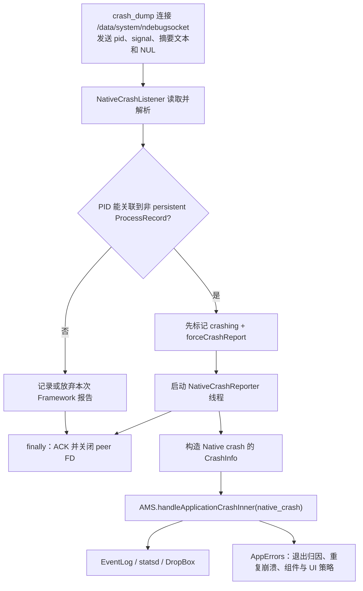

# 104 Android NativeCrashListener、AppErrors 与应用崩溃处置链

> 源码版本：Android 11（`android-11.0.0_r48`）  
> 本章目标：理解 native tombstone 生成后，crash_dump 如何通知 system_server；NativeCrashListener 如何关联 ProcessRecord、构造 CrashInfo；AMS/AppErrors 如何统一记录、限频、清理 Task/Service、决定 UI、重启、强退和错误报告。  
> 环境：macOS 只读源码，不要求编译或制造崩溃。

---

## 1. Tombstone 完成不等于系统处置完成

上一章已经看到三条彼此相邻、但并非严格按下面书写顺序完成的支路：crash_dump 写报告并通知 AMS、tombstoned 在 completed 后发布 `tombstone_XX`、目标进程最终按 fatal signal 退出。特别注意：r48 的 `crash_dump` 是先尝试通知 ActivityManager，之后才关闭输出并向 tombstoned 发送 completed；所以 AMS 处置和正式路径发布可以交错。

Android 还要回答：这是哪个 `ProcessRecord`？它托管哪些 Activity/Service？是否频繁崩溃？要不要显示对话框、重启任务、停止服务、通知安装器、记录退出原因？

这些是 ActivityManager 的职责。

---

## 2. 本章源码地图

```text
frameworks/base/services/core/java/com/android/server/am/NativeCrashListener.java
frameworks/base/services/core/java/com/android/server/am/ActivityManagerService.java
frameworks/base/services/core/java/com/android/server/am/AppErrors.java
frameworks/base/services/core/java/com/android/server/am/ProcessRecord.java
frameworks/base/services/core/java/com/android/server/am/ProcessList.java
frameworks/base/services/core/java/com/android/server/am/AppErrorDialog.java
frameworks/base/services/core/java/com/android/server/am/ActiveServices.java
frameworks/base/services/core/java/com/android/server/am/ActivityManagerConstants.java
frameworks/base/core/java/android/app/ApplicationErrorReport.java
system/core/debuggerd/crash_dump.cpp
```

---

## 3. 全链路总览



Listener 的 ACK 与 reporter 的业务处理并行：ACK 只说明 socket 数据已消费或被放弃，不说明 AppErrors 已执行完。

---

## 4. NativeCrashListener 在什么时候启动

AMS 提供：

```java
public void startObservingNativeCrashes() {
    final NativeCrashListener ncl = new NativeCrashListener(this);
    ncl.start();
}
```

这是一个常驻 Java Thread，不是 Binder 服务、Handler 消息或 BroadcastReceiver。

它只负责 native crash socket；Java exception 由 RuntimeInit 走 Binder `handleApplicationCrash()`。

---

## 5. socket 是谁创建的

NativeCrashListener 自己：

```java
Os.socket(AF_UNIX, SOCK_STREAM, 0);
Os.bind(serverFd,
        UnixSocketAddress.createFileSystem("/data/system/ndebugsocket"));
Os.listen(serverFd, 1);
Os.chmod(path, 0777);
```

启动前会删除旧 socket 文件，避免 system_server 重启后 bind 失败。

这不同于 tombstoned 的 init control socket；不要把两套 Unix socket 生命周期混为一谈。

---

## 6. 0777 为什么不等于任何进程可伪造 crash

源码注释指出 SELinux neverallow/策略只允许 crash_dump 连接。因此：

```text
DAC mode 0777：传统文件权限表面允许
SELinux：按 domain 限制 connect/write
```

服务端因此信任收到的 PID/signal 协议值。

这是 Android 常见的“宽 DAC + 强制访问控制收窄”；仍应核对当前 policy，而不能只读注释。

---

## 7. 线协议很小

crash_dump 发送：

```text
4-byte network-order pid
4-byte network-order signal
UTF-8 report bytes
1-byte NUL terminator
```

NativeCrashListener 的 `unpackInt()` 手动组合 big-endian 四字节，与 native 端 `htonl()` 对应。

这是私有 socket 协议，不是 Java 序列化或 Binder Parcel。

---

## 8. 为什么必须 `readExactly(8)`

SOCK_STREAM 只保证字节顺序，不保证一次 `read()` 正好返回一条消息。8 字节 header 可能分多次到达。

`readExactly()` 循环直到读满、EOF 或超时。把 `read(fd, buf, 8)` 当作永远返回 8 是典型 socket bug。

正文则以 NUL 作为消息终点。

---

## 9. 10 秒 socket timeout

对 accept 后 peer FD 设置：

```text
SO_RCVTIMEO = 10s
SO_SNDTIMEO = 10s
```

防止异常 crash_dump 连上后不发完数据，永久堵住唯一 listener accept 循环。

这是 listener socket 的 I/O 超时，不等于上一章 tombstoned 10 秒 completion timeout，也不等于 crash_dump 30 秒 alarm。

---

## 10. 为什么 ACK 放在 finally

无论协议成功、找不到进程或抛异常，listener 都尝试写 1 字节 ACK 并 close peer。

crash_dump 对 ACK 读取失败也不阻止退出，但尽快 ACK 能解除它的短等待。

```text
ACK = NativeCrashListener 已消费/放弃 socket 数据
ACK ≠ AppErrors 已完成崩溃处置
```

---

## 11. listener 为什么另开 reporter 线程

`AppErrors.crashApplication()` 可能等待 UI 结果，耗时不可预测。如果直接在 listener 执行，期间无法 accept 后续 native crash。

所以：

```text
Listener：快读、关联、标记、spawn、ACK
Reporter：慢的 AMS/AppErrors 策略
```

这与 Binder 快入口/业务 worker 的思想一致。

---

## 12. PID 如何关联 ProcessRecord

```java
synchronized (mAm.mPidsSelfLocked) {
    pr = mAm.mPidsSelfLocked.get(pid);
}
```

`mPidsSelfLocked` 是 AMS 当前 PID → ProcessRecord 表。若目标已经完全清理、PID 不受 AMS 管理或发生竞态，结果为 null，只记录 warning，不进入应用 crash 策略。

PID 是瞬时标识，ProcessRecord 才承载 Framework 业务上下文。

---

## 13. PID 复用风险怎么理解

Listener 查的是“此刻表中该 PID”。在极端情况下旧进程退出、PID 快速复用，单凭整数可能关联错误。

实际链路通过 crash_dump 在目标仍处退出流程时立即通知、AMS 表清理时序和短时间窗口降低风险，但这里没有额外 start-time token。

不能把“查到 PID”描述为密码学强身份。

---

## 14. 为什么跳过 persistent app

```java
if (pr.isPersistent()) return;
```

persistent 进程通常承载关键系统能力，其死亡/重启由更高层系统机制处理；普通应用 crash UI/坏进程抑制不适合直接套用。

特别是 system_server，上一章 crash_dump 已跳过通知 AMS 自己。

“跳过 report”不表示没有 tombstone 或不会被 init 重启。

---

## 15. 正文如何读取

循环每次最多 4096 字节，直到：

```text
最后一个字节为 NUL → 不把 NUL 写入 ByteArrayOutputStream，结束
read > 0 且无 NUL → 累积
read <= 0 → 退出
```

代码只检查 chunk 的最后一字节是否 NUL，协议生产者保证 terminator 位于流尾。

报告大小没有在 Java 侧显式硬上限，主要受 crash_dump 摘要规模、内存和 timeout 约束。

---

## 16. 为什么只发送摘要而不是完整 tombstone

上一章 `engrave_tombstone()` 同时生成完整文件和用于 AMS 的 `amfd_data` 摘要。socket 不必复制所有线程、maps、memory dump。

AMS 需要足够信息做错误报告和 DropBox，不需要为 UI 策略完整解析法医报告。

完整证据仍在 `/data/tombstones`。

---

## 17. 先标记 `crashing`

```java
synchronized (mAm) {
    pr.setCrashing(true);
    pr.forceCrashReport = true;
}
```

源码注释解释：目标进程会在允许 debuggerd 继续后消失，但 Framework 的 cleanup 需要知道 native report 仍在提交。

`forceCrashReport` 使稍后即使常规 crashing 状态变化，仍能生成 `ApplicationErrorReport`。

---

## 18. 为什么状态设置要在 spawn reporter 前

若先启动线程，再标记状态，reporter 可能抢先进入 `createAppErrorReportLocked()`，看到既非 crashing、也非 forceCrashReport 而返回 null。

```text
先提交共享状态
再发布异步工作
```

是跨线程 happens-before 设计的基本顺序。

---

## 19. NativeCrashReporter 构造 CrashInfo

```java
ci.exceptionClassName = "Native crash";
ci.exceptionMessage = Os.strsignal(mSignal);
ci.throwFileName = "unknown";
ci.throwClassName = "unknown";
ci.throwMethodName = "unknown";
ci.stackTrace = mCrashReport;
```

Java CrashInfo 字段本来面向异常；native crash 没有 Java throw class/method，所以使用占位值，把 debuggerd 摘要装入 `stackTrace`。

数据模型复用不代表 native crash 真有 Java exception。

---

## 20. native 与 Java crash 在哪里汇合

```java
mAm.handleApplicationCrashInner(
        "native_crash", mApp, mApp.processName, ci);
```

Java exception 则由：

```text
RuntimeInit / app thread
 → AMS.handleApplicationCrash(...)
 → handleApplicationCrashInner("crash", ...)
```

从 inner 方法开始，共用 EventLog、statsd、DropBox 和 AppErrors 策略。

---

## 21. EventLog 记录什么

`EventLogTags.writeAmCrash()` 包括：

```text
calling pid/user
process name
应用 flags
exception class/message
throw file/line
```

native reporter 线程运行在 system_server，所以 Binder callingPid/Uid 不再是崩溃应用身份；真实 app 信息主要来自 `ProcessRecord`。

读 EventLog 字段时必须知道调用路径。

---

## 22. APP_CRASH_OCCURRED Atom

写入维度包括：

```text
eventType = native_crash / crash
process/package
instant app 状态
foreground/background/unknown
process class（system_server、普通应用等）
```

它用于总体崩溃统计；原始 stack trace 不应作为高基数 Atom 字段。

DropBox 与 statsd 再次承担不同职责。

---

## 23. relaunch reason

AMS 从 WindowProcessController 计算重启/重建原因，并附加到 `crashInfo.crashTag`。

这帮助区分应用自然执行中的 crash，与配置变化、窗口 resize relaunch 等上下文。

后续 AppErrors 对 free-resize relaunch crash 有专门 UI 抑制分支。

---

## 24. addErrorToDropBox

AMS 以 `eventType`、ProcessRecord、processName 和 CrashInfo 生成 Framework 统一错误条目。

对于 native crash，这与 BootReceiver 复制完整 tombstone 是两条可能同时存在的 DropBox 数据：

```text
native_crash：AMS 业务上下文 + debuggerd 摘要
SYSTEM_TOMBSTONE：BootReceiver 截断原 tombstone 文件
```

二者 tag、时机和内容不同，不是无意义重复。

---

## 25. AppErrors 的职责

`AppErrors` 并非只显示对话框。它负责：

- crash/ANR 错误状态。
- 快速重复崩溃历史。
- bad process 标记。
- service crash 计数与重试。
- Activity/Task 清理。
- ActivityController/instrumentation 特例。
- crash UI 决策与结果处理。
- ApplicationErrorReport。
- PackageWatchdog、BatteryStats、exit reason 协作。

UI 只是策略链的一个出口。

---

## 26. `crashApplication()` 为什么清 CallingIdentity

方法先保存 Binder callingPid/Uid，再：

```java
long origId = Binder.clearCallingIdentity();
try {
    crashApplicationInner(..., callingPid, callingUid);
} finally {
    Binder.restoreCallingIdentity(origId);
}
```

后续代表 system_server 操作 Activity、Settings、Package 等，不应继承崩溃 App 的 Binder 权限身份。

native reporter 本就不是 App Binder 线程，但共用方法仍保持统一模式。

---

## 27. 三种时间

```text
timeMillis = System.currentTimeMillis()：错误报告给人看的时间
now = SystemClock.uptimeMillis()：快速重复 crash 间隔
tombstone timestamp：native 报告生成时间
```

重复 crash 限频必须使用单调 uptime，避免用户调时绕过或误触发。

ApplicationErrorReport 则需要 wall time 供外部报告展示。

---

## 28. PackageWatchdog 接收 crash

非空 ProcessRecord：

```java
mPackageWatchdog.onPackageFailure(
    packageList, FAILURE_REASON_APP_CRASH);
```

这把单次 crash 提供给跨时间健康观察/回滚决策。AppErrors 自己处理当前进程；PackageWatchdog 处理重复包失败的系统恢复可能性。

一次 crash 通常不会立即触发回滚。

---

## 29. ApplicationExitInfo 原因

`noteAppKill()` 根据 CrashInfo：

```text
"Native crash" → REASON_CRASH_NATIVE
其他 crash      → REASON_CRASH
```

这使后来查询历史退出原因时能区分 native 与 Java。

判断依赖 `exceptionClassName` 的约定字符串，说明共享数据模型存在隐式协议。

---

## 30. ActivityController 优先拦截

测试/调试控制器可观察 crash 并决定是否由标准 UI 处理。若 controller 已处理，方法提前返回。

userdebug 场景下，对 native crash 可按属性/测试逻辑跳过杀进程，便于调试器分析。

生产策略不能假定每个 crash 都必经对话框。

---

## 31. free resize relaunch 特例

若 crash 发生在 free resize 引发的 relaunch 中，源码抑制普通 crash dialog。

窗口配置重建中的瞬时错误若弹出用户对话框可能造成糟糕体验；但遥测/DropBox 已在更早步骤记录。

“不显示 UI”不等于“不记录 crash”。

---

## 32. instrumentation 特例

进程正在 instrumentation 时，崩溃由测试框架/`handleAppDiedLocked` 处理，AppErrors 不走普通用户 UI。

否则自动化测试会被系统对话框卡住，且结果归属可能重复。

测试运行态也是进程策略的重要输入。

---

## 33. BatteryStats

对有效 ProcessRecord 调用：

```java
mBatteryStatsService.noteProcessCrash(processName, uid);
```

这不是估算 crash 本身耗了多少电，而是把进程 crash 事件计入对应 UID/进程统计历史。

同一事件可同时进入 EventLog、statsd、DropBox、BatteryStats 和 PackageWatchdog，各自语义不同。

---

## 34. `makeAppCrashingLocked()`

核心动作：

```text
app.setCrashing(true)
生成 ProcessErrorStateInfo.CRASHED
startAppProblemLocked：确定 error report receiver 等
停止冻结 Activity
handleAppCrashLocked：频率/组件/Task 策略
```

成功返回表示可以继续构造 UI 数据，不表示用户已看到对话框。

---

## 35. ProcessErrorStateInfo 与 CrashInfo

```text
CrashInfo：异常/信号、message、stack 等本次 crash 内容
ProcessErrorStateInfo：进程当前错误状态，供 ActivityManager 查询
```

后者包含 processName、pid、uid、condition、short/long message 和 stack。

一个是事件载荷，一个是 Framework 进程状态快照。

---

## 36. service crashCount

遍历崩溃进程中运行的 ServiceRecord：

```text
距离上次 restart 超过 MIN_CRASH_INTERVAL → crashCount = 1
否则 crashCount++
```

前台服务或 bound-foreground service 在未超过 `BOUND_SERVICE_MAX_CRASH_RETRY` 时允许 `tryAgain`。

服务重启策略不是仅看应用进程 crash 次数，还看服务角色和自身计数。

---

## 37. 两张 crash time 表

```text
mProcessCrashTimes
mProcessCrashTimesPersistent
```

前者可在某些清理场景移除；后者用于判断 UI 是否为 repeating crash。两者都以 processName + uid 关联 uptime。

名称中的 persistent 指 crash 时间记录持续性，不是 `ProcessRecord.isPersistent()`。

---

## 38. isolated process 为什么不记 crash time

isolated UID 没有跨进程重启的稳定身份，源码注释明确无法持久关联。

因此：

```text
不加入 crash time 表
不能按 processName+uid 标记长期 bad process
```

这不是 isolated crash 不重要，而是缺少可靠键。

---

## 39. 快速重复 crash 判定

```java
crashTime != null
&& now < crashTime + ProcessList.MIN_CRASH_INTERVAL
```

命中意味着该 processName/uid 在短窗口内再次崩溃。系统倾向于停止自动拉起，避免 crash loop 消耗 CPU、闪烁 UI 和阻塞用户。

具体窗口值应追当前 `ProcessList`，不要从本章文字记死。

---

## 40. bad process

非 persistent、非 isolated 的快速重复 crash 进程会：

```text
写 AM_PROC_BAD EventLog
复制更新 mBadProcesses
app.bad = true
app.removed = true
移除进程，默认禁止服务继续无休止重启
```

bad 的 key 是 processName + uid，不等于整个 package 永久禁用。

---

## 41. mBadProcesses 为什么 copy-on-write

字段是 volatile，注释要求修改时克隆旧 `ProcessMap`、更新副本，再替换 live reference。

这样某些无锁读者可获取稳定快照，不与原对象原地修改竞态。

这不是 Java 标准不可变集合，而是代码约定，写路径必须遵守。

---

## 42. persistent process 的不同策略

persistent 进程即使快速重复 crash，也不能简单标 bad 后永不启动，因为系统核心能力依赖它。

源码警告“badness for everyone”：它仍可能被重启，导致更高层 Watchdog/RescueParty/boot loop 机制介入。

应用级 crash 抑制与系统级自愈是不同层。

---

## 43. `tryAgain` 的意义

前台/绑定前台服务在有限次数内允许重启。`removeProcessLocked(..., tryAgain, ...)` 的 callerAllowsRestart 影响后续 service bring-up。

并非“进程是 bad 就所有组件永远停掉”；关键前台服务有有限恢复窗口。

恢复能力和 crash-loop 防护需要平衡。

---

## 44. Activity/Task 清理

非快速重复分支调用：

```java
finishTopCrashedActivities(windowProcessController, reason)
```

返回受影响 taskId，供用户选择 Restart 时从 Recents 重新启动。

崩溃处置跨 AMS 与 ATMS/WMS，不只是 kill Linux PID。

---

## 45. 第三方 Home 反复 crash

若崩溃进程是当前 home、包含 Activity 且不是系统 App，源码清除相关 Home preferred activities。

目的：第三方 Launcher 持续崩溃时，用户仍有机会回到可用 Home，而不是被默认选择锁死。

这是 crash 策略中的系统可恢复性细节。

---

## 46. crashHandler

若 ProcessRecord 配置了 `crashHandler`，AppErrors 将其 post 到 AMS Handler。

不在锁内直接运行任意 callback，避免锁重入和慢工作。

它是内部钩子，不等于 App 收到自己的 crash callback。

---

## 47. UI 通过 UiHandler

在 AMS 锁内只构造 `AppErrorDialog.Data`，然后：

```java
mService.mUiHandler.sendMessage(SHOW_ERROR_UI_MSG, data)
```

真正窗口操作在 UI Handler，避免在 NativeCrashReporter 或 AMS 锁内直接创建 dialog。

线程切换后，原 ProcessRecord 状态可能变化，UI 端必须重新检查。

---

## 48. `AppErrorResult.get()` 为什么可能阻塞

Reporter 线程发送 UI 消息后调用 `result.get()` 等待用户/策略结果。

这正是 listener 必须另开 reporter 的原因：对话框可能存在几十秒，listener 仍要 ACK 并接收下一个 crash。

阻塞不是天然错误，前提是发生在专用、可承受的线程，并有 UI timeout/default 结果。

---

## 49. UI 端先防重复 dialog

若 `ErrorDialogController` 已有 crash dialog：

```text
不再显示第二个
result = ALREADY_SHOWING
```

防止并发 reporter 或同进程重复 crash 叠加窗口。

业务去重和 crash time 限频之外，展示层还有独立幂等防护。

---

## 50. background user 默认不弹

UI 判断进程 userId 是否属于当前 profile。后台用户且未开启 `ANR_SHOW_BACKGROUND` 时：

```text
跳过 dialog
result = BACKGROUND_USER
```

设备级日志仍保留，但不打扰当前用户。多用户边界影响 UI，不代表后台用户 crash 不处理。

本版本的 `ErrorDialogController` 是 `ProcessRecord` 的内部类，不是独立的 `ErrorDialogController.java`。沿类名查找不到文件时，应使用 `rg "class ErrorDialogController"` 回到真实声明，而不是根据较新版本目录猜路径。

---

## 51. 首次 crash 对话框开关

展示条件组合：

```text
系统当前允许 error dialog，或允许后台显示
package 未被 mute
距离上次显示不太近
全局/开发者开启首次 crash dialog，或这是 repeating crash
```

Android 版本和产品配置不同，现代设备常不为每次首次 crash 弹窗。

不要把“App 崩溃必弹已停止运行”当固定 Framework 规则。

---

## 52. Dialog 展示也限频

`mProcessCrashShowDialogTimes` 与 crash occurrence time 分开。

```text
crash 限频：决定进程/组件恢复和 bad 状态
dialog 限频：决定是否再次打扰用户
```

同一时间窗口常量可复用，但两张表的策略目的不同。

---

## 53. 不能显示时默认什么

设备休眠、UI 环境不允许或条件不满足时：

```text
result = CANT_SHOW
```

随后 `TIMEOUT`/`CANCEL` 会归一为 FORCE_QUIT；`CANT_SHOW` 也走相应无 UI 清理路径。

系统不能因为没有交互界面就无限等待用户选择。

---

## 54. 用户动作矩阵

| 结果 | 主要行为 |
|---|---|
| FORCE_QUIT | 清理 Task/进程，恢复 top Activity |
| RESTART | 移除旧进程，并用 taskId 从 Recents 重启 |
| FORCE_QUIT_AND_REPORT | 创建 ACTION_APP_ERROR 给 errorReportReceiver |
| APP_INFO | 打开应用详情设置 |
| MUTE | 将 package 加入不再报告集合 |
| TIMEOUT/CANCEL | 转为 FORCE_QUIT |

最终行为还受 persistent、Task 是否存在、receiver 是否可用等条件影响。

---

## 55. Force Quit 不只是 kill

```text
ATMS onHandleAppCrash：清理 Activity/窗口状态
非 persistent：ProcessList.removeProcessLocked
ATMS resumeTopActivities
```

仅 `kill(pid)` 会留下 Task、Service、provider、OOM 依赖和窗口 bookkeeping 不一致。

Framework 处置必须先维护模型，再由底层进程清理完成死亡。

---

## 56. Restart 的含义

Restart 不是恢复原 Linux 进程指令流。它：

```text
移除崩溃进程
若有 affected taskId
startActivityFromRecents(taskId)
```

应用会新建进程并重新创建 Activity。未持久化内存状态无法恢复。

“重启 App”是组件级重新启动，不是进程 checkpoint/restore。

---

## 57. Force Quit and Report

`createAppErrorReportLocked()` 构造 `ApplicationErrorReport`，再发送：

```text
Intent.ACTION_APP_ERROR
component = errorReportReceiver
EXTRA_BUG_REPORT = report
```

receiver 通常由安装来源/系统配置决定。没有合法 receiver 就无法生成 Intent。

报告可能含 stack，涉及隐私和跨包授权。

---

## 58. `forceCrashReport` 的落点

创建错误报告的条件：

```java
r.isCrashing() || r.isNotResponding() || r.forceCrashReport
```

NativeCrashListener 提前置 `forceCrashReport=true`，正是为了目标进程已退出/清理竞态下仍允许构造 TYPE_CRASH 报告。

它不表示强制显示 dialog。

---

## 59. Mute 的范围

```java
mAppsNotReportingCrashes.add(proc.info.packageName);
```

当前 system_server 进程内按 package 抑制后续 crash dialog。它不是卸载 App、关闭 stats/DropBox，也未在这里持久化到磁盘。

system_server 重启后的行为需看是否有其他持久来源；仅此集合本身不会跨重启。

---

## 60. crash time 何时更新

`handleAppCrashLocked()` 在末尾将当前 uptime 放入普通和 persistent crash time 表；UI 结果处理后，非 isolated 且不是 Restart 也可能更新相关记录。

读这类状态机要注意多条写路径，不能只搜索一次 `put()` 就断言全部语义。

---

## 61. 重复 crash 时间线

```text
t0：首次 crash
 → finish top crashed Activity
 → 记录 crashTime
 → 条件允许时显示 dialog

t1 < t0 + MIN_CRASH_INTERVAL：再次 crash
 → AM_PROCESS_CRASHED_TOO_MUCH
 → 非 persistent 标 bad/remove
 → service 是否 tryAgain 单独判断
 → 背景 dialog 可能完全不显示
```

用户是否看到 UI 不是 crash-loop 判定的前提。

---

## 62. native 进程已经会死，为何还要 removeProcess

Linux 进程死亡只释放内核资源。AMS 还维护：

```text
ProcessRecord/PID map
Activity/Task
Service connection/restart
ContentProvider 引用
receiver 状态
OOM adj 依赖
UID 活跃状态
```

AppErrors 预先决定策略，真正 `appDied` 清理还会在死亡通知链继续完成。

---

## 63. crash 与 appDied 是两件事

```text
crash report：为什么死、记录/策略/UI
appDied：进程确已死亡后的组件和引用清理
```

它们可能交错：NativeCrashListener report 尚在异步线程时，zygote/binder death 已触发 appDied。

`forceCrashReport` 和提前标记 crashing 是为了跨越这类竞态。

---

## 64. NativeCrashReporter 线程数量

每份成功关联的 native crash `new NativeCrashReporter().start()`。没有显式线程池上限。

tombstoned 默认限制 native dump 并发为 1，间接限制正常输入速率；但 reporter 可长时间等 dialog，多次 crash 仍可能积累线程。

这是历史简单实现的资源取舍。

---

## 65. 进程锁关系

主要锁：

```text
mPidsSelfLocked：PID map
mAm / mService：AMS 全局状态
AppErrorResult 内部等待机制
UI Handler：窗口展示串行化
```

Listener 只在短区域持 PID 锁和 AMS 锁，不在锁内读完整 socket；否则一个慢 crash_dump 会阻塞进程管理。

---

## 66. 为什么 socket 报告先读完再加 AMS 锁

网络/Unix socket read 可阻塞到 10 秒。如果持 AMS 锁读流，系统服务创建、死亡清理、Activity 调度都会被拖住。

代码只在读完后短暂设置 ProcessRecord flags。

这是“外部 I/O 不持全局锁”的真实范例。

---

## 67. 为什么 AppErrors 仍有大锁区

ProcessRecord、ServiceRecord、Task/Activity 和 crash maps 是共享模型，多个动作必须保持一致性。

代码在锁外等待 dialog，锁内只创建消息、更新状态和执行必要模型变更。

但某些跨服务调用仍需审计，不能仅看到 synchronized 就认为绝无死锁风险。

---

## 68. 可观测性分层

| 输出 | 用途 |
|---|---|
| fatal signal logcat | 最早降级证据 |
| tombstone | 完整 native 法医报告 |
| EventLog AM_CRASH | 本地结构化事件 |
| APP_CRASH_OCCURRED Atom | 聚合统计 |
| AMS native_crash DropBox | App/Process 上下文摘要 |
| SYSTEM_TOMBSTONE DropBox | 原始 tombstone 截断副本 |
| BatteryStats | UID/进程 crash 事件 |
| ApplicationExitInfo | 历史退出原因 |
| PackageWatchdog | 重复失败恢复输入 |

一次事件多处记录并非简单重复，而是不同查询面。

---

## 69. 完成点列表

```text
tombstone 已写完
tombstoned 已提交正式文件
crash_dump 已发送 AMS 摘要
NativeCrashListener 已 ACK
NativeCrashReporter 已创建 CrashInfo
EventLog/stats/DropBox 已记录
AppErrors 已更新进程策略
目标进程 death cleanup 已完成
UI 已决定/用户已操作
PackageWatchdog 已纳入失败窗口
```

任何“crash 处理完了”的说法都要注明哪一层。

---

## 70. 找不到 ProcessRecord 的排障

可能原因：

- 非 AMS 管理的 native daemon。
- 进程已先从 PID map 清理。
- PID/通知时序竞态。
- 错误/伪造协议（正常 SELinux 下应被阻止）。
- system_server/persistent 特殊路径。

这时仍可能有 tombstone 和 BootReceiver DropBox，只是没有 AppErrors UI/包上下文。

---

## 71. persistent 被跳过的排障

NativeCrashListener 明确 return，不启动 reporter，但 finally 仍 ACK。

所以日志表现可能是：

```text
Tombstone written to...
没有 APP_CRASH_OCCURRED/native_crash UI 链
进程由 init/系统核心恢复
```

不能据此说 listener 没收到连接。

---

## 72. 报告正文无 NUL 会怎样

如果 `Os.read()` 返回 EOF（`bytes <= 0`），循环会退出，并用此前已经收到的字节构造 report；此时 `stackTrace` 可能截断，但仍会继续标记和报告。

socket timeout 的典型 Java 路径不同：阻塞读会抛 `InterruptedIOException`（或其他异常），落入外围 `catch`，本次不会启动 `NativeCrashReporter`。因此不能把“EOF 的部分证据降级”推广为“超时也总会继续上报”。无论哪种失败，外层 `finally` 仍会尝试 ACK 和关闭 peer FD。

这体现“尽量使用部分证据”的降级倾向。

---

## 73. UI 不出现的排障树

```text
ProcessRecord 是否找到且非 persistent？
ActivityController 是否拦截？
是否 instrumentation？
是否 free-resize relaunch？
makeAppCrashingLocked 是否因 crash loop 返回 false？
是否后台 user？
canShowErrorDialogs 是否为 false？
首次 dialog 设置是否开启或 repeating？
package 是否 mute？
dialog 是否刚显示过/已经存在？
```

“没有弹窗”不能证明 crash 没被记录。

---

## 74. 快速 crash 后仍可能重启什么

进程整体可被标 bad，但前台/绑定前台 Service 在有限 retry 条件下设置 `tryAgain`。

另外用户显式再次启动 Activity、Package 更新、系统重启或清除 bad state 也可能带来新进程。

bad process 是运行期抑制策略，不是 PackageManager 永久禁用标志。

---

## 75. 测试注入与真实 native crash

`am crash`/shell `crashApplication()` 可调用 `ProcessRecord.scheduleCrash()`，让 App 主线程抛远程安排的 Java crash，必要时 5 秒后强杀。

它不完全等价于 native SIGSEGV：

```text
不会验证 debuggerd/tombstoned/NativeCrashListener 链
会验证后半段 AppErrors 的部分策略
```

测试覆盖范围必须写清。

---

## 76. macOS 只读练习一：socket 协议

```bash
cd /Users/ninebot/androidSource

sed -n '130,220p' system/core/debuggerd/crash_dump.cpp
sed -n '95,280p' \
  frameworks/base/services/core/java/com/android/server/am/NativeCrashListener.java
```

逐字段对照 native 写入和 Java 读取，标出网络字节序、NUL 和 ACK。

---

## 77. macOS 只读练习二：线程切换

```bash
cd /Users/ninebot/androidSource

rg -n "class NativeCrashReporter|new NativeCrashReporter|SHOW_ERROR_UI_MSG|result.get" \
  frameworks/base/services/core/java/com/android/server/am/{NativeCrashListener.java,AppErrors.java,ActivityManagerService.java}
```

画出 crash_dump、listener、reporter、AMS UI Handler 和用户输入五个执行主体。

---

## 78. macOS 只读练习三：重复崩溃

```bash
cd /Users/ninebot/androidSource

sed -n '700,825p' \
  frameworks/base/services/core/java/com/android/server/am/AppErrors.java

rg -n "MIN_CRASH_INTERVAL|BOUND_SERVICE_MAX_CRASH_RETRY" \
  frameworks/base/services/core/java/com/android/server/am
```

手算首次、窗口内第二次、窗口外第三次 crash 对 crashTime、bad、service crashCount、tryAgain 的影响。

---

## 79. macOS 只读练习四：UI 条件

```bash
cd /Users/ninebot/androidSource

sed -n '820,915p' \
  frameworks/base/services/core/java/com/android/server/am/AppErrors.java

rg -n "SHOW_FIRST_CRASH_DIALOG|ANR_SHOW_BACKGROUND|SHOW_FIRST_CRASH_DIALOG_DEV_OPTION" \
  frameworks/base
```

用真值表列出当前 user/background user、first/repeating、sleep/interactive、mute/throttle 的显示结果。

---

## 80. macOS 只读练习五：报告输出

```bash
cd /Users/ninebot/androidSource

sed -n '9830,9905p' \
  frameworks/base/services/core/java/com/android/server/am/ActivityManagerService.java

rg -n "REASON_CRASH_NATIVE|APP_CRASH_OCCURRED|FAILURE_REASON_APP_CRASH|noteProcessCrash" \
  frameworks/base/services/core/java/com/android/server
```

给 EventLog、statsd、DropBox、ExitInfo、BatteryStats、PackageWatchdog 分别写一句“它回答什么问题”。

---

## 81. macOS 只读练习六：SELinux socket

```bash
cd /Users/ninebot/androidSource

rg -n "ndebugsocket|crash_dump.*connectto|nativecrash" \
  system/sepolicy frameworks/base | head -160
```

验证源码注释中的“只有 crash_dump 可连接”在当前 policy 如何表达，并区分 filesystem socket 标签与进程 domain。

---

## 82. 第一遍复盘问题

1. 为什么 tombstone 已经写完还要通知 AMS？
2. listener ACK 代表哪一层完成？
3. 为什么读 socket 时不持 AMS 锁？
4. `forceCrashReport` 解决什么竞态？
5. native CrashInfo 为什么 throw 字段都是 unknown？
6. `mProcessCrashTimesPersistent` 与 persistent app 有何区别？
7. bad process 的键和生命周期是什么？
8. UI 不显示为何不影响 stats/DropBox？
9. Restart 为什么不是恢复原进程？
10. crash report 与 appDied cleanup 如何交错？

---

## 83. 第二遍复读：易混点一——socket ACK 与业务完成

ACK 只释放 crash_dump 的通知等待。Reporter 可能还在排队，AppErrors 甚至可能等待用户选择。

网络协议完成不等于 Framework 策略完成。

---

## 84. 易混点二——tombstone 与 CrashInfo.stackTrace

CrashInfo 中是为 AMS 生成的摘要字符串；完整 tombstone 含其他线程、maps、memory/open files 等更多段落。

不要用 AMS 摘要缺少某段推断原 tombstone 也没有。

---

## 85. 易混点三——crashing flag 与进程仍活着

`ProcessRecord.isCrashing` 是 Framework 错误状态，不是 Linux `/proc` 存活位。进程可能已经退出但 Record 尚在，或仍在 fatal handler 尾声。

需要 PID map/Binder death/appDied 另行确认生命状态。

---

## 86. 易混点四——persistent crash time 与 persistent process

`mProcessCrashTimesPersistent` 是保留更稳定的 crash 时间表；`ProcessRecord.isPersistent()` 表示核心进程属性。

名字相似，类型和策略完全不同。

---

## 87. 易混点五——bad process 与 bad package

bad key 为 processName+uid，主要阻止同一运行身份自动 crash-loop。一个 package 可有多个进程，一个进程也可承载多个 package。

它不是 PackageManager 中禁用/损坏 package 状态。

---

## 88. 易混点六——crash 次数与 dialog 次数

系统分别追踪 crash occurrence 和 crash dialog show time。App 可以连续崩溃但从未弹 UI，也可以被记录为 repeating 后才满足展示条件。

观测 UI 不能推算真实 crash 计数。

---

## 89. 易混点七——Force Quit 与 kill -9

Force Quit 路径先更新 Activity/Task/Service/Process 模型，再移除进程；`kill -9` 只是内核动作，后续仍要由死亡清理修复 Framework 状态。

系统按钮语义远大于发送一个信号。

---

## 90. “急诊分诊”类比

```text
tombstone          = 法医技术报告
NativeCrashListener= 急诊接诊台，登记病历号并快速回执
ProcessRecord      = 医院中的患者业务档案
NativeCrashReporter= 独立诊断医生
CrashInfo          = 标准化诊断单
EventLog/stats     = 医院运营统计
DropBox            = 病例材料仓库
AppErrors          = 分诊与处置规则
bad process        = 短期内禁止自动反复入院
AppErrorDialog     = 向当前用户提供处置选择
PackageWatchdog    = 观察群体性/重复药物不良反应
```

接诊台回执后，诊断和处置仍可能持续很久。

---

## 91. 本章结论

Android 11 把 native crash 的“证据生成”和“系统处置”清晰分开：

```text
debuggerd/tombstoned：以最可靠方式保住 native 证据
NativeCrashListener：用有界 socket 协议关联 ProcessRecord并尽快 ACK
NativeCrashReporter：适配成统一 CrashInfo，隔离慢策略
AMS：写 EventLog/stats/DropBox 和 relaunch 上下文
AppErrors：管理 crash 状态、组件恢复、重复失败、UI 与报告
PackageWatchdog/ExitInfo/BatteryStats：服务更长期的健康和历史查询
```

理解本章的关键，是不把“进程因信号退出”“tombstone 入库”“AMS 收到摘要”“ProcessRecord 标 crashing”“appDied 清理”“用户完成对话框”压缩成同一个 crash 完成点。

下一章将继续精读 Java 未捕获异常链：`RuntimeInit.KillApplicationHandler`、`ActivityThread`、AMS Binder 报告和进程退出，比较它与本章 NativeCrashListener 在触发线程、证据内容、同步等待和终止方式上的差异。
