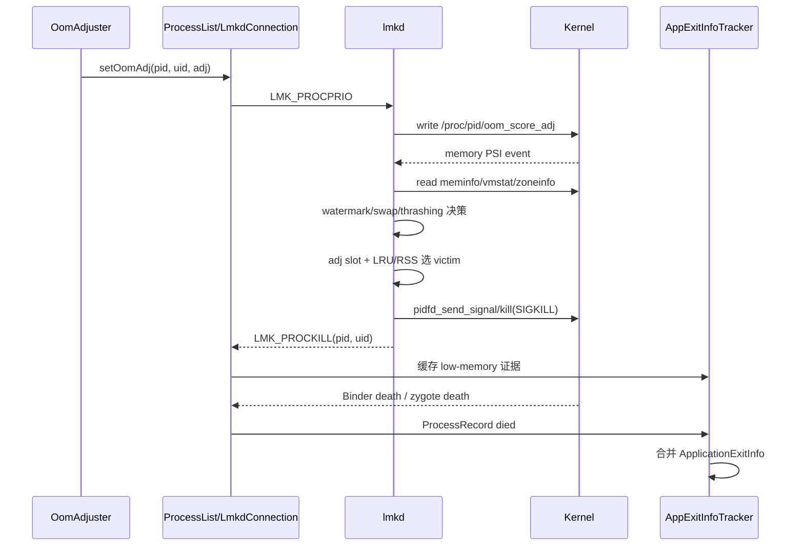

# 107 Android LMKD——协议、PSI 内存压力与 Victim 选择

> 源码版本：Android 11（`android-11.0.0_r48`）  
> 阅读方式：macOS 本地只读源码，不要求编译、刷机或运行 Android 设备。  
> 本章目标：从 Framework 计算 `oom_score_adj` 开始，追踪 system_server 与 lmkd 的 socket 协议、PSI 压力触发、二次判定、victim 选择、SIGKILL、统计上报和 `ApplicationExitInfo` 归因。

---

## 1. 先建立正确心智模型

LMKD 全称 Low Memory Killer Daemon，它是 Android 用户空间的低内存处置进程。

不要把它理解成“内存少于某个固定值就随便杀一个后台 App”。Android 11 的默认主链更接近：

```text
Framework 持续计算每个进程的重要性
        ↓
把 pid/uid/oom_score_adj 发给 lmkd
        ↓
kernel PSI 通知“任务因内存发生明显停顿”
        ↓
lmkd 再读取 meminfo/vmstat/zoneinfo
        ↓
判断 reclaim、watermark、swap、thrashing
        ↓
确定最低可杀 adj
        ↓
先找最不重要的一档，再选该档 victim
        ↓
SIGKILL + stats + 异步通知 system_server
```

因此它有两个彼此独立的问题：

1. **什么时候需要杀？**——由内存压力证据决定。
2. **应该杀谁？**——主要由 Framework 给出的 `oom_score_adj` 和 lmkd 档内策略决定。

---

## 2. 本章源码地图

```text
system/memory/lmkd/lmkd.cpp
system/memory/lmkd/include/lmkd.h
system/memory/lmkd/libpsi/psi.cpp
system/memory/lmkd/libpsi/include/psi/psi.h
system/memory/lmkd/lmkd.rc
system/memory/lmkd/README.md
system/memory/lmkd/statslog.cpp

frameworks/base/services/core/java/com/android/server/am/OomAdjuster.java
frameworks/base/services/core/java/com/android/server/am/OomAdjuster.md
frameworks/base/services/core/java/com/android/server/am/ProcessList.java
frameworks/base/services/core/java/com/android/server/am/LmkdConnection.java
frameworks/base/services/core/java/com/android/server/am/AppExitInfoTracker.java
```

阅读顺序建议：先看 `lmkd.h` 协议，再看 Framework 发送，再看 `lmkd.cpp` 接收、压力判断和杀进程。

---

## 3. lmkd 运行在哪个进程

`lmkd.rc` 定义：

```rc
service lmkd /system/bin/lmkd
    class core
    user lmkd
    group lmkd system readproc
    capabilities DAC_OVERRIDE KILL IPC_LOCK SYS_NICE SYS_RESOURCE
    critical
    socket lmkd seqpacket+passcred 0660 system system
```

关键点：

- 它是独立 native daemon，不在 system_server 中。
- `class core` 使它在很早的启动阶段可用。
- `critical` 表明它对系统存活很重要。
- `KILL` capability 允许它向 victim 发信号。
- `readproc` 和相关 capability 支持读取、修改 `/proc` 信息。
- init 创建名为 `lmkd` 的 Unix domain socket 并传给 daemon。

---

## 4. 为什么从内核驱动迁到用户空间

源码 README 说明，早期 Android 使用 kernel lowmemorykiller driver；Linux 4.12 后该驱动被移除，用户空间 lmkd 承担监控和选择工作。

用户空间实现的价值在于：

- 能读取多种内核统计，而不是只依赖单一 free-page 阈值。
- 策略可以随 Android 平台演进，不必绑定私有内核驱动。
- 能与 Framework 的进程重要性、statsd、退出历史对接。
- 能按设备属性区分 low-RAM 与高性能设备。

这不表示 kernel 不参与；压力统计、PSI、`oom_score_adj`、signal 和进程回收仍由 kernel 提供。

---

## 5. 三个参与者的职责

```text
system_server / OomAdjuster
  知道组件语义：Activity、Service、Provider、前台状态、依赖
  输出：每个进程的 oom_score_adj

kernel
  知道真实内存状态：stall、reclaim、page、swap、watermark
  输出：PSI 与 /proc 统计，执行 SIGKILL

lmkd
  合并两类信息
  输出：是否杀、杀哪个进程、统计和 kill 通知
```

Framework 不适合自己轮询内存并直接选择 victim，因为它不掌握足够精细的 kernel 压力状态；kernel 也不知道一个进程是不是正在展示 Activity。

---

## 6. oom_score_adj 是“可牺牲等级”

Android 11 使用 `-1000..1000` 范围：

```text
-1000                              0                            1000
最受保护  ←──────────────────────────────────────────────→  最容易被杀
```

它不是进程的内存大小，也不是“剩余内存百分比”。

数值越大，表示在内存压力下越适合牺牲。具体值由 `OomAdjuster` 根据进程状态和依赖关系计算。

---

## 7. OomAdjuster 为什么必须频繁更新

`OomAdjuster.md` 给出典型场景：后台 camera 进程被拉到前台时，启动本身可能制造内存压力；若 adj 未及时提升保护，lmkd 仍把它当后台候选，就可能杀掉用户正在打开的相机。

因此 Activity 启动、Service binding、Provider 依赖、前台服务变化等事件都会触发 OOM adjustment 更新。

这里的“提升保护”通常意味着 adj 数值变小，而不是变大。

---

## 8. Framework 把 adj 发给 lmkd

`OomAdjuster.java` 最终调用：

```java
ProcessList.setOomAdj(app.pid, app.uid, app.curAdj);
```

`ProcessList.setOomAdj()` 组装 4 个 int：

```java
buf.putInt(LMK_PROCPRIO);
buf.putInt(pid);
buf.putInt(uid);
buf.putInt(amt);
writeLmkd(buf, null);
```

协议逻辑是：

```text
LMK_PROCPRIO, pid, uid, oom_score_adj
```

Android 11 的 C++ 协议还允许可选的 `ptype`；缺失时为了兼容按普通 App 处理。

---

## 9. Java 与 C++ 协议必须同步

`ProcessList.java` 明确注释 command code 必须与 `lmkd.h` 同步：

```text
0 LMK_TARGET
1 LMK_PROCPRIO
2 LMK_PROCREMOVE
3 LMK_PROCPURGE
4 LMK_GETKILLCNT
5 LMK_SUBSCRIBE
6 LMK_PROCKILL
```

协议以网络字节序传输。Java `ByteBuffer` 默认是 big-endian，C++ 端使用 `ntohl/htonl`。

如果只改一端，命令可能被误解为另一个类型，或者字段完全错误。

---

## 10. 为什么使用 SOCK_SEQPACKET

Framework 创建 `LocalSocket.SOCKET_SEQPACKET`，init 声明也是：

```text
seqpacket+passcred
```

与 byte-stream 不同，SEQPACKET 保留消息边界，适合这种一个 packet 就是一条命令的协议。

`passcred` 让接收端获得发送者凭据。lmkd 会把进程记录与注册者 PID 关联，避免另一个客户端随意修改不属于自己的记录。

---

## 11. lmkd 连接不跑在 AMS 主线程

`ProcessList.init()` 创建专用 `ServiceThread`：

```java
sKillThread = new ServiceThread(TAG + ":kill",
        THREAD_PRIORITY_BACKGROUND, true /* allowIo */);
```

`LmkdConnection` 把 socket FD 注册到这个 Looper 的 `MessageQueue`。

这意味着：

- socket 可读事件由 kill 线程处理。
- lmkd 重连也由该线程延迟执行。
- `killProcessGroup` 等较慢工作不堵 AMS 主 Looper。
- 它仍属于 system_server 进程，只是线程不同。

---

## 12. 建连后的状态重建

lmkd 可能重启，因此新连接不能假设 native 端还保留旧状态。`onLmkdConnect()` 会执行三类动作：

```text
LMK_PROCPURGE
重新发送 LMK_TARGET
LMK_SUBSCRIBE(KILL)
```

随后 Framework 的 adj 更新会继续填充进程记录。

这里体现分布式系统的一条重要原则：连接恢复不等于状态恢复。

---

## 13. LMK_PROCPRIO 在 native 端做什么

`cmd_procprio()` 首先检查：

- adj 是否在 `-1000..1000`。
- process type 是否合法。
- PID 是否是 thread-group leader，而非普通 TID。

然后写入：

```text
/proc/<pid>/oom_score_adj
```

如果进程已死、文件不存在，更新自然失败。

在 userspace 策略下，lmkd 还把 PID、UID、注册者、adj 和 pidfd 保存到自己的进程表及 adj slot 中。

---

## 14. 为什么也写 kernel oom_score_adj

lmkd 自己用 adj 选 victim，但 kernel OOM killer 也认识 `/proc/<pid>/oom_score_adj`。

因此同一份重要性信息还可在系统陷入更极端、kernel 自己 OOM 时影响选择。两者不是同一个 killer，却共享重要性语言。

注意：写 adj 不代表立刻杀进程，只是更新后续决策所需的优先级。

---

## 15. LMK_PROCREMOVE

进程退出或不再跟踪时，Framework 发送：

```text
LMK_PROCREMOVE, pid
```

lmkd 从内部表移除记录并关闭相应 pidfd。

即使 Framework 来不及移除，真正选 victim 前仍会读取 TGID、名称和 RSS 等信息，失败就删除陈旧记录并继续查找。

---

## 16. pidfd 解决了什么

传统 `kill(pid, SIGKILL)` 面临 PID 复用竞态：旧进程退出后，数字 PID 可能已属于新进程。

支持 pidfd 时，lmkd 在注册时调用 `pidfd_open`，杀进程时调用：

```text
pidfd_send_signal(pidfd, SIGKILL)
```

并把 pidfd 加入 epoll 等待死亡通知。

pidfd 同时改善两点：

- signal 更准确地指向原进程实例。
- 可以知道上一 victim 是否已真正死亡，避免杀得过快。

旧 kernel 上仍退化为 PID 和超时方案。

---

## 17. PSI 是什么

PSI 即 Pressure Stall Information。它衡量任务由于 CPU、memory 或 I/O 资源争用而停顿的时间。

本章关注：

```text
/proc/pressure/memory
```

内存 PSI 的价值不是告诉你“还剩多少 MB”，而是告诉你“任务已经因为内存回收或拥堵停了多久”。

这比只看 free memory 更贴近用户可感知卡顿。

---

## 18. PSI some 与 full

源码使用两类内存 stall：

```text
some：至少有部分任务因内存压力停顿
full：所有非 idle 任务都同时因内存压力停顿
```

Android 11 默认新策略中：

- medium 监听 `PSI_SOME`。
- critical 监听 `PSI_FULL`。
- low level 被设为 0，不注册有效阈值。

`full` 比 `some` 严重，但不能简单解释为“所有 CPU 全部停了”；它描述的是受监控资源的 stall 状态。

---

## 19. PSI monitor 如何注册

`libpsi/psi.cpp` 打开 `/proc/pressure/memory`，向 FD 写入类似：

```text
some 70000 1000000
```

含义是在 1 秒窗口中，some stall 累计达到 70 ms 时产生事件。随后把 FD 注册到 lmkd 的 epoll。

单位要特别留意：内部接口使用微秒，而属性名和 lmkd 配置常用毫秒。

---

## 20. 默认阈值不是所有设备固定相同

README 给出的 Android 11 默认量级：

```text
ro.lmk.psi_partial_stall_ms
  low-RAM: 200 ms
  high-end: 70 ms

ro.lmk.psi_complete_stall_ms
  700 ms
```

厂商属性、设备内存类别和平台分支都可能改变它们。源码默认值是起点，不应当作所有手机的运行时真值。

---

## 21. PSI 事件不等于立即杀进程

这是本章最重要的边界之一。

PSI FD 醒来后进入 `mp_event_psi()`，但函数还会读取：

```text
/proc/vmstat
/proc/meminfo
/proc/zoneinfo（周期刷新）
```

并计算 reclaim、swap、thrashing 和 watermark。只有某个 kill condition 成立，`kill_reason != NONE`，才进入 victim 选择。

所以：

```text
PSI event = 值得重新评估
PSI event ≠ 必须杀进程
```

---

## 22. 为什么不能只看 MemFree

Linux 会用闲置 RAM 做 page cache，`MemFree` 很低可能完全正常。

反过来，系统可能还有表面上的可用页，却在高频回收、page cache refault 或 direct reclaim 中明显卡顿。

lmkd 联合多项证据，正是为了分开：

- 正常利用内存。
- 可恢复的短暂压力。
- swap 紧张。
- page cache 抖动。
- 已影响响应性的严重拥堵。

---

## 23. zone watermark

kernel zone 有 min、low、high watermark。lmkd 从 `/proc/zoneinfo` 汇总并结合保护页，判断当前落在哪个水位区域。

可以粗略理解：

```text
高于 high：相对宽松
低于 high：开始紧张
低于 low：更严重
低于 min：危险
```

真实计算涉及多个 NUMA node/zone 和 `max_protection`，不是拿全局 MemFree 与一个常数直接比较。

---

## 24. reclaim 状态

lmkd 比较 `/proc/vmstat` 的计数：

```text
pgscan_kswapd
pgscan_direct
```

若 `pgscan_direct` 增长，说明应用分配路径可能亲自进入 direct reclaim，延迟影响更直接；`kswapd` 增长则表示后台回收线程在工作。

若既没有 reclaim 变化，也没有 workingset refault 变化，新策略可提前返回，不杀进程。

---

## 25. workingset refault 与 thrashing

page cache 页被回收后很快又被访问，需要重新读回，这叫 refault。大量 refault 表明系统不断丢掉马上还要用的页。

lmkd 近似计算：

```text
thrashing % = 新增 workingset_refault
             / 基线 file-backed page cache pages
             × 100
```

这不是 CPU thrashing，也不是 Java GC 抖动；它特指这里的文件页工作集反复回收/读回压力。

---

## 26. swap low

lmkd 按总 swap 的百分比计算低水位：

```text
free_swap < total_swap × swap_free_low_percentage
```

README 默认：low-RAM 10%，高端设备 20%。

swap 少本身也不必然触发 kill；它会与 watermark 或 thrashing 组合成为更强证据。

---

## 27. 新策略的主要 kill reason

`mp_event_psi()` 中可看到多种条件：

```text
PRESSURE_AFTER_KILL
NOT_RESPONDING
LOW_SWAP_AND_THRASHING
LOW_MEM_AND_SWAP
LOW_MEM_AND_THRASHING
DIRECT_RECL_AND_THRASHING
```

这些 reason 会进入日志和 stats，但 Framework 收到的 `LMK_PROCKILL` packet 只有 PID、UID；第 106 章的公开 `ApplicationExitInfo` 将其统一归类为 `REASON_LOW_MEMORY`。

---

## 28. critical PSI 的 NOT_RESPONDING

当 critical level 的 PSI full 事件到来，源码描述为：设备忙于内存回收，可能导致 ANR，因此 reason 为 `NOT_RESPONDING`。

这个名字容易误解。它不是说某个 App 已经触发 Framework ANR，而是说整机内存拥堵已达到严重无响应风险。

最终 victim 的公开退出原因仍是 low memory，不是 ANR。

---

## 29. min_score_adj 如何保护可感知进程

某些压力条件虽然允许 kill，但如果水位尚未跌得特别低、thrashing 也未到 critical，源码会设：

```text
min_score_adj = PERCEPTIBLE_APP_ADJ + 1
```

含义是暂不考虑 perceptible 及更重要进程，只在更可牺牲的后台集合中找 victim。

随着证据变严重，最低门槛可能下降，候选范围扩大。

---

## 30. Victim 选择先按 adj 档位

`find_and_kill_process()` 从最大 adj 向下扫描：

```cpp
for (i = OOM_SCORE_ADJ_MAX; i >= min_score_adj; i--) {
    ...
}
```

所以总体规则是：先牺牲 adj 最大、最不重要的进程，而不是全系统直接找 RSS 最大者。

这让一个很大的前台进程通常不会因为“大”就输给一个很小的缓存进程。

---

## 31. 同一 adj 档位如何选择

默认可选择该 slot 的 LRU 尾部：

```text
proc_adj_lru(oomadj)
```

若 `ro.lmk.kill_heaviest_task=true`，则扫描同档找到 RSS 最大者：

```text
proc_get_heaviest(oomadj)
```

源码还规定，一旦候选范围下降到 perceptible 档，即使全局没开 heaviest，也改选最重者，希望一次释放更多内存、减少重要进程被杀数量。

---

## 32. “最重”不是跨优先级全局最重

正确顺序：

```text
先选择最高 oom_score_adj 档
        ↓
再在该档按 LRU 或 RSS 选一个
```

错误理解：

```text
从所有进程里直接杀 RSS 最大的
```

优先级是第一维，内存大小或 LRU 是第二维。

---

## 33. kill 前的 PID 复用防护

`kill_one_process()` 先读取 TGID：

```cpp
tgid = proc_get_tgid(pid);
if (tgid >= 0 && tgid != pid) {
    // possible pid reuse
}
```

它还读取 task name 和 RSS；任何一步发现记录陈旧，就放弃该条并从 lmkd 表中删除。

支持 pidfd 时保护更强；不支持时这些检查仍能缩小误杀窗口，但不是严格的进程实例句柄。

---

## 34. 真正杀进程

两条实现路径：

```cpp
kill(pid, SIGKILL);
```

或：

```text
pidfd_send_signal(pidfd, SIGKILL)
```

成功发送 signal 后，源码把该进程组和优先级临时调到更易完成退出的位置，记录 kill 时间、计数和统计，并从候选表移除。

“signal 发送成功”仍不等于内存已经释放，所以后续要等待死亡或使用 timeout。

---

## 35. 为什么一次通常只杀一个

`find_and_kill_process()` 找到成功 victim 后退出。lmkd 随后等待该进程死亡，再根据压力是否缓解决定要不要继续。

这种反馈式控制比一次批量杀多个更保守：第一个 victim 可能已释放足够内存。

如果设备持续消费内存、杀后仍跌破水位，下一轮会出现 `PRESSURE_AFTER_KILL` 等证据，再杀一个。

---

## 36. kill timeout 与 pidfd 等待

源码在事件处理开头检查 `is_kill_pending()`：

- pidfd 支持时，通过 epoll 获得死亡通知。
- 否则保存 PID，并依赖进程是否消失和 `kill_timeout_ms`。

等待期间可暂停快速轮询，避免上一进程尚未退出就连续杀多个。

属性 `ro.lmk.kill_timeout_ms` 是保护节奏的配置，不是保证进程一定在该时间内死亡。

---

## 37. PSI 事件之后为什么还要轮询

PSI monitor 在一个 window 中有事件频率限制；初次事件后，lmkd 会在约 1 秒窗口内主动轮询：

```text
压力高、swap low、刚 kill：10 ms
普通跟踪：100 ms
```

轮询用的是 timer/epoll 驱动，不是持续 busy loop。

这样能看到压力演变与 victim 死亡后的恢复效果，而不必等待下一次受限的 PSI 通知。

---

## 38. 旧 vmpressure 回退路径

初始化优先：

```cpp
use_psi = ro.lmk.use_psi && init_psi_monitors();
```

若 PSI 不可用，则注册 memory cgroup 的：

```text
low
medium
critical
```

vmpressure 事件走 `mp_event_common()`。所以说“Android 11 lmkd 只支持 PSI”是错的；更准确是默认优先 PSI，失败时回退。

---

## 39. minfree 兼容模式

`ro.lmk.use_minfree_levels=true` 时，可使用传统 `minfree:oom_adj_score` 阶梯，接近旧 lowmemorykiller 驱动的模型。

Framework 通过 `LMK_TARGET` 最多发送 6 对：

```text
minfree pages → minimum kill adj
```

新策略通常更关注 watermark、swap 和 thrashing。阅读具体设备问题时必须先查属性，不能只凭平台默认推断运行路径。

---

## 40. LMK_TARGET 与 LMK_PROCPRIO 不同

```text
LMK_TARGET
  配全局阈值：某种 free/cache 水平可杀到哪个 adj

LMK_PROCPRIO
  配单进程身份：这个 PID 当前的 adj 是多少
```

前者描述“什么时候、最低杀到哪档”，后者描述“谁在哪档”。

---

## 41. kill 统计

每次成功 kill 会写入多类观测：

- logcat 中的 task、PID、UID、adj、估算释放量和 reason。
- EventLog `low_memory_kill`。
- statsd `LMK_KILL_OCCURRED`，包含内存状态和进程统计。
- kill count，供 `LMK_GETKILLCNT` 查询。
- 控制 socket 的异步 `LMK_PROCKILL` 通知。

这些通道服务不同消费者，字段并不完全相同。

---

## 42. LMK_PROCKILL 上报

lmkd 发送 3 个 int：

```text
LMK_PROCKILL, pid, uid
```

system_server 建连时先发送：

```text
LMK_SUBSCRIBE, LMK_ASYNC_EVENT_KILL
```

只有订阅者才接收异步 kill event。README 中 `sys.lmk.reportkills` 表示当前配置是否支持 kill 报告。

---

## 43. 同一 socket 上的同步回复与异步事件

`LmkdConnection.processIncomingData()` 先判断 packet 是否是当前等待的 reply；若不是，则交给 `handleUnsolicitedMessage()`。

```text
请求/回复：例如 LMK_GETKILLCNT
异步通知：LMK_PROCKILL
```

两者可复用一个 SEQPACKET socket，因为 packet 首字段与长度可区分。`mReplyBufLock` 负责等待者与 FD callback 的配合。

---

## 44. kill 通知如何进入退出历史

`ProcessList` 收到 12 字节 packet 后调用：

```java
mAppExitInfoTracker.scheduleNoteLmkdProcKilled(pid, uid);
```

Tracker 先缓存这个外部证据。稍后 ProcessRecord 真正死亡时，再与进程名、package、importance、PSS/RSS、zygote wait status 等合并。

这就是第 106 章所讲的异步证据拼接。

---

## 45. 为什么只上报 PID/UID 也有价值

lmkd 不知道 package、共享 UID、isolated process 的业务归属，也不应复制 PackageManager 状态。

它只报告自己能确定的事实：哪个 PID/UID 是自己杀的。system_server 用自己的 ProcessRecord 补齐上层语义。

这种跨层设计遵守“事实由最接近事实的一层产生，语义由掌握语义的一层补充”。

---

## 46. lmkd 内部 reason 与公开 reason 不一一映射

例如 native 端可能记录：

```text
LOW_MEM_AND_SWAP
LOW_MEM_AND_THRASHING
NOT_RESPONDING
```

但 `ApplicationExitInfo` 只看到：

```text
REASON_LOW_MEMORY
```

若要分析 lmkd 为何在那一刻决定杀，需要结合 statsd/logcat；只查公开退出历史无法还原全部 native 决策分支。

---

## 47. 端到端时序图



---

## 48. 三个时间点不要混

```text
T1：PSI 事件发生
T2：lmkd 成功发送 SIGKILL 并发 kill report
T3：system_server 确认 ProcessRecord 死亡
```

它们不是同一时刻。进程可能在 signal 后经过短暂清理才真正消失；调度和 socket 也引入延迟。

退出历史的 timestamp 与 lmkd stats 的事件时间因此可能略有差异。

---

## 49. “释放多少内存”是估算

lmkd 在 kill 前读取进程 RSS，日志说 `to free ... kB`。这表示 victim 当时的驻留页量，不保证 kill 后系统立刻增加同等 free memory：

- 共享页不能全部算作独占释放。
- dirty 页可能需要回写。
- 其他进程同时分配或回收。
- page cache 与内核记账会继续变化。

所以它适合估计 victim 规模，不是严格的因果差值。

---

## 50. lmkd 与 kernel OOM killer 的区别

```text
lmkd
  用户空间 daemon
  可在系统彻底 OOM 前根据 PSI/策略主动处置
  使用 Framework adj 表和 Android 策略

kernel OOM killer
  内核在分配无法满足等极端状态下兜底
  按内核 badness 与 oom_score_adj 选择
```

两者都可能发 SIGKILL，也都受 adj 影响，但触发路径和日志不同。

看到进程死于 SIGKILL，不能仅凭 signal 断言一定是 lmkd。

---

## 51. lmkd 与 AMS 主动 kill 的区别

AMS 可能因 stop package、bad process、用户操作、后台限制等主动 kill。它会向 `AppExitInfoTracker` 写明确 reason/subreason。

lmkd 是资源压力策略，主动 report 后归因为 low memory。

两条路径可能在时间上竞争，所以 Tracker 要按 PID、UID、freshness 和证据优先级合并，而不是每收到一条消息就创建互不相关的记录。

---

## 52. lmkd 不负责 Java `onTrimMemory`

`onTrimMemory()` 是 Framework 给存活进程的内存建议回调；lmkd 负责压力判断与终止 victim。

二者都与内存相关，但没有“lmkd 先给 App 调 onTrimMemory，App 不释放才 kill”这样的逐进程握手协议。

App 也不能依靠一定收到回调后才会被杀。

---

## 53. 为什么后台 App 会“无回调消失”

SIGKILL 不可捕获、不可忽略，进程没有 Java finally、Activity lifecycle 或 Application callback 来保存临终状态。

Android App 必须把后台进程被回收视作正常生命周期：重要状态应增量持久化，UI 恢复不依赖优雅退出。

这也是进程管理与组件生命周期学习中的核心工程结论。

---

## 54. 安全边界

init socket 权限为 `0660 system system`，不是所有 App 都能连接。接收端还有 peer credentials 和 record ownership 检查。

lmkd 具备强 capability，但以专门 `lmkd` 用户运行，并受 SELinux domain 约束。能力、DAC、socket 权限与 SELinux 一起形成纵深防御。

仅看到 `CAP_KILL` 不应得出“它可不受任何限制操作系统”的结论。

---

## 55. lmkd 为什么是 critical service

没有 lmkd，持续压力可能演变为严重抖动、ANR 或 kernel OOM。init 将其标为 `critical`，并支持属性触发 `--reinit`。

不过 `critical` 的具体重启/设备恢复行为还取决于 init 版本、service option 和崩溃窗口，不能简化成“lmkd 一死设备立即重启”。

---

## 56. 配置属性阅读表

| 属性 | 影响 |
|---|---|
| `ro.config.low_ram` | 选择低内存设备默认策略 |
| `ro.lmk.use_psi` | 优先启用 PSI monitor |
| `ro.lmk.use_new_strategy` | PSI 下使用 watermark/swap/thrashing 新策略 |
| `ro.lmk.use_minfree_levels` | 使用传统 minfree 阶梯 |
| `ro.lmk.kill_heaviest_task` | 同 adj 档倾向杀 RSS 最大者 |
| `ro.lmk.kill_timeout_ms` | 连续 kill 的等待节奏；r48 实际代码默认 100 ms |
| `ro.lmk.swap_free_low_percentage` | swap low 判断阈值 |
| `ro.lmk.thrashing_limit` | page-cache refault 阈值 |
| `ro.lmk.thrashing_limit_decay` | kill 后仍未恢复时逐步降低阈值 |
| `ro.lmk.psi_partial_stall_ms` | PSI some 阈值 |
| `ro.lmk.psi_complete_stall_ms` | PSI full 阈值 |

属性多为 `ro.`，通常在启动配置后不作为运行时频繁调参接口。这里还有一个很容易被旧说明误导的版本点：同目录 `README.md` 把 `ro.lmk.kill_timeout_ms` 的默认值写成 0（禁用），但 r48 `update_props()` 实际传给 `property_get_int32()` 的默认值是 100。研究当前分支行为时应以执行代码为准；产品属性仍可覆盖它。

---

## 57. 一个具体决策例子

假设：

```text
PSI some 达到阈值
free swap 已低
page-cache thrashing = 45%
thrashing limit = 30%
watermark 尚未低于 min
```

lmkd 可能进入 `LOW_SWAP_AND_THRASHING`，同时把最低可杀档设在 perceptible 之后。候选：

```text
A: adj=900, RSS=80 MB
B: adj=900, RSS=160 MB
C: adj=200, RSS=500 MB
```

先考虑 adj=900。默认 LRU 可能选 A 或 B 中更旧者；heaviest 模式选 B。C 虽然最大，但当前受保护。

---

## 58. 压力升级例子

若杀 B 后仍然低于 min watermark，下一轮可能记录 `PRESSURE_AFTER_KILL`，候选门槛下降。

若后台候选已用尽且设备接近失去响应，较低 adj 的 perceptible 进程也可能进入集合。

“前台永远不会被杀”不是绝对保证；adj 是相对保护等级，在保全整个系统时保护范围可能扩大到更重要进程。

---

## 59. 常见误读一——PSI 是剩余内存阈值

错误：

```text
PSI=70 表示只剩 70 MB
```

正确：

```text
这里的 70 表示 1 秒窗口中累计 70 ms 的 some stall 阈值
```

PSI 描述等待时间比例/累计值，不直接描述容量。

---

## 60. 常见误读二——adj 越小越容易杀

恰好相反：

```text
adj 越大 → 越不重要 → 越先考虑
adj 越小/越负 → 越受保护
```

阅读 OomAdjuster 时“提高进程优先级”常表现为把 adj 数值降低。

---

## 61. 常见误读三——lmkd 计算 App 业务重要性

lmkd 不遍历 Activity/Service 组件。业务重要性主要由 system_server 的 `OomAdjuster` 计算后送入。

lmkd 只负责维护分档、读取内存压力并执行资源层策略。

如果某前台进程 adj 错了，根因可能在 Framework 依赖传播或更新时序，不一定是 lmkd victim 算法。

---

## 62. 常见误读四——收到 kill report 等于已释放内存

report 在 signal 成功后产生，而实际死亡和页回收稍后完成。

因此源码还需要 pidfd/timeout 等待；AppExitInfo 也会等 ProcessRecord death 再完成上层记录。

诊断时间线必须分开“决定”“发送 signal”“死亡”“回收完成”。

---

## 63. 常见误读五——每次压力事件都会留下 AppExitInfo

PSI 可以唤醒而不 kill；没有 victim 就没有 `LMK_PROCKILL`。

即使真的 kill，异步 socket、system_server 重启、记录加载窗口或 PID/UID 匹配也可能造成历史记录 best effort 边界。

公开 API 适合诊断近期退出，不是绝对完整的 kernel 审计日志。

---

## 64. macOS 只读练习一：看协议镜像

```bash
cd /Users/ninebot/androidSource

sed -n '24,280p' system/memory/lmkd/include/lmkd.h
sed -n '308,340p' frameworks/base/services/core/java/com/android/server/am/ProcessList.java
```

回答：

1. 哪些命令有 reply？
2. 哪条是 unsolicited event？
3. Java 和 C++ 各如何表示 network byte order？

---

## 65. macOS 只读练习二：追 adj 下发

```bash
rg -n 'setOomAdj\(' \
  frameworks/base/services/core/java/com/android/server/am/OomAdjuster.java \
  frameworks/base/services/core/java/com/android/server/am/ProcessList.java

sed -n '1398,1445p' \
  frameworks/base/services/core/java/com/android/server/am/ProcessList.java

sed -n '1035,1180p' system/memory/lmkd/lmkd.cpp
```

画出：

```text
app.curAdj → packet → cmd_procprio → /proc/pid/oom_score_adj → adj slot
```

---

## 66. macOS 只读练习三：追 PSI

```bash
sed -n '25,105p' system/memory/lmkd/libpsi/psi.cpp
sed -n '2300,2575p' system/memory/lmkd/lmkd.cpp
sed -n '2850,2900p' system/memory/lmkd/lmkd.cpp
```

逐项标注：

- event 输入。
- vmstat/meminfo 输入。
- reclaim 推断。
- thrashing 计算。
- watermark 判断。
- kill reason。
- polling 输出。

---

## 67. macOS 只读练习四：追 victim

```bash
sed -n '1880,2195p' system/memory/lmkd/lmkd.cpp
```

回答：

1. 为什么 adj 从 1000 向下扫描？
2. 哪个条件把档内选择切到 heaviest？
3. `kill_one_process()` 在发 signal 前做哪些有效性检查？
4. 为什么 `pid_remove()` 必须放最后？

---

## 68. macOS 只读练习五：追 kill 回 Framework

```bash
rg -n 'LMK_SUBSCRIBE|LMK_PROCKILL|scheduleNoteLmkdProcKilled' \
  system/memory/lmkd \
  frameworks/base/services/core/java/com/android/server/am
```

目标调用链：

```text
ctrl_data_write_lmk_kill_occurred
→ LMK_PROCKILL
→ LmkdConnection FD callback
→ ProcessList listener
→ AppExitInfoTracker external source cache
```

---

## 69. 源码阅读检查表

读完应能独立回答：

- lmkd、system_server、kernel 各掌握什么信息？
- `LMK_PROCPRIO` 和 `LMK_TARGET` 有何不同？
- PSI some/full 表示什么？
- 为什么 PSI 事件不是 kill 命令？
- watermark、swap、reclaim、thrashing 如何共同决策？
- victim 的第一排序维度是什么？
- LRU 与 heaviest 在哪一层选择？
- pidfd 如何降低 PID 复用和连续 kill 风险？
- lmkd native reason 为什么不能从 ApplicationExitInfo 完整还原？
- 为什么 SIGKILL 不等于一定是 lmkd？

---

## 70. 第二次复读：最容易卡住的因果链

第一次读源码常把所有条件压缩成一句“内存不足杀后台”。建议拆为六层：

```text
第一层：组件语义
Activity/Service/Provider 关系 → OomAdjuster → adj

第二层：进程登记
LMK_PROCPRIO → /proc oom_score_adj + lmkd adj slots

第三层：触发器
PSI some/full 只要求 lmkd 开始评估

第四层：真实性判断
vmstat + meminfo + zoneinfo → reclaim/swap/thrashing/watermark

第五层：策略执行
minimum adj → 最高可牺牲档 → LRU/RSS → SIGKILL

第六层：观测归因
stats/log + LMK_PROCKILL → ProcessRecord death → ApplicationExitInfo
```

每一层都可能独立出错。例如 adj 更新滞后、PSI 阈值不合适、thrashing 过敏、候选表陈旧、report 丢失，会呈现不同症状。

---

## 71. 第二次复读：变量名中的历史包袱

源码同时出现：

```text
oom_adj
oom_score_adj
min_score_adj
level_oomadj
```

旧 Linux `oom_adj` 范围与新 `oom_score_adj` 不同。Android 11 这里主要使用 `-1000..1000` 的 `oom_score_adj` 语义，但变量和协议名称仍保留部分历史命名。

判断量纲要看取值范围和写入的 proc 节点，不要只看变量名。

---

## 72. 第二次复读：线程与锁边界

Framework 侧：

```text
AMS/OomAdjuster 计算状态
  → ProcessList.writeLmkd

ProcessList:kill ServiceThread
  → socket FD callback
  → unsolicited LMK_PROCKILL
  → AppExitInfoTracker KillHandler
```

Native 侧主要是 epoll event loop，串行处理 control socket、PSI、timer、pidfd 等 FD 事件。

因此 socket write、reply wait、异步 event 与 AMS 全局锁的组合值得关注；不能因为 daemon 是 native 就认为调用没有线程或阻塞成本。

---

## 73. 第二次复读：策略不是静态表

新策略包含反馈：

- kill 后重新建立 refault 基线。
- 压力不恢复时降低 thrashing limit。
- 依据 swap 和 kill 状态切换 10/100 ms polling。
- 等待 victim 死亡，避免过度 kill。
- zone watermark 每分钟刷新。

它是一个事件驱动、带状态的反馈控制器，而不是单次 if 判断。

---

## 74. 排障顺序

遇到“后台 App 被异常杀死”，建议按证据层排查：

```text
1. ApplicationExitInfo：是否 REASON_LOW_MEMORY？
2. lmkd log/stats：native kill reason、adj、RSS、系统内存快照。
3. Framework adj：被杀前 curAdj 是否符合组件状态？
4. 属性：PSI、新策略、minfree、thrashing、heaviest 是否被厂商修改？
5. kernel 统计：PSI、vmstat、zoneinfo、swap 是否真的支持该判断？
6. 时间线：signal、death、重启和记录是否属于同一个 PID 实例？
```

如果第 1 步只有 `SIGNALED/SIGKILL` 而没有 low-memory reason，还应考虑 AMS kill、用户操作、native abort 后续、kernel OOM 或外部工具。

---

## 75. 本章结论

Android 11 LMKD 的完整职责可归纳为：

```text
OomAdjuster 提供“谁重要”
lmkd 协议维护 pid/uid/adj 候选表
PSI 提供“系统已经因内存停顿”的事件
meminfo/vmstat/zoneinfo 提供二次决策证据
watermark/swap/refault/reclaim 决定是否需要 kill
adj 档位优先，LRU/RSS 决定同档 victim
pidfd/SIGKILL 执行并控制连续 kill 节奏
log/stats 保存细粒度 native reason
LMK_PROCKILL + ProcessRecord death 形成公开退出归因
```

最值得记住的三句话：

1. PSI 是触发评估，不是直接 kill 命令。
2. `oom_score_adj` 是第一选择维度，RSS 只在同档策略中起作用。
3. lmkd 发出 SIGKILL、进程真正死亡、Framework 写完 `ApplicationExitInfo` 是三个不同时间点。

下一章将沿着本章的上游继续精读 `OomAdjuster`：它如何从 Activity、Service、Provider、前台服务和进程依赖图计算 `adj/procState/schedGroup`，以及循环依赖和增量更新为何困难。
