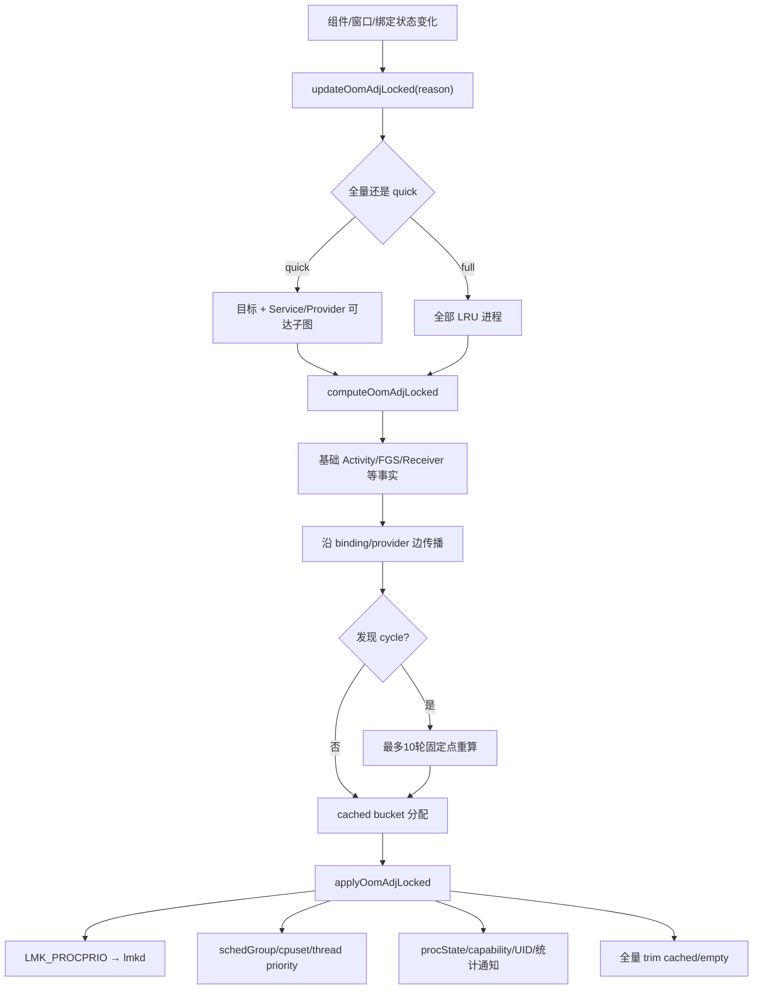

# 108 Android OomAdjuster——进程优先级计算、依赖传播与循环收敛

> 源码版本：Android 11（`android-11.0.0_r48`）  
> 核心源码：`frameworks/base/services/core/java/com/android/server/am/OomAdjuster.java`  
> 环境：macOS 只读源码，不要求编译或真机。  
> 本章目标：分清 adj、procState、schedGroup、capability 四种输出，理解 Activity、Service、Provider 等事实如何决定本进程基础等级，进程依赖如何传播保护，循环如何检测并迭代收敛，以及计算结果如何真正应用到 kernel 和 App。

---

## 1. OomAdjuster 不是只算一个 OOM 数字

源码自带的 `OomAdjuster.md` 把主要输出概括为：

```text
Oom Adj score
Process State
Scheduler Group
Process Capabilities（Android R 新增）
```

四者相关，但用途不同：

| 输出 | 核心问题 | 主要消费者 |
|---|---|---|
| adj | 内存压力时先牺牲谁 | lmkd、kernel OOM |
| procState | 进程处于何种业务生命周期等级 | AMS、GC、后台限制、统计、App 回调 |
| schedGroup | CPU/cpuset 调度待遇 | ProcessGroup、kernel scheduler/cgroup |
| capability | 当前状态下可否使用特定 while-in-use 能力 | 权限与系统服务策略 |

看到一次 `updateOomAdjLocked()`，不要只盯 `curAdj`。

---

## 2. 源码地图

```text
frameworks/base/services/core/java/com/android/server/am/OomAdjuster.java
frameworks/base/services/core/java/com/android/server/am/OomAdjuster.md
frameworks/base/services/core/java/com/android/server/am/ProcessRecord.java
frameworks/base/services/core/java/com/android/server/am/ProcessList.java
frameworks/base/services/core/java/com/android/server/am/UidRecord.java
frameworks/base/services/core/java/com/android/server/am/ConnectionRecord.java
frameworks/base/services/core/java/com/android/server/am/ContentProviderConnection.java
frameworks/base/services/core/java/com/android/server/am/ActiveServices.java
frameworks/base/core/java/android/app/ActivityManager.java
frameworks/base/core/java/android/content/Context.java
```

本章以 `OomAdjuster.java` 为主，常量则交叉看 `ProcessList` 和 `ActivityManager`。

---

## 3. adj 数值方向

Android 11 代表性档位：

```text
-1000 NATIVE_ADJ
 -900 SYSTEM_ADJ
 -800 PERSISTENT_PROC_ADJ
 -700 PERSISTENT_SERVICE_ADJ
    0 FOREGROUND_APP_ADJ
  100 VISIBLE_APP_ADJ
  200 PERCEPTIBLE_APP_ADJ
  250 PERCEPTIBLE_LOW_APP_ADJ
  300 BACKUP_APP_ADJ
  400 HEAVY_WEIGHT_APP_ADJ
  500 SERVICE_ADJ
  600 HOME_APP_ADJ
  700 PREVIOUS_APP_ADJ
  800 SERVICE_B_ADJ
  900..999 CACHED_APP
```

数字越小越受保护。源码说“raise importance”时，adj 往往是下降。

---

## 4. procState 数值方向也类似但不是同一量纲

`ActivityManager.PROCESS_STATE_*`：

```text
0  PERSISTENT
1  PERSISTENT_UI
2  TOP
3  BOUND_TOP
4  FOREGROUND_SERVICE
...
10 SERVICE
11 RECEIVER
12 TOP_SLEEPING
...
16 CACHED_ACTIVITY
19 CACHED_EMPTY
20 NONEXISTENT
```

数值越小通常越重要。但不能把 `procState=4` 当作 `adj=4`；它们是不同枚举与不同决策维度。

---

## 5. schedGroup 解决 CPU 待遇

Android 11 代表值：

```text
SCHED_GROUP_BACKGROUND = 0
SCHED_GROUP_RESTRICTED = 1
SCHED_GROUP_DEFAULT = 2
SCHED_GROUP_TOP_APP = 3
SCHED_GROUP_TOP_APP_BOUND = 4
```

后台进程可能进入受限 cpuset，top App 可获得更积极的 CPU 调度。它不直接表示能否被 lmkd 杀。

一个进程可能 adj 受到保护，但 schedGroup 并非 TOP_APP；四种输出必须分别计算。

---

## 6. capability 是 Android 11 新维度

Android R 引入 `PROCESS_CAPABILITY_*`，服务于 while-in-use 权限模型。例如某能力不仅取决于 manifest/runtime permission，还取决于调用进程当前是否具有合适前台状态。

Service binding 可用 `BIND_INCLUDE_CAPABILITIES` 让符合条件的 client 能力传播给 service host。

capability 不是 Linux capability，也不是 SELinux permission。

---

## 7. 为什么一个进程有多套 current/set/raw 字段

`ProcessRecord` 中常见：

```text
curRawAdj → 本轮基础/传播计算中的原始 adj
curAdj    → 经 modifyRawOomAdj 等修正后的待应用 adj
setAdj    → 上次已经下发的 adj

curRawProcState → 原始计算状态
curProcState    → 本轮待应用状态
setProcState    → 上次已通知/应用状态
```

“cur”是下一状态，“set”是当前外部世界已知状态。只有不同才需要做昂贵副作用。

---

## 8. 总体三阶段

```text
选择更新集合
  全量 LRU 或单进程可达子图
        ↓
computeOomAdjLocked
  只计算 cur*，递归传播依赖，处理 cycle
        ↓
applyOomAdjLocked / updateAndTrim
  adj 下发 lmkd、schedGroup 下发 kernel、procState 通知 App/UID/统计
```

把 compute 与 apply 分离，可以先得到一致快照，再统一执行外部副作用。

---

## 9. 入口一：全量更新

```java
void updateOomAdjLocked(String oomAdjReason) {
    final ProcessRecord topApp = mService.getTopAppLocked();
    updateOomAdjLockedInner(oomAdjReason, topApp, null, null, true, true);
}
```

`processes == null` 表示遍历 `mProcessList.mLruProcesses`。全量更新还能重新分配 cached adj bucket、裁剪进程、汇总 UID 状态。

---

## 10. 入口二：单进程快速更新

Android R 的 `OOMADJ_UPDATE_QUICK` 优化尝试只更新变化进程及其可达下游。

先计算目标自身；如果 cached/非 cached 和 background 边界都没变化，依赖它的 host 通常也不会受影响，可以提前结束。

若跨过关键边界，则 BFS 扫描它绑定的 Service host 和连接的 Provider host。

---

## 11. 为什么方向是 client 到 host

假设前台进程 A 绑定后台服务进程 B：

```text
A（client，用户可见） ──bind──> B（service host）
```

B 正在替 A 完成用户可感知工作，不能仍按普通后台进程处理。因此保护从 A 传播到 B。

Provider 同理：client 正在同步依赖 provider host 时，杀 host 会直接打断 client 调用。

---

## 12. 快速更新的可达图

核心结构：

```text
queue = ArrayDeque<ProcessRecord>
processes = reachable hosts
mReachable = visited 标记
```

遍历：

```text
target.connections → Service host
target.conProviders → Provider host
host 再向它依赖的 host 扩展
```

这是有向图可达性，不是遍历所有“与该 App 有关系”的对象。

---

## 13. 哪些 binding 不传播快速更新

quick 可达图里，若被检查的三个标志 `BIND_WAIVE_PRIORITY | BIND_TREAT_LIKE_ACTIVITY | BIND_ADJUST_WITH_ACTIVITY` 中只命中 `BIND_WAIVE_PRIORITY`，源码跳过该 Service edge。这里的“只”限定在这三个位的掩码结果；连接同时带其他与 quick 可达性无关的 flag，并不会因此改变这个判断。

`BIND_WAIVE_PRIORITY` 表示 client 不希望因这条绑定提升 service host 的 adj/procState/schedGroup；r48 仍有 freezer 相关例外：若 client 不是 cached，host 会被标记 `shouldNotFreeze`，避免活动 client ping 到已冻结的 WPRI host 而没有正常 death 通知。

但它与 `BIND_TREAT_LIKE_ACTIVITY`、`BIND_ADJUST_WITH_ACTIVITY` 等组合时语义更复杂，不能只看到 WAIVE 就无条件删边。

---

## 14. 为什么可达列表要反转

快速 BFS 得到的列表顺序与 `updateOomAdjLockedInner()` 从尾向头扫描的方向不匹配。源码反转列表，使更靠近起点的依赖能在合适次序被处理。

这只是提高传播计算的有效顺序；若出现 cycle，仍需要专门的迭代收敛。

---

## 15. 全量计算前先重置

对活动进程：

```java
app.setCurRawProcState(PROCESS_STATE_CACHED_EMPTY);
app.setCurRawAdj(ProcessList.UNKNOWN_ADJ);
app.setCapability = PROCESS_CAPABILITY_NONE;
app.resetCachedInfo();
```

含义是先从“最不重要/未知”基线开始，再根据证据逐步 promotion。

这比从上轮值任意升降更容易保证同一轮一致性。

---

## 16. 固定进程快速路径

若：

```java
app.maxAdj <= FOREGROUND_APP_ADJ
```

说明该进程被配置为不能降到普通后台档。源码直接设 fixed：

```text
curRawAdj = maxAdj
procState = PERSISTENT
schedGroup = DEFAULT
capability = ALL
```

若它又是 top App，可进一步得到 TOP_APP schedGroup 和 UI 状态。

---

## 17. 普通进程从最差基线开始

无线程的记录直接按 cached empty/max adj 处理。正常进程进入计算时，局部变量初始值代表较低重要性，随后依次考察：

```text
top app
remote animation
instrumentation
broadcast receiver
executing service
activity visibility
recent task / foreground service / overlay UI
heavy/home/previous/backup
service connections
provider connections
```

命中更强事实就降低 adj、降低 procState 数值或提高 schedGroup。

---

## 18. top App

当前聚焦、交互的 top process 通常得到：

```text
adj = FOREGROUND_APP_ADJ
procState = PROCESS_STATE_TOP
schedGroup = SCHED_GROUP_TOP_APP
```

但“有 Activity”不自动等于 top；可见、暂停、不可见、最近任务会形成不同等级。

top App 由 ATMS/WMS 的当前任务和活动状态决定。

---

## 19. Activity 状态来自 ATMS/WMS 回调

OomAdjuster 不复制完整 Activity 栈算法，而调用 ProcessRecord/ATMS 内部接口，让 Activity 可见性回调更新：

```text
hasForegroundActivities
visible layer
procState
adj
schedGroup
```

窗口层越靠前的可见 Activity 可分配略不同 visible adj，减少所有可见进程完全同档。

---

## 20. remote animation

运行 remote animation 的进程正在生成用户直接看到的动画。即使它不是通常意义的 top Activity，也需要前台级调度保护，否则动画容易掉帧。

这说明 priority 不只由组件类型决定，也由当前用户体验任务决定。

---

## 21. instrumentation

正在执行 instrumentation 的进程受到较强保护，因为测试控制链依赖它；过早杀掉会使测试会话无意义。

它是开发/测试语义进入生产级进程优先级算法的例子。

---

## 22. Broadcast Receiver

正在接收广播的进程会提升到 receiver/foreground 相应状态，并获得非后台 schedGroup，防止广播执行期间被当作 cached victim。

广播完成后，这项事实消失，下一次更新会重新降级。

保护的是执行窗口，不是“Manifest 中声明过 Receiver”这一静态事实。

---

## 23. executing Service

正在执行 Service 生命周期回调或命令的进程会临时提升。因为它已被系统要求完成一段工作，执行中途被低内存回收会破坏系统调度语义。

执行完成不等于 started service 结束；“currently executing”与“has started services”是两类条件。

---

## 24. 前台服务不等于 top App

hosting foreground service 通常得到：

```text
procState = FOREGROUND_SERVICE
adj ≈ PERCEPTIBLE_APP_ADJ
```

它比 cached/普通 service 更受保护，但通常低于真正可见/top Activity。

通知可见并不等于 UI 正在前台，Foreground Service 的“foreground”与 Activity foreground 是不同概念。

---

## 25. FGS grace period

进程刚离开前台但仍处理相机照片等工作时，源码可在一定时间内保留较高等级，避免状态瞬间下降造成抖动和误杀。

这是一种时间滞后（hysteresis）：状态提升要及时，状态降低可适当延迟。

诊断时不要假设 Activity 一不可见 adj 就在同一纳秒变成 cached。

---

## 26. Overlay UI 与 toast

进程展示 overlay UI 或特定 toast 时，用户仍可能直接感知其输出，因此会获得额外保护。

这也说明不能只扫描 Activity/Service/Provider/Receiver 四组件就完整复现 OomAdjuster；系统 UI 表面状态也参与。

---

## 27. Home、previous、heavy weight、backup

这些是平台体验型保留策略：

- Home：频繁返回桌面，重启成本和体验明显。
- Previous：刚离开的可见进程，用户可能马上返回。
- Heavy weight：启动/退出代价高的特殊单实例进程。
- Backup：当前 backup agent 正在执行系统任务。

它们对应 300～700 的中间 adj 档，不等于永久不可杀。

---

## 28. cached 进程不是都设为同一个 900

缓存范围是 `900..999`。全量更新后 `assignCachedAdjIfNecessary()` 会结合 LRU 和 activity/empty 分组分配 bucket。

这样 lmkd 能在 cached 集合内部有稳定淘汰层次。

`UNKNOWN_ADJ=1001` 是计算哨兵，不是合法下发给 lmkd 的普通档位。

---

## 29. isolated process 的 cached bucket

设计文档举例：多个相关 isolated Chrome process 如果被细分为 920 与 980，后者可能被过早牺牲；bucket 分组能缓和同类 isolated 进程被无意义拉开差距。

isolated UID 是临时安全身份，不代表进程不需要业务关联或公平排序。

---

## 30. Service 依赖传播核心

遍历 host 的每个 Service 与 connection，找到 client process，并递归计算 client：

```java
computeOomAdjLocked(client, ...);
```

若 client 比 host 重要，默认方向是把 host 提升到接近 client，使依赖链不会在用户工作期间被截断。

但 binding flags 会限制传播的 adj、procState、schedGroup、capability 四个维度。

---

## 31. 为什么不能直接复制 client adj

若每条绑定都无条件 `host.adj = client.adj`：

- 一个 top App 可把大量弱相关服务全部变成 top。
- 后台常驻生态可借绑定获得永久保护。
- CPU 调度和 while-in-use 权限会被意外传播。
- 依赖环可把整张图提升到最强等级。

所以 flags 和上限/下限是安全与资源控制协议，不是边角选项。

---

## 32. BIND_WAIVE_PRIORITY

这条 flag 要求连接不因 client 优先级而提升 host，常用于可选、弱依赖或不值得保活的连接。

它不是“不建立 Binder connection”，死亡通知和业务调用仍存在；主要 OOM importance 传播被削弱，但上述“不冻结”保护仍可能生效。

---

## 33. BIND_ABOVE_CLIENT

它表达 service 应比 client 稍重要。源码会配合 `BIND_IMPORTANT` 和 persistent client 等条件调整结果。

“above”是相对 client 的保护语义，不保证变成全局 foreground，也不能突破固定 maxAdj 等边界。

---

## 34. BIND_IMPORTANT

这条 flag 可让绑定服务获得更强 adj 或 schedGroup 传播，但具体结果仍取决于 client 是否 persistent、是否可见、其他限制 flag 和 host 自身状态。

不要把单个 flag 翻译成固定数字；它进入的是条件矩阵。

---

## 35. BIND_NOT_FOREGROUND

它限制 client 的前台调度待遇向 host 传播。host 可能因依赖在内存上受到保护，却仍不进入前台 schedGroup。

这正好说明 adj 与 schedGroup 必须分开：

```text
可以“不容易被杀”
但“不占用 top CPU 调度资源”
```

---

## 36. BIND_NOT_PERCEPTIBLE 与 BIND_NOT_VISIBLE

两者给传播设置保护天花板：

- NOT_PERCEPTIBLE：不把 host 提升到 perceptible 以上。
- NOT_VISIBLE：不把 host 提升到 visible 以上。

具体比较要遵循源码数值方向；“以上”指重要性更高，而数值通常更小。

---

## 37. BIND_FOREGROUND_SERVICE

它可把 host procState 调整为 bound foreground service；若 client 是 top，还可能成为 bound top。

`BIND_FOREGROUND_SERVICE_WHILE_AWAKE` 还考虑屏幕/唤醒状态。

这些 flag 主要表达 procState 语义，不等于 host 自己调用了 `startForeground()`。

---

## 38. BIND_ADJUST_WITH_ACTIVITY

当 connection 与一个可见 Activity 关联，且 flag 开启时，host 可提升到 foreground adj；schedGroup 是否也提升还取决于 `BIND_NOT_FOREGROUND`、`BIND_IMPORTANT` 等。

Activity connection visibility 是动态事实，所以 Activity 隐藏后必须重新计算。

---

## 39. BIND_TREAT_LIKE_ACTIVITY

它可让没有自身 Activity 的 service process 在 cached 分类时按 activity-like 对待，影响 procState 和缓存淘汰分组。

这不是凭空创造 Activity，也不影响 ActivityManager 的组件栈；它只是进程管理提示。

---

## 40. capability 传播

只有带 `BIND_INCLUDE_CAPABILITIES` 等满足规则的连接，client 当前 capability 才能传播到 service host。

这避免一个普通后台服务仅因被某前台进程绑定，就自动继承所有 while-in-use 访问能力。

权限授予与运行时状态能力是两层门，必须同时满足对应 API 策略。

---

## 41. Provider 依赖传播

Provider client 对 host 的同步依赖通常很强：client 发 Binder 调用时，provider 死亡会直接失败。因此源码会依据 client adj/procState 提升 provider host。

大致规则：

```text
client 非 cached → provider 可能提升到 client 或 foreground 上限
client top → provider 可到 BOUND_TOP
client fg service → provider 可到 BOUND_FOREGROUND_SERVICE
```

具体仍有 shown UI/Home 等限制。

---

## 42. external provider handle

若 Provider 有来自非 Framework 追踪连接的 external dependency，源码不能准确知道 client ProcessRecord，但能确定有人依赖它，于是至少把 host 提升到 foreground adj / important foreground procState 一类保护。

external handle 是保守证据，不代表 provider UI 可见。

---

## 43. recent provider retain time

Provider 最后一次被使用后可在 retain time 内继续按 previous-like 保护，减少调用刚结束就被杀、随后马上冷启动的抖动。

这是另一种 hysteresis：依赖边已消失，但近期历史仍短暂影响优先级。

---

## 44. Service 与 Provider edge 的不同

Service binding 有丰富 flags，开发者/Framework 可表达传播策略；Provider connection 更偏同步数据依赖，没有完全相同的 flag 矩阵。

因此不能把两者统一成简单的 `host=min(host, client)`。

它们共享“依赖提升”思想，具体转换函数不同。

---

## 45. 依赖图为什么会成环

```text
进程 A host Service A，B 绑定它
进程 B host Service B，A 又绑定它

A ──depends on──> B
↑                 │
└──depends on─────┘
```

更复杂时还会混入 Provider。递归计算若没有 cycle 检测，会无限递归或使用半成品状态。

---

## 46. mAdjSeq 是一轮计算编号

每轮更新递增全局 `mAdjSeq`；每个 ProcessRecord 保存：

```text
adjSeq          已进入本轮计算
completedAdjSeq 已完成本轮计算
```

进入 `computeOomAdjLocked(app)` 时：

```text
adjSeq != current：尚未访问
adjSeq == current 且 completed == current：已算完，可复用
adjSeq == current 且 completed != current：正在递归栈中，发现 cycle
```

这是 DFS 三色标记思想的变体。

---

## 47. 发现 cycle 时为什么不能信 client 状态

递归栈中的 client 尚未完成计算，其 curAdj/procState 可能只是初始化值或部分 promotion。

源码设置：

```java
app.containsCycle = true;
return false;
```

当前分支先跳过依赖该半成品的传播，待第一轮完成后统一重算 cycle 节点。

---

## 48. cycle 重算策略

`updateOomAdjLockedInner()`：

```text
若第一轮发现 cycle
  最多重试 10 次
  对 cycle 节点递减 adjSeq/completedAdjSeq，使其可重算
  从较不重要到较重要方向遍历
  cycleReEval=true
  只要仍有节点被 promotion，就再来一轮
```

目标是达到不再有优先级提升的固定点。

---

## 49. 为什么只关心 promotion

本轮从最差基线开始，证据和依赖只把进程向更重要方向提升：

```text
new adj < old adj
new procState < old procState
new capability 增加
```

这种单调传播在有限离散等级上会收敛。cycle retry 返回值正是在判断是否仍发生 promotion。

---

## 50. 为什么有 10 次上限

理论上有限格上的单调迭代会收敛，但复杂 flag、实现 bug 或异常图不应无限占用 AMS 锁和 system_server CPU。

源码设置最多 10 次；设计文档说实践中通常 2～3 次。

上限是故障隔离，不是正常业务应经常触达的目标。

---

## 51. 一个循环收敛例子

```text
A：有 visible Activity，adj=100
B：自身只是 cached，绑定 A 的服务依赖链使其受 A 保护
C：自身 cached，Provider 被 B 使用，同时又绑定回 A
```

第一轮递归可能在 C→A 发现环。已有事实先让 A=100；重算时保护传播到 B，再到 C。下一轮没有更小 adj，固定点完成。

环不会凭空创造比外部锚点 A 更强的重要性，除非 flags 自身定义了 above-client 等提升。

---

## 52. cached adj 为什么计算后单独分配

基础计算只判断“它是 cached activity/empty 等”，但 900～999 的细分需要看到整个 LRU 集合和数量。

因此 `assignCachedAdjIfNecessary()` 在所有进程基础状态完成后统一分 bucket。

局部快速更新若从非 cached 变 cached 且无法确定位置，可能升级为全量更新。

---

## 53. Service A/B 分档

长期 started service 都放在 `SERVICE_ADJ=500` 会保护过多进程。全量计算会按服务进程数量、PSS 和 low-RAM 状态把一部分降为 `SERVICE_B_ADJ=800`。

源码用大约“新 A service 超过服务总数三分之一”等启发式控制 A 档规模。

A/B 是资源公平策略，不代表 Service 组件 API 有两种类型。

---

## 54. maxAdj 与 modifyRawOomAdj

`maxAdj` 给特定进程设置保护上限；`modifyRawOomAdj()` 可根据 ProcessRecord 的额外策略修改原始 adj。

因此：

```text
raw adj = 组件与依赖图的初步结果
curAdj = 应用进程特定修正后的待下发结果
```

排障时只看 raw 或只看 set 都可能遗漏一层。

---

## 55. compute 完成标记

结尾写回：

```text
curRawAdj / curAdj
curRawProcState / curProcState
currentSchedulingGroup
curCapability
adjType / adjSource / adjTarget
completedAdjSeq
```

`adjType/source/target` 是诊断线索：说明为何提升、由哪个 client、指向哪个 service/provider。

它们非常适合 `dumpsys activity processes` 排障。

---

## 56. apply 阶段下发 adj

```java
if (app.curAdj != app.setAdj) {
    ProcessList.setOomAdj(app.pid, app.uid, app.curAdj);
    app.setAdj = app.curAdj;
}
```

`ProcessList` 再发 `LMK_PROCPRIO` 给第 107 章的 lmkd。严格说，`setOomAdj()` 的网络写入失败会返回 false，但这里没有用返回值决定是否更新 `setAdj`；随后仍把 `setAdj` 写成 `curAdj`。

只有变化时下发，减少 socket 与 `/proc` 写入；因此 `setAdj` 是“Framework 最后一次已提交下发的目标值”。要注意，Android 11 这里随后就更新 `setAdj`，它并不是 lmkd 已成功写入 `/proc/<pid>/oom_score_adj` 的端到端确认。

---

## 57. apply schedGroup

当 `currentSchedulingGroup != setSchedGroup`，源码根据目标组调用 Process.setProcessGroup / 设置线程优先级等。

TOP_APP 还涉及 render thread 优先级和调度策略调整；离开 top 时需要恢复。

这些操作可能抛异常或因进程已死失败，所以 apply 必须允许并发死亡。

---

## 58. procState 下发给应用

状态变化后，AMS 通过 ApplicationThread：

```text
setProcessState(...)
```

通知 App/ART，使运行时调整 GC、JIT 或其他后台行为。系统侧还更新 ProcessStats、UsageStats/UID observer 等。

这不是 App 生命周期函数；不会映射成 Activity `onStart/onStop`。

---

## 59. UID 状态聚合

一个 UID 可有多个 ProcessRecord。`UidRecord` 需要聚合该 UID 下最重要 procState、capability、whitelist 和 idle 状态。

单进程快速更新后，源码仍遍历同 UID 的其他活进程重建 UidRecord，否则权限与后台策略可能只看到局部结果。

```text
UID 状态 ≠ 任意一个固定进程状态
UID 状态 = 所属活进程的策略聚合
```

---

## 60. updateAndTrimProcessLocked

全量计算后不仅 apply，还会：

- 统计 non-cached/cached-hidden 数量。
- 依据 LRU、最大 cached/empty 数量裁剪进程。
- 清理过老 empty process。
- 触发 PSS 采样策略。
- 更新 UID 与 process stats。

所以 `updateOomAdjLocked(all)` 可能产生 kill 副作用，不是纯函数。

---

## 61. OomAdjuster 与 lmkd 的边界

```text
OomAdjuster：决定相对重要性，何时更新
lmkd：观察全局内存压力，决定何时牺牲以及同档选谁
```

OomAdjuster 不因“当前只剩 300 MB”直接选择 victim；lmkd 也不理解 BIND_IMPORTANT 或 Activity visibility。

两者通过 `oom_score_adj` 形成窄接口。

---

## 62. OomAdjuster 自己也可能让 AMS kill

全量 trim 会因 cached/empty 数量或空进程过老而调用 AMS kill，这与 lmkd 的压力 kill 不同。

```text
lmkd kill：实时 kernel 内存压力
AMS trim kill：Framework 维护进程池规模/生命周期策略
```

两者都可能偏向高 adj cached 进程，但退出 reason/subreason 和触发证据不同。

---

## 63. 为什么更新时机极关键

若 Camera 从 cached 到 top 的更新晚于启动时内存峰值：

```text
旧 adj=950 仍在 lmkd
PSI 触发
lmkd 将 Camera 当最可牺牲候选
```

即使 OomAdjuster 算法最终正确，时序错误仍造成误杀。排障必须同时看“算成什么”和“何时下发”。

---

## 64. 为什么不能在任意线程调用

入口标注 `@GuardedBy("mService")`，依赖 AMS 统一锁保护 ProcessRecord、Service connection、Provider connection、LRU 等一致快照。

递归计算期间若图结构随意变化，cycle 标记和传播结果都会失真。

代价是全量计算过慢会扩大 AMS 锁竞争，因此 quick update 与 profiling 很重要。

---

## 65. 性能观测

入口使用：

```text
Trace.traceBegin(TRACE_TAG_ACTIVITY_MANAGER, oomAdjReason)
mOomAdjProfiler.oomAdjStarted/Ended
```

`oomAdjReason` 应说明触发原因，如 activity、service、provider、whitelist 变化。

分析卡顿时要区分 compute 递归耗时、cycle retry、apply `/proc`/socket、trim 和锁等待。

---

## 66. 常见误解一——进程有前台服务就绝不会被杀

FGS 只是相对提升到 perceptible 一带。极端压力下 lmkd 的 min adj 可下降，用户/AMS 也可因其他原因结束它。

Foreground Service 是提高存活概率与声明用户可感知工作，不是永久免死牌。

---

## 67. 常见误解二——绑定者越重要，服务必然完全复制它

传播受 flags、shown UI、Home、persistent、procState 阈值、schedGroup 和 capability 规则限制。

正确说法是“binding 建立一条有策略的保护传播边”，不是赋值语句。

---

## 68. 常见误解三——procState 就是 Activity lifecycle

一个无 Activity 的 service/provider process 也有 procState；一个含停止 Activity 的进程可能是 cached activity。

procState 是进程级综合分类，Activity lifecycle 是组件实例状态。

多组件共享同一进程时更不能一一对应。

---

## 69. 常见误解四——schedGroup 越高就越不容易被 LMKD 杀

LMKD 主要看 adj；schedGroup 影响 CPU 调度和 cpuset。二者常同时提升，但可以被 binding flag 分开。

相关不等于同一机制。

---

## 70. 常见误解五——快速更新只算目标一个进程

若目标重要性变化会影响其 Service/Provider host，quick path 会遍历可达下游。

如果跨 cached 边界、未知 cached bucket 或计算失败，还可能退化为全量更新。

“quick”表示缩小安全可缩小的集合，不是忽略依赖。

---

## 71. 常见误解六——cycle 取任意一个结果

源码不是发现环就随机断边，而是：

```text
检测正在计算节点
跳过半成品传播
标记 cycle
完成第一轮
对 cycle 节点单调迭代
直到无 promotion 或达到 10 次保护上限
```

这是有界固定点求解。

---

## 72. 一张端到端图



---

## 73. 示例：前台 App 绑定远端 Service

初始：

```text
A: cached, adj=950
B: cached service host, adj=900
```

A Activity 变 top：

```text
A → adj=0, procState=TOP, schedGroup=TOP_APP
```

quick update 发现 A→B 的 binding。若普通重要绑定：

```text
B adj 被提升
B procState 可能成为 BOUND_TOP/BOUND_FGS
B schedGroup 是否 top-bound 取决于 flags
B capability 是否传播取决于 INCLUDE_CAPABILITIES
```

A 离开前台后再计算，B 才随依赖证据降级。

---

## 74. 示例：同一 UID 两个进程

```text
uid 10123
  process :main   → TOP
  process :sync   → SERVICE
```

进程状态分别保留，但 UidRecord 通常聚合出该 UID 当前最重要状态 TOP，并合并 capability。

当 `:main` 死亡后，UID 状态需重新汇总成 SERVICE；不能继续沿用死亡进程的 TOP。

这会影响 UID observer、后台限制与 while-in-use 判定。

---

## 75. 排障：App 为什么 adj 不符合预期

按以下顺序：

```text
1. ProcessRecord 的 curRawAdj/curAdj/setAdj 是否不同？
2. adjType/source/target 指向哪条事实或依赖？
3. Activity visibility/topApp 是否已更新？
4. FGS、receiver、executing service 是否仍处于有效窗口？
5. binding flags 是否限制传播？
6. Provider external/recent handle 是否提供保护？
7. 是否处于 quick update 可达集合，或需要 full update？
8. 是否出现 containsCycle 与 retry？
9. apply 是否因进程死亡/socket 断开失败或延迟？
10. lmkd 内部记录是否已在重连后重建？
```

不要只凭应用代码中的“我调用了 bindService”推断最终 adj。

---

## 76. macOS 只读练习一：建立四维表

```bash
cd /Users/ninebot/androidSource

sed -n '16,190p' \
  frameworks/base/services/core/java/com/android/server/am/OomAdjuster.md

sed -n '165,275p' \
  frameworks/base/services/core/java/com/android/server/am/ProcessList.java

sed -n '490,580p' \
  frameworks/base/core/java/android/app/ActivityManager.java
```

手写一张 `adj/procState/schedGroup/capability` 的“数值方向、用途、消费者”表。

---

## 77. macOS 只读练习二：追全量入口

```bash
sed -n '395,680p' \
  frameworks/base/services/core/java/com/android/server/am/OomAdjuster.java
```

标出：

```text
reset → compute first pass → cached bucket → cycle retry
→ updateAndTrim → update UID → ProcessStats
```

回答为什么 compute 与 apply 没被写成一个递归函数。

---

## 78. macOS 只读练习三：追 quick reachable graph

```bash
sed -n '405,530p' \
  frameworks/base/services/core/java/com/android/server/am/OomAdjuster.java
```

画出 queue 中 edge 的方向，并找出跳过 `BIND_WAIVE_PRIORITY` 的精确组合。

思考：为什么从 client 出发找 host，而不是从 host 找 client？

---

## 79. macOS 只读练习四：追基础事实

```bash
sed -n '1130,1570p' \
  frameworks/base/services/core/java/com/android/server/am/OomAdjuster.java
```

依次找出：fixed、top、remote animation、instrumentation、receiver、executing service、Activity visibility、FGS、overlay、Home、previous、backup。

每个分支记录它改变了四维输出中的哪些维度。

---

## 80. macOS 只读练习五：追 Service flags

```bash
sed -n '1560,1845p' \
  frameworks/base/services/core/java/com/android/server/am/OomAdjuster.java

rg -n 'BIND_(WAIVE_PRIORITY|IMPORTANT|NOT_FOREGROUND|NOT_VISIBLE|NOT_PERCEPTIBLE|INCLUDE_CAPABILITIES|ADJUST_WITH_ACTIVITY)' \
  frameworks/base/services/core/java/com/android/server/am/OomAdjuster.java
```

不要抄整段 if；整理成“flag 限制哪个输出维度”的表。

---

## 81. macOS 只读练习六：追 Provider

```bash
sed -n '1840,2000p' \
  frameworks/base/services/core/java/com/android/server/am/OomAdjuster.java
```

区分：

```text
普通 client connection
external process handle
recent provider retain time
```

说明三者分别凭什么提升 host。

---

## 82. macOS 只读练习七：追 cycle

```bash
rg -n 'mAdjSeq|adjSeq|completedAdjSeq|containsCycle|cycleReEval|cycleCount' \
  frameworks/base/services/core/java/com/android/server/am/OomAdjuster.java \
  frameworks/base/services/core/java/com/android/server/am/ProcessRecord.java
```

用白、灰、黑三色 DFS 类比解释两个 seq 字段，再说明为何重算只在发生 promotion 时继续。

---

## 83. macOS 只读练习八：追 apply

```bash
sed -n '2140,2345p' \
  frameworks/base/services/core/java/com/android/server/am/OomAdjuster.java
```

列出这些输出的边界：

```text
LMK_PROCPRIO
Process.setProcessGroup
render thread scheduling
ApplicationThread.setProcessState
ProcessStats/UID state
```

确认每项为何先比较 cur 与 set。

---

## 84. 第二次复读：最容易混淆的“前台”

```text
top Activity
visible Activity
foreground service
important foreground procState
foreground schedGroup/default schedGroup
FOREGROUND_APP_ADJ
while-in-use capability
```

这些名称含 foreground，但不是同一布尔值。建议每次问：

```text
它属于哪一维？
由什么事实得到？
传播受什么 flag 限制？
最终写到哪里？
```

---

## 85. 第二次复读：依赖保护不是保活承诺

绑定存在时 host 被相对保护，意味着在相同压力下更晚被杀；它不保证：

- client 永远活着。
- host 永远活着。
- Binder 永不死亡。
- 厂商不改策略。
- 极端压力不扩大 victim 范围。

客户端仍必须实现 `binderDied`、重绑、幂等恢复。

---

## 86. 第二次复读：计算正确不代表外部已生效

```text
curAdj 已变
  可能尚未 apply

setAdj 已更新
  packet 可能遇到 lmkd 重启窗口

lmkd 已收到
  进程可能同时退出/PID 变化
```

诊断需要将 compute、apply、socket、native record 四个完成点分开。源码的重连 purge 与持续 adj 更新是恢复机制，但存在短暂窗口。

---

## 87. 第二次复读：算法是“证据提升 + 全局公平”

局部证据负责 promotion：top、visible、执行组件、依赖 client。

全局步骤负责公平：cached bucket、service A/B、LRU trim、UID 聚合。

如果只读 `computeOomAdjLocked()`，会错过全局排序；只读 cached 分配，又会错过业务依赖。完整算法需要两层一起看。

---

## 88. 本章检查题

1. adj、procState、schedGroup、capability 各解决什么问题？
2. 为什么 cur/set 分离？
3. quick update 的有向边从谁到谁？
4. `BIND_NOT_FOREGROUND` 为什么可能只限制 CPU 待遇？
5. Provider external handle 为什么要保守提升？
6. `adjSeq/completedAdjSeq` 如何识别正在递归的节点？
7. cycle 为什么通过单调 promotion 收敛？
8. cached adj 为什么必须全局分 bucket？
9. Service A/B 是组件类别吗？
10. OomAdjuster 和 lmkd 谁决定什么时候 kill？

---

## 89. 本章结论

OomAdjuster 是 Android 把组件语义压缩为进程资源待遇的核心算法：

```text
Activity/Service/Provider/Receiver 与系统角色
        ↓ 基础证据
adj + procState + schedGroup + capability
        ↓ Service/Provider 有策略依赖传播
进程依赖图
        ↓ mAdjSeq 检测 cycle
有界固定点迭代
        ↓ 全局 cached bucket / Service A-B / UID 聚合
公平与一致性
        ↓ apply
lmkd adj + kernel CPU group + App procState + 权限能力/统计
```

最重要的四个结论：

1. OomAdjuster 算的是四维状态，不是一个孤立 OOM 数字。
2. Service/Provider 建立的是受 flags 限制的有向保护传播边。
3. 循环依赖通过“正在计算标记 + 单调 promotion 重算”求有界固定点。
4. compute、apply、lmkd 接收和真正 kill 是不同完成点，时序与算法同样重要。

下一章将继续阅读 `ProcessList` 的 LRU 与进程裁剪：LRU 列表如何维护 activity/service 分区，cached/empty 上限如何决定 AMS 主动回收，以及它与 lmkd 压力回收为什么必须并存。
