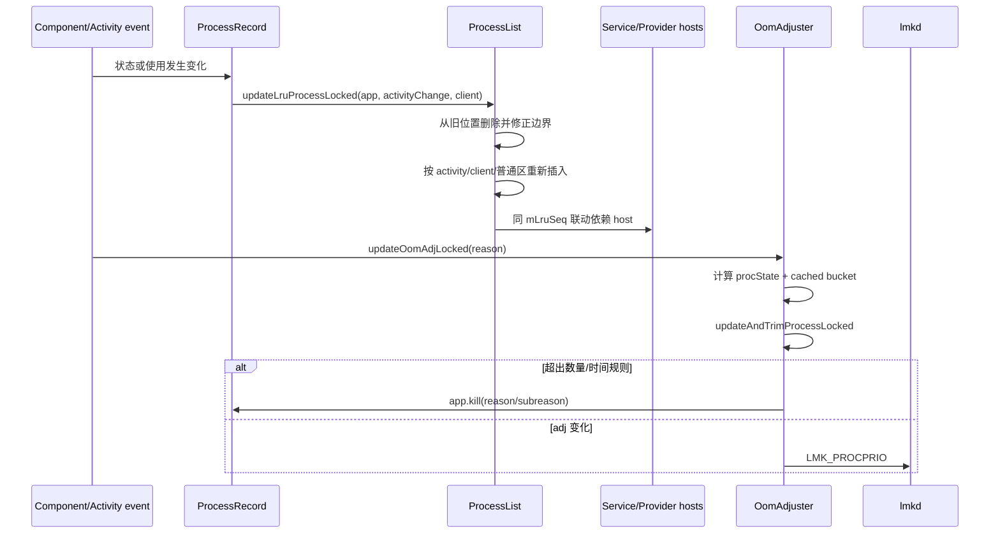

# 109 Android ProcessList LRU：缓存进程排序、裁剪与 AMS 主动回收

> 源码版本：Android 11（`android-11.0.0_r48`）  
> 核心文件：`ProcessList.java`、`OomAdjuster.java`、`ActivityManagerConstants.java`  
> 环境：macOS 只读源码，不需要真正编译。  
> 本章目标：理解 Framework 的进程 LRU 如何维护、依赖进程为何跟随移动、cached activity 与 empty 如何分档，以及 AMS 的数量/时间裁剪与 lmkd 压力回收有何区别。

---

## 1. 先回答：已经有 lmkd，为什么还需要 LRU 裁剪

lmkd 解决的是：

```text
系统出现真实内存压力时，应该牺牲谁？
```

AMS 的 LRU 与 trim 解决的是：

```text
没有严重压力时，Framework 最多愿意保留多少缓存进程？
哪些缓存进程更值得保留？
空进程闲置多久后可以主动清理？
```

二者互补：lmkd 是压力反馈控制，AMS trim 是缓存池治理。

---

## 2. 源码地图

```text
frameworks/base/services/core/java/com/android/server/am/ProcessList.java
frameworks/base/services/core/java/com/android/server/am/OomAdjuster.java
frameworks/base/services/core/java/com/android/server/am/ActivityManagerConstants.java
frameworks/base/services/core/java/com/android/server/am/ProcessRecord.java
frameworks/base/services/core/java/com/android/server/am/ActivityManagerService.java
frameworks/base/core/java/android/app/ApplicationExitInfo.java
```

核心方法：

```text
ProcessList.updateLruProcessLocked
ProcessList.updateLruProcessInternalLocked
ProcessList.updateClientActivitiesOrdering
OomAdjuster.assignCachedAdjIfNecessary
OomAdjuster.updateAndTrimProcessLocked
```

---

## 3. mLruProcesses 的方向

源码注释：

```java
// The first entry in the list is the least recently used.
final ArrayList<ProcessRecord> mLruProcesses;
```

所以：

```text
index 0                              index size-1
最久未使用  ───────────────────────→  最近使用
更适合淘汰                           更值得保留
```

这与有些 cache API 把“头”叫 MRU 的习惯不同。读循环方向前必须先记住这一点。

---

## 4. LRU 不是单纯按时间排序

若只是按 `lastActivityTime` 排序，前台 App 依赖的远端 Service/Provider 可能仍沉在列表底部，随后被错误裁剪。

Android 的列表还编码：

- 是否承载 Activity 或近期 Task。
- 是否拥有 Activity client。
- `treatLikeActivity`。
- Service/Provider 依赖关系。
- 同 UID connection group 和 importance。
- persistent process 特殊处理。

因此它更像“带分区和依赖约束的近似 LRU”。

---

## 5. 两条分界索引

`ProcessList` 保存：

```java
int mLruProcessActivityStart;
int mLruProcessServiceStart;
```

概念图：

```text
[ 低索引普通区 ][ service 区 ][ activity/client 区 ]
                  ^             ^
       mLruProcessServiceStart  mLruProcessActivityStart
```

但这只是字段设计意图；Android 11 的实际实现有重要限制，下一节说明。

---

## 6. Android 11 的 Service 独立分区尚未实现

真实代码：

```java
final boolean hasService = false; // not impl yet. app.services.size() > 0;
```

所以不能根据字段名断言 Android 11 已把所有 service host 放进一个完整独立分区。

实际主要表现为：

```text
普通/非 Activity 区
Activity、recent task、client activity、treatLikeActivity 区
```

`mLruProcessServiceStart` 仍参与插入和边界维护，但 `hasService` 分支当前不可达。这是源码阅读中“注释设计 ≠ 当前实现”的典型例子。

---

## 7. 哪些进程算 hasActivity

```java
final boolean hasActivity =
        app.hasActivitiesOrRecentTasks()
        || app.hasClientActivities()
        || app.treatLikeActivity;
```

注意不只是自己有 Activity：

- 有 recent task 也算。
- 为 Activity client 提供服务的进程也可能进入这一区。
- binding flag 可使进程 `treatLikeActivity`。

这是为了把用户返回路径及其关键依赖一起保留。

---

## 8. activityChange 参数

若进程已经属于 activity 区，但这次更新不是由 Activity 状态变化引起：

```java
if (!activityChange && hasActivity) return;
```

这样普通 Service/Provider 使用不会随意打乱 Activity 进程之间的相对新近顺序。

也就是说，某事件是否有资格改变 LRU 次序，与进程是否最近执行过任意代码不是一回事。

---

## 9. 每次有效更新记录什么

```java
mLruSeq++;
long now = SystemClock.uptimeMillis();
app.lastActivityTime = now;
```

- `mLruSeq` 标识本轮联动更新，防止依赖图重复移动或成环。
- `lastActivityTime` 使用 uptime，与 wall clock 无关。
- 它是 Framework LRU 活动时间，不是用户触摸时间或 Activity 生命周期函数精确时间。

---

## 10. 快速拒绝

若 Activity 进程已在整个列表最后，已是最 MRU，不需要移动。

普通进程若已在普通区最靠新的位置，也无需移动。

这不仅节省 `ArrayList.remove/add`，还避免无意义改变依赖进程次序。

---

## 11. persistent process 不关心精确位置

```java
if (app.isPersistent() && lrui >= 0) return;
```

persistent 进程由更强生存策略保护，通常不会按普通 cached LRU 裁剪。因此只需在列表中，无需每次使用都移动。

“不移动”不表示完全不参与 ProcessRecord 管理或 OomAdjuster。

---

## 12. 移除旧位置时必须修正边界

```java
if (lrui < mLruProcessActivityStart) mLruProcessActivityStart--;
if (lrui < mLruProcessServiceStart) mLruProcessServiceStart--;
mLruProcesses.remove(lrui);
```

因为删除发生在分界之前时，后面的索引都左移一格。

LRU bug 经常不是业务条件错，而是 remove/add 后边界索引没有同步。

---

## 13. 自己有 Activity/近期 Task 的进程放哪里

它被添加到列表尾部：

```java
mLruProcesses.add(app);
```

也就是 activity 区最 MRU。

这表示最近由 Activity 操作使用，通常最值得缓存，并不代表其当前一定是 `PROCESS_STATE_TOP`。

---

## 14. 只有 Activity client 的进程

若进程自身无 Activity/近期 Task，但 `hasClientActivities()`：

```text
把它放入 activity 区
但尽量位于绑定它的同 UID Activity 进程下方
```

原因：它对 UI 很重要，但不应该比真正承载 Activity 的 client 更“新”。

---

## 15. 普通进程的插入点

在 Android 11 `hasService=false` 的实际路径中，普通进程插到：

```java
int index = mLruProcessServiceStart;
```

即普通区最 MRU 的边界附近，而不会越过 activity 区。

如果调用者提供 `client`，还要保证它不能被移动到 client 之上。

---

## 16. 为什么依赖 host 不能比 client 更新

```text
client 使用 service/provider
```

host 的“最近使用”来自 client 的需求，不是自身独立用户交互。让 host 排在 client 之上，会在裁剪时把原因方先杀、结果方后留，次序反常。

所以源码用 client index 给 host 的上移设置天花板。

---

## 17. 更新后还会联动 Service host

移动 `app` 后遍历：

```java
app.connections
```

对活着、非 persistent、尚未在本轮移动，且没有 reduction flags 的 service host，调用：

```text
updateLruProcessInternalLocked(host, ..., srcApp=app)
```

这把依赖 host 拉到 client 附近，但不会越过保护边界。

---

## 18. BIND_REDUCTION_FLAGS

代码要求：

```java
(cr.flags & Context.BIND_REDUCTION_FLAGS) == 0
```

有削弱优先级传播语义的 binding，不应仅因 client 使用就获得完整 LRU 提升。

它与第 108 章的 adj 传播理念一致：依赖边是有策略的，不是所有 Binder 引用都等价。

---

## 19. Provider host 也会联动

遍历：

```java
app.conProviders
```

只要 provider host 存活、非 persistent 且本轮没移动，就随 client 向 MRU 方向调整。

Provider 通常是同步依赖；只留 client 不留其数据提供者，缓存价值会显著降低。

---

## 20. updateLruProcessInternalLocked 的四道保护

内部移动依赖进程前检查：

1. host 自己有 Activity/近期 Task时不动。
2. host 不在 LRU 时记 `wtf`，不偷偷新增。
3. host 已经比目标位置更新时不向后移动。
4. 不跨越 activity 分区把 Activity host 拉入普通区。

因此联动只会安全地“拉新”，不会因 client 更新反而让依赖变旧。

---

## 21. lruSeq 防依赖环

Service/Provider 依赖可能成环。每轮更新先递增 `mLruSeq`，移动后写：

```java
app.lruSeq = mLruSeq;
```

后续只处理 `host.lruSeq != mLruSeq` 的节点。

这与 OomAdjuster 的 cycle 固定点不同：LRU 只需避免同一轮重复搬动，不需要求多维优先级固定点。

---

## 22. connectionGroup 解决多进程刷榜

一个 App 可创建多个为 Activity client 服务的进程。如果每个都紧挨 MRU 顶部，就会挤走其他 App，形成缓存不公平。

Framework 用：

```text
connectionGroup
connectionImportance
UID
```

把同组进程相邻排序，并在组外穿插其他 App 的条目。

---

## 23. updateClientActivitiesOrdering

这个方法完成两件事：

```text
同 UID、同 connectionGroup
  → 按 connectionImportance 保持组内顺序

同一 UID 的多个旧 activity-client 进程
  → 与其他 App 的条目适当交错
```

它不是简单 sort comparator，而是在指定区间内原地搬移，尽量保持不同 App 既有相对顺序。

---

## 24. LRU 与 OOM adj 的关系

LRU 不是最终 kill score，但会影响：

- cached activity/empty 的 900～999 档位。
- cached/empty 数量裁剪遍历次序。
- previous/cached 进程保留概率。

```text
组件事实 → procState 类别
LRU 次序 → cached 类别内部的细分 adj
adj → lmkd 压力下 victim 顺序
```

---

## 25. cached activity 与 empty

代表性区别：

```text
CACHED_ACTIVITY
  进程保留停止 Activity/近期 UI 状态，返回价值高

CACHED_EMPTY
  没有可保留的 Activity 状态或重要活跃组件，只留热进程壳
```

两者都可能被随时回收，但 cached activity 通常更值得保留。

---

## 26. assignCachedAdjIfNecessary

基础 OomAdjuster 先把未决定具体缓存档的进程留在 `UNKNOWN_ADJ`，全体状态算完后再统一分配：

```text
cached activity 系列：从 900 起分档
empty/其他 cached：从更靠后的档起分配
```

遍历从列表尾部到头部，即先给最近使用者较小、更受保护的 adj。

---

## 27. 缓存档不是每个进程一个值

`mNumSlots` 与 factor 会把多个进程放进同一层，再逐步增加 adj。

原因：合法 cached 范围有限，而进程数可变化；分 bucket 比硬要求唯一 adj 更稳定。

同档最终由 lmkd 的 LRU/RSS 策略进一步选择。

---

## 28. activity 与 empty 交错使用 adj 空间

源码初始化：

```text
curCachedAdj = CACHED_APP_MIN_ADJ
curEmptyAdj  = CACHED_APP_MIN_ADJ + CACHED_APP_IMPORTANCE_LEVELS
每次跃迁增加 IMPORTANCE_LEVELS × 2
```

这使 cached activity 与 empty 使用交错档位，整体上让近期有 UI 状态的进程更受保护。

最终都被夹在 `900..999`。

---

## 29. cached recent 也按 activity 类处理

adj 分配 switch 包含：

```text
CACHED_ACTIVITY
CACHED_ACTIVITY_CLIENT
CACHED_RECENT
```

但后续数量裁剪统计主要显式处理前两者；不同 procState 在“分 adj”和“计配额”阶段的分类不必完全一样。

读源码时要按具体 switch 看，不能用一个笼统 cached 分类覆盖所有阶段。

---

## 30. connectionGroup 对 adj 分配也有影响

同 UID、同组的相邻 cached activity client 不完全按独立 slot 计；`connectionImportance` 可在当前 cached 档内微调 adj。

这既让组内关键进程更受保护，也避免一个多进程组件组把所有全局 bucket 都占满。

LRU grouping 和 adj grouping 是同一公平目标的两个步骤。

---

## 31. 默认最多保留多少 cached

Android 11：

```java
DEFAULT_MAX_CACHED_PROCESSES = 32;
```

运行时：

```text
CUR_MAX_CACHED_PROCESSES
```

可由 DeviceConfig `max_cached_processes` 或测试 override 改变，所以 32 是平台默认，不是每台设备永恒常量。

---

## 32. empty 配额如何算

```java
computeEmptyProcessLimit(totalProcessLimit) {
    return totalProcessLimit / 2;
}
```

默认 32 时：

```text
emptyProcessLimit = 16
cached activity limit = 32 - 16 = 16
```

整数除法向下取整。这里的 cached 总额只约束缓存后台进程，不把 visible、service、foreground 等全部算入 32。

---

## 33. 常量注释给出的重要边界

`ActivityManagerConstants` 明确说最大 cached 数只是防止大内存设备无限保留进程；内存紧张设备应由 OOM killer/lmkd 按需要回收，不能依赖这个上限解决压力。

所以：

```text
32 ≠ 系统最多运行 32 个 App 进程
32 ≠ 第 33 个进程必定立刻死
32 = 默认缓存池治理上限
```

---

## 34. trim 阈值与 override 不完全绑定

更新最大 cached 时：

```text
CUR_MAX_CACHED_PROCESSES 使用 override/DeviceConfig
CUR_MAX_EMPTY_PROCESSES 由当前上限一半计算

CUR_TRIM_EMPTY_PROCESSES
CUR_TRIM_CACHED_PROCESSES
仍按原始 MAX_CACHED_PROCESSES 计算
```

源码注释解释：即使额外强制改变保留上限，也希望“何时开始内存 trim”的基准保持一致。

数量 kill threshold 与 memory trim threshold 不是一个东西。

---

## 35. updateAndTrimProcessLocked 的遍历方向

```java
for (int i = numLru - 1; i >= 0; i--)
```

它从 MRU 到 LRU 计数。前面的新进程先消耗配额，越靠旧端越容易成为超额的第 N+1 个并被 kill。

若从 LRU 开始计数，反而会保留最旧进程，逻辑将完全相反。

---

## 36. cached activity 数量裁剪

对：

```text
CACHED_ACTIVITY
CACHED_ACTIVITY_CLIENT
```

递增 `numCached`。若：

```java
(numCached - numCachedExtraGroup) > cachedProcessLimit
```

则：

```text
reason = REASON_OTHER
subreason = SUBREASON_TOO_MANY_CACHED
```

它不是 `REASON_LOW_MEMORY`，因为是 AMS 配额策略主动杀。

---

## 37. 同 connectionGroup 不重复占满配额

连续的同 UID、同 group 条目会增加 `numCachedExtraGroup`，从有效计数中扣除。

这不是说组内进程完全免费；它依赖 LRU 中相邻排列，并且其他规则仍可回收它们。目标是把一个协同多进程组近似视作一个缓存单元。

---

## 38. empty 的两种数量/时间裁剪

```text
规则 A：老空进程
numEmpty > CUR_TRIM_EMPTY_PROCESSES
且 lastActivityTime < now - MAX_EMPTY_TIME
→ SUBREASON_TRIM_EMPTY

规则 B：数量超限
否则 numEmpty++
若 numEmpty > CUR_MAX_EMPTY_PROCESSES
→ SUBREASON_TOO_MANY_EMPTY
```

时间规则优先检查，数量规则在 else 分支。

---

## 39. MAX_EMPTY_TIME

Android 11：

```java
static final long MAX_EMPTY_TIME = 30 * 60 * 1000;
```

即 30 分钟 uptime。

但不是所有空进程到 30 分钟必杀：还要求前面已遇到的 empty 数超过 `CUR_TRIM_EMPTY_PROCESSES`。系统会保留一批老 empty 作为启动缓存。

---

## 40. `numEmpty > trimThreshold` 的 off-by-one 语义

检查发生在递增 `numEmpty` 之前。

默认：

```text
CUR_TRIM_EMPTY_PROCESSES = 8
```

只有此前已经保留超过 8 个 empty，后续又遇到超过 30 分钟的旧 empty 才走时间裁剪。精确边界要按循环顺序理解，不能仅凭变量名猜“第 8 个”。

---

## 41. 被 kill 后为什么仍继续 switch 后逻辑

`app.kill()` 标记 `killedByAm` 并发起终止，但函数本轮仍可能继续执行少量逻辑。进程真正死亡与从 LRU 移除是异步过程。

因此遍历依赖开头的：

```text
!app.killedByAm && app.thread != null
```

防止下一轮把正在死亡的记录当活进程再次处理。

---

## 42. isolated process 的额外裁剪

若：

```text
app.isolated
没有 running service
isolatedEntryPoint == null
```

AMS 会主动 kill：

```text
SUBREASON_ISOLATED_NOT_NEEDED
```

isolated process 的 UID/进程通常不可复用；承载任务已消失后保留热壳价值较低。

---

## 43. LRU 删除发生在哪里

发 kill signal 并不在 `updateAndTrimProcessLocked()` 中同步删除所有 ProcessRecord。真实 death 经 Binder/zygote 清理路径进入 `removeProcessNameLocked` 等，再从 LRU 和映射表移除并修正分界。

这避免把“已请求 kill”误当“kernel 已确认死亡”。

---

## 44. lastActivityTime 不等于 Activity 最后可见时间

它会在 `updateLruProcessLocked()` 和依赖内部移动时更新。

因此可能表示：

- Activity/近期 Task 活动。
- client 使用 Service/Provider 导致 host 被联动。
- Framework 认为进程缓存价值被刷新。

它适合 LRU 和 empty aging，不适合当用户行为审计时间。

---

## 45. uptime 的好处

`SystemClock.uptimeMillis()` 不受用户改时间、NTP 或时区影响，适合进程内相对超时。

设备深度睡眠期间 uptime 通常不前进，所以“30 分钟 empty”更接近设备运行时间，而不是墙钟过去半小时。

这与 `elapsedRealtime` 的是否含 deep sleep 边界不同。

---

## 46. AMS trim 的退出历史

第 106 章的 `ApplicationExitInfo` 会保留：

```text
REASON_OTHER + TOO_MANY_CACHED
REASON_OTHER + TOO_MANY_EMPTY
REASON_OTHER + TRIM_EMPTY
REASON_OTHER + ISOLATED_NOT_NEEDED
```

这比只看到 SIGKILL 更有策略语义。排障时应同时读 reason 和 subreason。

---

## 47. 与 lmkd 的完整对照

| 维度 | AMS LRU trim | lmkd |
|---|---|---|
| 触发 | OomAdjuster 完整或局部更新后的统一缓存治理 | PSI/vmpressure 与内存统计 |
| 依据 | procState、LRU、数量、闲置时间 | adj、watermark、swap、reclaim、thrashing |
| victim | 超出配额的旧 cached/empty | 当前允许 adj 中的 LRU/最重进程 |
| 原因 | OTHER + 具体 subreason | LOW_MEMORY |
| 是否需真实压力 | 不需要 | 需要压力证据 |
| 目标 | 控制热缓存规模 | 恢复整机内存响应性 |

---

## 48. LRU 与 lmkd 的 LRU 不是同一列表

Framework `mLruProcesses` 是包含组件语义、分区与依赖联动的 Java 列表。

lmkd 为每个 adj slot 维护自己的 native process list，接收 `LMK_PROCPRIO` 后更新；同档可取 slot LRU 尾或 heaviest。

两份数据相关但不共享对象，也不保证事件瞬间完全同步。

---

## 49. 一个默认 32 的例子

假设当前：

```text
20 个 cached activity/client
18 个 cached empty
其他 visible/service 不计 cached 总限额
```

默认有效上限：

```text
cached activity 约 16 个
empty 约 16 个
```

从 MRU 向 LRU 计数：较新的 16 个各自类别优先留下，旧端超额者被 AMS kill。若存在同 connectionGroup，cached activity 的有效计数会扣减，结果可能多留几个协同进程。

---

## 50. 为什么不只留下 Activity 进程

empty process 虽无组件状态，但保留：

- 已加载的 runtime 和 classes。
- 进程初始化结果。
- 下一组件启动可复用的进程壳。

保留适量 empty 能降低冷启动成本；保留太多则浪费内存，所以单独给一半配额和 aging 规则。

---

## 51. 为什么不无限留下大内存设备的缓存

即使 RAM 足够，过多进程仍增加：

- kernel task/cgroup/页表开销。
- system_server ProcessRecord 与 observer 开销。
- 广播、配置、包变化等扇出成本。
- 状态维护复杂度。

最大 cached 上限是系统规模控制，不只是 RAM 阈值。

---

## 52. LRU 不是严格全序的原因

在约束下，某些进程不能按纯时间移动：

- persistent 不移动。
- Activity 区只有 activityChange 才重排。
- dependency host 不能越过 client。
- connection group 需聚合和穿插。
- 不允许依赖移动跨 activity 边界。

所以“index 更大”代表综合意义上更值得保留，不一定表示它的最后一次 CPU 执行更晚。

---

## 53. 常见误解一——列表头是最近使用

Android 11 注释明确：first entry 是 least recently used。

```text
0 = 旧
size-1 = 新
```

`updateAndTrim` 从尾到头是先给新进程配额，再杀旧端超额者。

---

## 54. 常见误解二——service 区已经完整实现

字段和注释看起来像三段，但真实代码 `hasService=false // not impl yet`。

学习特定版本时，必须同时看声明和可达分支。不能用后来版本文档倒推 Android 11。

---

## 55. 常见误解三——cached 上限限制所有进程

常量注释明确只适用于 cached background process。Foreground、visible、service 等不计入这个 cached limit。

系统总进程数可以明显高于 32。

---

## 56. 常见误解四——30 分钟后所有 empty 都死

还要满足前面已保留的 empty 数超过 trim threshold。前一批 empty 可继续保留；内存压力也可能让 lmkd 更早回收。

30 分钟是 AMS 时间裁剪条件之一，不是 TTL 保证。

---

## 57. 常见误解五——LRU move 就会立即改变 adj

`updateLruProcessLocked()` 只维护次序与时间。具体 cached adj 要在 OomAdjuster 的计算/分 bucket 阶段更新，再 apply 给 lmkd。

```text
LRU moved
≠ curAdj already recomputed
≠ setAdj already sent
≠ lmkd already applied
```

---

## 58. 常见误解六——被 AMS trim 就说明设备低内存

`TOO_MANY_CACHED/EMPTY` 只说明缓存池超过 Framework 配额；设备当时可能仍有大量可用内存。

只有结合 `REASON_LOW_MEMORY`、lmkd stats、PSI 等证据才能判断真实压力。

---

## 59. 常见误解七——最近执行后台任务就能刷新 Activity LRU

已有 Activity 的进程若 `activityChange=false` 会提前 return，普通后台事件不应随意把它放到 activity 区最 MRU。

这是防止后台工作伪装成用户最近访问。

---

## 60. LRU 更新时序图



---

## 61. 删除与插入的索引例子

初始：

```text
0 oldA | 1 oldB | 2 boundary | 3 actC | 4 actD
```

若删除 index 1，原 boundary 会移到 index 1。因此删除前若 `lrui < boundary`，boundary 必须 `--`。

重新插入普通区又会让两个 boundary `++`。这就是代码中看似繁琐的索引维护来源。

---

## 62. 进程死亡竞态

LRU 更新、OomAdjuster compute、apply 和真实 death 都在不同阶段。代码普遍检查：

```text
app.thread != null
!app.killedByAm
进程仍在 mLruProcesses
```

即便持有 AMS 锁，kernel 进程也可能已经死亡，Binder death 清理只是尚未完成。

---

## 63. 数据一致性依赖 AMS 锁

LRU 更新方法标注 `@GuardedBy("mService")`。列表、分界、ProcessRecord connection 与 procState 必须在同一锁下观察。

否则两个线程同时 remove/add 会破坏：

- 边界索引。
- `lastIndexOf` 结果。
- connection group 相邻性。
- trim 的 MRU→LRU 计数。

---

## 64. 为什么 ArrayList 仍可接受

移动中间元素是 O(n)，但它提供紧凑存储、按 index 分区、反向扫描和局部重排便利。

Android 把性能控制放在：

- 快速拒绝。
- 不随普通事件重排 activity 区。
- `lruSeq` 避免依赖重复。
- cached 数量有界。

不能仅凭算法复杂度断言必须改成 LinkedList；后者随机索引和 cache locality 更差。

---

## 65. 排障：为什么某进程被 TOO_MANY_CACHED 杀

检查：

```text
1. 当时 curProcState 是否 CACHED_ACTIVITY/CLIENT？
2. 它在 mLruProcesses 中的位置？
3. CUR_MAX_CACHED_PROCESSES 与 emptyProcessLimit 实际值？
4. 同 UID connectionGroup 是否正确相邻？
5. 最近 Activity 事件是否用 activityChange=true 更新？
6. 是否有 client/provider 应联动却被 reduction flags 跳过？
7. AppExitInfo subreason 是否确实 TOO_MANY_CACHED？
```

不要先把它归因于 lmkd。

---

## 66. 排障：为什么 empty 长时间没被杀

可能是正常：

- 前面 empty 数未超过 `CUR_TRIM_EMPTY_PROCESSES`。
- uptime 未累计 30 分钟。
- 依赖使用刷新了 `lastActivityTime`。
- 尚未发生下一次 OomAdjuster 更新。r48 即使只重算一组可达进程，随后也会让 `updateAndTrimProcessLocked()` 扫描整张 `mLruProcesses`。
- 它的 procState 并非 CACHED_EMPTY。

时间条件不会自己创建定时器准点杀；它在后续 OomAdjuster 更新所带的 trim 遍历中被检查。这里容易被方法注释误导：`updateOomAdjLockedInner()` 的 `processes` 可以是局部列表，但 `updateAndTrimProcessLocked()` 仍直接读取完整的 `mLruProcesses`。

---

## 67. macOS 只读练习一：画出列表方向

```bash
cd /Users/ninebot/androidSource

sed -n '440,465p' \
  frameworks/base/services/core/java/com/android/server/am/ProcessList.java

sed -n '3270,3460p' \
  frameworks/base/services/core/java/com/android/server/am/ProcessList.java
```

在纸上标记 index 0、两个 boundary、size-1，并模拟 Activity 和普通进程各移动一次。

---

## 68. macOS 只读练习二：确认 service 分区边界

```bash
rg -n 'hasService|mLruProcessServiceStart|mLruProcessActivityStart' \
  frameworks/base/services/core/java/com/android/server/am/ProcessList.java
```

回答：哪些分支在 Android 11 实际可达？字段的设计意图与当前实现有哪些差异？

---

## 69. macOS 只读练习三：追依赖联动

```bash
sed -n '3045,3090p' \
  frameworks/base/services/core/java/com/android/server/am/ProcessList.java

sed -n '3450,3495p' \
  frameworks/base/services/core/java/com/android/server/am/ProcessList.java
```

分别记录 Service 与 Provider host 的过滤条件，并解释 `lruSeq` 如何防环。

---

## 70. macOS 只读练习四：追 group 公平

```bash
sed -n '3090,3270p' \
  frameworks/base/services/core/java/com/android/server/am/ProcessList.java

rg -n 'connectionGroup|connectionImportance' \
  frameworks/base/services/core/java/com/android/server/am/{ProcessRecord.java,ActiveServices.java}
```

画三个同 UID 进程和两个其他 App，模拟“聚组但不霸榜”的排列目标。

---

## 71. macOS 只读练习五：算默认配额

```bash
sed -n '88,100p' \
  frameworks/base/services/core/java/com/android/server/am/ActivityManagerConstants.java

sed -n '310,335p' \
  frameworks/base/services/core/java/com/android/server/am/ActivityManagerConstants.java

sed -n '495,510p' \
  frameworks/base/services/core/java/com/android/server/am/ActivityManagerConstants.java
```

用默认 32 算出 max empty、cached activity limit、trim empty threshold，并说明哪项可随 override 改变。

---

## 72. macOS 只读练习六：追 cached adj

```bash
sed -n '685,815p' \
  frameworks/base/services/core/java/com/android/server/am/OomAdjuster.java
```

回答：

1. 为什么从 `numLru-1` 向 0？
2. cached activity 和 empty 如何交错分档？
3. connection group 如何修改 slot 消耗？
4. `UNKNOWN_ADJ` 为什么不能直接下发？

---

## 73. macOS 只读练习七：追主动 kill

```bash
sed -n '810,890p' \
  frameworks/base/services/core/java/com/android/server/am/OomAdjuster.java

rg -n 'SUBREASON_(TOO_MANY_CACHED|TOO_MANY_EMPTY|TRIM_EMPTY|ISOLATED_NOT_NEEDED)' \
  frameworks/base/core/java/android/app/ApplicationExitInfo.java
```

为四种 kill 写出触发条件，并与 `REASON_LOW_MEMORY` 做对照。

---

## 74. 第二次复读：四种“新旧”不要混

```text
LRU index
  综合缓存价值的新旧

lastActivityTime
  最近被 LRU 逻辑刷新时间

procState
  当前组件语义等级

adj
  内存压力下牺牲等级
```

它们互相影响，但没有一一对应。一个时间更近的普通 empty 仍可能比稍旧的 cached activity 更容易牺牲。

---

## 75. 第二次复读：三种“上限”不要混

```text
CUR_MAX_CACHED_PROCESSES
  cached 总治理上限

CUR_MAX_EMPTY_PROCESSES
  empty 子配额

CUR_TRIM_EMPTY/CACHED_PROCESSES
  内存 trim/老 empty 检查阈值
```

此外 lmkd 的 minfree/PSI 阈值是另一套压力配置，完全不是缓存数量上限。

---

## 76. 第二次复读：kill 的四个完成点

```text
OomAdjuster 判断超额
  ↓
ProcessRecord.kill 标记 killedByAm 并发请求
  ↓
kernel 进程真正退出
  ↓
AMS death cleanup 从 LRU/映射移除并完成 AppExitInfo
```

遍历中看到 `app.kill()` 后列表大小不立即减少是正常的异步语义。

---

## 77. 本章检查题

1. `mLruProcesses` 哪一端是 MRU？
2. 为什么它不是纯时间排序？
3. Android 11 的 service 独立分区实际实现到什么程度？
4. `activityChange=false` 为什么不能重排 Activity 进程？
5. Service/Provider host 为什么跟 client 移动但不能越过 client？
6. `lruSeq` 与 `mAdjSeq` 分别解决什么问题？
7. cached activity 与 empty 如何分配 adj bucket？
8. 默认 32 是否限制所有进程？
9. 30 分钟 empty 条件为何不是 TTL？
10. 如何从 AppExitInfo 区分 AMS trim 与 lmkd kill？

---

## 78. 本章结论

Android 11 的 ProcessList LRU 是 Framework 缓存进程治理的骨架：

```text
Activity/组件使用
  → 带分区约束的 LRU 更新
  → Service/Provider host 有界联动
  → connectionGroup 防多进程霸榜
  → OomAdjuster 按 MRU→LRU 分 cached adj bucket
  → 全量 trim 从新到旧消耗 cached/empty 配额
  → 旧端超额或长期闲置进程由 AMS 主动 kill
  → reason/subreason 写入 ApplicationExitInfo
```

最重要的四个结论：

1. index 0 是 LRU，列表尾是 MRU。
2. Android 11 的 `hasService` 独立分区仍未实现，不能被字段名误导。
3. cached 数量上限治理热进程池，不代表设备正在低内存，也不限制所有进程。
4. AMS trim、lmkd 压力 kill、signal 发送和 death cleanup 是不同机制与完成点。

下一章将继续精读进程真正死亡后的清理：`appDiedLocked`、`handleAppDiedLocked`、ProcessRecord/Service/Provider/Receiver/Activity 状态如何拆除，何时重启 persistent 或 started service，以及 Binder death 与 zygote 消息如何去重。
