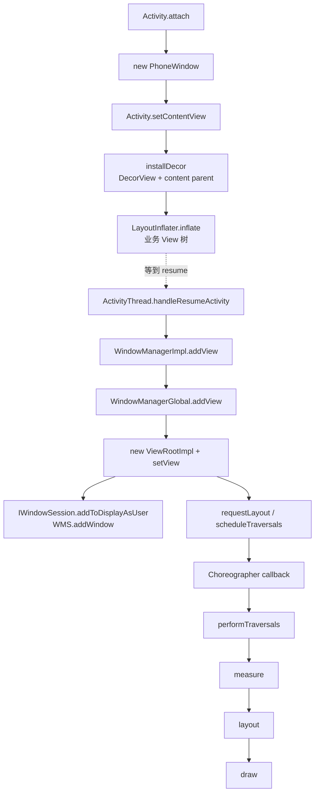
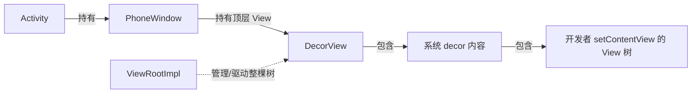
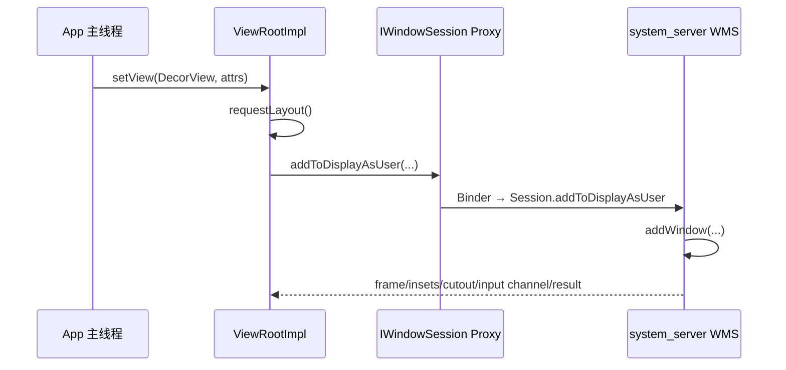
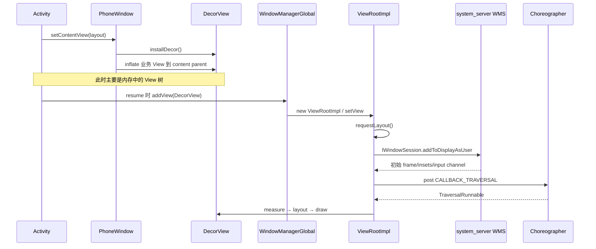
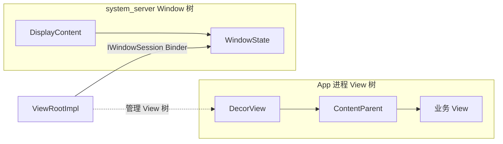

# 11 View 到 Window：DecorView、WindowManager 与 ViewRootImpl

## 本章边界

第 10 章已经到达：

```text
Activity.onCreate()
 → Activity.onStart()
 → Activity.onResume()
```

但 `onCreate()` 里调用 `setContentView()` 并不代表页面已经显示。本章追踪：

```text
Activity.attach 创建 PhoneWindow
 → setContentView 建立 View 树
 → resume 时 WindowManager.addView
 → ViewRootImpl.setView
 → WMS.addWindow
 → Choreographer 调度 traversal
 → measure / layout / draw
```

本章重点是 App/Framework 侧如何把 View 树接入窗口系统。Surface、BufferQueue、RenderThread、SurfaceFlinger 和屏幕合成在第 12 章继续。

## 本章目标

读完后，你应该能够：

1. 区分 Activity、Window、PhoneWindow、DecorView、普通 View。
2. 解释 `setContentView()` 到底把布局放到了哪里。
3. 解释为什么 `setContentView()` 时 View 通常还没有 ViewRootImpl。
4. 从 `handleResumeActivity()` 追到 `WindowManagerGlobal.addView()`。
5. 解释 ViewRootImpl 的角色，以及为什么它不是 View。
6. 看懂 App 如何通过 IWindowSession 请求 WMS 添加窗口。
7. 解释 `requestLayout → scheduleTraversals → Choreographer → performTraversals`。
8. 区分 measure、layout、draw，以及 requestLayout 与 invalidate。
9. 区分 View、Window 与 Surface。

## 1. 先看完整路线



整个过程有两个明显阶段：

```text
onCreate 阶段：在内存里搭 View 树
onResume 附近：把 DecorView 作为窗口根 View 接入 WindowManager/ViewRootImpl/WMS
```

## 2. 五个核心概念先分清

| 概念 | 是什么 | 不是什么 |
|---|---|---|
| Activity | 组件与生命周期控制对象 | 不是 View 容器本身 |
| Window | 一个顶层窗口的抽象、属性与回调契约 | 不是屏幕像素缓冲区 |
| PhoneWindow | Activity 常用的 Window 具体实现 | 不是 system_server 的 WindowState |
| DecorView | PhoneWindow 的顶层 ViewGroup | 不是 ViewRootImpl |
| ViewRootImpl | View 树与 WindowManager/WMS/Input/渲染调度的桥 | 不是 View，也不在 View 树中 |



## 3. Activity.attach 创建 PhoneWindow

源码：

```text
/Users/ninebot/androidSource/frameworks/base/core/java/android/app/Activity.java
```

第 10 章中，ActivityThread 反射创建 Activity 后调用 `Activity.attach()`：

```java
mWindow = new PhoneWindow(
        this, window, activityConfigCallback);
mWindow.setWindowControllerCallback(
        mWindowControllerCallback);
mWindow.setCallback(this);
mWindow.getLayoutInflater()
        .setPrivateFactory(this);
```

这里建立：

- Activity → PhoneWindow 持有关系。
- Window callback → Activity，用于按键、菜单、内容变化等回调。
- LayoutInflater private factory → Activity，支持某些 View 创建定制。

## 4. WindowManager 也在 attach 中建立

```java
mWindow.setWindowManager(
        (WindowManager) context.getSystemService(
                Context.WINDOW_SERVICE),
        mToken,
        mComponent.flattenToString(),
        hardwareAccelerated);

mWindowManager = mWindow.getWindowManager();
```

传入的 `mToken` 是 Activity token。之后把窗口添加到 WMS 时，系统用 token 验证该窗口属于哪个 Activity/WindowToken。

这也是 BadTokenException 常见根源之一：客户端使用了无效、过期或不适用于该窗口类型的 token。

## 5. Activity.setContentView 只是委托

Activity 的 `setContentView()` 最终委托给 Window：

```java
getWindow().setContentView(layoutResID);
```

实际实现位于：

```text
frameworks/base/core/java/com/android/internal/policy/PhoneWindow.java
```

```java
public void setContentView(int layoutResID) {
    if (mContentParent == null) {
        installDecor();
    } else if (!hasFeature(FEATURE_CONTENT_TRANSITIONS)) {
        mContentParent.removeAllViews();
    }

    mLayoutInflater.inflate(
            layoutResID, mContentParent);
    mContentParent.requestApplyInsets();
    getCallback().onContentChanged();
}
```

## 6. `installDecor()` 做两件事

```java
if (mDecor == null) {
    mDecor = generateDecor(-1);
}

if (mContentParent == null) {
    mContentParent = generateLayout(mDecor);
}
```

### 生成 DecorView

```java
return new DecorView(
        context, featureId, this, getAttributes());
```

DecorView 继承 FrameLayout，是 Window 顶层 ViewGroup。

### 生成系统 decor 布局

`generateLayout()` 读取主题和 Window feature：

- 是否有标题栏/ActionBar。
- 是否浮动窗口。
- 是否全屏。
- 状态栏/导航栏相关属性。
- 背景、动画、颜色。
- content transitions。

然后选择并 inflate 一份系统 decor 布局，再从中找到 `android.R.id.content` 对应的内容容器作为 `mContentParent`。

## 7. 开发者布局不是 DecorView 本身

假设：

```java
setContentView(R.layout.activity_main);
```

常见层级是：

```text
DecorView
 └─ 系统 decor 布局
     ├─ 状态栏/标题/ActionBar 相关区域（取决于主题）
     └─ content parent（ID: android.R.id.content）
         └─ activity_main 根 View
             └─ 开发者子 View...
```

所以 `findViewById()` 能从 Activity 找到业务 View，是因为 Activity 委托 Window 在 DecorView 整棵树中查找。

## 8. LayoutInflater 做什么

`LayoutInflater.inflate()` 读取 XML，递归完成：

1. 解析标签。
2. 通过 ClassLoader/Factory 创建 View 对象。
3. 读取 AttributeSet。
4. 创建 LayoutParams。
5. 递归创建子 View。
6. 把根/子 View 加入对应 ViewGroup。

这时得到的是 Java 对象组成的 View 树。XML 不会被系统直接“画到屏幕”。

## 9. `setContentView()` 完成时发生了什么

通常已经完成：

- PhoneWindow 存在。
- DecorView 和 content parent 存在。
- 业务布局 View 对象已 inflate。
- View 父子关系已建立。
- 主题和部分 Window 属性已应用。

通常尚未完成：

- DecorView 加入 WindowManager。
- ViewRootImpl 创建与 attach。
- WMS 接收 addWindow。
- 确定最终窗口 frame/insets。
- measure/layout/draw。
- Surface 缓冲区提交。
- SurfaceFlinger 合成显示。

## 10. 为什么 onCreate 中宽高常为 0

`setContentView()` 后 View 树还没经历首次 traversal。View 的最终尺寸依赖：

- WMS 给出的窗口 frame。
- display、Insets、cutout。
- 父 View MeasureSpec。
- sibling/子 View 的测量结果。
- LayoutParams。

所以在 `onCreate()` 立即调用 `view.getWidth()` 常得到 0。

可根据目的使用：

- `View.post {}`：等消息队列后续执行，但仍要确认是否已布局。
- `doOnLayout`/OnLayoutChangeListener。
- `ViewTreeObserver.OnGlobalLayoutListener`。
- 自定义 View 的 `onSizeChanged()`。

不要用任意固定 delay 猜测布局完成时间。

## 11. View 什么时候真正接入窗口

第 10 章的 ResumeActivityItem 最终进入：

```text
ActivityThread.handleResumeActivity()
```

源码：

```text
frameworks/base/core/java/android/app/ActivityThread.java
```

它先执行 Activity resume，然后在窗口尚未添加时：

```java
View decor = r.window.getDecorView();
decor.setVisibility(View.INVISIBLE);

ViewManager wm = a.getWindowManager();
WindowManager.LayoutParams l =
        r.window.getAttributes();

l.type = TYPE_BASE_APPLICATION;

if (!a.mWindowAdded) {
    a.mWindowAdded = true;
    wm.addView(decor, l);
}
```

关键入口不是 `setContentView()`，而是 resume 附近的 `WindowManager.addView(decor, layoutParams)`。

## 12. 为什么先设 INVISIBLE 再添加

窗口加入、首次布局和绘制需要时间。先不可见地建立结构，等系统确认允许可见并完成必要状态后再显示，可避免展示未准备好的中间画面。

后续 `makeVisible()` 会协调 DecorView 可见性。

## 13. WindowManager 是接口

`WindowManager` 继承 ViewManager，公开：

```java
addView(view, params)
updateViewLayout(view, params)
removeView(view)
```

Activity 获得的常见实现是 `WindowManagerImpl`。它是轻量包装，持有：

- Context/Display。
- parent Window。
- 进程级 `WindowManagerGlobal`。

## 14. WindowManagerImpl：补上下文再转发

源码：

```text
frameworks/base/core/java/android/view/WindowManagerImpl.java
```

```java
public void addView(View view,
        ViewGroup.LayoutParams params) {
    applyDefaultToken(params);
    mGlobal.addView(
            view, params,
            mContext.getDisplayNoVerify(),
            mParentWindow,
            mContext.getUserId());
}
```

它补充默认 token、Display、父 Window 和 userId，然后交给 WindowManagerGlobal。

## 15. WindowManagerGlobal：进程内窗口总表

源码：

```text
frameworks/base/core/java/android/view/WindowManagerGlobal.java
```

它是进程级单例，维护平行集合：

```java
mViews   // 每个窗口的根 View，Activity 通常为 DecorView
mRoots   // 对应 ViewRootImpl
mParams  // 对应 WindowManager.LayoutParams
```

概念关系：

```text
index 0: DecorView A ↔ ViewRootImpl A ↔ LayoutParams A
index 1: Dialog Decor ↔ ViewRootImpl B ↔ LayoutParams B
index 2: Popup root  ↔ ViewRootImpl C ↔ LayoutParams C
```

一个进程可以同时拥有多个窗口，因此也可以有多个 ViewRootImpl。

## 16. `WindowManagerGlobal.addView()`

核心代码：

```java
ViewRootImpl root =
        new ViewRootImpl(view.getContext(), display);

view.setLayoutParams(wparams);

mViews.add(view);
mRoots.add(root);
mParams.add(wparams);

root.setView(
        view, wparams,
        panelParentView, userId);
```

这里创建了本窗口的 ViewRootImpl，并将 DecorView 交给它。

## 17. ViewRootImpl 不是根 View

名字非常容易误导：

- DecorView 才是 View 树中的根 View。
- ViewRootImpl 不继承 View，不是树中的一个节点。
- 它是整棵 View 树的管理者/桥梁。

ViewRootImpl 负责：

- attach View 树。
- 与 WMS 的 IWindowSession 通信。
- traversal 调度。
- measure/layout/draw。
- InputChannel 与输入事件分发入口。
- Insets、Configuration、窗口 frame。
- Surface/渲染器生命周期。
- 主线程检查。

### 17.1 两个同名 `addView()` 完全不是一层

这是复读时最容易误判调用链的地方：

| 调用 | 操作对象 | 是否创建顶层窗口/ViewRootImpl | 是否跨 Binder 到 WMS |
|---|---|---:|---:|
| `ViewGroup.addView(child)` | 当前 App 内 View 父子树 | 否 | 否 |
| `WindowManager.addView(root, params)` | 一棵顶层窗口 View 树 | 是 | 是 |

因此 PhoneWindow 中：

```java
mContentParent.addView(view, params);
```

只是把业务 View 加到 DecorView 内部；ActivityThread resume 中：

```java
wm.addView(decor, windowLayoutParams);
```

才把整棵以 DecorView 为根的树接入窗口系统。

### 17.2 两种 LayoutParams 也不要混淆

| 类型 | 描述什么 |
|---|---|
| `ViewGroup.LayoutParams` | 一个子 View 如何放在父 ViewGroup 中 |
| `WindowManager.LayoutParams` | 一个顶层窗口如何放在 Display/WMS 中 |

WindowManager.LayoutParams 继承 ViewGroup.LayoutParams，但增加 type、flags、token、softInputMode、gravity、window animations 等窗口级信息。

## 18. 一窗口一 ViewRootImpl，而非一 Activity 一个

Activity 通常有一个主 Window/ViewRootImpl，但 Dialog、PopupWindow、Toast（版本/实现不同）等也可能创建独立窗口和 ViewRootImpl。

因此更准确的关系：

```text
一个已添加的顶层窗口 View 树
 ↔ 一个 ViewRootImpl
```

不是“每个 Activity 永远只有一个 ViewRootImpl”。

## 19. `ViewRootImpl.setView()` 两条主线

### 客户端 View 树 attach/首次 traversal

```java
mView = view;
mAttachInfo.mRootView = view;
mAdded = true;
requestLayout();
```

### 向 WMS 注册窗口

```java
res = mWindowSession.addToDisplayAsUser(
        mWindow,
        mSeq,
        mWindowAttributes,
        getHostVisibility(),
        mDisplay.getDisplayId(),
        userId,
        ...,
        inputChannel,
        ...);
```

一次 setView 同时建立 App 本地 ViewRoot 和 system_server Window 记录之间的联系。

但 `setView()` 返回不等于 View 已完成首次 attach/layout/draw。首次 `performTraversals()` 中，ViewRootImpl 才会调用 DecorView 的 `dispatchAttachedToWindow()`，随后完成相应 traversal。不同完成点仍需分开观察。

## 20. `mWindow` 又是什么

ViewRootImpl 中的 `mWindow` 是 `IWindow.Stub` 客户端窗口 Binder，不是 PhoneWindow。

system_server 可通过它反向通知 App：

- resize/frame/insets 变化。
- 窗口移动。
- configuration 变化。
- wallpaper/drag 等窗口事件。

三个“Window”不要混淆：

| 名称 | 进程 | 含义 |
|---|---|---|
| PhoneWindow | App | Activity Window 的客户端策略实现 |
| IWindow | App ↔ system_server | WMS 反向通知客户端窗口的 Binder 接口 |
| WindowState | system_server | WMS 中一个窗口的系统侧记录 |

## 21. IWindowSession 从哪里来

WindowManagerGlobal 首次需要 session 时：

```text
WindowManagerGlobal.getWindowSession()
 → IWindowManager.openSession(...)
 → WMS.openSession()
 → 返回 IWindowSession
```

同一 App 进程通常复用一个 Window Session 来操作多个窗口。

Session 位于 system_server，封装该客户端进程与 WMS 的会话身份、UID/PID 和窗口操作入口。

## 22. App → WMS 的 Binder 调用链



服务端源码：

```text
frameworks/base/services/core/java/com/android/server/wm/Session.java
frameworks/base/services/core/java/com/android/server/wm/WindowManagerService.java
```

## 23. WMS.addWindow 做什么

大体负责：

- 校验窗口 type、token、Display、权限。
- 确认 Activity WindowToken 是否存在。
- 创建 WindowState。
- 将 WindowState 加入 system_server 窗口层级。
- 计算初始 frame、Insets、cutout。
- 建立 InputChannel。
- 更新焦点、IME、布局需求。
- 返回添加结果和初始信息。

WMS 不会遍历 App 的 TextView/Button，也不会执行 View.onDraw。system_server 不持有客户端 View 树。

## 24. Window token 的安全与归属意义

Activity Window 的 LayoutParams 携带 token。WMS 用它找到对应 ActivityRecord/WindowToken 并确认：

- 这个应用是否有权添加该窗口。
- 窗口属于哪个 Activity/Task/Display。
- 生命周期结束后应清理哪些窗口。
- 窗口 Z-order 和策略如何计算。

无效 token 可能导致 BadTokenException。Application Context 创建某些需要 Activity token 的 Window 时容易触发此类问题。

## 25. InputChannel 为什么在 addWindow 建立

窗口不仅要显示，还要接收触摸和按键。WMS/InputDispatcher 需要知道窗口 frame、可触摸区域、焦点和客户端输入通道。

ViewRootImpl 创建客户端 InputChannel，WMS 建立并注册配对通道。输入事件到达 App 后，由 ViewRootImpl 的 InputEventReceiver 进入 View 分发链。

所以 ViewRootImpl 同时是：

```text
绘制调度根 + 输入分发客户端入口 + 窗口 Binder 客户端
```

## 26. 首次 traversal 为什么先 requestLayout

ViewRootImpl.setView 中，在 addWindow 前先：

```java
requestLayout();
```

源码注释说明：先安排首次 layout，保证在收到系统其他窗口事件前，客户端已经有一轮 relayout/traversal 待执行。

requestLayout 不会在这一行立即递归完成整棵树测量，而是安排 traversal。

## 27. `requestLayout()`

```java
public void requestLayout() {
    if (!mHandlingLayoutInLayoutRequest) {
        checkThread();
        mLayoutRequested = true;
        scheduleTraversals();
    }
}
```

### checkThread

ViewRootImpl 记录创建/attach 它的线程。已 attach View 树的结构和布局操作必须在该线程，Activity 主窗口通常就是主线程。

典型异常：

```text
Only the original thread that created a view hierarchy
can touch its views.
```

更准确地说，这是 ViewRootImpl 的线程一致性要求，不是 View 类每个 setter 自己都检查主线程。

## 28. 为什么不是立刻 measure/layout

如果每次 `requestLayout()` 都立即执行：

- 一次业务更新多个 View 会重复布局多次。
- 布局可能在状态尚未更新完时重入。
- 无法和显示器帧节奏对齐。

Android 把同一帧内多个请求合并，在下一个合适的 Choreographer traversal 阶段统一执行。

## 29. `scheduleTraversals()`

```java
if (!mTraversalScheduled) {
    mTraversalScheduled = true;
    mTraversalBarrier = queue.postSyncBarrier();
    mChoreographer.postCallback(
            CALLBACK_TRAVERSAL,
            mTraversalRunnable,
            null);
}
```

### mTraversalScheduled

去重：同一轮等待期间多次 requestLayout/invalidate 不会无限重复注册 traversal。

### Choreographer

协调输入、动画、traversal、commit 等帧回调，使 UI 工作靠近 VSync 节奏。

### 同步屏障

MessageQueue 的 sync barrier 会阻挡普通同步消息，让标记为异步的帧相关消息能优先穿过，减少 traversal 被普通消息长期拖延。

屏障不是“停止主线程”，也不会让代码并行执行。

## 30. Choreographer 帧阶段

可简化为：

```text
VSync 到来
 → CALLBACK_INPUT
 → CALLBACK_ANIMATION
 → CALLBACK_INSETS_ANIMATION
 → CALLBACK_TRAVERSAL
 → CALLBACK_COMMIT
```

不同 Android 版本细节会演进，但核心是同一主线程按帧阶段执行。ViewRootImpl 注册的是 traversal callback。

## 31. TraversalRunnable

```java
final class TraversalRunnable implements Runnable {
    public void run() {
        doTraversal();
    }
}
```

```java
void doTraversal() {
    if (mTraversalScheduled) {
        mTraversalScheduled = false;
        queue.removeSyncBarrier(mTraversalBarrier);
        performTraversals();
    }
}
```

最终进入 View 系统最核心的大方法之一：`performTraversals()`。

## 32. `performTraversals()` 为什么很长

它不只是简单调用三次方法，还要协调：

- 第一次 attach。
- WMS relayout 和窗口 frame。
- Insets/cutout。
- Configuration。
- 可见性变化。
- Surface/渲染器状态。
- 焦点和无障碍。
- Window callback。
- measure/layout/draw 是否真的需要执行。

第一次阅读只抓：

```text
performMeasure
 → performLayout
 → performDraw
```

以后再按具体问题进入 relayout、Insets 或 Surface 分支。

## 33. Measure：决定期望尺寸

```java
performMeasure(widthMeasureSpec, heightMeasureSpec)
```

从 DecorView 开始递归 `measure()`。父节点使用自己的约束和子 View LayoutParams 生成 MeasureSpec。

MeasureSpec 由 mode + size 组成：

| 模式 | 含义 |
|---|---|
| EXACTLY | 必须是这个尺寸，常对应固定值或 match_parent |
| AT_MOST | 最大不能超过这个尺寸，常对应 wrap_content |
| UNSPECIFIED | 父节点不给明确限制，普通布局较少见 |

子 View 在 `onMeasure()` 中调用 `setMeasuredDimension()` 保存 measured width/height。

## 34. measure 可能执行不止一次

复杂父容器可能为了比较或满足约束多次测量子 View，例如权重、依赖尺寸、窗口大小变化。

所以自定义 View 的 `onMeasure()` 应：

- 避免副作用。
- 避免昂贵对象分配。
- 正确处理 suggested minimum、padding 和 MeasureSpec。
- 不假设每帧只调用一次。

## 35. Layout：确定最终位置

```java
performLayout(layoutParams, width, height)
```

根 View 调用 `layout(left, top, right, bottom)`，ViewGroup 在 `onLayout()` 中为每个子 View 指定位置。

measure 与 layout 区别：

```text
measure：我想/允许多大？得到 measuredWidth/Height
layout：我最终放哪里？得到 left/top/right/bottom
```

 measured size 与最终 layout size 通常一致，但概念上不同。

## 36. Draw：生成绘制内容

```java
performDraw()
```

软件绘制概念顺序常见为：

```text
View.draw(Canvas)
 → 绘制背景
 → onDraw()
 → dispatchDraw() 绘制子 View
 → 绘制前景/滚动条等
```

硬件加速下，主线程更多是在构建/更新 RenderNode DisplayList，RenderThread/GPU 后续执行渲染并把结果写入 Surface buffer。第 12 章展开。

## 37. `requestLayout()` 与 `invalidate()`

| API | 表达的变化 | 通常影响 |
|---|---|---|
| `requestLayout()` | 尺寸或位置可能变化 | measure + layout，通常也会 draw |
| `invalidate()` | 内容变了但结构尺寸未必变 | 标记脏区域并安排 draw |

示例：

- TextView 文本长度改变，可能影响尺寸：可能需要 requestLayout + invalidate。
- 自定义 View 颜色改变但尺寸不变：invalidate 通常足够。
- LayoutParams 改变：需要 requestLayout。

Framework 内部可能合并或优化阶段，不能把表格理解成绝对每次完整执行固定次数。

## 38. View 与 Window 的边界

View 树只存在 App 进程。WMS 看不到每个 Button/TextView，它管理的是窗口级信息：

```text
App 进程：DecorView → ViewGroup → TextView/Button

Binder 边界

system_server：WindowState → ActivityRecord/Task/DisplayContent
```

因此：

- View 的 measure/layout/draw 在 App 侧。
- Window 的层级、焦点、frame、Insets、权限在 WMS 侧。
- ViewRootImpl/IWindowSession 把两侧连接起来。

## 39. Window 与 Surface 的边界

Window 是管理和策略抽象；Surface 是生产图像 buffer 的客户端接口/句柄抽象。

简化理解：

```text
Window：这块顶层内容属于谁、放哪、层级/焦点/Insets 如何
Surface：这块内容的像素往哪里画、buffer 如何提交
```

一个窗口通常关联用于绘制的 Surface，但二者不是同一个对象。

## 40. DecorView 与 Surface 也不是一回事

- DecorView：Java ViewGroup，包含 View 树。
- Surface：连接图形 buffer 生产端的 Native 资源封装。

DecorView 经 measure/layout/draw 生成绘制命令，最终渲染结果进入 Surface buffer。不能说“DecorView 就是 Surface”。

## 41. 首帧的概念路径


本章详细到 traversal；第 12 章从 Surface/BufferQueue 继续。

## 42. 为什么 WindowManager.addView 必须主线程调用

ViewRootImpl 在构造时记录当前线程，并创建依赖该 Looper 的 Handler、Choreographer、InputEventReceiver。

如果在错误线程创建窗口：

- 生命周期和 View 操作线程不一致。
- 输入、帧回调、Handler 会绑定错误 Looper。
- 后续 View 更新触发线程检查异常。

Activity 主窗口由 ActivityThread 主线程在 resume 流程添加，因此正常路径天然满足约束。

## 43. Dialog 为什么需要 Activity Context

普通 Activity Dialog 需要：

- 主题资源。
- 合适 Display。
- 父/应用窗口 token。
- WindowManager 环境。

Application Context 缺少当前 Activity Window/token 语义，直接 show 某些 Dialog 会 BadTokenException。系统级 overlay 是另一类窗口，需要特殊 type 和权限，不能用它绕过普通窗口规则。

## 44. 一次 View 更新如何触发下一帧

例如：

```java
textView.setText("new text");
```

内部可能：

```text
更新文本状态
 → requestLayout（尺寸可能变）
 → invalidate（内容需重画）
 → 沿父链/ViewRootImpl 标记
 → scheduleTraversals 去重
 → 下个 Choreographer traversal
 → measure/layout/draw 所需阶段
```

UI 更新 API 通常只是标记和调度，不是在 setter 内立即把像素同步显示到屏幕。

## 45. 完整时序图



## 46. 源码调用链

```text
Activity.attach
 → new PhoneWindow
 → PhoneWindow.setWindowManager

Activity.onCreate
 → Activity.setContentView
 → PhoneWindow.setContentView
 → installDecor
 → generateDecor → DecorView
 → generateLayout → content parent
 → LayoutInflater.inflate → 业务 View 树

ResumeActivityItem
 → ActivityThread.handleResumeActivity
 → WindowManagerImpl.addView(DecorView, LayoutParams)
 → WindowManagerGlobal.addView
 → new ViewRootImpl
 → ViewRootImpl.setView
 → requestLayout
 → IWindowSession.addToDisplayAsUser
 → Session.addToDisplayAsUser
 → WindowManagerService.addWindow

Choreographer traversal callback
 → ViewRootImpl.doTraversal
 → performTraversals
 → performMeasure
 → performLayout
 → performDraw
```

## 47. 实际阅读练习

### 练习一：找到 PhoneWindow 创建点

```bash
cd /Users/ninebot/androidSource
rg -n 'new PhoneWindow|setWindowManager' \
  frameworks/base/core/java/android/app/Activity.java
```

任务：说明 Activity token 在窗口添加中的用途。

### 练习二：拆 setContentView

```bash
sed -n '440,490p' \
  frameworks/base/core/java/com/android/internal/policy/PhoneWindow.java
```

任务：指出 Decor 安装、布局 inflate、content changed 回调。

### 练习三：确认真正 addView 时机

```bash
sed -n '4462,4540p' \
  frameworks/base/core/java/android/app/ActivityThread.java
```

任务：解释为何不是在 onCreate/setContentView 中 addView。

### 练习四：追三层 WindowManager

```bash
rg -n 'void addView|new ViewRootImpl|root.setView' \
  frameworks/base/core/java/android/view/WindowManagerImpl.java \
  frameworks/base/core/java/android/view/WindowManagerGlobal.java
```

任务：分别写出 Impl 与 Global 的职责。

### 练习五：找到 WMS Binder 边界

```bash
rg -n 'addToDisplayAsUser|addWindow\(' \
  frameworks/base/core/java/android/view/ViewRootImpl.java \
  frameworks/base/services/core/java/com/android/server/wm/Session.java \
  frameworks/base/services/core/java/com/android/server/wm/WindowManagerService.java
```

任务：标记 App 主线程与 system_server Binder 线程。

### 练习六：追首次 traversal

```bash
rg -n 'requestLayout\(|scheduleTraversals\(|doTraversal\(|performTraversals\(' \
  frameworks/base/core/java/android/view/ViewRootImpl.java
```

任务：说明为什么多个 requestLayout 能合并。

### 练习七：找到三大阶段

```bash
rg -n 'performMeasure\(|performLayout\(|performDraw\(' \
  frameworks/base/core/java/android/view/ViewRootImpl.java
```

任务：用一句话分别说明 measure/layout/draw。

### 练习八：验证 ViewRootImpl 不是 View

```bash
rg -n '^public final class ViewRootImpl' \
  frameworks/base/core/java/android/view/ViewRootImpl.java
```

任务：查看其 implements/成员，确认它没有继承 View。

## 48. 调试观察

```bash
# 查看 WMS 窗口
adb shell dumpsys window windows

# 查看显示与窗口层级
adb shell dumpsys window displays
adb shell dumpsys window containers

# 查看 Surface 图层（命令随版本可能不同）
adb shell dumpsys SurfaceFlinger --list

# GPU/View 性能概览
adb shell dumpsys gfxinfo your.package.name
```

App 内可以观察：

```java
Log.d("ViewTrace", "onCreate width=" + view.getWidth());
view.addOnLayoutChangeListener((v, l, t, r, b, ol, ot, or, ob) ->
        Log.d("ViewTrace", "laid out=" + (r-l) + "x" + (b-t)));
```

## 49. 常见误区

### “Activity 就是一棵 View 树”

错误。Activity 管生命周期并持有 Window；View 树位于 Window 的 DecorView 下。

### “setContentView 把布局直接添加到屏幕”

错误。它主要 inflate 并加入 DecorView 的 content parent。

### “DecorView 就是开发者 XML 根 View”

错误。开发者根 View 通常是 DecorView 内 content parent 的子节点。

### “ViewRootImpl 是根 View”

错误。它不继承 View；DecorView 才是树根。

### “一个 App 只有一个 ViewRootImpl”

错误。一个进程可拥有多个独立窗口，每个顶层窗口通常对应一个 ViewRootImpl。

### “WMS 持有并绘制 App 的 View 树”

错误。WMS 管 WindowState；View 树和绘制在 App 侧。

### “requestLayout 立即完成 layout”

错误。它标记并通过 Choreographer 安排 traversal。

### “onResume 后页面已经完成首帧”

错误。还需 traversal、渲染、buffer 提交和 SurfaceFlinger 合成。

### “Window 与 Surface 是同一个对象”

错误。Window 是窗口管理抽象，Surface 是图形 buffer 生产接口/资源。

### “所有 addView 都会新增一个 WMS Window”

错误。ViewGroup.addView 只修改现有 View 树；只有 WindowManager.addView 顶层树才进入 ViewRootImpl/WMS 路径。

### “WindowManager.LayoutParams 就是普通子 View 的 LayoutParams”

错误。它描述顶层窗口属性；普通子 View 使用其父 ViewGroup 对应的 LayoutParams。

## 50. 复读后的层级速查

### 两条树同时存在



WMS 的 WindowState 对应一整个客户端顶层窗口，而不是对应每个 View。

### 五个时间点

```text
1. setContentView：View 对象树建立
2. WindowManager.addView：创建 ViewRootImpl，发起 addWindow
3. dispatchAttachedToWindow：View 树获得 AttachInfo
4. performTraversals：measure/layout/draw
5. buffer 合成显示：用户真正看到首帧
```

### 判断调用属于哪一层

- 参数是普通 child View + ViewGroup.LayoutParams：多半是 View 树操作。
- 参数是 DecorView + WindowManager.LayoutParams：多半是顶层窗口操作。
- 出现 ViewRootImpl：来到客户端窗口/View 树桥梁。
- 出现 IWindowSession/Session：跨越 App → WMS Binder。
- 出现 WindowState：已经在 system_server 窗口模型中。

## 本章检查题

1. Activity、PhoneWindow、DecorView 的持有关系是什么？
2. `setContentView()` 把业务 View 加到哪里？
3. 为什么 onCreate 中 View 宽高通常还没确定？
4. DecorView 在什么时候传给 WindowManager？
5. WindowManagerImpl、WindowManagerGlobal、WMS 各自负责什么？
6. ViewRootImpl 为什么不是根 View？
7. IWindowSession 与 IWindow 分别承担哪个方向的调用？
8. WMS.addWindow 为什么需要 Activity token？
9. requestLayout 为什么不立即执行测量？
10. 同步屏障在 traversal 调度中做什么？
11. measure、layout、draw 的输出分别是什么？
12. View、Window、Surface 的边界是什么？

## 完成标准

不看文档画出：

```text
Activity
 → PhoneWindow
 → DecorView
 → content parent
 → 业务 View 树

resume
 → WindowManagerImpl
 → WindowManagerGlobal
 → ViewRootImpl.setView
 → IWindowSession
 → WMS.addWindow / WindowState

requestLayout
 → scheduleTraversals
 → Choreographer
 → doTraversal
 → performTraversals
 → measure / layout / draw
```

并能准确说明 `setContentView()`、`onResume()`、首次 traversal 和首帧显示不是同一个时刻。完成后进入第 12 章：Surface、BufferQueue、RenderThread 与 SurfaceFlinger。
