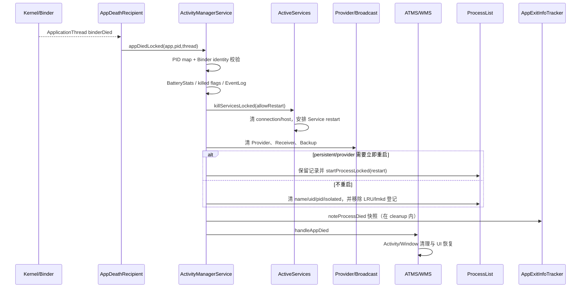

# 110 Android appDiedLocked：进程死亡清理、组件拆除与重启

> 源码版本：Android 11（`android-11.0.0_r48`）  
> 核心文件：`ActivityManagerService.java`、`ProcessList.java`、`ActiveServices.java`  
> 环境：macOS 只读源码，不要求编译。  
> 本章目标：理解 App Binder death 如何进入 AMS，旧 PID/旧 Binder 回调如何被过滤，进程死亡后 Service、Provider、Receiver、Activity、UID、LRU 与统计如何清理，以及哪些组件会触发进程或服务重启。

---

## 1. 进程死亡不是“从列表删一行”

一个 App 进程可能同时承载：

```text
Activity / Window
Service 与 Binder connections
ContentProvider 与 client connections
BroadcastReceiver
Backup agent
Instrumentation
Foreground-service 状态
UID 聚合状态
PSS/GC/timeout 消息
ProcessStats/BatteryStats
```

进程退出后，这些跨系统引用都必须拆除或迁移；否则会有悬挂 Binder、永远等待的 client、错误前台状态和幽灵 UID。

---

## 2. 源码地图

```text
frameworks/base/services/core/java/com/android/server/am/ActivityManagerService.java
frameworks/base/services/core/java/com/android/server/am/ProcessList.java
frameworks/base/services/core/java/com/android/server/am/ProcessRecord.java
frameworks/base/services/core/java/com/android/server/am/ActiveServices.java
frameworks/base/services/core/java/com/android/server/am/AppExitInfoTracker.java
frameworks/base/services/core/java/com/android/server/am/BroadcastQueue.java
frameworks/base/services/core/java/com/android/server/wm/ActivityTaskManagerService.java
frameworks/base/services/core/java/com/android/server/wm/RootWindowContainer.java
frameworks/base/services/core/java/com/android/server/wm/ActivityStack.java
```

核心方法：

```text
AppDeathRecipient.binderDied
ActivityManagerService.appDiedLocked
ActivityManagerService.handleAppDiedLocked
ActivityManagerService.cleanUpApplicationRecordLocked
ActiveServices.killServicesLocked
ActivityManagerService.removeDyingProviderLocked
ProcessList.removeProcessNameLocked
```

---

## 3. 三种“发现死亡”的证据

```text
ApplicationThread Binder death
  → 告诉 AMS App 端 Binder 已死

zygote SIGCHLD unsolicited message
  → 提供 pid/uid/wait status

AMS 自己已发 kill
  → 提前记录 reason/subreason 与 killedByAm
```

它们可能以不同顺序到达。清理主链主要由 Binder death/AMS 路径驱动，退出原因由第 106 章的 Tracker 异步合并。

---

## 4. AppDeathRecipient 如何建立

App attach 到 system_server 后，AMS 对 `IApplicationThread.asBinder()` 注册 death recipient，并保存：

```java
final ProcessRecord mApp;
final int mPid;
final IApplicationThread mAppThread;
```

为什么三个都保存？因为同一个进程名可能重启，ProcessRecord、PID 和 Binder endpoint 在不同阶段都可能被替换。

---

## 5. binderDied 回调做得很少

```java
public void binderDied() {
    synchronized (ActivityManagerService.this) {
        appDiedLocked(mApp, mPid, mAppThread, true, null);
    }
}
```

它只获取 AMS 锁并进入统一清理。复杂工作不应散落在 DeathRecipient，否则主动 kill、attach 失败、依赖死亡等入口会产生不同清理结果。

---

## 6. Binder death 在哪个线程

DeathRecipient 通常由 system_server Binder 线程池回调，不是 AMS 主 Looper。

进入 `synchronized (AMS)` 后与进程/组件状态修改串行化。部分需要 UI/外部 Binder 的工作再 post 到 Handler，避免锁内执行不可控调用。

“AMS 方法”不等于“AMS 主线程方法”。

---

## 7. 第一层防旧回调：PID map

`appDiedLocked()` 首先：

```java
synchronized (mPidsSelfLocked) {
    ProcessRecord curProc = mPidsSelfLocked.get(pid);
    if (curProc != app) return;
}
```

如果 PID 已经映射到别的 ProcessRecord，旧死亡通知必须丢弃。

这是防 PID 复用和旧实例迟到回调的第一道门。

---

## 8. 为什么只比较 PID 不够

PID 是数字，会复用；ProcessRecord 也可能在特殊 restart/replacement 流程中保留或出现 predecessor/successor。

因此后面还检查：

```java
app.pid == pid
app.thread != null
app.thread.asBinder() == thread.asBinder()
```

PID、记录对象、ApplicationThread Binder 三者共同标识这次实例。

---

## 9. BatteryStats 先记死亡

通过第一层 PID 校验后：

```java
stats.noteProcessDiedLocked(app.info.uid, pid);
```

BatteryStats 用它结束进程活动记账。后续彻底移除 PID 时还会 `noteProcessFinish`。

“died”和“finish bookkeeping”处于不同清理层次，不应当作重复调用。

---

## 10. 非 Binder death 入口为何再 kill 一次

若：

```text
!app.killed
且 !fromBinderDied
```

AMS 调用 `killProcessQuiet(pid)` 并记录 UNKNOWN subreason，随后 kill process group。

这处理“Framework 判断进程不可继续使用但 Binder death 尚未到达”的入口，确保残余线程组结束。

---

## 11. 为什么还要 killProcessGroup

单个 PID 死亡不保证其进程组中的衍生子任务都已退出。AMS 调用：

```text
ProcessList.killProcessGroup(uid, pid)
```

由专用 kill 线程执行 cgroup/process-group 清理。

这不是再次证明主进程活着，而是清理资源归属范围。

---

## 12. killed 与 killedByAm

```text
killed
  AMS 已确保向进程/进程组发终止动作或已处理死亡

killedByAm
  这次死亡是 AMS 策略主动发起
```

自然 crash、lmkd kill 等可有 `killed=true` 但最初并非 `killedByAm`。

这两个布尔值影响日志、low-memory report 和重复 kill，而不是同义字段。

---

## 13. 第二层实例校验

只有当前 ProcessRecord 仍对应原 pid 与原 binder 时，才执行完整：

```text
handleAppDiedLocked(app, false, true)
```

若 `app.pid != pid`，说明同记录已关联新进程实例，日志记录“died and restarted”，但不能清理新实例。

若 PID 相同但 Binder 不同，则视作 spurious thread death。

---

## 14. 为什么进程能在 death 回调前重启

异步系统中可能发生：

```text
旧实例退出
→ 其他事件触发 restart
→ 新 PID/Binder attach
→ 旧 Binder death callback 迟到
```

也可能有 ProcessRecord successor 流程。若不校验 binder identity，旧回调会把刚启动的新进程组件全部拆掉。

---

## 15. 自然死亡与 AMS kill 的日志差异

若 `!killedByAm`，AMS 输出进程名、PID、最后 adj/procState，并允许降低 memory level；自然损失也可能触发 low-memory reporting。

若是 AMS 主动 kill，不把它当未知内存事件，也不做同样 low-memory report，但仍需要重新 OOM adjustment 更新进程数量。

---

## 16. EventLog AM_PROC_DIED

AMS 写：

```text
userId, pid, processName, setAdj, setProcState
```

这些是最后已应用/报告状态，不一定是 kernel 死亡纳秒的绝对快照。

EventLog 提供结构化时间线；ApplicationExitInfo 提供 reason/subreason 等历史查询语义。

---

## 17. handleAppDiedLocked 的骨架

```java
boolean kept = cleanUpApplicationRecordLocked(...);
if (!kept && !restarting) {
    removeLruProcessLocked(app);
    ProcessList.remove(pid);
}
clear profiler if needed;
mAtmInternal.handleAppDied(...);
```

`kept` 表示清理过程中已安排同 ProcessRecord 重启，需要保留记录；不是“旧 Linux 进程还活着”。

---

## 18. cleanUp 的参数

```text
restarting
  caller 正在管理替换/重启，当前方法不自行完成普通移除

allowRestart
  Service/Provider/persistent 等是否允许安排重启

index
  若 >=0，调用点要求先从 LRU 与 lmkd 的 PID tracking 移除；这一步的
  ProcessList.remove(pid) 不是从 AMS 的 mPidsSelfLocked 删除

replacingPid
  当前记录是否正在被另一个 PID 替换，影响 name map 移除
```

多个布尔值不是重复保险，而是服务不同调用场景。

---

## 19. 清理临时调度状态

开头移除：

```text
mProcessesToGc
mPendingPssProcesses
next PSS scheduling
error dialogs
crashing / notResponding
waitingToKill / forcingToImportant
foreground activities / shown UI / treatLikeActivity
client activities / above-client
```

这些都只属于旧实例，不能泄漏给重启后的进程。

---

## 20. unlinkDeathRecipient

```java
if (deathRecipient != null && thread != null) {
    thread.asBinder().unlinkToDeath(deathRecipient, 0);
}
deathRecipient = null;
```

如果回调本身由 death 触发，unlink 可能发现 binder 已死，但清理仍要把本地引用置空。

目的不仅是停止回调，也是断开旧 Binder endpoint 的对象图。

---

## 21. makeInactive 与 package stats

`resetPackageList(mProcessStats)` 和 `makeInactive(mProcessStats)` 结束该进程在 ProcessStats 中的活跃归属。

同一 package 后续重启会建立新的活跃时段；不能把两次 Linux 进程实例统计无缝当成一个运行段。

---

## 22. Service 清理先发生

```java
mServices.killServicesLocked(app, allowRestart);
```

这个名字并不是“把所有 Service 永久删除”。它完成：

- 删除 dying app 作为 client 的 connections。
- 把它承载的 Service 与旧 process 脱钩。
- 清空 published service Binder。
- 根据 start/bind/crash/user 状态安排 restart 或 bring-down。

---

## 23. 清理 app 作为 Service client 的连接

遍历 `app.connections`，调用 `removeConnectionLocked()`：

- 从 ServiceRecord connection map 删除。
- 从 AppBindRecord 删除。
- 停止 association 统计。
- 更新 `BIND_ABOVE_CLIENT`、whitelist、后台启动白名单。
- 必要时让远端 Service unbind/降 OOM adj。

client 死亡后，host 不应继续因幽灵 client 获得保护。

---

## 24. 清理 app 承载的 Service

对每个 running Service：

```text
停止 launched stats
sr.setProcess(null)
isolatedProc = null
executeNesting = 0
清 tracker/destroying 状态
published binder = null
requested/received/hasBound = false
```

ServiceRecord 可继续存在等待重启，但旧进程、旧 Binder 和旧执行嵌套必须清空。

---

## 25. 为什么 client 会收到 Service death

Framework 注释说明 client 通常直接对 service Binder linkToDeath，因此不再由 system_server 逐个同步通知“connected(null)”的旧逻辑。

Binder 驱动负责告知 endpoint 死亡；AMS 负责维护连接与重启状态。

这两层不能相互替代。

---

## 26. Service 是否重启的主要分支

```text
crash 次数达到或超过 BOUND_SERVICE_MAX_CRASH_RETRY
且非 persistent app
  → bringDown

!allowRestart 或 user 不在 running
  → bringDown

否则 scheduleServiceRestartLocked
  → 成功则进入 restarting/pending
  → 失败则 bringDown
```

`allowRestart=true` 只是允许评估，不是保证所有 Service 重启。

---

## 27. START_STICKY 不是唯一重启原因

Service 可因：

- explicit start 语义。
- `BIND_AUTO_CREATE` client 仍存在。
- pending delivered start 需要 redelivery。
- persistent package/系统组件。

而安排重启。`START_NOT_STICKY` 也不表示只要进程死就绝无重启，因为 binding 可能仍要求它存在。

---

## 28. crashCount 防重启风暴

反复 crash 的 bound Service 达到上限后被停止，并写 `AM_SERVICE_CRASHED_TOO_MUCH`。

系统不能无限执行：

```text
start → crash → restart → crash
```

否则消耗 CPU、电量并可能拖垮 system_server 调度。

---

## 29. 不允许重启时还清什么

`allowRestart=false`：

```text
stopAllServices
clearBoundClientUids
移除同 processName/uid 的 restarting services
移除 pending services
```

这是 force-stop、package removal 等语义需要的彻底停止，不应留下稍后自行复活的 Service。

---

## 30. Provider host 死亡

遍历 `app.pubProviders`。若 Provider 真由该 app 承载：

```text
removeDyingProviderLocked
cpr.provider = null
cpr.proc = null
```

ProviderRecord 是否从 map/launching list 移除，取决于 `alwaysRemove`、是否 launching、restart count 和 client/handle。

---

## 31. bad 或禁止重启时 alwaysRemove

```java
final boolean alwaysRemove = app.bad || !allowRestart;
```

bad process 不应继续尝试 publish Provider；禁止重启的 package 操作也必须让等待者结束，而不是保留 launching placeholder。

---

## 32. launching Provider 可触发进程重启

若 Provider 正在 launching，未达到重试上限，并仍有 connection/external handle：

```text
restart = true
```

这表示系统已有人等待该 Provider，重建 host 有实际需求。

无消费者的 Provider 不因仅在 manifest 中声明就必然重启。

---

## 33. Provider restart 次数有上限

`removeDyingProviderLocked()` 对 launching provider 增加 `mRestartCount`；超过 `MAX_RETRY_COUNT` 后强制 `always=true` 移除并唤醒等待者。

否则 provider 启动阶段反复 crash 会让 client 永远阻塞。

---

## 34. stable Provider client 为什么可能一起死

对于已建立 connection：

```java
if (conn.stableCount > 0) {
    client.kill(REASON_DEPENDENCY_DIED);
}
```

stable reference 表示 client 依赖 Provider 的稳定存在。Provider 意外消失时，client 的执行状态可能已不可恢复，因此 Framework 选择终止 client，让上层从干净状态重启。

---

## 35. unstable Provider client

若只有 unstable reference：

```text
ApplicationThread.unstableProviderDied(providerBinder)
```

告知 client 清理本地 Provider 引用，然后 AMS 删除 connection。

unstable 的契约允许 client 存活并自行恢复，不需要连坐 kill。

---

## 36. stable/unstable 不是 Binder 强弱引用

它是 ContentProvider acquisition 的 Framework 语义：是否把 Provider 存亡视作 client 正确执行的硬依赖。

底层 Binder 都可能 death；区别在死亡后的系统处置策略。

---

## 37. app 作为 Provider client 的清理

遍历 `app.conProviders`：

```text
从 provider.connections 删除
停止 client→provider association
清空 app.conProviders
```

否则 Provider host 会继续被一个已死 client 的引用保护，引用计数和 OomAdjuster 依赖图都会错误。

---

## 38. Broadcast 当前投递

```java
skipCurrentReceiverLocked(app);
```

每个 BroadcastQueue 检查 dying app 是否正在处理 ordered receiver；若是则跳过/完成当前投递，让队列继续。

否则一个已死进程会让 ordered broadcast 等到超时才推进。

---

## 39. 动态 Receiver 注销

遍历 `app.receivers` 调用 `removeReceiverLocked()`，从 registered receiver map 与 resolver 中移除，并 unlink client receiver Binder death。

Manifest receiver 不是这个运行期动态注册表对象；以后广播仍可按 manifest 重新启动进程。

---

## 40. Backup agent 死亡

若 dying app 是当前用户的 backup target，AMS post 到 Handler，通知 BackupManager：

```text
agentDisconnectedForUser(userId, packageName)
```

post 的原因包括避免在 AMS 锁内做外部服务调用。BackupManager 决定任务失败、重试或清理。

---

## 41. Process observer 通知

旧 PID 对应的 pending process changes 被移除并回收到对象池，然后向 `mUiHandler` 发送：

```text
DISPATCH_PROCESS_DIED_UI_MSG(pid, uid)
```

观察者收到的是进程实例死亡，而不是 package 永久停止；相同 UID/包可很快启动新 PID。

---

## 42. predecessor/successor 边界

源码支持一个旧 ProcessRecord 有 `mSuccessor`。若 successor 已创建：

- 不允许用旧记录自行 restart。
- persistent successor 可加入 starting list。
- 清 `successor.mPrecedence`，唤醒等待者。

这是进程替换并发控制，防止旧清理与新启动各自再创建一个实例。

这里还有一个只看参数名很容易漏掉的 r48 细节：完成 Service、Provider 等组件清理后，源码先无条件执行一次：

```java
allowRestart = true;
```

随后只有发现 `mSuccessor != null` 才把它改回 `false`。因此传入的 `allowRestart` 主要约束前半段 Service/Provider 清理；到了后半段“是否重新拉起整个 ProcessRecord”，要结合 `app.removed`、persistent、isolated、`restart` 和 successor 重新判断，不能把入口参数一路机械套到底。

---

## 43. restarting=true 的含义

如果 caller 正在接管 restart，`cleanUpApplicationRecordLocked()` 在组件清理后直接返回 false，不走普通 non-persistent name-map 删除/自启动分支。

调用者必须负责后续记录生命周期。

它不是函数返回的 `restart` 变量，名字相近但角色不同。

---

## 44. non-persistent 进程记录

通常：

```text
removeProcessNameLocked(processName, uid, expecting=app)
clear heavy-weight if equal
```

`expecting` 很关键：如果 name/uid map 已指向新 ProcessRecord，就不能让旧清理把新记录删除。

---

## 45. persistent 进程记录

若 persistent、非 isolated、未 marked removed：

```text
保留 ProcessRecord
加入 mPersistentStartingProcesses
restart = true
```

随后 `startProcessLocked()` 重启。persistent 是系统策略承诺，不是 Linux 进程不会 crash。

---

## 46. isolated 进程为什么不自动按 persistent 重启

条件明确排除 isolated：

```text
restart && allowRestart && !app.isolated
```

isolated UID 是一次任务/组件的临时安全容器，重用旧 isolated identity 可能违背隔离生命周期；需要它的上层组件应重新申请启动。

---

## 47. restart=true 的来源

本方法内主要有：

```text
launching Provider 仍有 client/handle
cleanup launching providers 发现仍需恢复
persistent process
```

Service 重启大多由 `ActiveServices.scheduleServiceRestartLocked()` 单独排程，不一定要求立刻用同一个 ProcessRecord 的 `restart=true` 路径。

这两类“重启”不要混。

---

## 48. 同 ProcessRecord 立即重启

若：

```text
restart && allowRestart && !isolated
```

则：

```text
必要时向 lmkd 发送旧 PID 的 LMK_PROCREMOVE
清 provider publish timeout
重新 addProcessNameLocked
pendingStart=false
startProcessLocked(HostingRecord("restart", processName))
return true
```

这里的 `ProcessList.remove(app.pid)` 只撤销 lmkd 中的进程登记；它不是 `removePidLocked()`。返回 true 告诉 `handleAppDiedLocked()` 不要从 LRU/name 生命周期彻底丢掉记录。

---

## 49. 不重启时收尾

```text
removePidLocked
移除 PROC_START_TIMEOUT
BatteryStats noteProcessFinish
isolated UID 额外释放
app.pid = 0
return false
```

随后上层从 LRU 移除，并向 lmkd 发送 `LMK_PROCREMOVE(pid)`。

PID 置 0 是 ProcessRecord 已无活实例的显式状态。

---

## 50. removeProcessNameLocked 的 compare-and-remove

```java
ProcessRecord old = mProcessNames.get(name, uid);
if (expecting == null || old == expecting) {
    mProcessNames.remove(name, uid);
}
```

这相当于按期望对象比较后删除。旧进程清理迟到时，若 map 已放新记录，删除条件失败。

它是应用层解决 ABA/实例替换竞态的重要模式。

---

## 51. UIDRecord 清理

从 UID 的 `procRecords` 移除该记录并 `numProcs--`。若归零：

```text
enqueue CHANGE_GONE
EventLog AM_UID_STOPPED
从 ActiveUids 移除
noteUidProcessState(NONEXISTENT, CAPABILITY_NONE)
```

一个进程死不等于 UID gone；同 UID 还有其他进程时必须保留聚合状态。

---

## 52. isolated UID 与 AppZygote 清理

移除 name 时还会：

```text
mIsolatedProcesses.remove(uid)
mGlobalIsolatedUids.freeIsolatedUidLocked(uid)
若属于 app zygote，removeProcessFromAppZygoteLocked
```

避免临时 UID 泄漏和 per-app zygote 错误认为 child 仍存活。

---

## 53. ATMS/WMS Activity 清理在后面

`handleAppDiedLocked()` 在 AMS 组件清理后调用：

```text
mAtmInternal.handleAppDied(WindowProcessController, restarting, callback)
```

ATMS 持自己的 global lock，遍历 display/task display area/stack，清理 Activity 与 WindowProcessController 状态。

AMS 锁与 WM global lock 的调用顺序必须由既定接口维护。

---

## 54. ActivityStack 处理什么

```text
若 dying app 正在 pause，清 mPausingActivity
清 last paused/no-history 引用
removeHistoryRecords(app)
移除/重置属于该 process 的 Activity runtime records
返回是否曾有 visible Activity
```

Task/ActivityRecord 的持久任务语义不一定全部删除；进程重启后 Activity 可重建。

---

## 55. visible Activity 死亡后的恢复

若非 restarting 且 dying process 有 visible Activity，ATMS 会 resume focused stack top activities；若没有可直接 resume 的，还确保所有 visible activities 启动。

用户界面恢复是死亡清理的一部分，不只是后台数据结构维护。

---

## 56. instrumentation 死亡

若 WindowProcessController 标记 instrumenting，ATMS 回调 AMS：

```text
finishInstrumentationLocked(... RESULT_CANCELED ...)
```

测试控制进程死亡意味着 instrumentation session 必须明确失败，而不能悄悄重启后继续。

---

## 57. ProcessList.noteProcessDiedLocked

清理尾部会调用：

```text
Watchdog.processDied(processName, pid)
AppExitInfoTracker.scheduleNoteProcessDied(app)
```

Tracker 收到 ProcessRecord 快照后，与之前缓存的 lmkd、zygote 或 AMS kill 意图合并。

如果 `cleanupAppInLaunchingProvidersLocked()` 发现死亡进程仍占着 launching-provider 状态，源码还会在该分支较早调用一次 `noteProcessDiedLocked()`，之后尾部仍有无条件调用。也就是说，调用点本身可能重复；Tracker 的按 PID/UID 历史合并必须具备幂等/更新语义，不能把每次 schedule 都理解成一个不同 Linux 进程。

它在 cleanup 过程中调用，仍是异步 Handler 记录，不阻塞完整历史持久化。

---

## 58. zygote SIGCHLD 不直接做组件清理

`ProcessList.handleZygoteMessages()` 读取 pid/uid/status 后只交给 `AppExitInfoTracker.handleZygoteSigChld()`。

原因：zygote 消息适合提供 exit status，但未携带完整 ProcessRecord/Binder 身份，也不应代替 AMS 组件清理协议。

它是退出证据，不是唯一生命周期权威入口。

---

## 59. low-memory report 的特殊路径

自然死亡后若系统已没有 background process，且非 instrumentation，AMS 可能：

```text
写 AM_LOW_MEMORY
给其他进程标 reportLowMemory
调度 GC/低内存回调
debuggable build 可收集 mem report
```

这不证明 dying process 是 lmkd 杀的，而是死亡后观察到系统缓存/后台进程已耗尽。

---

## 60. 为什么 killedByAm 时不做同样 low-memory report

AMS 主动裁剪/force-stop 已有明确策略原因，不应把它重新解释成自然低内存事件。

但进程数变化仍影响 adj 与缓存档，所以 OOM adjustment 需要更新。

“不报告 low memory”不等于不更新内存管理状态。

---

## 61. removeProcessLocked 是主动移除入口

force-stop、crash policy、package 操作等可调用：

```text
ProcessList.removeProcessLocked(app, callerWillRestart, allowRestart, reason, subreason)
```

它先校验 name/uid map 仍指向 app，再移除映射/PID、调用 `app.kill()`，最后复用 `handleAppDiedLocked()` 清组件。

主动与被动最终汇合到统一 cleanup。

---

## 62. callerWillRestart 与 allowRestart

```text
callerWillRestart
  外层调用者承诺负责重启 persistent 进程

allowRestart
  cleanup 是否允许 Service/Provider 等自行安排重启
```

前者决定谁负责；后者决定是否允许。两个参数组合可表达 force-stop、替换、普通死亡等场景。

---

## 63. removeProcessLocked 防删新实例

```java
ProcessRecord old = mProcessNames.get(name, uid);
if (old != app) return false;
```

如果调用者持有的 app 已不是 active record，整次主动 remove 被忽略。

与 PID map、Binder identity、expecting remove 合起来形成多层实例防护。

---

## 64. 一张总时序图



---

## 65. 四种对象生命周期不要混

```text
Linux process instance
  PID 对应的一次运行

ProcessRecord
  system_server 对进程逻辑身份的记录，某些 restart 可复用

Component record
  ServiceRecord/ContentProviderRecord/ActivityRecord，可能跨进程重启保留

Package/UID
  安装与安全身份，通常远长于进程
```

“进程死了”只直接终止第一层，其余层按策略清理或重建。

---

## 66. 四种重启不要混

```text
persistent process restart
  系统关键进程整体立即重启

launching Provider host restart
  有等待 client，继续完成 publish

Service scheduled restart
  ActiveServices 按 backoff/start/bind 语义稍后启动

Activity relaunch
  ATMS 在需要显示时重新启动组件/进程
```

它们的时间、ProcessRecord 是否复用、失败上限和 HostingRecord 都不同。

---

## 67. 常见误解一——Binder death 就是 Linux wait status

Binder death 只说明 Binder endpoint 不可达，不提供 exit code/signal。

zygote SIGCHLD 提供 wait status，lmkd 提供 low-memory kill 身份，AMS 提供主动 kill reason。退出历史需要合并。

---

## 68. 常见误解二——收到 death 就能按 ProcessRecord 清理

旧回调可能迟到。必须验证 PID map、app.pid 和 ApplicationThread Binder 都仍指向同一实例。

否则会发生“旧实例死亡清理新实例”的灾难性竞态。

---

## 69. 常见误解三——allowRestart=true 表示一定重启

它只是允许。Service crash 次数、user 是否 running、stopIfKilled、是否有 binding/start、Provider 是否有等待者、是否 isolated 都会否决或改变重启方式。

---

## 70. 常见误解四——ServiceRecord 在进程死后都删除

可重启 ServiceRecord 会保留逻辑状态，但其 `app`、published Binder、execution nesting 等旧实例字段必须清空。

“记录保留”与“组件仍在运行”是两回事。

---

## 71. 常见误解五——stable Provider 引用让 Provider 不会死

stable 是死亡后的 client 处置契约，不是对 host 的绝对不死保证。host 若死，stable client 可能被连带 kill，以恢复一致状态。

---

## 72. 常见误解六——Activity 进程死等于 Task 消失

ATMS 清除运行实例和窗口引用，但 Task/Activity 历史可保留，以便返回时重建。是否 finish 取决于 Activity 状态、flags 和 crash policy。

进程生命周期短于任务模型。

---

## 73. 常见误解七——kill 请求后立刻从所有 map 消失

主动入口可能先标记 `killedByAm` 并发 signal；真正 death/cleanup 稍后发生。

代码必须容忍一段时间：

```text
ProcessRecord 仍在 map/LRU
但 killedByAm=true 或 thread 即将失效
```

---

## 74. macOS 只读练习一：追 DeathRecipient

```bash
cd /Users/ninebot/androidSource

sed -n '1580,1620p' \
  frameworks/base/services/core/java/com/android/server/am/ActivityManagerService.java

sed -n '3860,3940p' \
  frameworks/base/services/core/java/com/android/server/am/ActivityManagerService.java
```

列出三层实例校验，并为每层写一个它阻止的竞态。

---

## 75. macOS 只读练习二：追 cleanup 总表

```bash
sed -n '14735,14945p' \
  frameworks/base/services/core/java/com/android/server/am/ActivityManagerService.java
```

按对象分类记录：

```text
临时状态 / Service / Provider / Receiver / Backup
observer / persistent / UID-PID / exit info / ATMS
```

---

## 76. macOS 只读练习三：追 Service restart

```bash
sed -n '3960,4175p' \
  frameworks/base/services/core/java/com/android/server/am/ActiveServices.java

rg -n 'scheduleServiceRestartLocked|BOUND_SERVICE_MAX_CRASH_RETRY|canStopIfKilled' \
  frameworks/base/services/core/java/com/android/server/am/ActiveServices.java
```

画出 allowRestart、user running、crash count、schedule success 的决策树。

---

## 77. macOS 只读练习四：追 Provider death

```bash
sed -n '14645,14725p' \
  frameworks/base/services/core/java/com/android/server/am/ActivityManagerService.java
```

比较：

```text
launching + waiting
stable connection
unstable connection
alwaysRemove
```

说明各自对 host record 与 client 的影响。

---

## 78. macOS 只读练习五：追 name/UID 清理

```bash
sed -n '2888,2955p' \
  frameworks/base/services/core/java/com/android/server/am/ProcessList.java
```

回答：

1. `expecting` 为何类似 compare-and-remove？
2. UID 何时发 `CHANGE_GONE`？
3. isolated UID 与 app zygote 还要清哪些状态？

---

## 79. macOS 只读练习六：追 ATMS

```bash
sed -n '6765,6805p' \
  frameworks/base/services/core/java/com/android/server/wm/ActivityTaskManagerService.java

sed -n '3125,3150p' \
  frameworks/base/services/core/java/com/android/server/wm/RootWindowContainer.java

sed -n '2720,2760p' \
  frameworks/base/services/core/java/com/android/server/wm/ActivityStack.java
```

区分 runtime Activity 清理、Task 历史和 visible UI 恢复。

---

## 80. macOS 只读练习七：追退出证据

```bash
rg -n 'noteAppKill|noteProcessDiedLocked|handleZygoteSigChld|scheduleNoteLmkdProcKilled' \
  frameworks/base/services/core/java/com/android/server/am/{ProcessList.java,AppExitInfoTracker.java}
```

画出 AMS intent、ProcessRecord death、zygote status、lmkd kill 四路在清理前后的到达顺序组合。

---

## 81. 第二次复读：清理顺序的因果性

大致顺序不是随意的：

```text
先确认实例
→ 标记死亡与阻止重复工作
→ 清对旧 Binder/进程的组件引用
→ 决定哪些逻辑组件仍需存在
→ 按是否复用 ProcessRecord，移除旧身份或先安排新进程
→ 清 Activity/Window 并恢复前台 UI
→ 重算剩余进程优先级
```

Service/Provider 等旧实例引用一定先清；但若需要立即复用记录，`startProcessLocked()` 实际发生在 `cleanUpApplicationRecordLocked()` 返回前，也早于后面的 ATMS `handleAppDied()`。源码用 expecting、successor 和 identity check 缩小旧清理误伤新实例的风险。

---

## 82. 第二次复读：同步锁与异步完成

在 AMS 锁内，Framework 同步完成的是“内部记录状态转换”。

异步部分包括：

- kernel 实际退出。
- process group kill handler。
- BackupManager 通知。
- UI Handler observer 分发。
- Service 延迟 restart。
- AppExitInfoTracker 合并/持久化。
- 新进程 zygote fork/attach。

所以方法返回不代表所有外部副作用都完成。

---

## 83. 第二次复读：故障恢复的共同模式

本章反复出现四个模式：

```text
identity validation
  PID + object + Binder 防旧回调

compare-and-remove
  expecting 防旧清理删新值

detach old instance, retain logical record
  Service/Provider/Task 可重建

bounded retry
  Service crash limit、Provider launch retry
```

这些模式适用于任何长生命周期管理器与短生命周期 worker 的设计。

---

## 84. 排障顺序

进程“死后没有正确恢复”时：

```text
1. death 是 Binder、AMS kill、lmkd 还是 zygote 哪路先到？
2. appDiedLocked 是否因 PID/ProcessRecord/Binder mismatch 被过滤？
3. killed/killedByAm 与 AppExitInfo reason 是否一致？
4. Service 是 bringDown、scheduled restart 还是 crash-too-much？
5. Provider 是否 launching、有 handle、超过 retry？
6. stable client 是否被 dependency-died kill？
7. persistent/isolated/replacingPid/successor 分支走哪条？
8. name/UID/PID/LRU 是否仍残留旧实例？
9. ATMS 是否恢复 focused Activity？
10. 新进程是否已 start 但 attach timeout？
```

---

## 85. 本章检查题

1. 为什么 DeathRecipient 保存 ProcessRecord、PID 和 ApplicationThread？
2. PID map 校验与 Binder identity 校验各防什么？
3. `killed` 与 `killedByAm` 有什么区别？
4. `cleanUpApplicationRecordLocked()` 返回 true 表示什么？
5. `allowRestart=true` 为何不是一定重启？
6. Service scheduled restart 与 persistent process restart 有何不同？
7. stable Provider client 为什么可能被 kill？
8. `expecting` 如何保护新 ProcessRecord？
9. 一个进程死后 UID 何时才算 gone？
10. zygote SIGCHLD 为什么不直接清理 Activity/Service？

---

## 86. 本章结论

Android 11 的进程死亡处理是一套跨子系统、支持旧回调和重启竞态的状态迁移：

```text
Binder death / 主动 remove
  → PID map + Binder instance 校验
  → killed/BatteryStats/EventLog
  → Service connection/host 清理与重启排程
  → Provider stable/unstable client 与 launch retry
  → Receiver/Backup/observer 清理
  → compare-and-remove name/UID/PID/isolated/AppZygote
  → AppExitInfo 异步证据合并
  → ATMS Activity/Window 清理和 UI 恢复
  → persistent/provider 立即 restart 或 Service 延迟 restart
  → OomAdjuster 重算剩余进程
```

最重要的四个结论：

1. death notification 必须绑定具体进程实例，不能只信 PID 或进程名。
2. Linux 进程、ProcessRecord、组件记录、Task 与 UID 的生命周期不同。
3. 清旧实例与建新实例会并发，identity check、expecting remove 和 successor 是核心防线。
4. “允许重启”只是进入各组件重启策略，Service、Provider、persistent、Activity 各自决定如何恢复。

下一章将深入 Service 重启调度本身：`scheduleServiceRestartLocked()` 如何处理 start item 重投递、crashCount、restartDelay/backoff、restartTime 排序、取消与 `performServiceRestartLocked()`，以及为何系统必须避免 service restart storm。
