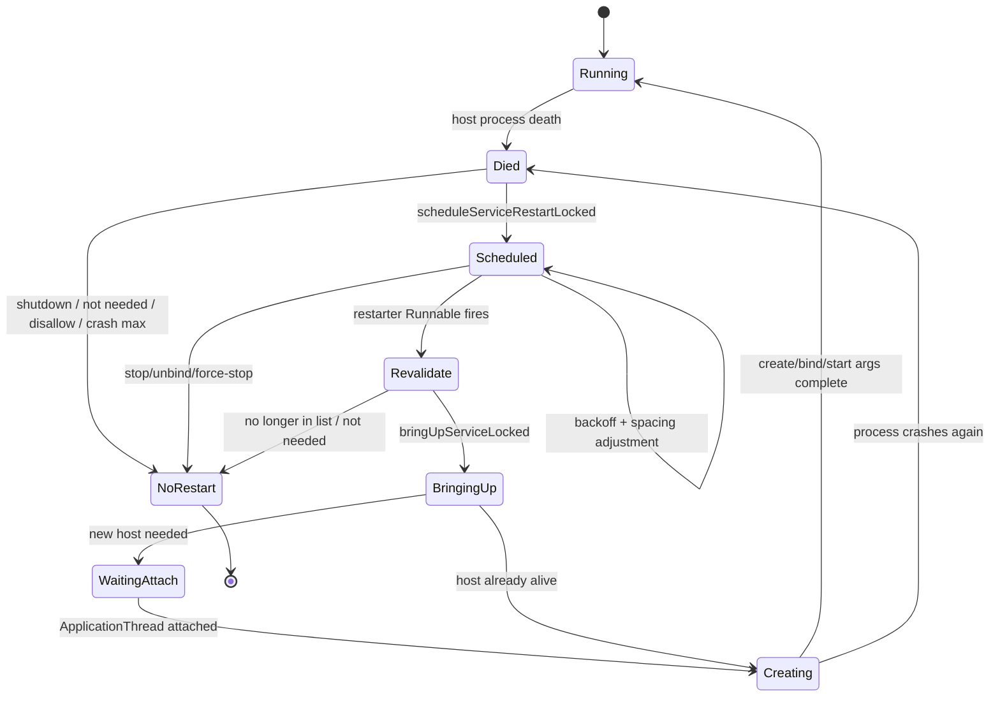

# 111 Android Service 重启：退避、StartItem 重投递与风暴防护

> 源码版本：Android 11（`android-11.0.0_r48`）  
> 核心文件：`ActiveServices.java`、`ServiceRecord.java`、`ActivityManagerConstants.java`  
> 环境：macOS 只读源码，不需要编译或真机。  
> 本章目标：理解进程死亡后 Service 是否仍“需要”、start item 如何回队、不同 crash 类型如何计算 restart delay、多个 Service 如何错峰、Runnable 到期后怎样再次 bring-up，以及 stop/unbind/force-stop 如何取消重启。

---

## 1. Service 重启不是 `sleep()` 后再 new Service

完整链路：

```text
host process dies
  → ActiveServices 拆旧 Binder/执行状态
  → 判断 start/bind 需求是否仍存在
  → 回收/回队 delivered StartItem
  → 计算 restartDelay/nextRestartTime
  → 与其他 restarting Service 错峰
  → Handler 定时触发 ServiceRestarter
  → 再次确认 Service 仍 needed
  → bringUpServiceLocked 启进程或复用进程
  → create/bind/start args 重新投递
```

任何阶段需求消失，都应取消或放弃重启。

---

## 2. 源码地图

```text
frameworks/base/services/core/java/com/android/server/am/ActiveServices.java
frameworks/base/services/core/java/com/android/server/am/ServiceRecord.java
frameworks/base/services/core/java/com/android/server/am/ActivityManagerConstants.java
frameworks/base/services/core/java/com/android/server/am/ProcessRecord.java
frameworks/base/core/java/android/app/Service.java
frameworks/base/core/java/android/app/ActivityThread.java
frameworks/base/core/java/android/app/IApplicationThread.aidl
```

核心方法：

```text
scheduleServiceRestartLocked
performServiceRestartLocked
unscheduleServiceRestartLocked
bringUpServiceLocked
sendServiceArgsLocked
serviceDoneExecutingLocked
ServiceRecord.canStopIfKilled
```

---

## 3. ServiceRecord 跨进程实例存在

进程死亡时，旧 Java `Service` 对象消失，但 system_server 的 `ServiceRecord` 可继续存在，保存：

```text
startRequested / pendingStarts / deliveredStarts
connections / bindings
stopIfKilled / callStart
crashCount / restartCount / totalRestartCount
restartDelay / restartTime / nextRestartTime
restarter Runnable
```

它是“逻辑 Service 实例”的系统记录，不等于 App 进程中的 Service 对象。

---

## 4. 三种计数不要混

```text
crashCount
  承载进程因 crash 而连续失败的次数

restartCount
  当前退避序列中连续 restart 次数

totalRestartCount
  ServiceRecord 生命周期内累计被安排重启次数
```

`restartCount` 可在稳定运行后重置，`totalRestartCount` 仍累加；`crashCount` 还驱动 bound-service 特殊策略。

---

## 5. 三个时间字段

```text
restartDelay
  从当前时刻到计划重启的延迟

restartTime
  上一次 Service 实际启动/重启时间

nextRestartTime
  计划运行 restarter 的 uptime 时间点
```

它们使用 uptime，不受修改墙钟影响，deep sleep 的计时边界也与 wall time 不同。

---

## 6. scheduleServiceRestartLocked 的返回值

```java
/** @return true if the restart is scheduled. */
```

false 可能表示：

- 系统正在 shutdown。
- ServiceRecord 已不是 map 中当前实例。
- start 语义允许停止且没有 auto-create binding。
- 上游后续 `bringDownServiceLocked()`。

false 不等于 schedule API 自己一定已经清完所有 Service 状态。

---

## 7. shutdown 时不安排重启

```java
if (mAm.mAtmInternal.isShuttingDown()) return false;
```

关机阶段重启 App 只会制造 I/O、延迟和新竞态。系统目标已从“维持服务可用”切换成“有序停止”。

---

## 8. ServiceRecord identity 校验

```java
if (smap.mServicesByInstanceName.get(r.instanceName) != r) return false;
```

同 instance name 可能已被新 ServiceRecord 替换。旧进程清理迟到时，不得给旧对象安排重启。

这是第 110 章 compare-and-remove 思想在 Service 层的对应实现。

---

## 9. persistent package 单独处理

如果 `ApplicationInfo.FLAG_PERSISTENT`：

```text
totalRestartCount++
restartCount = 0
restartDelay = 0
nextRestartTime = now
reason = persistent
```

persistent process 本身会立即恢复，没有必要再给其中 Service 额外退避。

这不表示重启一定同步完成，只表示 Handler 调度时间不再人为延迟。

---

## 10. 普通 Service 的第一步：处理 deliveredStarts

进程死时，`onStartCommand()` 已收到但尚未完成语义的 start item 位于：

```text
r.deliveredStarts
```

调度重启会逐个：

```text
撤销旧 URI grants
决定回到 pendingStarts 还是取消
清 deliveredStarts
```

旧进程拥有的 URI permission 不能直接跨实例保留；重新投递时会重新 grant。

---

## 11. 为什么 URI grant 要先 remove

Start Intent 可能携带临时 URI access。授权绑定于一次交付/组件使用，旧 host 已死：

```text
remove old grants
→ item 回 pending
→ 新实例发送前重新 grant
```

否则失败重试可能不断叠加旧权限或让已死实例的授权生命周期不清晰。

---

## 12. null Intent StartItem

如果 `si.intent == null`，调度重启阶段不把该 dummy item 回队，注释说需要时会重新生成。

`onStartCommand(null, ...)` 是 sticky Service 重建语义的一部分，不表示调用者真的发送了一个 null Intent start request。

---

## 13. StartItem 回队条件

```java
!allowCancel
|| (deliveryCount < MAX_DELIVERY_COUNT
    && doneExecutingCount < MAX_DONE_EXECUTING_COUNT)
```

Android 11：

```text
MAX_DELIVERY_COUNT = 3
MAX_DONE_EXECUTING_COUNT = 6
```

超过任一保护阈值且允许取消时，系统放弃该 start item，防止坏任务无限重放。

---

## 14. deliveryCount 是什么

`sendServiceArgsLocked()` 每次将 pending item 交给 App 前：

```java
si.deliveryCount++;
```

如果同一 item 因进程死亡重新发送，计数继续增加，并给 App 的 flags 加：

```text
START_FLAG_RETRY
```

它衡量交付尝试，不是 Service 总启动次数。

---

## 15. doneExecutingCount 是什么

当 Service 返回 `START_REDELIVER_INTENT`：

```text
deliveryCount = 0
doneExecutingCount++
保留 delivered StartItem
```

说明本次 `onStartCommand` 已正常返回，但 App 要求若以后被杀仍重投该 Intent。

多次成功执行后仍反复死亡，`doneExecutingCount` 防止同一业务永久循环。

---

## 16. 两个阈值解决不同故障

```text
deliveryCount ≥ 3
  item 反复送达但进程在完成前死亡

doneExecutingCount ≥ 6
  item 多次完成并要求 redelivery，之后仍反复重启
```

一个防“永远执行不完”，一个防“每次都执行完却永远要求再来”。

---

## 17. 回队顺序

源码从 `deliveredStarts` 尾向头遍历，每个插入：

```java
r.pendingStarts.add(0, si);
```

逆序扫描 + 头插恢复原有相对交付顺序。

若直接正序头插，多个 Intent 会反转，可能破坏业务命令的先后关系。

---

## 18. 慢 StartItem 会提高最小退避

```java
long dur = now - si.deliveredTime;
dur *= 2;
minDuration = max(minDuration, dur);
resetTime = max(resetTime, dur);
```

如果进程在一个 start item 上运行很久后死亡，立刻 1 秒重启可能过于激进。算法把已运行时长的两倍作为更保守的最低 delay 和稳定重置窗口。

---

## 19. 默认时间参数

Android 11 默认：

```text
SERVICE_RESTART_DURATION = 1 秒
SERVICE_RESET_RUN_DURATION = 60 秒
SERVICE_RESTART_DURATION_FACTOR = 4
SERVICE_MIN_RESTART_TIME_BETWEEN = 10 秒
BOUND_SERVICE_CRASH_RESTART_DURATION = 30 分钟
BOUND_SERVICE_MAX_CRASH_RETRY = 16
```

这些由 ActivityManager settings parser 配置，源码默认不是所有厂商设备的必然运行值。

---

## 20. canStopIfKilled

```java
return startRequested
        && (stopIfKilled || isStartCanceled)
        && pendingStarts.isEmpty();
```

它只判断 `startService()` 这一维是否已经没有重启理由，方法注释明确“不考虑 bindings”。

所以 schedule 后还要检查 `hasAutoCreateConnections()`。

---

## 21. START_NOT_STICKY 如何进入 stopIfKilled

`serviceDoneExecutingLocked()` 收到最后一个 startId 的 `START_NOT_STICKY`：

```text
移除 delivered item
若是 lastStartId → stopIfKilled=true
```

进程随后被杀且 pending 为空时，start 语义允许 Service 不再重启。

但 auto-create binding 仍可独立要求它存在。

---

## 22. START_STICKY

返回 `START_STICKY`：

```text
移除已完成 StartItem
stopIfKilled=false
```

进程被杀后，系统仍需重建 Service；没有原 Intent 可重投时，可产生 null Intent 的 `onStartCommand`。

Sticky 是尽力重建承诺，不是立即、无限、无条件运行保证。

---

## 23. START_REDELIVER_INTENT

```text
不移除 delivered item
deliveryCount 清零
doneExecutingCount++
stopIfKilled=true
```

下次意外死亡时，保留的 item 会回 `pendingStarts`，新实例收到原 Intent 和 `START_FLAG_REDELIVERY`。

`stopIfKilled=true` 不会阻止有 pending item 的重启，因为 `canStopIfKilled()` 还要求 pending 为空。

---

## 24. START_STICKY_COMPATIBILITY

它与 sticky 一样使 `stopIfKilled=false`，但属于旧兼容语义，具体 null-intent 重启保证比现代 `START_STICKY` 更弱。

学习主线应理解 sticky/non-sticky/redeliver 的状态变化，不要把 compatibility 当新的业务模式。

---

## 25. auto-create binding 的独立生命力

即使：

```text
canStopIfKilled(canceled) == true
```

只要 `hasAutoCreateConnections()`，Service 仍需要重启，reason 记为 `connection`。

因为活着的 client 仍持有 `BIND_AUTO_CREATE` 契约。

---

## 26. reason 字符串

```text
start-requested
connection
always
persistent
```

它用于日志解释 schedule 来源，不是 `ApplicationExitInfo` reason，也不是 Service `onStartCommand` 返回值。

不要把不同层的 reason 混为同一枚举。

---

## 27. allowCancel=false

某些内部恢复路径要求始终安排：

- delivered items 不因次数阈值取消。
- 不执行 `canStopIfKilled` 早退。
- reason=`always`。

这是一种调用者策略权力，应谨慎使用，否则会绕过正常风暴保护的一部分。

---

## 28. 第一次重启 delay

```java
if (r.restartDelay == 0) {
    r.restartCount++;
    r.restartDelay = minDuration;
}
```

普通情况默认 1 秒；若某 delivered item 已运行较久，则至少是该运行时长的两倍。

第一次并非总是固定 1 秒。

---

## 29. 普通连续失败的指数退避

若已有 delay、不是 `crashCount>1` 特殊分支、并且未稳定运行足够久：

```java
r.restartDelay *= SERVICE_RESTART_DURATION_FACTOR;
```

默认序列约为：

```text
1s → 4s → 16s → 64s → 256s → ...
```

还会受 `minDuration`、错峰和实际配置影响。

---

## 30. 为什么是指数退避

快速失败通常不是“再试一次马上就好”，可能是确定性 bug、资源未就绪或依赖服务故障。

指数退避让早期快速恢复，持续失败时迅速减少：

- fork/进程初始化成本。
- crash log/DropBox/stats 洪水。
- Binder client 抖动。
- 电量与 CPU 消耗。

---

## 31. 稳定运行后重置退避

```java
if (now > r.restartTime + resetTime) {
    restartCount = 1;
    restartDelay = minDuration;
}
```

默认 Service 连续运行超过 60 秒后偶尔被杀，应视作新的失败序列，不继承数小时前积累的巨大 delay。

若 StartItem 已运行很久，`resetTime` 也会被抬到 `2×dur`。

---

## 32. restartTime 何时更新

Service 被实际 bring-up 时：

```text
r.restartTime = r.lastActivity = uptimeMillis()
```

它不是 schedule 时间。稳定运行判断从真正尝试启动/运行的时间算，而不是从排队开始算。

---

## 33. crashCount > 1 特殊分支

```java
r.restartDelay = BOUND_SERVICE_CRASH_RESTART_DURATION
        * (r.crashCount - 1);
```

默认基数 30 分钟。因此：

```text
crashCount=2 → 30 分钟
crashCount=3 → 60 分钟
...
```

这是线性长退避，不是普通 1 秒×4 指数序列。`crashCount` 由 `AppErrors.handleAppCrashLocked()` 在真正的应用 crash 路径增加；普通 LMKD/缓存回收造成的进程死亡不会凭空增加它。

---

## 34. 为什么 bound-foreground crash 更严厉

`AppErrors` 只有在 Service 仍低于重试上限，且它自身是 foreground Service，或承载进程处于 `PROCESS_STATE_BOUND_FOREGROUND_SERVICE` 时，才用 `tryAgain` 为重复 crash 保留特殊重启机会。长期存活的 client/前台契约可能持续维持需求，若一拉起就 crash，便会形成 restart storm。

长退避保护系统免受坏 client/坏 service 契约组合的持续冲击。

所以这组常量虽然名为 bound-service crash，实际可达语义应结合 `AppErrors` 的 `sr.isForeground || procIsBoundForeground` 与 started/binding 需求一起判断，不能泛化成“所有纯 bound service 都固定等 30 分钟”。

---

## 35. crash 次数上限

在 `killServicesLocked()` 外层：

```text
allowRestart
且 crashCount >= BOUND_SERVICE_MAX_CRASH_RETRY
且 package 非 persistent
→ bringDownServiceLocked
```

Android 11 默认上限 16。达到阈值后甚至不再进入 schedule。

这是硬停止，区别于越来越长的软退避。

---

## 36. nextRestartTime

基础计算：

```java
r.nextRestartTime = now + r.restartDelay;
```

随后还会因与其他 Service 时间太近而向后推。因此最终 delay 可能大于指数/线性公式直接算出的值。

排障应看实际 `nextRestartTime`，不能只拿 restartCount 套公式。

---

## 37. 多 Service 错峰

遍历 `mRestartingServices`，若新时间落在另一 Service 前后 10 秒窗口内：

```text
next = other.next + 10s
restartDelay = next - now
重新扫描
```

do/while 直到不再与任何记录冲突。

这把一批同时死亡的 Service 排成队列，避免同一时刻 fork/初始化洪峰。

---

## 38. 为什么需要重新扫描

从 A 的窗口推到 A+10s 后，可能又撞到 B；所以不能只遍历一次。

```text
候选 5s
A 在 10s → 推到 20s
B 在 25s → 又冲突 → 推到 35s
```

循环是约束满足，不是重复无效计算。

---

## 39. 错峰不是全局排序

`mRestartingServices` 是列表，但 schedule 逻辑不依赖它已按 next time 排序，而是扫描所有条目寻找冲突。

Handler 自己按时间调度 Runnable。列表主要用于 membership、状态展示、取消与 tracker 管理。

---

## 40. 加入 mRestartingServices

若不在列表：

```text
createdFromFg=false
add(r)
makeRestarting(ProcessStats mem factor, now)
```

`createdFromFg` 清零避免把旧启动来源待遇无条件带入新实例；restart tracker 开始记服务处于重启状态的时间。

---

## 41. 为什么取消前台通知

旧 host 已死，等待重启期间不能继续展示一条好像 Service 正在执行的通知：

```java
cancelForegroundNotificationLocked(r);
```

`cancelForegroundNotificationLocked()` 会尝试撤掉通知，但不会在这里把 `ServiceRecord.isForeground`、`foregroundId` 和 `foregroundNoti` 全部清空；若同包另一个 FGS 正使用同一 notification id，甚至不会撤通知。保留这些逻辑字段，是为了 Service 真正重建时由 `realStartServiceLocked()` 的 `r.postNotification()` 恢复通知。

所以要分开“等待期间通知暂时撤下”与“FGS 逻辑状态是否丢失”。进程死亡并不等价于 `stopForeground()`。

---

## 42. Handler 定时调度

```java
mAm.mHandler.removeCallbacks(r.restarter);
mAm.mHandler.postAtTime(r.restarter, r.nextRestartTime);
```

先移除旧 callback，确保同一 ServiceRecord 只有一个有效定时重启。

它不是创建新线程 sleep；AMS 主 Handler 到期运行一个短 Runnable。

---

## 43. nextRestartTime 的再次赋值

post 后源码又写：

```java
r.nextRestartTime = SystemClock.uptimeMillis() + r.restartDelay;
```

这与用于 `postAtTime` 的 `now + delay` 理论接近，但调用过程中消耗的时间会产生细微差异。

Handler 已持有原计划时间；字段主要用于后续展示/计算。不要把第二次赋值误解为重新 post。

---

## 44. ServiceRestarter

```java
public void run() {
    synchronized (mAm) {
        performServiceRestartLocked(mService);
    }
}
```

Runnable 回到 AMS 主 Handler，再取得 AMS 锁。延迟期间 Service 需求可能变化，所以到期后不能直接盲目启动。

---

## 45. perform 前重新验证 membership

```java
if (!mRestartingServices.contains(r)) return;
```

若 stop/unbind/force-stop 已取消重启，迟到 callback 即使被调用也不会复活 Service。

Handler `removeCallbacks` 加 membership check 构成双重取消防线。

---

## 46. perform 前重新判断 needed

```java
if (!isServiceNeededLocked(r, false, false)) {
    Slog.wtf(...);
    return;
}
```

注释指出历史 bug 会让不再需要的 Service 留在 restart list，导致：

```text
启动 → 仅 cached → 很快被杀 → 重启
```

二次校验是防 restart storm 的最后保险。

---

## 47. 一个值得注意的边界

`performServiceRestartLocked()` 发现 not needed 时只 `wtf` 并 return，当前片段没有立即从 restart list 移除。

这是“理论上不应发生”的不变量保护路径。正常取消应更早调用 `unscheduleServiceRestartLocked()`。

排障若看到这条 wtf，应追谁破坏了 restart-list 生命周期，而不是把它当正常 stop 流程。

---

## 48. bringUpServiceLocked

```java
bringUpServiceLocked(r, flags, r.createdFromFg,
        true /* whileRestarting */, false);
```

`whileRestarting=true` 允许它越过“已在 restarting list 就先不启动”的普通保护。

bring-up 可能复用已有进程，也可能通过 ProcessList 启动新 host。

---

## 49. bring-up 开头清 restart 状态

真正开始 bring-up：

```text
从 mRestartingServices.remove(r)
clearRestartingIfNeededLocked
从 delayed start list 移除
```

此时“等待定时器”的阶段结束，但 App attach、createService 和 onStartCommand 仍可能尚未完成。

---

## 50. 重启成功有多个完成点

```text
restarter Runnable 到期
→ bringUpServiceLocked 接受请求
→ host process 已存在/启动
→ ApplicationThread attach
→ scheduleCreateService
→ App handleCreateService/onCreate
→ publish/bind
→ scheduleServiceArgs/onStartCommand
```

日志“Scheduling restart”或列表移除都不等于业务 Service 已可用。

---

## 51. sendServiceArgsLocked

重建 Service 后，pending starts 逐个移到 delivered：

```text
deliveredTime = uptime
deliveryCount++
重新 grant URI
bump service executing
更新 OOM adj
组装 ServiceStartArgs
```

一次 Binder 调用可批量发送多个 start args，`ParceledListSlice` inline limit 为 4。

---

## 52. START_FLAG_RETRY

```java
if (si.deliveryCount > 1) flags |= START_FLAG_RETRY;
```

表示同一交付尚未成功完成，因失败重新尝试。

App 可据此做幂等处理，但不能假设第一次没有产生任何副作用；进程可能在写数据库后、确认完成前死亡。

---

## 53. START_FLAG_REDELIVERY

```java
if (si.doneExecutingCount > 0) flags |= START_FLAG_REDELIVERY;
```

表示先前 `onStartCommand` 已完成并返回 REDeliver 语义，现在因后续进程死亡再次交付。

它比 RETRY 更明确地说明“业务可能已完整执行过”。

---

## 54. RETRY 与 REDELIVERY 可同时出现吗

一个 StartItem 在曾完成 redelivery 语义后，下一实例中又可能在完成前死亡：

```text
doneExecutingCount > 0
deliveryCount > 1
```

因此两个 flag 是独立 bit，不应写互斥分支。

App 的处理必须以幂等/去重 token 为准，不能只靠 flag 推断绝对执行次数。

---

## 55. URI grant 重新建立

发送前通过 `UriGrantsManagerInternal` 恢复该 StartItem 的 URI permission，并在 item 被回队或取消时撤销。

权限生命周期与 StartItem 状态机绑定，而不是与 ServiceRecord 永久绑定。

---

## 56. 哪种 FGS 重启仍受 startForeground timeout

只有 `ServiceRecord.fgRequired` 仍为 true、也就是一次 `startForegroundService()` 的转换义务尚未完成时，发送 start args 才会检查并安排：

```text
scheduleServiceForegroundTransitionTimeoutLocked
```

这里不能推出“每次进程重建都重新开始 10 秒倒计时”。若旧实例早已成功 `startForeground()`，r48 会跨 host 进程保留 `ServiceRecord.isForeground` 和通知记录；schedule restart 阶段只是暂时 cancel，`realStartServiceLocked()` 随后会 `r.postNotification()`。此时 `fgRequired` 通常已经是 false，不会仅因进程重建再安排一次 transition timeout。

反过来，如果死亡发生在尚未兑现 `startForegroundService() → startForeground()` 的窗口中，义务没有凭死亡消失，新实例继续受 timeout 保护。这正是 `fgRequired` 与 `isForeground` 两个字段必须分开理解的原因。

---

## 57. scheduleServiceArgs 失败

若 Binder RemoteException 或 TransactionTooLarge：

- delivered/pending 状态已经部分转换。
- execution nesting 必须正确回滚/等待正常 death cleanup。
- 进程死亡会再次进入 restart 评估。

大 Intent 导致的持续 TTLE 也可能形成重试问题，业务应避免把大 payload 放 startService Intent。

---

## 58. unscheduleServiceRestartLocked

```text
若 !force 且 restartDelay==0 → false
从 mRestartingServices 移除
按条件 resetRestartCounter
清 restart tracker
removeCallbacks(restarter)
```

它是 stop、bind/start 变得更重要、bring-down 等路径统一取消入口。

---

## 59. 为什么 callingUid 影响 reset

```java
if (removed || callingUid != r.appInfo.uid) {
    r.resetRestartCounter();
}
```

若来自另一个 App 的新需求，Service 重要性发生外部变化，旧失败退避可重置；Service 自己同 UID 的重复操作不应轻易清掉防风暴历史。

membership 被真正移除时同样重置。

---

## 60. resetRestartCounter

```java
restartCount = 0;
restartDelay = 0;
restartTime = 0;
```

它不清 `totalRestartCount`，也不必然清 `crashCount`。

不同计数各有诊断与策略用途。

---

## 61. restartTracker

多个 ServiceRecord 可能共享 ProcessStats 的 ServiceState/restartTracker。清一个 Service 的 restarting 状态前，源码扫描是否还有其他 restarting record 使用同一 tracker。

只有最后一个离开时才：

```text
setRestarting(false)
restartTracker=null
```

避免统计提前结束共享重启区间。

---

## 62. stopService 与重启竞态

可能时序：

```text
T1 host dies，安排 16s 后 restart
T2 用户 stopService
T3 旧 restarter 已在 Handler queue
```

正确处理同时：

- 从 restart list 移除。
- removeCallbacks。
- 到期若仍回调，membership check return。

这使 stop 的意图不会被迟到定时器覆盖。

---

## 63. unbind 与 auto-create 消失

最后一个 `BIND_AUTO_CREATE` connection 移除后，若又无 startRequested/pending item，Service 不再 needed，应 bring down 并 unschedule restart。

普通非 auto-create binding 不承担创建/维持 host 的义务。

---

## 64. force-stop 的边界

第 110 章 `allowRestart=false` 会：

- bringDown running Service。
- 清 `mRestartingServices` 中同 processName/UID 项。
- 清 pending services。

因此 force-stop 后不会因之前的 sticky/auto-create schedule 自行复活，直到用户或允许的外部行为解除 stopped 状态并重新触发。

---

## 65. 系统为何需要多层防风暴

```text
StartItem delivery/done count 上限
普通 Service 指数退避
稳定运行后退避重置
bound crash 30 分钟线性长退避
bound crash 16 次硬上限
不同 Service 至少错开 10 秒
Handler callback 去重
到期 membership + isServiceNeeded 二次检查
stop/force-stop 取消
```

任何单一机制都不能覆盖所有循环来源。

---

## 66. 一个普通 sticky crash 时间线

假设每次启动后 5 秒内 crash，没有慢 StartItem 修正：

```text
第1次：1s
第2次：4s
第3次：16s
第4次：64s
第5次：256s
```

如果某次成功运行超过 60 秒，再 crash：

```text
重新回到约 1s
```

如果同时间有其他 Service 重启，实际时间还会被向后错开。

---

## 67. 一个 redelivery 例子

```text
StartItem X 第一次交付
→ onStartCommand 完成并返回 START_REDELIVER_INTENT
→ doneExecutingCount=1, deliveryCount=0
→ 进程之后被杀
→ X 回 pending
→ 新实例收到 START_FLAG_REDELIVERY
```

业务 X 可能第一次已产生完整副作用，因此应使用 jobId/requestId 做幂等，不要盲目重复扣款或上传。

---

## 68. 一个 retry 例子

```text
StartItem Y 发送，deliveryCount=1
→ onStartCommand 执行中进程 crash
→ Y 回 pending
→ 再发送，deliveryCount=2，带 START_FLAG_RETRY
```

第一次可能执行到任意位置。RETRY 只说明 Framework 未收到完成语义，不证明业务未执行。

---

## 69. 一个 bound-foreground crash 例子

```text
client 持 BIND_AUTO_CREATE，host 处于 BOUND_FOREGROUND_SERVICE
service host 发生应用 crash，crashCount=2
→ start 语义即使可停止，connection 仍需要 Service
→ delay 默认 30 分钟

crashCount=3
→ 默认 60 分钟
```

这是为了阻断 client 长期活着造成的高频重启；业务层会在 Binder death 后感知服务暂不可用。

---

## 70. 常见误解一——START_STICKY 保证 Service 永远在线

它只表达进程被杀后系统应尽力重建 start 状态。重启会受：

- 系统 shutdown/force-stop。
- crash/backoff。
- user stopped。
- 后台/资源策略。
- 设备厂商配置。

影响。并且中间存在不可用窗口。

---

## 71. 常见误解二——START_NOT_STICKY 就绝不会重启

若仍有 `BIND_AUTO_CREATE` connection、其他 pending start 或系统内部 always 路径，仍可能重启。

返回值只回答“最后 start request 被杀后如何处理”，不控制全部 binding 生命周期。

---

## 72. 常见误解三——指数退避适用于所有 Service crash

满足 App crash 重试条件且 `crashCount>1` 时走 bound-foreground 特殊线性长 delay；persistent 走 0 delay；慢 StartItem 会抬高 min duration；多 Service 错峰还会追加延迟。

1×4ⁿ 只是普通分支的近似。

---

## 73. 常见误解四——下一次 restartTime 就是精确 SLA

`nextRestartTime` 只是 Handler 最早调度目标。到期后还要：

- 等 AMS Handler 与锁。
- 验证 needed。
- 启进程。
- 等 attach。
- create Service。
- bind/start args。

业务真正可用时间必然晚于或等于计划点。

---

## 74. 常见误解五——redelivery 表示上次没执行完

恰好相反，`doneExecutingCount>0` 表示先前完成并返回了 REDeliver 语义。

没执行完的重试主要由 deliveryCount/RETRY 描述；两种场景都要求业务幂等。

---

## 75. 常见误解六——cancel StartItem 就一定不重启 Service

取消的是某个反复失败的 start item。若还有其他 pending starts、sticky start 状态或 auto-create binding，Service 仍可能需要重启。

item 生命周期与 ServiceRecord 生命周期不同。

---

## 76. 常见误解七——取消 Handler callback 足够

Runnable 可能已被取出正在等待 AMS 锁，`removeCallbacks` 不保证拦截所有竞态。

所以 `performServiceRestartLocked()` 首先检查 restart-list membership，再检查 `isServiceNeededLocked()`。

---

## 77. 端到端状态图



---

## 78. macOS 只读练习一：抄出决策树

```bash
cd /Users/ninebot/androidSource

sed -n '2740,2880p' \
  frameworks/base/services/core/java/com/android/server/am/ActiveServices.java
```

画出：shutdown、identity、persistent、StartItem cancel、canStop、auto-create、首次/稳定/crash 特殊、spacing、post。

---

## 79. macOS 只读练习二：核对默认值

```bash
sed -n '108,125p' \
  frameworks/base/services/core/java/com/android/server/am/ActivityManagerConstants.java

sed -n '230,270p' \
  frameworks/base/services/core/java/com/android/server/am/ActivityManagerConstants.java
```

用表格记录每个默认值、单位、控制哪条分支，以及能否被 settings 改写。

---

## 80. macOS 只读练习三：追 StartItem

```bash
sed -n '55,75p' \
  frameworks/base/services/core/java/com/android/server/am/ServiceRecord.java

sed -n '150,215p' \
  frameworks/base/services/core/java/com/android/server/am/ServiceRecord.java

sed -n '3190,3270p' \
  frameworks/base/services/core/java/com/android/server/am/ActiveServices.java
```

画出 pending→delivered→完成删除或 redelivery 保留→死亡回 pending 的状态转换。

---

## 81. macOS 只读练习四：追返回值

```bash
sed -n '3615,3665p' \
  frameworks/base/services/core/java/com/android/server/am/ActiveServices.java

sed -n '640,660p' \
  frameworks/base/services/core/java/com/android/server/am/ServiceRecord.java
```

比较 STICKY、NOT_STICKY、REDELIVER 对 delivered item、stopIfKilled、delivery/done count 的变化。

---

## 82. macOS 只读练习五：模拟退避

用纸笔计算三组：

```text
A：普通 sticky，连续 5 次 5 秒内死亡
B：普通 sticky，第 3 次后稳定 70 秒再死亡
C：foreground/bound-foreground crash，crashCount 从 1 到 4
```

再加入另一个计划时间只差 3 秒的 Service，看 10 秒 spacing 如何推迟。

---

## 83. macOS 只读练习六：追取消

```bash
sed -n '2880,2965p' \
  frameworks/base/services/core/java/com/android/server/am/ActiveServices.java

rg -n 'unscheduleServiceRestartLocked\(' \
  frameworks/base/services/core/java/com/android/server/am/ActiveServices.java
```

逐个调用点标注：stop、bring-down、新 start/bind、package 清理中的哪种需求变化取消了重启。

---

## 84. macOS 只读练习七：追真正恢复

```bash
rg -n 'performServiceRestartLocked|bringUpServiceLocked|realStartServiceLocked|sendServiceArgsLocked' \
  frameworks/base/services/core/java/com/android/server/am/ActiveServices.java
```

列出 scheduled、Runnable fired、process started、attached、created、args delivered 六个完成点。

---

## 85. 第二次复读：三套状态机叠加

```text
ServiceRecord 需求状态机
  started / bound / needed / stopped

StartItem 交付状态机
  pending / delivered / retry / redelivery / canceled

进程恢复状态机
  dead / scheduled / starting / attached / running
```

很多误解来自用 Service “正在重启”一个词覆盖三套状态。

---

## 86. 第二次复读：退避不是惩罚 App

退避保护的是全局可用性：坏 Service 的高频 fork/crash 会抢占 system_server、zygote、I/O、DropBox、statsd 和 client Binder 资源。

即使 Service 对单个用户很重要，也不能通过无限立即重启把整机拖入不可用状态。

---

## 87. 第二次复读：exactly-once 不存在

进程可能在业务副作用后、Framework 收到 `serviceDoneExecuting` 前死亡。

因此 start item 最多提供：

```text
at-least-once 风格的 retry/redelivery
+ 有界重试
+ 标志提示
```

业务若需要 exactly-once 效果，必须用持久化 request ID、事务、幂等写或去重表实现。

---

## 88. 排障顺序

Service 死后不恢复或反复恢复：

```text
1. ServiceRecord 是否仍是 map 当前实例？
2. 系统/user 是否 shutting down/stopped？
3. startRequested、stopIfKilled、pendingStarts、auto-create connection？
4. delivered item 是否因 3/6 阈值取消？
5. crashCount/restartCount/restartDelay/restartTime 实际值？
6. 是否走 bound 30 分钟特殊分支？
7. nextRestartTime 是否被其他 Service spacing 推迟？
8. record 是否仍在 mRestartingServices，Runnable 是否被取消？
9. perform 时 isServiceNeeded 是否失败？
10. bring-up 卡在 process start、attach、create、bind 还是 args？
11. `fgRequired` 是否仍未兑现而触发 FGS transition timeout，或是否因 TTLE 再次失败？
```

---

## 89. 本章检查题

1. ServiceRecord 为什么能跨 host process 死亡存在？
2. crashCount、restartCount、totalRestartCount 有何区别？
3. StartItem 为何先撤销 URI grant再回队？
4. deliveryCount=3 和 doneExecutingCount=6 防什么循环？
5. STICKY、NOT_STICKY、REDELIVER 如何修改状态？
6. auto-create binding 为什么可否决 canStop？
7. 普通指数退避与 bound crash 线性长退避有何区别？
8. 为什么多个 Service 至少错开 10 秒？
9. Handler callback 到期为何还要两次验证？
10. START_FLAG_RETRY/REDELIVERY 为什么不能提供 exactly-once？

---

## 90. 本章结论

Android 11 的 Service restart 是一套需求驱动、有界、错峰的恢复控制器：

```text
host death
  → 保留 ServiceRecord，拆旧进程/Binder
  → delivered StartItem 撤 URI grant 并有界回 pending
  → startRequested/stopIfKilled/pending/auto-create 判断 needed
  → 普通 1s×4 退避或 bound crash 30min×(count-1)
  → 稳定运行 60s 后重置失败序列
  → 不同 Service 默认错开至少 10s
  → restart list + Handler Runnable
  → 到期 membership/isServiceNeeded 二次验证
  → bring-up process/create/bind/start args
  → RETRY/REDELIVERY 提示 App 做幂等
  → stop/unbind/force-stop 可取消，持续 crash 有硬上限
```

最重要的四个结论：

1. Service 是否重启取决于当前需求，不只取决于上一次 `onStartCommand` 返回值。
2. StartItem、ServiceRecord 和 host process 是三套独立但协作的状态机。
3. restartDelay 是最早尝试时间，不是业务恢复 SLA；后面还有 Handler、进程启动、attach 和组件创建。
4. Framework 提供有界 at-least-once 重投递，业务 exactly-once 必须自己用幂等和事务实现。

下一章将继续精读 Service 启动阶段的另一条可靠性链：`bringUpServiceLocked → startProcessLocked → attachApplication → realStartServiceLocked → scheduleCreateService → serviceDoneExecuting`，以及进程启动 timeout、Service execution timeout 和 FGS startForeground timeout 如何分别保护不同完成点。
