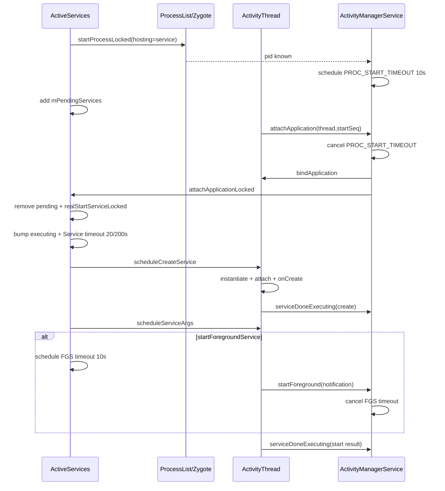

# 112 Android Service Bring-up：进程 Attach、组件创建与三类 Timeout

> 源码版本：Android 11（`android-11.0.0_r48`）  
> 核心源码：`ActiveServices.java`、`ActivityManagerService.java`、`ProcessList.java`、`ActivityThread.java`  
> 环境：macOS 只读源码，不要求编译。  
> 本章目标：追踪一次 Service 从逻辑需求到 App Java 对象创建的完整链，区分进程启动、进程 attach、Service create/bind/start，以及进程 attach timeout、Service execution timeout、FGS transition timeout 三种完全不同的保护机制。

---

## 1. “Service 启动成功”至少有六个完成点

```text
AMS 接受 start/bind 请求
→ ServiceRecord 判定 needed
→ host process 已存在或 fork 成功
→ ApplicationThread attach 到 AMS
→ scheduleCreateService 发到 App
→ ActivityThread 创建 Service 并执行 onCreate
→ bind/onStartCommand 完成
```

日志出现 `Start proc`、`attachApplication` 或 `AM_CREATE_SERVICE` 都只证明其中一段，不能单独证明业务已经可用。

---

## 2. 源码地图

```text
frameworks/base/services/core/java/com/android/server/am/ActiveServices.java
frameworks/base/services/core/java/com/android/server/am/ActivityManagerService.java
frameworks/base/services/core/java/com/android/server/am/ProcessList.java
frameworks/base/services/core/java/com/android/server/am/ServiceRecord.java
frameworks/base/core/java/android/app/ActivityThread.java
frameworks/base/core/java/android/app/IApplicationThread.aidl
frameworks/base/core/java/android/app/Service.java
```

核心方法：

```text
bringUpServiceLocked
ProcessList.startProcessLocked / handleProcessStartedLocked
ActivityManagerService.attachApplicationLocked
ActiveServices.attachApplicationLocked
realStartServiceLocked
ActivityThread.handleCreateService
sendServiceArgsLocked
serviceDoneExecutingLocked
```

---

## 3. bringUpServiceLocked 先看 host 是否已活

```java
if (r.app != null && r.app.thread != null) {
    sendServiceArgsLocked(r, execInFg, false);
    return null;
}
```

若 Service Java 实例已依附活进程，新的 start 请求只需继续投递参数，不必重新 create。

`r.app != null` 不够；必须有 `app.thread`，它才代表 ApplicationThread Binder 已 attach。

---

## 4. 等待 restart timer 时不抢跑

```java
if (!whileRestarting && mRestartingServices.contains(r)) return null;
```

这个判断只约束“调用 bring-up 时，ServiceRecord 仍在 restart list”的路径。不能把它扩大成“任何新的 start/bind 都绝不提前恢复”：r48 的 `startServiceLocked()` 和部分 bind 路径会先调用 `unscheduleServiceRestartLocked()`，明确取消旧 timer，再以新的需求尝试 bring-up。记录一旦从 restart list 移除，这个 guard 自然不再命中。

所以应分两种情况理解：旧需求的定时恢复必须等 restarter，并传 `whileRestarting=true`；新的显式 start/bind 可以通过上层的 unschedule 流程改变状态，但不能偷偷从这个 if 内穿过去。退避是否被重置，还要看 `unscheduleServiceRestartLocked()` 的 membership 与 callingUid 规则。

---

## 5. 正式 bring-up 会离开 restarting/delayed 状态

```text
从 mRestartingServices 移除并清 tracker
从 delayed background-start list 移除
```

这只表示开始尝试启动，不表示已创建 Service。

状态名从 “restarting” 退出后，还可能处于 process pending/attach pending/create executing。

---

## 6. 用户未启动时拒绝

```java
if (!mUserController.hasStartedUserState(r.userId)) {
    bringDownServiceLocked(r);
    return error;
}
```

Service 属于具体用户；用户 stopped 后不能只因旧 ServiceRecord 或 timer 恢复进程。

这与设备开机完成、user unlocked 是不同阶段：started 用户未必已解锁 CE 数据。

---

## 7. 清 package stopped state

允许 launch 后，AMS 请求 PackageManager：

```text
setPackageStoppedState(package, false, userId)
```

这里的 stopped state 是 package force-stop 语义。但真正 force-stopped package 通常不会通过未经允许的入口走到这里；调用链权限/后台启动规则仍在上游约束。

---

## 8. 普通进程与 isolated Service

普通 Service 用：

```text
processName + app UID
```

查已有 ProcessRecord。

isolated Service 用 `r.isolatedProc` 跟踪本次正在运行或等待启动的临时进程，避免每次 bring-up 都再申请一个 isolated UID/PID。

---

## 9. App Zygote 与 WebView Zygote

HostingRecord 可变为：

```text
byWebviewZygote
byAppZygote
```

它决定 fork 来源和诊断 hosting type，不改变后续 ApplicationThread attach 与 Service create 协议的基本形态。

不要把“从不同 zygote fork”理解成无需 attach AMS。

---

## 10. 已有活进程直接 realStart

若按 processName/UID 找到 `app.thread != null`：

```text
addPackage(package/version)
realStartServiceLocked(r, app, execInFg)
```

Service 可以运行在已经承载其他 package/component 的共享进程中，ProcessRecord package list 要补统计归属。

---

## 11. DeadObject 时为什么转为启动新进程

`realStartServiceLocked` Binder 调用抛 RemoteException，说明 `app.thread` 引用看似存在但 endpoint 已死。

源码落回 start-process 路径。异步 death cleanup 可能尚未清完，因此不能只凭非 null thread 断言进程活着。

---

## 12. startProcessLocked

没有 host 且无需 permission review 时：

```java
startProcessLocked(procName, appInfo, true, intentFlags,
        HostingRecord("service", instanceName), ...)
```

返回 `ProcessRecord` 表示启动已被接受或已有 pending record，不代表 zygote fork/attach 完成。

返回 null 常见于 bad process 等不可启动条件，此时 Service 被 bring down。

---

## 13. mPendingServices

启动进程后把 ServiceRecord 放入：

```text
mPendingServices
```

含义：逻辑 Service 需要运行，但尚无已 attach 的 ApplicationThread 可接收 create。

这是 Service 需求与进程启动之间的接力队列。

---

## 14. delayedStop

Service 等进程期间可能收到 stop：

```text
delayedStop=true
```

bring-up 尾部再次检查并应用 stop，避免“stop 发生在 pending 窗口，却在 attach 后复活”。

异步状态机必须在跨阶段边界重复验证当前需求。

---

## 15. startForegroundService 的临时白名单

若 `r.fgRequired`：

```text
tempWhitelistUidLocked(uid, 10s, "fg-service-launch")
```

它让 App 在前台转换窗口完成必要启动行为，不是永久电源/后台白名单，也不等于 Service 已成为 foreground。

---

## 16. zygote fork 成功后的记录

`handleProcessStartedLocked()`：

```text
app.pid = pid
pendingStart=false
处理 PID 冲突旧记录
加入 mPidsSelfLocked
安排 PROC_START_TIMEOUT_MSG
```

此时 Linux 进程存在，但 App runtime 还未通过 Binder 调用 `attachApplication()`。

---

## 17. 第一类 timeout：进程 attach timeout

Android 11 默认：

```text
PROC_START_TIMEOUT = 10 秒
PROC_START_TIMEOUT_WITH_WRAPPER = 1200 秒
```

起点是 AMS 已获知 PID 并加入 PID map，而不是 Service `onCreate()` 开始。

wrapper 调试/插桩进程允许更长启动窗口。

---

## 18. attach timeout 保护什么

它防止：

```text
fork 成功
但 runtime 初始化、class loading、native preload 或 Binder attach 卡死
```

这样的进程永远占据 pending process、Service、Provider、Broadcast 和 Backup 等等待队列。

它不是 Service ANR，因为 Service Java 对象可能还没创建。

---

## 19. 正常 attach 如何取消 timeout

`attachApplicationLocked()` 找到并验证 ProcessRecord 后：

```java
mHandler.removeMessages(PROC_START_TIMEOUT_MSG, app);
```

取消发生在 bindApplication 之前的初始化阶段。

所以 attach timeout 只覆盖“进程联系上 AMS”，不覆盖 `Application.onCreate()` 或 Service 创建全部完成。

---

## 20. attach 身份验证

attach 以：

```text
calling PID
calling UID / startUid
startSeq
pendingStarts
```

匹配 ProcessRecord。若 PID 已属于另一 app/startSeq，会清旧记录；若没有合法 pending record，则 drop/kill 来路不明进程。

这防止旧启动结果或 PID 复用接管新 ProcessRecord。

---

## 21. 无记录 attach 的源码边界

无 pending app 时 AMS 写 `AM_DROP_PROCESS` 并 kill PID；源码随后调用
`noteAppKill(app, ...)`，而该分支里的 `app` 已经是 null。只读到这一层时，很容易误判为
“必然发生空指针异常”。

继续向下追踪会看到：`ProcessList.noteAppKill()` 把参数交给
`AppExitInfoTracker.scheduleNoteAppKill()`；后者首先检查
`app == null || app.info == null`，满足条件便直接返回。因此这个 checkout 中不存在由该调用
直接导致的空指针崩溃。

真正应记住的边界是：这是拒绝来路不明 attach 的异常防御路径。AMS 能按 PID 杀掉该进程，
但因为没有合法 `ProcessRecord`，`ApplicationExitInfo` 侧也无法依靠这个 null 对象补齐完整归因。
阅读防御分支时，要继续追到被调用方法的契约，不能仅凭调用点下结论。

---

## 22. linkToDeath 先于 bindApplication

AMS 为新 `IApplicationThread` 注册 `AppDeathRecipient`，再初始化 adj/sched/flags，随后 `thread.bindApplication(...)`。

如果 App 在 bind 期间死，DeathRecipient 能进入第 110 章统一 cleanup。

若 link 本身失败，AMS 重启进程，不继续使用已死 endpoint。

---

## 23. bindApplication 不等于 Application.onCreate 已完成

Binder `thread.bindApplication()` 将消息安排到 App 主线程；system_server Binder 调用返回，只证明请求进入 App 侧协议。

ActivityThread 后续才：

```text
创建 LoadedApk
安装 providers
创建 Application
调用 Application.onCreate
```

因此 attach 完成与 App 初始化完成之间仍有窗口。

---

## 24. attach 后按组件恢复

AMS 依次让子系统检查：

```text
ATMS：待启动 Activity
ActiveServices：pending/restarting Service
Broadcast：pending receiver
Backup：pending agent
```

一个进程可因 Service fork，却在 attach 时同时承接同进程名下其他等待组件。

---

## 25. ActiveServices.attachApplicationLocked

遍历 `mPendingServices`，匹配：

```text
同 isolatedProc
或 uid + processName 相同
```

命中后先从 pending list 删除，再调用 `realStartServiceLocked()`。

删除在前可避免 realStart 期间异常重入重复消费同记录。

---

## 26. attach 时提前触发 restarting Service

如果同一进程因为别的组件已经启动，而其中某 Service 仍在等待 restart timer：

```text
removeCallbacks(restarter)
post(restarter)
```

既然进程成本已经支付，继续任意等待原退避没有收益。但仍通过 restarter/needed 校验，不直接绕过状态机。

---

## 27. realStart 名字容易误解

源码注释明确：这里的 “start” 是“在 App 进程中 bring up Service 实例”，bindService 同样会调用。

它不专指 `Context.startService()` 的 started-service 语义。

```text
realStartServiceLocked ≠ 一定会 onStartCommand
```

---

## 28. 将 ServiceRecord 绑定到 ProcessRecord

```text
r.setProcess(app)
restartTime = lastActivity = uptime
app.startService(r)
```

`app.startService(r)` 把 ServiceRecord 加入 ProcessRecord 承载集合，并返回是否是新记录。

这是 system_server 内部 ownership 建立，App Java Service 尚未创建。

---

## 29. bumpServiceExecutingLocked("create")

在发 create Binder 前：

```text
executeNesting++
executingStart=now（首次 nesting）
加入 app.executingServices
更新 execServicesFg
安排 SERVICE_TIMEOUT_MSG
```

先登记再调用，才能覆盖 Binder 投递后 App 卡住的窗口。

---

## 30. 为什么有 executeNesting

同一 Service 可能同时有 create、bind、start、unbind、destroy 等未完成操作。

每次 `bump` 增加 nesting，每次 `serviceDoneExecuting` 减少；只有归零才从 executing set 移除并取消/重算 timeout。

它不是 Java 调用栈深度，而是 Framework outstanding operation 计数。

---

## 31. LRU、FGS 与 OOM adj 在 create 前更新

`realStartServiceLocked()` 在 schedule create 前：

```text
updateLruProcessLocked
updateServiceForegroundLocked
updateOomAdjLocked(START_SERVICE)
forceProcessStateUpTo(SERVICE)
```

防止进程正在响应系统 create 请求时仍按 cached victim 被 lmkd 杀。

保护更新必须先于制造内存/CPU 峰值的组件初始化。

---

## 32. scheduleCreateService

```java
app.thread.scheduleCreateService(
    token, ServiceInfo, CompatibilityInfo, reportedProcState)
```

`ServiceRecord` Binder token 让 App 完成后回报时能映射到系统记录。

Binder 返回只表示请求成功发送，不表示 `onCreate()` 已返回。

---

## 33. App 侧创建大意

ActivityThread 主线程处理 create：

```text
LoadedApk.getClassLoader
AppComponentFactory.instantiateService
ContextImpl.createAppContext
service.attach(...)
service.onCreate()
mServices.put(token, service)
AMS.serviceDoneExecuting(token, ...)
```

反射构造、依赖初始化和 `onCreate` 都在 App 主线程；阻塞会进入 Service execution timeout。

---

## 34. create Binder 异常

若 `scheduleCreateService` 抛 DeadObject：

```text
appDiedLocked("Died when creating service")
```

finally 维持 nesting 准确、从 ProcessRecord 拆新 Service，并在非 destroying 时 `scheduleServiceRestartLocked(r, false)`。

旧实例失败仍复用第 111 章重启控制器。

---

## 35. create 后请求 bindings

```text
requestServiceBindingsLocked
```

遍历 IntentBindRecord，对尚未 requested/received 或需要 rebind 的连接发送 bind 请求。

`onCreate` 请求已经发出后即可排 bind，但 App 主线程 Handler 保持消息顺序。

---

## 36. started Service 的 dummy null StartItem

若：

```text
startRequested && callStart && pendingStarts empty
```

Framework 构造 null-intent StartItem，确保 sticky 重建的新实例仍收到 `onStartCommand(null,...)`。

它不是原调用者 Intent 丢失，而是返回值定义的重建协议。

---

## 37. sendServiceArgsLocked

pending items 转为 delivered，更新 deliveryCount/URI grants/executing 状态，然后批量：

```text
scheduleServiceArgs(ServiceStartArgs...)
```

App 主线程最终调用 `onStartCommand()`，并通过 `serviceDoneExecuting` 回报 result。

---

## 38. 第二类 timeout：Service execution timeout

Android 11 常量：

```text
SERVICE_TIMEOUT = 20 秒
SERVICE_BACKGROUND_TIMEOUT = 200 秒
```

由 `proc.execServicesFg` 选择。这里的 fg 表示本次 Service operation 是否由前台上下文执行，不等于 Service 已调用 `startForeground()`。

---

## 39. execution timeout 覆盖哪些回调

凡通过 `bumpServiceExecutingLocked()` 登记的操作：

```text
create
bind/rebind
start args
unbind
destroy
```

都可能使进程进入 executingServices。它不是只监控 `onStartCommand()`。

ANR 文本会指出最早超时的具体 ServiceRecord。

---

## 40. timeout 是进程级定时器

Handler message 的 obj 是 `ProcessRecord`，不是 ServiceRecord。

一个进程可执行多个 Service operation；timer 到期扫描 `proc.executingServices`，找 `executingStart < maxTime` 的记录。

因此同进程一个 Service 卡住，会使整个 App 进程进入 ANR。

---

## 41. 前台 20 秒、后台 200 秒为何不同

前台发起的 Service 操作直接影响用户，20 秒无响应应尽快报告；后台操作给更长窗口，降低慢设备或后台调度导致的误报。

更长不是允许在主线程做 200 秒工作；它只是系统故障检测阈值。

---

## 42. execServicesFg 是 OR 聚合

任一 outstanding Service operation 以 `fg=true` 登记，进程 `execServicesFg |= true`，整个进程使用较短 timeout。

某操作完成后会重扫 remaining services；如果没有其他 `executeFg`，才退回 background timeout。

多个 Service 共进程会互相影响 timeout 档位。

---

## 43. execution timeout 到期时重新验证

```text
debugging → 忽略
executingServices empty/thread null → 忽略
扫描最老 executingStart
进程仍在 LRU → 构造 ANR
否则按最晚起点重新排 timer
```

Handler 延迟和其他 operation 加入/完成会改变真实截止点，所以不能定时消息一到就直接判 ANR。

---

## 44. 为什么 ANR 调用在锁外

`serviceTimeout()` 在 AMS 锁内只生成 dump/`anrMessage`，离开锁后：

```text
mAnrHelper.appNotResponding(proc, message)
```

ANR 收集可能耗时并涉及多锁/多进程，不能长期占用 AMS 全局锁。

---

## 45. debugging 时忽略 timeout

断点会故意暂停 App 主线程；若仍按 20 秒判 ANR，调试无法进行。

忽略只适用于 debugger-attached 状态，不是 debug build 所有 Service 自动豁免。

---

## 46. serviceDoneExecuting

App 通过 AMS Binder 回报 token/type/startId/result。系统找到 ServiceRecord 后：

- 根据 STICKY/NOT_STICKY/REDELIVER 更新 StartItem。
- `executeNesting--`。
- nesting 归零时从 executing set 移除。
- 若进程无其他 executing Service，移除 timeout message。
- 更新 OOM adj。

这才是某次 Framework Service operation 的确认点。

---

## 47. App 没回 done 会怎样

可能原因：

- App 主线程阻塞/死循环。
- `onCreate/onBind/onStartCommand/onDestroy` 太慢。
- Binder request 在主线程队列长期排队。
- native 锁/IO/GC 卡住。

只要进程未死且 operation outstanding，最终由 Service timeout 进入 ANR，而非 attach timeout。

---

## 48. system_server 自身 Service 的早期豁免

boot phase 尚未到 `PHASE_THIRD_PARTY_APPS_CAN_START` 且 Service host 是 system_server 时，`bumpServiceExecutingLocked` 不安排 timeout。

因为 system_server Service 可能要等主 Looper 启动；早期弹自身 ANR 没有意义。

这不是第三方 App 的通用豁免。

---

## 49. 第三类 timeout：FGS transition timeout

`startForegroundService()` 产生 `r.fgRequired=true`。发送 start args 时：

```text
若尚未 foreground 且 !fgWaiting
→ scheduleServiceForegroundTransitionTimeoutLocked
```

Android 11 默认 10 秒。

它监控“调用 startForeground()”，不是监控所有 Service 回调完成。

---

## 50. FGS timer 从何时开始

不是 API 调用瞬间，也不是 zygote fork 瞬间；代码在 Service args 真正准备投递且 App 进入 executing 状态后安排。

bring-up 前还有 UID 临时白名单 10 秒用于启动窗口，但两者用途不同。

时间数值相同不代表同一个 timer。

---

## 51. schedule FGS timeout 的前提

```java
if (r.app.executingServices.size() == 0 || r.app.thread == null) return;
```

必须已有活 ApplicationThread 且 Service operation 在执行。否则尚未到 App 能履约 `startForeground()` 的阶段。

---

## 52. 正常 startForeground 如何取消

`setServiceForegroundInnerLocked()`：

```text
fgRequired=false
fgWaiting=false
remove SERVICE_FOREGROUND_TIMEOUT_MSG(r)
```

但源码顺序非常重要：非空 notification、权限和 foregroundServiceType 子集等前置校验发生在清 flag 之前，失败抛异常时不会兑现契约；进入清 flag 位置后，r48 才继续检查 AppOps/后台限制。后两者即使决定 `ignoreForeground`、不真正把 `isForeground` 设为 true，`fgRequired` 也已经清除，timeout 也已取消。

因此要分别回答两个问题：

```text
是否完成 startForegroundService 的“及时调用”义务？
  看前置校验后 fgRequired 是否被清除

是否真的成为 foreground Service？
  看后续策略是否接受，并最终设置 isForeground/notification
```

“调用过方法”不保证真正获得 FGS 待遇；但也不能笼统说 AppOps ignored 一定让 10 秒 timeout 继续存在。

---

## 53. FGS timeout 处置

到期重新检查：

```text
!fgRequired 或 destroying → return
debugging → return
fgWaiting=false
stopServiceLocked(r)
锁外 appNotResponding
```

ANR 文本明确：

```text
startForegroundService() did not then call Service.startForeground()
```

---

## 54. 为什么 timeout 先 stop Service 再 ANR

契约已违反，系统先撤销该 Service 的 started 需求，避免它在 ANR 处理期间仍保持 fg-required/临时待遇。

ANR 是对 host process 的责任追究，stop 是对 Service 状态的纠正。

---

## 55. bringDown 时仍 fgRequired

Service 在 10 秒到期前因其他原因被 bring down，但仍未调用 startForeground：

```text
清 fgRequired/fgWaiting
取消 timeout
finish AppOp
post SERVICE_FOREGROUND_CRASH_MSG
```

Handler 随后 `crashApplication()`，而不是走同一 `serviceForegroundTimeout()` ANR 路径。

---

## 56. FGS timeout 与 crash 路径为何都存在

```text
Service 仍在运行直到 timer 到期
  → stop + ANR

Service 在等待期间主动/被动 bringDown
  → post crash
```

两条路径都防止 App 通过快速停止或异常退出规避 `startForegroundService → startForeground` 契约。

---

## 57. 三类 timeout 对照

| 机制 | 默认时间 | 起点 | 等待什么 | 主要处置 |
|---|---:|---|---|---|
| Process start | 10s | PID 加入 AMS map | ApplicationThread attach | 清 pending、kill，INITIALIZATION_FAILURE |
| Service execution fg/bg | 20s/200s | bump executing | create/bind/start/unbind/destroy done | Service ANR |
| FGS transition | 10s | start args 投递阶段 | 成功 startForeground | stop+ANR，或 bringDown 时 crash |

wrapper process start timeout 是 1200 秒。

---

## 58. 一个冷启动 Service 时间线



---

## 59. 热进程 Service 时间线

host 已 attach 时省去 fork/attach：

```text
bringUpServiceLocked
→ realStartServiceLocked
→ bump executing
→ scheduleCreateService
→ bind/start args
```

因此没有新的 process-start timeout，但仍有 Service execution/FGS timeout。

热进程并不保证主线程空闲，create 仍可能 ANR。

---

## 60. shared process 中的影响

多个组件共享一个 ProcessRecord：

- 一个 Service 的主线程卡顿会阻塞该进程所有 Activity/Receiver/Provider。
- executing timeout 对整个进程报 ANR。
- `execServicesFg` 由所有 executing Service 聚合。
- 进程死亡会清理全部 Service，不只出错者。

进程边界才是故障隔离边界。

---

## 61. attachApplication 的 bind 异常

`bindApplication` 或后续初始化抛异常：

```text
unlink death recipient
kill REASON_INITIALIZATION_FAILURE
handleAppDiedLocked
```

这不同于 process-start timeout：进程已 attach，但初始化 Binder 协议失败。

ApplicationExitInfo reason 可相同，description/时间线用于区分。

---

## 62. processStartTimedOutLocked 的 cleanup

只有 `removePidIfNoThread(app)` 确认仍未 attach 才处理：

```text
AM_PROCESS_START_TIMEOUT
移除 processName/UID/PID
清 launching providers
ActiveServices.processStartTimedOutLocked
kill INITIALIZATION_FAILURE
释放 isolated UID
移除 LRU
通知 backup/跳过 pending broadcast
```

迟到 timeout 若 thread 已 attach，会被视为 spurious，不误杀正常进程。

---

## 63. pending Service 的 timeout 清理

`ActiveServices.processStartTimedOutLocked(app)` 找到指向该 ProcessRecord/isolatedProc 的 pending Service 后，会：

```text
isolatedProc = null
从 mPendingServices 移除
bringDownServiceLocked(sr)
```

也就是说，r48 对这次 attach 失败不是在这里再安排一次 Service restart，而是把这些 pending Service 直接 bring down，撤销当前 ServiceRecord 的 start/bind 运行状态。以后若出现新的、合法的 start/bind 请求，可以重新建立需求；不能把它说成原 timer 自动进入第 111 章退避重试。

---

## 64. timeout 使用 Handler，不保证精确毫秒

所有 timer 最终在 system_server Handler queue 执行：

- 主线程繁忙可能晚于 deadline。
- 到期函数使用当前状态/时间重新验证。
- 时间是最早检查点，不是实时硬中断。

Android timeout 是 watchdog 式检测，不是 kernel CPU deadline。

---

## 65. 常见误解一——10 秒都从 startService API 开始

进程 attach timeout 从 PID known 开始；FGS timeout 从 args 投递阶段开始；二者虽然默认 10 秒，却是不同时钟和消息类型。

API 到这些起点之前还可能经过后台启动限制、restart backoff、进程队列等等待。

---

## 66. 常见误解二——Service 20 秒超时只看 onStartCommand

create、bind、unbind、destroy 也走 executing nesting。ANR 文本 “executing service” 必须结合 `why`、executingStart、trace 和生命周期位置判断。

---

## 67. 常见误解三——后台 Service 可以在主线程工作 200 秒

200 秒只是系统更宽松的故障阈值。主线程长任务仍阻塞 Binder/Receiver/UI，可能先触发其他 ANR 或性能问题。

耗时工作应使用合适 worker/executor/job，而不是把 timeout 当预算。

---

## 68. 常见误解四——取消 FGS timeout 就等于已经获得前台待遇

r48 先做 notification、permission、foregroundServiceType 等前置校验，然后清 `fgRequired/fgWaiting` 并取消 timeout，之后才可能因 AppOps 或后台限制把真正的 foreground 转换忽略掉。

所以应同时查看 `fgRequired/fgWaiting/isForeground` 与 notification：前两者归零说明及时调用义务已结算，不必然说明最后一个字段已经为 true。反过来，前置校验抛异常发生在清 flag 之前，义务仍可能未完成。

---

## 69. 常见误解五——scheduleCreateService 返回就执行完 onCreate

它是 Binder 调度入口。真正 `onCreate` 在 App 主线程，最终以 `serviceDoneExecuting` 和后续 publish/start 回报为完成证据。

---

## 70. 常见误解六——进程已 attach 就不会初始化失败

attach 只建立 ApplicationThread 与 ProcessRecord 关联；bindApplication、Application 创建、Provider 安装、组件 create 仍可失败。

进程启动成功率需要分段统计。

---

## 71. 常见误解七——FGS timeout 一定是 crash

timer 正常到期走 stop + ANR；等待期 bringDown 走异步 crash。两个结果和 AppExitInfo/错误 UI 路径不同。

---

## 72. macOS 只读练习一：追 bring-up

```bash
cd /Users/ninebot/androidSource

sed -n '2935,3085p' \
  frameworks/base/services/core/java/com/android/server/am/ActiveServices.java
```

画出已有进程、普通冷启动、isolated、user stopped、bad process、restart pending 六个分支。

---

## 73. macOS 只读练习二：追 PID→attach

```bash
sed -n '2535,2590p' \
  frameworks/base/services/core/java/com/android/server/am/ProcessList.java

sed -n '5010,5160p' \
  frameworks/base/services/core/java/com/android/server/am/ActivityManagerService.java
```

标出 startSeq/UID/PID 校验、timeout 安排/取消、linkToDeath 和 bindApplication 的顺序。

---

## 74. macOS 只读练习三：追 Service 接力

```bash
sed -n '3765,3820p' \
  frameworks/base/services/core/java/com/android/server/am/ActiveServices.java

sed -n '3090,3185p' \
  frameworks/base/services/core/java/com/android/server/am/ActiveServices.java
```

解释 mPendingServices 为何先删后 realStart，以及 attach 为何可提前唤醒同进程 restarting services。

---

## 75. macOS 只读练习四：追 App 侧 create

```bash
rg -n 'scheduleCreateService|handleCreateService|serviceDoneExecuting' \
  frameworks/base/core/java/android/app/ActivityThread.java \
  frameworks/base/services/core/java/com/android/server/am/ActivityManagerService.java
```

列出 Binder 入队、反射实例化、attach Context、onCreate、mServices.put、done 回报的先后关系。

---

## 76. macOS 只读练习五：追 execution timeout

```bash
sed -n '2648,2698p' \
  frameworks/base/services/core/java/com/android/server/am/ActiveServices.java

sed -n '4255,4325p' \
  frameworks/base/services/core/java/com/android/server/am/ActiveServices.java

sed -n '3695,3745p' \
  frameworks/base/services/core/java/com/android/server/am/ActiveServices.java
```

模拟两个 Service 共进程、一个 fg 一个 bg 的 timer 与 nesting 变化。

---

## 77. macOS 只读练习六：追 FGS timeout

```bash
sed -n '1360,1430p' \
  frameworks/base/services/core/java/com/android/server/am/ActiveServices.java

sed -n '4320,4400p' \
  frameworks/base/services/core/java/com/android/server/am/ActiveServices.java

sed -n '3365,3410p' \
  frameworks/base/services/core/java/com/android/server/am/ActiveServices.java
```

比较正常取消、timer ANR、bringDown crash 三条路径。

---

## 78. macOS 只读练习七：建立超时矩阵

为每个 timeout 填：

```text
message code
message.obj 类型
默认时长
安排位置
取消位置
到期二次校验
reason/ANR/crash 结果
```

再加入 Provider publish timeout 和 Broadcast timeout，观察 Android 如何按协议阶段拆 watchdog。

---

## 79. 第二次复读：五个“启动”

```text
startService API 被接受
startProcess request 被接受
zygote fork 返回 PID
ApplicationThread attach
Service Java instance onCreate
onStartCommand/bind 完成
```

它们之间都有异步边界。准确日志必须说清“哪个启动完成”。

---

## 80. 第二次复读：三个 timeout 的责任主体

```text
Process attach timeout
  责任：新 App runtime 没与 AMS 建立接口

Service execution timeout
  责任：App 主线程没完成 Framework 要求的生命周期操作

FGS transition timeout
  责任：Service 没兑现 foreground notification/状态契约
```

症状都可能表现为“服务没起来”，根因与修复完全不同。

---

## 81. 第二次复读：保护先于调用

源码反复采用：

```text
先加入 pending/executing/timeout/death recipient
再发 Binder 或等待异步结果
```

若反过来，App 可能在登记之前就 crash、回调或卡住，system_server 将没有可恢复的状态记录。

---

## 82. 排障顺序

Service 冷启动失败：

```text
1. bringUp 是否被 restart list/user stopped/bad process 拦截？
2. ProcessRecord 是 pending、PID known 还是 thread attached？
3. startSeq/UID/PID 是否匹配？
4. PROC_START_TIMEOUT 是否触发或已正常取消？
5. bindApplication/Application.onCreate 是否成功？
6. Service 是否仍在 mPendingServices？
7. realStart 是否 scheduleCreateService 成功？
8. executingStart/executeNesting/execServicesFg 是什么？
9. App 主线程 trace 卡在 create/bind/start 哪个回调？
10. fgRequired/fgWaiting/isForeground 与 notification/AppOps？
11. 最终是 initialization failure、Service ANR 还是 FGS ANR/crash？
```

---

## 83. 本章检查题

1. `startProcessLocked` 返回 ProcessRecord 证明了什么、没证明什么？
2. mPendingServices 如何把 Service 需求接到 attach？
3. attach timeout 为什么不覆盖 Application.onCreate 全过程？
4. `realStartServiceLocked` 为何 bindService 也会调用？
5. executeNesting 如何覆盖多个 Service operation？
6. 20 秒/200 秒由哪个状态选择？
7. FGS 10 秒从哪个阶段安排？
8. FGS timer ANR 与 bringDown crash 有何区别？
9. 为什么 attach 时可以提前唤醒同进程 restarting Service？
10. 如何证明 Service 业务真正可用？

---

## 84. 本章结论

Android 11 把 Service bring-up 分成一串可恢复、各自受 watchdog 保护的阶段：

```text
ServiceRecord needed
  → bringUp 检查 user/restart/delayedStop
  → 复用活进程或 startProcess
  → PID known 后 10s attach timeout
  → attach 验证 PID/UID/startSeq 并 bindApplication
  → mPendingServices 接力到 realStart
  → 先登记 executing/adj/LRU，再 scheduleCreateService
  → App 主线程 instantiate/attach/onCreate
  → bind/start args 与 serviceDoneExecuting
  → foreground operation 20s、background 200s execution timeout
  → startForegroundService args 后 10s FGS transition timeout
  → 正常 done/startForeground 分别取消对应 watchdog
```

最重要的四个结论：

1. 进程 fork、attach、Application 初始化、Service create 和业务可用是不同完成点。
2. 三类 timeout 的起点、message 对象、责任主体与处罚不同，不能只比较数字。
3. Service execution timeout 覆盖 create/bind/start/unbind/destroy，并按 ProcessRecord 聚合。
4. FGS 契约既有到期 ANR，也有等待期 bringDown 后 crash，调用方法不等于成功完成转换。

下一章将精读 Service 执行超时进入 ANR 后的取证：`AnrHelper`、`ProcessErrorStateRecord`、PID 分组、stack dump、CPU tracker、DropBox、stats 与 ANR dialog 如何协作，以及多个 ANR 请求怎样避免串行阻塞 Binder 入口。
