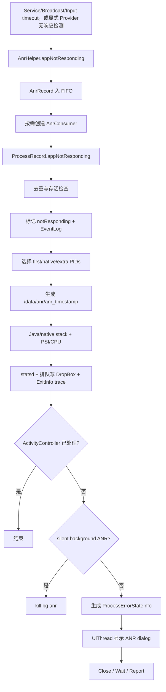
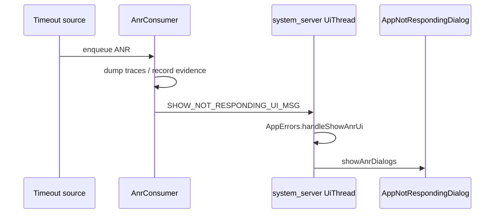

# 113 Android ANR 证据链：AnrHelper、Trace、CPU 与处置决策

> 源码版本：Android 11 / API 30 / `android-11.0.0_r48`  
> 阅读方式：macOS 只读源码，不要求编译 AOSP  
> 前置章节：第 97、98、104、106、111、112 章

---

## 1. 本章解决什么问题

第 112 章停在：Service 执行超过 20 秒或 200 秒后，
`ActiveServices.serviceTimeout()` 调用：

```java
mAm.mAnrHelper.appNotResponding(proc, anrMessage);
```

这一行并不等于“立刻弹 ANR 框”，也不等于“立刻杀进程”。它启动的是一条较长的证据生产与
处置链。本章回答：

1. 为什么 ANR 不能直接在超时回调线程里完成？
2. 多个 ANR 同时到来时如何排队，为什么超过一分钟只抓自身？
3. 哪些 PID 会进入 trace，顺序为什么重要？
4. Java trace 如何借助 tombstoned 写进 `/data/anr`？
5. trace 失败、超时或只抓到半份时怎么办？
6. PSI、CPU、EventLog、statsd、DropBox、ApplicationExitInfo 各记录什么？
7. 为什么有的 ANR 静默杀进程，有的显示 Wait/Close/Report？

---

## 2. 先建立总图



主线分成四段：发现、排队、取证、处置。把这四段混在一起，是理解 ANR 最常见的障碍。

---

## 3. ANR 是系统结论，不是 Java 异常

ANR 没有像 `NullPointerException` 那样从故障点抛出。它是系统根据某项工作“在期限内没有
完成”作出的外部判断。

因此：

- 故障线程可能仍在运行，只是慢；
- 进程可能仍然活着；
- timeout 线程通常不是被卡住的线程；
- trace 是事后采样，不保证恰好停在最初的故障指令；
- 用户点 Wait 后，应用甚至可能恢复。

ANR 更像“期限违约事件”，而不是某个语言级异常类型。

---

## 4. ANR 的入口不止 Service

本 checkout 中可见的典型入口包括：

| 来源 | 入口位置 | annotation 示例 |
|---|---|---|
| Service 执行超时 | `ActiveServices` | `executing service ...` |
| Broadcast 超时 | `BroadcastQueue` | 广播相关原因 |
| ContentProvider 无响应 | `ActivityManagerService` | `ContentProvider not responding` |
| App 主动声明无响应 | `IActivityManager.appNotResponding` | 调用方提供 reason |
| Activity/Input 等 | ATMS/WMS 转入 AMS | activity、parent 等上下文 |

不同入口的“超时检测器”不同，但后半段可以汇合到 `AnrHelper` 和
`ProcessRecord.appNotResponding()`。

---

## 5. 为什么先经过 AnrHelper

源码注释给出直接动机：ANR 处理很慢，调用者不应该为此长时间阻塞。

```java
class AnrHelper {
    private final ArrayList<AnrRecord> mAnrRecords = new ArrayList<>();
    private final AtomicBoolean mRunning = new AtomicBoolean(false);
}
```

耗时项至少包括：

- 更新 CPU 统计；
- 枚举相关进程；
- 向多个进程请求线程栈；
- 等待 tombstoned/debuggerd；
- 写文件、DropBox 和 stats；
- 与 Window/Activity 管理及 UI 线程协调。

如果这些都在 Service timeout Handler 或 BroadcastQueue 所在线程同步完成，诊断本身会扩大
system_server 的阻塞范围。

---

## 6. 入队只保存一次事件快照

```java
synchronized (mAnrRecords) {
    mAnrRecords.add(new AnrRecord(anrProcess, activity, aInfo,
            parent, parentProcess, aboveSystem, annotation));
}
startAnrConsumerIfNeeded();
```

`AnrRecord` 保存目标进程、Activity/parent、原因、显示层级和入队时的 uptime。

它不是完整系统快照。真正选择 PID、检查存活、抓栈发生在稍后的消费阶段，所以排队越久，
现场越可能变化。

---

## 7. 为什么 AtomicBoolean 不能换成普通 boolean

多个超时来源可并发调用 `appNotResponding()`。只有一个调用者应该把消费者从“未运行”切换到
“运行”：

```java
if (mRunning.compareAndSet(false, true)) {
    new AnrConsumerThread().start();
}
```

`compareAndSet` 把检查与写入合成一个原子动作。普通的：

```text
if (!running) {
    running = true;
    startThread();
}
```

可能让两个调用者同时看到 false，从而启动两个消费者并行抓栈。并行抓栈会争用 CPU、磁盘和
debuggerd，恰好让已经很慢的系统更慢。

---

## 8. 队列是 FIFO，而且消费者是临时线程

消费者通过 `remove(0)` 取最早的记录：

```java
private AnrRecord next() {
    synchronized (mAnrRecords) {
        return mAnrRecords.isEmpty() ? null : mAnrRecords.remove(0);
    }
}
```

队列耗尽后线程退出，并把 `mRunning` 置回 false。这不是常驻线程池。

这样的设计适合 ANR 的特点：事件正常情况下稀少，发生时诊断很重，串行化比追求吞吐更重要。

---

## 9. 退出消费者时为什么还要再检查一次队列

源码在 `mRunning.set(false)` 后重新持有队列锁：

```java
synchronized (mAnrRecords) {
    if (!mAnrRecords.isEmpty()) {
        startAnrConsumerIfNeeded();
    }
}
```

这是为了关闭竞态窗口：消费者刚发现队列空，生产者恰好又追加记录。最后一次复查保证新记录
不会因为“旧消费者正退出、生产者以为它仍在跑”而永久滞留。

---

## 10. 一分钟过期策略不是丢弃 ANR

```java
long reportLatency = startTime - r.mTimestamp;
boolean onlyDumpSelf = reportLatency > TimeUnit.MINUTES.toMillis(1);
r.appNotResponding(onlyDumpSelf);
```

排队超过 1 分钟的记录仍然处理，只是 `onlyDumpSelf=true`。系统仍会抓涉嫌 ANR 的应用，
但不再扩展到 parent、system_server、persistent、IME 和 CPU top 进程。

理由有两层：

1. 一分钟前其他进程的当前栈已不太能代表当时现场；
2. 在 ANR 风暴下继续全量抓栈会进一步压垮系统。

这是“证据价值随时间衰减”驱动的降级策略。

---

## 11. uptime 为什么适合算排队延迟

`AnrRecord.mTimestamp` 和消费时间都用 `SystemClock.uptimeMillis()`。

它不会受用户修改时间、NTP 校时或时区变化影响，适合计算进程内单调时间差。它在 deep sleep
期间不累计；这里衡量的是系统实际可运行期间的排队和处理延迟，而不是墙上时钟日期。

---

## 12. 进入 ProcessRecord 后先给 WMS 一次 early hook

```java
mWindowProcessController.appEarlyNotResponding(annotation,
        () -> kill("anr", REASON_ANR, true));
```

Activity/Window 层可能有 controller 或测试控制逻辑。这里提供早期通知和 kill 回调，但随后
AMS 仍继续自己的存活判断与取证流程。

不要把 `appEarlyNotResponding` 理解成已经完成 ANR 处置；它只是前置协作点。

---

## 13. 第一轮锁内检查：不为无意义对象抓栈

AMS 锁内依次排除：

```text
system 正在 shutdown
已经 notResponding
已经 crashing
killedByAm
killed
```

这些判断分别防止关机期噪音、重复 ANR、crash/ANR 双重处置，以及为正在死亡或已经死亡的
进程浪费抓栈成本。

“超时消息到达”只是候选事件；通过这轮校验后才成为正式 ANR 处理。

---

## 14. 为什么先 setNotResponding(true)

校验通过后立即：

```java
setNotResponding(true);
EventLog.writeEvent(EventLogTags.AM_ANR, ...);
firstPids.add(pid);
```

抓栈可能花十几秒。如果等抓栈结束才设置状态，同一进程的第二个 timeout 可以再次进入，造成
重复重型诊断。先置位相当于为该 ProcessRecord 占领 ANR 处理权。

---

## 15. firstPids 的第一个永远是涉嫌进程

目标 PID 首先加入 `firstPids`。这个顺序不仅是优先级，还影响隐私和退出记录：后面会记录
第一个 PID 在组合 trace 文件中的起止 offset，只把这一段交给该应用对应的
`ApplicationExitInfo`。

因此“first”具有三重意义：

- 最先取证，降低现场漂移；
- 在总预算耗尽前最有机会成功；
- 单独标记区间，避免向应用暴露其他进程栈。

---

## 16. 前台 ANR 的 PID 分组

非静默、非过期场景下，源码大致按下面顺序组织：

```text
firstPids:
  1. ANR app
  2. parent process（若不同）
  3. system_server（若不同）
  4. persistent process
  5. treatLikeActivity（常见候选如 IME）

lastPids:
  其他活着的 Java app process
```

`lastPids` 不会全部抓取。CPU 采样后只选其中工作最活跃的最多 5 个，成为 `extraPids`。

---

## 17. 为什么抓 system_server

应用主线程卡住不一定是应用自己死循环。它可能正在同步 Binder 调 system_server，并等待某把锁、
磁盘 I/O 或另一个服务。

只看应用栈可能看到：

```text
main -> BinderProxy.transact -> nativePollOnce
```

但真正答案在 system_server 对端线程和锁拥有者上。把 system_server 放进高优先级集合，是为了
重建跨进程等待链。

---

## 18. 为什么不是把所有 App 都抓一遍

全量抓栈成本很高，而且多数进程与当前故障无关。Android 11 使用两阶段筛选：

1. persistent、parent、system_server 等高价值进程直接抓；
2. 对其他 Java 进程先采样 CPU，只补充最忙的最多 5 个。

它试图在 20 秒总预算内最大化信息量，而不是追求“系统全景”。

---

## 19. silent ANR 的准确含义

```java
boolean isSilentAnr() {
    return !getShowBackground() && !isInterestingForBackgroundTraces();
}
```

它不是简单的“进程 procState 在后台”。还取决于系统是否配置显示后台 ANR，以及该进程是否
对用户/系统具有足够诊断兴趣。

silent ANR 会减少关联 PID、跳过 CPU 排名，最终通常直接 kill，而不显示对话框。

---

## 20. PSI 是现场环境，不是 ANR 判定器

处理代码先把 `MemoryPressureUtil.currentPsiState()` 加入 report。

这份 PSI 能帮助判断系统是否处于 CPU/内存压力背景，但它没有决定“是否 ANR”。ANR 已经由
Service/Broadcast/Input 等各自 timeout 判定。

因此正确关系是：

```text
timeout 判定 ANR
PSI 帮助解释为什么系统当时可能普遍变慢
```

---

## 21. CPU 统计有两套用途

源码里容易把两个 `ProcessCpuTracker` 混为一个：

- `mService.mProcessCpuTracker`：AMS 长期维护，用于打印时间窗口内系统 CPU 状态；
- 局部新建的 `ProcessCpuTracker(true)`：本次 ANR 使用，采样并给 `lastPids` 排名。

局部 tracker 会 `init()`、睡眠 200ms、`update()`。这 200ms 是采样窗口的一部分，不是应用
ANR timeout 的额外判定时间。

---

## 22. nativePids 是预定义的重点 native 进程

前台 ANR 会解析 `NATIVE_STACKS_OF_INTEREST` 对应进程名的 PID。静默或过期时，只有当涉嫌
进程自身恰好在这张表内，才保留相应 native 抓栈。

这避免每次后台 ANR 都对一批核心 native daemon 做昂贵取证。

---

## 23. `/data/anr` 每次一个独立文件

Android 11 在本路径中使用：

```java
new File("/data/anr", "anr_" + formattedDate)
```

文件通过 `createNewFile()` 创建，权限设为 `0600`。每组 ANR trace 使用独立文件，bugreport
可以收集近期文件。

这与更老版本常见的单个 `/data/anr/traces.txt` 心智模型不同。读源码时必须以版本为准。

---

## 24. 文件轮转的两个约束

创建新文件前 `maybePruneOldTraces()`：

- 删除超过一天的 trace；
- 按修改时间倒序，仅保留受 `tombstoned.max_anr_count` 控制的近期集合，默认 64。

源码条件写成 `i > max`，索引从 0 开始，而且裁剪发生在创建本次新文件之前。默认
`max=64` 时，仅按数量条件会暂留旧文件索引 0～64，也就是最多 65 个；随后再创建本次文件，
瞬时数量还可能达到 66 个（一天时限和创建失败等情况另算）。所以这里不能只凭属性名口头说
“严格最多 64 个”，实现存在明确的边界差异。

---

## 25. Java trace 不是 system_server 直接读取目标内存

核心调用是：

```java
Debug.dumpJavaBacktraceToFileTimeout(pid, fileName, seconds)
```

底层通过运行时/debuggerd/tombstoned 相关机制请求目标进程输出 Java 线程栈，并把数据写入
指定 ANR 文件。system_server 负责调度和文件组织，不是在 Java 层逐线程读取另一个进程的栈。

---

## 26. Java 抓栈“返回成功”还不够

源码在 API 返回成功后仍检查 ANR 文件总长度，常量最低值为 100 bytes。过小会被视为失败，
随后尝试 native backtrace：

```java
if (!javaSuccess) {
    Debug.dumpNativeBacktraceToFileTimeout(pid, fileName, 2);
}
```

native fallback 的价值是：即使 ART 无法正常响应 Java 栈请求，仍可能看到线程在 native
层的 futex、binder、poll、锁或系统调用位置。

这里还有一个容易漏掉的实现边界：多个 PID 追加到同一文件，而检查的是
`new File(fileName).length()`，不是“本次调用前后长度差”。因此对第一个 PID，100 bytes 检查
基本能筛掉空结果；对后续 PID，文件可能早已超过 100 bytes，这项检查不能严格证明当前 PID
真的追加了有效 Java 栈。API 返回值仍是主要信号，而这只是粗粒度防御。

---

## 27. 20 秒是整组 trace 的共享预算

```java
long remainingTime = 20 * 1000;
```

每抓一个 first/native/extra PID 都扣除实际耗时。预算耗尽立即停止后续收集。

这 20 秒不是第 112 章的 Service 20 秒 timeout：

| 20 秒 | 作用 |
|---|---|
| `SERVICE_TIMEOUT` | 判断前台紧迫 Service 执行是否超时 |
| trace `remainingTime` | ANR 已成立后，限制整组栈取证成本 |

数值相同不代表同一个计时器。

---

## 28. timeout 参数存在秒级截断边界

Java/native dump API 接收秒数，源码用 `(int) (timeoutMs / 1000)` 转换。剩余不足 1000ms 时
可能变成 0 秒。这里展示了跨 API 时间单位转换的边界：上层毫秒预算不一定能被底层原样表达。

分析超时问题时，要同时检查“值”和“单位”。

---

## 29. first PID offset 如何保护数据边界

抓第一个 PID 前记录文件长度，抓完后再次记录：

```text
firstPidStart = length before dump
firstPidEnd   = length after dump
```

之后：

```java
scheduleLogAnrTrace(pid, uid, packages, tracesFile,
        offsets[0], offsets[1]);
```

`AppExitInfoTracker` 只保存该区间对应的涉嫌应用栈，而不是整份包含 system_server 和其他 App
的组合文件。这是诊断可用性与跨进程隐私隔离之间的重要设计。

---

## 30. system_server 为何不记录为 first PID 区间

源码只有在第一个 PID 不是 `MY_PID` 时才建立 first-PID offsets。注释明确说不会为
system_server 复制 ANR trace 到应用退出记录机制。

system_server 自身的故障恢复、Watchdog 与普通 App 的 `ApplicationExitInfo` 模型不同，不能
机械套用应用侧接口。

---

## 31. trace 创建失败时仍有最后退路

如果文件创建或整套 dump 失败，源码发送：

```java
Process.sendSignal(pid, Process.SIGNAL_QUIT); // SIGQUIT = 3
```

它请求涉嫌进程自行输出线程信息到日志相关路径。此时不会假装已经拥有规范 ANR 文件。

所以诊断时“没有 `/data/anr/anr_*`”不等于“系统没有识别 ANR”；还应查 logcat、EventLog、
stats 和 DropBox。

---

## 32. 一次 ANR 会留下哪些证据

| 证据 | 主要内容 | 主要用途 |
|---|---|---|
| EventLog `AM_ANR` | user、pid、process、flags、annotation | 快速事件时间线 |
| logcat | ANR 摘要、Reason、CPU/PSI、抓栈错误 | 即时排查 |
| `/data/anr/anr_*` | 多进程 Java/native 栈 | 阻塞链分析 |
| statsd `ANR_OCCURRED` | uid、进程、组件、前后台、进程类别 | 聚合统计 |
| DropBox `anr` | 摘要、report、trace 引用/内容 | bugreport 与长期诊断 |
| BatteryStats | `noteProcessAnr` | 电池/行为记账 |
| ApplicationExitInfo | ANR reason 与本应用 trace 片段 | 应用可查询退出历史 |
| PackageWatchdog | package failure | 包/模块健康决策 |

这些不是同一份信息的无意义复制：它们服务于不同权限、保留周期和消费方。

---

## 33. statsd 前后台字段不是 silentAnr 的同义词

`ANR_OCCURRED` 的 foreground state 使用 `isInterestingToUserLocked()`。silent 判定使用
`getShowBackground()` 与 `isInterestingForBackgroundTraces()`。

两者目标不同，所以不能用 stats Atom 的 foreground 字段反推一定弹框，也不能用是否弹框
反推进程的单一 procState。

---

## 34. DropBox 请求发生在 UI 决策之前，写入是异步的

源码先完成 stats，并调用：

```java
mService.addErrorToDropBox("anr", ...);
```

然后才让 Window/Activity controller 处理、判断 silent、生成错误状态并发 UI 消息。但 `addErrorToDropBox()` 对普通 App 会新建 `Error dump: <tag>` worker；调用返回只表示写入任务已启动，不表示 `dbox.addText()` 已经完成。只有 `process == null` 的内部错误才在调用线程同步执行 worker。

所以准确时序是“先提交 DropBox 工作，再做最终处置”。这让静默 kill、无法显示对话框或用户立即关闭时仍尽量保留证据，但不能用源码调用顺序证明 DropBox 条目一定早于 dialog 或 kill 落盘。

---

## 35. WindowProcessController 的第二次 hook实际服务于 ActivityController

取证后调用：

```java
mWindowProcessController.appNotResponding(info,
        killCallback,
        serviceTimeoutRescheduleCallback)
```

`WindowProcessController` 在 ATMS global lock 下查询可选的 `IActivityController`。若 controller 返回非 0，方法会在锁外执行 kill 或重新安排 Service timeout 的 callback，并返回 true；AMS 随即不再走默认 UI 分支。若根本没有 controller，则直接返回 false。

第二个回调可重新安排 Service timeout。这体现跨子系统协作：ATMS/WPC 承载 controller 协议，AMS 掌握进程、Service 与 kill 能力；不能把这一层泛化成所有窗口管理策略都会自动接管 ANR。

---

## 36. 静默后台 ANR 为什么直接 kill

若仍属于 silent ANR 且不在调试：

```java
kill("bg anr", ApplicationExitInfo.REASON_ANR, true);
return;
```

后台用户通常看不到、也无法对无关进程做有意义交互；保留一个已失去响应的后台进程还会占用
资源。系统先取证，再直接结束。

`isDebugging()` 是重要例外：调试器可能故意暂停进程，系统不应轻率杀死调试现场。

---

## 37. 非静默 ANR 如何建立错误状态

`makeAppNotRespondingLocked()` 会：

1. 保持 `notResponding=true`；
2. 生成 `ProcessErrorStateInfo.NOT_RESPONDING`；
3. 查找 error report receiver；
4. 停止冻结 Activity；
5. 让进程可被错误状态查询与 UI 使用。

这里的 `ProcessErrorStateInfo` 是结构化状态，不是 trace 文件本身。

---

## 38. 弹框不在 AnrConsumer 线程执行

ANR 消费线程向 AMS 的 `mUiHandler` 发送
`SHOW_NOT_RESPONDING_UI_MSG`。该 Handler 使用 system_server 的 `UiThread` Looper。



取证线程与 UI 线程分开，避免弹框生命周期反向堵住 ANR 队列。

---

## 39. handleShowAnrUi 还要再次判断

UI 阶段并非无条件创建 Dialog。它会检查：

- ProcessRecord 是否还存在；
- 是否已有 ANR dialog；
- 当前系统是否允许 error dialog；
- Secure setting 是否允许显示后台 ANR。

无法显示时会 `killAppAtUsersRequest(proc)`。从识别 ANR 到展示 UI 之间，系统状态可能变化，
所以必须二次验证。

---

## 40. PackageWatchdog 在锁外通知

非 persistent 进程会收集 package/version 列表，离开 AMS 锁后调用：

```java
mPackageWatchdog.onPackageFailure(
        packageList, FAILURE_REASON_APP_NOT_RESPONDING);
```

锁外调用避免健康观察、持久化或后续恢复逻辑扩大 AMS 全局锁临界区。这也是阅读 system_server
代码时值得反复寻找的模式：锁内快照，锁外调用外部子系统。

---

## 41. Dialog 的三个动作

| 按钮 | 代码动作 | 结果 |
|---|---|---|
| Close | `killAppAtUsersRequest` | 用户要求结束应用 |
| Wait | 清除 ANR 状态并重排 Service timeout | 继续等待应用恢复 |
| Report | 先执行 Wait 语义，再启动 error report receiver | 保留进程并提交报告 |

Wait 不是“证明应用已经恢复”。它只是用户选择不立即 kill，并允许系统重新开始监视。

---

## 42. Wait 为什么要重新 schedule Service timeout

如果造成 ANR 的 Service 仍在 `executingServices`，清掉对话框后不能永远失去监控。因此 Wait
分支调用：

```java
mService.mServices.scheduleServiceTimeoutLocked(app);
```

如果 Service 继续不返回，之后仍可能再次 ANR。这解释了为什么用户连续看到 ANR 并不一定是
系统重复处理同一条旧消息，也可能是工作持续超时后的新一轮判断。

---

## 43. 清除 notResponding 不会清除业务阻塞

Wait 分支做：

```text
setNotResponding(false)
notRespondingReport = null
clearAnrDialogs()
reschedule timeout
```

它只重置系统记录和 UI，不会中断应用主线程的死循环、释放应用锁、完成 Binder 调用或修复磁盘
阻塞。状态重置与根因修复是两回事。

---

## 44. ANR 与 crash 的处置差异

| 维度 | Java/native crash | ANR |
|---|---|---|
| 触发 | 异常/fatal signal | deadline 未完成 |
| 进程是否还活着 | 通常正在退出 | 通常仍活着 |
| 核心证据 | exception/tombstone | 多线程、多进程等待现场 |
| 用户动作 | close/restart/report | close/wait/report |
| Wait | 无意义 | 允许继续运行 |
| 去重状态 | `crashing` | `notResponding` |

两者最终都可进入 DropBox、stats、PackageWatchdog 与退出归因，但入口和恢复可能性不同。

---

## 45. ANR 与 Watchdog 的差异

App ANR 通常由 system_server 仍然有能力观察并处理某个应用超时。Watchdog 针对
system_server 自身关键线程/锁长时间无响应。

```text
App ANR:  system_server 是裁判，应用是被观察者
Watchdog: system_server 的关键执行能力本身失灵
```

如果 system_server 严重卡死，应用 ANR 的 Handler、AnrConsumer 或 UI 也可能无法及时运行，
此时最终更可能由 Watchdog 链路接管系统级恢复。

---

## 46. 读取 ANR trace 的正确顺序

拿到 trace 后建议按这个顺序：

1. 确认文件时间与 ANR EventLog 时间是否对应；
2. 找 `Cmd line`/PID，先锁定涉嫌进程段；
3. 阅读 `main` 线程状态和完整调用栈；
4. 若 main 在 Binder，找目标 system_server/native 线程；
5. 若 main 在 monitor/futex，找锁拥有者；
6. 若 main 看似空闲，检查 timeout 是否在其他 Binder/worker，或采样是否已漂移；
7. 结合 CPU/PSI 判断忙等、系统压力或 I/O；
8. 最后再看其他高 CPU 进程，避免被噪音带偏。

---

## 47. 常见主线程栈模式：锁等待

```text
"main" ... BLOCKED
  at Foo.read(...)
  - waiting to lock <0x...>
  at Foo.onStartCommand(...)

"worker" ... RUNNABLE
  - locked <0x...>
```

重点不是看到 `BLOCKED` 就结束，而是用同一个 lock id 找 owner，并继续问 owner 为什么不释放：
它可能在同步 Binder、I/O 或等待另一个锁。

---

## 48. 常见模式：同步 Binder 等待

```text
main
  BinderProxy.transactNative
  BinderProxy.transact
  SomeManager.doWork
```

这表明调用线程等待远端回复，不证明远端一定有 bug。继续结合：

- system_server 对应 Binder thread 栈；
- Binder thread pool 是否饥饿；
- 服务端是否持锁；
- 服务端是否又反向同步回调应用；
- 是否形成跨进程锁环。

第 98 章的 Binder 等待链在这里进入真实诊断场景。

---

## 49. 常见模式：主线程做磁盘或网络 I/O

主线程若停在文件读写、SQLite checkpoint、fsync、DNS 或 socket 等位置，需要结合耗时和系统
压力判断。

一次采样只能说明“抓栈瞬间在这里”，不能证明它完整占满之前 20 秒。可靠结论最好结合多次
trace、Perfetto、StrictMode、业务埋点或 I/O 统计。

---

## 50. 常见模式：主线程 RUNNABLE

RUNNABLE 不等于健康，也不等于正在充分利用 CPU。它可能：

- 在 Java/native 计算死循环；
- 在不断重试；
- 正在执行很慢的布局/序列化；
- 刚从阻塞恢复，采样已经漂移；
- 栈状态映射不能表达底层短暂等待。

要结合 CPU 百分比、相邻采样和调用栈热点，不可只看线程状态单词。

---

## 51. “main 看起来 idle”为什么仍可能是真 ANR

可能原因包括：

1. timeout 到抓栈之间应用已经恢复；
2. Service 回调运行在主线程，但真正超时的是此前提交后未正确回报的状态；
3. 目标 PID/进程在竞态中变化；
4. trace 抓取失败或只得到不完整段；
5. Service timeout 针对进程里最老 executing start，不一定是你先入为主关注的组件。

此时应回到 annotation、EventLog、ServiceRecord 状态和时间线，而不是直接断言“假 ANR”。

---

## 52. 快照一致性的天然限制

ANR 证据来自多个时刻：

```text
T0 工作开始
T1 timeout 判定
T2 AnrRecord 入队
T3 消费并标记 ANR
T4 抓第一个 PID
T5 抓 system_server/native/extra
T6 写 DropBox/stats
T7 弹框或 kill
```

这些不是原子快照。越靠后的进程栈与 T1 越远。分析时应优先相信最早抓到的涉嫌 PID，并把
其他 PID 视为相关线索，而不是严格同时态证明。

---

## 53. ANR 风暴下的三层自我保护

本章源码至少体现三层降载：

1. 单个 `AnrConsumer` 串行消费，避免并行重型 dump；
2. 排队超过 1 分钟只 dump 自身；
3. 每组 trace 共享 20 秒总预算，其他 App 只取 CPU top 5。

因此 Android 的目标不是在灾难时保存无限证据，而是在系统仍可恢复的前提下保存最有价值的
证据。

---

## 54. 三把“锁”不要混淆

| 同步对象 | 保护什么 | 典型范围 |
|---|---|---|
| `mAnrRecords` | ANR FIFO | 入队、出队、退出复查 |
| `mRunning` CAS | 是否已有消费者 | 创建/退出消费者 |
| `synchronized(mService)` | AMS 全局进程与组件状态 | 去重、PID 选择、错误状态、kill/UI 决策 |

重型 trace 抓取不在 AMS 全局锁内持续执行。源码先在锁内确定状态和 PID 集合，再释放锁做昂贵
工作，最后重新加锁处置。

---

## 55. 为什么 PID 列表只能是候选快照

进程可能在锁释放后死亡、重启，PID 甚至可能被复用。dump 层会遭遇失败或抓不到内容。

因此 ANR 路径强调 best effort：先用 ProcessRecord 和当时 LRU 建立候选集合，但不承诺每个
PID 最终都成功产出可信栈。读日志时要检查每个 PID 的 header 和命令行，不只看数字。

---

## 56. ApplicationExitInfo 保存 trace 不等于进程已退出

`scheduleLogAnrTrace()` 在 ANR 取证时就可记录 trace 片段，而用户可能选择 Wait，进程暂时不死。

`ApplicationExitInfo` 的最终记录由第 106 章所述多路事件合并。这里提供的是 ANR 证据源，
不是“调用这一行就已经确认 Linux 进程退出”。

---

## 57. annotation 是连接触发器与证据的关键字段

Service timeout 产生的 `anrMessage` 会进入：

- EventLog；
- logcat 的 `Reason:`；
- statsd Atom；
- DropBox；
- `ProcessErrorStateInfo` short/long message。

它把“通用 ANR 后半段”重新连接到“具体哪个超时检测器”。诊断时应先找 Reason，再决定去读
ActiveServices、BroadcastQueue 还是 InputDispatcher。

---

## 58. Service timeout 的 annotation 有何局限

`serviceTimeout()` 会找目标进程中最老的 executing Service，并构造原因。它能指出一个关键
ServiceRecord，但一个进程共享主线程：真正占住主线程的也可能是另一个组件回调、同步 Binder
或 Application 代码。

所以 annotation 是起点，不是排他的根因证明。

---

## 59. 线程、进程和文件边界总表

| 阶段 | 进程 | 线程 | 是否重操作 |
|---|---|---|---|
| timeout 检测 | system_server | Service/Broadcast/WM 对应线程 | 否，生成事件 |
| ANR 入队 | system_server | 调用线程 | 否，短临界区 |
| trace/证据 | system_server + 目标进程 + tombstoned/debuggerd | AnrConsumer 等 | 是 |
| UI 决策 | system_server | UiThread | 中等 |
| Dialog 交互 | system_server UI 窗口 | UiThread/Handler | 否 |
| App Java 栈生成 | 被诊断进程 | runtime signal/dump 协作线程 | 是 |

Dialog 属于 system_server 管理的系统错误 UI，不是让已经卡住的 App 自己创建对话框。

---

## 60. 易混点：timeout 时间与 ANR 时间

至少要区分：

```text
工作 deadline       -> 何时判定未响应
ANR queue latency   -> 事件等了多久才开始处理
trace dump duration -> 取证花了多久
dialog latency      -> 用户何时看到 UI
```

用户说“卡了 40 秒才弹框”，不能据此推断 Service timeout 常量就是 40 秒。前面还可能叠加
消息调度、队列和取证耗时。

---

## 61. 易混点：杀进程的多个回调

代码中多处出现 `kill("anr", REASON_ANR, true)`：early controller、Window controller、silent
ANR、Dialog close。这些是不同决策点共享的能力，不表示每次 ANR 会重复 kill 多次。

一旦某条分支接管并返回，后续默认分支不会继续；死亡清理本身也有第 110 章所述实例校验与幂等
防线。

---

## 62. 易混点：抓到 native 栈不等于 native crash

ANR 的 Java dump 失败时会 fallback 到 native backtrace，重点 native daemon 也会被抓栈。

这只是取证格式，不代表进程收到 fatal signal，也不会自动生成第 103 章那种 crash tombstone。
“native stack 出现在 ANR 文件”与“发生 native crash”是两件事。

---

## 63. 易混点：tombstoned 与 ANR 文件

tombstoned 可参与把 backtrace 数据导向 ANR 文件，但最终文件在 `/data/anr/anr_*`，由
system_server 创建和轮转。它不是 `/data/tombstones/tombstone_*` 的普通 native crash
产物。

同一个基础设施可以服务不同诊断协议，不能仅凭 daemon 名字判断事件类型。

---

## 64. 易混点：后台就一定不取证

silent ANR 仍会：

- 标记和写 EventLog；
- 至少尝试抓涉嫌进程；
- 记录 CPU/PSI 中可用部分；
- 写 stats、DropBox；
- 记录 ANR trace 区间；
- 然后 kill。

“silent”主要表示收窄证据和不与用户交互，不是静默地什么都不记录。

---

## 65. 易混点：Dialog 的 Wait 是恢复按钮

Wait 只是策略选择，不会执行应用内部修复。若应用已自行恢复，Wait 可避免不必要 kill；若根因
仍在，它只会推迟再次 timeout。

因此生产应用不能把“让用户点 Wait”当作恢复机制，仍需通过异步化、超时、取消、幂等和状态机
解决根因。

---

## 66. 源码阅读路线

建议按以下顺序在编辑器中跳转：

```text
ActiveServices.serviceTimeout
  -> AnrHelper.appNotResponding
  -> AnrConsumerThread.run
  -> ProcessRecord.appNotResponding
  -> ActivityManagerService.dumpStackTraces
  -> dumpJavaTracesTombstoned
  -> AppExitInfoTracker.scheduleLogAnrTrace
  -> ActivityManagerService.addErrorToDropBox
  -> AppErrors.handleShowAnrUi
  -> AppNotRespondingDialog
```

先读控制流，再读底层 dump；先分清状态和线程，再分析细节。

---

## 67. macOS 只读练习一：列出所有汇合入口

```bash
cd /Users/ninebot/androidSource

rg -n 'mAnrHelper\.appNotResponding|appNotResponding\(' \
  frameworks/base/services/core/java/com/android/server/am
```

练习目标：为每个调用点标注“哪个组件的哪个 deadline 触发”，不要只列文件名。

---

## 68. macOS 只读练习二：验证 FIFO 与退出竞态

```bash
sed -n '35,155p' \
  frameworks/base/services/core/java/com/android/server/am/AnrHelper.java
```

手画三条时间线：

1. 一个 ANR；
2. 两个 ANR 同时入队；
3. 消费者刚置 `mRunning=false` 时又入队。

解释最后一次锁内复查为什么不会漏事件。

---

## 69. macOS 只读练习三：画 PID 优先级表

```bash
sed -n '1588,1745p' \
  frameworks/base/services/core/java/com/android/server/am/ProcessRecord.java
```

分别为以下场景写出 `firstPids/nativePids/lastPids`：

- 前台普通 App ANR；
- silent background App ANR；
- 排队超过一分钟；
- 涉嫌进程本身是重点 native process。

---

## 70. macOS 只读练习四：核对 trace 预算

```bash
sed -n '3950,4235p' \
  frameworks/base/services/core/java/com/android/server/am/ActivityManagerService.java
```

假设三个 first PID 分别耗时 5s、9s、8s，问第三个抓取后控制流在哪里返回，extra PID 是否还有
机会执行。再考虑第二个 Java dump 失败额外发生 native fallback 的情况。

---

## 71. macOS 只读练习五：追 UI 三个按钮

```bash
sed -n '95,190p' \
  frameworks/base/services/core/java/com/android/server/am/AppNotRespondingDialog.java

sed -n '899,945p' \
  frameworks/base/services/core/java/com/android/server/am/AppErrors.java
```

为 Close、Wait、Report 分别写出：是否 kill、是否清 notResponding、是否重排 Service timeout、
是否启动报告 Activity。

---

## 72. macOS 只读练习六：只用文本检查版本差异

```bash
rg -n 'ANR_TRACE_DIR|ANR_FILE_PREFIX|tombstoned.max_anr_count' \
  frameworks/base/services/core/java/com/android/server/am/ActivityManagerService.java
```

确认本 checkout 是“每次独立 `anr_时间戳` 文件”，不要把网上旧文章的单 `traces.txt` 路径
直接套进 Android 11。

---

## 73. 一个完整 Service ANR 推演

假设 App 的主线程进入 `DemoService.onStartCommand()` 后等待 worker 持有的锁：

```text
T0   ActiveServices.bumpServiceExecutingLocked，executeNesting++
T0   安排 foreground execution timeout
T20  serviceTimeout 找到最老 executing Service
T20  AnrHelper 入队，timeout Handler 很快返回
T20+ AnrConsumer 去重、标记 notResponding
T21  抓 App main：BLOCKED waiting lock A
T22  抓 system_server 和关联进程
T23  CPU/PSI、EventLog、stats、DropBox、ExitInfo trace 落证据
T24  非 silent，UiThread 显示 Dialog
T30  用户点 Wait，清状态并重排 timeout
T31  worker 释放锁，onStartCommand 返回
T31  serviceDoneExecuting，executingServices 移除
```

如果 worker 不释放锁，下一轮 timeout 仍可能发生。

---

## 74. 反例：为什么看到 Reason 不能直接归因

Reason 显示 `executing service com.example/.SyncService`，主线程却在：

```text
Application.onTrimMemory
  -> synchronized(cacheLock)
```

这并不矛盾。AMS 的期限是“该进程里的 Service execution 尚未完成”，而进程主线程可能被其他
回调抢占或卡住，导致 Service 回调根本得不到继续执行机会。

根因结论应描述真正的等待链，而不只是复制 Reason。

---

## 75. 反例：高 CPU 进程不一定是罪魁祸首

extraPids 是“与候选 App 集合相交的 CPU top”，用于提供系统现场。某个进程 CPU 高只能说明采样
窗口内活跃，不证明它阻塞了涉嫌 App。

只有建立 Binder、锁、provider、文件系统或资源竞争关系后，才能把它纳入因果链。

---

## 76. 工程实践：Service 端如何降低 ANR 风险

1. `onCreate/onStartCommand/onBind/onDestroy` 保持短小；
2. 主线程只做状态切换，把重活交给有生命周期的执行器；
3. 同步 Binder 调用设置业务级 deadline，并避免锁内 IPC；
4. 不在主线程做未知时长的网络、磁盘和设备 I/O；
5. 对 worker 提供取消和超时，避免 Service stop 后继续持锁；
6. `StartItem` 重投递路径幂等；
7. 记录 request id、阶段、开始/结束 uptime，便于与 ANR 时间线对齐；
8. 对 Binder pool、线程池队列和关键锁建立可观测性。

---

## 77. 工程实践：日志应记录什么

比“start work”更有效的字段：

```text
requestId / startId
component
calling uid/pid
main or worker thread
enqueue/start/finish uptime
current stage
remote dependency
deadline/cancel reason
lock wait duration
```

这些业务事件可以与 `AM_ANR`、trace header、Binder 调用和 DropBox 时间对齐，缩短从系统症状到
业务根因的距离。

---

## 78. 一页心智模型

```text
ANR = deadline violation
    ≠ Java exception
    ≠ 立即死亡
    ≠ 必然弹框

AnrHelper = 轻量入队 + 单消费者重型取证

Evidence priority:
    culprit first
    -> parent/system_server/persistent/IME
    -> selected native
    -> CPU top extra apps

Protection:
    duplicate guard
    + silent narrowing
    + 1-minute expiry narrowing
    + 20-second dump budget

Decision:
    controller takeover
    or silent kill
    or dialog(close/wait/report)
```

---

## 79. 复读后补强：最容易误解的五句话

### 误解一：“Service 20 秒后就会看到弹框”

修正：20 秒只是某类 Service execution deadline；之后还有 Handler 调度、ANR 排队、取证与 UI
判断。后台还可能不弹框。

### 误解二：“ANR trace 是超时瞬间的全系统原子快照”

修正：各 PID 串行抓取，时间不断前进；它是有优先级、有预算的多时刻证据集合。

### 误解三：“所有 Java 进程都会进 traces”

修正：高价值进程直接抓，普通候选经 CPU 排名最多补充 5 个；silent/过期时进一步收窄。

### 误解四：“用户点 Wait 代表系统确认应用恢复”

修正：只清系统 ANR/UI 状态并重新监控，业务阻塞必须由应用自身结束。

### 误解五：“trace 里有 native 栈就是 native crash”

修正：ANR 可主动抓 native backtrace，和 fatal signal/tombstone crash 是不同事件。

---

## 80. 自测题

1. `AnrHelper` 为什么使用临时单消费者而不是为每个 ANR 开线程？
2. 排队 70 秒的 ANR 会被丢弃吗？
3. `firstPids` 第一个 PID 为什么具有隐私含义？
4. 20 秒 Service timeout 与 20 秒 trace budget 有什么区别？
5. Java dump 成功返回后为什么仍检查文件大小？
6. silent ANR 是否完全不收集证据？
7. `notResponding=true` 为什么要在抓栈前设置？
8. Wait 为什么会重新 schedule Service timeout？
9. `ANR_OCCURRED` 的 foreground 是否等价于一定弹框？
10. 如何证明一个高 CPU extra PID 与 ANR 有因果关系？

---

## 81. 自测题参考答案

1. 串行化昂贵诊断，避免 ANR 风暴加重 CPU、I/O 和 debuggerd 压力；空闲时无需常驻线程。
2. 不丢弃，但超过一分钟只 dump 涉嫌进程自身。
3. 它最先抓、最不易丢失，并通过 offsets 单独保存到该 App 的 ExitInfo，隔离其他进程栈。
4. 前者判定 Service 未按期完成，后者限制 ANR 成立后的整组取证成本。
5. dump API 的成功状态仍可能得到空或过小文件，需要 native fallback 增加可用证据。
6. 否。仍抓自身并写多类证据，主要省略关联进程和交互 UI。
7. 防止抓栈期间同一 ProcessRecord 再次进入重型 ANR 流程。
8. 用户只选择继续等待；若 executing Service 仍未完成，系统必须继续监督。
9. 不等价；Atom、silent 判定和 UI 可显示条件使用不同判断。
10. 建立实际等待/依赖链，如 Binder 对端、锁拥有者、Provider 或共享资源竞争；仅凭 CPU 高不足以证明。

---

## 82. 本章源码索引

```text
frameworks/base/services/core/java/com/android/server/am/
├── AnrHelper.java
├── ProcessRecord.java
├── ActivityManagerService.java
├── ActiveServices.java
├── BroadcastQueue.java
├── AppErrors.java
├── AppNotRespondingDialog.java
└── AppExitInfoTracker.java

frameworks/base/core/java/android/os/
├── Debug.java
└── Process.java
```

---

## 83. 本章结论

Android 11 的 ANR 后半段不是一个 `kill()`，而是一条受资源约束的诊断流水线：

- 各类 timeout 只负责发现期限违约；
- `AnrHelper` 快速入队并用单消费者隔离重型工作；
- `ProcessRecord` 先去重，再按价值选择 PID；
- `/data/anr` trace 在 20 秒共享预算内串行生成；
- Java 失败会尝试 native fallback；
- first PID offsets 让应用退出接口只获得自己的栈；
- EventLog、PSI/CPU、statsd、DropBox、BatteryStats、ExitInfo 和 PackageWatchdog 分别承担不同证据角色；
- 最后才按 controller、silent/background、调试和 UI 条件选择接管、kill 或 Dialog；
- Wait 只是重新给应用机会，并不修复根因。

真正读懂 ANR，需要把“deadline、排队延迟、取证快照、证据持久化、用户处置”拆成五个时序阶段。

---

## 84. 下一章预告

第 114 章继续追另一类高频 ANR：BroadcastQueue 的有序广播调度、前后台队列、10/60 秒超时、
`PendingResult.finish()`、`goAsync()`、超时消息校验与 ANR 汇合链。
