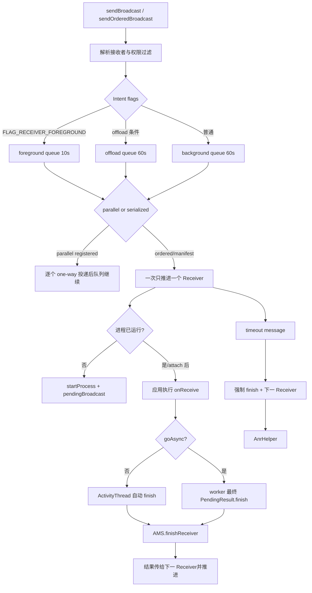
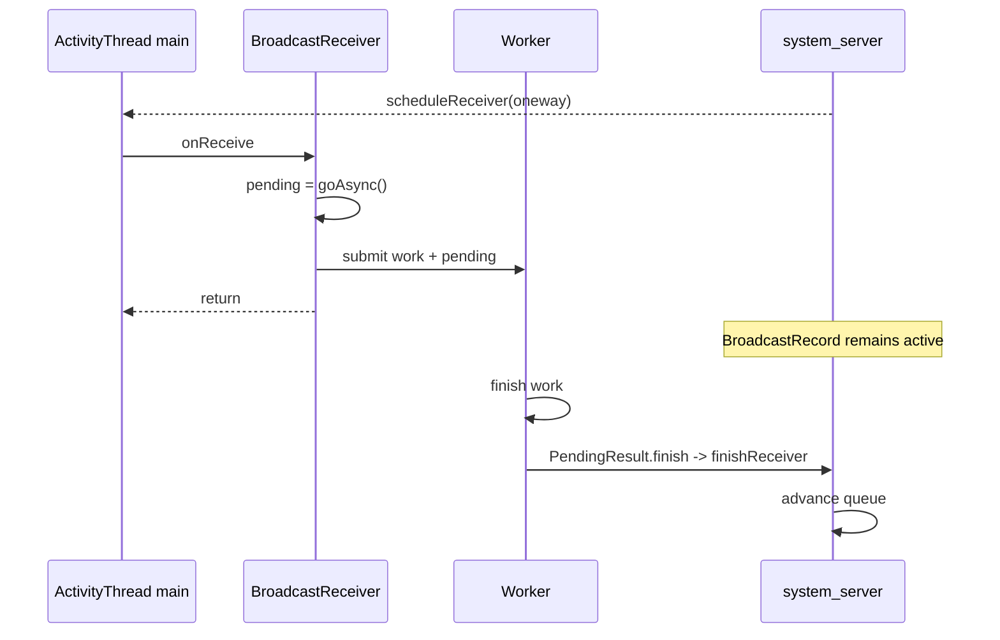

# 114 Android BroadcastQueue：有序广播、goAsync 与超时 ANR

> 源码版本：Android 11 / API 30 / `android-11.0.0_r48`  
> 学习方式：macOS 只读源码，不要求编译  
> 前置章节：第 45、67、97、108、112、113 章

---

## 1. 本章要回答的问题

广播 API 看起来只是“发送 Intent，Receiver 收到”，源码里却同时存在队列、进程启动、Binder、
结果传递、超时、延迟和 ANR。本章集中回答：

1. foreground、background、offload 三条队列如何选择？
2. parallel 与 ordered/serialized 广播到底差在哪里？
3. 动态 Receiver 与 manifest Receiver 的交付路径为何不同？
4. `onReceive()` 返回后，系统如何知道 Receiver 完成？
5. `goAsync()` 延长的是什么，为什么没有增加 timeout？
6. 10 秒与 60 秒从哪里来，为什么文档文字可能不同？
7. timeout 消息为什么不为每个 Receiver 都重新取消和创建？
8. 超时后为何先推进队列，再异步触发 ANR？

---

## 2. 一张总图



本章核心不是 Intent 匹配，而是“交付后谁拥有推进权”。

---

## 3. 三条调度队列

AMS 构造时创建：

```java
mFgBroadcastQueue = new BroadcastQueue(..., "foreground", foreConstants, false);
mBgBroadcastQueue = new BroadcastQueue(..., "background", backConstants, true);
mOffloadBroadcastQueue = new BroadcastQueue(..., "offload", offloadConstants, true);
```

默认 timeout：

```java
BROADCAST_FG_TIMEOUT = 10 * 1000;
BROADCAST_BG_TIMEOUT = 60 * 1000;
```

offload 默认也使用 60 秒，但关闭 slow deferral；它是否启用还受
`persist.device_config.activity_manager_native_boot.offload_queue_enabled` 控制。

---

## 4. foreground queue 不等于接收进程是前台 App

主要选择信号是发送 Intent 上的 `FLAG_RECEIVER_FOREGROUND`。它表达“这次广播交付需要前台级
调度紧迫性”，不是声明 Receiver 所属 App 当前有可见 Activity。

进入 foreground queue 会带来更短 timeout；`FLAG_RECEIVER_FOREGROUND` 的契约还允许接收者按前台优先级运行。但具体进程 OOM/scheduling 状态仍由广播执行状态和 OomAdjuster 等共同计算，不能只凭 queue 名断言某个固定 adj 或 sched group，更不能把进程生命周期概括成“前台应用”。

---

## 5. BroadcastConstants 可动态观察配置

三套常量分别绑定 Global Settings：

```text
broadcast_fg_constants
broadcast_bg_constants
broadcast_offload_constants
```

代码里的 10/60 秒是构造默认值，不一定是设备运行时最终值。`BroadcastConstants.startObserving()`
会监听配置变化。因此读 bugreport 时应同时看 dumpsys 中实际 queue constants。

---

## 6. parallel 与 ordered 不是“多线程”和“单线程”的简单同义词

`mParallelBroadcasts` 当前主要装非有序、动态注册的 Receiver。`processNextBroadcastLocked()`
取出一条后遍历所有目标并发出 one-way Binder，随即记入 history。

所谓 parallel，准确含义是 AMS 不等待前一个 Receiver 的完成回报再投递下一个。各应用内是否在
主线程、不同进程是否真的同时运行，由其 Looper 和系统调度决定。

---

## 7. manifest Receiver 即使非 ordered 也要串行调度

源码注释说明 parallel 列表只放 registered receivers，避免一次为大量 manifest components
同时拉起进程。

因此两组概念不能画等号：

| API/目标 | AMS 调度形态 |
|---|---|
| 普通广播 + 动态 Receiver | 通常 parallel、fire-and-forget |
| 有序广播 + 动态 Receiver | serialized、等待 finish |
| manifest Receiver | 即使广播语义非 ordered，也走需要组件实例化/进程管理的 serialized 路径 |

`ordered` 决定结果是否串联；“是否由队列逐个推进”还受 Receiver 类型影响。

---

## 8. BroadcastRecord 是一次调度状态机

它同时保存：

```text
原 Intent、调用者、权限、AppOp
receivers 列表
delivery[] / duration[]
resultCode/resultData/resultExtras/resultAbort
nextReceiver / receiver / curApp / curComponent
enqueue/dispatch/receiver/finish 时间
state / anrCount / splitToken
```

它不是 App 进程里的 `BroadcastReceiver` Java 对象，而是 system_server 对一次广播工作的权威
记录。

---

## 9. 两组状态不要混淆

`state` 表示当前调度阶段：

```text
IDLE
APP_RECEIVE
CALL_IN_RECEIVE
CALL_DONE_RECEIVE
WAITING_SERVICES
```

`delivery[i]` 表示第 i 个目标的最终交付结果：

```text
PENDING / DELIVERED / SKIPPED / TIMEOUT
```

一个 BroadcastRecord 只有一个当前 state，却为每个 Receiver 保存各自 delivery 和 duration。

---

## 10. 调度入口通过 Handler 合并

`scheduleBroadcastsLocked()` 不会无界重复发送调度消息。`mBroadcastsScheduled` 表示已有
`BROADCAST_INTENT_MSG` 在途。

Handler 收到消息后调用 `processNextBroadcast(true)`，后者持 AMS 锁进入
`processNextBroadcastLocked()`，并把 scheduled 标志清掉。

这是典型的“状态在锁内、唤醒可合并、工作在指定 Looper”模式。

---

## 11. 每轮先清 parallel，再处理 serialized

源码顺序是：

1. 循环移除所有 `mParallelBroadcasts`；
2. 向每个动态 Receiver 发起投递；
3. 立即放入广播 history；
4. 再向 `BroadcastDispatcher` 请求下一条 serialized broadcast。

这解释了 parallel 广播为什么不会被某个 Receiver 的 `finishReceiver()` 串住；AMS 根本没有为
它保留逐 Receiver 等待权。

---

## 12. BroadcastDispatcher 不只是普通 FIFO

它负责 ordered/serialized 广播的 active record，还承载：

- alarm 优先；
- UID slow-receiver deferral；
- deferred BroadcastRecord；
- split record 与最终 result refcount；
- 下一次可交付时间。

所以 `getNextBroadcastLocked(now)` 的“next”不一定只是数组头，它是策略选择结果。

---

## 13. nextReceiver 的增量时机

取下一个目标时：

```java
int recIdx = r.nextReceiver++;
Object nextReceiver = r.receivers.get(recIdx);
```

因此当前 Receiver 的索引通常是 `nextReceiver - 1`。timeout 路径正是用这一表达式把
`delivery[current]` 标为 `DELIVERY_TIMEOUT`。

读 dumpsys 看到 `nextReceiver=N`，它表示下一个尚未调度的位置，不等于当前索引。

---

## 14. receiverTime 每个 Receiver 重置

开始下一目标前写：

```java
r.receiverTime = SystemClock.uptimeMillis();
```

第一个目标还会设置整条广播的 `dispatchTime` 和 wall-clock `dispatchClockTime`。

因此：

- `receiverTime` 用于当前 Receiver timeout；
- `dispatchTime` 用于整条广播耗时与 hung 补偿；
- `enqueueClockTime`/`dispatchClockTime` 用于跨事件时间线和 latency Atom。

---

## 15. timeout 消息采用“单闹钟向后踢”

只有队列当前没有 timeout message 时才安排：

```java
if (!mPendingBroadcastTimeoutMessage) {
    setBroadcastTimeoutLocked(r.receiverTime + mConstants.TIMEOUT);
}
```

一个 Receiver 快速完成后，并不会每次删除旧消息再创建新消息。旧闹钟到点时，timeout handler
重新计算当前 Receiver 的：

```text
receiverTime + TIMEOUT
```

若尚未到期，就把闹钟向后安排到正确时刻。

---

## 16. 为什么允许 premature timeout

假设 Receiver A 在 T0 开始，T1 很快完成，Receiver B 在 T1 开始。原闹钟仍在 T0+timeout。
到点时 B 实际只运行了 `timeout-(T1-T0)`。

源码识别：

```java
if (timeoutTime > now) {
    setBroadcastTimeoutLocked(timeoutTime);
    return;
}
```

这不是误报 ANR，而是复用闹钟后的正常校正。优点是减少 Handler message 的频繁增删。

---

## 17. timeout 何时才整体取消

当 active serialized BroadcastRecord 已完成所有 Receiver、abort，或被强制结束时，
`processNextBroadcastLocked()` 才 `cancelBroadcastTimeoutLocked()`。

所以 timeout message 属于“当前 active broadcast 的连续推进窗口”，不是一个与 Receiver 对象严格
一一对应的独立定时器。

---

## 18. timeoutExempt 的两个检查点

调度和 timeout 都尊重 `r.timeoutExempt`：正常 Handler timeout 直接返回，slow deferral 也不会对
它生效。

但 `processNextBroadcastLocked()` 还存在整条广播的 hung 兜底，同样明确跳过 exempt。豁免是
BroadcastRecord 策略属性，不应只在单个 Handler 分支理解。

---

## 19. processesReady 前为什么忽略 timeout

系统早期启动广播可能承担初始化基础设施的重活。`broadcastTimeoutLocked(true)` 在
`!mProcessesReady` 时返回，避免启动期用正常 App deadline 误判系统初始化 Receiver。

它不等于任何启动广播永不受约束；待系统 ready 后，正常队列策略恢复。

---

## 20. 动态 Receiver 的 Binder 路径

动态注册保存的是 `IIntentReceiver` Binder。若它属于已知 App ProcessRecord，AMS 通过：

```java
app.thread.scheduleRegisteredReceiver(receiver, intent, ...)
```

这样可让该 one-way 调用与发送给 `IApplicationThread` 的其他 one-way 调用保持正确顺序。若没有
App record，则可直接 `receiver.performReceive(...)`，常见于核心系统调用者。

---

## 21. manifest Receiver 的 Binder 路径

manifest 目标需要按 `ActivityInfo` 实例化组件。进程已运行时调用：

```java
app.thread.scheduleReceiver(new Intent(r.intent), r.curReceiver, ...)
```

未运行时先 `startProcessLocked(... HostingRecord("broadcast", component))`，并记录：

```text
mPendingBroadcast
mPendingBroadcastRecvIndex
```

进程 attach 后再继续真正交付。

---

## 22. 为什么 pendingBroadcast 每条队列只需一个

serialized 队列一次只推进一个 manifest Receiver。等待它的进程启动时，后续 Receiver 不会被
继续启动，所以一个字段足够表达队头阻塞状态。

foreground、background、offload 是三条不同 BroadcastQueue，各自可以有一个 pending。注意 offload 由隐藏的 `FLAG_RECEIVER_OFFLOAD` 选择，且还要求开机只读属性 `persist.device_config.activity_manager_native_boot.offload_queue_enabled=true`；普通应用不能把它当公开 API 的第四种调度选择。

进程成功 attach 时，`ActivityManagerService.attachApplicationLocked()` 会遍历三条 queue 调用
`sendPendingBroadcastsLocked(app)`。queue 除了比较 `curApp` 对象，还校验 PID 与 pending
ProcessRecord 一致；匹配后先清 `mPendingBroadcast`，再进入 `processCurBroadcastLocked()`。
这说明恢复动作由新进程 attach 事件驱动，不是定时轮询。

---

## 23. pending 进程死亡的恢复

再次处理队列时，如果发现 pending 进程已死、crashing 或不再 pending start：

```text
state -> IDLE
nextReceiver -> mPendingBroadcastRecvIndex
mPendingBroadcast -> null
```

把 `nextReceiver` 回退到原索引，使该 Receiver 有机会重新走投递/启动判断，而不是因为先前的
`nextReceiver++` 被无声跳过。

---

## 24. 应用侧 handleReceiver 的创建顺序

manifest Receiver 到达 `ActivityThread.handleReceiver()` 后：

1. 获取/创建 Application；
2. 创建 split Context；
3. 设置 Intent/extras ClassLoader；
4. 通过 AppComponentFactory 实例化 Receiver；
5. `receiver.setPendingResult(data)`；
6. 调用 `onReceive(restrictedContext, intent)`；
7. finally 清 `sCurrentBroadcastIntent`；
8. 若 PendingResult 仍挂在 Receiver 上，则 `data.finish()`。

Receiver 对象创建失败或回调抛异常，也会先尝试向 AMS 回报 finish，再按异常策略处理。

---

## 25. 为什么 Context 是 ReceiverRestrictedContext

manifest Receiver 的 `onReceive()` 得到受限 Context，避免在这个短生命周期回调中直接执行某些
不适合的组件操作。源码和公开契约都鼓励把持久工作转交 JobScheduler/Service 等有明确生命周期的
机制。

限制 Context 并没有自动阻止开发者做慢 I/O；deadline 仍是最后防线。

---

## 26. 默认自动 finish 的条件

`onReceive()` 返回后：

```java
if (receiver.getPendingResult() != null) {
    data.finish();
}
```

普通同步 Receiver 的 PendingResult 还在对象上，所以 ActivityThread 自动完成。

这里的“方法返回”与“AMS 获知完成”之间仍可能经过 QueuedWork 和一次 Binder 回调，并非同一
瞬间。

---

## 27. goAsync 实际只做两件事

```java
public final PendingResult goAsync() {
    PendingResult res = mPendingResult;
    mPendingResult = null;
    return res;
}
```

它把完成权从 Receiver 对象移交给调用者，并把 Receiver 内字段清空。于是
`handleReceiver()` 返回后看见 null，不会自动 `finish()`。

它没有创建线程、没有启动 Service、没有修改 AMS timeout，也没有保证进程永久存活。

---

## 28. goAsync 的正确生命周期



应用必须保证所有成功、失败、取消分支最终且仅一次调用 `finish()`。

---

## 29. goAsync 不会获得额外时间

源码文档明确：从调用 `goAsync()` 到最终 `PendingResult.finish()` 的时间仍包含在广播执行
deadline 内。

它解决的是“不要在主线程做 I/O”，不是“把 10/60 秒变成无限”。长任务应调度给 JobScheduler
或其他合适设施，然后尽快 finish 广播。

---

## 30. PendingResult.finish 为何可能延后回报

manifest component 类型若存在 `QueuedWork.hasPendingWork()`，finish 会在 QueuedWork 队尾
排一个 `sendFinished()`，避免 AMS 太早认为组件结束后回收进程，导致遗留的 SharedPreferences
等 queued work 未完成。

但这段等待同样计入广播 deadline。大量同步/排队持久化会让“onReceive 已返回”仍最终超时。

---

## 31. finish 只能调用一次

`PendingResult.sendFinished()` 在同步块内检查：

```java
if (mFinished) {
    throw new IllegalStateException("Broadcast already finished");
}
mFinished = true;
```

异步代码应把 finish 放进统一 `finally` 或原子 completion gate，避免成功/timeout/cancel 多分支重复
完成。

---

## 32. 非 ordered manifest Receiver 为什么也回报 finish

`PendingResult.sendFinished()` 中：

- ordered：携带 result/abort 调 `finishReceiver()`；
- 非 ordered component：仍调用 `finishReceiver()`，但结果字段置空；
- 非 ordered unregistered/parallel：无需等待回报。

原因是 manifest component 即使没有结果串联，BroadcastQueue 仍需知道何时可以推进和降低该进程
的 Receiver 生命周期保护。

---

## 33. finishReceiver 如何找到正确队列

App 回报携带原 Intent flags。AMS 根据 offload 条件或
`FLAG_RECEIVER_FOREGROUND` 选择 queue，再用 Binder token：

```java
r = queue.getMatchingOrderedReceiver(who);
```

只有 token 与当前 active Receiver 匹配才完成。这阻止迟到或错误 token 随意推进另一条广播。

---

## 34. 结果为何不能带文件描述符

AMS 在 `finishReceiver()` 入口拒绝 `resultExtras.hasFileDescriptors()`。PendingResult 发送前也设置
`setAllowFds(false)`。

有序结果会跨多个 Receiver、驻留 system_server 状态并可能最终回给 sender；允许任意 FD 会带来
生命周期、权限和资源泄漏风险。

---

## 35. finishReceiverLocked 做哪些清理

它会：

1. 记录当前 state 和执行耗时；
2. `state=IDLE`；
3. 更新 duration；
4. 管理后台启动 Activity 临时 token；
5. 对慢 Receiver 启动 UID deferral；
6. 清 receiver/filter/component/app 的当前关联；
7. 接收 resultCode/data/extras/abort；
8. 判断是否 WAITING_SERVICES；
9. 返回调用者是否应立即 `processNextBroadcast`。

“finish”既是协议完成，也是系统状态清理点。

---

## 36. abortBroadcast 不是无条件生效

只有 ordered 语义下结果才有同步含义；而且若 Intent 带
`FLAG_RECEIVER_NO_ABORT`，`finishReceiverLocked()` 会把 `resultAbort` 强制恢复 false。

所以应用调用 `abortBroadcast()` 只是提出结果状态，是否阻断后续 Receiver 由系统结合发送选项
决定。

---

## 37. slow receiver 与 timeout 是两条阈值

Receiver 正常 finish 后，若执行耗时超过 `SLOW_TIME` 且不是 core UID，可对这个 UID 启动
deferral。它不要求已经 timeout，也不触发 ANR。

```text
slow threshold -> 后续广播降低/延迟调度
timeout         -> 当前 Receiver 被强制完成并可能 ANR
```

这是性能公平策略与故障处置策略的分离。

---

## 38. deferral 为什么按 UID

一个应用可声明多个 Receiver，甚至多个包共享 UID。若只延迟某个组件，应用可以通过另一个
Receiver 继续占用队列。按 UID 施加策略更接近资源责任主体。

core UID 豁免，避免关键系统广播因通用公平策略造成启动或系统功能级联延迟。

---

## 39. deferred 广播为什么需要 splitToken

有序广播中间某个 UID 被延迟时，BroadcastRecord 可能拆成当前可继续部分与 deferred 部分。

但 sender 的最终 `resultTo` 只能收到一次完成回调。`splitToken + mSplitRefcounts` 记录还有多少
分片在途，只有引用计数归零才发最终 result。

这类似一次逻辑请求拆成多个物理任务后的 join barrier。

---

## 40. WAITING_SERVICES 不是 Receiver 仍在执行

在 r48 构造中，background 与 offload queue 的 `mDelayBehindServices=true`，foreground 为 false。Receiver 已 finish，但若它启动的
后台 Service 尚在启动，队列可能进入 `WAITING_SERVICES`，暂缓下一 Receiver。

此时 timeout 到达只是放弃等待并继续：不记 Receiver ANR，因为 Receiver 的 `onReceive` 已完成。

---

## 41. 为什么同进程的下一 Receiver不等待 Service

`finishReceiverLocked()` 会比较当前与下一个 manifest Receiver 的 UID/processName。若仍在同一
进程，就不进入 WAITING_SERVICES。

切换到另一个进程前等待的主要目的，是约束一个 Receiver 拉起后台服务后立刻把广播链推进到更多
进程造成资源扩散；同进程继续的增量成本较小。

---

## 42. timeout 的正式校验顺序

`broadcastTimeoutLocked(true)` 依次检查：

```text
队列/active record 是否存在
processesReady
timeoutExempt
当前 receiverTime + TIMEOUT 是否真的到期
WAITING_SERVICES 特例
是否正在调试
当前 Receiver/ProcessRecord
```

Handler 消息到达不是充分条件；超时处理必须回看权威状态。

---

## 43. 调试器为何豁免 ANR

若 `r.curApp.isDebugging()`，系统仍会记录 timeout、标 delivery timeout、finish 当前 Receiver 并
推进队列，但不会增加 anrCount，也不会交给 AnrHelper。

断点暂停是开发者主动行为，不能按生产故障弹 ANR；但广播队列也不能永久停摆，所以仍强制推进。

---

## 44. 动态 Receiver 的 ProcessRecord 如何定位

当前目标若为 `BroadcastFilter`，其 ReceiverList 中保存注册时 pid。系统排除 pid 0 和
system_server 自身，再从 `mPidsSelfLocked` 查 ProcessRecord。

manifest Receiver 则直接使用 `r.curApp`。若进程已死亡或无法关联，系统仍可强制 finish 队列，
但没有 app 就不会创建 ANR。

---

## 45. timeout 为什么先 finish 再 ANR

源码顺序：

```java
finishReceiverLocked(...);
scheduleBroadcastsLocked();
if (!debugging && anrMessage != null) {
    mService.mAnrHelper.appNotResponding(app, anrMessage);
}
```

这把“恢复广播系统进度”与“对故障应用重型取证”解耦。`AnrHelper` 入队很轻，后续 trace 在独立
消费者执行；队列无需等待 ANR 文件、DropBox 或 UI。

---

## 46. 超时并不自动 abort 整条有序广播

当前 Receiver 标成 `DELIVERY_TIMEOUT` 并被 finish 后，队列通常继续下一个目标。已有
resultCode/data/extras/abort 按当时 BroadcastRecord 状态传递。

所以一个坏 Receiver 不必让整条系统广播永久停摆；ANR 是对进程的并行处置链。

---

## 47. hung broadcast 是 timeout 失效后的第二道保险

每次 `processNextBroadcastLocked()` 都检查：

```java
now > dispatchTime + 2 * TIMEOUT * numReceivers
```

如果整条广播远超理论总预算，说明普通 timeout 机制可能失灵，于是调用
`broadcastTimeoutLocked(false)` 强制完成，并丢弃这条 hung broadcast 的剩余部分。

传入 `fromMsg=false` 会跳过“消息是否提前到达”的时间校正，但后续仍会定位当前 App、强制
finish，并在非调试且能关联 ProcessRecord 时进入 AnrHelper。因此 hung 兜底不仅恢复队列，
也可能为最后卡住的 Receiver 生成 ANR；随后 `forceReceive=true` 让整条 record 退休。

这不是每个 Receiver 的正常 deadline，而是队列活性保险丝。

---

## 48. 为什么乘 Receiver 数量再乘 2

有序广播本来允许每个 Receiver 各用一个 timeout 窗口，整条耗时自然随目标数增长。乘目标数量
形成粗略上界，再留 2 倍余量，避免把正常串行链误判为调度器失效。

它是恢复进度的保守 watchdog，不是精确 SLA。

---

## 49. timeout annotation 能告诉我们什么

广播 timeout 构造：

```text
Broadcast of Intent { ... }
```

它进入第 113 章的 EventLog、Reason、stats 和 DropBox。它能确认触发器与 Intent，但不一定直接
指出慢代码：同一应用主线程可能被 Activity、Service、Provider、锁或同步 Binder 占住，Receiver
甚至尚未真正获得 CPU。

---

## 50. Receiver 的 OOM 保护

有序动态 Receiver 开始时加入 `app.curReceivers` 并触发 OomAdjuster；manifest Receiver 同样通过
`curReceiver/curApp` 参与进程优先级计算。

finish 时移除当前关联，再更新/trim OOM 状态。保护的是“系统仍等待这个进程完成广播”的事实，
不是永久提升。

---

## 51. one-way Binder 不等于广播已执行

AMS 发 `scheduleReceiver()` 或 `scheduleRegisteredReceiver()` 后，one-way transact 成功只表示请求
已进入 Binder 异步交付路径。

它不证明：

- App 主线程已取到消息；
- Receiver 已实例化；
- `onReceive()` 已开始；
- 业务已完成；
- finish 回报已到 AMS。

真正的端到端完成点是匹配 token 的 `finishReceiver()`。

---

## 52. 动态 Receiver 可指定 Handler 的边界

公开 API 允许 `registerReceiver(..., Handler scheduler)`，所以动态 Receiver 不一定在 App 主线程。
manifest Receiver 的 `ActivityThread.handleReceiver()` 则在应用主线程消息循环执行。

即便动态 Receiver 用 worker Handler，AMS 的 BroadcastRecord deadline 仍存在；改变线程不改变
系统协议期限。

---

## 53. onReceive 返回与对象生命周期

manifest Receiver 每次通过 AppComponentFactory 实例化，返回后对象不被系统当作长期组件保存。
因此在对象字段上保存异步状态不可靠。

`goAsync()` 保存的是独立 PendingResult token；业务长期状态应放在进程级组件、数据库、Job 或
Service 中，而非依赖 Receiver 实例存活。

---

## 54. 异常路径为何也先 sendFinished

实例化或 `onReceive()` 抛异常时，ActivityThread 尽量 `data.sendFinished(mgr)`，然后将异常交给
Instrumentation/Runtime crash 链。

这避免广播队列只能等待 timeout 才恢复。应用 crash 与广播协议清理是两条可并行收尾的状态机。

---

## 55. RemoteException 投递失败的处理

动态 Receiver 投递失败时可能对 App `scheduleCrash("can't deliver broadcast")`，并由上层清理当前
BroadcastRecord。manifest Receiver 若旧进程 Binder 已死，可落入重新启动应用的路径。

“Binder 调用失败”不能总按一种方式处理：动态注册对象依赖活进程内的注册状态；manifest
component 可根据 PackageManager 元数据重新实例化。

---

## 56. unregisterReceiver 与正在执行的广播

注销时若 ReceiverList 正好是 active ordered receiver，AMS 会调用 `finishReceiverLocked()` 并可能
立即推进下一目标，然后解除 death recipient 和注册表关系。

因此注销不只是从 resolver 删除 filter，还必须修复可能正在等待它的调度状态。

---

## 57. Receiver death 与队列恢复

动态 Receiver 的 Binder 可 linkToDeath；应用进程死亡时，第 110 章清理 ProcessRecord 的
receiver 状态，BroadcastQueue 也会跳过/finish active target。

timeout、显式 finish、unregister、Binder death、进程 crash 都可能成为“结束当前 Receiver”的来源，
所以 `finishReceiverLocked()` 必须允许竞态下的 IDLE/空引用边界。

---

## 58. background activity start token

若发送选项允许 Receiver 临时后台启动 Activity，BroadcastQueue 给进程增加以 BroadcastRecord 为
token 的许可。

finish 后：

- Receiver 已运行超过许可窗口：立即移除；
- 较快完成：延迟到原 `receiverTime + ALLOW_BG_ACTIVITY_START_TIMEOUT` 再移除。

广播完成不一定意味着这个临时能力在同一瞬间消失，但它有独立到期时间。

---

## 59. timeout 与后台启动 token 的交互

超时会走 `finishReceiverLocked()`，因此同样执行 token 清理。不能因为 App 后续进入 ANR 处置，
就把临时后台启动能力遗留在 ProcessRecord。

这体现系统清理顺序：先撤销/安排撤销临时能力并推进协议，再做诊断和 kill/UI。

---

## 60. wall clock 与 uptime 的分工

| 字段 | 时钟 | 用途 |
|---|---|---|
| receiverTime/dispatchTime | uptime | deadline、duration、hung 检查 |
| enqueueClockTime/dispatchClockTime | wall clock | 日志显示、跨系统事件对齐 |

用户改时间不会让 Receiver 突然 timeout；但 history 中可读日期需要 wall clock。

---

## 61. result 是一份沿链传播的可变状态

有序广播的每个 Receiver 可读取前一结果并修改 code/data/extras/abort，finish 后写回同一
BroadcastRecord，再交给下一个 Receiver，最终发给 `resultTo`。

它不是每个 Receiver 的独立返回值列表，而像一个沿 pipeline 传递的 accumulator。

---

## 62. final result 为什么可能延迟很久

deferral 可把一条逻辑广播拆分，后台 Service 等待可进入 WAITING_SERVICES，manifest process 启动也
可暂停队列。只有所有 split refcount 清零、active record 退休时才通知 `resultTo`。

发送 API 返回只代表成功提交，不代表最终 result callback 已完成。

---

## 63. history 与 summary history

BroadcastQueue 保存有限环形历史：完整 BroadcastRecord history 和较轻量 Intent summary history，
并记录 enqueue/dispatch/finish wall-clock milestones。

它们用于 dumpsys 调试，不是无限审计日志；环形缓冲会覆盖旧记录。长期统计依赖 statsd 等其他
通道。

---

## 64. dumpsys 诊断四步

出现广播积压时优先看：

1. 哪条 queue：foreground/background/offload；
2. active BroadcastRecord 的 state、nextReceiver、receiverTime；
3. `curApp/curComponent/curFilter` 与 delivery[]；
4. dispatcher 是否在 deferring、pending process 或 WAITING_SERVICES。

不要看到大量历史条目就断言当前队列卡住，history 与 active 必须分开。

---

## 65. 常见误解一：所有广播都是 10 秒

Android 11 当前代码默认 foreground queue 10 秒、background/offload 60 秒，并且配置可动态覆盖。
`BroadcastReceiver` 注释中的泛化数字或旧文章里的 30 秒，不是这个 checkout 运行时常量的最终证据。

源码版本、queue 类型、实际 constants 三者必须一起看。

---

## 66. 常见误解二：普通 sendBroadcast 永远不等待

动态 Receiver 的普通广播可 fire-and-forget，但 manifest component 仍需进程/组件生命周期回报，
会在 serialized 调度结构中等待 finish。

“非 ordered”只表示不能串联 result/abort 语义，不等于 AMS 对所有目标都不跟踪完成。

---

## 67. 常见误解三：goAsync 会启动后台线程

它只转移 PendingResult 所有权。线程池、HandlerThread、Coroutine dispatcher 都需应用自己选择。

若调用 `goAsync()` 后忘记提交任务，BroadcastRecord 仍会一直等到 timeout。

---

## 68. 常见误解四：onReceive 返回就不会 ANR

使用 goAsync 后，方法返回而 PendingResult 未 finish，AMS 仍认为当前 Receiver active；即使未使用
goAsync，QueuedWork 也可能延迟实际 sendFinished。

系统看的不是 Java 栈帧是否已经退出，而是完成协议是否闭合。

---

## 69. 常见误解五：timeout 后整条广播立即停止

正常 Receiver timeout 会标记当前目标、强制 finish、推进下一目标，并同时异步 ANR 当前 App。
只有整条广播的 hung 保险丝等路径才会强制丢弃剩余链。

系统优先保持全局事件流活性，不能让一个应用阻断所有后续 Receiver。

---

## 70. 常见误解六：广播 ANR 根因一定在 Receiver

timeout 表示 Receiver 完成协议未及时闭合。应用主线程可能被之前的消息、锁、Binder、Service 或
GC 占用，导致 `onReceive()` 晚开始甚至未开始。

应把第 113 章 trace 与 `receiverTime`、Reason、主线程消息顺序一起分析。

---

## 71. macOS 只读练习一：确认队列常量

```bash
cd /Users/ninebot/androidSource

sed -n '480,500p' \
  frameworks/base/services/core/java/com/android/server/am/ActivityManagerService.java

sed -n '2585,2630p' \
  frameworks/base/services/core/java/com/android/server/am/ActivityManagerService.java
```

写出三条 queue 的默认 timeout、delayBehindServices 和 slow policy 差异。

---

## 72. macOS 只读练习二：手画状态机

```bash
sed -n '70,125p' \
  frameworks/base/services/core/java/com/android/server/am/BroadcastRecord.java

rg -n 'r\.state = BroadcastRecord\.' \
  frameworks/base/services/core/java/com/android/server/am/BroadcastQueue.java
```

分别画动态 ordered、manifest 已运行、manifest 需启动进程三条状态路径。

---

## 73. macOS 只读练习三：追 goAsync

```bash
sed -n '250,405p' \
  frameworks/base/core/java/android/content/BroadcastReceiver.java

sed -n '3970,4050p' \
  frameworks/base/core/java/android/app/ActivityThread.java
```

回答：为什么把 `mPendingResult=null` 就足以阻止自动 finish？哪个对象最后持有 AMS token？

---

## 74. macOS 只读练习四：模拟滚动 timeout

```bash
sed -n '1680,1815p' \
  frameworks/base/services/core/java/com/android/server/am/BroadcastQueue.java
```

假设 timeout=10s：A 在 T0 开始、T0+2s finish，B 在 T0+2s 开始。写出旧消息在 T0+10s 到达后
为何不会 ANR B，以及新消息应安排在哪个 uptime。

---

## 75. macOS 只读练习五：对照 finish 两端

```bash
rg -n 'sendFinished|finishReceiver\(' \
  frameworks/base/core/java/android/content/BroadcastReceiver.java \
  frameworks/base/services/core/java/com/android/server/am/ActivityManagerService.java

sed -n '444,560p' \
  frameworks/base/services/core/java/com/android/server/am/BroadcastQueue.java
```

列出 App 端、Binder 入口、queue 清理三层各自保证的约束。

---

## 76. macOS 只读练习六：寻找 ANR 汇合点

```bash
rg -n 'broadcastTimeoutLocked|DELIVERY_TIMEOUT|mAnrHelper' \
  frameworks/base/services/core/java/com/android/server/am/BroadcastQueue.java
```

验证代码顺序是“标 timeout → 强制 finish/调度 → AnrHelper 入队”，并解释为何不能先同步抓栈。

---

## 77. 一个 goAsync 正确示例

```java
@Override
public void onReceive(Context context, Intent intent) {
    PendingResult pending = goAsync();
    executor.execute(() -> {
        try {
            handleSmallBoundedWork(intent);
        } finally {
            pending.finish();
        }
    });
}
```

它仍需满足：executor 队列有界、任务耗时显著小于广播 deadline、拒绝提交时也 finish、进程死亡时
工作允许重试或丢失。真正长且必须完成的任务应交 JobScheduler，而不是赌进程一直存活。

---

## 78. 一个隐蔽超时反例

```java
PendingResult pending = goAsync();
executor.execute(() -> {
    future.get();       // 没有业务 timeout
    pending.finish();
});
```

即使主线程立即返回，worker 可能无限等远端；executor 本身也可能排队 50 秒。AMS 只看到 finish
迟迟未到，不关心阻塞发生在哪条应用线程。

修复应包含业务 deadline、取消、拒绝策略与 finally completion。

---

## 79. 一次 manifest ordered 广播推演

```text
T0 sender 提交 ordered broadcast
T1 BroadcastDispatcher 选为 active，nextReceiver 从 0 到 1
T1 安排 queue timeout，目标 App 未运行
T1 startProcess，保存 mPendingBroadcast/index=0
T2 App attach，scheduleReceiver
T2 ActivityThread 实例化 Receiver，进入 onReceive
T3 Receiver goAsync，主线程返回，BroadcastRecord 仍 active
T4 worker 设置 resultData 并 PendingResult.finish
T4 AMS token 匹配，finishReceiverLocked 写回 result
T4 queue 推进第二 Receiver，旧 timeout message 暂不取消
T11 旧 timeout 到达，发现第二 Receiver 的真实 deadline 尚未到，向后重排
```

这条时间线串起了进程、Binder、对象和 timeout 四种状态。

---

## 80. 广播 ANR 的排查清单

```text
[ ] Reason 是哪条 Intent、哪条 queue？
[ ] Receiver 是动态还是 manifest？
[ ] ordered 语义还是仅 serialized 调度？
[ ] receiverTime 到 timeout 的实际差值？
[ ] App main 是否已进入 onReceive？
[ ] 是否调用 goAsync，PendingResult 在哪里 finish？
[ ] QueuedWork 是否拖延 sendFinished？
[ ] worker 是否排队/锁/Binder/I/O？
[ ] 是否 WAITING_SERVICES（它本身不应 ANR Receiver）？
[ ] 是否调试、timeoutExempt 或 processesReady 特例？
[ ] 是否由整条 hung 兜底而非正常 timeout 触发？
```

---

## 81. 复读后补强：三条最关键边界

### 边界一：API ordered 与内部 serialized

manifest Receiver 为避免进程启动风暴，即使广播不是 ordered，也需要内部逐个推进；但它不获得
ordered result/abort 权力。

### 边界二：方法返回与协议完成

普通 Receiver 返回后 ActivityThread 自动 finish；goAsync 或 QueuedWork 会把协议完成推迟。AMS
只信任 Binder token 的 finish，不观察 Java 方法栈。

### 边界三：Receiver timeout 与广播 hung

前者按 `receiverTime + TIMEOUT` 精确监督当前目标并继续后续目标；后者按
`dispatchTime + 2*TIMEOUT*numReceivers` 粗略保护整条队列活性。

---

## 82. 自测题

1. `FLAG_RECEIVER_FOREGROUND` 是否证明接收 App 有前台 Activity？
2. 为什么非 ordered manifest Receiver 仍需 finishReceiver？
3. `goAsync()` 做了哪两个字段级动作？
4. A 完成后为什么不立即取消 timeout message？
5. premature timeout 为什么不会误杀 B？
6. WAITING_SERVICES 到期为何不触发 Receiver ANR？
7. slow deferral 与 timeout 有什么区别？
8. timeout 后为何通常继续下一个 Receiver？
9. one-way scheduleReceiver 成功证明了什么？
10. 如何从 trace 判断 Receiver 本身慢还是主线程此前已被占住？

---

## 83. 参考答案

1. 否，它描述本次广播的调度优先级。
2. 系统仍需跟踪 manifest component/进程生命周期并串行推进，只是不传播 ordered result。
3. 返回当前 PendingResult，并把 Receiver 的 `mPendingResult` 设为 null，转移完成权。
4. 队列复用一个闹钟；到点后按当前 receiverTime 校正，可减少消息增删。
5. Handler 重新计算 B 的 deadline，若在未来则重排并返回。
6. Receiver 已 finish，只是在等它启动的后台 Service；到期只放弃等待。
7. slow 是正常完成后的 UID 公平降速；timeout 是未完成的强制推进和可能 ANR。
8. 保持系统广播流活性，一个坏 App 不能阻塞所有目标。
9. 只证明请求进入 Binder 交付路径，不证明 onReceive 开始或完成。
10. 对齐 receiverTime/Reason，看 main 栈是否进入 Receiver；若停在先前组件/消息，应继续追其等待链和消息时序。

---

## 84. 本章源码索引

```text
frameworks/base/services/core/java/com/android/server/am/
├── ActivityManagerService.java
├── BroadcastQueue.java
├── BroadcastDispatcher.java
├── BroadcastRecord.java
├── BroadcastConstants.java
├── ReceiverList.java
└── AnrHelper.java

frameworks/base/core/java/
├── android/app/ActivityThread.java
└── android/content/BroadcastReceiver.java
```

---

## 85. 本章结论

Android 11 广播系统是一套“受策略调度的完成协议”：

- 三条 queue 分离紧迫性和后台/offload 工作；
- parallel 表示 AMS 不等待完成，ordered/manifest 使用 serialized 状态机；
- BroadcastRecord 保存每个目标结果和当前推进状态；
- manifest 目标可拉起进程，并在 attach 后恢复 pending 广播；
- ActivityThread 在同步回调返回后自动 finish；
- `goAsync()` 只转移完成权，deadline 不增加；
- queue 复用一个 timeout message，并在 premature 到达时按当前 Receiver 向后校正；
- timeout 先强制完成并推进全局队列，再异步进入 ANR 证据链；
- slow deferral、WAITING_SERVICES、Receiver timeout 与整条 hung watchdog 是四种不同机制。

把它们统一起来的关键问题是：此刻谁持有 BroadcastRecord 的推进权，哪个事件能可靠交还它？

---

## 86. 下一章预告

第 115 章继续深入 `BroadcastDispatcher`：alarm 优先队列、UID deferral、慢 Receiver 惩罚、
BroadcastRecord 拆分、引用计数合流，以及广播风暴下的公平性和饥饿防护。
