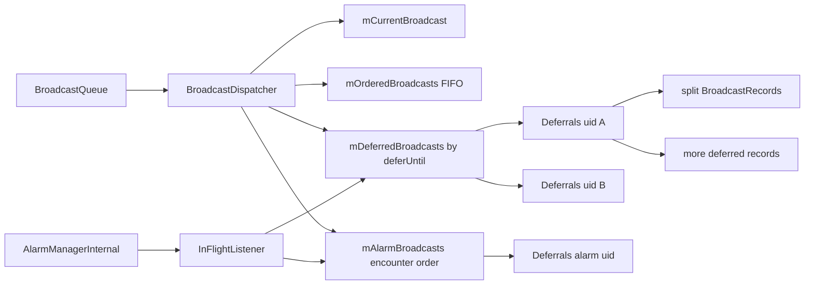
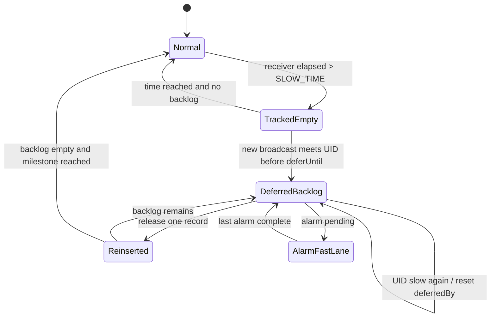

# 115 Android BroadcastDispatcher：慢接收者退避、Alarm 优先与公平调度

> 源码版本：Android 11 / API 30 / `android-11.0.0_r48`  
> 学习方式：macOS 只读源码，不要求编译  
> 前置章节：第 68、73、74、114 章

---

## 1. 为什么 BroadcastQueue 还需要 Dispatcher

第 114 章看到 `BroadcastQueue` 负责投递、完成和 timeout，但“下一条 ordered broadcast 是谁”并非
简单取 FIFO 队头。Android 11 把这部分策略交给 `BroadcastDispatcher`：

- 正常有序队列；
- 慢 UID 的延迟队列；
- 正在接收 Alarm 广播的 UID 快速通道；
- 当前唯一 active BroadcastRecord；
- 延迟到期唤醒；
- 替换、清包和 dumpsys。

它解决的核心矛盾是：不能让慢 App 长期拖累所有广播，又不能永久饿死它，也不能因为惩罚而
延误闹钟的及时交付。

---

## 2. 总体对象图



`BroadcastDispatcher` 与对应 `BroadcastQueue` 共用 AMS 锁。它不是独立线程，也不是另一个 Binder
服务，而是锁内调度策略对象。

---

## 3. 四类核心容器

```java
private final ArrayList<BroadcastRecord> mOrderedBroadcasts;
private final ArrayList<Deferrals> mDeferredBroadcasts;
private final ArrayList<Deferrals> mAlarmBroadcasts;
private BroadcastRecord mCurrentBroadcast;
```

含义分别是：

| 容器 | 内容 | 顺序依据 |
|---|---|---|
| ordered | 尚未成为 active 的普通广播 | 入队顺序 |
| deferred | 慢 UID 被拆出的广播 | UID 的 `deferUntil` |
| alarm | 当前 alarm target UID 的延期广播 | 遇到 alarm 的顺序 |
| current | 唯一正在逐 Receiver 推进的 record | 必须退休后才换下一条 |

---

## 4. Deferrals 是“一个 UID 的处罚账户”

```java
static class Deferrals {
    final int uid;
    long deferredAt;
    long deferredBy;
    long deferUntil;
    int alarmCount;
    final ArrayList<BroadcastRecord> broadcasts;
}
```

它按 UID 聚合，而不是按 package、Receiver class 或单条 Intent。字段要分清：

- `deferredAt`：首次开始跟踪的 uptime；
- `deferredBy`：最近一轮间隔；
- `deferUntil`：下一条可获调度的绝对 uptime；
- `alarmCount`：构造时保存的 alarm count，但 Android 11 后续实际移动主要依据
  `mAlarmUids` listener 事件；
- `broadcasts`：已从原 BroadcastRecord 拆出的该 UID 工作。

---

## 5. 谁会触发 startDeferring

Receiver 正常 `finishReceiverLocked()` 后计算：

```java
elapsed = finishTime - receiverTime;
if (!timeoutExempt && curApp != null
        && SLOW_TIME > 0 && elapsed > SLOW_TIME
        && !UserHandle.isCore(curApp.uid)) {
    mDispatcher.startDeferring(curApp.uid);
}
```

默认 `SLOW_TIME=5000ms`，可由每条 queue 的 BroadcastConstants 动态修改。

注意触发条件是“正常完成但慢”，不是必须 timeout。timeout 默认更长，二者形成早期公平惩罚与
最终故障处置两层防线。

---

## 6. 为什么核心 UID 豁免

系统核心 UID 承担启动、用户切换、电源等关键链路。对它们套用普通 App 的 UID deferral 可能把
局部慢调用放大成系统级功能延迟。

豁免不表示核心 Receiver 可以无限慢：正常 timeout、Watchdog、trace 和性能诊断仍存在；这里只是
不进入“后续广播降速”的公平策略。

---

## 7. 第一次慢：建立初始处罚窗口

若此前没有 Deferrals：

```text
now         = uptime
deferredBy  = DEFERRAL，默认 5 秒
deferUntil  = now + deferredBy
```

若 UID 当前不是 alarm target，记录按 `deferUntil` 插入普通 deferred 列表，并安排 recheck。

此时还没有自动把所有历史广播移动进去；Deferrals 只是宣布“下一次遇到这个 UID 时应延迟”。

---

## 8. 再次慢：重置衰减进度

若 UID 已处于 deferring，`startDeferring()` 只做：

```java
d.deferredBy = mConstants.DEFERRAL;
```

它没有在此处直接重写 `deferUntil`。这是一处易误读边界：再次慢会把“下一次成功释放一条广播后
的衰减基数”恢复为初始值，但当前已经排定的绝对到期点不被立即延后。

因此不能简单说“每慢一次就从现在重新罚 5 秒”。

---

## 9. isDeferringLocked 的自动退出条件

队列即将投递某 UID 前查询。若 Deferrals 存在但 backlog 已空，并且 uptime 已达到
`deferUntil`，便移除处罚账户，返回 false。

若 backlog 非空，即使当前时间已过，账户也继续存在，由 `getNextBroadcastLocked()` 按调度策略
逐步释放积压。

这避免 UID 在旧积压尚未清完时重新进入普通快速路径。

---

## 10. 遇到被惩罚 UID 时如何拆广播

当前 BroadcastRecord 的下一个目标属于 deferring UID 时：

1. 若它是唯一剩余目标，整条 record 放入该 UID 的 deferred list；
2. 若后面还有其他 UID，调用 `splitRecipientsLocked(uid, nextReceiver)`；
3. 新 record 收集从当前位置开始所有匹配该 UID 的 Receiver；
4. 原 record 删除这些目标，继续服务其他 UID；
5. 新 record 标记 `deferred=true` 并挂入 Deferrals。

慢 UID 被绕开，但原广播中其他接收者不必陪它等待。

---

## 11. splitRecipientsLocked 是按 UID 全量抽取

它不是只抽当前一个 Receiver，而是从 `startingAt` 向后遍历，把同 UID 的所有目标移到新列表。

```text
原 receivers: A1, slow1, B1, slow2, C1
next=slow1

原 record:    A1(已完成), B1, C1
split record: slow1, slow2
```

这样一个 UID 的处罚集中管理，不会在同一逻辑广播后面反复拆出多个小片段。

---

## 12. split 不复制已完成 Receiver 的 duration 数组

新 BroadcastRecord 通过构造器围绕新的 receiver list 创建自己的 delivery/duration 状态，同时复制
Intent、sender、权限、result 和策略字段。

它不是原对象的浅拷贝；已完成部分留在原 record，延期部分成为新的调度实体。调试 history 时会
看到多个 record，但它们可能属于同一次逻辑发送。

---

## 13. deferred 标志防止再次拆分

新 record 设置：

```java
br.deferred = true;
```

BroadcastQueue 只有 `!r.deferred` 时才再次检查 deferral。已被 Dispatcher 正式释放的 record 必须
完整交付，否则其中同 UID Receiver 又被识别为 deferring，会形成无限重新延期。

`deferred=true` 表示“这份工作已经付过等待成本”，不是“它现在仍在 deferred list”。

---

## 14. 为什么拆分需要完成引用计数

有序广播发送者可能提供 `resultTo`，逻辑上只应收到一次最终回调。拆分后两个或更多 record 会在
不同时间退休，不能每个都回调。

首次拆分：

```text
生成 splitToken
mSplitRefcounts[token] = 2
原 record 与 split record 共用 token
```

再次拆分同一逻辑广播则 refcount 加一。

---

## 15. final result 的 join barrier

每个分片结束时：

```java
newCount = refcount - 1;
if (newCount == 0) {
    delete token;
    send resultTo;
} else {
    store newCount;
    suppress callback;
}
```

这保证最后完成的物理 record 发送唯一最终 result。它不保证分片之间仍保持原始全序；deferral 的
目的正是允许其他 UID 越过慢 UID。

---

## 16. result 状态的语义变化

拆分构造时延期 record 会复制当时的 resultCode/data/extras/abort。此后原分支与延期分支可各自
演化，最终由最后退休的 record 携带其当前 result 发给 `resultTo`。

因此一旦有 deferral split，不能继续把整条广播理解为严格的单线 result pipeline。每个分片都
持有同一个 `resultTo` Binder 引用，但先退休的分片因 refcount 尚未归零而不发送，也不会替其他
分片合并最新 result；最后退休的分片发送它自己当时持有的 result。系统用唯一 completion 保持
协议闭合，但跨分片的 result 修改并没有全序归并语义。

---

## 17. 普通 deferred 列表按 deferUntil 排序

`insertLocked()` 线性寻找首个更晚的 milestone，把 Deferrals 插在其前。

源码选择线性表而非 heap，因为预期同时被处罚的坏 App 很少。小 N 时数组局部性和实现简单性比
渐进复杂度更重要。

相同 `deferUntil` 的新项插在已有相同项之后，维持近似稳定顺序。

---

## 18. getNextBroadcastLocked 的候选优先级

当前无 active record 时：

```text
1. mAlarmBroadcasts 头部有实际广播 -> 先取
2. 普通 deferral 已到期，或主队列为空 -> 取 deferred
3. mOrderedBroadcasts 非空 -> 取普通 FIFO
4. 都无 -> null
```

选中后写入 `mCurrentBroadcast`；后续重复调用始终返回它，直到
`retireBroadcastLocked(current)`。

---

## 19. current 是调度器的提交点

Dispatcher 一旦把 record staging 为 current，不会在某个 alarm 到来时中途抢占它。Alarm 优先只
影响“下一次选择”，不抢占正在执行的 Receiver/record。

这是非抢占式调度。否则当前 timeout、nextReceiver、result 和 Binder token 都会变得难以维护。

---

## 20. 普通 deferral 何时可以越过主队列

遍历按到期时间排序的 Deferrals：

- `now >= deferUntil`：已到期，可取一条，即使有普通 ordered backlog；
- 尚未到期且主队列非空：停止搜索，优先普通广播；
- 尚未到期但主队列为空：仍允许取下一条 deferred 广播。

最后一条避免设备没有其他广播时空等到 milestone；处罚的目标是保护其他工作，不是故意让系统
闲着也不处理慢 UID。

---

## 21. 为什么每次只释放一个 deferred record

取出一条后，该 UID 的 Deferrals 重新计算 interval、更新 deferUntil、重新插队。

若一次清空全部 backlog，慢 UID 可再次形成 burst，其他 UID 又会被压住。一次一条并重新排队让
不同慢 UID 和普通工作获得交错机会。

---

## 22. 退避不是指数增长，而是衰减

默认：

```text
DEFERRAL = 5000ms
DECAY_FACTOR = 0.75
FLOOR = 0
```

每释放一条后：

```java
deferredBy = max(FLOOR, previous * 0.75);
deferUntil += deferredBy;
```

序列约为 5000、3750、2812、2109……间隔逐渐缩短，让处罚随积压消化而衰减。这与 Service restart
的指数退避相反。

---

## 23. deferUntil 为什么使用累加而不是 now + interval

代码是：

```java
d.deferUntil += d.deferredBy;
```

若系统晚于 milestone 才处理，下一 deadline 仍基于既定时间线，可能已经到期，从而较快追赶
backlog。若每次用 `now + interval`，调度本身的额外延迟会不断叠加惩罚。

这是一种“按计划时间衰减”，而非“从实际完成时重新起罚”。

---

## 24. FLOOR 的作用

`DEFERRAL_FLOOR` 可设置非零下限，避免 interval 衰减到接近零后形成连续 burst。默认 floor=0，
但 long 转换会使小数截断，最终可能达到 0。

配置不能脱离 decay 一起分析：factor 大于 1 会增长而非衰减，负值也可能产生反常行为；源码没有
在 BroadcastConstants 中做强范围校验，设备配置方需要负责合理性。

---

## 25. 再次慢如何影响衰减

UID 又慢时把 `deferredBy` 恢复到完整 DEFERRAL。下次释放一条后会先乘 decay，再把较大的新间隔
加到原 `deferUntil`。

它相当于撤销“表现逐渐恢复”带来的宽松趋势，但不会重写当前 milestone。这种精确语义比笼统的
“慢一次加重处罚”更可靠。

---

## 26. recheck 是唤醒，不是直接投递

`scheduleDeferralCheckLocked()` 针对普通 deferred 列表头的 `deferUntil` 安排 Runnable。到点后：

```text
持 AMS 锁
BroadcastQueue.scheduleBroadcastsLocked()
mRecheckScheduled = false
```

Runnable 不直接从 Deferrals pop；它只唤醒正常 BroadcastQueue 调度，让所有当前状态重新验证。

---

## 27. recheck 合并与 force

`mRecheckScheduled` 避免为每次变化无界发布 callback。`force=true` 时先移除旧 callback，再按新的
列表头 milestone 安排。

列表可能因新慢 UID 插入更早位置而变化，force 保证闹钟不会仍停在旧的较晚时间。

---

## 28. 空 Deferrals 为什么可能仍留在列表

创建处罚账户时 broadcasts 可能为空，直到后续广播遇到该 UID 才加入。`isEmpty()` 不是简单检查
Deferrals list 是否为空，而是遍历统计其中 BroadcastRecord 数量。

因此：

```text
存在处罚账户 ≠ 有延期广播 backlog
dispatcher 无待处理广播 ≠ 没有任何 Deferrals 元数据
```

---

## 29. isDeferring 的处罚窗口

即使 Deferrals.broadcasts 为空，只要还没到 `deferUntil`，新遇到的 Receiver 仍会被拆出并加入。
一旦时间到且 backlog 为空，下一次查询移除账户。

这使“慢一次”影响一个时间窗口内随后到来的广播，而不只影响当时已经排队的广播。

---

## 30. AlarmManager 为什么要告诉 BroadcastDispatcher

Alarm 广播通常有明确触发时间。若目标 UID 此前因为另一个慢 Receiver 被延迟，继续按普通处罚
等待会破坏闹钟及时性。

`AlarmManagerInternal.InFlightListener` 向 Dispatcher 报告某 recipient UID 的 alarm pending 与
complete，让相应 Deferrals 在普通列表与 alarm 快速列表间迁移。

---

## 31. alarm pending 的迁移

```java
count = mAlarmUids[uid] + 1;
mAlarmUids.put(uid, count);
if (uid 在 mDeferredBroadcasts) {
    remove;
    mAlarmBroadcasts.add(d);
}
```

已经延期的该 UID 广播被快速通道接管。`getNextBroadcastLocked()` 总先从
`mAlarmBroadcasts` 取，因此它可以越过普通 ordered 和普通 deferral。

---

## 32. alarm complete 的迁移

count 减一，若 `newCount <= 0`，把该 UID 的 Deferrals 从 alarm list 移回普通 deferred list，并按
原有 `deferUntil` 排序。

这不是取消处罚。Alarm 在途期间只是暂时提升交付，结束后继续原公平策略。

---

## 33. 多个 alarm 为什么需要计数

同一 UID 可同时有多个 in-flight alarm。boolean 会在第一个完成时错误撤销快速通道，即使另一个
仍在途。

`SparseIntArray uid -> count` 只有归零后才迁回普通列表。若 complete 导致负数，源码 `wtf` 并
钳回 0，显式暴露上下游配对错误。

---

## 34. Deferrals.alarmCount 的版本边界

构造 `Deferrals` 时把当时 `mAlarmUids.get(uid)` 存入 `alarmCount`，用于决定新账户初始放进哪张
列表。

之后 listener 更新权威计数的是 `mAlarmUids`，迁移时没有同步写 `d.alarmCount`。所以 dumpsys/代码
分析不能把 Deferrals.alarmCount 当成持续实时计数；它在这个 Android 11 实现中更像创建快照。

---

## 35. Alarm 优先不是完全取消慢 UID 限制

Alarm 快速列表中的 record 会优先取，但：

- 不抢占当前 active record；
- 每次 `popLocked()` 仍只取一条；
- Receiver timeout 仍存在；
- 完成 alarm 后账户回普通 deferral；
- slow Receiver 仍可能再次 reset decay。

这是 deadline-aware 临时优先，而不是永久白名单。

---

## 36. alarm list 的空头边界

`getNextBroadcastLocked()` 只调用 `popLocked(mAlarmBroadcasts)` 的第 0 个 Deferrals。如果头部
`broadcasts` 为空，返回 null，不继续扫描后面的 alarm Deferrals。

通常 listener 与实际 alarm 广播入队/拆分时序使头部很快获得工作，但从纯代码看，这是值得记录
的结构性边界：列表非空不保证本轮一定选出 alarm broadcast；一个空的头部账户还会让本轮不继续
扫描后面的 alarm 账户，随后选择普通 deferred 或 ordered 候选。它不等于后续账户永久饥饿，
后续调度/入队仍可再次触发选择。

---

## 37. 普通 deferred 会扫描多个账户

与 alarm list 不同，普通路径用 for 循环扫描，跳过空 Deferrals，直到遇到未到期边界或找到有
backlog 的账户。

两条路径的数据结构相似，选择算法却不对称。阅读时不可只凭字段名推断统一 priority queue 行为。

---

## 38. 普通 FIFO 会不会永久饿死 deferred

不会。到达 `deferUntil` 的账户可优先于普通 ordered 被选；即使未到期，只要普通队列空也会被
处理。recheck 又保证到期时唤醒调度。

这三点共同提供 bounded postponement，而不是无限饥饿。

---

## 39. deferred 会不会饿死普通 FIFO

一个到期账户每次只释放一条，然后 milestone 更新并重新排序。通常普通 FIFO 随后得到机会。

但大量不同 UID 同时到期仍可能形成一批 deferred 优先工作；这是系统在“已经等待足够久”与新
普通广播之间的公平权衡，不是严格轮询保证。

---

## 40. cancelDeferralsLocked 的用途

等待广播系统 idle 的管理/测试路径可调用：

```java
d.deferUntil = d.deferredBy = 0;
```

它让现有 backlog 立即可交付，但没有删除记录、清广播或关闭未来 deferral。名称是“取消当前等待
时间”，不是永久关闭 slow-receiver policy。

---

## 41. replace pending broadcast 的范围

带 replace-pending 语义的新广播会从后向前搜索：

1. 普通 ordered list；
2. alarm deferral 的各 broadcasts；
3. ordinary deferral 的各 broadcasts。

匹配 userId 且 `Intent.filterEquals()` 后原位替换，并把旧 record 的 `deferred` 状态复制给新 record。

已经成为 `mCurrentBroadcast` 的 record 不可替换，保证在途 token/state 不被偷换。

---

## 42. filterEquals 不比较 extras

Intent replacement 使用 `filterEquals`，通常比较 action、data、type、identifier、package、component、
categories，而不是 extras。

因此两次同“路由身份”但 payload 不同的 replace-pending 广播，后者可能覆盖前者。这是 API 语义，
不是 Dispatcher 丢数据 bug；发送方必须只在“保留最新状态”场景使用替换。

---

## 43. package disable/uninstall 清理覆盖全部容器

`cleanupDisabledPackageReceiversLocked()` 检查 ordinary、alarm deferred、normal deferred 和 current。

只清主 FIFO 会让已拆出的 Receiver 在包禁用后仍被投递。Dispatcher 的多容器设计要求所有维护
操作覆盖每个状态位置。

`doit=false` 支持只探测是否会改变，便于调用者先判断再执行。

---

## 44. dump 中的“Active”容易误读

dump 顺序包含：

```text
Currently in flight: mCurrentBroadcast
Active ordered broadcasts: alarm deferrals + ordinary queue
Deferred ordered broadcasts: ordinary deferrals
```

这里 “Active ordered” 不等于都正在 Receiver 中执行；真正 in-flight 只有 current。Alarm backlog
被列在 active heading 是因其调度优先，不代表 Binder 已发出。

---

## 45. describeStateLocked 有一个显示瑕疵

构造 deferred 描述时连续 append 两次 `", "`，可能得到多余逗号。它只影响人类可读字符串，不
影响调度容器或计数。

学习源码时要区分核心状态错误和 debug presentation 小瑕疵，不要因为 dumpsys 标点异常推断队列
损坏。

---

## 46. 调度选择的时序示例

假设：

```text
ordinary: O1, O2
UID A deferred backlog: A1, A2, due at 100
UID B deferred backlog: B1, due at 130
now = 90
```

选择 O1。到 now=105，A 已过期，下一轮先取 A1。A 的 interval 衰减、milestone 累加并重新插队，
再下一轮可能回 O2。若此时 B 成为 alarm target，B1 移入 alarm list并在 current 退休后最先选择。

---

## 47. 慢 UID 的完整状态机



---

## 48. 三种“优先”不能混淆

| 机制 | 粒度 | 目的 |
|---|---|---|
| foreground BroadcastQueue | 整条广播进入哪条 queue | 发送紧迫性与 timeout |
| alarm fast lane | 某 queue 内 deferring UID | 保住定时 alarm 及时性 |
| OomAdjuster receiver boost | Receiver host process | 降低执行期间被杀/限速概率 |

它们可同时作用，却不互相替代。

---

## 49. fairness 不是固定轮询

Dispatcher 没有实现“每个 UID 一人一条”的严格 round-robin。普通 ordered 仍按 record FIFO；只有
已证明慢的 UID 被拆出，按时间窗口逐条释放。

这是惩罚型公平：优化正常常见路径，仅对观测到的坏行为付出额外调度成本。

---

## 50. 为什么先观察 slow 再惩罚

按 App 历史身份静态降级容易误伤：同一 App 的绝大多数 Receiver 可能很快，偶发一次冷启动或 I/O
变慢。Android 使用刚完成 Receiver 的实际 elapsed 作为反馈，并让处罚间隔逐步衰减。

它形成简单闭环控制：

```text
observe latency -> mark UID -> defer later work -> decay -> recover
```

---

## 51. SLOW_TIME 动态修改的非追溯性

BroadcastConstants 更新影响之后 `finishReceiverLocked()` 的判断和之后 interval 计算。已经存在的
Deferrals 不会全部重新根据新值重建：

- 已存 `deferUntil` 保留；
- 再次慢时用新的 DEFERRAL reset；
- 下次释放用新的 decay/floor。

动态配置是渐进生效，而非全局事务式重算。

---

## 52. offload queue 默认关闭 slow policy

AMS 创建 offloadConstants 后设置：

```java
SLOW_TIME = Integer.MAX_VALUE;
```

实际运行时 Global Settings 仍可覆盖它。默认设计是 offload queue 本就承接可放宽、隔离的广播，
不再轻易因普通耗时触发 deferral。

这不关闭 60 秒 timeout。

---

## 53. elapsed 包含哪些时间

`elapsed = finish uptime - receiverTime`。receiverTime 在系统准备投递当前目标时更新，因此可能包含：

- one-way Binder 排队；
- App Handler 排队；
- Receiver 实例化；
- onReceive；
- goAsync worker 排队与执行；
- QueuedWork；
- finish Binder 回程。

slow policy 衡量端到端占用广播推进权的时间，而不只是 `onReceive` 方法体 CPU 时间。

---

## 54. 因系统压力变慢也可能受罚

若 App 因全系统 CPU/IO 压力或 Binder 拥塞导致 elapsed 超过 SLOW_TIME，它仍可能被标慢。策略关心
对共享广播队列造成的实际影响，不精确裁决主观责任。

诊断根因则必须结合第 113 章 PSI/CPU/trace，不能用“进入 deferral”证明应用代码一定有 bug。

---

## 55. Receiver timeout 后会不会 startDeferring

Android 11 这段实现有个很反直觉的顺序：`broadcastTimeoutLocked()` 在调用
`finishReceiverLocked()` **之前**，先执行 `r.receiverTime = now`。而
`finishReceiverLocked()` 内的慢接收者耗时是：

```java
elapsed = finishTime - r.receiverTime;
```

所以 timeout 路径上这个 `elapsed` 通常只有几毫秒，并不是真实的超时时长，一般不会因
这次 timeout 再触发 `startDeferring()`。当前故障仍按 ANR 路径处理；deferral 主要是对“能完成、
但完成得慢”的 Receiver 做后续公平调度。

不要把这理解为数学上绝对不可能：若从重置 `receiverTime` 到进入 `finishReceiverLocked()`
之间又卡了超过 `SLOW_TIME`，条件仍可成立；但这不是普通 timeout 的预期语义。

---

## 56. 进程死亡不会自动清 UID 处罚账户

Deferrals 以 UID 为键并持有 BroadcastRecord，不依赖某个 ProcessRecord 生命周期。进程死亡后，
manifest Receiver 未来可重新拉起同 UID 进程；处罚策略仍可影响积压。

常规退出是 backlog 清空且时间到后，由下一次 `isDeferringLocked()` 移除账户。
`cancelDeferralsLocked()` 也不直接删账户；它只把等待时间清零，使积压可立即调度，空账户再在
后续查询时被清理。包维护与 Dispatcher 生命周期结束则是另外的清理边界。

---

## 57. 多用户 UID 自然隔离

Android UID 包含 userId 范围。相同 package 在 user 0 和 user 10 拥有不同完整 UID，因此慢行为不会
通过 Dispatcher 的 UID key 直接跨用户共享处罚。

分析 dumpsys 时不要只看 appId 的低位，应保留完整 UID。

---

## 58. sharedUserId 的影响

多个 package 共享完整 UID 时，任一 Receiver 慢都可能使同 UID 下其他 package 的后续目标进入
deferral。

这是按安全/资源主体治理的结果，也说明 shared UID 会扩大故障与性能策略的影响域。

---

## 59. Alarm fast lane 与广播 alarm 的关系

Dispatcher 不通过 Intent action 猜测这是不是 alarm。它依赖 AlarmManagerInternal 在实际 alarm
广播在途时回调 recipient UID。

这比检查 action 更可靠：AlarmManager 可发送多种 PendingIntent，应用也可伪造相同 action；权威
来源应是负责调度 alarm 的系统服务。

---

## 60. Listener 回调为什么持共享锁迁移

alarm pending/complete 可能来自 AlarmManager 线程，而 BroadcastQueue 正在另一 Handler 上选下一
record。迁移两个列表和更新计数必须与 `getNextBroadcastLocked()` 原子互斥。

共享 AMS 锁保证 record 不会同时留在两个列表或在迁移中被选两次。

---

## 61. 不在 listener 中直接 schedule 的边界

`broadcastAlarmPending()` 迁移 Deferrals，但源码本方法没有显式
`mQueue.scheduleBroadcastsLocked()`。通常对应 alarm 广播自身的入队会唤醒 queue；如果 current 正在
执行，优先权本来也要等退休后生效。

理解 fast lane 要结合 AlarmManager 的发送动作，而不能把 listener 当成独立投递器。

---

## 62. cancelDeferrals 为什么也清 alarm list 时间

wait-for-idle 希望所有已延期工作尽快可运行，不论当前是否因 alarm 位于快速列表。统一将两张表的
时间归零，避免 alarm complete 后移回普通列表又恢复旧等待。

但 alarm list 本身本来就优先，归零主要保证后续迁移的一致性。

---

## 63. split 的 receiver 顺序

`splitRecipientsLocked()` 保持匹配 UID 在原列表中的相对顺序，也保持非匹配目标的相对顺序；它只
打破两组之间的全局交错顺序。

```text
X1 A1 X2 A2 X3
=> original: X1 X2 X3
=> deferred: A1 A2
```

这是稳定分区，而不是任意重排。

---

## 64. 为什么从 nextReceiver 开始拆

之前的 Receiver 已经完成并可能改变 result。把它们移进新 record 会造成重复交付。startingAt
限定只操作尚未调度的后缀。

新 record 构造时复制“此刻”的 result，相当于以拆分点为逻辑快照继续两个分支。

---

## 65. sole remaining receiver 的特殊优化

若 deferring UID 是唯一剩余目标，无需复制 record：直接 retire current，把原 record 加入
Deferrals。

这减少对象和 split refcount 操作。由于没有可继续的其他分支，逻辑 completion 仍只有这一个
record，不需创建 token。

---

## 66. 被 abort 的广播是否还拆分

BroadcastQueue 在检查下一 Receiver deferral 之前，先判断 `resultAbort` 并进入完成路径。因此 abort
后不会为了后续慢 UID 再创建无意义分片。

调度策略必须建立在业务状态机“仍有后续工作”的前提上。

---

## 67. timeoutExempt 与 deferral

`finishReceiverLocked()` 明确跳过 timeoutExempt record 的 slow policy。因此豁免广播不会因正常
执行时间较长而给 UID 建立处罚账户。

这与第 114 章 timeout handler 的豁免一致，避免同一策略只豁免 ANR却仍偷偷施加后续延迟。

---

## 68. current 不在三个 pending list 中

`getNextBroadcastLocked()` 从 ordinary/deferred 容器移除一个 record，再存进 current。于是：

- replace 不会改在途广播；
- dump 必须单列 current；
- cleanup 必须额外检查 current；
- isEmpty 必须检查 current；
- retire 必须验证对象身份。

这是经典的 queued → in-flight 所有权迁移。

---

## 69. retire 的身份校验

```java
if (r != mCurrentBroadcast) {
    Slog.wtf(...);
}
mCurrentBroadcast = null;
```

比较对象身份而非 Intent 等价，防止旧/分片/替换 record 错误退休当前工作。即使检测到不匹配，
源码仍清 current 以尝试恢复进度，因此 wtf 是严重不变量告警而非直接抛异常。

---

## 70. 调度不是跨三条 BroadcastQueue 的全局公平

每条 foreground/background/offload BroadcastQueue 都有自己的 Dispatcher、current、ordinary 和
deferral 集合。三条 queue 使用同一 AMS Handler Looper，但分别被调度消息唤醒。

本章公平策略是在“一条 queue 内”按 UID 缓解慢接收者，不能推导出三条 queue 之间严格配额。

---

## 71. macOS 只读练习一：画容器迁移图

```bash
cd /Users/ninebot/androidSource

sed -n '120,260p' \
  frameworks/base/services/core/java/com/android/server/am/BroadcastDispatcher.java

sed -n '430,680p' \
  frameworks/base/services/core/java/com/android/server/am/BroadcastDispatcher.java
```

为普通慢 UID 和 alarm target UID 分别画 `ordered → current → split → deferred/alarm → current →
retire`。

---

## 72. macOS 只读练习二：计算衰减序列

```bash
rg -n 'DEFAULT_DEFERRAL|DECAY_FACTOR|FLOOR|calculateDeferral' \
  frameworks/base/services/core/java/com/android/server/am/BroadcastConstants.java \
  frameworks/base/services/core/java/com/android/server/am/BroadcastDispatcher.java
```

从 5000ms、factor 0.75、floor 0 开始，手算前 8 次 interval，并注意 long 截断。

---

## 73. macOS 只读练习三：验证再慢一次的语义

```bash
sed -n '530,585p' \
  frameworks/base/services/core/java/com/android/server/am/BroadcastDispatcher.java
```

找出已有 Deferrals 分支只修改了哪个字段、没有修改哪个字段，解释为什么不能写成“从现在重新
延迟 DEFERRAL”。

---

## 74. macOS 只读练习四：追拆分与合流

```bash
sed -n '1160,1245p' \
  frameworks/base/services/core/java/com/android/server/am/BroadcastQueue.java

sed -n '320,370p' \
  frameworks/base/services/core/java/com/android/server/am/BroadcastRecord.java

sed -n '1090,1135p' \
  frameworks/base/services/core/java/com/android/server/am/BroadcastQueue.java
```

用三个 UID、两个慢 UID 模拟两次 split，写出 refcount 2→3→2→1→0 和最终 callback 时机。

---

## 75. macOS 只读练习五：核对 Alarm 联动

```bash
sed -n '135,205p' \
  frameworks/base/services/core/java/com/android/server/am/BroadcastDispatcher.java
```

模拟同一 UID 两个 alarm：pending 两次、complete 一次、再 complete 一次，写出 count 与列表位置。

---

## 76. macOS 只读练习六：找运行时配置

```bash
sed -n '35,150p' \
  frameworks/base/services/core/java/com/android/server/am/BroadcastConstants.java

rg -n 'BROADCAST_(FG|BG|OFFLOAD)_CONSTANTS' \
  frameworks/base/core/java/android/provider/Settings.java
```

回答未指定字段为何保留旧值而非恢复 default，以及一次错误配置字符串如何处理。

---

## 77. 一个完整公平调度推演

```text
T0  UID A Receiver 用时 7s，超过 SLOW_TIME=5s
T0  建立 A Deferrals，deferUntil=T0+5s，backlog 空
T1  广播 R 的下一目标是 A1，后面还有 B1、A2
T1  R 稳定分区：原 record 留 B1，split record 装 A1/A2
T1  refcount=2，split 加到 A backlog；原 record 继续 B1并退休，callback 被抑制
T5  recheck，A backlog 到期，释放 split record
T5  interval 变 3.75s，deferUntil 从原 T5 累加到 T8.75
T6  A1/A2 完成，split record 退休，refcount=0
T6  唯一 final result callback 发给 sender
```

如果 T2 A 成为 alarm target，split record 会先移到 alarm list，并在当前 record 退休后优先选择。

---

## 78. 易混点一：deferral 是不是“封禁 UID”

不是。它只影响对应 BroadcastQueue 中后续 ordered/serialized 广播目标；不会阻止 App Activity、
Service、Job、Binder 或 parallel registered broadcasts 的所有执行。

它是局部调度反馈，不是进程冻结或权限处罚。

---

## 79. 易混点二：Alarm 是否绕过所有限制

不是。它暂时让已延期广播进入队内最高选择优先级，但不抢占 current、不关闭 Receiver timeout、
不改变安全/权限过滤，也不永久删除 Deferrals。

---

## 80. 易混点三：退避为什么越罚越短

这里不是失败重试。第一次较长间隔用于隔离刚表现很慢的 UID，随后每成功释放一份 backlog 就逐步
缩短，帮助它恢复正常吞吐。

Service restart 的间隔增长用于抑制反复 crash；Broadcast deferral 的间隔衰减用于公平地排空积压，
目标相反。

---

## 81. 易混点四：拆分后还是严格有序吗

每个分片内部相对顺序稳定，但不同 UID 分片可被重排，原始全局 Receiver 顺序不再严格保持。唯一
final completion 通过 refcount 保证，不等于全序结果语义完全保留。

这是系统为了全局活性主动做出的语义权衡。

---

## 82. 易混点五：alarmCount 是实时真相吗

`mAlarmUids` 是 listener 持续更新的计数；Deferrals 内 `alarmCount` 在本版本只在构造时赋值并用于
初始分流。后续迁移没有更新该字段。

读具体版本实现比依赖字段名更重要。

---

## 83. 排查 deferred 广播清单

```text
[ ] 哪条 BroadcastQueue？
[ ] UID 是否 core、完整 user UID 是多少？
[ ] 上一次 Receiver elapsed 与 SLOW_TIME？
[ ] Deferrals 的 deferredAt/deferredBy/deferUntil？
[ ] backlog 中有几条 record、是否 deferred=true？
[ ] 当前是否 alarm target、mAlarmUids count？
[ ] current 是否未退休，导致优先级尚不能生效？
[ ] ordinary queue 是否为空，允许提前释放未到期 deferral？
[ ] 是否发生 split、splitToken refcount 是否合理？
[ ] 动态 Settings 是否覆盖默认 decay/floor？
```

---

## 84. 自测题

1. Deferrals 为什么按 UID 而非 Receiver class？
2. 再次慢会立即把 deferUntil 改成 now+DEFERRAL 吗？
3. deferredBy 默认是增长还是衰减？
4. 主队列为空时，未到期 deferred 是否可运行？
5. alarm fast lane 是否抢占 current？
6. 两个 alarm 为什么不能只用 boolean？
7. splitRecipients 为什么从 nextReceiver 开始？
8. `deferred=true` 为什么能防无限重拆？
9. split 后 final result 如何只发一次？
10. 进入 deferral 能否证明应用代码是根因？

---

## 85. 参考答案

1. UID 是调度、资源和共享身份主体，可覆盖同 App/共享 UID 的多 Receiver。
2. 不会；已有账户只 reset deferredBy，当前绝对 milestone 不变。
3. 默认乘 0.75 衰减，并受 floor 下限约束。
4. 可以，避免系统空闲却故意等待。
5. 不抢占，只影响 current 退休后的下一次选择。
6. 同 UID 多个 alarm 在途，第一个 complete 不能撤销另一个的优先权。
7. 防止已完成 Receiver 被复制和重复交付。
8. Dispatcher 释放后的 record 跳过再次 isDeferring 检查。
9. 所有分片共享 splitToken，引用计数归零的最后一个才发送 resultTo。
10. 不能；elapsed 是端到端时间，也可能受系统压力、Binder 或调度影响。

---

## 86. 本章源码索引

```text
frameworks/base/services/core/java/com/android/server/am/
├── BroadcastDispatcher.java
├── BroadcastQueue.java
├── BroadcastRecord.java
├── BroadcastConstants.java
└── ActivityManagerService.java

frameworks/base/services/core/java/com/android/server/
└── AlarmManagerInternal.java
```

---

## 87. 本章结论

Android 11 的 BroadcastDispatcher 不是一个普通 FIFO 包装器，而是一套反馈式公平调度器：

- Receiver 端到端耗时超过 SLOW_TIME 后按完整 UID 建立处罚窗口；
- 后续广播把该 UID 的剩余目标稳定拆分，其他 UID 继续前进；
- 延期 record 每次释放一条，间隔默认按 0.75 衰减并按既定 milestone 累加；
- 到期 deferred 可越过普通 FIFO，主队列空时还可提前释放，避免饥饿和空转；
- AlarmManager 的权威 in-flight 计数将延期 UID 暂时迁入 fast lane，但不抢占 current 或取消 timeout；
- splitToken/refcount 把多个物理 record 重新合成一次逻辑 completion；
- replace、package cleanup、dump 和 idle 都必须覆盖 ordinary、alarm、deferred、current 四种位置。

理解它的关键是：deferral 不是失败重试，所以默认间隔不是指数增加；它是对共享队列占用的临时
节流，目标是在惩罚、恢复、及时 alarm 和全局活性之间取得平衡。

---

## 88. 下一章预告

第 116 章转向 ContentProvider：从 `ContentResolver.acquireProvider()`、AMS ProviderMap、发布与等待，
追到 stable/unstable 引用、外部句柄、进程死亡和 provider ANR。
