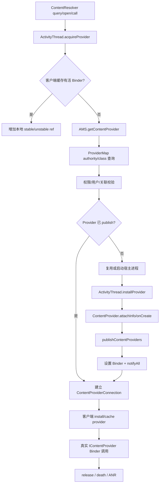
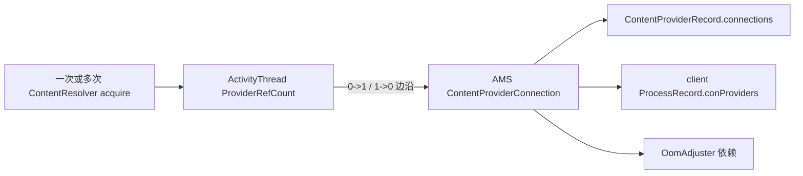

# 116 Android ContentProvider：获取、发布、引用与死亡协议

> 源码版本：Android 11 / API 30 / `android-11.0.0_r48`  
> 学习方式：macOS 只读源码，不要求编译  
> 前置章节：第 38、90～94、106、108、110、113 章

---

## 1. 本章解决什么问题

一次 `ContentResolver.query()` 背后不只是一次 Binder 调用。在真正调用 Provider 之前，系统必须：

1. 根据 authority 找到 ProviderInfo；
2. 校验导出、权限、AppOp、URI grant、用户与 instant-app 边界；
3. 找到或启动宿主进程；
4. 等待应用实例化并 publish Binder；
5. 为客户端建立 stable/unstable 引用；
6. 用依赖关系调整 Provider 进程优先级；
7. 在 release、进程死亡或无响应时闭合协议。

本章重点学习“获得一个可用 `IContentProvider`”本身就是跨进程状态机。

---

## 2. 总链路



---

## 3. 三张“Provider 表”先分清

| 所在位置 | 典型结构 | 作用 |
|---|---|---|
| system_server | `ProviderMap` | authority/class + user → ContentProviderRecord |
| Provider 宿主 App | `mLocalProviders*` | 本进程创建的 ContentProvider 实例 |
| 客户端 App | `mProviderMap`、`mProviderRefCountMap` | authority → Binder 与本地引用计数 |

三张表都可能叫 provider map，却属于不同进程和不同权威范围。

---

## 4. ContentProviderRecord 是服务端权威记录

它保存：

```text
ProviderInfo / ApplicationInfo / ComponentName
authority、uid、singleton
provider Binder
proc / launchingApp
connections
external process handles
restart count
```

`provider == null` 可能表示尚未 publish，不代表 PackageManager 中没有该组件。

---

## 5. ProviderMap 有 authority 与 class 两种索引

一个 Provider class 可以声明多个以分号分隔的 authority。AMS 按 class 识别同一组件实例，同时把
每个 authority 映射到同一个 ContentProviderRecord。

```text
class: com.example/.DataProvider -> CPR
name:  a.example                -> CPR
name:  b.example                -> CPR
```

因此 publish 和死亡清理都必须维护两种索引。

---

## 6. userId 是索引的一部分

普通 Provider 按用户隔离，同一 authority 在 user 0 与 user 10 可映射到不同 record/进程/数据。

singleton Provider 可回退查询 user 0，但必须通过 `isSingleton()` 与
`isValidSingletonCall()`；这不是看到 user 0 record 就直接跨用户复用。

---

## 7. acquireProvider 先查客户端缓存

```java
IContentProvider provider = acquireExistingProvider(c, auth, userId, stable);
if (provider != null) return provider;
```

缓存命中仍要检查 Binder alive，并增加相应本地引用。缓存是性能捷径，不跳过生命周期协议。

---

## 8. 死 Binder 缓存立即清理

若 `provider.asBinder().isBinderAlive()` 为 false，ActivityThread 调
`handleUnstableProviderDiedLocked()` 移除本地 authority 和 refcount 映射，再返回 null 走重新获取。

不能把缓存对象存在等同于远端进程仍可服务。

---

## 9. authority 级获取锁

缓存未命中后，客户端按 `(authority,userId)` 获取专用锁，再调用 AMS：

```java
synchronized (getGetProviderLock(auth, userId)) {
    holder = am.getContentProvider(...);
}
```

它只串行化同一客户端进程内、同 authority/user 的慢获取，其他 Provider 可并行。

---

## 10. 为什么不能一直持 mProviderMap 锁

AMS 获取可能启动进程、等待 publish，甚至 Provider 可在本地进程实例化并重入客户端代码。若持
客户端全局 provider map 锁跨越这些操作，会阻塞其他 authority，甚至形成重入死锁。

源码采用细粒度获取锁协调“谁先安装”，真正 install 时再短暂持 map 锁解决竞态。

---

## 11. 调 AMS 前的调用者身份

普通客户端传入 `IApplicationThread` 和 op package。AMS：

- 拒绝 isolated caller；
- 用 Binder calling UID 校验 package 归属；
- 把 ApplicationThread 映射回 ProcessRecord；
- 后续以真实 callingUid 做权限、用户和关联检查。

仅由客户端字符串声称 package 不足以建立信任。

---

## 12. 已 publish 的快路径

AMS 先按 authority/user 查 ProviderMap。若 `cpr.proc` 存在且未 killed：

1. 检查 instant-app 可见性；
2. 检查 package association；
3. 检查 Provider 权限/URI grants/cross-user；
4. 增加连接引用；
5. 必要时提升 LRU；
6. 更新 OomAdjuster；
7. 返回带 Binder 与 connection 的 holder。

---

## 13. killed 与真正 death 的时间窗

若 Provider 进程已 `killed && killedByAm`，但 `appDiedLocked()` 尚未清理，AMS 不把旧 record 当成
健康 Provider。它记录 `dyingProc`，等待死亡清理，再建立新实例。

第 110 章的“kill 请求”和“死亡确认”时间窗在 Provider 获取路径中会被主动识别。

---

## 14. canRunHere 的本地实例路径

```java
return (info.multiprocess || info.processName.equals(app.processName))
        && uid == app.info.uid;
```

若 Provider 允许在调用方进程运行，AMS 返回 ProviderInfo，但把 holder.provider 设 null。客户端据此
自己实例化本地 Provider，不建立远端 ContentProviderConnection。

这是历史 `multiprocess`/同进程优化，不能把 null Binder一律解释为失败。

---

## 15. 权限校验不只有 readPermission

`checkContentProviderPermissionLocked()` 综合：

- exported；
- read/write permission；
- path permissions；
- cross-user；
- authority URI grant；
- MANAGE_DOCUMENTS 特例提示；
- calling UID 与目标 UID；
- singleton 用户边界。

最终 query/insert 等还会在 ContentProvider.Transport 按具体操作和 URI 再校验。

---

## 16. association 是额外安全边界

AMS 的 `validateAssociationAllowedLocked`/`checkContentProviderAssociation` 可阻止不允许的 package
关系，即使传统 permission 看似满足。

“能解析 authority”不等于“能建立进程间 Provider 依赖”。

---

## 17. 未运行时先 resolve ProviderInfo

ProviderMap 没有健康发布实例时，AMS 向 PackageManager
`resolveContentProvider(name, STOCK_PM_FLAGS | GET_URI_PERMISSION_PATTERNS, userId)`。

找不到返回 null；找到后再处理 singleton、用户运行状态、权限 review、system-ready 等启动条件。

---

## 18. system ready 前的边界

若系统尚未允许普通进程运行，非 system process Provider 获取会 fail fast，而不是让调用者无限等。

system process 内的系统 Provider 还有更严格顺序：在 `mSystemProvidersInstalled` 前访问会抛异常，
防止重复创建系统 Provider 实例。

---

## 19. 停止用户不拉起 Provider

`mUserController.isUserRunning(userId)` 为 false 时返回 null。Provider 是用户态组件，其进程和数据
生命周期不能绕过用户停止状态。

这与仅仅“用户尚未 unlock”不同；Direct Boot aware 等规则还会在 PackageManager 过滤阶段参与。

---

## 20. 首次创建 ContentProviderRecord

按 ComponentName/user 尚无 record 时，AMS取得 ApplicationInfo 并构造 CPR。若旧 dying process
仍关联同一 record，则复制一个新 CPR，避免新客户端将来被旧 stable connection 清理误杀。

这是对象代际隔离：同组件名不代表同一运行实例。

---

## 21. 复用已运行进程

目标进程存在且 thread 活着时，AMS 把 CPR 放进 `proc.pubProviders`，调用：

```java
proc.thread.scheduleInstallProvider(cpi);
```

无需启动新 Linux 进程，但仍要在该 App 中实例化 Provider 并回 publish。

---

## 22. 启动 Provider 宿主进程

没有健康进程时调用 `startProcessLocked()`，HostingRecord 类型为 `content provider` 并携带组件。

随后：

```text
cpr.launchingApp = proc
mLaunchingProviders.add(cpr)
```

多个调用者请求同一 CPR 时复用这次 launching，而不是重复 fork。

---

## 23. 启动前会取消 package stopped 状态

Provider 已被实际使用，AMS 调 PackageManager 清 stopped state。这使显式需要的组件能够运行。

它不是无条件解除 force-stop 的所有语义；调用发生在通过解析、权限和启动规则之后。

---

## 24. 等待连接先创建

Provider 尚未 publish 时，AMS 在等待前就调用 `incProviderCountLocked()` 建立 connection，并标
`conn.waiting=true`。

这样进程死亡清理能知道哪个客户端正在等待，并按 launching/retry 状态决定继续等、通知或清理，
而不是丢失依赖关系。

---

## 25. AMS 等待时释放全局锁

完成 ProviderMap、launching 和 connection 更新后离开 `synchronized(this)`，再：

```java
synchronized (cpr) {
    while (cpr.provider == null) {
        cpr.wait(remaining);
    }
}
```

若持 AMS 全局锁等待，Provider App 的 attach/publish 也需要这把锁，会形成必然死锁。

---

## 26. `while` 与这个 Android 11 实现的真实唤醒语义

外层确实写成 `while (cpr.provider == null)`，但不能据此笼统地说“每次唤醒都重新等到绝对
deadline”。Android 11 在一次 `cpr.wait(wait)` 正常返回后，若 `provider` 仍为 null，会立即设
`timedOut=true` 并 `break`。也就是说：

- publish 设好 `provider` 再 `notifyAll()`，这是成功唤醒；
- `launchingApp` 被清空时，下一轮谓词检查会判定启动失败；
- 若被虚假唤醒或无关 `notify`，且 `provider` 仍为 null，这份实现会把它当作等待失败，
  而不是继续等剩余时间；
- `InterruptedException` 被捕获后才会回到外层 `while` 重新检查。

这是本版本的具体代码语义；不要用教科书中的通用 condition-loop 模式替代对实际分支的阅读。

---

## 27. 20 秒 ready timeout

```java
CONTENT_PROVIDER_PUBLISH_TIMEOUT_MILLIS = 10s;
CONTENT_PROVIDER_READY_TIMEOUT_MILLIS = 10s + 10s = 20s;
```

调用 getProvider 的线程进入“等待 Provider publish”阶段后，单次最长等待约 20 秒。超时后写
wtf 并返回 null。这个 deadline 在 AMS 完成前面的 resolve、权限检查、建表和启动请求之后
才创建，因此不是从最外层 `ContentResolver` API 调用一开始就计时的全链路硬上限。

这不是一次 query Binder 调用的执行 timeout，而是“从请求到获得已发布 Binder”的启动等待。

---

## 28. 10 秒 publish timeout

Provider 宿主进程 attach 时，如果它命中 `mLaunchingProviders`，AMS 给 ProcessRecord 安排 10 秒
`CONTENT_PROVIDER_PUBLISH_TIMEOUT_MSG`。

因此两条时间线起点不同：

```text
20s ready: AMS 进入 CPR publish 等待阶段时起算
10s publish: provider process attach 后起算
```

ready 多留 10 秒，覆盖 fork/attach 等前置成本。

---

## 29. publish timeout 的后果

Handler 调 `processContentProviderPublishTimedOutLocked(app)`，进入 Provider/进程清理与失败恢复。
等待者会因 launchingApp 清空/notify 或自己的 deadline 返回。

它不是直接调用第 113 章 App ANR dialog；这是“组件启动失败/进程处置”路径，与运行中 Provider
Binder 调用无响应不同。

---

## 30. 应用 attach 后何时安装 Provider

AMS 在 `bindApplication` 数据中下发该进程 ProviderInfo 列表。ActivityThread 完成 Application
创建的启动序列中调用 `installContentProviders()`。

单独对已运行进程增加 Provider 时，则通过 `scheduleInstallProvider()` 到同一安装逻辑。

---

## 31. installProvider 的本地创建步骤

holder/provider 为空表示本进程负责创建：

1. 找正确 package/split Context；
2. 获取 ClassLoader；
3. AppComponentFactory.instantiateProvider；
4. `getIContentProvider()`；
5. `attachInfo(context, info)`；
6. 由 ContentProvider 内部进入 `onCreate()`；
7. 按 authority 安装本地映射。

Provider 的 `onCreate()` 通常早于 Application `onCreate()`后的普通组件使用，应保持短小。

---

## 32. 同进程实例竞态

多个线程可能同时获取同一可本地运行 Provider。实例化不能持全局 provider map 锁，所以可能创建
两个候选对象；安装时以 `mLocalProvidersByName` 已有实例为准，失败者丢弃。

“可能重复构造候选”换取“不持锁执行未知应用代码”，最终只发布一个权威实例。

---

## 33. publishContentProviders

ActivityThread 将 `ContentProviderHolder` 列表回传 AMS。AMS 校验 caller ProcessRecord，然后对每项：

- 从 `r.pubProviders` 找预期 CPR；
- 写 class 与所有 authority 索引；
- 从 mLaunchingProviders 移除；
- 若当前 CPR 曾位于 launching 列表，移除该 ProcessRecord 的 publish timeout 消息；
- `dst.provider = src.provider`；
- `dst.setProcess(r)`；
- `dst.notifyAll()`；
- restartCount 归零并更新 OOM adj。

这里存在一个 Android 11 实现边界：移除 timeout 的条件只是本次 `dst` 曾在
`mLaunchingProviders`，并没有再次调用 `checkAppInLaunchingProvidersLocked(r)` 确认同进程其他 CPR
都已发布。正常 `installContentProviders()` 会把列表批量回传，所以通常无碍；若出现部分发布，
不能仅凭 timeout message 已移除证明该进程所有 Provider 均 ready。

---

## 34. publish 只接受预先声明的条目

AMS 用 `r.pubProviders.get(src.info.name)` 找目标；没有匹配 CPR 就不把任意 App 提交的 Binder 注册成
系统 Provider。

发布是对先前 PackageManager 解析和启动计划的完成回报，不是开放的 ServiceManager 式随意注册。

---

## 35. notifyAll 为什么在设置 Binder 之后

在同一 `synchronized(dst)` 中先设置 provider/proc，再 notifyAll。等待线程醒来并重新获取 CPR 锁后，
根据 Java happens-before 能看到已发布状态。

如果先通知后赋值，等待者可能再次看到 null 并浪费唤醒或走错误超时路径。

---

## 36. 一个 Provider 多 authority

publish 将 `info.authority.split(";")` 的每个名字都指向同一 CPR/Binder。客户端安装也为每个 authority
创建 ProviderKey 映射。

不同 authority acquire 可共享同一个 Binder 和 ProviderRefCount；release 以 Binder 为键，而非
authority 字符串。

---

## 37. 客户端安装远端 Provider

AMS 返回 holder 后，ActivityThread `installProvider()` 在 `mProviderMap` 锁内：

- 若 Binder 已有 ProviderRefCount，解决并发 race；
- 新获取的 AMS connection 被释放，引用转移到已有本地计数；
- 否则创建 ProviderClientRecord 和 ProviderRefCount；
- 把多个 authority 映射到同一 client record。

---

## 38. 为什么“第一请求胜出”

同一客户端两个线程可能都从 AMS 拿到 holder。安装阶段发现相同 Binder 已存在时，只保留一个
本地 ProviderRefCount，并把另一条服务端引用归还。

否则同一个逻辑本地缓存会对应两个 connection/refcount 账本，release 难以闭合。

---

## 39. noReleaseNeeded

本地 Provider、核心系统不可升级 Provider 等可标记 `noReleaseNeeded`。它们不参与普通远端引用释放；
客户端用很大的占位计数安装，且不会向 AMS 建立常规 connection。

这不是所有 system app Provider 都永久保留，具体由 CPR 构造和 holder 标志决定。

---

## 40. 客户端与服务端两级计数



客户端可以本地合并多次 acquire，只在关键边沿通知 AMS，减少 Binder 流量。

---

## 41. stable 引用是什么承诺

stableCount > 0 表示客户端不能容忍 Provider 宿主死亡。Provider 死亡清理时，非 persistent 客户端会
以 `REASON_DEPENDENCY_DIED` 被 kill。

这是强依赖契约：调用方宁愿一起死，也不希望在持有稳定对象期间悄悄换成新 Provider 代际。

---

## 42. unstable 引用是什么承诺

只有 unstableCount 的客户端允许 Provider 死亡后恢复。AMS 通知客户端
`unstableProviderDied(providerBinder)`，客户端清缓存；ContentResolver 某些操作可重新 acquire stable
Provider 并重试或继续。

unstable 不表示 Binder 调用永远安全，而是死亡传播策略较弱。

---

## 43. 为什么 query 常先用 unstable

ContentResolver 的 query 等路径先 acquire unstable，远端 Binder 死亡时通知 AMS并尝试升级/重新
获取 stable 引用，以缩小“单次探测就让客户端与 Provider 绑定生死”的范围。

具体 API 是否重试及重试次数应读对应方法，不能概括为所有 Provider 操作自动重试。

---

## 44. ContentProviderConnection 是真实依赖边

它连接 Provider CPR 与 client ProcessRecord，并保存：

```text
stableCount / unstableCount
waiting / dead
createTime
累计 inc 调试计数
procstats association
clientPackage
```

同一客户端进程到同一 CPR 复用一条 connection，两类计数可同时非零。

---

## 45. 引用如何影响 OOM

Provider connection 进入 OomAdjuster 依赖图：重要客户端可保护 Provider host，Provider host 的状态
也通过 connection 与使用统计影响 LRU/adj。

引用计数不是 Java GC 引用；它是 system_server 参与进程生存决策的显式跨进程依赖。

---

## 46. 首次连接提升 LRU

已有 Provider 快路径中，若 connection 总计数刚从 0 到 1 且客户端足够重要，AMS 将 Provider
进程向 LRU 较新位置移动。Provider 启动成本高，刚被可感知客户端使用时应降低立即回收概率。

随后仍需 updateOomAdj，LRU 与 adj 是两套相关但不同的保护。

---

## 47. verifiedAdj 的竞态缩小

AMS 更新 OOM adj 后检查 Provider 进程是否仍活着；注释承认 LMK signal 仍可能处于 pending，无法
完全消除竞态。

若判断失败，撤销刚建 connection，并转为重新启动 Provider。这是 best-effort 缩小死亡窗口，不是
原子保活保证。

---

## 48. release stable 的本地边沿

stableCount 减到 0：

- 若仍有 unstable，本地通知 AMS stable -1；
- 若两类都将归零，把服务端 stable -1 同时转换成 unstable +1；
- 本地安排延迟 remove。

最后一种转换给 1 秒保留窗口留下服务端引用，避免立即拆连接后又马上重新 acquire 造成抖动。

---

## 49. release unstable 的本地边沿

unstableCount 减到 0：

- 还有 stable：通知 AMS unstable -1；
- 两类都归零：不立刻通知 AMS，因为服务端那一份临时 unstable 已作为 retain 引用存在；安排 remove。

两条 release 分支最终汇合到 `removePending`。

---

## 50. 1 秒 retain window

```java
CONTENT_PROVIDER_RETAIN_TIME = 1000;
```

最后本地引用释放后，ActivityThread 延迟一秒发送 REMOVE_PROVIDER。若一秒内重新 acquire：

- 取消 remove message；
- `removePending=false`；
- 将临时 unstable 转成新 stable，或直接接管为 unstable。

它类似小型 idle cache，减少高频短操作造成 connection 和 OOM adj 抖动。

---

## 51. 为什么 remove message 即使删除失败也安全

重新 acquire 时 `removeMessages()` 可能与 Handler 已取消息竞态。`completeRemoveProvider()` 再检查
`prc.removePending`；已被新 acquire 清 false 就放弃删除。

消息取消只是优化，状态位才是最终正确性条件。

---

## 52. 更复杂的 acquire-release 竞态

源码还处理：新 acquire 发生后又快速 release，旧 remove message 到达。此时 removePending 可再次
为 true，旧消息继续完成删除，后来的重复消息会因状态位 false 退出。

这体现 generation-like 幂等思想：不依赖“这是第几条消息”，而以当前权威状态决定是否执行。

---

## 53. 服务端 refContentProvider 不允许归零

`refContentProvider(connection, stableDelta, unstableDelta)` 校验计数非负，并要求总和不能在此 API
降到 0。

真正删除连接必须走 `removeContentProvider()`，在那里停止 association、从 CPR/client 两侧移除并
更新 Provider last-use。调整计数与销毁连接是两个协议动作。

---

## 54. 为什么最后 stable 转临时 unstable

若直接把服务端总计数降为 0，就违反 ref API 不变量且会立即拆连接。转换为一份 unstable：

```text
stable -1
unstable +1
```

保持总数为 1；一秒后 `removeContentProvider(connection, false)` 正式释放该 unstable 并删除连接。

---

## 55. lastProviderTime

连接真正归零时，若客户端仍较重要，AMS记录 Provider 进程 `lastProviderTime`，让它短期按 previous
provider 使用事实受到 OomAdjuster 保护，减少刚断开就被杀、马上又冷启动的 thrash。

retain connection 与 lastProviderTime 是两层不同防抖：前者在客户端一秒内，后者作用于进程优先级。

---

## 56. 外部 Provider 获取

system/native 等没有普通 ProcessRecord 客户端的调用可走 `getContentProviderExternal`，传 token 与
tag。CPR 创建 ExternalProcessHandle，并对 token linkToDeath、计 acquisition count。

它用外部句柄替代 ContentProviderConnection，使非 Framework 客户端也能表达“仍在使用”。

---

## 57. 无 token 外部引用

token 为 null 时只增加 `externalProcessNoHandleCount`，无法自动监听调用者死亡，必须显式成对 remove。

带 token 更健壮：Binder death 可自动清理。无 token 适用于受控调用，但泄漏风险更高。

---

## 58. external handle 也进入 association

ExternalProcessHandle 保存 owning UID/tag，并在 Provider proc 可用时建立 procstats association。它不只是
计数，还帮助观察跨进程依赖来源。

Provider setProcess(null) 时会停止 connection 和 external handle 的 association。

---

## 59. Provider 进程死亡：stable 客户端

`removeDyingProviderLocked()` 遍历 connections。若 stableCount > 0，非 persistent、仍活着且非
system_server 的客户端被 kill：

```text
reason = REASON_DEPENDENCY_DIED
```

这是 stable 契约的核心后果，不是 Provider crash 恰好连带内核杀死客户端。

---

## 60. Provider 进程死亡：unstable 客户端

没有 stable 引用时，AMS 调客户端 ApplicationThread：

```java
unstableProviderDied(providerBinder)
```

并从服务端 CPR/client 两边移除 connection。客户端 ActivityThread 清对应 Binder 的缓存和 refcount，
下一次操作可重新获取新实例。

---

## 61. 客户端可提前报告 unstable death

Binder 调用遭遇 DeadObject 时，客户端清本地缓存并调用 AMS `unstableProviderDied(connection)`。
AMS 不盲信：先取得当时 Provider Binder，再 `pingBinder()`；若仍活，记录调用者报告与系统判断不一致。

只有确认死亡且 CPR 仍指同一 Binder，才按提前 death notification 调 `appDiedLocked()`。

---

## 62. 为什么还要比较 Provider Binder 实例

客户端报告到达时 Provider 可能已经重启并 publish 新 Binder。若只按 authority/connection 名称清理，
会误杀新代进程。

源码比较 `conn.provider.provider != provider` 后直接返回，用对象代际校验阻止迟到死亡报告伤害新实例。

---

## 63. launching Provider 死亡与重试

CPR 正在 mLaunchingProviders 时，死亡清理最多允许若干次 bring-up 尝试，`MAX_RETRY_COUNT=3`。

超过后强制移除 launching record、清 authority/class 映射，`launchingApp=null` 并 notifyAll 等待者。
这防止坏 Provider 启动循环无限阻塞客户端。

---

## 64. waiting connection 的特殊处理

若 connection.waiting 且 Provider 仍允许 launching retry，死亡清理不会立刻处置客户端；等待者可继续
等新进程 publish。

达到 always-remove 或 Provider 不再 launching 时，才按 stable/unstable 契约清理。waiting 是启动中
状态，不应与已成功连接后死亡完全同样处理。

---

## 65. Provider 调用无响应不是自动 timeout

普通 Binder query/call 没有由 AMS 对每次调用统一安排 3 秒 ANR。Android 11 的 3 秒常量明确用于
`getTypeAsync()`、`canonicalizeAsync()` 等 `RemoteCallback` 结果等待；通过 AMS 获取后再异步取 MIME
类型的路径使用 `20s ready + 3s result = 23s`。它不能概括为所有 Provider API 到 3 秒必然 ANR。

Provider ANR 通常由持有相应权限的客户端/系统检测路径显式调用
`appNotRespondingViaProvider()`。

---

## 66. appNotRespondingViaProvider

客户端 ActivityThread 根据 Provider Binder 找 ProviderRefCount，从 holder 取 AMS connection，调用：

```java
am.appNotRespondingViaProvider(connection)
```

AMS 要求 `REMOVE_TASKS` 权限，定位 `conn.provider.proc`，再：

```java
mAnrHelper.appNotResponding(host, "ContentProvider not responding");
```

最终复用第 113 章 ANR 证据链。

---

## 67. 为什么 ANR 目标是 Provider host

客户端线程在 Binder 上等待只是受害者表象；connection 明确知道真正宿主 ProcessRecord。系统对 host
抓栈/处置，annotation 标记 Provider 无响应。

但根因仍可能在 host 对另一个进程的同步依赖，所以 trace 要继续追 Binder 等待链。

---

## 68. 20 秒 ready timeout 与 Provider ANR 的差异

| 场景 | deadline | 后果 |
|---|---|---|
| 新 Provider 等 publish | caller 最多约 20s | getProvider 返回 null/wtf，启动清理可能 kill host |
| attach 后 publish | host 约 10s | publish-timeout 进程/Provider 启动失败处理 |
| 已发布 Provider 调用卡住 | 无统一 per-call AMS timer | 特定检测者显式 provider ANR |

不要看到“ContentProvider timeout”就默认是同一机制。

---

## 69. 本地 Provider 没有 Binder 进程边界

当 canRunHere 或 Provider 本就在调用进程，IContentProvider 可能是本地 Binder对象，调用发生在同进程
普通 Java/Binder stub路径，stable/unstable 远程死亡语义不适用。

但 ContentProvider.Transport 的权限/URI 校验仍可能执行；同进程不等于跳过 API 安全契约。

---

## 70. Provider onCreate 为什么危险

它位于进程 attach/publish 关键路径。慢 I/O、数据库迁移、锁等待会：

- 延迟所有请求该 Provider 的客户端；
- 触发 10 秒 publish timeout；
- 使调用方接近/达到 20 秒 ready timeout；
- 拖慢 Application 启动与同进程其他 Provider；
- 形成 system_server/客户端等待链。

应只做最小初始化，把可延迟工作懒加载。

---

## 71. 多 Provider 同进程的耦合

attach 时同进程 Provider 列表串行安装，一个 Provider.onCreate 卡住可阻止后续 Provider publish。
publish timeout 以 ProcessRecord 为消息对象，不只是某一个 authority。

诊断时 annotation/等待 authority 是症状入口，还要看该进程更早安装的 Provider。

---

## 72. authority 缓存与权限变化

客户端缓存 IContentProvider 后，具体每次 operation 仍由 Provider Transport 检查 caller 身份、URI 和
权限；不能依赖“首次 acquire 已授权”永久放行所有不同 URI/操作。

AMS acquire 负责能否建立连接，Transport 负责每次数据操作。

---

## 73. Binder calling identity

AMS 在启动 Provider、操作 PackageManager 和清理时适时 `clearCallingIdentity()`，避免以不可信客户端
身份执行 system_server 内部工作；完成后 finally restore。

Provider Transport 则必须保留/读取真实 Binder caller 做数据访问授权。身份清理的位置决定安全语义。

---

## 74. stable 不是“永远不死”

stable 不能阻止 Provider 因 crash、kill、设备重启而死亡。它只提高 OOM 保护并规定死亡时客户端也
被终止，避免继续运行在依赖已破坏的状态。

“稳定”描述依赖一致性契约，不是可用性 SLA。

---

## 75. unstable 不是“弱引用 GC”

unstableCount 仍是显式系统引用，也会建立 connection 和 OOM 依赖。它不是 Java WeakReference，
Provider 不会因为只有 unstable 就被任意 GC。

差异主要在 Provider 进程死亡时是否 kill 客户端以及是否允许恢复。

---

## 76. release 不是停止 Provider

最后 connection 移除后，Provider 组件实例通常仍留在宿主进程；Android 没有对应 Service.onDestroy
式按引用归零销毁 Provider 的常规回调。

系统只是降低进程依赖保护，之后可按 OOM/LRU 回收整个进程。

---

## 77. Provider 与 Service 依赖的差异

| 维度 | Provider | bound Service |
|---|---|---|
| 定位 | authority | Component/Intent |
| 发布 | `publishContentProviders` | `publishService` |
| 引用 | stable/unstable | ServiceConnection/bind flags |
| 强依赖死亡 | stable 客户端可被 kill | Binder death/onServiceDisconnected 等 |
| 启动等待 | CPR condition + 10/20s | bring-up/attach callbacks |
| 实例销毁 | 通常随进程 | unbind/stop 可 bringDown |

---

## 78. ProviderMap 与 ServiceManager 的差异

ProviderMap 是 AMS 内部、按用户和 authority/class 管理应用组件；ServiceManager 是 Binder context
manager 的全局服务名表。

App ContentProvider 不直接 `addService(authority,binder)` 到 ServiceManager。客户端通过 AMS 获得
Binder，权限和进程生命周期也由 AMS参与。

---

## 79. macOS 只读练习一：追 acquire 快慢路径

```bash
cd /Users/ninebot/androidSource

sed -n '6800,6875p' \
  frameworks/base/core/java/android/app/ActivityThread.java

sed -n '7035,7475p' \
  frameworks/base/services/core/java/com/android/server/am/ActivityManagerService.java
```

标出客户端缓存、AMS published 快路径、启动慢路径和 canRunHere 本地路径四个返回点。

---

## 80. macOS 只读练习二：画 10/20 秒时间线

```bash
rg -n 'CONTENT_PROVIDER_(PUBLISH|READY)_TIMEOUT' \
  frameworks/base/core/java/android/content/ContentResolver.java \
  frameworks/base/services/core/java/com/android/server/am/ActivityManagerService.java
```

分别写出起点、执行线程、监视对象和超时后果。

---

## 81. macOS 只读练习三：验证 condition wait

```bash
sed -n '7425,7485p' \
  frameworks/base/services/core/java/com/android/server/am/ActivityManagerService.java

sed -n '7680,7750p' \
  frameworks/base/services/core/java/com/android/server/am/ActivityManagerService.java
```

找出 wait 谓词、绝对 deadline、launchingApp 失败谓词、publish 写状态和 notifyAll 的锁。

---

## 82. macOS 只读练习四：模拟引用转换

```bash
sed -n '6850,7065p' \
  frameworks/base/core/java/android/app/ActivityThread.java
```

分别模拟：

```text
stable 2 -> 1 -> 0，无 unstable
unstable 2 -> 1 -> 0，无 stable
stable 1 + unstable 1，先放 stable 再放 unstable
最后释放后 500ms 又 acquire stable
```

列出每一步本地计数、发给 AMS 的 delta 和 removePending。

---

## 83. macOS 只读练习五：追死亡分叉

```bash
sed -n '14640,14750p' \
  frameworks/base/services/core/java/com/android/server/am/ActivityManagerService.java

sed -n '7080,7135p' \
  frameworks/base/core/java/android/app/ActivityThread.java
```

解释 stable client kill、unstable death callback、waiting connection retry 三条路径。

---

## 84. macOS 只读练习六：查看映射结构

```bash
sed -n '1,280p' \
  frameworks/base/services/core/java/com/android/server/am/ProviderMap.java

sed -n '1,220p' \
  frameworks/base/services/core/java/com/android/server/am/ContentProviderRecord.java
```

用一个双 authority、user 0/user 10 的 Provider 手画 key → CPR → process → connections。

---

## 85. 一个完整冷启动推演

```text
T0  client query content://demo/items，客户端缓存未命中
T0  按 demo/user 锁调用 AMS getContentProvider(stable/unstable)
T1  AMS resolve ProviderInfo，校验权限和 user
T1  创建 CPR、connection(waiting)，startProcess
T1  client Binder 线程离开 AMS 全局锁，在 CPR 上等待，ready deadline=T21
T4  Provider process attach，AMS安排 publish timeout=T14
T5  ActivityThread 创建 Application，实例化 Provider
T6  attachInfo -> onCreate 完成
T6  publishContentProviders，AMS 设置 Binder/proc、notifyAll、取消 publish timeout
T6  client 醒来拿 holder，安装 authority 缓存和 ProviderRefCount
T7  query 真实 Binder 调用
T8  release 最后引用，stable 转临时 unstable，安排 T9 remove
T9  removeContentProvider，connection 两端删除，adj 可下降
```

---

## 86. 一个 publish 卡住推演

```text
Provider Application/前一个 Provider.onCreate 持锁或做慢 I/O
  -> 目标 Provider Binder 尚未 publish
  -> attach 后 10s publish timeout 处置宿主
  -> CPR launchingApp 清理并 notify waiters
  -> 客户端 getProvider 返回 null，或最迟在自身 20s ready deadline 返回
```

此处不是“query 方法执行 10 秒”，而是 query 尚未获得可调用的 Provider Binder。

---

## 87. 易混点一：Provider 已 resolve 等于已 ready

PackageManager 能返回 ProviderInfo，只证明 manifest 元数据存在。Provider Binder 需要进程 attach、
实例化、onCreate、publish 后才 ready。

CPR 可在这段期间存在于 ProviderMap，但 `provider=null`、`launchingApp!=null`。

---

## 88. 易混点二：客户端缓存命中不经过 AMS

普通重复 acquire 可只增加本地计数；但本地 0→1 边沿、stable/unstable 转换、死亡和最终 remove 会
与 AMS同步。具体操作的权限仍由远端 Transport 每次检查。

缓存减少发现成本，不绕过服务端安全与生命周期。

---

## 89. 易混点三：stable 只提高优先级

除了 OOM 依赖，它最重要的语义是 Provider 死亡时客户端可能因 dependency died 被 kill。选择 stable
意味着接受故障域耦合。

---

## 90. 易混点四：20 秒到了就弹 Provider ANR

ready timeout 记录 wtf 并让 acquire 失败；publish timeout 走启动失败清理；已发布调用的 Provider ANR
由特定检测入口显式报告。三者不能互换。

---

## 91. 易混点五：释放最后引用会调用 Provider.onDestroy

不会。它拆除 connection、降低进程保护，并可能让整个进程以后被回收；ContentProvider 没有对应
常规销毁回调。

---

## 92. 排障清单

```text
[ ] authority 和 userId 是否正确？
[ ] PackageManager 是否 resolve 到预期 ProviderInfo？
[ ] exported/read/write/path permission 与 URI grant？
[ ] ProviderMap 是 class 索引还是 authority 索引？
[ ] CPR provider/proc/launchingApp 各是什么？
[ ] mLaunchingProviders 是否包含它、restartCount 多少？
[ ] host 是否 attach、publish timeout 是否已安排？
[ ] 哪个 Provider/Application.onCreate 卡住？
[ ] client connection 是 waiting/stable/unstable/dead？
[ ] 客户端 Binder 缓存是否指旧代实例？
[ ] 是 ready timeout、publish timeout、DeadObject 还是 provider ANR？
[ ] stable death 是否导致客户端 REASON_DEPENDENCY_DIED？
```

---

## 93. 自测题

1. authority 表、class 表和客户端 provider map 各在哪个进程？
2. holder.provider=null 一定表示失败吗？
3. 为什么 AMS 必须释放全局锁再等 CPR？
4. 10 秒与 20 秒 Provider timeout 起点分别是什么？
5. stable 与 unstable 死亡后果有何差异？
6. 最后 stable release 为什么转成 unstable +1？
7. 1 秒 retain window 解决什么问题？
8. Provider 死亡报告为什么比较 Binder 代际？
9. publish 完成为什么必须 notifyAll？
10. Provider 引用归零为什么不触发 onDestroy？

---

## 94. 参考答案

1. 前两者在 system_server ProviderMap，客户端缓存位于每个 App ActivityThread。
2. 不一定；canRunHere 时要求调用方自己实例化本地 Provider。
3. publish 需要进入 AMS并取得同一全局锁，否则形成死锁。
4. ready 在 AMS 完成前置准备、进入 CPR 等待前起算约 20 秒；publish 从宿主 attach 后起算
   10 秒。
5. stable host 死亡可 kill client；unstable 通知客户端清缓存并允许恢复。
6. 保持服务端 connection 总引用非零，支撑一秒延迟移除和快速重新 acquire。
7. 减少短间隔 acquire/release 导致连接、adj 与进程冷启动抖动。
8. 防止迟到的旧 Binder death 清理或杀死已经 publish 的新进程代际。
9. 唤醒在 CPR 条件变量等待 Binder 的所有调用方，并提供内存可见性。
10. Provider 生命周期通常随进程，connection 归零只撤销依赖保护。

---

## 95. 本章源码索引

```text
frameworks/base/core/java/
├── android/content/ContentResolver.java
├── android/content/ContentProvider.java
└── android/app/ActivityThread.java

frameworks/base/services/core/java/com/android/server/am/
├── ActivityManagerService.java
├── ProviderMap.java
├── ContentProviderRecord.java
├── ContentProviderConnection.java
├── ProcessRecord.java
├── OomAdjuster.java
└── AnrHelper.java
```

---

## 96. 本章结论

ContentProvider 的 Binder 调用之前，Android 11 先建立一条可验证、可等待、可恢复的依赖链：

- authority/user 与 class/user 双索引确定运行实例；
- 客户端细粒度锁和安装阶段竞态处理保证同 Binder 只保留一份本地账本；
- AMS 先做权限、用户、association 和进程状态判断；
- 未发布时复用/启动宿主，以 CPR 条件变量等待；
- attach 后 10 秒监督 publish，调用方最多等待 20 秒 ready；
- publish 原子设置 Binder/proc 并唤醒所有等待者；
- stable/unstable 两级引用同时驱动 connection、OOM 依赖和死亡传播；
- 最后引用通过临时 unstable 与一秒 retain 防抖，再正式 remove；
- stable host 死亡扩大故障域，unstable 则允许清缓存恢复；
- Provider ANR、publish timeout 和 ready timeout 是三种不同机制。

读懂 Provider 的关键不是记住 query 的参数，而是始终追问：当前 authority 指向哪一代 Binder，谁正
等待 publish，谁持有什么引用契约，死亡时系统应该保护一致性还是恢复可用性？

---

## 97. 下一章预告

第 117 章继续深入 ContentProvider 数据调用：Transport 权限检查、AttributionSource、URI grant、
AppOps、跨用户、CancellationSignal、Cursor/BulkCursor 与大结果传输。
