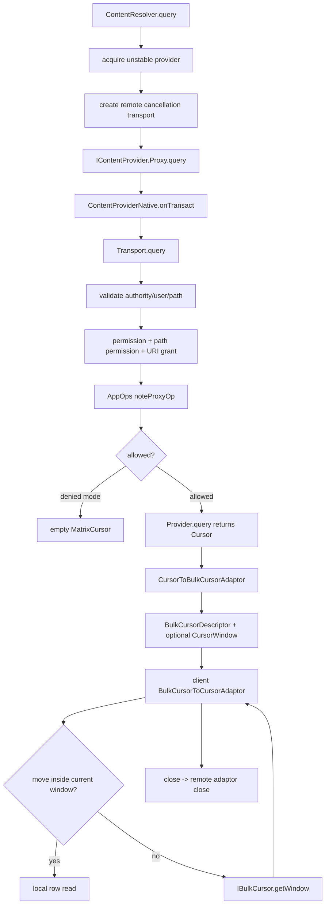
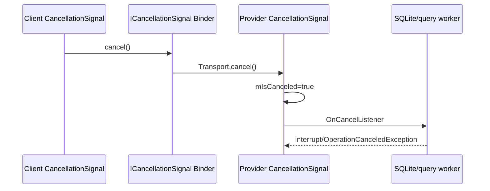

# 117 Android ContentProvider Transport：权限、Cancellation 与 BulkCursor

> 源码版本：Android 11 / API 30 / `android-11.0.0_r48`  
> 学习方式：macOS 只读源码，不要求编译  
> 前置章节：第 42、91、116 章

---

## 1. 本章从“拿到 Binder”继续

第 116 章解决了如何得到 `IContentProvider`。本章继续一次 `query()`：

- Binder 到达 Provider 后，谁验证 authority、user、permission 和 AppOps？
- URI grant 为什么是最后机会？
- AppOps denied 为什么有时不是 SecurityException，而是空 Cursor/0/null？
- `call()` 为什么与 query/insert 的权限模型不同？
- CancellationSignal 如何跨 Binder 传播？
- Cursor 为什么不能一次塞进 Parcel？
- BulkCursorDescriptor、IBulkCursor、CursorWindow 如何组成远程 Cursor？
- 客户端移动位置时，何时再次 Binder 获取窗口？
- close/death 如何关闭 Provider 侧数据库 Cursor？

---

## 2. 总流程图



---

## 3. Transport 是 Provider 的安全边界

每个 ContentProvider 内部持有继承 `ContentProviderNative` 的 `Transport`。Binder 入口不会直接调用
开发者重写的 query/insert；Transport 先做系统级协议处理，再调用 `mInterface`。

它承担：

```text
URI/authority/user 验证
permission/path permission/URI grant
AppOps
calling package/attribution 上下文
CancellationSignal 转换
userId 去除与结果恢复
Trace
拒绝时的 API 特定返回值
```

---

## 4. ContentProviderNative 是手写 Binder Stub

Android 11 的 `IContentProvider` 并非普通 Java AIDL 生成类。`ContentProviderNative.onTransact()` 手动
解析 Parcel、调用 Transport，再手动写 reply。

query 事务中读取：

```text
calling package / attribution tag
Uri
projection
queryArgs Bundle
IContentObserver Binder
ICancellationSignal Binder
```

返回的不是 Cursor Parcelable，而是 `BulkCursorDescriptor`。

---

## 5. 第一层：validateIncomingUri

Provider 先确认 URI authority 属于自己。多 authority Provider 使用声明列表匹配；authority 中可能
含 userId 前缀，比较前先去除。

把错误 authority 发给已经获得的 Provider Binder 会抛 SecurityException，不能借一个 Provider
Binder 路由到别的组件。

---

## 6. URI 的用户一致性

非 singleUser Provider 检查 URI 中显式 userId 必须是当前 Provider Context user，或没有显式 user。

这样即便客户端拿到 user 0 Provider Binder，也不能构造 `content://10@authority/...` 偷渡访问 user
10 数据。

跨用户选择应在 ContentResolver/AMS 获取正确用户实例时完成。

---

## 7. 为什么规范化双斜杠路径

`validateIncomingUri()` 将 encoded path 中连续 `//` 归一成 `/` 并记录 warning。

若权限的 PathPermission 与 Provider 业务路由对路径规范化理解不同，攻击者可能用等价但文本不同
路径绕过规则。先统一路径表示降低这种 security parsing mismatch。

---

## 8. userId 前缀为何在业务调用前去除

大多数 Provider 实现只应看到自己的逻辑 authority/path，不应处理 `10@authority` 这种路由元数据。
Transport 验证后调用 `maybeGetUriWithoutUserId()`。

singleUser Provider 是例外，它可能保留 user 上下文以处理跨用户调用。

---

## 9. 返回 URI 为什么恢复 userId

insert/canonicalize 的输入在 Transport 中去掉 userId，Provider 返回普通 URI；Transport 根据原输入
提取的 userId 调 `maybeAddUserId()` 再返回客户端。

```text
client:   content://10@authority/items
provider: content://authority/items
result:   content://10@authority/items/42
```

路由层元数据在边界剥离，又在结果边界恢复。

---

## 10. same-app 快路径

`enforceReadPermissionInner()`/write 首先检查 `UserHandle.isSameApp(callingUid,mMyUid)`；它比较的是 UID
中的 **appId**，会忽略 userId 部分，命中后直接允许。这是代码中“同 app”的精确含义；不要
把它误读成只比较完整 UID。URI 的 userId 一致性则已在前面的 `validateIncomingUri()` 阶段处理。

这仍不意味着 arbitrary calling package 可冒充。若 Provider 业务调用 `getCallingPackage()`，系统会
用 AppOpsManager.checkPackage 验证 package 属于 Binder calling UID。

---

## 11. exported 与 user 是组件访问前提

非同 app caller 想走 manifest permission，Provider 必须 exported 且 `checkUser()` 通过。checkUser
允许同用户、singleUser 或持 INTERACT_ACROSS_USERS(_FULL) 权限。

若不满足，仍有 URI grant 最后机会；非 exported Provider 也可以安全地对具体 URI 临时授权。

---

## 12. component permission

ProviderInfo 可定义 readPermission/writePermission。Transport 通过 Context.checkPermission 校验
Binder pid/uid，并进一步把 permission 映射到 AppOp。

permission 允许并不一定结束：关联 AppOp 仍可能 MODE_IGNORED/ERRORED。

---

## 13. PathPermission 的覆盖逻辑

Provider 可为特定路径声明更细 read/write permission。源码逐个匹配 PathPermission：

- 任一匹配权限 allowed，立即允许；
- 匹配但 denied，会取消“Provider 没有默认 permission，所以默认开放”的资格；
- 保存 missingPerm 与最强 denial mode；
- 最后仍检查 URI grant。

PathPermission 不是简单附加 AND 条件，而是特定路径的覆盖/替代策略。

---

## 14. allowDefaultRead/Write

Provider 未设置 component permission 时，默认可能开放。但若 URI path 命中一个受保护 PathPermission，
即使调用者没权限，也不能回退到“Provider 默认开放”。

这堵住了：

```text
provider 无全局 permission
/public 无特殊保护
/private 需要 SECRET_PERMISSION
```

调用者不能因全局为空而绕过 `/private`。

---

## 15. URI grant 是最后机会

manifest permission 路径失败后，Transport 调 `context.checkUriPermission()`，检查 caller pid/uid 对
具体 URI 的 READ/WRITE grant。

URI grant 的粒度比 component permission 小，可带 prefix/persistable 等语义，适合文档分享、相机
输出等临时授权。

---

## 16. singleUser read grant 的 user URI

read 检查中，singleUser Provider 接收其他用户 caller 时，会把 caller userId 加回 URI 再查 grant。

否则 user 10 获得的 grant 可能因 Provider 运行在 user 0 而在错误 user namespace 查询。这个细节
说明 URI grant 不只是字符串权限，也有用户作用域。

---

## 17. write grant 的实现差异

本 checkout 的 write permission 最后机会直接用已经处理的 `uri` 查 grant，没有像 read 分支那样为
singleUser/cross-user显式重建 `userUri`。

这是 Android 11 源码中的不对称边界。分析跨用户 singleUser Provider 的 write grant 时必须按实际
代码验证，不能从 read 路径类推完全一致。

---

## 18. permission denial 有两种强度

若缺 permission/export/user/grant 且不是可软拒绝的 AppOps，Transport 抛 SecurityException。

若权限本身通过，但 AppOp 返回 MODE_IGNORED，enforce 方法把 mode 返回上层，让具体 API选择安全的
空结果，而不是暴露异常。

---

## 19. noteProxyOp 为什么带 calling package

Provider 代表调用方访问受 AppOps 管理的数据，调用：

```java
noteProxyOp(op, callingPkg, Binder.getCallingUid(), attributionTag, null)
```

它同时记录代理者和被代理调用方的归因。attributionTag 进一步区分同一 package 内功能来源。

---

## 20. MODE_DEFAULT 转 MODE_IGNORED

Transport 对专门设置的 readOp/writeOp：

```java
return mode == MODE_DEFAULT ? MODE_IGNORED : mode;
```

没有显式 AppOp allow 时选择软拒绝，而非当作 permission default 自动放行。具体 permission 自带
AppOp 的检查还走 `checkPermissionAndAppOp()`。

---

## 21. query 被 AppOps 拒绝时为何返回空 Cursor

直接抛异常会让“用户关闭某项隐私能力”变成 App crash，也可能泄露资源是否存在。Transport 尽量
返回零行 `MatrixCursor`。

若 projection 非 null，可直接用请求列名；若 projection 为 null，系统不知道“全部列”是什么，只能
执行真实 query 获取 column names，再丢弃行数据。

---

## 22. projection=null 的安全与副作用边界

软拒绝场景仍调用 Provider.query，仅用于读取 `cursor.getColumnNames()`。因此 Provider 代码和数据库
准备可能执行，并产生耗时/日志/副作用；但行不会返回给 caller。

Provider 的 query 应保持只读语义，不能假设“AppOps denied 就绝对不会进入实现”。

---

## 23. 空 Cursor 的资源边界

源码获得原 Cursor 后直接构造 `new MatrixCursor(cursor.getColumnNames(),0)`，该片段没有 finally
关闭原 Cursor。

这是 Android 11 可见的潜在资源生命周期边界：若 Provider 返回需要显式 close 的 Cursor，软拒绝且
projection=null 路径可能未及时释放。学习时应按版本记录，而不是假设框架必然完美闭合。

---

## 24. 各写 API 的软拒绝返回

| API | AppOps 非 allowed 时 |
|---|---|
| insert | 调 `rejectInsert()`；默认返回在基 URI 后追加 `/0` 的占位 URI，Provider 可覆写 |
| bulkInsert | 0 |
| update/delete | 0 |
| applyBatch | 抛 OperationApplicationException |
| canonicalize/uncanonicalize | null |
| refresh | false |
| openFile/openAsset/openTyped | FileNotFoundException |

返回策略保持各 API 的类型契约，不是统一异常。

---

## 25. applyBatch 每个 operation 独立校验

Transport 验证 authority 后遍历 operations：

1. 保存每项原 userId；
2. normalize/去 userId；
3. 必要时重建 ContentProviderOperation；
4. 按 read/write 类型分别授权；
5. 任一 AppOp 不允许则整批拒绝；
6. Provider执行后给每个 URI result 恢复对应 userId。

批处理不能只验证第一条 URI。

---

## 26. call() 是特殊边界

Android 11 `Transport.call()` 只验证传入 authority、把 extras 设为 defusable、设置 calling package，
随后调用 Provider `call()`；它没有自动执行 read/write permission 或 AppOps 检查。

因此实现自定义 `call(method,...)` 的 Provider 必须自行按 method、数据敏感度校验 permission/UID，
不能认为 Transport 已像 query 一样保护。

---

## 27. Bundle.setDefusable

来自远端的 extras 可能包含 Provider classloader 不认识或损坏的 Parcelable。设为 defusable 让反序列化
问题尽量降级为丢弃/空值，而不是让 system component 因 BadParcelableException 崩溃。

它不是授权检查，也不能让不可信对象内容变安全；业务仍应验证 key/type/size。

---

## 28. calling package 用 ThreadLocal 保存

Transport 在进入 Provider 实现前：

```java
original = setCallingPackage(Pair(callingPkg, attributionTag));
try { ... } finally { setCallingPackage(original); }
```

Binder pool 可并发服务多个 caller，所以不能用单个 Provider 字段。ThreadLocal 保证每条 Binder 线程
看到自己的调用上下文，并支持同线程嵌套调用后恢复。

---

## 29. getCallingPackage 是延迟验证

Transport 设置字符串时未立即 checkPackage；Provider 调 `getCallingPackage()` 时才用
AppOpsManager.checkPackage(Binder.getCallingUid(),pkg)` 验证归属。

授权路径的 `noteProxyOp` 也会用 package/uid，所以敏感 query 常已间接验证；但 Provider业务若使用
calling package 作安全决策，应调用已验证 API，不能使用 `getCallingPackageUnchecked()`。

---

## 30. getType 为何没有 calling package

getType/getStreamTypes 的协议不携带 calling package，上层注释明确对应回调中
`getCallingPackage()==null`。

Provider 不应在 getType 中依赖 package-specific 业务授权；敏感数据不能通过 MIME 类型接口泄漏。

---

## 31. clearCallingIdentity 必须连 ThreadLocal 一起清

ContentProvider 自己要以宿主身份访问其他服务时，应使用其 `clearCallingIdentity()`，它同时：

- Binder.clearCallingIdentity；
- 清 calling package/attribution ThreadLocal。

restore 时两者一起恢复。只清 Binder UID 却遗留外部 package，会造成身份上下文不一致。

---

## 32. CancellationSignal 的两个对象

客户端创建本地 `CancellationSignal`，先向 Provider 调 `createCancellationSignal()` 获得远端
`ICancellationSignal` transport，再 `local.setRemote(remote)`。

Provider Transport 将 Binder transport 通过 `CancellationSignal.fromTransport()` 还原为 Provider
进程内的 CancellationSignal，交给 query/open 等实现。

---

## 33. cancellation 时序图



cancel 是协作式信号，不是系统强杀 Provider Binder 线程。

---

## 34. 先 cancel 后 setRemote 不会丢信号

`CancellationSignal.setRemote()` 检查：若本地已经 canceled，新 remote 设置后立即 `remote.cancel()`。

这关闭了用户按取消与远端 transport 尚在创建之间的竞态。

---

## 35. cancel 与 listener 更新的互斥

cancel 在锁内快照 listener/remote，锁外调用，再回锁清 `mCancelInProgress` 并 notifyAll。设置 listener
或 remote 会等进行中的 cancel 完成。

这样保证一个 listener 被移除后不会晚到调用，同时避免持 CancellationSignal 锁执行任意 callback。

---

## 36. Provider 必须主动尊重取消

框架只把 CancellationSignal 交给 Provider。Provider/SQLiteQuery 要调用 `throwIfCanceled()` 或注册
listener，并把 signal 传到数据库/IO 层，取消才真正中断工作。

忽略 signal 的实现仍会继续运行；客户端停止等待不等于 Provider 后台计算自动消失。

---

## 37. query 返回 Cursor 后仍未传输所有数据

Provider.query 通常返回惰性 Cursor。ContentProviderNative 将它包成
`CursorToBulkCursorAdaptor`，获取 descriptor：

```text
IBulkCursor Binder
columnNames
wantsAllOnMoveCalls
count
optional initial CursorWindow
```

客户端得到的是远程游标代理和有限窗口，不是一份完整结果集副本。

---

## 38. 为什么不能把所有行塞进 Parcel

结果集可能有几十万行和 BLOB，超过 Binder transaction buffer，也会造成高内存和首屏延迟。

BulkCursor 把控制面与数据面拆开：初始 metadata/窗口通过 query reply，后续按位置请求 CursorWindow。

---

## 39. CursorToBulkCursorAdaptor 的职责

Provider 侧 adaptor：

- 把普通 Cursor 包成 CrossProcessCursor；
- 暴露 IBulkCursor Binder；
- 管理 CursorWindow；
- 转发 onMove/requery/getExtras/respond；
- 注册跨进程 ContentObserver；
- client observer Binder death 时关闭 Cursor；
- client close 时关闭真实 Cursor。

它是 Provider Cursor 的远程生命周期 owner。

---

## 40. 非 CrossProcessCursor 如何适配

普通 Cursor 被 `CrossProcessCursorWrapper` 包装，提供 fillWindow/getWindow 能力。Provider 开发者不必
自己实现 Binder 游标协议。

但自定义 Cursor 的 getCount/fillWindow/getColumnNames 仍可能执行昂贵工作，query Binder 首次返回
可能因此阻塞。

---

## 41. descriptor 获取会触发 getCount

`getBulkCursorDescriptor()` 调 `mCursor.getCount()`，所以即使 Cursor 惰性，建立远程 descriptor 也可能
执行数据库 count/初次查询。

“query 返回 Cursor 很快”不代表跨进程 query reply 很快；adaptor metadata 构造仍在 Provider Binder
线程上执行。

---

## 42. 初始 CursorWindow 是可选优化

若 underlying CrossProcessCursor.getWindow() 非 null，descriptor 直接携带当前 window。客户端初始化
后可在窗口范围内本地移动读取，无需马上二次 Binder。

若为 null，客户端首次 move 时通过 IBulkCursor.getWindow(position) 请求 Provider fill。

---

## 43. CursorWindow 默认 2 MiB，但可由资源覆盖

本 checkout 的 `config_cursorWindowSize=2048` KiB，Java 乘 1024，默认约 2 MiB。

它是窗口容量，不是 Cursor 总大小，也不是 Binder transaction 数据全部内联大小。不同设备 overlay
可改配置，不能硬编码假设。

---

## 44. CursorWindow 如何跨进程

CursorWindow 的 native 对象写入 Parcel；这个 Android 11 checkout 的
`frameworks/base/libs/androidfw/CursorWindow.cpp` 明确调用 `ashmem_create_region()`，以 ashmem FD 和
`MAP_SHARED` 映射数据，而不是逐单元复制进 Binder transaction buffer。Provider 侧先建立可写映射，
再将 region 保护收紧；客户端从 Parcel 复制 FD 后建立只读映射。

Parcel 传递的是名称、ashmem FD 和相关元数据；两端各有引用计数、FD 与 mmap 生命周期。其他 Android
版本可能迁移底层机制，所以这里的 ashmem 结论只绑定当前源码版本。

---

## 45. 为什么 write reply 前 acquireReference

Provider 把 window 放入返回 Parcel 后，Parcelable return-value 过程会减少一次引用。adaptor 提前
`window.acquireReference()`，保证跨 Parcel 交接期间 native window 不被过早释放。

这是 native 资源所有权转移，不是 Java 对象引用普通赋值。

---

## 46. 客户端 BulkCursorToCursorAdaptor

客户端 Proxy 读取 descriptor 后初始化：

```text
mBulkCursor
mColumns
mWantsAllOnMoveCalls
mCount
mWindow（若初始提供）
```

对应用仍暴露普通 Cursor API，跨进程细节被 adaptor 隐藏。

---

## 47. move 在窗口内不做 Binder

`onMove(old,new)` 检查新位置是否在：

```text
[window.startPosition,
 window.startPosition + window.numRows)
```

命中则直接读共享窗口；只有 cursor 声明 wantsAllOnMoveCalls 时仍通知远端 `onMove()`。

这使逐行遍历通常不是每行一次 IPC。

---

## 48. move 越窗才 getWindow

新位置超出窗口时调用 `mBulkCursor.getWindow(newPosition)`。Provider adaptor：

1. move underlying cursor；
2. 若 Cursor 自带 window，返回它；
3. 否则创建/复用 `mFilledWindow`；
4. 位置不在旧 window 时 clear；
5. `fillWindow(position,window)`；
6. acquireReference 后返回。

分页粒度由行大小和 window 容量动态决定，不是固定 100 行。

---

## 49. 大单行的风险

若一行（尤其 BLOB/大字符串）本身无法装进 CursorWindow，可能出现 CursorWindowAllocationException、
SQLiteBlobTooBigException 或窗口填充失败。

CursorWindow 分页只能解决“总结果集大”，不能解决“单个 cell/row 超过窗口容量”。大二进制应使用
openFile/AssetFileDescriptor 流式传输。

---

## 50. count 不是窗口行数

descriptor.count 是整个 Cursor 的逻辑总行数；window.numRows 只是当前缓存片段。客户端
`getCount()` 返回前者，move 时按窗口是否覆盖决定远端请求。

把二者混淆会误判“Cursor 明明 count 很大，为什么内存只有几 MiB”。

---

## 51. observer 如何跨进程

客户端 adaptor 创建 SelfContentObserver 的 Binder，随 query 发给 Provider。Provider adaptor 建
ContentObserverProxy 注册到真实 Cursor，数据变化时通过 `IContentObserver.onChangeEtc()` 回客户端。

这是 Cursor 自身观察链，不等同于 ContentResolver 全局 `registerContentObserver(uri,...)` 的所有
路由细节，但底层接口相通。

---

## 52. observer death 自动关闭 Cursor

Provider proxy 对客户端 observer Binder linkToDeath，并把 adaptor 本身作为 DeathRecipient。客户端
进程死亡时 `binderDied()` 调 `disposeLocked()`：注销 observer、关闭真实 Cursor 和 filled window。

即使客户端来不及显式 close，远端资源仍有死亡回收路径。

---

## 53. 显式 Cursor.close 的跨进程效果

客户端 `BulkCursorToCursorAdaptor.close()`：

1. 关闭本地 CursorWindow；
2. `mBulkCursor.close()` Binder；
3. Provider adaptor dispose 真实 Cursor；
4. 清远端 observer/window；
5. 客户端把 mBulkCursor=null。

应用仍应使用 try-with-resources；依赖进程死亡回收会长期占数据库 cursor 和共享内存。

---

## 54. requery 是重新执行协议

客户端 requery 调远端，Provider 关闭 filled window、执行 underlying cursor.requery、重新注册 observer，
返回新 count。客户端成功后 position=-1、关闭旧 window并通知观察者。

现代代码更推荐重新 query/Loader 等模式；requery 的跨进程状态复杂且容易错用。

---

## 55. RemoteException 的降级并不统一

move getWindow 失败返回 false；getExtras 失败转 RuntimeException；respond 失败记录日志并返回
Bundle.EMPTY；close/deactivate失败只记录 warning。

每个 Cursor API 的可恢复性不同，不能用一个“Provider 死了就都抛 DeadObjectException”的模型。

---

## 56. query 初始异常如何避免 Cursor 泄漏

ContentProviderNative 构造 adaptor/descriptor 时用 try/finally：

- adaptor 构造后 descriptor 失败，close adaptor；
- adaptor 尚未接管时发生异常，close 原 Cursor；
- 成功写 reply 后 adaptor 由远端 Binder 生命周期持有。

这是明确的资源所有权 handoff。

---

## 57. Binder.copyAllowBlocking

客户端收到 descriptor 后调用 `Binder.copyAllowBlocking(mRemote,d.cursorBinder)`，把 Provider Binder 的
blocking 策略传播到 BulkCursor Binder。

否则同一 Provider query 被允许阻塞，但后续 getWindow 可能触发 Binder blocking 警告。它只调整
本地 Binder policy，不让远端调用变成异步或无限安全。

---

## 58. Cursor 期间为什么需要 stable Provider 引用

ContentResolver query 常先用 unstable 执行初始请求，成功取得 Cursor 后再 acquire stable，并让
CursorWrapper 在 close 时 release stable。

因为远程 Cursor 后续 move/getWindow 仍依赖 Provider 进程。只在初始 query 时保活不够，Cursor 整个
打开期间都需强依赖。

---

## 59. DeadObject 初始恢复

初始 unstable query 遇 DeadObject 时，ContentResolver：

1. `unstableProviderDied()` 清旧代；
2. acquire stable 新 Provider；
3. 重做 query；
4. 成功后由 Cursor 生命周期持 stable。

这通常只重试一次。若 Provider 操作有副作用，query 应保持只读，避免重试语义问题。

---

## 60. Cancellation 与 Provider stable 引用独立

cancel 只请求中断当前 operation，不会自动 release Provider 或 close Cursor。ContentResolver finally
负责清 remote cancellation、释放临时引用；成功返回 Cursor 后由 Cursor close 管长期 stable 引用。

操作取消、Binder 依赖和结果资源是三条必须分别闭合的生命周期。

---

## 61. openFile 更适合大数据

openFile/openAsset/openTyped 先按 mode 做 read/write 授权，返回 ParcelFileDescriptor/AFD。数据通过文件
描述符、pipe 或文件映射流动，不占 CursorWindow cells。

Provider 可用 `openPipeHelper()` 在后台向 pipe 写内容，但同样应处理取消、client close 和写端异常。

---

## 62. callerToken 的 URI grant 生命周期

openFile 与某些 permission 检查传 callerToken，使 Context.checkUriPermission 可关联调用者 token 与
临时 grant/生命周期。并非所有 Transport API 都传 token；query 等通常为 null。

分析 URI grant 时要看具体方法签名，而不是只看 Uri 字符串和 flags。

---

## 63. Trace 只包 Provider 业务段

Transport 在授权后 `Trace.traceBegin(TRACE_TAG_DATABASE,"query")`，finally end。权限软拒绝生成空 Cursor
的路径不一定进入同一 trace 段；Binder 排队、客户端 acquire Provider 等也不包含在这里。

Perfetto 中 query slice 是 Provider 实现耗时的重要线索，但不是端到端 ContentResolver latency。

---

## 64. Binder 线程与数据库线程

默认远端 Transport 方法运行在 Provider 进程 Binder thread pool。Provider.query 若直接 SQLite 查询，
工作就在该 Binder 线程执行；它不自动切到主线程。

Provider.onCreate 在主线程，query 通常在 Binder 池，这是非常关键的线程区别。自定义串行 executor
会改变实际模型，但需自行避免 Binder pool 饥饿。

---

## 65. 本地 Provider 调用的线程差异

同进程 IContentProvider 可能走 local Binder direct call，Transport 运行在客户端当前调用线程，而非
Binder pool。Provider 实现不能依赖“query 永远在 Binder 线程”。

线程安全设计必须同时支持本地直调与远端并发 Binder。

---

## 66. Provider 实现的并发要求

多个客户端 Binder 线程可同时 query/insert/update/delete/call。共享数据库连接池通常能并发读，
但 Provider 自身缓存、懒初始化和文件状态必须同步。

不要用一把 Provider 全局锁包住慢 I/O；它会把不同 caller 串行并可能形成跨进程锁环。

---

## 67. applyBatch 的原子性不是 Transport 提供

Transport 只做逐 operation 授权/user URI 转换。是否事务原子由 ContentProvider.applyBatch 默认实现
或子类数据库事务决定。

授权全部通过不代表业务执行不会部分失败；`yieldAllowed` 等还可能主动让出事务。

---

## 68. queryArgs 是 Bundle 协议

现代 query 使用 Bundle 携带 selection、args、sort、limit 等标准 key，也允许 Provider-specific extras。
Transport 不解释业务字段，直接交 Provider。

Provider 应使用 `DatabaseUtils`/`ContentResolver` 标准参数，并验证类型和 limit，避免字符串拼 SQL。

---

## 69. SQL 注入边界

Transport 的权限校验不防 SQL injection。Provider 若把 caller 提供的 selection/sortOrder 直接拼进 SQL，
已获读取权限的 caller 仍可能扩大查询范围或破坏语义。

应使用 selectionArgs、SQLiteQueryBuilder strict 模式、projection map 和明确 sort/limit 白名单。

---

## 70. projection 也是安全输入

caller 可提交任意列名/表达式。软拒绝 projection 非 null 时甚至直接用它创建 MatrixCursor；正常实现
若无 projection whitelist，SQLite 可能接受函数、别名或敏感列。

授权回答“能否访问 Provider”，Provider 仍需回答“能访问哪些字段”。

---

## 71. notifyChange 不随 Cursor 自动完成

数据库修改后 Provider 必须调用 ContentResolver.notifyChange；Cursor 设置 notification URI 才能让
observer 关联变化。

BulkCursor 只是转发已注册在 underlying Cursor 上的通知，不会从 insert/update 自动推断哪些 query
受影响。

---

## 72. 大结果性能模型

```text
initial latency = provider acquire + permission + query/count + first window + Binder
scroll latency  = window hit ? local shared-memory read : remote getWindow/fill
memory          = current window(s), not all rows
cleanup         = cursor.close + remote close + provider ref release
```

优化 query 不应只盯 SQL execution；getCount、fillWindow、cell size、客户端访问顺序都重要。

---

## 73. 常见误解一：拿到 Provider Binder 后权限只查一次

AMS acquire 检查能否建立连接，Transport 每次 operation 仍按 URI、read/write、path permission、AppOps
和 grant 检查。缓存 Binder 不缓存全部授权结论。

---

## 74. 常见误解二：AppOps denied 一定抛异常

很多 API 软失败：query 空 Cursor、update/delete 0、canonicalize null、openFile FileNotFoundException。
SecurityException 通常表示 manifest/user/grant 等硬授权失败。

业务不能仅靠 catch SecurityException 判断是否真正读取到数据。

---

## 75. 常见误解三：Cancellation 会杀 Binder 线程

它只是另一条 Binder 信号，设置 Provider-side CancellationSignal。实际操作必须检查或注册 listener。
不可取消的内核 I/O/第三方库可能仍迟迟不返回。

---

## 76. 常见误解四：Cursor 在客户端保存全结果

客户端保存 metadata、当前 CursorWindow 和 IBulkCursor。越窗才远程填充；默认窗口约 2 MiB，而不是
结果集总大小。

---

## 77. 常见误解五：逐行遍历就是逐行 Binder

窗口内读取是本地共享内存访问。只有越窗，或 wantsAllOnMoveCalls=true，才发生额外远程调用。

因此行宽、访问跳跃程度比单纯行数更直接影响 IPC 次数。

---

## 78. 常见误解六：call() 自动受 read/write permission 保护

Android 11 Transport.call 没有通用 read/write enforce。Provider 必须对 method 自行鉴权；这也是安全
审计 ContentProvider 时的高优先级入口。

---

## 79. macOS 只读练习一：画授权决策树

```bash
cd /Users/ninebot/androidSource

sed -n '680,900p' \
  frameworks/base/core/java/android/content/ContentProvider.java
```

分别为 read/write 画：sameApp → exported/user → component permission → PathPermission → URI grant →
MODE_IGNORED/SecurityException。

---

## 80. macOS 只读练习二：比较拒绝返回

```bash
sed -n '230,680p' \
  frameworks/base/core/java/android/content/ContentProvider.java
```

做一张 query/insert/bulk/applyBatch/delete/update/open/canonicalize/refresh 表，标出拒绝值及 Provider
实现是否仍可能被调用。

---

## 81. macOS 只读练习三：验证 call 边界

```bash
sed -n '505,525p' \
  frameworks/base/core/java/android/content/ContentProvider.java
```

搜索该 Provider 子类的 `call()` 实现，检查它是否基于 Binder UID、已验证 calling package 或显式
permission 对每个 method 鉴权。

---

## 82. macOS 只读练习四：追 Cancellation

```bash
rg -n 'createCancellationSignal|setRemote|fromTransport|cancel\(' \
  frameworks/base/core/java/android/content/ContentResolver.java \
  frameworks/base/core/java/android/content/ContentProvider.java \
  frameworks/base/core/java/android/os/CancellationSignal.java
```

手画“先 cancel 后 remote 创建”和“Provider 正执行后 cancel”两条竞态时间线。

---

## 83. macOS 只读练习五：追 query Parcel

```bash
sed -n '85,140p' \
  frameworks/base/core/java/android/content/ContentProviderNative.java

sed -n '455,500p' \
  frameworks/base/core/java/android/content/ContentProviderNative.java
```

按精确顺序列出 request/reply 字段，解释 observer 和 cancellation 为什么是两个不同 Binder。

---

## 84. macOS 只读练习六：模拟窗口移动

```bash
sed -n '145,215p' \
  frameworks/base/core/java/android/database/CursorToBulkCursorAdaptor.java

sed -n '30,105p' \
  frameworks/base/core/java/android/database/BulkCursorToCursorAdaptor.java
```

假设 window 覆盖 0～99，依次 move 0、1、99、100、50，标出哪些步骤 Binder getWindow，以及窗口
是否被替换。

---

## 85. macOS 只读练习七：确认容量来源

```bash
rg -n 'config_cursorWindowSize|getCursorWindowSize|nativeCreate' \
  frameworks/base/core/res/res/values/config.xml \
  frameworks/base/core/java/android/database/CursorWindow.java \
  frameworks/base/core/jni/android_database_CursorWindow.cpp
```

确认 2048 的单位是 KiB，并说明 vendor overlay 后为什么设备实值可能不同。

---

## 86. 一个远程 query 推演

```text
T0  client acquire unstable Provider
T1  create remote cancellation transport，local signal setRemote
T2  Proxy 把 package/tag/uri/projection/args/observer/cancel Binder 写 Parcel
T3  Provider Binder thread 解析事务
T3  validate user/authority/path，permission + path + URI grant + AppOps
T4  设置 calling package ThreadLocal，Provider.query
T5  CursorToBulkCursorAdaptor 获取 columns/count/初始 window
T6  descriptor 通过 Parcel 返回
T7  client 初始化 BulkCursorToCursorAdaptor，取得 stable Provider ref
T8  move 0～N 在共享 window 本地读取
T9  move 越窗，IBulkCursor.getWindow 让 Provider fill 下一窗口
T10 client close Cursor，远端关闭真实 Cursor并 release stable Provider
```

---

## 87. 一个权限软拒绝推演

```text
manifest permission 通过
  -> permission 对应 AppOp MODE_IGNORED
  -> enforceReadPermission 返回 ignored，不抛 SecurityException
  -> projection=[_id,name]：直接 MatrixCursor(columns,0)
  -> Provider.query 不执行
  -> client 得到合法 Cursor，count=0
```

若 projection=null，Provider.query 仍可能执行以取得 column names，但数据被替换为零行。

---

## 88. 一个取消竞态推演

```text
T0 client CancellationSignal.cancel，mRemote 尚为 null
T1 ContentResolver 从 Provider 创建 remote transport
T2 setRemote 看见 mIsCanceled=true，立即 remote.cancel
T3 Provider Transport 内 CancellationSignal 已 canceled
T4 Provider query 收到 signal，第一次 throwIfCanceled 即抛 OperationCanceledException
```

取消不会因为 remote 建立较晚而丢失。

---

## 89. 排障清单

```text
[ ] Provider acquire 权限与 operation Transport 权限是否分开看？
[ ] URI authority/user/path 是否被 normalize？
[ ] component permission、PathPermission、URI grant 哪条允许/拒绝？
[ ] AppOps mode 是 allowed/ignored/errored/default？
[ ] callingPkg 是否属于 Binder UID，attributionTag 是什么？
[ ] 是否是 call() 自定义入口漏鉴权？
[ ] cancellation remote 是否已连接，Provider 是否尊重 signal？
[ ] 初始 query 慢在 SQL、getCount 还是 first window？
[ ] CursorWindow start/numRows/count/容量各是多少？
[ ] 单行是否过大？
[ ] Cursor 是否显式 close，remote adaptor 是否仍存在？
[ ] 是 Provider Binder 死亡还是 window/getWindow 失败？
```

---

## 90. 自测题

1. 为什么 AMS acquire 授权后 Transport 还要再次授权？
2. PathPermission denied 时为何不能回退到无 component permission 的默认开放？
3. URI grant 在决策树什么位置？
4. projection=null 的 AppOps soft deny 为什么仍可能执行 Provider.query？
5. `call()` 的安全责任落在哪里？
6. 先 cancel 后 setRemote 会丢信号吗？
7. descriptor.count 与 window.numRows 有何不同？
8. 为什么逐行 move 通常不逐行 IPC？
9. client 死亡后谁关闭 Provider 真实 Cursor？
10. 2 MiB CursorWindow 能否承载任意大单行？

---

## 91. 参考答案

1. acquire 只决定能否建立 Provider 连接，每次操作还涉及具体 URI、read/write、path、grant 和 AppOps。
2. 匹配 path 的专门保护应覆盖全局默认，否则私有子路径可被绕过。
3. manifest/export/user/path 失败后的最后机会，之后才决定 ignored 或抛 SecurityException。
4. 系统不知道“全部列”名称，只调用 query 获取 columnNames，再返回零行 MatrixCursor。
5. Provider 自定义 call 实现必须按 method 自行验证 UID/package/permission。
6. 不会，setRemote 发现已 canceled 会立即 cancel 新 transport。
7. count 是总行数，numRows 是当前窗口缓存行数。
8. 窗口内是客户端共享内存读取，越窗才 getWindow Binder。
9. CursorToBulkCursorAdaptor 监听客户端 observer Binder death 并 dispose Cursor。
10. 不能；窗口分页解决总量，不解决单 cell/row 超容量。

---

## 92. 本章源码索引

```text
frameworks/base/core/java/android/content/
├── ContentResolver.java
├── ContentProvider.java
└── ContentProviderNative.java

frameworks/base/core/java/android/os/
└── CancellationSignal.java

frameworks/base/core/java/android/database/
├── IBulkCursor.java
├── BulkCursorNative.java
├── BulkCursorDescriptor.java
├── CursorToBulkCursorAdaptor.java
├── BulkCursorToCursorAdaptor.java
├── CursorWindow.java
└── CrossProcessCursor.java

frameworks/base/core/jni/
└── android_database_CursorWindow.cpp
```

---

## 93. 本章结论

Android 11 的 ContentProvider 数据调用由三层协议共同完成：

1. Transport 安全层：验证 authority/user/path，以 component/path permission、URI grant 和 AppOps
   决定硬拒绝或 API 特定软失败，并维护可信 calling package/attribution；
2. 协作控制层：CancellationSignal 用独立 Binder 把取消传播到 Provider，但真正中断取决于实现；
3. 结果传输层：Provider Cursor 被适配为 IBulkCursor，metadata 和有限 CursorWindow 跨进程共享，客户端
   越窗才请求下一页，observer death/close 负责远端资源回收。

安全上最需要记住的是：`call()` 在本版本没有统一 read/write enforce，projection=null 的 AppOps
软拒绝仍会进入 query 获取列名。性能上最需要记住的是：query reply 会调用 getCount 和准备初始
window，Cursor 惰性不等于首包零成本；窗口分页解决总结果大，不解决单行巨大。

---

## 94. 下一章预告

第 118 章深入 ContentObserver 与 notifyChange：observer 树、user/descendant/self-change、Binder death、
同步/异步派发、缓存失效，以及 Provider 数据变更如何跨进程到 Loader/UI。
