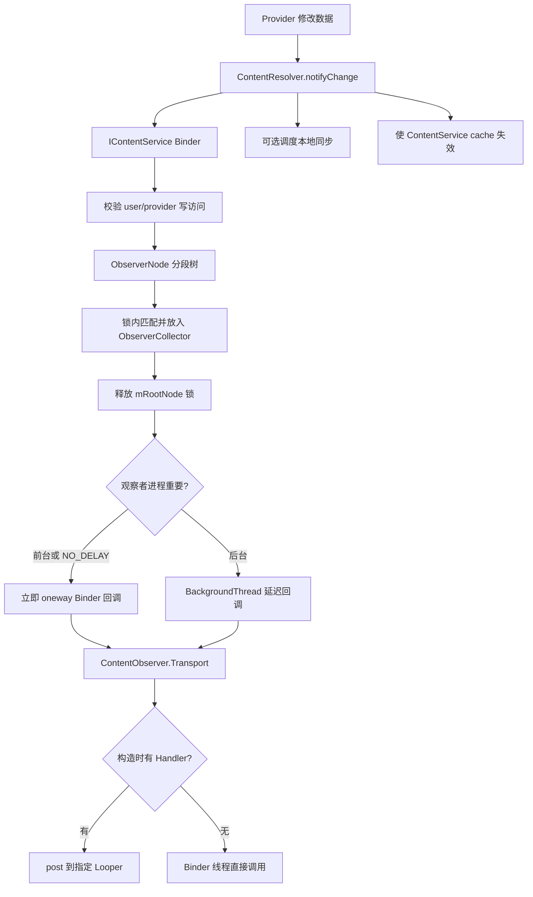

# 118 Android ContentObserver：通知树、notifyChange 与缓存失效

> 源码版本：Android 11 / API 30 / `android-11.0.0_r48`  
> 学习方式：macOS 只读源码，不要求编译  
> 前置章节：第 116、117 章

---

## 1. 本章要解决什么

第 117 章追完了 `query()` 的跨进程传输。本章研究数据改变以后，观察者怎样知道：

- `ContentObserver` 为什么需要一个 Binder Transport？
- `notifyForDescendants=false` 是否真的只接收“精确 URI”？
- URI 的祖先、精确节点和后代如何匹配？
- `selfChange` 是谁判断的，为什么仅靠它不能阻止通知环？
- 多 URI 为什么可能只产生一次 Binder 调用？
- 为什么后台进程收到通知更晚？
- `notifyChange()` 为什么还会触发 SyncAdapter 和系统缓存失效？
- 注册者死亡后，服务端怎样清理观察者树？

先记住一句话：

> ContentObserver 是“变化提示协议”，不是数据推送协议；回调只说明某个 URI 范围可能发生变化，消费者通常仍需重新查询。

---

## 2. 一张总图



这张图有三个线程边界：调用者线程、`system_server` Binder 线程、观察者进程 Binder/Handler 线程。

---

## 3. 先区分四个对象

| 对象 | 所在位置 | 职责 |
|---|---|---|
| `ContentObserver` | 应用/系统组件进程 | 开发者覆写 `onChange()` 的对象 |
| `ContentObserver.Transport` | 同一进程 | `IContentObserver.Stub`，把 Binder 回调转成本地 dispatch |
| `ObserverEntry` | `system_server` | 保存 Binder、uid、pid、user 和 descendant 选项 |
| `ObserverNode` | `system_server` | 按 authority/path segment 建立的注册树 |

不要把 `ContentObserver` 理解成注册进 `system_server` 的 Java 对象。跨进程保存的是它的
`IContentObserver` Binder 代理。

---

## 4. 注册入口

应用通常调用：

```java
resolver.registerContentObserver(
        Uri.parse("content://books/items"),
        true,
        observer);
```

`ContentResolver` 先做两件容易忽略的事：

```java
ContentProvider.getUriWithoutUserId(uri)
ContentProvider.getUserIdFromUri(uri, mContext.getUserId())
```

也就是说，嵌在 authority 前的 userId 被拆成普通 URI 与单独 user 参数，再通过
`IContentService.registerContentObserver()` 送到 `system_server`。

---

## 5. ContentObserver 如何得到 Binder 身份

`getContentObserver()` 在锁内惰性创建 Transport：

```java
public IContentObserver getContentObserver() {
    synchronized (mLock) {
        if (mTransport == null) {
            mTransport = new Transport(this);
        }
        return mTransport;
    }
}
```

同一个 `ContentObserver` 多次注册，通常复用同一个 Transport Binder。因此服务端判断“通知发起者
是不是这个观察者”时，可以比较 Binder 身份。

---

## 6. 注册前的用户与 Provider 检查

`ContentService.registerContentObserver()` 先调用 `handleIncomingUser()`。观察自己的 user 通常不需
跨用户权限；观察其他 user 则需要 `INTERACT_ACROSS_USERS_FULL`，或者满足该 URI 的 read grant。

随后调用 `ActivityManagerInternal.checkContentProviderAccess(authority, user)`，检查对应用户中 Provider
能否访问。

Android O 及以上 targetSdk 遇到错误会抛 `SecurityException`；旧 target 的兼容分支可能忽略不存在
的 Provider，或记录警告后返回。

注意：注册使用 read URI grant 语义；发送变化通知使用 write URI grant 语义。

---

## 7. ObserverNode 不是 URI 字符串 Map

注册树按 segment 建立。例如：

```text
content://books/items/42
```

被拆成：

```text
root
└── books          authority，index=0
    └── items      path segment，index=1
        └── 42     path segment，index=2
```

scheme `content` 不参与树键；query 参数、fragment 也不参与 path segment 树结构。

这比直接使用字符串前缀安全：`items/4` 不会错误匹配 `items/42`。

---

## 8. countUriSegments 为什么加一

源码：

```java
return uri.getPathSegments().size() + 1;
```

多出来的一段是 authority。空 path 的 `content://books` 仍有一个树段 `books`。

`getUriSegment(uri, 0)` 返回 authority，后续 index 才从 `getPathSegments()` 读取。

---

## 9. addObserverLocked 如何建树

递归规则很简单：

1. index 等于总段数：在当前节点添加 `ObserverEntry`。
2. 否则取得当前 segment。
3. 有同名 child 就递归进入。
4. 没有就创建 child，再递归。

树节点可同时包含 observers 与 children。因此既能在 `books` 注册，也能在 `books/items/42`
注册。

---

## 10. ObserverEntry 保存了什么

核心字段：

```java
IContentObserver observer;
int uid;
int pid;
boolean notifyForDescendants;
int userHandle;
```

uid 用于判断观察者进程状态，pid/uid 用于 dump 与泄漏诊断，userHandle 用于通知隔离，Binder 用于
回调、身份比较与死亡监听。

---

## 11. notifyForDescendants=false 的常见误解

API 文档明确说明：false 时会接收：

- 注册的精确 URI；
- 发生变化 URI 是注册 URI 的祖先时，也会接收。

只是不会接收注册 URI 的后代变化。

例：观察 `content://books/items/42`，false：

| notify URI | 是否收到 | 原因 |
|---|---:|---|
| `books` | 是 | 通知点是注册点的祖先，遍历叶后会向所有后代展开 |
| `books/items` | 是 | 同上 |
| `books/items/42` | 是 | 精确节点 |
| `books/items/42/cover` | 否 | 注册点位于通知路径的非叶节点，false 不看后代 |

这点非常反直觉，但与 `collectObserversLocked()` 的递归方向完全一致。

---

## 12. 匹配算法的两种状态

遍历通知 URI 时，当前树节点只有两种意义：

- **非叶节点**：通知 URI 还没走完，只收集 `notifyForDescendants=true` 的本节点观察者；
- **叶节点**：刚好走完通知 URI，默认收集本节点全部观察者。

当到达叶节点后，`segment == null`，算法继续递归该节点的**全部 children**。因此更具体 URI 上注册的
观察者也会收到祖先通知。

---

## 13. 用树推演一次

注册：

```text
A: books                 descendants=false
B: books/items           descendants=true
C: books/items/42        descendants=false
D: books/authors         descendants=true
```

发送 `notifyChange(books/items/42)`：

- 到 books 时是非叶：A=false，不收；
- 到 items 时是非叶：B=true，收；
- 到 42 时是叶：C 无条件收；
- authors 不在通知路径，不进入。

结果为 B、C。

发送 `notifyChange(books)`：books 已是叶，A 被收集；随后 segment 为 null，递归所有 children，B、C、D
也都被收集。这表达“整个 authority 下可能改变”。

---

## 14. NOTIFY_SKIP_NOTIFY_FOR_DESCENDANTS 到底跳过谁

源码只在 `leaf == true` 时使用此标志：

```java
if ((flags & NOTIFY_SKIP_NOTIFY_FOR_DESCENDANTS) != 0
        && entry.notifyForDescendants) {
    continue;
}
```

它不是“完全不遍历后代”，也不是“禁止所有 descendant observer”。其典型用途是 Provider 连续发送：

1. 一个宽泛 URI，表示 X 下有变化，并带 SKIP；
2. 一个精确 URI，表示 X/Y 变化。

观察 X 且 `notifyForDescendants=true` 的对象不会因宽泛通知和精确通知重复刷新。

特别注意：当宽泛通知到达叶节点后，递归到更深注册节点时，那些节点仍处于 leaf 状态；只要它们的
entry 设置了 `notifyForDescendants=true`，同样会被 skip，而 false 的 entry 仍可收到祖先提示。

---

## 15. selfChange 是 Binder 身份比较

发送者可把“引发这次变化的 observer”传给 `notifyChange()`。服务端做：

```java
boolean selfChange = entry.observer.asBinder() == observerBinder;
```

如果是同一个 Binder，且发送者的 `deliverSelfNotifications()` 返回 false，就跳过；返回 true 才收集，
并把回调参数 `selfChange=true`。

它比较的不是 Java `equals()`，不是 uid，也不是 URI，而是 Binder 对象身份。

---

## 16. selfChange 不等于“由我这个应用修改”

如果调用 `notifyChange(uri, null, flags)`，服务端没有发起者 Binder，所有观察者看到的
`selfChange` 都是 false，即使数据正是当前应用改的。

同一应用创建两个不同 ContentObserver，其中 A 作为发起者，B 仍不是 selfChange。

所以 selfChange 的精确定义是：

> 接收 entry 的 Binder 与 notifyChange 参数中的 observer Binder 是否相同。

它不是业务层的“数据作者”标记。

---

## 17. 为什么 selfChange 仍可能形成循环

观察者收到通知后写数据库，Provider 再 notify；如果每次 notify 都没传相同 observer，或者有多个观察者
相互触发，`deliverSelfNotifications=false` 也挡不住循环。

业务代码仍应使用幂等更新、版本号、去抖或明确事件来源，不能把 selfChange 当完整防环机制。

---

## 18. user 匹配规则

entry 只有在以下任一条件满足时被收集：

```text
目标通知 user == USER_ALL
注册 entry user == USER_ALL
目标 user == 注册 user
```

因此普通 user 0 的通知不会泄漏给 user 10 的普通注册者。`USER_ALL` 是显式的系统级通配语义，不是
默认值。

---

## 19. notifyChange 的访问校验

`ContentService.notifyChange()` 对每个 URI：

1. 以 write grant 标志处理目标 user；
2. 检查调用者能否访问目标 Provider；
3. 按 `(authority, resolvedUserId)` 缓存校验结果；
4. 在观察者树中收集匹配项。

同批多个 URI 属于相同 authority/user 时，不必反复做 Provider access 检查。

“能拿到 ContentService Binder”并不代表能伪造任意 Provider 的通知。

---

## 20. Collection<Uri> 为什么先按 user 分组

公开批量 API 允许 URI 自带 userId。`ContentResolver` 先把 URI 按 user 聚类，再去掉 URI 中的 userId，
每个 user 发起一次 Binder 调用。

所以一个 Java 层批量调用，跨 user 时可能拆成多次 `IContentService.notifyChange()`。

---

## 21. ObserverCollector 解决什么问题

假设批量通知 20 个 URI，而同一个观察者都匹配。逐 URI 回调会产生 20 次 Binder 事务。

`ObserverCollector` 按以下 Key 聚合：

```text
observer Binder
observer uid
selfChange
flags
userId
```

Key 相同的 URI 放进同一个 List，最后一次 `onChangeEtc(... Uri[] ...)` 发送。

聚合不等于去重：源码直接 `value.add(uri)`，相同 URI 重复出现时仍可能在数组里重复。

---

## 22. 为什么 flags 也属于聚合键

insert、update、delete 或 no-delay 语义可能不同。若 flags 不进 Key，不同种类变化就会被错误合并成一个
含糊事件。

当前 `notifyChange(Uri[]...)` 一次 Binder 调用共享一个 flags，因此这主要保证 collector 自身语义完整，
也方便测试与演进。

---

## 23. 锁内收集，锁外回调

每个 URI 的匹配发生在：

```java
synchronized (mRootNode) {
    mRootNode.collectObserversLocked(..., collector);
}
```

循环完成后才执行：

```java
collector.dispatch();
```

此时已经不持有 `mRootNode` 锁。这是重要的并发设计：远端 Binder 回调可能慢、重入、死亡，绝不能让它
长期占着注册树锁。

---

## 24. 这是一份快照，不是强一致事务

collector 在锁内得到当时匹配的 Binder 列表，释放锁后才回调。期间观察者可能 unregister 或进程死亡。

因此可能出现：

- 已被收集，随后 unregister，仍有一个已经在途的通知；
- Binder 已死，oneway 调用抛 RemoteException，被忽略；
- 新注册者错过收集前已经发生的变化。

ContentObserver 本来就不是数据库事务提交屏障；消费方应在回调后重新读取真实状态。

---

## 25. 前台立即、后台延迟

`ObserverCollector.dispatch()` 查询观察者 uid 的进程状态：

```java
if (procState <= PROCESS_STATE_IMPORTANT_FOREGROUND || noDelay) {
    task.run();
} else {
    BackgroundThread.getHandler().postDelayed(task, BACKGROUND_OBSERVER_DELAY);
}
```

Android 11 的 `BACKGROUND_OBSERVER_DELAY` 是 10 秒，目的在于避免后台观察者同时被唤醒形成
stampede。`NOTIFY_NO_DELAY` 可绕过延迟，但它是隐藏标志，源码
也警告会损害系统健康，应谨慎使用。

“立即”只表示 `system_server` 立即发起 oneway Binder，不保证应用业务回调已经执行完。

---

## 26. IContentObserver 为什么是 oneway

AIDL：

```aidl
oneway void onChangeEtc(boolean selfUpdate,
        in Uri[] uri, int flags, int userId);
```

oneway 让 `system_server` 不等待客户端方法返回，减少慢观察者反向阻塞通知者。但 Binder 队列仍可能积压，
客户端 Handler 也可能拥堵；oneway 不是“无成本”或“实时”。

---

## 27. 回调最终在哪个线程

Transport 收到 Binder 后调用 `dispatchChange()`：

```java
if (mHandler == null) {
    onChange(...);
} else {
    mHandler.post(() -> onChange(...));
}
```

- 构造 ContentObserver 时传 Handler：回调被投递到该 Handler 的 Looper；
- 传 null：就在收到 Binder 的线程上直接调用。

因此 UI 更新应明确传主线程 Handler；耗时查询也不要阻塞主线程。常见做法是主线程只触发异步 reload。

---

## 28. onChange 重载的兼容链

Android 多年间从：

```text
onChange(boolean)
onChange(boolean, Uri)
onChange(boolean, Uri, flags)
onChange(boolean, Collection<Uri>, flags)
```

逐步增加信息。基类默认实现会逐级拆分，集合版本遍历每个 URI 调用单 URI 版本。

Android R 还用 compat change 处理历史隐藏 API：旧代码可能把第三个 int 当 userId，新公共 API 把它当
flags。阅读重载时一定看完整签名，不能只看参数类型。

---

## 29. flags 告诉了什么

Android 11 的公开变化类型：

| Flag | 意义 |
|---|---|
| `NOTIFY_INSERT` | 通常表示 insert 导致 |
| `NOTIFY_UPDATE` | 通常表示 update 导致 |
| `NOTIFY_DELETE` | 通常表示 delete 导致 |
| `NOTIFY_SYNC_TO_NETWORK` | 请求调度相应 authority 的本地同步 |
| `NOTIFY_SKIP_NOTIFY_FOR_DESCENDANTS` | 控制宽泛/精确通知重复 |

insert/update/delete 是 Provider “推荐发送”的提示，不是系统从数据库操作中自动推断，也不能当不可伪造的
审计事实。

---

## 30. notifyChange 不会携带新数据

通知参数只有 URI、flags、userId 和 selfChange。没有新行内容、旧值或事务日志。

这样做有三点好处：

- 避免敏感数据被广播给只具备观察资格但不具备查询资格的对象；
- 避免大对象占用 Binder buffer；
- 合并多次变化后，消费者读取最终状态即可。

代价是回调与 query 之间仍可能发生下一次变化，这属于“失效通知”模型。

---

## 31. unregister 做了两层断开

客户端 `releaseContentObserver()`：

1. 把 Transport 内的 `mContentObserver` 设为 null；
2. ContentResolver 把旧 Transport Binder 发给服务端 unregister；
3. 服务端递归删除对应 entry，并剪掉空节点。

即使一个在途 Binder 回调晚到，Transport 看到本地 observer 已释放也不会再 dispatch。

---

## 32. removeObserverLocked 的一个细节

它在每个节点中按 Binder 身份查找，删除后 `break`。递归仍会访问整棵树，因此同一个 Transport 注册在不同
URI 节点的 entry 都能被逐节点移除。

但在同一 URI 节点把同一个 ContentObserver 重复注册多次，会形成多个相同 entry；一次节点访问只删除一个。
不要依赖重复注册，正常生命周期应成对管理。

---

## 33. Binder 死亡自动清理

每个 ObserverEntry 实现 `IBinder.DeathRecipient`。远端进程死亡后：

```java
public void binderDied() {
    synchronized (observersLock) {
        removeObserverLocked(observer);
    }
}
```

因此进程异常退出不会永久污染观察者树。显式 unregister 仍很重要：只要进程存活，Binder 就没死，错误注册
仍占内存并接收通知。

---

## 34. 重复注册泄漏诊断

服务端通过共享的 Binder death dispatcher 统计同一 Binder 上的 death recipients。达到
`TOO_MANY_OBSERVERS_THRESHOLD` 时，会按 uid 只报告一次严重日志；Android 11 当前阈值为 1000：

```text
Observer registered too many times. Leak?
cpid=... cuid=... cpkg=... url=...
```

这通常指向 Activity/Fragment 每次启动都 register，却没有在对应生命周期 unregister。

---

## 35. notifyChange 还会触发 SyncManager

flags 含 `NOTIFY_SYNC_TO_NETWORK` 时，ContentService 对每个已校验 authority 调用：

```java
syncManager.scheduleLocalSync(
        null /* all accounts */,
        callingUserId,
        callingUid,
        authority,
        ...);
```

这是“请求调度同步”，不是在 notifyChange 内同步执行网络请求。是否有匹配 SyncAdapter、约束是否满足、何时
运行，都由后续同步框架决定。

旧的 `notifyChange(uri, observer)` 默认会 sync to network；使用 flags 重载可以更精确控制。

---

## 36. 一个 userId 易混点

观察者匹配与缓存失效使用 `resolvedUserId`；调度本地同步的调用中，源码传的是 `callingUserId`。

不要把 notify 参数中的目标 user、URI 解析出的 user、Binder 调用者 user、观察者注册 user 混成一个概念。
跨用户系统代码尤其应沿变量逐个追踪。

---

## 37. ContentService 自带的 Bundle cache

`ContentResolver.putCache/getCache` 是 System API，需要 `CACHE_CONTENT` 权限，用于把昂贵解析结果保存到
`system_server` 的长期 Bundle cache。

缓存层级可以概括为：

```text
userId
└── providerPackageName
    └── Pair<consumerPackageName, keyUri> -> Bundle
```

这里既区分 Provider 宿主包，也区分写入缓存的消费者包。

---

## 38. notifyChange 如何使 cache 失效

完成观察者 dispatch 与可选同步调度后，ContentService 对相同 authority 的 URI 调用：

```java
invalidateCacheLocked(resolvedUserId, packageName, uri);
```

然后扫描对应 user/provider package 下的缓存 key。若缓存 key URI 的字符串以变化 URI 字符串开头，就删除。

这与 ObserverNode 的**分段树匹配不同**。

---

## 39. 缓存失效为什么值得单独警惕

源码判断是：

```java
key.second.toString().startsWith(uri.toString())
```

因此它是保守的字符串前缀失效。例如变化 URI 为 `content://books/items/4`，缓存 key
`content://books/items/42` 也可能被清掉。

这会造成额外 cache miss，但比留下陈旧缓存安全。不要误称它为严格的 URI 后代判断。

Observer 通知匹配是 segment tree；cache invalidation 是字符串 startsWith。两者必须分开记。

---

## 40. authority 为何映射到 providerPackageName

cache 按 Provider 宿主包分组，而 notify 输入是 authority。`getProviderPackageName(uri, user)` 负责解析
authority 对应的 Provider package。

一个包可能托管多个 authority。按包分组便于包变化、用户停止等场景整组清理；具体 notify 时仍用 URI 前缀
缩小失效范围。

---

## 41. clearCallingIdentity 的位置

ContentService 先在调用者身份下完成权限与 Provider access 校验，随后 clear identity，再：

- dispatch 通知；
- 查询进程状态；
- 调度同步；
- 清缓存。

这样系统内部后续操作以 system_server 身份执行，又不会丢掉入口处必须基于真实调用者完成的授权判断。

---

## 42. ContentProvider 应在何时 notify

原则上应在数据修改成功、事务结果确定后通知。若数据库事务尚未提交就 notify，观察者立刻 query 可能看不到
新状态；若事务最后回滚，通知又变成假警报。

批量操作应尽量收集变化 URI，在提交后使用批量 notify，既减少 Binder 调用，也让观察者一次刷新最终状态。

---

## 43. Cursor.setNotificationUri 的关系

Provider 返回 Cursor 时常调用 `cursor.setNotificationUri(resolver, uri)`。这让 Cursor/适配器能够观察相应
URI 并在变化时标记或触发刷新。

它没有让数据库自动知道“何时变化”。写路径仍需调用 `notifyChange()`；只设置 Cursor notification URI 而
写后不通知，观察者不会凭空收到事件。

---

## 44. 一个典型 UI 模式

```java
final ContentObserver observer = new ContentObserver(mainHandler) {
    @Override
    public void onChange(boolean selfChange, Uri uri, int flags) {
        viewModel.reloadAsync();
    }
};

resolver.registerContentObserver(ITEMS_URI, true, observer);
```

生命周期结束时 unregister。回调只触发异步重新加载；不要假设每个通知对应一条独立数据库事件，也不要在
主线程直接执行重查询。

---

## 45. 高频变化时的工程策略

当 Provider 高频写入时，可考虑：

- 一次事务后批量通知，而非每写一列通知；
- 使用 Collection<Uri> 降低 Binder 次数；
- UI 层做短时间 debounce，只读取最终状态；
- reload 使用 generation/version 丢弃旧查询结果；
- 避免在每次回调中再次写入同一 Provider；
- 精确选择注册 URI 与 descendants 范围。

但不要为了“优化”而漏掉事务提交后的最终通知。

---

## 46. 为什么通知顺序不能当业务保证

即使 Provider 顺序调用两次 notify，也可能经历：

- oneway Binder 排队；
- 后台延迟调度；
- Handler 消息排队；
- 多线程 query 完成顺序不同；
- 中途 unregister 或进程死亡。

消费者应把通知当“状态可能过期”的信号，以实际查询结果和版本号决定最终 UI，而不是用回调次数还原事务日志。

---

## 47. 常见误解集中纠正

### 误解一：false 只匹配精确 URI

错误。它还会收到注册 URI 的祖先通知，只是不接收后代通知。

### 误解二：descendants 使用字符串 startsWith

错误。ObserverNode 按 authority/path segment 匹配；字符串 startsWith 用在 ContentService cache 失效。

### 误解三：selfChange 表示同一应用写入

错误。它只表示接收 Binder 与 notify 参数中的发起者 Binder 相同。

### 误解四：notifyChange 会把新数据送过来

错误。它只送 URI 和元信息，观察者应重新 query。

### 误解五：回调一定在主线程

错误。只有明确传入主线程 Handler 才会 post 到主线程。

### 误解六：notifyChange 返回时所有观察者已执行完

错误。IContentObserver 是 oneway，后台观察者还可能被延迟。

### 误解七：unregister 可撤回所有在途事件

错误。服务端收集的是快照；客户端 Transport 置空能挡住许多晚到事件，但不能把协议理解成事务撤回。

---

## 48. 源码阅读路线

建议按以下顺序打开：

```text
frameworks/base/core/java/android/content/ContentResolver.java
  registerContentObserver / notifyChange / NotifyFlags / putCache / getCache

frameworks/base/core/java/android/database/ContentObserver.java
  Transport / dispatchChange / onChange overloads

frameworks/base/core/java/android/database/IContentObserver.aidl
  oneway onChangeEtc

frameworks/base/services/core/java/com/android/server/content/ContentService.java
  registerContentObserver / notifyChange
  ObserverCollector
  ObserverNode / ObserverEntry
  invalidateCacheLocked
```

先追入口和跨 Binder 参数，再手工画树，不要一开始陷入 SyncManager。

---

## 49. macOS 只读练习一：找完整链路

```bash
cd /Users/ninebot/androidSource

rg -n "registerContentObserver|notifyChange\(" \
  frameworks/base/core/java/android/content/ContentResolver.java \
  frameworks/base/services/core/java/com/android/server/content/ContentService.java

rg -n "class Transport|onChangeEtc|dispatchChange" \
  frameworks/base/core/java/android/database/ContentObserver.java \
  frameworks/base/core/java/android/database/IContentObserver.aidl
```

目标：能口述“应用 API → ContentService → ObserverCollector → oneway Binder → Handler”的完整链。

---

## 50. macOS 只读练习二：手算匹配表

阅读：

```bash
sed -n '1580,1740p' \
  frameworks/base/services/core/java/com/android/server/content/ContentService.java
```

自行建立四个注册点，然后分别对 authority、集合 URI、单行 URI 做通知，写出每个观察者是否收到及原因。
重点检查“通知祖先会向注册树后代展开”。

---

## 51. macOS 只读练习三：比较两种前缀

```bash
rg -n "getUriSegment|startsWith\(uri.toString" \
  frameworks/base/services/core/java/com/android/server/content/ContentService.java
```

回答：为什么 observer 的 `items/4` 不会匹配 `items/42`，而 cache invalidation 却可能一起清除？这是本章
最值得真正从源码验证的一组差异。

---

## 52. macOS 只读练习四：观察 dump 线索

如果手边有可连接 Android 11 设备，可选执行：

```bash
adb shell dumpsys content
```

搜索 observer tree、pid/uid count、sync 与 cache 等段落。没有设备完全不影响本章；重点仍是源码结构。

不要为了学习而在 Mac 上编译整套 AOSP。

---

## 53. 面试式自测

1. ObserverNode 的第 0 个 segment 是什么？
2. `notifyForDescendants=false` 会不会收到祖先 URI 的通知？
3. 到通知 URI 的叶节点后，为什么还会遍历所有 children？
4. SKIP 标志实际检查的是哪个 entry 字段？
5. selfChange 为什么不能代表同一 uid？
6. 多 URI 按哪些字段聚合？是否自动去重？
7. 为什么不能持有 mRootNode 锁进行 Binder 回调？
8. 后台观察者为什么可能延迟？
9. ContentObserver 构造参数为 null 时 onChange 在哪里运行？
10. observer 匹配与 cache invalidation 的“前缀”算法有何区别？
11. notifyChange 为什么可能调度 SyncAdapter？
12. Binder death 与显式 unregister 各解决什么问题？

---

## 54. 一份可以复述的答案

`ContentResolver` 把 ContentObserver 包装成 `IContentObserver.Transport`，携带目标 user 注册到
ContentService。服务端把 authority 和 path segments 建成 ObserverNode 树，并在 ObserverEntry 保存
Binder、uid、pid、user 与 descendant 选项。notifyChange 先按 write URI/user 语义验证 Provider 访问，
再在树锁内匹配祖先、精确节点和后代观察者，把相同 Binder/selfChange/flags/user 的多个 URI 聚合；释放锁后，
对重要前台 uid 立即发 oneway Binder，对后台 uid 默认延迟。客户端 Transport 再决定直接调用 onChange，
还是 post 到构造时指定的 Handler。相同调用还可请求 SyncManager 调度本地同步，并按 user、Provider package
和 URI 字符串前缀清除 ContentService Bundle cache。进程死亡通过 DeathRecipient 清理注册树，正常生命周期
仍必须显式 unregister。

---

## 55. 复读审查：本章最容易卡住的地方

初稿复读后，最容易造成误解的是三个“方向”：

1. **注册 URI 与通知 URI 的方向**：false 禁止的是“通知发生在注册点的后代”，但祖先通知会展开到更深
   注册点；因此不能翻译成“只匹配自己”。
2. **锁与回调的方向**：锁内只收集 Binder 快照，锁外才 dispatch；所以 unregister 与在途通知之间不是
   强一致屏障。
3. **两种前缀算法**：ObserverNode 是 segment tree；cache invalidation 才是字符串 startsWith，后者会
   保守地多清缓存。

文中已分别用匹配表、树推演和 `items/4`/`items/42` 反例补强。另补充了后台延迟、oneway 与 Handler 三层
异步边界，避免把“notifyChange 返回”误读为“观察者处理完成”。

---

## 56. 本章小结

本章建立了六个核心结论：

1. ContentObserver 跨进程注册的是 Binder Transport，不是 Java 对象本身。
2. ObserverNode 按 authority/path segment 建树，祖先、精确与后代匹配由递归位置决定。
3. false 仍接收祖先通知；true 才额外接收注册点后代通知。
4. 匹配在树锁内，Binder 分发在锁外；多 URI 可聚合但不保证去重和同步完成。
5. 后台观察者可延迟，客户端最终线程由 Handler 决定。
6. notifyChange 还可能调度同步并使系统 Bundle cache 失效，而缓存使用的是保守字符串前缀。

下一章进入 `SyncManager`：沿着本章的 `NOTIFY_SYNC_TO_NETWORK`，继续理解 SyncAdapter 注册、账户/authority
匹配、周期同步、退避、约束与 JobScheduler 执行链。
