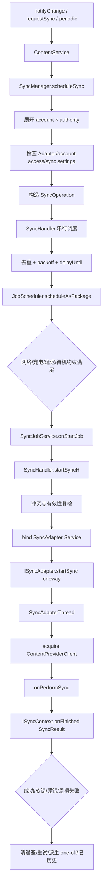

# 119 Android SyncManager：SyncAdapter 与 JobScheduler 同步调度

> 源码版本：Android 11 / API 30 / `android-11.0.0_r48`  
> 学习方式：macOS 只读源码，不要求编译  
> 前置章节：第 118 章

---

## 1. 从 NOTIFY_SYNC_TO_NETWORK 继续

第 118 章看到 `notifyChange()` 可带 `NOTIFY_SYNC_TO_NETWORK`。ContentService 随后调用
`SyncManager.scheduleLocalSync()`，但它没有立刻访问网络。

本章回答：

- 系统怎样发现某个 authority 对应的 SyncAdapter？
- Account、authority、user 为什么共同构成同步目标？
- 本地变化为什么默认等待 30 秒？
- SyncOperation 怎样变成持久化 Job？
- JobScheduler 触发后，谁绑定 Adapter 并调用 `onPerformSync()`？
- 并行、冲突、超时、取消分别怎样工作？
- soft error、hard error、delayUntil 与指数退避有什么区别？
- 周期同步失败后为什么派生一次性 Job？

先建立核心认识：

> Android 11 的 SyncManager 是同步任务的策略与状态协调者；真正的等待和约束满足交给 JobScheduler，真正的数据同步交给应用进程中的 SyncAdapter。

---

## 2. 一张完整主链图



这里至少跨越 `system_server`、SyncAdapter 应用进程和 Provider 进程；Adapter 与 Provider 若在同一应用，
后两者才可能重合。

---

## 3. 三类角色不要混

| 角色 | 典型进程 | 职责 |
|---|---|---|
| `SyncManager` | `system_server` | 筛选、建模、去重、退避、绑定、历史与状态 |
| `SyncJobService` | `system_server` | JobScheduler 的执行入口，把 job start/stop 转成 SyncHandler 消息 |
| `SyncAdapter` | 应用进程 | 实现远端数据与本地 Provider 的真正同步逻辑 |

`SyncJobService` 不是第三方 Adapter 的 Service；它是 framework 内部 JobService。

---

## 4. Android 11 已经以 JobScheduler 为中心

SyncManager 类注释直接说明：

```text
All scheduled syncs will be passed on to JobScheduler as jobs.
```

因此不要把旧文章里的 AlarmManager pending operation 队列原样套进来。Android 11 中，SyncManager 生成
`JobInfo`，JobScheduler 负责持久化、等待延迟和资源约束，并在合适时启动 `SyncJobService`。

---

## 5. SyncAdapter 如何声明

应用 Service 需要响应：

```xml
<action android:name="android.content.SyncAdapter" />
```

并提供同名 metadata，指向类似配置：

```xml
<sync-adapter
    android:contentAuthority="com.example.books"
    android:accountType="com.example.account"
    android:userVisible="true"
    android:supportsUploading="true"
    android:allowParallelSyncs="false"
    android:isAlwaysSyncable="false" />
```

Service 的 `onBind()` 返回 `AbstractThreadedSyncAdapter.getSyncAdapterBinder()`。

---

## 6. SyncAdaptersCache 的发现键

`SyncAdaptersCache` 继承 `RegisteredServicesCache<SyncAdapterType>`，扫描 action 与 metadata，解析
`sync-adapter` XML。

关键查找键是：

```text
SyncAdapterType(authority, accountType) + userId
```

不是只按 authority，也不是只按应用包名。因为同一个 Provider authority 可能为不同账户类型提供不同
Adapter；每个 Android user 的已安装服务集合也不同。

---

## 7. 六个 XML 属性的真实意义

| 属性 | 默认值 | 作用 |
|---|---:|---|
| `contentAuthority` | 必填 | 要同步的 Provider authority |
| `accountType` | 必填 | 匹配 Account.type |
| `userVisible` | true | 是否出现在同步设置 UI |
| `supportsUploading` | true | 是否接受本地变化产生的 upload-only 同步 |
| `isAlwaysSyncable` | false | 未初始化状态能否自动变为 syncable |
| `allowParallelSyncs` | false | 是否允许不同账户并行 |

`allowParallelSyncs=true` 也不代表同一账户的相同目标可无限并发。

---

## 8. scheduleLocalSync 默认批处理 30 秒

本地内容变化走：

```java
extras.putBoolean(SYNC_EXTRAS_UPLOAD, true);
scheduleSync(..., LOCAL_SYNC_DELAY, ...);
```

Android 11 默认 `LOCAL_SYNC_DELAY=30_000ms`，也可由 `sync.local_sync_delay` 系统属性调整。

这 30 秒不是网络超时，而是最小调度延迟，用于合并短时间内多次本地写入。

---

## 9. upload-only 会经过 Adapter 能力过滤

本地变化生成 `SYNC_EXTRAS_UPLOAD=true`。若配置中 `supportsUploading=false`，SyncManager 会跳过该
Adapter。

即使支持 upload，Adapter 仍应把 extras 当“此次主要上传”的提示；框架无法理解应用数据协议，也不会替
Adapter 自动上传数据库。

---

## 10. requestSync 的展开维度

`scheduleSync()` 先确定账户：指定 account 时选择对应 user 下匹配账户；未指定则使用运行中的账户集合。

再扫描该 user 的 SyncAdaptersCache，得到 authority 集合。若请求明确指定 authority，就把候选缩到该
authority。

因此一个宽泛请求可能展开为多个：

```text
AccountAndUser × 可用 authority × 匹配 accountType 的 Adapter
```

每个有效组合最终成为独立 SyncOperation。

---

## 11. 没有账户时不会生成“空账户同步”

源码在 running accounts 为空时直接记录并返回。`notifyChange()` 调用
`scheduleLocalSync(null /* all accounts */)` 的 null 是“所有匹配账户”，不是让 Adapter 接收 null Account。

这是本章第一个常见误读。

---

## 12. Syncable 不是 boolean，而是多值状态

不能只把它看成 boolean：

`AuthorityInfo` 在本版本定义的值要分成“存储状态”与“内部筛选/计算值”理解：

| 值 | 含义 |
|---:|---|
| `UNDEFINED = -2` | 内部通配/筛选值，表示不指定某一 syncable 状态 |
| `NOT_INITIALIZED = -1` | 新 Adapter 的未初始化状态，需要初始化流程 |
| `NOT_SYNCABLE = 0` | 不调度同步 |
| `SYNCABLE = 1` | 已初始化且可同步 |
| `SYNCABLE_NOT_INITIALIZED = 2` | 可同步，但仍缺一次初始化；例如设置从旧设备恢复而来 |
| `SYNCABLE_NO_ACCOUNT_ACCESS = 3` | Adapter 尚无账户访问权，需要授权流程 |

`SYNCABLE_NOT_INITIALIZED` 不是普通新安装默认值；默认是 `NOT_INITIALIZED`。开启某项自动同步时，
`setSyncAutomatically()` 会把前者转回后者，给 Adapter 补做一次初始化的机会。

SyncManager 还要确认 Adapter 存在、宿主包允许启动、Adapter 包能访问该 Account。账户访问被拒绝时，已
启动过的包可能触发用户授权请求；未运行过的包不会凭一次后台同步突然弹权限流程。

---

## 13. 初始化同步

若 authority/account 的 syncable 状态未初始化，框架先调用 Adapter 的
`onUnsyncableAccount()`。回调允许后，再以 `checkIfAccountReady=false` 重新调度。

之后可能生成 extras 含 `SYNC_EXTRAS_INITIALIZE=true` 的初始化同步。

`AbstractThreadedSyncAdapter` 开启 autoInitialize 时，会把负的 syncable 状态设为 1，然后直接返回成功，
不调用业务 `onPerformSync()`。

---

## 14. 主同步开关与单 authority 开关

普通同步需同时满足：

```text
masterSyncAutomatically(user)
AND getSyncAutomatically(account, user, authority)
```

但手动同步会在 extras 中加入 `IGNORE_BACKOFF` 与 `IGNORE_SETTINGS`；初始化同步也有特殊放行。

“手动”不是绕过所有安全校验：Account 是否存在、Adapter 是否存在、账户访问等仍会检查。

---

## 15. SyncOperation 是一次调度快照

重要字段包括：

```text
target = EndPoint(account, authority, userId)
owningUid / owningPackage
reason / syncSource
immutable extras
allowParallelSyncs
isPeriodic / sourcePeriodicId
period / flex
jobId / expectedRuntime / retries
syncExemptionFlag
```

EndPoint 表示“同步谁”；owning package 表示“由哪个 Adapter 执行”。两者不是一个概念。

---

## 16. 为什么 extras 被复制并视为不可变

构造函数用 `new Bundle(extras)` 保存快照。同步可能数分钟甚至重启后才执行，不能继续引用调用者随后会修改
的 Bundle。

在转 JobInfo 时，只支持可持久化基础类型，并对 Account 做特殊编码。未知类型会记录错误；入口还会先调用
`ContentResolver.validateSyncExtrasBundle()` 限制类型。

---

## 17. SyncOperation 如何跨重启恢复

`toJobInfoExtras()` 把 target、owner、原因、周期、重试与业务 extras 写入 PersistableBundle，并加上
`SyncManagerJob=true` 标识。

`SyncJobService` 通过 `maybeCreateFromJobExtras()` 重建 SyncOperation。`JobInfo.setPersisted(true)` 使
JobScheduler 可在重启后恢复待执行任务。

持久化的是调度描述，不是正在运行 Adapter 线程的执行现场。

---

## 18. 非周期任务如何去重

`scheduleSyncOperationH()` 先检查 active operations；若已有相同 `key` 正在运行，就不再调度。

再检查 JobScheduler 中 pending 的一次性任务：保留 expectedRuntime 更早者，取消其他重复 Job。若新任务
拥有更强 standby exemption 且可立即运行，可能让新任务获胜，并继承重复任务中的最高 exemption。

去重目标是避免同一语义任务重复排队，不是把所有相同 authority 的同步都合为一个。

---

## 19. key 与 conflict 不相同

`key` 用于判断调度语义是否重复，包含 target 与参与比较的 extras。

`isConflict()` 用于运行期并发判断：

```java
same accountType
&& same authority
&& same user
&& (!allowParallelSyncs || same accountName)
```

两个 extras 不同的任务可能不是 duplicate，却仍然 conflict，因而不能同时执行。

---

## 20. allowParallelSyncs 的精确边界

false 时，Adapter 内部用 null 作为线程 key，同一 Adapter 实例一次只跑一个同步。

true 时，以 Account 为线程 key，不同账户可并行；同一账户仍会返回
`SyncResult.ALREADY_IN_PROGRESS`。

SyncManager 的 conflict 规则也配合这一语义：允许并行时，不同 account name 不冲突。

---

## 21. 最终延迟如何计算

非 ignore-backoff 操作的最小延迟取最大值：

```text
调用方 minDelay
当前 EndPoint backoff 剩余时间
Adapter 返回的 delayUntil 剩余时间
```

取最大值后写入 JobInfo 的 minimum latency。它是“不能早于”，不是“必定在该时刻执行”；网络、充电、
待机策略仍可能继续推迟。

一个容易被字段名骗过的边界是：`SYNC_EXTRAS_IGNORE_BACKOFF` 命中时，r48 代码跳过的整块同时
包含 framework backoff **和** Adapter `delayUntil`；并不是只忽略指数退避那一项。调用方显式
`minDelay` 及 JobScheduler 资源约束仍然有效。

---

## 22. JobInfo 中有哪些约束

SyncManager 建立指向 `SyncJobService` 的 JobInfo：

- metered 禁止时要求 `NETWORK_TYPE_UNMETERED`，否则 ANY；
- 一次性任务设置 minimum latency；
- 周期任务设置 period 与 flex；
- extras 要求充电时设置 requiresCharging；
- 所有任务 persisted；
- 初始化、expedited 和普通任务映射不同 priority；
- 某些前台发起任务带 app standby exemption。

最终用 `scheduleAsPackage()`，把任务归因给 SyncAdapter 宿主包和目标 user。

---

## 23. 为什么 scheduleAsPackage 很重要

JobService 组件在 framework，但资源归因不能都算给 `android`/system_server。SyncManager 传入
`owningPackage`，让 JobScheduler 的 standby、配额和统计与真正执行同步的 Adapter 包关联。

这是“执行入口属于系统”与“工作归因属于应用”的分层。

---

## 24. SyncJobService.onStartJob

JobScheduler 约束满足后调用 `onStartJob()`：

1. 从 PersistableBundle 重建 SyncOperation；
2. 检查设备 provisioned 且目标 user unlocked；
3. 保存 JobParameters；
4. 发送 `MESSAGE_START_SYNC` 给 SyncManager.SyncHandler；
5. 返回 true，表示工作异步进行。

若 user 尚未 ready，一次性 Job 请求 JobScheduler 重调度；周期 Job 等下个周期。

---

## 25. SyncHandler 是状态机串行化中心

schedule、start、stop、service connected、finished、cancel、账户更新、周期更新等都转成 Handler 消息。

这使 active list、Job 状态和 Adapter 连接的关键变化在同一 Looper 上处理，降低多 Binder 回调直接并发修改
状态的复杂度。

它不表示同步业务运行在 Handler；`onPerformSync()` 有自己的后台线程。

---

## 26. startSyncH 为什么再次校验

Job 从创建到真正运行可能隔很久。在这期间：

- Account 被删除；
- Adapter 被卸载；
- 同步设置关闭；
- 用户停止；
- 存储变低；
- 相同目标已有任务运行。

所以不能把调度时校验当永久授权。`startSyncH()` 先处理存储低、周期派生任务、冲突，再调用
`computeSyncOpState()` 重新确认有效性。

---

## 27. 低存储与冲突延期

Android 11 当前实现：

```text
storage low -> 延后 1 小时
运行冲突 -> 延后 10 秒
already in progress -> 重试延后 10 秒
```

这些是 framework 当前常量，不应被理解成 API 稳定保证。

冲突时，高优先级新任务可抢占较低优先级 active sync；否则新任务自己延期。

---

## 28. dispatchSyncOperation 创建 ActiveSyncContext

真正开始前，SyncManager：

1. 再按 `(authority, accountType, user)` 查 Adapter component；
2. 创建 `ActiveSyncContext`；
3. 写入 SyncStorageEngine 活跃状态与历史起点；
4. 加入 active list；
5. 安排进度监控；
6. `bindServiceAsUser()` 连接 Adapter Service。

如果 Adapter 已消失，还会移除无效 authority 设置。

---

## 29. ActiveSyncContext 是跨进程会话

它同时扮演：

- ServiceConnection，接收 Adapter Binder；
- `ISyncContext.Stub`，接收 Adapter heartbeat/finished；
- DeathRecipient，检测 Adapter Binder 死亡；
- 持有 SyncOperation、开始时间、流量监控基线、wake lock 和 active info。

它不是业务数据容器，而是一次同步生命周期的系统侧控制面。

---

## 30. 绑定成功后的 startSync

Service connected 消息到 SyncHandler 后，SyncManager 对 Adapter Binder `linkToDeath()`，再调用：

```java
adapter.startSync(activeSyncContext,
        authority, account, clonedExtras);
```

`ISyncAdapter` 是 oneway 接口，因此 startSync 调用并不等待同步完成。完成必须通过反向
`ISyncContext.onFinished(SyncResult)` 报告。

---

## 31. AbstractThreadedSyncAdapter 的线程模型

Binder `startSync()` 不直接执行网络逻辑。它在锁内检查线程表，创建：

```text
SyncAdapterThread-1
SyncAdapterThread-2
...
```

线程设为 background priority，再调用 `onPerformSync()`。所以开发者无需在
`onPerformSync()` 内再为避免主线程网络异常而额外启动线程，但仍要正确处理取消。

---

## 32. Adapter 会先获取 ContentProviderClient

SyncThread 先按 authority 调用 `acquireContentProviderClient()`，成功后才进入：

```java
onPerformSync(account, extras, authority, provider, syncResult)
```

这样 Adapter 可通过已获取的 Provider client 更新本地数据。若 Provider 获取失败，框架 Adapter 基类把
`syncResult.databaseError=true`。

finally 中释放 Provider client，避免 stable Provider 引用泄漏。

---

## 33. SyncResult 是结果协议，不是异常包装

Adapter 应把可解释结果写入 SyncResult，例如：

```text
stats.numIoExceptions
stats.numAuthExceptions
databaseError
tooManyRetries
syncAlreadyInProgress
delayUntil
fullSyncRequested
tooManyDeletions
```

然后正常返回。系统依据这些字段区分成功、soft error、hard error与后续策略。

随意抛 RuntimeException 可能使 Adapter 线程乃至进程崩溃，无法提供精确重试语义。

---

## 34. 成功完成做什么

`runSyncFinishedOrCanceledH()` 在 SyncHandler 中：

- 解除 Binder death；
- 关闭 ActiveSyncContext、解绑、释放 wake lock；
- 一次性任务取消对应 Job；
- 清除 EndPoint backoff；
- 记录成功历史与 elapsed time；
- 清理错误通知；
- 若是周期失败派生任务，则重置周期 Job 的起点。

完成回调不是简单地从列表删除一项。

---

## 35. 退避属于 EndPoint

类注释强调每个 `EndPoint(account, authority, user)` 有自己的 backoff。一次任务失败会提高该 EndPoint 的
退避，并重新调度属于它的所有一次性任务。

因此退避不是某个 JobId 私有值，也不是整个 Adapter 包全局停摆。

---

## 36. Android 11 默认指数退避

初次退避从默认 30 秒到 33 秒之间随机取值；随后默认乘 2，最大默认 1 小时。配置来自
`Settings.Global.SYNC_MANAGER_CONSTANTS`，因此是可调常量而非 SDK 承诺。

如果当前 backoff 尚未到期，即便 ignore-backoff 操作又失败，也不会提前再次翻倍。

抖动用于避免大量设备或账户在同一秒重试形成惊群。

---

## 37. delayUntil 与 backoff 不一样

`SyncResult.delayUntil` 是 Adapter 基于服务端协议表达的“不要早于某时间再同步”；backoff 是框架根据失败
次数计算的 elapsed-realtime 退避。

调度时二者与 minDelay 取最大值。一个来自业务/服务器建议，一个来自本地故障控制。

---

## 38. soft error 与 hard error

soft error 通常表示 IO、暂时数据库问题或已经在同步，框架可重试；认证错误、解析错误等可能属于 hard
error，不自动重试。

但决策还受 extras 与结果细节影响：

- `DO_NOT_RETRY` 通常禁止重试；
- upload-only 失败会转换为 two-way 再试；
- madeSomeProgress 可立即再试；
- already-in-progress 固定延后 10 秒；
- tooManyRetries 停止；
- 其他 soft error 按 backoff 再排；
- hard error 不重排。

不能把“任意失败都指数重试”当结论。

---

## 39. 手动同步为什么仍可能失败

manual extras 会忽略 settings，并在 r48 的调度分支中同时跳过已存的 backoff 与 `delayUntil`，
意味着它可以尽快尝试；但网络约束、账户存在性、Adapter 服务
是否存在、账号访问、Provider 可用性和业务服务器错误仍然有效。

IGNORE_BACKOFF 是绕开时间门槛，不是强制同步成功。

---

## 40. 周期同步是周期 Job

`addPeriodicSync()` 最终生成 `isPeriodic=true` 的 SyncOperation，JobInfo 使用：

```java
setPeriodic(periodMillis, flexMillis)
```

相同 EndPoint、相同 extras 的周期项已存在时，会更新 period/flex 并复用 jobId。

flex 表示周期末端可运行窗口，不是每次执行后固定 sleep 的普通定时器。

---

## 41. 周期同步失败为何派生 one-off

周期 Job 自身不适合用动态 framework backoff 表达某次失败链。Android 11 的做法是：

1. 周期任务失败；
2. `createOneTimeSyncOperation()` 生成一次性任务；
3. `sourcePeriodicId` 记录来源周期 jobId；
4. 一次性任务遵守 Adapter backoff 重试；
5. 派生任务 pending/running 时，原周期触发被跳过；
6. 派生任务成功后，重新调度周期 Job，从当前时间重置节拍。

这样不会让周期触发与失败重试并发轰击服务器。

---

## 42. JobScheduler 停止任务时

`SyncJobService.onStopJob()` 把 stop reason 变成 `MESSAGE_STOP_SYNC`：

- 非显式 cancel 时要求 SyncManager 重排；
- 只有 JobScheduler timeout 导致停止时才提高 Adapter backoff；
- 方法自身返回 false，因为后续重排由 SyncManager 控制。

不要只看返回值就误判“任务永不重试”。

---

## 43. 取消如何到 Adapter 线程

取消链：

```text
ContentResolver.cancelSync
-> ContentService
-> SyncHandler cancel
-> ISyncAdapter.cancelSync(active context)
-> AbstractThreadedSyncAdapter 查找线程
-> onSyncCanceled
-> 默认 interrupt SyncThread
```

Adapter 必须检查中断或覆写取消方法。忽略 interrupt 的代码可能继续耗电、持锁，最终面临进程被系统处理。

---

## 44. 运行时间与“无进展”监控

`AbstractThreadedSyncAdapter` 的 Javadoc 仍写着“非用户发起的同步超过 30 分钟可能被取消”，
但 **r48 的 SyncManager 已没有对应的 30 分钟 timer**。本章不应把这句历史文档当成当前
执行代码。同步已经托管给 JobScheduler；在这份 Android 11 源码中，`JobServiceContext` 还有统一的
Job 执行 time slice（默认约 10 分钟，见第 121 章），它可通过 `onStopJob(REASON_TIMEOUT)` 停止同步。

SyncManager 本身在 r48 可直接看到的是另一套“无网络进展”检查：它每 60 秒读取 Adapter
UID 的总 Rx+Tx，窗口内增量不超过 10 bytes 就取消当前同步。因为统计粒度是 **UID**，
同 UID 其他网络活动也可能让这份同步看起来“有进展”；它不是对某个 socket 或请求的精确度量。

这是启发式监控：纯本地计算阶段可能没有网络流量，所以 Adapter 应合理组织工作阶段。虽然接口仍保留
`ISyncContext.sendHeartbeat()`，但 Android 11 的 `ActiveSyncContext.sendHeartbeat()` 明确为空实现并注明
“Heartbeats are no longer used”；不能靠 heartbeat 绕过当前网络字节监控。这些当前常量也不是应用可以
依赖的实时 SLA。

---

## 45. Adapter Binder 死亡

ActiveSyncContext 对 Adapter Binder 注册 DeathRecipient。进程崩溃或 Binder 断开时，SyncHandler 关闭当前
会话，并依据错误语义进行记录或重排。

这只能恢复调度控制面，不能回滚 Adapter 已经写入 Provider 的部分数据。因此同步实现必须幂等，并使用本地
事务、服务器游标或版本 token 保证重试安全。

---

## 46. Pending、Active 与 History 是三种状态

`SyncStorageEngine` 维护：

- pending：某 EndPoint 有一次性 Job 待执行；
- active：当前 ActiveSyncContext；
- history/status：开始、停止、结果、耗时与统计。

JobScheduler 才是待执行 Job 的权威队列；SyncStorageEngine 的 pending 标志用于设置 UI/观察与汇总，不应
被理解成第二套独立执行队列。

---

## 47. standby exemption 的边界

前台重要调用者触发的同步可能获得 promotion 或临时白名单，让 Adapter 包较快执行。SyncOperation 去重时会
尽量继承更高 exemption。

失败重试不会永久保留特权：Android 11 默认超过 5 次重试后清除 sync exemption。临时白名单默认 10 分钟，
这些值也来自可调 SyncManagerConstants。

这是“用户正在等待”的有限优待，不是后台同步永久豁免。

---

## 48. 为什么同步代码必须幂等

以下情况都可能造成一次业务动作被重新执行：

- JobScheduler 因约束停止并重排；
- Adapter Binder 死亡；
- soft error；
- upload-only 转 two-way；
- 周期失败派生一次性任务；
- 系统重启后恢复 persisted Job；
- 回调完成前进程异常。

推荐使用稳定远端 ID、upsert、事务、增量 token、服务端幂等请求键和可重复 checkpoint。

---

## 49. 一次本地修改的逐步推演

假设 books Provider 更新一行并调用带 sync flag 的 notify：

1. ContentService 通知本地观察者；
2. 对 books authority 调 `scheduleLocalSync(all accounts)`；
3. extras 标记 upload-only，最小延迟默认 30 秒；
4. SyncManager 遍历运行账户；
5. 只保留 accountType/authority 匹配且 supportsUploading 的 Adapter；
6. 检查账户访问、syncable 与设置；
7. 生成一次性 SyncOperation；
8. 去重并考虑 backoff/delayUntil；
9. 持久化 Job 等待网络；
10. Job 启动后绑定 Adapter；
11. Adapter 后台线程获取 ProviderClient 并上传；
12. 以 SyncResult 报告结果；
13. 成功清退避，失败按错误分类处理。

notify 与网络传输之间不存在同步调用栈。

---

## 50. 常见误解集中纠正

### 误解一：notifyChange(sync=true) 会立即联网

错误。它默认先有 30 秒 local batching，还受 JobScheduler 约束与退避控制。

### 误解二：SyncManager 自己执行 HTTP

错误。业务网络逻辑在应用的 SyncAdapter `onPerformSync()`。

### 误解三：SyncAdapter 只按 authority 查找

错误。核心键还包含 accountType 和 user。

### 误解四：allowParallelSyncs 允许同一账户无限并发

错误。它主要允许不同账户并行；同一 Account 仍共用线程 key。

### 误解五：periodic 失败就给周期 Job 指数退避

不准确。Android 11 派生受退避控制的一次性任务，并抑制来源周期并发触发。

### 误解六：JobInfo minimum latency 是精确定时

错误。它只是不早于，其他约束可继续推迟。

### 误解七：所有错误都会重试

错误。hard error、tooManyRetries、DO_NOT_RETRY 等可停止；soft error 才按具体分支重排。

### 误解八：取消会强制终止任意代码

错误。默认依赖线程 interrupt，业务必须响应中断。

---

## 51. 源码阅读路线

```text
frameworks/base/services/core/java/com/android/server/content/ContentService.java
  requestSync / notifyChange

frameworks/base/services/core/java/com/android/server/content/SyncManager.java
  scheduleSync / scheduleLocalSync
  scheduleSyncOperationH / startSyncH
  dispatchSyncOperation / runBoundToAdapterH
  maybeRescheduleSync / runSyncFinishedOrCanceledH

frameworks/base/services/core/java/com/android/server/content/SyncOperation.java
  key / conflict / PersistableBundle / periodic derivation

frameworks/base/services/core/java/com/android/server/content/SyncJobService.java
  onStartJob / onStopJob / callJobFinished

frameworks/base/core/java/android/content/SyncAdaptersCache.java
frameworks/base/core/java/android/content/AbstractThreadedSyncAdapter.java
frameworks/base/core/java/android/content/SyncResult.java
```

建议先画控制面，再读历史存储；否则容易在大量状态字段中失去主线。

---

## 52. macOS 只读练习一：寻找 Job 边界

```bash
cd /Users/ninebot/androidSource

rg -n "scheduleLocalSync|scheduleSyncOperationH|scheduleAsPackage" \
  frameworks/base/services/core/java/com/android/server/content/SyncManager.java

rg -n "onStartJob|MESSAGE_START_SYNC|startSyncH" \
  frameworks/base/services/core/java/com/android/server/content/{SyncJobService,SyncManager}.java
```

目标：解释“调度方法返回”与“Adapter 开始执行”为什么属于两个时间点。

---

## 53. macOS 只读练习二：比较 duplicate 与 conflict

```bash
rg -n "op.key.equals|isConflict\(" \
  frameworks/base/services/core/java/com/android/server/content/{SyncManager,SyncOperation}.java
```

设计两个 extras 不同、但 account/authority 相同的操作，回答为什么它们可能不重复却冲突；再把
allowParallelSyncs 改为 true、账户名改成不同值，重新推演。

---

## 54. macOS 只读练习三：跟踪一次完成

```bash
rg -n "onFinished|MESSAGE_SYNC_FINISHED|runSyncFinishedOrCanceledH" \
  frameworks/base/core/java/android/content/{SyncContext,AbstractThreadedSyncAdapter}.java \
  frameworks/base/services/core/java/com/android/server/content/SyncManager.java
```

分别写出成功、soft IO error、hard auth error、周期任务失败四条后续路径。

---

## 55. macOS 只读练习四：核对可调常量

```bash
sed -n '25,145p' \
  frameworks/base/services/core/java/com/android/server/content/SyncManagerConstants.java

rg -n "LOCAL_SYNC_DELAY|SYNC_DELAY_ON_|SYNC_MONITOR" \
  frameworks/base/services/core/java/com/android/server/content/SyncManager.java
```

把 30 秒 local batching、30～33 秒初次退避、2 倍、1 小时上限、10 秒冲突、60 秒监控区分开，避免把多个
“时间常量”混成一种 timeout。

---

## 56. 可选设备观察

有 Android 11 设备时可只读观察：

```bash
adb shell dumpsys content
adb shell dumpsys jobscheduler
```

在 content dump 中寻找 pending/active/history，在 jobscheduler 中寻找 `SyncJobService`、jobId、约束与
stop reason。没有设备不影响本章，也不需要在 Mac 编译 AOSP。

---

## 57. 面试式自测

1. SyncAdapter 的发现键由哪些维度组成？
2. local sync 的 30 秒是什么意思？
3. null account 为什么不是把 null 传给 Adapter？
4. manual sync 绕过什么，又不绕过什么？
5. SyncOperation 为什么必须转 PersistableBundle？
6. duplicate 与 conflict 的用途有何不同？
7. allowParallelSyncs=true 时，哪类操作仍冲突？
8. backoff、delayUntil 和 minimum latency 怎样合成？
9. 为什么 startSyncH 还要重新校验？
10. ISyncAdapter.startSync 为什么是 oneway？
11. Adapter 的业务同步在哪个线程运行？
12. 周期任务失败为什么创建 one-off？
13. soft error 的不同字段怎样影响重试？
14. JobScheduler stop 与用户 cancel 有何区别？
15. 为什么 Adapter 必须实现幂等与响应 interrupt？

---

## 58. 一份可以复述的答案

Android 11 的 SyncManager 先把请求按运行账户和可用 authority 展开，再用
`authority + accountType + user` 从 SyncAdaptersCache 找 Adapter，检查账户访问、syncable、主开关与单项
设置。每个有效组合变成包含 EndPoint、owner、extras、周期和重试信息的 SyncOperation，由 SyncHandler
串行去重，并把调用方延迟、EndPoint backoff 和 Adapter delayUntil 取最大值，构造成持久化 JobInfo 交给
JobScheduler。约束满足后，framework 内部 SyncJobService 通知 SyncHandler；startSyncH 复检账户、设置、
存储和运行冲突，创建 ActiveSyncContext 并按 user 绑定 Adapter Service。Adapter Binder 的 oneway
startSync 创建后台 SyncThread，获取 ProviderClient 后执行 onPerformSync，再以 SyncResult 反向报告。成功
清除退避；soft error 按进展、already-running、upload/two-way 与指数退避重排；hard error可停止。周期失败会
派生带 sourcePeriodicId 的一次性任务，成功后重置周期节拍。取消通过 Adapter cancelSync 最终中断业务线程，
所以同步实现必须响应取消并保持幂等。

---

## 59. 复读审查：最容易混淆的五组概念

初稿复读并对照 Android 11 当前源码后，补强了以下边界：

1. **JobService 与 Adapter Service**：前者在 system_server 接 JobScheduler，后者在应用进程执行同步。
2. **duplicate 与 conflict**：key 相同才去重；不同 extras 的任务仍可能因执行资源相同而冲突。
3. **30 秒的两种含义**：local batching 固定默认 30 秒；首次失败 backoff 是 30～33 秒抖动，并非同一机制。
4. **周期与重试**：周期失败派生一次性 Job，来源周期在派生任务 pending/running 时跳过，不是两者并发。
5. **立即与精确时间**：manual/ignore backoff 只是移除某些门槛；Job minimum latency 仍不是精确定时。

复读还发现一个历史接口陷阱：`ISyncContext` 仍暴露 `sendHeartbeat()`，但 Android 11 服务端已不使用
heartbeat；文中已改为明确说明当前监控依据 Adapter UID 的网络字节增量，避免仅凭 AIDL 接口推断行为。

同时根据 `SyncManagerConstants` 修正为 Android 11 当前默认值：初次退避 30 秒、1.1 倍范围内随机，后续 2
倍、最大 1 小时；standby exemption 默认 5 次失败后撤销，临时白名单默认 10 分钟。

---

## 60. 本章小结

本章建立了八个结论：

1. Android 11 所有 scheduled sync 都以 JobScheduler Job 为等待载体。
2. Adapter 用 authority、accountType、user 定位，真正同步运行在应用后台线程。
3. 本地变化默认做 30 秒批处理，不等于 notify 后立即联网。
4. SyncOperation 是可持久化调度快照；duplicate、conflict 与 active 是不同判定。
5. 调度延迟综合 minDelay、backoff、delayUntil，再叠加网络/充电/待机约束。
6. start 时必须复检长期排队期间可能变化的账户、设置、Adapter 与冲突状态。
7. SyncResult 精确控制成功、soft/hard error、重试与服务器 delay。
8. 周期失败通过派生 one-off 串行补偿；取消和崩溃要求业务幂等且响应中断。

下一章继续深入 `SyncStorageEngine`：研究 accounts.xml/status.bin/stats、AuthorityInfo、pending/active/history、
AtomicFile 持久化、监听分发及设置备份恢复。
