# 12 Surface 到 SurfaceFlinger：一帧像素如何显示到屏幕

## 本章边界

第 11 章停在 `ViewRootImpl.draw()`：View 树已经完成 measure、layout，并开始 draw。

但 `draw()` 结束并不等于像素已经出现在屏幕上。后面还有一条跨线程、跨语言、跨进程的显示流水线：

```text
ViewRootImpl / ThreadedRenderer
 → RenderThread
 → RenderNode / Skia / GPU
 → Surface
 → BufferQueue 或 BLASTBufferQueue
 → SurfaceFlinger 中的 Layer
 → CompositionEngine
 → GPU 或 Hardware Composer
 → Display
```

本章主要追普通硬件加速 Activity 窗口。`SurfaceView`、视频解码、Camera、虚拟显示虽然也使用 BufferQueue，但生产者或消费者可能不同。

## 本章目标

读完后，你应该能够：

1. 区分“绘制一张窗口内容”和“合成整块屏幕”。
2. 区分 `Surface`、`SurfaceControl`、SurfaceFlinger `Layer`。
3. 解释 Buffer、GraphicBuffer、BufferQueue 和 slot 的关系。
4. 说清 `dequeueBuffer → render → queueBuffer → acquire → compose → present → release`。
5. 解释 UI Thread、RenderThread、GPU、SurfaceFlinger 分别做什么。
6. 理解 Android 11 为什么引入 BLAST，以及它没有改变哪些基本事实。
7. 区分 acquire fence、release fence、present fence。
8. 区分 App VSync 调度和 SurfaceFlinger VSync 调度。
9. 解释 GPU 合成与 HWC 合成并不是非此即彼。
10. 从源码定位一帧提交与合成的关键入口。

---

## 1. 先看一帧的全貌

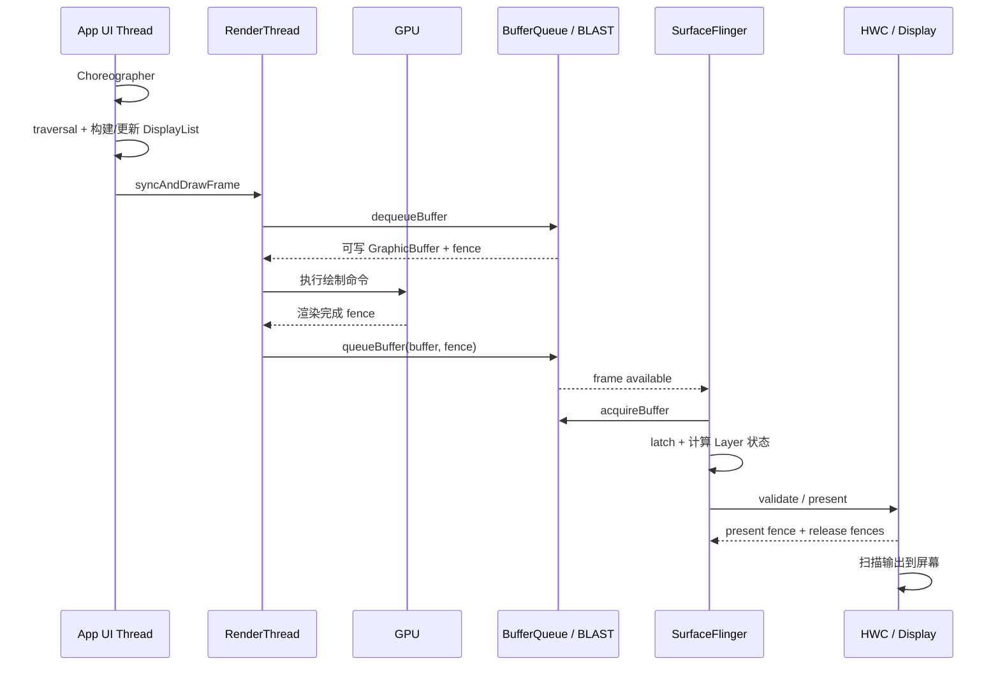

这张图最重要的结论是：

> App 生产的是“某个 Layer 的一张内容缓冲区”；SurfaceFlinger 负责把许多 Layer 组合成“这一时刻的屏幕”。

---

## 2. 第一组最容易混淆的词

| 名称 | 所在侧 | 核心作用 | 可以怎样记 |
|---|---|---|---|
| `Surface` | App/Native 客户端 | 面向生产者的绘图目标，内部连接 `IGraphicBufferProducer` | 往哪里画 |
| `SurfaceControl` | 客户端控制侧 | 持有远端 Layer 的控制句柄，提交位置、层级、裁剪、透明度、buffer 等事务 | 怎样摆放与控制 |
| `Layer` | SurfaceFlinger 进程 | 合成器管理的图层节点 | SF 眼中的一层 |
| `GraphicBuffer` | 跨进程共享的图形内存 | 保存一帧像素，通常由 gralloc 分配 | 真正装像素的画布 |
| `BufferQueue` | Producer 与 Consumer 之间 | 管理一组 buffer slot 的所有权和状态流转 | 周转画布的队列 |

### 一个简化类比

```text
GraphicBuffer  = 一张可反复使用的画布
BufferQueue    = 画布周转架
Surface        = 画家领取和归还画布的窗口
SurfaceControl = 告诉展厅这幅画放哪、盖住谁、透明多少的遥控器
Layer          = 展厅中的图层节点
SurfaceFlinger = 把许多图层排好后送去显示的人
```

类比只用于入门。实际的 `GraphicBuffer` 不一定经过 CPU，也不一定真的复制像素；它通常通过共享的底层 buffer handle 被 GPU、SurfaceFlinger 和 HWC 使用。

### 必须避免的错误

- `Surface` 不是 SurfaceFlinger 本身。
- `SurfaceControl` 不是用来执行 View `draw()` 的 Canvas。
- Java `Surface` 也不是一个永久固定的 bitmap。
- 一个 Activity Window 通常有主内容 Layer，但系统还可能创建容器层、动画层、背景层、`SurfaceView` 子层等，不能死记“一窗口严格等于一 Layer”。

---

## 3. 两种工作：绘制与合成

### 绘制 rendering

绘制回答：

> 这个 App 窗口自己的 buffer 里，每个像素应该是什么？

例如 TextView、图片、圆角、阴影最终被记录或栅格化到 App 的目标 buffer。

主要参与者：

- UI Thread：遍历 View 树并更新 DisplayList。
- RenderThread：组织硬件渲染工作。
- Skia / HWUI / GPU：真正执行栅格化和渲染命令。

### 合成 composition

合成回答：

> 状态栏、桌面、当前 App、导航栏、弹窗等 Layer 按 Z 轴、透明度、裁剪和变换叠起来后，屏幕应该是什么？

主要参与者：

- SurfaceFlinger。
- CompositionEngine / RenderEngine。
- Hardware Composer HAL 与显示硬件。

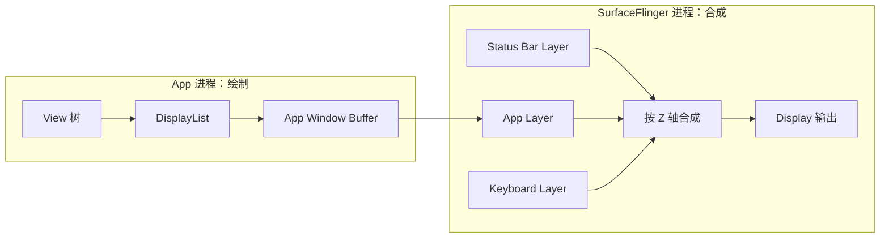

一句话检查：

> `View.draw()` 解决窗口内部画什么；SurfaceFlinger 解决整块屏幕如何叠。

---

## 4. 从 ViewRootImpl 进入 ThreadedRenderer

源码：

```text
frameworks/base/core/java/android/view/ViewRootImpl.java
```

`performDraw()` 最终调用 `draw(fullRedrawNeeded)`。硬件加速路径的核心是：

```java
mAttachInfo.mThreadedRenderer.draw(
        mView, mAttachInfo, this);
```

这里的 `mView` 一般是 DecorView。不要把这行理解成“UI Thread 已经把像素画完了”。更准确地说，它会更新根 RenderNode 的 DisplayList，并把一帧交给 HWUI/RenderThread 管线。

源码：

```text
frameworks/base/core/java/android/view/ThreadedRenderer.java
```

核心结构可简化为：

```java
public void draw(View view, AttachInfo attachInfo,
        DrawCallbacks callbacks) {
    updateRootDisplayList(view, callbacks);
    int syncResult = syncAndDrawFrame(
            choreographer.mFrameInfo);
    // 根据结果处理是否丢失 Surface、是否需要再次 draw 等
}
```

### DisplayList 是什么

DisplayList 可以理解为一组可复用的绘制指令：

```text
“画这个文本”
“在这里画图片”
“裁剪到这个矩形”
“应用这个 transform”
```

它不是最终屏幕截图。View 没有变化时，一些 RenderNode 的指令可以复用，避免每帧重新运行所有 Java `onDraw()`。

### UI Thread 和 RenderThread 的边界

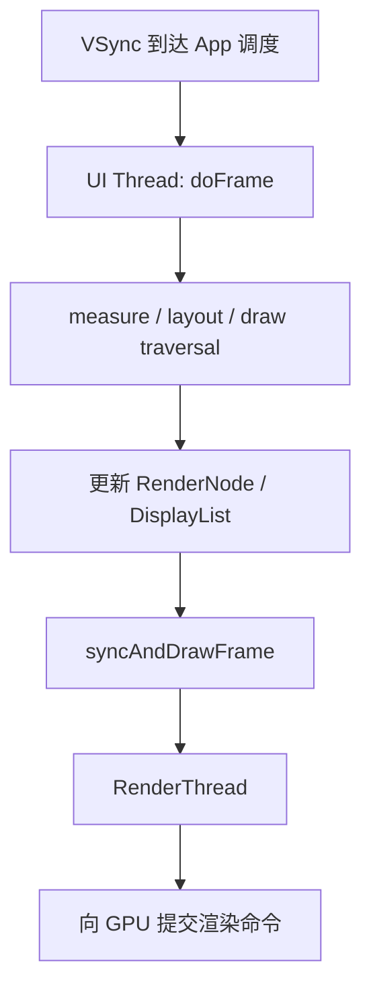

注意：RenderThread 能减少部分渲染工作对 UI Thread 的占用，但 UI Thread 卡在 measure、layout、业务逻辑或 DisplayList 构建时，仍然会掉帧。

---

## 5. Java 怎样进入 Native HWUI

`ThreadedRenderer` 的父类 `HardwareRenderer` 最终通过 Native 方法进入 HWUI。Native 代理入口可沿以下目录追踪：

```text
frameworks/base/core/jni/
frameworks/base/libs/hwui/
frameworks/base/libs/hwui/renderthread/RenderProxy.cpp
frameworks/base/libs/hwui/renderthread/CanvasContext.cpp
```

阅读时不要一开始钻进所有 Skia、OpenGL/Vulkan 细节。先抓住三层：

```text
Java HardwareRenderer / ThreadedRenderer
 → JNI / RenderProxy
 → RenderThread 上的 CanvasContext
```

`CanvasContext` 管理一次渲染所需的重要状态，包括目标 Surface、swap 行为、帧信息和 RenderPipeline。

底层后端可能是 OpenGL ES，也可能是 Vulkan：

```text
frameworks/base/libs/hwui/renderthread/EglManager.cpp
frameworks/base/libs/hwui/renderthread/VulkanSurface.cpp
```

核心概念不因后端改变：取得可写 buffer，执行渲染，提交完成同步对象，再把 buffer 交还给图形队列。

---

## 6. Surface 到底提供了什么

Native `Surface` 源码：

```text
frameworks/native/libs/gui/Surface.cpp
frameworks/native/include/gui/Surface.h
```

`Surface` 实现了 `ANativeWindow` 这一生产者接口。EGL、Vulkan、CPU Canvas 等可以把它当作输出目标。

它内部最关键的成员之一是：

```text
sp<IGraphicBufferProducer> mGraphicBufferProducer
```

因此可先建立这个等式：

```text
Surface ≈ 包装 IGraphicBufferProducer 的 ANativeWindow
```

这个等式是帮助理解，不代表类定义完全只有这一项。

---

## 7. BufferQueue 不是普通 FIFO 容器

源码：

```text
frameworks/native/libs/gui/BufferQueue.cpp
frameworks/native/libs/gui/BufferQueueCore.cpp
frameworks/native/libs/gui/BufferQueueProducer.cpp
frameworks/native/libs/gui/BufferQueueConsumer.cpp
```

创建代码非常能说明结构：

```cpp
sp<BufferQueueCore> core(new BufferQueueCore());
sp<IGraphicBufferProducer> producer(
        new BufferQueueProducer(core,
                consumerIsSurfaceFlinger));
sp<IGraphicBufferConsumer> consumer(
        new BufferQueueConsumer(core));
```

Producer 和 Consumer 共享一个 `BufferQueueCore` 状态中心。

### slot 是什么

BufferQueue 管理固定上限的一组 slot。slot 是编号位置，某个 slot 可以关联一个 GraphicBuffer。

要区分：

```text
slot：队列中的编号/记录位置
GraphicBuffer：slot 当前引用的实际图形缓冲区
BufferItem：某次排队帧携带的 buffer 元信息
```

### 常见状态流转

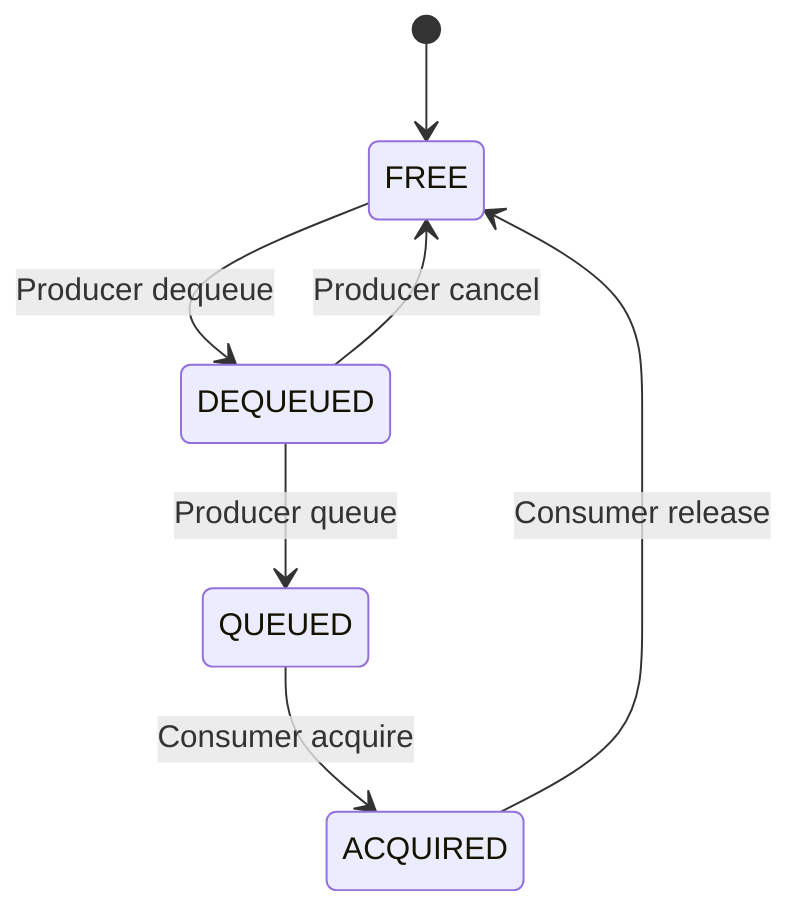

真实实现还有共享模式、attached buffer、stale slot 等细节，但初学阶段先牢牢记住所有权变化。

### 为什么不能说 BufferQueue 永远是三缓冲

很多显示路径常见 triple buffering，它有助于让 Producer、Consumer、显示硬件并行。但实际可用 buffer 数量与最大 dequeue 数、最小未获取数、异步模式、共享模式和设备策略有关。

因此正确说法是：

> BufferQueue 管理多个 buffer slot；普通 UI 场景经常呈现双缓冲或三缓冲式并行效果，但不能把“永远恰好三个 buffer”写成系统定律。

---

## 8. 一帧的 Producer 生命周期

### 第一步：dequeueBuffer

`Surface::dequeueBuffer()`：

```cpp
status_t result = mGraphicBufferProducer->dequeueBuffer(
        &buf, &fence, reqWidth, reqHeight,
        reqFormat, reqUsage, &mBufferAge, ...);
```

含义：

1. 向 BufferQueue 申请一个可由 Producer 写入的 slot。
2. 得到 slot 编号。
3. 必要时通过 `requestBuffer()` 取得或重新分配 GraphicBuffer。
4. 得到一个 fence，告诉 Producer 何时可以安全覆盖该 buffer。

如果没有可用 buffer，`dequeueBuffer()` 可能等待。这就是消费端或显示端背压向生产端传播的一种方式。

### 第二步：render

RenderThread/GPU 把 DisplayList 对应内容画进 GraphicBuffer。

这通常不是“CPU 把整张 bitmap 填一遍”。GPU 命令异步执行，因此提交函数返回时，GPU 可能仍在工作。

### 第三步：queueBuffer

`Surface::queueBuffer()` 构造 `QueueBufferInput`：

```cpp
QueueBufferInput input(
        timestamp,
        isAutoTimestamp,
        dataSpace,
        crop,
        scalingMode,
        transform,
        fence,
        stickyTransform,
        enableFrameTimestamps);
```

随后交给 `IGraphicBufferProducer::queueBuffer()`。除 buffer 外，一帧还带有：

- 时间戳。
- crop。
- transform。
- dataspace。
- surface damage。
- GPU 完成写入的 fence。

`queueBuffer()` 的准确语义是：

> Producer 声明这张 buffer 已提交给队列；不代表它已被 SurfaceFlinger 获取，更不代表已经亮在屏幕上。

---

## 9. Consumer 生命周期

对于普通 App 窗口，最终负责屏幕合成的一侧是 SurfaceFlinger。概念流程为：

```text
onFrameAvailable
 → 在合适的 SF 合成周期检查新帧
 → acquireBuffer
 → 等待 acquire fence
 → latch 到 Layer
 → 参与合成
 → 显示端使用完成
 → releaseBuffer
```

### acquire 和 latch 的区别

- acquire：Consumer 从队列取得某个 BufferItem 的使用权。
- latch：SurfaceFlinger 把取得的新 buffer 设为该 Layer 当前参与合成的内容，并同步应用相关状态。

初学时两词常被放在一起，但它们不是同一个抽象层级。

### 新帧为什么可能没显示

- 来得太晚，错过本次 latch 截止点。
- 被更新帧替代或丢弃。
- Layer 被遮挡、隐藏或透明度为 0。
- 窗口事务尚未与 buffer 状态正确匹配。
- 显示调度、背压或 fence 尚未满足。

所以必须把“App 画完”“buffer 入队”“SF latch”“硬件 present”看成不同时间点。

---

## 10. Android 11 的 BLASTBufferQueue

本工程是 Android 11。`ViewRootImpl` 中能看到：

```text
android.graphics.BLASTBufferQueue
mBlastBufferQueue
```

Native 实现位于：

```text
frameworks/native/libs/gui/BLASTBufferQueue.cpp
```

构造时仍会创建 BufferQueue：

```cpp
BufferQueue::createBufferQueue(
        &mProducer, &mConsumer);
```

这说明 BLAST 不是“不要 BufferQueue”。它在客户端侧消费 BufferItem，并把 buffer 与 `SurfaceControl.Transaction` 更紧密地绑定提交。

### 它要缓解什么问题

窗口 resize、旋转、位置和裁剪变化时，存在两类状态：

```text
内容状态：这一帧 buffer 是多大、画了什么
Layer 状态：位置、裁剪、缩放、层级等
```

如果两类状态在不同时间生效，就可能短暂出现拉伸、错位或旧尺寸内容。BLAST 的关键价值是让 buffer 更新更好地与 SurfaceControl transaction 协调，增强原子性和可预测性。

### Android 11 下的更精确心智模型

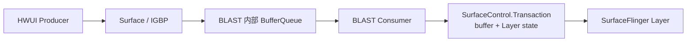

这里再明确一次“谁消费谁”，否则最容易读乱：

| 观察范围 | Producer | Consumer | 结果去向 |
|---|---|---|---|
| BLAST 内部 BufferQueue | HWUI 通过 `Surface` 写入 | `BLASTBufferItemConsumer` | 取得 BufferItem |
| SurfaceControl transaction | App/BLAST 组装事务 | SurfaceFlinger 接收事务 | buffer 成为 SF Layer 状态的一部分 |
| 屏幕输出 | SurfaceFlinger/CompositionEngine 准备 Layer | HWC/显示设备使用 | present 到屏幕 |

所以“SurfaceFlinger 是 App Window 的 Consumer”作为系统级概括仍然有用；但追 Android 11 具体代码时，要知道 BLAST 先消费自己的内部 BufferQueue，再通过事务把 buffer 交给 SurfaceFlinger 的 Layer。

### 两层模型怎样同时成立

- 学 BufferQueue 的 dequeue/queue/acquire/release，是所有权与同步的基础。
- 看 Android 11 App Window 时，再加上 BLAST 对 buffer 与事务的协调。
- 不要简单说“Android 11 的 App buffer 永远由 SF 直接作为经典 BufferQueue Consumer 拉取”，因为 BLAST 路径多了一层客户端适配。
- 也不要说“有了 BLAST 就没有 Producer/Consumer”，它内部依然明确创建 Producer 和 Consumer。

---

## 11. SurfaceControl 怎样对应到 SurfaceFlinger Layer

Native 客户端入口：

```text
frameworks/native/libs/gui/SurfaceComposerClient.cpp
frameworks/native/libs/gui/SurfaceControl.cpp
```

`SurfaceComposerClient::createSurface()` 经 Binder 请求 SurfaceFlinger 客户端接口创建图层。

SurfaceFlinger 入口：

```text
frameworks/native/services/surfaceflinger/Client.cpp
frameworks/native/services/surfaceflinger/SurfaceFlinger.cpp
```

`Client::createSurface()` 转到：

```cpp
return mFlinger->createLayer(...);
```

`SurfaceFlinger::createLayer()` 根据 flag 创建不同类型：

```cpp
case eFXSurfaceBufferQueue:
    createBufferQueueLayer(...);
    break;
case eFXSurfaceBufferState:
    createBufferStateLayer(...);
    break;
case eFXSurfaceEffect:
    createEffectLayer(...);
    break;
case eFXSurfaceContainer:
    createContainerLayer(...);
    break;
```

返回给客户端的重要内容包括 Layer handle；某些路径还返回 GraphicBufferProducer。客户端据此构造 `SurfaceControl`，必要时从它创建 `Surface`。

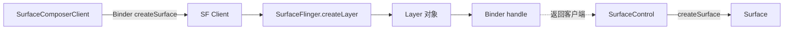

### SurfaceControl.Transaction

客户端不会为每个属性都要求 SurfaceFlinger 立刻合成。它通常积累事务：

```text
setPosition
setLayer / setRelativeLayer
setAlpha
setCrop
show / hide
setBuffer
reparent
```

调用 `apply()` 后把一组变更交给 SurfaceFlinger，使相关状态尽量原子地生效。

---

## 12. SurfaceFlinger 在哪个进程、哪个线程

SurfaceFlinger 是独立 native 系统进程，不在 App，也不在 `system_server`。

```text
App process      : View / HWUI / Surface producer
system_server    : WMS 管理窗口策略、WindowState、焦点、布局
surfaceflinger   : 管理 Layer、调度合成、连接显示硬件
```

这三个角色必须分开：

- WMS 决定窗口应在哪里、是否可见、层级与策略。
- App 负责生产自己内容的 buffer。
- SurfaceFlinger 接收 Layer 状态和 buffer，完成屏幕合成。

SurfaceFlinger 主消息入口之一：

```cpp
void SurfaceFlinger::onMessageReceived(
        int32_t what, nsecs_t expectedVSyncTime) {
    switch (what) {
        case MessageQueue::INVALIDATE:
            onMessageInvalidate(expectedVSyncTime);
            break;
        case MessageQueue::REFRESH:
            onMessageRefresh();
            break;
    }
}
```

不要据此死记某个函数等于全部合成流程。Android 图形调度代码会随版本重构，阅读主线应是：

```text
接收事务/帧可用信号
 → VSync 驱动调度
 → latch 和更新 Layer 状态
 → 选择合成策略
 → compose
 → present
```

---

## 13. Layer 树与 Z 轴

SurfaceFlinger 管理的不是一张平面列表，而是有父子关系、相对层级和变换继承的 Layer 树。

Layer 常见状态包括：

- buffer。
- position 与 transform。
- crop。
- alpha。
- z-order 或 relative layer。
- parent/child 关系。
- visible region、damage region。
- dataspace 和颜色变换。

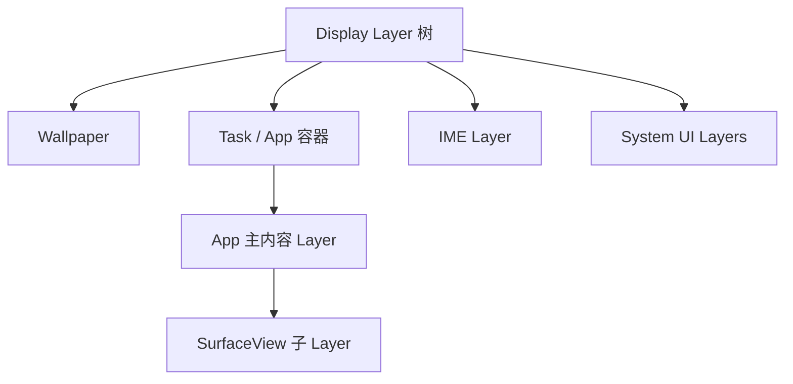

图是概念示意，不代表某台设备实际 dumpsys 输出的固定结构。

SurfaceFlinger 会根据当前状态计算每个显示设备上的可见 Layer、遮挡区域和输出几何。

---

## 14. App VSync 与 SurfaceFlinger VSync

VSync 是垂直同步节奏的基础，但“App 收到的帧回调”和“SurfaceFlinger 开始合成”不能当成同一个回调。

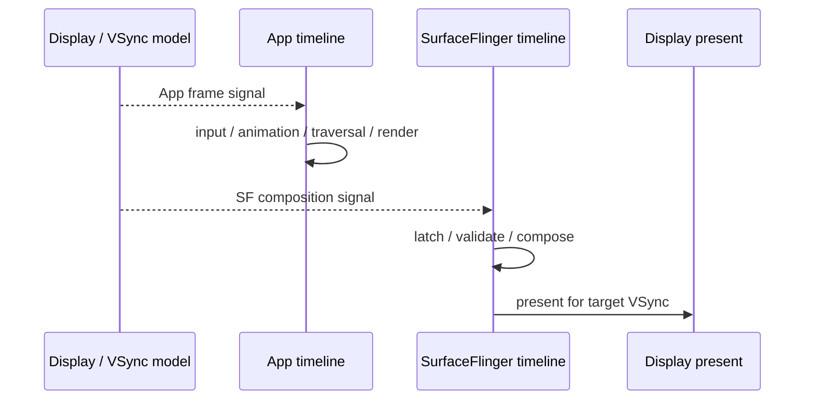

两条时间线使用同一显示刷新节奏和调度模型，但有各自 deadline/offset。目的之一是让 App 先生产 buffer，SurfaceFlinger 稍后拿到它并赶上目标 present。

### 60 Hz 下的 16.67 ms 怎样理解

60 Hz 的周期约为：

```text
1000 ms / 60 ≈ 16.67 ms
```

这不等于“App 可以独占完整 16.67 ms，然后 SF 再额外花时间”。App 绘制、GPU 执行、SF 合成和显示提交是一条流水线，各阶段有自己的预算与重叠。

### 三种常见掉帧原因

1. App late：UI/RenderThread/GPU 没按截止点交出新 buffer。
2. SF late：SF latch、验证或合成未赶上 present。
3. Display/HWC backlog：上一帧仍未完成，背压传播。

---

## 15. Fence：异步硬件之间的交接凭证

GPU 和显示硬件异步工作，不能只靠“函数返回了”判断 buffer 是否安全。Fence 表示某项工作完成的时间点。

### acquire fence

从使用方角度说：

> 在读取或写入这张 buffer 前，先等这个 fence signal。

Producer queue 一张 GPU 仍在写的 buffer 时，会把渲染完成 fence 一起提交；Consumer 把它当作 acquire fence，在读取前等待。

### release fence

Consumer 使用完成后返回 release fence，告诉 Producer：

> 等这个 fence signal 后，才可以再次覆盖这张 buffer。

下一次 dequeue 到相应 buffer 时，Producer 会收到并等待这一同步条件。

### present fence

present fence 表示该显示提交何时完成呈现，可用于帧时间统计、背压和后续同步。

用“禁止动作”再检查一次，比背术语更可靠：

| fence | signal 前必须等待的一方 | signal 前不能做的事 |
|---|---|---|
| Producer dequeue 得到的 fence | 准备重写 buffer 的 Producer | 不能覆盖仍被上一消费者使用的内容 |
| buffer 入队携带的 acquire fence | 准备读取新 buffer 的 Consumer | 不能读取 GPU 尚未写完的内容 |
| Layer release fence | 准备复用该 buffer 的 Producer | 不能提前重新写入 |
| display present fence | 关心本次显示完成状态的调度/统计逻辑 | 不能把未完成的 present 当成已完成 |

这里的命名取决于“站在谁的接口上看”。例如 Producer 上一轮收到的 release 同步条件，在下一次取得 buffer 时会成为它开始写之前要等待的条件。源码变量名不总能替代所有权分析。

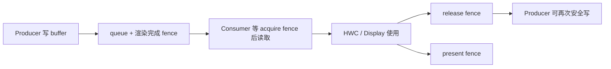

### 名字为什么容易混

同一个 fence 从不同对象视角可能被描述为“上一使用者的 release”或“下一使用者的 acquire”。阅读代码时不要只看名词，必须问：

1. 谁正在交出 buffer？
2. 谁准备接手？
3. fence signal 前谁不能做什么？

---

## 16. 合成策略：GPU 与 HWC 可以混合

SurfaceFlinger 的 CompositionEngine 为每个 Output/Layer 准备状态，并与 Hardware Composer 验证合成策略。

源码目录：

```text
frameworks/native/services/surfaceflinger/CompositionEngine/
frameworks/native/services/surfaceflinger/DisplayHardware/HWComposer.cpp
frameworks/native/services/surfaceflinger/DisplayHardware/ComposerHal.cpp
```

### Client composition

由 SurfaceFlinger 的 RenderEngine 使用 GPU 把若干 Layer 合成到一个 client target buffer，再把这个结果交给 HWC。

### Device composition

HWC/显示硬件直接处理某些 Layer，例如 overlay plane。这样可减少 GPU 合成开销与内存带宽。

### 混合合成

一帧里完全可能：

```text
Layer A、B → GPU client composition → client target
Layer C     → HWC device composition
client target + Layer C → HWC present
```

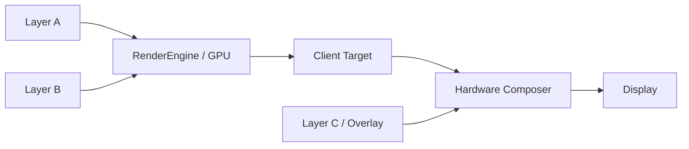

因此以下两句话都不准确：

- “SurfaceFlinger 总是用 GPU 合成所有 Layer。”
- “有 HWC 后 SurfaceFlinger 就完全不参与合成。”

SurfaceFlinger 仍负责全局 Layer 状态、可见性、调度和策略协商；实际像素组合可由 GPU、HWC 或两者共同完成。

---

## 17. validate、compose、present

可以把一帧输出粗分为：

### validate

把 Layer 需求交给 HWC，确认每层建议使用 client composition 还是 device composition，并处理策略变化。

### compose

若需要 client composition，RenderEngine 把相应 Layer 合成进 client target。

### present

HWC 提交最终显示配置，并返回 present fence 与各 Layer 的 release fence。

在 `CompositionEngine/src/Output.cpp` 中可以看到：

```cpp
auto frame = presentAndGetFrameFences();
```

随后代码取得各 HWC Layer 的 release fence，并通过 `onLayerDisplayed()` 继续向 Layer/Buffer 生命周期传播。

这再次说明：present 不只是“调用显示接口”，还承担 buffer 何时可释放的同步闭环。

---

## 18. Buffer 为什么通常不需要复制给 SurfaceFlinger

GraphicBuffer 背后通过 gralloc 分配，跨进程传递的通常是可共享的 buffer handle 与同步信息，而不是每帧把几 MB 像素经 Binder 拷贝一遍。

概念上：

```text
Binder 传控制信息、句柄、元数据
共享图形内存承载大量像素
Fence 协调异步读写时序
```

这也是 Android 图形系统能工作的关键。如果 1080p RGBA 每帧都在 App 与 SF 间做普通内存拷贝，带宽和延迟代价会非常高。

“零拷贝”也不要绝对化：某些格式转换、GPU client composition、截图、虚拟显示等路径可能产生额外目标 buffer 或拷贝。准确说法是系统设计尽量共享和复用图形缓冲区，避免不必要的 CPU 像素复制。

---

## 19. 一帧跨越的边界

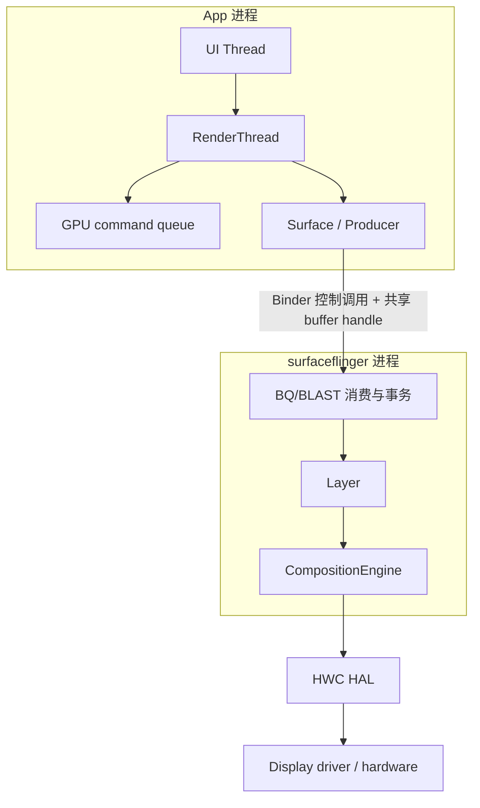

需要逐次标注四种边界：

1. Java → Native：ThreadedRenderer/HWUI。
2. UI Thread → RenderThread：渲染任务同步与提交。
3. App → SurfaceFlinger：Binder 事务与共享图形资源。
4. Framework native → HAL/driver：HWC 与显示设备。

GPU 命令的提交和执行也不是同一个时间点。

---

## 20. 把 WMS 加回完整图中

上一章的 WMS 与本章的 SF 不是上下级绘图关系，而是职责互补。

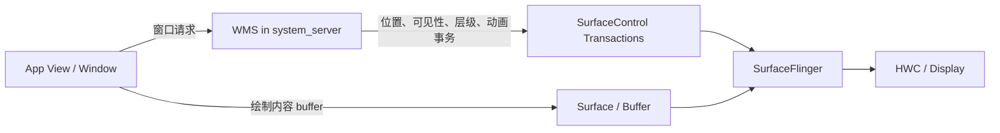

理解 resize 时尤其有用：

- WMS 算窗口新边界与策略。
- App 根据新尺寸重新 measure/layout/draw。
- App 生产新尺寸 buffer。
- SurfaceControl transaction 携带 Layer 几何状态。
- BLAST 帮助 buffer 与 Layer transaction 协调生效。
- SurfaceFlinger 在合适帧合成并 present。

---

## 21. 一次完整调用链的“可背诵版”

```text
1. Choreographer 在 App 帧信号下调用 doFrame。
2. ViewRootImpl 执行 traversal；需要时 measure、layout、draw。
3. ThreadedRenderer 更新根 RenderNode/DisplayList。
4. syncAndDrawFrame 把工作交给 Native HWUI/RenderThread。
5. RenderThread 通过 Surface dequeue 一个可写 GraphicBuffer。
6. GPU 执行绘制命令，并生成渲染完成 fence。
7. Producer queueBuffer，把 buffer、元数据和 fence 提交出去。
8. Android 11 BLAST 路径协调 BufferItem 与 SurfaceControl transaction。
9. SurfaceFlinger 在自己的合成调度点更新事务、latch 可用 buffer。
10. CompositionEngine 计算可见 Layer 与合成策略。
11. 需要 client composition 的 Layer 先由 RenderEngine/GPU 合成。
12. HWC 接收 client target 与可设备合成的 Layer，validate/present。
13. 显示硬件在目标刷新周期扫描输出。
14. present/release fence 回传，buffer 最终可被下一帧复用。
```

如果只能记一条，就记：

```text
View → DisplayList → GPU → GraphicBuffer
 → BufferQueue/BLAST → Layer
 → SurfaceFlinger → GPU/HWC → Display
```

---

## 22. 源码阅读路线

不要从 SurfaceFlinger.cpp 第一行读到最后。按问题驱动：

### 路线 A：App 怎样发出一帧

```text
ViewRootImpl.performDraw / draw
 → ThreadedRenderer.draw
 → updateRootDisplayList
 → syncAndDrawFrame
 → HardwareRenderer native 方法
 → RenderProxy
 → CanvasContext
```

搜索：

```bash
rg -n "performDraw|syncAndDrawFrame" \
  frameworks/base/core/java/android/view
```

### 路线 B：Surface 怎样周转 buffer

```text
Surface.dequeueBuffer
 → IGraphicBufferProducer.dequeueBuffer
 → BufferQueueProducer
 → Surface.queueBuffer
 → IGraphicBufferProducer.queueBuffer
```

搜索：

```bash
rg -n "Surface::dequeueBuffer|Surface::queueBuffer" \
  frameworks/native/libs/gui/Surface.cpp
```

### 路线 C：Android 11 BLAST

```text
ViewRootImpl.mBlastBufferQueue
 → Java BLASTBufferQueue
 → native BLASTBufferQueue
 → BufferQueue + SurfaceControl transaction
```

### 路线 D：Layer 怎样创建

```text
SurfaceComposerClient.createSurface
 → ISurfaceComposerClient
 → Client.createSurface
 → SurfaceFlinger.createLayer
 → BufferStateLayer / BufferQueueLayer / EffectLayer / ContainerLayer
```

### 路线 E：怎样输出屏幕

```text
SurfaceFlinger message / scheduler
 → update/latch Layer state
 → CompositionEngine Output
 → chooseCompositionStrategy
 → RenderEngine client composition（按需）
 → HWComposer validate/present
 → fences
```

---

## 23. 调试工具怎样对应概念

### dumpsys SurfaceFlinger

用于观察 Layer、Display、buffer、合成等状态：

```bash
adb shell dumpsys SurfaceFlinger
adb shell dumpsys SurfaceFlinger --list
```

不同版本支持的子参数可能不同，先运行 `adb shell dumpsys SurfaceFlinger --help`。

### dumpsys window

用于观察 WMS 的 WindowState、焦点、窗口层级和布局：

```bash
adb shell dumpsys window windows
```

将两者对照：WMS 视角是“窗口管理”，SF 视角是“Layer 与合成”。名称往往能关联，但对象不是同一个。

### Perfetto

关注轨道：

- Choreographer / UI Thread。
- RenderThread。
- SurfaceFlinger。
- FrameTimeline。
- GPU/HWC/fence（取决于设备与配置）。

排查掉帧时先问“晚在哪一段”，不要看到 `draw` 慢就默认所有问题都在 Java View。

### 开发者选项

- Profile HWUI rendering：观察渲染帧耗时。
- Show surface updates：辅助观察 Surface 更新。
- Disable HW overlays：仅用于对比诊断，会强制更多 GPU 合成，不应当作修复方案。

---

## 24. 高频误区校正

### 误区 1：`ViewRootImpl.draw()` 返回后已经上屏

错误。它只完成 App 侧一帧提交的重要阶段；GPU、queue、latch、compose、present 可能仍未完成。

### 误区 2：Surface 就是一块 buffer

错误。Surface 是生产接口，背后管理和周转多块 GraphicBuffer。

### 误区 3：BufferQueue 就是 Java Queue

错误。它管理图形 buffer slot、所有权、同步 fence、跨进程接口与元数据。

### 误区 4：SurfaceControl 和 Surface 是同一对象

错误。一个偏 Layer 控制，一个偏内容生产。两者可能关联同一个远端 Layer，但职责不同。

### 误区 5：WMS 负责把像素合成到屏幕

错误。WMS 管窗口策略和状态；SurfaceFlinger 管 Layer 合成与显示输出。

### 误区 6：SurfaceFlinger 会运行 App 的 View.onDraw

错误。`onDraw()` 在 App 进程的 View/HWUI 路径发生；SF 只看到 buffer 和 Layer 状态，不理解 TextView/Button 语义。

### 误区 7：GPU 负责全部显示工作

错误。GPU 可绘制 App buffer，也可做 client composition；HWC/显示硬件可能直接合成某些 Layer。

### 误区 8：queueBuffer 就等于显示成功

错误。它只是进入可供消费的阶段。

### 误区 9：VSync 只有一个回调，App 与 SF 同时开始

错误。它们有相关但不同的调度时间线和截止点。

### 误区 10：BLAST 取代了 BufferQueue

错误。Android 11 的 BLAST 实现内部仍创建 BufferQueue，重点是协调 buffer 与 SurfaceControl transaction。

---

## 25. 用一个 resize 场景检查理解

假设 Activity 从竖屏旋转到横屏：

```text
1. Display/配置发生变化。
2. WMS 重新计算窗口边界和 Layer 几何状态。
3. App 收到配置/尺寸变化，ViewRootImpl 重新 traversal。
4. View 树按新宽高 measure/layout。
5. HWUI 请求适合新尺寸的 buffer 并绘制。
6. 新 buffer 与 crop/position/transform 等事务需要在合理帧同步。
7. BLAST 协调 buffer 和 SurfaceControl transaction。
8. SurfaceFlinger latch 一致状态并合成。
9. HWC present 到显示器。
```

如果第 6 步缺乏同步，可能看到一帧旧 buffer 被按新几何拉伸，或者新 buffer 配旧 crop。BLAST 正是在这类窗口几何变化场景中很重要。

---

## 26. 卡顿定位的因果树

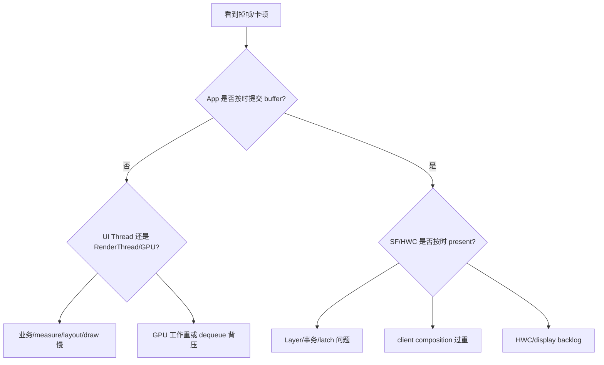

这棵树说明为什么只看主线程 CPU 火焰图不够。你需要结合 FrameTimeline、RenderThread、SurfaceFlinger 和 fence 信息判断瓶颈。

---

## 27. 本章源码清单

### Java Framework

```text
frameworks/base/core/java/android/view/ViewRootImpl.java
frameworks/base/core/java/android/view/ThreadedRenderer.java
frameworks/base/graphics/java/android/graphics/HardwareRenderer.java
frameworks/base/graphics/java/android/graphics/BLASTBufferQueue.java
frameworks/base/core/java/android/view/Surface.java
frameworks/base/core/java/android/view/SurfaceControl.java
```

### Native GUI/HWUI

```text
frameworks/base/libs/hwui/renderthread/RenderProxy.cpp
frameworks/base/libs/hwui/renderthread/CanvasContext.cpp
frameworks/base/libs/hwui/renderthread/EglManager.cpp
frameworks/base/libs/hwui/renderthread/VulkanSurface.cpp
frameworks/native/libs/gui/Surface.cpp
frameworks/native/libs/gui/BufferQueue.cpp
frameworks/native/libs/gui/BufferQueueProducer.cpp
frameworks/native/libs/gui/BufferQueueConsumer.cpp
frameworks/native/libs/gui/BLASTBufferQueue.cpp
frameworks/native/libs/gui/SurfaceComposerClient.cpp
frameworks/native/libs/gui/SurfaceControl.cpp
```

### SurfaceFlinger

```text
frameworks/native/services/surfaceflinger/SurfaceFlinger.cpp
frameworks/native/services/surfaceflinger/Layer.cpp
frameworks/native/services/surfaceflinger/BufferQueueLayer.cpp
frameworks/native/services/surfaceflinger/BufferStateLayer.cpp
frameworks/native/services/surfaceflinger/CompositionEngine/
frameworks/native/services/surfaceflinger/DisplayHardware/HWComposer.cpp
frameworks/native/services/surfaceflinger/DisplayHardware/ComposerHal.cpp
```

---

## 28. 阅读练习

### 练习一：标出线程边界

从 `ViewRootImpl.performDraw()` 追到 `ThreadedRenderer.draw()`，在笔记中标注：

```text
UI Thread：
RenderThread：
GPU 异步执行：
```

完成标准：不再把 `syncAndDrawFrame()` 后的所有工作都说成 UI Thread 执行。

### 练习二：亲手读 dequeue/queue

在 `Surface.cpp` 找到：

- `dequeueBuffer()`。
- `requestBuffer()` 触发条件。
- `queueBuffer()` 构造的 `QueueBufferInput`。

回答：为什么 queue 时除了 buffer 还需要 crop、timestamp、transform、dataspace 和 fence？

### 练习三：画 BufferQueue 状态机

不看本章，自己画：

```text
FREE → DEQUEUED → QUEUED → ACQUIRED → FREE
```

在每条箭头旁写清是 Producer 还是 Consumer 操作。

### 练习四：验证 BLAST 内部仍有 BufferQueue

打开 `BLASTBufferQueue.cpp`，找到构造函数中的 `BufferQueue::createBufferQueue()`，并解释：

1. 谁是 BLAST 内部 Producer？
2. 谁监听 frame available？
3. buffer 最终怎样进入 SurfaceControl transaction？

第三问需要继续顺着 `onFrameAvailable()` 和 transaction 相关调用读，不要求一次读懂全部回调。

### 练习五：追 Layer 创建

从 `SurfaceComposerClient::createSurface()` 追到 `SurfaceFlinger::createLayer()`，记录每次进程边界与返回对象。

### 练习六：观察真机 Layer

打开一个简单 Activity，运行：

```bash
adb shell dumpsys SurfaceFlinger --list
adb shell dumpsys window windows
```

尝试把 Activity Window 名称和 SurfaceFlinger Layer 名称对应起来。记录对应不上的项，并判断它可能是容器、系统 UI、动画层还是子 Surface。

### 练习七：解释三类 fence

不使用“就是同步用的”这种笼统回答。分别写清：

```text
acquire fence signal 前，谁不能做什么？
release fence signal 前，谁不能做什么？
present fence 描述哪次提交的完成？
```

### 练习八：分析一帧掉帧

用 Perfetto 录制一次快速滚动，选一帧 jank，判断主要属于：

- App deadline miss。
- SurfaceFlinger deadline miss。
- GPU/HWC backlog。

证据必须来自时间轨道，不凭感觉。

---

## 29. 自测题

1. Surface、SurfaceControl、Layer 分别是什么？
2. `queueBuffer()` 返回为什么不代表上屏？
3. `GraphicBuffer` 和 slot 有什么区别？
4. 谁是普通 App Window 内容的 Producer？谁最终负责屏幕合成？
5. View `draw()` 与 SurfaceFlinger composition 的输入分别是什么？
6. Android 11 BLAST 解决的核心一致性问题是什么？
7. 为什么函数已经返回还需要 fence？
8. client composition 和 device composition 可以同帧存在吗？
9. WMS 与 SurfaceFlinger 的职责怎样配合？
10. 为什么 60 Hz 不能简单理解为 App 独占 16.67 ms？

### 参考答案

1. Surface 是内容生产接口；SurfaceControl 是 Layer 控制句柄；Layer 是 SF 合成树中的节点。
2. 入队后还要等待 acquire/latch/compose/present。
3. slot 是队列记录位置，GraphicBuffer 是实际图形内存对象。
4. 普通硬件加速窗口通常由 App HWUI/RenderThread 生产；SurfaceFlinger 负责全屏合成调度。
5. View draw 输入是 View/RenderNode 绘制内容；SF composition 输入是 buffer 与 Layer 状态。
6. 让 buffer 内容更新与窗口几何等 SurfaceControl transaction 更协调、原子地生效。
7. GPU/HWC 异步执行，函数返回只代表命令已提交，不代表硬件已用完 buffer。
8. 可以，GPU 先产生 client target，HWC 再与 device-composed Layer 一起 present。
9. WMS 决定窗口策略与几何，App 提交内容，SF 应用 Layer 状态并合成。
10. App、GPU、SF、HWC 是重叠流水线，各有 deadline 和预算。

---

## 30. 本章总结

本章把第 11 章的最后一个 `draw()` 向后补成了真正的显示链路：

```text
ViewRootImpl
 → ThreadedRenderer / DisplayList
 → RenderThread / GPU
 → Surface
 → GraphicBuffer
 → BufferQueue / BLAST
 → SurfaceControl transaction
 → SurfaceFlinger Layer
 → CompositionEngine
 → RenderEngine + HWC
 → Display
```

最值得长期保留的五个结论：

1. 绘制一个窗口与合成一块屏幕是两件事。
2. Surface、SurfaceControl、Layer 分别对应内容生产、图层控制、合成节点。
3. BufferQueue 的本质是多块共享图形缓冲区的所有权与同步管理。
4. Android 11 的 BLAST 没有取消 BufferQueue，而是加强 buffer 与 Layer 事务的一致性。
5. 一帧直到 present 才接近“真正显示”，queueBuffer 只是中途交接。

下一章进入 PackageManagerService：从 APK、`AndroidManifest.xml` 和扫描目录开始，追踪包信息怎样进入系统，以及安装、解析和查询怎样工作。
