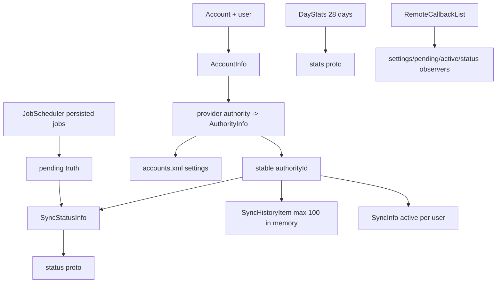
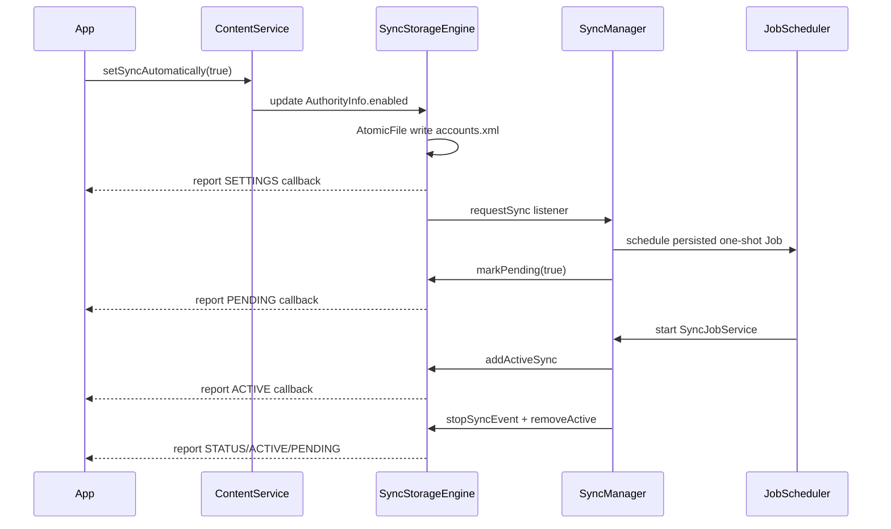

# 120 Android SyncStorageEngine：持久化、状态、历史与监听

> 源码版本：Android 11 / API 30 / `android-11.0.0_r48`  
> 学习方式：macOS 只读源码，不要求编译  
> 前置章节：第 119 章

---

## 1. 本章研究“同步系统记住了什么”

第 119 章看到 SyncManager 负责调度和执行。本章转向它背后的状态仓库 `SyncStorageEngine`：

- account、authority、user 如何变成稳定的 AuthorityInfo？
- master sync、auto sync、syncable 分别存在哪里？
- pending、active、status、history 是不是同一回事？
- `accounts.xml`、`status`、`stats` 各保存什么？
- 为什么 status 读取时主动把 pending 清成 false？
- JobScheduler 和 SyncStorageEngine 谁才是 pending 的权威来源？
- 状态为什么有立即写和延迟写两条路径？
- AtomicFile 能保护到什么程度？
- status observer 如何跨 Binder 分发并按 user 隔离？
- 账户删除、旧格式升级和备份恢复怎样处理？

先记住一句话：

> SyncStorageEngine 是同步设置、汇总状态和诊断历史的索引仓库；它不是 Job 的执行队列，也不是网络同步数据库。

---

## 2. 总体对象图



`authorityId` 是连接设置、状态、历史与 active 信息的内部主键。

---

## 3. 磁盘目录

生产环境使用：

```text
/data/system/sync/
├── accounts.xml
├── status
└── stats
```

三者都通过 `AtomicFile` 管理。旧版本的 `status.bin`、`stats.bin` 可被迁移；更老的 `pending.bin` 会被删除。

macOS 源码学习不需要访问设备 `/data`，只需追构造函数和读写函数。

---

## 4. 三个文件的可靠性分级

源码注释对三者给出不同定位：

| 文件 | 内容 | 丢失后影响 | 写入倾向 |
|---|---|---|---|
| `accounts.xml` | 核心账户/authority 同步设置 | 用户配置丢失，最重要 | 设置变化立即写 |
| `status` | 最近成功失败、总计、今日统计、事件等 | 可重建部分状态，但诊断变差 | 关键变化立即写，普通变化延迟 |
| `stats` | 28 天成功/失败日统计 | 纯诊断信息 | 更低频延迟写 |

这是一种“数据价值决定持久化成本”的设计。

---

## 5. 构造顺序

SyncManager 创建时先初始化 SyncStorageEngine，再注册广播、观察者和线程。构造函数：

```java
readAccountInfoLocked();
readStatusLocked();
readStatisticsLocked();
```

顺序不能颠倒：status 通过 authorityId 引用 AuthorityInfo，必须先有 accounts 映射；读取 status 时，无效
authorityId 会被忽略。

---

## 6. 全局锁是 mAuthorities

`mAuthorities` 既是：

- `SparseArray<AuthorityInfo>` 主索引；
- 同步引擎多个集合的全局锁。

源码大量使用：

```java
synchronized (mAuthorities) { ... }
```

它保护 accounts、authorities、current syncs、status、history 和部分设置的一致视图。

不要把 SparseArray 本身当线程安全容器；安全来自外层约定。

---

## 7. EndPoint 是同步目标

```java
EndPoint(Account account, String provider, int userId)
```

精确 EndPoint 三项都非空；查询或取消规范可以让 account/provider 为 null 表示通配，user 也可为
`USER_ALL`。

`matchesSpec()` 的调用方向值得注意：真实 endpoint 调用 `matchesSpec(spec)`，spec 的 null 字段充当 wildcard。

---

## 8. EndPoint 与 AuthorityInfo 的区别

EndPoint 只是值对象，描述“哪个账户、authority、user”。AuthorityInfo 则是引擎管理的记录：

```text
target EndPoint
ident authorityId
enabled
syncable
backoffTime/backoffDelay
delayUntil
legacy periodicSyncs
```

同一精确 EndPoint 在引擎中对应一个 AuthorityInfo。

---

## 9. 两套索引为何同时存在

```text
mAccounts: AccountAndUser -> AccountInfo -> authority name -> AuthorityInfo
mAuthorities: authorityId -> AuthorityInfo
```

按 API 查询时常从 Account/user/authority 找记录，适合第一套；status/history 只保存整数 authorityId，适合
第二套。

创建或删除 AuthorityInfo 必须同时维护两套索引，否则会出现孤儿状态。

---

## 10. authorityId 怎样分配

新增记录时使用 `mNextAuthorityId++`，并立即要求写 `accounts.xml`。读取旧文件时追踪最大 id，最后：

```java
mNextAuthorityId = max(highestAuthorityId + 1, persistedNextId);
```

这避免重启后复用已有 id，把旧 SyncStatusInfo 错接到新 authority。

它是设备本地内部 ID，不是 Provider manifest 中的稳定公共 ID。

---

## 11. AuthorityInfo 默认值

新建记录默认：

```text
enabled = false
syncable = NOT_INITIALIZED
backoffTime = -1
backoffDelay = -1
```

类中仍保留 `PeriodicSyncAddedListener`；它非空时，新建 AuthorityInfo 的默认初始化会通过它添加
一个默认日周期同步。但 SyncStorageEngine 在 SyncManager 注册 listener **之前**就已读完
`accounts.xml`，所以不要推论为“每次开机读出的旧 AuthorityInfo 都会立即触发这个 listener”。

---

## 12. syncable 不是 boolean

完整状态：

| 值 | 名称 | 含义 |
|---:|---|---|
| -2 | `UNDEFINED` | 用于调用目标筛选等未指定语义 |
| -1 | `NOT_INITIALIZED` | 尚需初始化 |
| 0 | `NOT_SYNCABLE` | 不参与同步 |
| 1 | `SYNCABLE` | 正常可同步 |
| 2 | `SYNCABLE_NOT_INITIALIZED` | 恢复场景中可同步但仍需初始化 |
| 3 | `SYNCABLE_NO_ACCOUNT_ACCESS` | 运行期计算结果：Adapter 缺账户访问 |

持久设置与运行期派生判断不可全部等同为 accounts.xml 中一个值。

---

## 13. enabled 与 syncable 是两道门

`enabled` 对应用户可见的“此账户此 authority 自动同步”开关；`syncable` 更多由 Adapter/开发者状态控制。

普通自动同步通常要求：

```text
master enabled
AND authority enabled
AND authority syncable
```

把 enabled 关掉不会必然把 syncable 改成 0；两者表达不同意图。

---

## 14. master sync 按 user 保存

`mMasterSyncAutomatically` 是 `SparseArray<Boolean>`，每个 Android user 单独保存总开关。

若某 user 没有显式值，返回资源 `config_syncstorageengine_masterSyncAutomatically` 指定的默认值，而不是简单
固定 true/false。

旧 XML 根节点上的 `listen-for-tickles` 兼容 user 0；新格式用每 user 的子元素。

---

## 15. 打开设置会主动请求同步

`setSyncAutomatically(..., true)` 写入 accounts.xml 后，会发起一次同步请求；打开 master sync 也会对该 user
发起宽泛同步。

所以设置变化不仅改变未来 eligibility，还可能立即产生工作。

关闭开关则不在此方法中主动请求；正在运行和已调度任务仍要由 SyncManager 的有效性复检或取消逻辑处理。

---

## 16. accounts.xml 实际写什么

Android 11 写出：

```xml
<accounts version="3" nextAuthorityId="..." offsetInSeconds="...">
  <listenForTickles user="0" enabled="true" />
  <authority
      id="7"
      user="0"
      enabled="true"
      account="..."
      type="..."
      authority="com.example.books"
      syncable="1" />
</accounts>
```

账户名属于敏感信息，因此 dump/log 常使用 safe 表达；文件位于受保护的 system 数据目录。

---

## 17. 一个关键纠错：backoff 没写入 accounts.xml

AuthorityInfo 有 `backoffTime/backoffDelay/delayUntil` 字段，很容易据此推断它们都持久化。

但当前 `writeAccountInfoLocked()` 只写 id、user、enabled、account、type、authority、syncable 等设置，未写
backoff 或 delayUntil。

因此这两个字段主要是当前 system_server 生命周期中的运行调度状态；已安排任务跨重启的执行时机由持久化
JobInfo/JobScheduler 承担。字段存在不等于被某个文件序列化。

---

## 18. 周期同步为何不再以 accounts.xml 为主

读取旧 `accounts.xml` 仍能解析 `<periodicSync>` 与 extras。类中也保留
`restoreAllPeriodicSyncs()`：若有调用者，它会通过 listener 重建周期任务，然后清空
AuthorityInfo 中 legacy 列表并重写 `accounts.xml`。

但对 r48 全树搜索后，该方法在生产 Java 代码中 **只有定义，没有调用点**。所以准确结论是：
本版本保留了“旧 XML 解析 + 可调用的迁移 helper”，但不能宣称当前开机主链会自动调它。
当前周期任务的执行权威仍是 JobScheduler 中的 persisted Job。

---

## 19. 旧 authority 重命名迁移

静态映射包括：

```text
contacts -> com.android.contacts
calendar -> com.android.calendar
```

读取 accounts 后，旧 authority 的设置可复制到新名并移除旧记录。这说明持久配置要处理系统组件历史演进，
不能只按当前 manifest 解释旧磁盘内容。

---

## 20. 读取时验证账户和 Provider

`AccountAuthorityValidator` 懒缓存每 user 的账户与 authority 有效性：

- Account 必须存在于 AccountManager；
- authority 必须能由 PackageManager 解析到 ContentProvider；
- 同时考虑 direct-boot aware/unaware。

格式正确但实体已不存在的 XML 记录不会无条件进入内存索引。

---

## 21. status 文件保存什么

`status` 使用 Proto，按 authorityId 保存 `SyncStatusInfo`，包括：

```text
last success/failure time, source, message
initial failure time
initialize flag
periodic sync times（兼容数据）
最近事件摘要
total/today/yesterday stats
各 source 的最近成功/失败时间
```

源码仍序列化 pending 字段，但读取时有一项重要覆盖行为。

---

## 22. 为什么读取 status 后 pending=false

无论旧 Parcel 迁移还是新 Proto 读取，源码都做：

```java
status.pending = false;
```

因为磁盘 status 中的 pending 可能来自上次启动，不能证明当前 JobScheduler 仍有相应 Job。若直接相信它，设置
界面可能永久显示幽灵 pending。

pending 必须在当前启动中从真正待执行 Job 重建。

---

## 23. pending 的权威来源是 JobScheduler

SyncManager `verifyJobScheduler()` 首次初始化时：

1. 调用 `getAllPendingJobs()`；
2. 从 Job extras 重建 SyncOperation；
3. 统计周期与一次性任务；
4. 对每个 persisted one-shot 调 `markPending(endpoint, true)`；
5. 清理重复 key Job。

平时 `getAllPendingSyncs()` 也直接遍历 system server pending Jobs。SyncStorageEngine 的 pending 是面向 API/UI
的镜像状态，不是任务队列真相。

---

## 24. 为什么周期 Job 不标 pending

`verifyJobScheduler()` 只为非周期 SyncOperation 标 pending。周期 Job 长期存在，如果也一直算 pending，UI 会
永久显示“等待同步”，失去 pending 的事件意义。

因此 pending 更接近“有一次性同步请求尚未完成”，不是“系统中存在任何同步计划”。

---

## 25. markPending 如何更新

```java
AuthorityInfo authority = getOrCreateAuthorityLocked(...);
SyncStatusInfo status = getOrCreateSyncStatusLocked(authority.ident);
status.pending = pendingValue;
reportChange(SYNC_OBSERVER_TYPE_PENDING, userId);
```

方法本身没有立即写 status 文件。即便磁盘稍后写入 pending，下一次启动仍会强制清 false 再按 Job 重建。

这种设计刻意避免把易过期镜像当恢复依据。

---

## 26. active 与 pending 不一样

pending 表示一次性 Job 尚未完成；active 表示 Adapter 当前正在执行。

`mCurrentSyncs` 按 user 保存 `SyncInfo` 列表。开始 dispatch 时 `addActiveSync()`，结束时
`removeActiveSync()`，分别通知 `SYNC_OBSERVER_TYPE_ACTIVE`。

一个 endpoint 可在 active 的同时还有后续 pending Job；二者不是互斥状态位。

---

## 27. SyncInfo 为什么很小

它主要包含 authorityId、Account、authority 和 startTime。完整 extras、reason、owner 等仍在 ActiveSyncContext
与 SyncOperation 中。

SyncInfo 面向查询“当前谁在同步”，而不是完整恢复正在执行的会话。进程重启后 active 线程无法恢复，列表也
无需落盘。

---

## 28. history 是内存中的最近 100 条

`insertStartSyncEvent()` 建立 `SyncHistoryItem`，插入列表头，超过 `MAX_HISTORY=100` 就从尾部删除。

记录内容包括：authorityId、historyId、start time、source、reason、extras、initialization 与 exemption。

`mSyncHistory` 没有写入当前三个文件；它是本次 system_server 生命周期内的详细事件窗口。

---

## 29. start 与 stop 用 historyId 关联

开始时返回递增 historyId；完成时 `stopSyncEvent(historyId, ...)` 在列表中查找对应项，补充：

```text
elapsedTime
EVENT_STOP
result message
upstream/downstream activity
```

如果找不到，会记录警告并返回。这可能发生在错误 id 或极端情况下记录已被 100 条上限挤出。

---

## 30. result 如何更新 SyncStatusInfo

每次停止都增加总同步次数与总耗时，并按 source 分桶：

```text
OTHER / LOCAL / POLL / USER / PERIODIC / FEED
```

成功更新 lastSuccess；非 canceled 失败更新 failure 计数和 lastFailure；取消增加 cancel 计数。

同一结果也写入今天统计和当天 DayStats。

---

## 31. 最近事件摘要与详细 history 不同

stop 时把一行可读摘要加入 `SyncStatusInfo`：

```text
result + source + elapsed + reason + exemption + extras
```

这些 last event 会写入 status Proto，因此可跨重启保留少量摘要；完整 `mSyncHistory` 不持久化。

“dumpsys 重启后还能看到最近摘要”不证明 history 列表本身被持久化。

---

## 32. stats 文件只保存 28 天聚合

`mDayStats` 长度为 `7*4`。每天一个：

```text
day number
successCount / successTime
failureCount / failureTime
```

日期变化时数组整体向后移动，最新 day 放 index 0。stats 不含 account、authority、extras 或单次错误详情。

它适合观察长期健康趋势，不适合定位某次同步。

---

## 33. 为什么使用 GMT day

引擎的 Calendar 使用 `GMT+0`，并维护 wall-clock 是否可信。这样日桶边界相对稳定，不会直接跟随用户频繁切换
时区。

如果时钟尚不可信，today reset 逻辑会更谨慎；收到 TIME_CHANGED 后 SyncManager 调 `setClockValid()`。

统计中的墙上时间与退避使用的 elapsedRealtime 也要区分。

---

## 34. 写入节流

普通完成后：

```text
status 最迟延迟 10 分钟写
stats 最迟延迟 30 分钟写
```

Handler 中同类写消息只保留一个，合并高频同步产生的磁盘 I/O。

但某些关键边沿立即写：首次成功/失败状态切换、取消、跨日等。关机广播也调用 `writeAllState()` 强制写 status
和 stats。

---

## 35. accounts.xml 为什么不延迟

设置和 authorityId 是其他文件解释的基础，而且改变频率远低于每次同步结果。因此创建 authority、切换
enabled、syncable、master 或删除账户时通常立即写 accounts.xml。

`writeAllState()` 注释也写明 accounts info 总是及时写，所以关机时只补 status/stats。

这是耐久性优先级的体现。

---

## 36. AtomicFile 的写法

典型模式：

```java
FileOutputStream out = atomic.startWrite();
try {
    serialize(out);
    atomic.finishWrite(out);
    out = null;
} catch (...) {
    atomic.failWrite(out);
}
```

写失败时回退旧版本，避免半截 XML/Proto 覆盖最后成功文件。读取通常通过 `openRead()` 得到恢复后的有效版本。

---

## 37. AtomicFile 不保证跨文件事务

accounts、status、stats 是三个独立 AtomicFile。每个文件可做到“旧版或新版”，但一次操作若依次写三个文件并
中途断电，不保证三者来自同一逻辑瞬间。

系统靠 authorityId 校验、丢弃无效 status、可丢失统计、启动重建 pending 等方式容忍跨文件不一致。

不能把 AtomicFile 误解为小型数据库事务。

---

## 38. Proto 读取如何容错

status/stats 使用 field id 循环读取，未知字段可自然跳过或不匹配 case；authority id 放在首字段走 fast path。

读取 status 后只保留在 `mAuthorities` 中仍存在的 authorityId。每 source 数组若超出预期长度，会记录数据
可能损坏而不是越界写。

这比依赖固定 Parcel 字段顺序更利于版本演进。

---

## 39. 旧 Parcel 文件迁移

如果发现 `status.bin`/`stats.bin` 且新 Proto 文件不存在：

1. 以 AtomicFile 读取旧 Parcel；
2. 构建内存对象；
3. 写新 `status`/`stats` Proto；
4. 新文件存在后删除旧文件。

迁移失败时不会先删除唯一旧副本。这是正确的“写新成功后再清旧”顺序。

---

## 40. pending 文件的历史包袱

源码的 `maybeDeleteLegacyPendingInfoLocked()` 删除 `pending.bin`，注释还提到 KitKat 曾使用 pending.xml。

但 Android 11 当前没有把 pending.xml 作为工作队列加载。真实任务已经在 JobScheduler；看到旧格式注释时必须
继续追当前调用链，不能停在历史描述。

---

## 41. 账户删除清理哪些结构

`removeStaleAccounts()` 对指定 user 比较 AccountManager 当前账户，移除不存在账户对应的：

- mAccounts 记录；
- mAuthorities authorityId；
- mSyncStatus；
- mSyncHistory；
- 通过 listener 通知 SyncManager 删除相关调度。

之后立即写 accounts、status、stats，避免旧账户信息留在磁盘。

---

## 42. user 隔离贯穿所有索引

Account 同名同类型但处于不同 Android user，属于不同 `AccountAndUser` 和 EndPoint；current active 列表也按
user 分开。

状态 observer cookie 同时保存 userId 与 mask。reportChange 只有 callingUserId 与注册 user 完全相同才回调，
没有 USER_ALL 通配分支。

跨用户调用权限在 ContentService 入口另行校验。

---

## 43. 四类状态监听

ContentResolver 定义：

| Mask | 触发内容 |
|---|---|
| `SYNC_OBSERVER_TYPE_SETTINGS` | master/auto/syncable/backoff 等设置或策略状态 |
| `SYNC_OBSERVER_TYPE_PENDING` | 一次性同步 pending 改变 |
| `SYNC_OBSERVER_TYPE_ACTIVE` | 当前 active 列表改变 |
| `SYNC_OBSERVER_TYPE_STATUS` | 历史、成功失败和统计改变 |

调用者可按位组合，`SYNC_OBSERVER_TYPE_ALL` 监听全部。

---

## 44. RemoteCallbackList 的 cookie

注册时：

```java
long cookie = IntPair.of(userId, mask);
mChangeListeners.register(callback, cookie);
```

分发时从 cookie 取 user 和 mask，先收集匹配 callback，结束 `finishBroadcast()` 并释放锁，最后才逐个调用
远端 `onStatusChanged()`。

与第 118 章一样，锁内选择、锁外 Binder 回调，避免慢客户端占用状态锁。

---

## 45. 为什么先复制 callback 列表

RemoteCallbackList 的 begin/finishBroadcast 有自己的遍历约束；远端调用可能重入、死亡或 unregister。

引擎在锁内只把 Binder 引用复制进临时 ArrayList，随后锁外回调。状态变化通知仍是快照语义，不是事务提交
确认。

RemoteException 被忽略，死亡对象由 RemoteCallbackList 清理。

---

## 46. 状态 observer 不等于 ContentObserver

`ContentObserver` 监听 Provider URI 变化；`SyncStatusObserver` 监听同步框架的 settings/pending/active/status。

两者都使用 Binder callback 和 mask/URI 筛选，但协议、注册表和触发源完全不同。不要用
registerContentObserver 来监听某个 Sync Job 是否完成。

---

## 47. 设置变化为什么 queueBackup

切换 master 或 per-authority auto sync 后，除了写 accounts.xml，还调用 `queueBackup()`，让 BackupManager
安排系统同步设置备份。

备份关注用户配置，不备份当前 active、pending、backoff 或详细历史。换设备恢复的是“偏好”，不是未完成任务
的执行现场。

---

## 48. 恢复后的 SYNCABLE_NOT_INITIALIZED

恢复的 Adapter 设置可能标为 `SYNCABLE_NOT_INITIALIZED`。用户重新打开自动同步时，引擎把它改回
`NOT_INITIALIZED`，给 Adapter 一次执行初始化逻辑的机会。

这避免把旧设备“已经初始化”的事实无条件搬到新设备，因为远端 token、本地 schema 或 Provider 数据可能并未
同步恢复。

---

## 49. pending 状态为何可能短暂不同步

Job 调度和 `markPending()` 是跨组件的多个步骤，不是单数据库事务。崩溃或竞态下，UI 镜像可能短暂滞后。

SyncManager 用 `setAuthorityPendingState()` 重新扫描 pending jobs，决定某 endpoint 是否还有任务；启动时
`verifyJobScheduler()` 也会重建。

因此诊断 pending 异常时应同时查看 `dumpsys content` 和 `dumpsys jobscheduler`。

---

## 50. clearAndReadState 是测试/重载工具

它清空内存 authorities、accounts、services、status、history，再从三个文件读取并重写。

它不会凭空恢复 active Adapter 线程，也不会替代 JobScheduler pending jobs。源码测试可用它验证序列化回环，
生产执行状态仍由 SyncManager/JobScheduler 协调。

---

## 51. 一个设置到执行的状态流



实际 pending 清除要看同 endpoint 是否还有其他 Job，不能在任意一个任务结束时盲目置 false。

---

## 52. 一次完成写入了什么

成功同步完成时，粗略分层：

```text
JobScheduler: 一次性 Job 被取消/完成
SyncManager: ActiveSyncContext 关闭
SyncStorageEngine active: 移除 SyncInfo
SyncStorageEngine history: 对应 item 补齐结果
SyncStatusInfo: success/count/time/source/events 更新
DayStats: success count/time 更新
status file: 立即或最多约 10 分钟后写
stats file: 跨日立即或最多约 30 分钟后写
```

accounts.xml 通常不会因普通同步成功而改写。

---

## 53. 故障恢复层级

| 故障 | 恢复/降级方式 |
|---|---|
| accounts.xml 半写 | AtomicFile 回退旧版 |
| status 损坏/缺失 | 日志错误，设置仍可从 accounts 恢复，状态重新积累 |
| stats 损坏/缺失 | 丢失诊断统计，不影响调度资格 |
| status pending 陈旧 | 启动强制 false，从 JobScheduler 重建 |
| status 引用已删 authorityId | 读取时忽略 |
| 旧 Parcel 格式 | 读取后写 Proto，再删旧文件 |
| 账户/Provider 已不存在 | validator 或 stale-account cleanup 剔除 |

这体现“核心设置强保护，派生状态可重建，统计允许丢失”。

---

## 54. 源码审查发现的实现边界

`clearAllBackoffsLocked()` 最后报告 changed users 的循环当前写成：

```java
for (int i = changedUserIds.size() - 1; i > 0; i--) {
    reportChange(... changedUserIds.valueAt(i));
}
```

条件 `i > 0` 会跳过 index 0。因此 backoff 字段本身确实已清除，但 changedUserIds 中第一个 user 可能收不到
这次 SETTINGS observer 通知。

这是 Android 11 当前实现边界，不能推广成设计意图；阅读源码时要区分“状态已修改”与“所有监听都被通知”。

---

## 55. 常见误解集中纠正

### 误解一：SyncStorageEngine 保存所有 Job

错误。pending Job 权威队列在 JobScheduler，StorageEngine 只保存/镜像设置与状态。

### 误解二：AuthorityInfo 的所有字段都在 accounts.xml

错误。当前 writer 不保存 backoff/delayUntil。

### 误解三：pending=true 跨重启直接可信

错误。读取 status 时强制 false，再从 persisted Job 重建。

### 误解四：active 会持久化

错误。运行线程和 ActiveSyncContext 无法跨 system_server 重启恢复。

### 误解五：最近 100 条 history 都在 status 文件

错误。完整 history 在内存；status 只保存有限事件摘要和聚合。

### 误解六：AtomicFile 让三个文件一起提交

错误。它只保护单文件替换。

### 误解七：SyncStatusObserver 就是 ContentObserver

错误。一个监听同步状态 mask，一个监听 Provider URI。

### 误解八：周期 Job 长期存在，所以 endpoint 永远 pending

错误。pending 镜像只针对一次性 Job。

---

## 56. 源码阅读路线

```text
frameworks/base/services/core/java/com/android/server/content/SyncStorageEngine.java
  EndPoint / AuthorityInfo / in-memory indexes
  setSyncAutomatically / setIsSyncable / master
  markPending / addActiveSync
  insertStartSyncEvent / stopSyncEvent
  read/writeAccountInfoLocked
  read/writeStatusLocked
  read/writeStatisticsLocked
  reportChange / removeStaleAccounts

frameworks/base/services/core/java/com/android/server/content/SyncManager.java
  verifyJobScheduler / getAllPendingSyncs / setAuthorityPendingState

frameworks/base/core/java/android/content/SyncStatusInfo.java
frameworks/base/core/java/android/content/ContentResolver.java
  addStatusChangeListener / SYNC_OBSERVER_TYPE_*
```

先画“内存对象—文件—JobScheduler”三列，再进入字段，会比逐行读 2600 行类容易很多。

---

## 57. macOS 只读练习一：核对文件边界

```bash
cd /Users/ninebot/androidSource

rg -n "ACCOUNT_INFO_FILE_NAME|STATUS_FILE_NAME|STATISTICS_FILE_NAME|AtomicFile" \
  frameworks/base/services/core/java/com/android/server/content/SyncStorageEngine.java

rg -n "writeAccountInfoLocked|proto.write" \
  frameworks/base/services/core/java/com/android/server/content/SyncStorageEngine.java
```

列出 AuthorityInfo 每个字段，逐个标注是否写入 accounts/status/stats，不能仅凭字段名猜测。

---

## 58. macOS 只读练习二：证明 pending 来源

```bash
rg -n "status.pending = false|markPending|verifyJobScheduler|getAllPendingJobs" \
  frameworks/base/services/core/java/com/android/server/content/{SyncStorageEngine,SyncManager}.java
```

用四句话解释：status 读取、JobScheduler 初始化、一次性 Job 调度、任务完成时 pending 如何变化。

---

## 59. macOS 只读练习三：追一次 history

```bash
rg -n "insertStartSyncEvent|stopSyncEvent|MAX_HISTORY|addEvent" \
  frameworks/base/services/core/java/com/android/server/content/SyncStorageEngine.java
```

画出 SyncHistoryItem、SyncStatusInfo 和 DayStats 在开始/成功/失败/取消四种事件下分别改变哪些字段。

---

## 60. macOS 只读练习四：检查锁外回调

```bash
sed -n '640,685p' \
  frameworks/base/services/core/java/com/android/server/content/SyncStorageEngine.java
```

标出 `synchronized(mAuthorities)`、begin/finishBroadcast、临时 reports 列表和真正 onStatusChanged 的位置，解释
为什么远端调用不应在状态锁内执行。

---

## 61. 可选设备观察

```bash
adb shell dumpsys content
adb shell dumpsys jobscheduler
```

观察同一 endpoint 的 settings、pending、active、status/history 与 Job。普通 shell 通常不能直接读取
`/data/system/sync`；不要为学习修改权限或复制敏感账户文件。

Mac 上无需编译 AOSP，也不建议直接编辑任何设备状态文件。

---

## 62. 面试式自测

1. 为什么必须先读 accounts 再读 status？
2. EndPoint、AuthorityInfo 和 authorityId 各是什么？
3. enabled、syncable、master 有何区别？
4. AuthorityInfo 哪些字段并未写入 accounts.xml？
5. status、stats、history 的信息粒度有何区别？
6. 为什么读取 status 时 pending 强制为 false？
7. 周期 Job 为什么不标 pending？
8. active 是否能跨重启恢复？
9. AtomicFile 能否让 accounts/status/stats 原子提交？
10. status 普通写和 stats 普通写分别延迟多久？
11. RemoteCallbackList cookie 保存什么？
12. 为何回调发生在 mAuthorities 锁外？
13. 账户删除需要清理哪些反向索引？
14. `restoreAllPeriodicSyncs()` 能怎样迁移旧 periodicSync，为什么又不能说 r48 开机必然执行它？
15. 如何联合 dumpsys content/jobscheduler 诊断幽灵 pending？

---

## 63. 一份可以复述的答案

SyncStorageEngine 以 `EndPoint(account, authority, user)` 表示目标，通过 AccountAndUser→authority 的业务索引
和 authorityId→AuthorityInfo 的整数索引连接设置、状态和历史。`accounts.xml` 是核心设置文件，立即保存
master、enabled、syncable 与 authorityId；AuthorityInfo 的 backoff/delayUntil 在 Android 11 当前 writer
中不落该文件。`status` Proto 保存最近成功失败、总/今日/昨日统计和少量事件摘要，普通变化最多延迟约 10
分钟；`stats` 保存 28 天日聚合，最多延迟约 30 分钟；完整 active 与最近 100 条 history 主要在内存。
pending 虽存在 SyncStatusInfo 中，但启动读取时强制清 false，因为真实一次性任务以 JobScheduler persisted
Jobs 为准，SyncManager 初始化后再逐项 markPending。三文件各用 AtomicFile 防半写，却不构成跨文件事务；系统
通过 authorityId 校验、无效记录丢弃、派生状态重建和统计可丢失来容错。设置、pending、active、status 四类
变化通过 RemoteCallbackList 按 user+mask 筛选，锁内收集、锁外 Binder 通知。

---

## 64. 复读审查：容易被字段名和旧资料误导的地方

完成初稿后再次对照 writer、reader 与 SyncManager 调用方，重点修订了五点：

1. **字段存在不等于持久化**：backoff/delayUntil 在 AuthorityInfo 中，却未写入当前 accounts.xml。
2. **pending 字段存在不等于恢复依据**：reader 明确清 false，JobScheduler 才重建一次性 pending。
3. **periodicSync parser/helper 存在不等于开机必然迁移**：它们保留了解析和重建能力，但
   r48 中 `restoreAllPeriodicSyncs()` 无生产调用点；当前调度权威仍是 JobScheduler。
4. **last events 持久化不等于完整 history 持久化**：最近 100 条 SyncHistoryItem 仍是内存列表。
5. **AtomicFile 不等于多文件事务**：三份文件可靠性不同，允许处于不同快照。

另外记录了 `clearAllBackoffsLocked()` 通知循环 `i > 0` 跳过 index 0 的当前实现边界，避免把“所有字段已清”
错误推断成“所有受影响 user 都收到 SETTINGS callback”。

---

## 65. 本章小结

本章建立了八个核心结论：

1. AuthorityInfo 用稳定 authorityId 连接账户设置、状态、active 与 history。
2. accounts/status/stats 按重要性使用不同格式、内容和写入频率。
3. accounts.xml 保存核心设置，但不保存 AuthorityInfo 的所有运行期字段。
4. pending 是 JobScheduler 一次性 Job 的 UI/API 镜像，启动时必须重建。
5. active 与完整 history 不跨 system_server 生命周期恢复；status 只保留聚合和摘要。
6. AtomicFile 保护单文件，不提供三文件事务；reader 以校验和降级容错。
7. 账户、Provider、user 生命周期变化会同时维护业务索引、ID 索引和派生状态。
8. 四类 status observer 按 user+mask 隔离，并坚持锁内收集、锁外回调。

下一章转入 JobScheduler 核心：研究 JobStore 持久化、JobStatus 约束位、Controllers、Quota/App Standby、并发
执行和 JobServiceContext 生命周期，理解第 119 章 Sync Job 的通用调度底座。
